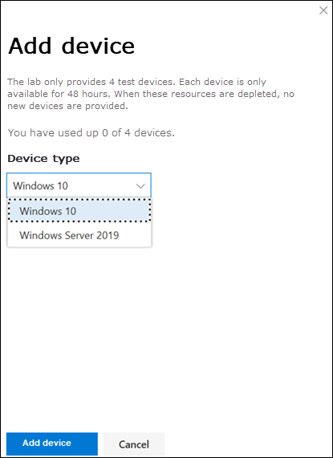

# Microsoft Defender for Endpoint 評估實驗室Microsoft Defender for Endpoint evaluation lab

[!INCLUDE [Microsoft 365 Defender rebranding](../../includes/microsoft-defender.md)]

**適用於：****Applies to:**
- [適用於端點的 Microsoft DefenderMicrosoft Defender for Endpoint](https://go.microsoft.com/fwlink/?linkid=2154037)
- [Microsoft 365 DefenderMicrosoft 365 Defender](https://go.microsoft.com/fwlink/?linkid=2118804)

>想要體驗適用於端點的 Microsoft Defender 嗎？Want to experience Microsoft Defender for Endpoint? [注册免費試用版。Sign up for a free trial.](https://www.microsoft.com/microsoft-365/windows/microsoft-defender-atp?ocid=docs-wdatp-enablesiem-abovefoldlink)

進行完整的安全性產品評估可能是複雜的程式，需要很繁瑣的環境和裝置設定，才能實際執行端對端的攻擊模擬。Conducting a comprehensive security product evaluation can be a complex process requiring cumbersome environment and device configuration before an end-to-end attack simulation can actually be done. 新增至複雜性是追蹤評估期間反映類比活動、警示和結果的難度。Adding to the complexity is the challenge of tracking where the simulation activities, alerts, and results are reflected during the evaluation.

Microsoft Defender for Endpoint 評估實驗室的設計是為了消除裝置和環境設定的複雜性，使您能夠專注于評估平臺的功能、執行模擬，以及查看動作中的預防、偵測和修正功能。The Microsoft Defender for Endpoint evaluation lab is designed to eliminate the complexities of device and environment configuration so that you can  focus on evaluating the capabilities of the platform, running simulations, and seeing the prevention, detection, and remediation features in action.

> [!VIDEO https://www.microsoft.com/en-us/videoplayer/embed/RE4qLUM]

使用簡化的設定體驗，您可以將重點放在執行您自己的測試案例和預先類比，以查看如何執行的 Defender for Endpoint。With the simplified set-up experience, you can focus on running your own test scenarios and the pre-made simulations to see how Defender for Endpoint performs. 

您將擁有平臺強大功能的完整存取權，例如自動化調查、高級搜尋和威脅分析，可讓您測試已提供的 Defender for Endpoint 的綜合保護堆疊。You'll have full access to the powerful capabilities of the platform such as automated investigations, advanced hunting, and threat analytics, allowing you to test the comprehensive protection stack that Defender for Endpoint offers. 

您可以將預先設定的 Windows 10 或 Windows 伺服器2019裝置，新增至適當的作業系統版本和正確的安全性元件，以及已安裝 Office 2019 Standard。You can add Windows 10 or Windows Server 2019 devices that come pre-configured to have the latest OS versions and the right security components in place as well as Office 2019 Standard installed.

您也可以安裝威脅模擬器。You can also install threat simulators. Defender for Endpoint 已與業界領先的威脅類比平臺合作，協助您測試用於端點功能的 Defender，而不需要離開入口網站。Defender for Endpoint has partnered with industry leading threat simulation platforms to help you test out the Defender for Endpoint capabilities without having to leave the portal.

 安裝您慣用的模擬器、在評估實驗室內執行案例，並立即查看平臺的執行方式-所有可方便您免費取得，而不需要額外成本。Install your preferred simulator, run scenarios within the evaluation lab, and instantly see how the platform performs - all conveniently available at no extra cost to you. 您也可以輕鬆存取您可以從模擬目錄存取及執行的大量類比。You'll also have convenient access to wide array of simulations which you can access and run from the simulations catalog.
    

## 在您開始之前Before you begin
您將需要履行 [授權需求](minimum-requirements.md#licensing-requirements) ，或擁有 Microsoft Defender for Endpoint 的試用存取權，才能存取評估實驗室。You'll need to fulfill the [licensing requirements](minimum-requirements.md#licensing-requirements) or have trial access to Microsoft Defender for Endpoint to access the evaluation lab.

您必須具有「 **管理安全性設定** 」許可權，才能執行下列動作：You must have **Manage security settings** permissions to:
- 建立實驗室Create the lab
- 建立裝置Create devices
- 重設密碼Reset password
- 建立模擬Create simulations 
 
如果您已啟用角色型存取控制 (RBAC) 並建立至少一部機器群組，使用者必須能夠存取所有機器群組。If you enabled role-based access control (RBAC) and created at least a one machine group, users must have access to All machine groups.

如需詳細資訊，請參閱 [Create and manage roles](user-roles.md)。For more information, see [Create and manage roles](user-roles.md).

想要體驗適用於端點的 Microsoft Defender 嗎？Want to experience Microsoft Defender for Endpoint? [注册免費試用版。Sign up for a free trial.](https://www.microsoft.com/microsoft-365/windows/microsoft-defender-atp?ocid=docs-wdatp-main-abovefoldlink)

## 開始使用實驗室Get started with the lab
您可以從功能表存取 lab。You can access the lab from the menu. 在 [流覽] 功能表中，選取 [ **評估與示教 > 評估實驗室**]。In the navigation menu, select **Evaluation and tutorials > Evaluation lab**.

>[!NOTE]
>- 視您所選取的環境結構類型而定，裝置會在啟用後的指定時數內使用。Depending the type of environment structure you select, devices will be available for the specified number of hours from the day of activation.
>- 每個環境都配有一組有限的測試裝置。Each environment is provisioned with a limited set of test devices. 當您已使用已布建的裝置，並已將其刪除之後，您可以要求更多裝置。When you've used up the provisioned devices and have deleted them, you can request for more devices. 
>- 您可以每月要求實驗室資源。You can request for lab resources once a month. 

已經有實驗室？Already have a lab? 請務必啟用新的威脅模擬器，並具有作用中裝置。Make sure to enable the new threat simulators and have active devices.

## 設定評估實驗室Setup the evaluation lab

1. 在功能窗格中，選取 [**評估與教程**  >  **評估實驗室**]，然後選取 [**安裝實驗室**]。In the navigation pane, select **Evaluation and tutorials** > **Evaluation lab**, then select **Setup lab**.

    

2. 視您的評估需求而定，您可以選擇在較短的期間內使用較少的裝置來設定環境，而不是更長的時間。Depending on your evaluation needs, you can choose to setup an environment with fewer devices for a longer period or more devices for a shorter period. 選取您偏好的實驗室設定，然後選取 **[下一步]**。Select your preferred lab configuration then select **Next**.

     

3.  (選用) 您可以選擇在實驗室中安裝威脅模擬器。(Optional) You can choose to install threat simulators in the lab. 

    

    >[!IMPORTANT]
    >您必須先接受並提供條款和資訊共用語句的同意。You'll first need to accept and provide consent to the terms and information sharing statements. 

4. 選取您要使用的威脅模擬代理程式，並輸入您的詳細資料。Select the threat simulation agent you'd like to use and enter your details. 您也可以選擇稍後安裝威脅模擬器。You can also choose to install threat simulators at a later time. 如果您選擇在實驗室設定期間安裝威脅模擬代理程式，您可以享受在所加入的裝置上輕鬆安裝的優點。If you choose to install threat simulation agents during the lab setup, you'll enjoy the benefit of having them conveniently installed on the devices you add.  
    
    

5.  查看摘要，然後選取 [ **安裝實驗室**]。Review the summary and select **Setup lab**.  

實驗室安裝程式完成後，您可以新增裝置和執行模擬。After the lab setup process is complete, you can add devices and run simulations. 

## 新增裝置Add devices
當您在環境中新增裝置時，終結點會設定具有連線詳細資料的完善設定裝置。When you add a device to your environment, Defender for Endpoint sets up a well-configured device with connection details. 您可以新增 Windows 10 或 Windows 伺服器2019裝置。You can add Windows 10 or Windows Server 2019 devices.

裝置將會以最新版本的作業系統 2019 Office 和其他應用程式（例如 JAVA、Python 和 SysIntenals）進行設定。The device will be configured with the most up-to-date version of the OS and Office 2019 Standard as well as other apps such as Java, Python, and SysIntenals. 

如果您選擇在實驗室設定期間新增威脅模擬器，所有裝置都會在您新增的裝置中安裝威脅模擬器代理程式。If you chose to add a threat simulator during the lab setup, all devices will have the threat simulator agent installed in the devices that you add.

裝置將會自動架至您的租使用者，並將建議的 Windows 安全性元件開啟和稽核模式-沒有任何工作您的一邊。The device will automatically be onboarded to your tenant with the recommended Windows security components turned on and in audit mode - with no effort on your side. 

在測試裝置中預先設定下列安全性元件：The following security components are pre-configured in the test devices:

- [攻擊面縮減Attack surface reduction](https://docs.microsoft.com/windows/security/threat-protection/windows-defender-exploit-guard/attack-surface-reduction-exploit-guard)
- [第一次看到的封鎖Block at first sight](https://docs.microsoft.com/windows/security/threat-protection/microsoft-defender-antivirus/configure-block-at-first-sight-microsoft-defender-antivirus)
- [受控資料夾存取權Controlled folder access](https://docs.microsoft.com/windows/security/threat-protection/windows-defender-exploit-guard/controlled-folders-exploit-guard)
- [入侵防護Exploit protection](https://docs.microsoft.com/windows/security/threat-protection/windows-defender-exploit-guard/enable-exploit-protection)
- [網路保護Network protection](https://docs.microsoft.com/windows/security/threat-protection/windows-defender-exploit-guard/network-protection-exploit-guard)
- [可能有害的應用程式偵測Potentially unwanted application detection](https://docs.microsoft.com/windows/security/threat-protection/microsoft-defender-antivirus/detect-block-potentially-unwanted-apps-microsoft-defender-antivirus)
- [雲端提供的保護Cloud-delivered protection](https://docs.microsoft.com/windows/security/threat-protection/microsoft-defender-antivirus/utilize-microsoft-cloud-protection-microsoft-defender-antivirus)
- [Microsoft Defender SmartScreenMicrosoft Defender SmartScreen](https://docs.microsoft.com/windows/security/threat-protection/windows-defender-smartscreen/windows-defender-smartscreen-overview)

>[!NOTE]
> Microsoft Defender 防毒軟體會在 (不是在審計模式) 中。Microsoft Defender Antivirus will be on (not in audit mode). 如果 Microsoft Defender 防毒軟體封鎖您執行類比，您可以透過 Windows 安全性關閉裝置上的即時保護。If Microsoft Defender Antivirus blocks you from running your simulation, you can turn off real-time protection on the device through Windows Security. 如需詳細資訊，請參閱 [Configure always on protection](https://docs.microsoft.com/windows/security/threat-protection/microsoft-defender-antivirus/configure-real-time-protection-microsoft-defender-antivirus)。For more information, see [Configure always-on protection](https://docs.microsoft.com/windows/security/threat-protection/microsoft-defender-antivirus/configure-real-time-protection-microsoft-defender-antivirus).

自動調查設定會因租使用者設定而異。Automated investigation settings will be dependent on tenant settings. 預設會將其設定為半自動。It will be configured to be semi-automated by default. 如需詳細資訊，請參閱 [自動化調查的概述](automated-investigations.md)。For more information, see [Overview of Automated investigations](automated-investigations.md).

>[!NOTE]
>使用 RDP 進行與測試裝置的連線。The connection to the test devices is done using RDP. 請確定您的防火牆設定允許 RDP 連線。Make sure that your firewall settings allow RDP connections.

1. 從儀表板中，選取 [ **新增裝置**]。From the dashboard, select **Add device**. 

2. 選擇要新增的裝置類型。Choose the type of device to add. 您可以選擇新增 Windows 10 或 Windows 伺服器2019。You can choose to add Windows 10 or Windows Server 2019.

    

    >[!NOTE]
    >如果在建立裝置時出現問題，您將會收到通知，您必須提交新的要求。If something goes wrong with the device creation process, you'll be notified and you'll need to submit a new request. 如果裝置建立失敗，不會將它計入總允許配額。If the device creation fails, it will not be counted against the overall allowed quota. 

3. 隨即會顯示連線詳細資料。The connection details are displayed. 選取 [ **複製** ]，以儲存裝置的密碼。Select **Copy** to save the password for the device.

    >[!NOTE]
    >密碼只會顯示一次。The password is only displayed once. 請務必將其儲存以供日後使用。Be sure to save it for later use.

    

4. 裝置設定開始。Device set up begins. 這可能需要大約30分鐘。This can take up to approximately 30 minutes. 

5. 選取 [ **裝置** ] 索引標籤，查看測試裝置的狀態、風險和暴露程度，以及模擬程式安裝的狀態。See the status of test devices, the risk and exposure levels, and the status of simulator installations by selecting the **Devices** tab. 

    ![[裝置影像] 索引標籤](images/machines-tab.png)
    

    > [!TIP]
    > 在 [ **模擬器狀態** ] 欄中，您可以將游標移到資訊圖示上，以瞭解代理程式的安裝狀態。In the **Simulator status** column, you can hover over the information icon to know the installation status of an agent.

## 要求更多裝置Request for more devices
當您使用和刪除所有現有的裝置時，您可以要求更多裝置。When all existing devices are used and deleted, you can request for more devices. 您可以每月要求實驗室資源。You can request for lab resources once a month. 

1. 從評估實驗室儀表板中，選取 [ **要求更多裝置**]。From the evaluation lab dashboard, select **Request for more devices**.

   

2. 選擇您的設定。Choose your configuration. 
3. 提交要求。Submit the request. 

當要求順利送出後，您會看到綠色的確認旗標，以及上次提交的日期。When the request is submitted successfully you'll see a green confirmation banner and the date of the last submission.
 
您可以在 [ **使用者動作** ] 索引標籤中找到您的要求狀態，該索引標籤會在幾小時後獲得批准。You can find the status of your request in the **User Actions** tab, which will be approved in a matter of hours.

核准時，所要求的裝置會加入您的實驗室設定，而且您將能夠建立更多裝置。When approved, the requested devices will be added to your lab set up and you’ll be able to create more devices. 

> [!TIP]
> 若要讓您的實驗室更不用，請不要忘記查看模擬文件庫。To get more out of your lab, don’t forget to check out our simulations library.

## 類比攻擊案例Simulate attack scenarios
透過連線來執行您自己的攻擊模擬，以使用測試裝置。Use the test devices to run your own attack simulations by connecting to them. 

您可以使用下列方式模擬攻擊案例：You can simulate attack scenarios using:
- 「 [自行執行它」攻擊案例](https://securitycenter.windows.com/tutorials)The ["Do It Yourself" attack scenarios](https://securitycenter.windows.com/tutorials)
- 威脅模擬器Threat simulators

您也可以使用 [高級搜尋](advanced-hunting-query-language.md) 查詢資料和 [威脅分析](threat-analytics.md) ，以查看有關新興威脅的報告。You can also use [Advanced hunting](advanced-hunting-query-language.md) to query data and [Threat analytics](threat-analytics.md) to view reports about emerging threats.

### 自行攻擊案例Do-it-yourself attack scenarios
如果您正在尋找預先類比，您可以使用我們「 [自己動手」的攻擊案例](https://securitycenter.windows.com/tutorials)。If you are looking for a pre-made simulation, you can use our ["Do It Yourself" attack scenarios](https://securitycenter.windows.com/tutorials). 這些腳本是安全、有記錄且便於使用。These scripts are safe, documented, and easy to use. 這些案例會反映 Defender 的端點功能，並引導您完成調查經驗。These scenarios will reflect Defender for Endpoint capabilities and walk you through investigation experience.

>[!NOTE]
>使用 RDP 進行與測試裝置的連線。The connection to the test devices is done using RDP. 請確定您的防火牆設定允許 RDP 連線。Make sure that your firewall settings allow RDP connections.

1. 連線裝置，並選取 **連線** 以執行攻擊模擬。Connect to your device and run an attack simulation by selecting **Connect**. 

    ![測試裝置的 [連接] 按鈕影像](images/test-machine-table.png)

2. 選取 [**連線**] 以儲存 RDP 檔案並加以啟動。Save the RDP file and launch it by selecting **Connect**.

    

    >[!NOTE]
    >如果您沒有在初始設定期間儲存的密碼複本，您可以從功能表中選取 [ **重設密碼** ] 以重設密碼： If you don't have a copy of the password saved during the initial setup, you can reset the password by selecting **Reset password** from the menu:  
    > 裝置會將其狀態變更為「執行重新設定密碼」，然後您會在幾分鐘內看到新的密碼。The device will change it’s state to “Executing password reset", then you’ll be presented with your new password in a few minutes.

3. 輸入在裝置建立步驟中顯示的密碼。Enter the password that was displayed during the device creation step. 

   

4. 在裝置上執行自行攻擊模擬。Run Do-it-yourself attack simulations on the device. 

### 威脅模擬案例Threat simulator scenarios
如果您選擇在實驗室設定期間安裝任何受支援的威脅模擬器，您可以在評估實驗室裝置上執行內建模擬。If you chose to install any of the supported threat simulators during the lab setup, you can run the built-in simulations on the evaluation lab devices. 

使用協力廠商平臺執行威脅模擬是一種很好的方法，可以在實驗室環境的範圍內評估 Microsoft Defender for Endpoint 功能。Running threat simulations using third-party platforms is a good way to evaluate Microsoft Defender for Endpoint capabilities within the confines of a lab environment.

>[!NOTE]
>在您可以執行模擬之前，請確定符合下列需求：Before you can run simulations, ensure the following requirements are met:
>- 裝置必須新增至評估實驗室Devices must be added to the evaluation lab
>- 威脅模擬器必須安裝在評估實驗室中Threat simulators must be installed in the evaluation lab

1. 從入口網站選取 [ **建立類比**]。From the portal select **Create simulation**.

2. 選取威脅模擬器。Select a threat simulator.

    

3. 選擇類比或查看類比圖庫，以流覽可用模擬。Choose a simulation or look through the simulation gallery to browse through the available simulations. 

    您可以從下列專案進入類比庫：You can get to the simulation gallery from:
    - **模擬一覽表** 磚中的主要評估儀表板或The main evaluation dashboard in the **Simulations overview** tile or
    - 透過流覽流覽窗格 **評估與示教**  >  **類比 & 教學** 課程，然後選取 [**模擬目錄**]。By navigating from the navigation pane **Evaluation and tutorials** > **Simulation & tutorials**, then select **Simulations catalog**.

4. 選取您要在其中執行模擬的裝置。Select the devices where you'd like to run the simulation on.

5. 選取 [ **建立類比**]。Select **Create simulation**.

6. 選取 [ **模擬** ] 索引標籤，以查看模擬的進度。查看類比狀態、作用中警示和其他詳細資料。View the progress of a simulation by selecting the **Simulations** tab. View the simulation state, active alerts, and other details. 

    
    
執行模擬後，我們鼓勵您逐步完成實驗室進度列，並探索 **Microsoft Defender For Endpoint 會觸發自動調查和修正**。After running your simulations, we encourage you to walk through the lab progress bar and explore **Microsoft Defender for Endpoint triggered an automated investigation and remediation**. 查看由功能收集及分析的證據。Check out the evidence collected and analyzed by the feature.

使用豐富的查詢語言和原始遙測，並查看在威脅分析中所記錄的一些世界範圍威脅，以透過「高級搜尋」搜尋攻擊證據。Hunt for attack evidence through advanced hunting by using the rich query language and raw telemetry and check out some world-wide threats documented in Threat analytics.

## 類比圖庫Simulation gallery
Microsoft Defender for Endpoint 已與各種威脅模擬平臺產生合作，讓您能輕鬆地從入口網站中測試平臺的功能。Microsoft Defender for Endpoint has partnered with various threat simulation platforms to give you convenient access to test the capabilities of the platform right from the within the portal. 

從功能表移至 [**類比] 和 [教程**  >  **模擬] 目錄**，以查看所有可用的模擬。View all the available simulations by going to  **Simulations and tutorials** > **Simulations catalog**  from the menu. 

列出支援的協力廠商威脅模擬代理程式清單，並在目錄上提供特定類型的模擬，以及詳細描述。A list of supported third-party threat simulation agents are listed, and specific types of simulations along with detailed descriptions are provided on the catalog. 

您可以從目錄輕鬆執行任何可用的類比。You can conveniently run any available simulation right from the catalog.  

每個類比都具有攻擊案例的深入描述，如使用的 MITRE 攻擊技術和您執行的高級搜尋查詢範例。Each simulation comes with an in-depth description of the attack scenario and references such as the MITRE attack techniques used and sample Advanced hunting queries you run.

**範例：** 
 **Examples:**

## 評估報告Evaluation report
實驗室報告會摘要在裝置上進行模擬的結果。The lab reports summarize the results of the simulations conducted on the devices.

您很快就能看到：At a glance, you'll quickly be able to see:
- 觸發的事件Incidents that were triggered
- 產生的提醒Generated alerts
- 針對公開層級的評估Assessments on exposure level 
- 觀測威脅類別Threat categories observed
- 偵測來源Detection sources
- 自動化調查Automated investigations

## 提供意見反應Provide feedback
您的意見反應可協助我們從高級攻擊中保護您的環境。Your feedback helps us get better in protecting your environment from advanced attacks. 與產品功能和評估結果共用您的經驗與印象。Share your experience and impressions from product capabilities and evaluation results.

您可以選擇 [ **提供意見** 反應]，讓我們知道您的想法。Let us know what you think, by selecting **Provide feedback**.

