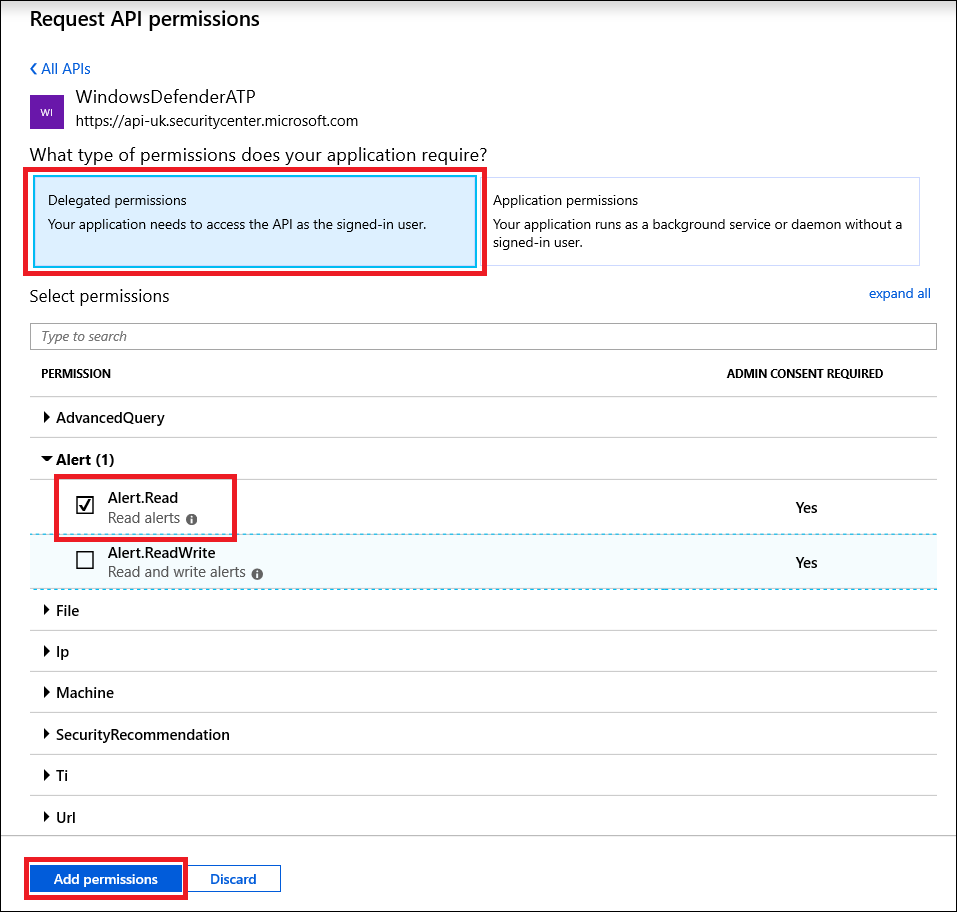

# <a name="use-microsoft-defender-for-endpoint-apis"></a>使用 Microsoft Defender for Endpoint APIs

[!INCLUDE [Microsoft 365 Defender rebranding](../../includes/microsoft-defender.md)]


**適用於：**
- [適用於端點的 Microsoft Defender](https://go.microsoft.com/fwlink/?linkid=2154037)

> 想要體驗適用於端點的 Microsoft Defender 嗎？ [注册免費試用版。](https://www.microsoft.com/microsoft-365/windows/microsoft-defender-atp?ocid=docs-wdatp-exposedapis-abovefoldlink)

[!include[Microsoft Defender for Endpoint API URIs for US Government](../../includes/microsoft-defender-api-usgov.md)]

[!include[Improve request performance](../../includes/improve-request-performance.md)]

此頁面說明如何建立應用程式，以在代表使用者對 Defender for Endpoint 的程式設計中取得存取權。

如果您需要以程式設計方式存取 Microsoft Defender for Endpoint，但沒有使用者，請參閱 [Access Microsoft defender For endpoint with application coNtext](exposed-apis-create-app-webapp.md)。

如果您不確定需要哪一種存取權，請閱讀 [ [簡介] 頁面](apis-intro.md)。

Microsoft Defender for Endpoint 會透過一組程式設計 APIs 公開其資料和動作。 這些 APIs 可讓您根據 Microsoft Defender for Endpoint 功能來自動化工作流程及創新。 API 存取需要 OAuth 2.0 驗證。 如需詳細資訊，請參閱[OAuth 2.0 授權碼 Flow](https://docs.microsoft.com/azure/active-directory/develop/active-directory-v2-protocols-oauth-code)。

一般來講，您必須採取下列步驟，才能使用 APIs：
- 建立 AAD 應用程式
- 使用此應用程式取得存取 token
- 使用權杖來存取適用于 Endpoint API 的 Defender

此頁面說明如何建立 AAD 應用程式、取得 Microsoft Defender for Endpoint 的存取權杖，以及驗證權杖。

>[!NOTE]
> 當代表使用者存取 Microsoft Defender for Endpoint API 時，您將需要正確的應用程式許可權和使用者許可權。
> 如果您不熟悉 Microsoft Defender for Endpoint 的使用者權限，請參閱 [使用以角色為基礎的存取控制管理入口網站存取](rbac.md)。

>[!TIP]
> 如果您有許可權執行入口網站中的動作，您就具有在 API 中執行該動作的許可權。

## <a name="create-an-app"></a>建立應用程式

1. 使用具有 **全域系統管理員** 角色的使用者帳戶，登入 [Azure](https://portal.azure.com) 。

2. 流覽至 **Azure Active Directory**  >  **App 註冊**  >  **新註冊**。 

   

3. 當出現 [ **註冊應用程式** ] 頁面時，請輸入您的應用程式的註冊資訊：

   - **Name** -輸入將向應用程式使用者顯示的有意義應用程式名稱。
   - **支援的帳戶類型** -選取您要讓應用程式支援的帳戶。

       | 支援的帳戶類型 | 描述 |
       |-------------------------|-------------|
       | **僅限此組織目錄中的帳戶** | 如果您要建立企業營運 (LOB) 應用程式，請選取此選項。 如果您不是在目錄中註冊應用程式，則無法使用此選項。<br><br>此選項只會對應至 Azure AD 單一承租人。<br><br>除非您是在目錄外註冊應用程式，否則此為預設選項。 當應用程式在目錄外註冊時，預設值是 Azure AD 多方租使用者和個人 Microsoft 帳戶。 |
       | **任何組織目錄中的帳戶** | 如果您想要將所有商務及教育客戶都瞄準，請選取此選項。<br><br>此選項會對應至僅限 Azure AD 多承租人。<br><br>若您將應用程式註冊為僅限 Azure AD 單一租使用者，您可以透過 **驗證** blade 將它更新為 azure ad 多租使用者並傳回單一租使用者。 |
       | **任何組織目錄和個人 Microsoft 帳戶中的帳戶** | 選取此選項以針對最廣泛的一組客戶。<br><br>此選項會對應至 Azure AD 多承租人和個人 Microsoft 帳戶。<br><br>如果您將應用程式註冊為 Azure AD 多承租人和個人 Microsoft 帳戶，則無法在 UI 中變更此項。 相反地，您必須使用應用程式資訊清單編輯器來變更支援的帳戶類型。 |

   - 重新 **導向 URI (選用)** -選取您要建立的應用程式類型、**網頁** 或 **公用用戶端 (行動 & 桌面)**，然後輸入應用程式的重新導向 URI (或回復 URL) 。
       - 針對 web 應用程式，提供應用程式的基底 URL。 例如， `http://localhost:31544` 可能是在本機電腦上執行之 web 應用程式的 URL。 使用者會使用此 URL 登入 web 用戶端應用程式。
       - 若為公用用戶端應用程式，請提供 Azure AD 用來傳回權杖回應的 URI。 輸入應用程式的特定值，例如 `myapp://auth` 。

     若要查看 web 應用程式或原生應用程式的特定範例，請查看我們的 [快速入門](/azure/active-directory/develop/#quickstarts)。

     完成時，請選取 [ **註冊**]。

4. 允許您的應用程式存取 Microsoft Defender for Endpoint，並指派「讀取警示」許可權：

    - 在 [應用程式] 頁面上，選取 [ **API 許可權**  >  **新增許可權**  >  **APIs 我的組織使用**> 類型 **WindowsDefenderATP** ]，然後選取 [ **WindowsDefenderATP**]。

    - **附注**： *WindowsDefenderATP* 不會出現在原始清單中。 開始在文字方塊中寫入其名稱，以查看顯示。

      

    - 選擇 [**委派許可權**]  >  **警示。讀取**> 選取 [**新增許可權**]

      

    - **重要事項**：請選取相關的許可權。 讀取警示只是一個範例。

      例如，

      - 若要 [執行高級查詢](run-advanced-query-api.md)，請選取「執行高級查詢」許可權
      - 若要 [隔離裝置](isolate-machine.md)，請選取「隔離電腦」許可權
      - 若要決定您需要的許可權，請在您想要呼叫的 API 中查看 [ **許可權** ] 區段。

    - 選取 **[授與同意**]

      **附注**：每次您新增許可權時，您必須選取 **[授與同意** 才能讓新許可權同意]。

      

6. 記下來記錄應用程式識別碼和您的租使用者 ID:

   - 在 [應用程式] 頁面上，移至 **[簡介** ]，然後複製下列資訊：

   


## <a name="get-an-access-token"></a>取得存取權杖

如需 AAD 權杖的詳細資訊，請參閱[AZURE AD 教學](https://docs.microsoft.com/azure/active-directory/develop/active-directory-v2-protocols-oauth-client-creds)課程

### <a name="using-c"></a>使用 C#

- 在您的應用程式中複製/貼上下列類別。
- 使用 **AcquireUserTokenAsync** 方法搭配您的應用程式識別碼、租使用者識別碼、使用者名稱和密碼來取得權杖。

    ```csharp
    namespace WindowsDefenderATP
    {
        using System.Net.Http;
        using System.Text;
        using System.Threading.Tasks;
        using Newtonsoft.Json.Linq;

        public static class WindowsDefenderATPUtils
        {
            private const string Authority = "https://login.microsoftonline.com";

            private const string WdatpResourceId = "https://api.securitycenter.microsoft.com";

            public static async Task<string> AcquireUserTokenAsync(string username, string password, string appId, string tenantId)
            {
                using (var httpClient = new HttpClient())
                {
                    var urlEncodedBody = $"resource={WdatpResourceId}&client_id={appId}&grant_type=password&username={username}&password={password}";

                    var stringContent = new StringContent(urlEncodedBody, Encoding.UTF8, "application/x-www-form-urlencoded");

                    using (var response = await httpClient.PostAsync($"{Authority}/{tenantId}/oauth2/token", stringContent).ConfigureAwait(false))
                    {
                        response.EnsureSuccessStatusCode();

                        var json = await response.Content.ReadAsStringAsync().ConfigureAwait(false);

                        var jObject = JObject.Parse(json);

                        return jObject["access_token"].Value<string>();
                    }
                }
            }
        }
    }
    ```

## <a name="validate-the-token"></a>驗證 token

請確認您獲得正確的權杖：
- 複製/貼上您在上一個步驟中所 [掌握的權杖](https://jwt.ms) ，以進行解碼。
- 驗證您取得「scp」宣告所需的應用程式許可權
- 在下列螢幕擷取畫面中，您可以看到在教學課程中從應用程式取得的解碼權杖：


## <a name="use-the-token-to-access-microsoft-defender-for-endpoint-api"></a>使用權杖來存取 Microsoft Defender for Endpoint API

- 選擇您要使用的 API- [支援的 Microsoft Defender For Endpoint APIs](exposed-apis-list.md)
- 在您傳送至 "載荷 {token}" 的 HTTP 要求中設定授權標頭 (載荷是授權配置) 
- 權杖的到期時間是1小時 (您可以使用相同的權杖傳送一個以上的要求) 

- **使用 c #** 傳送要求以取得警示清單的範例 

    ```csharp
    var httpClient = new HttpClient();

    var request = new HttpRequestMessage(HttpMethod.Get, "https://api.securitycenter.microsoft.com/api/alerts");

    request.Headers.Authorization = new AuthenticationHeaderValue("Bearer", token);

    var response = httpClient.SendAsync(request).GetAwaiter().GetResult();

    // Do something useful with the response
    ```

## <a name="see-also"></a>請參閱
- [Microsoft Defender for Endpoint APIs](exposed-apis-list.md)
- [使用應用程式內容存取 Microsoft Defender for Endpoint](exposed-apis-create-app-webapp.md)
