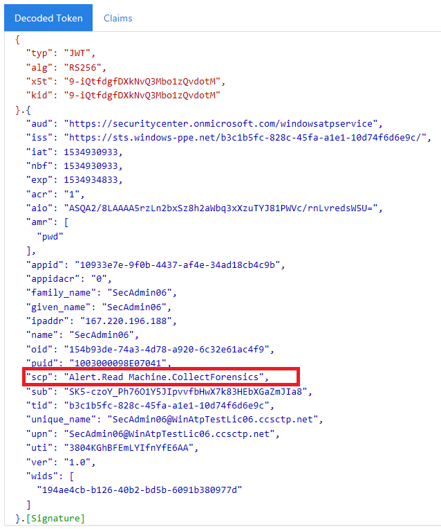

# <a name="use-microsoft-defender-for-endpoint-apis"></a><span data-ttu-id="6b36e-104">使用 Microsoft Defender for Endpoint APIs</span><span class="sxs-lookup"><span data-stu-id="6b36e-104">Use Microsoft Defender for Endpoint APIs</span></span>

[!INCLUDE [Microsoft 365 Defender rebranding](../../includes/microsoft-defender.md)]


<span data-ttu-id="6b36e-105">**適用於：**</span><span class="sxs-lookup"><span data-stu-id="6b36e-105">**Applies to:**</span></span>
- [<span data-ttu-id="6b36e-106">適用於端點的 Microsoft Defender</span><span class="sxs-lookup"><span data-stu-id="6b36e-106">Microsoft Defender for Endpoint</span></span>](https://go.microsoft.com/fwlink/?linkid=2154037)

> <span data-ttu-id="6b36e-107">想要體驗 Microsoft Defender for Endpoint？</span><span class="sxs-lookup"><span data-stu-id="6b36e-107">Want to experience Microsoft Defender for Endpoint?</span></span> [<span data-ttu-id="6b36e-108">註冊免費試用版。</span><span class="sxs-lookup"><span data-stu-id="6b36e-108">Sign up for a free trial.</span></span>](https://www.microsoft.com/microsoft-365/windows/microsoft-defender-atp?ocid=docs-wdatp-exposedapis-abovefoldlink)

[!include[Microsoft Defender for Endpoint API URIs for US Government](../../includes/microsoft-defender-api-usgov.md)]

[!include[Improve request performance](../../includes/improve-request-performance.md)]

<span data-ttu-id="6b36e-109">此頁面說明如何建立應用程式，以在代表使用者對 Defender for Endpoint 的程式設計中取得存取權。</span><span class="sxs-lookup"><span data-stu-id="6b36e-109">This page describes how to create an application to get programmatic access to Defender for Endpoint on behalf of a user.</span></span>

<span data-ttu-id="6b36e-110">如果您需要以程式設計方式存取 Microsoft Defender for Endpoint，但沒有使用者，請參閱 [Access Microsoft defender For endpoint with application coNtext](exposed-apis-create-app-webapp.md)。</span><span class="sxs-lookup"><span data-stu-id="6b36e-110">If you need programmatic access Microsoft Defender for Endpoint without a user, refer to [Access Microsoft Defender for Endpoint with application context](exposed-apis-create-app-webapp.md).</span></span>

<span data-ttu-id="6b36e-111">如果您不確定需要哪一種存取權，請閱讀 [ [簡介] 頁面](apis-intro.md)。</span><span class="sxs-lookup"><span data-stu-id="6b36e-111">If you are not sure which access you need, read the [Introduction page](apis-intro.md).</span></span>

<span data-ttu-id="6b36e-112">Microsoft Defender for Endpoint 會透過一組程式設計 APIs 公開其資料和動作。</span><span class="sxs-lookup"><span data-stu-id="6b36e-112">Microsoft Defender for Endpoint exposes much of its data and actions through a set of programmatic APIs.</span></span> <span data-ttu-id="6b36e-113">這些 APIs 可讓您根據 Microsoft Defender for Endpoint 功能來自動化工作流程及創新。</span><span class="sxs-lookup"><span data-stu-id="6b36e-113">Those APIs will enable you to automate work flows and innovate based on Microsoft Defender for Endpoint capabilities.</span></span> <span data-ttu-id="6b36e-114">API 存取需要 OAuth 2.0 驗證。</span><span class="sxs-lookup"><span data-stu-id="6b36e-114">The API access requires OAuth2.0 authentication.</span></span> <span data-ttu-id="6b36e-115">如需詳細資訊，請參閱 [OAuth 2.0 授權碼流程](https://docs.microsoft.com/azure/active-directory/develop/active-directory-v2-protocols-oauth-code)。</span><span class="sxs-lookup"><span data-stu-id="6b36e-115">For more information, see [OAuth 2.0 Authorization Code Flow](https://docs.microsoft.com/azure/active-directory/develop/active-directory-v2-protocols-oauth-code).</span></span>

<span data-ttu-id="6b36e-116">一般來講，您必須採取下列步驟，才能使用 APIs：</span><span class="sxs-lookup"><span data-stu-id="6b36e-116">In general, you’ll need to take the following steps to use the APIs:</span></span>
- <span data-ttu-id="6b36e-117">建立 AAD 應用程式</span><span class="sxs-lookup"><span data-stu-id="6b36e-117">Create an AAD application</span></span>
- <span data-ttu-id="6b36e-118">使用此應用程式取得存取 token</span><span class="sxs-lookup"><span data-stu-id="6b36e-118">Get an access token using this application</span></span>
- <span data-ttu-id="6b36e-119">使用權杖來存取適用于 Endpoint API 的 Defender</span><span class="sxs-lookup"><span data-stu-id="6b36e-119">Use the token to access Defender for Endpoint API</span></span>

<span data-ttu-id="6b36e-120">此頁面說明如何建立 AAD 應用程式、取得 Microsoft Defender for Endpoint 的存取權杖，以及驗證權杖。</span><span class="sxs-lookup"><span data-stu-id="6b36e-120">This page explains how to create an AAD application, get an access token to Microsoft Defender for Endpoint and validate the token.</span></span>

>[!NOTE]
> <span data-ttu-id="6b36e-121">當代表使用者存取 Microsoft Defender for Endpoint API 時，您將需要正確的應用程式許可權和使用者許可權。</span><span class="sxs-lookup"><span data-stu-id="6b36e-121">When accessing Microsoft Defender for Endpoint API on behalf of a user, you will need the correct Application permission and user permission.</span></span>
> <span data-ttu-id="6b36e-122">如果您不熟悉 Microsoft Defender for Endpoint 的使用者權限，請參閱 [使用以角色為基礎的存取控制管理入口網站存取](rbac.md)。</span><span class="sxs-lookup"><span data-stu-id="6b36e-122">If you are not familiar with user permissions on Microsoft Defender for Endpoint, see [Manage portal access using role-based access control](rbac.md).</span></span>

>[!TIP]
> <span data-ttu-id="6b36e-123">如果您有許可權執行入口網站中的動作，您就具有在 API 中執行該動作的許可權。</span><span class="sxs-lookup"><span data-stu-id="6b36e-123">If you have the permission to perform an action in the portal, you have the permission to perform the action in the API.</span></span>

## <a name="create-an-app"></a><span data-ttu-id="6b36e-124">建立應用程式</span><span class="sxs-lookup"><span data-stu-id="6b36e-124">Create an app</span></span>

1. <span data-ttu-id="6b36e-125">使用具有 **全域系統管理員** 角色的使用者帳戶，登入 [Azure](https://portal.azure.com) 。</span><span class="sxs-lookup"><span data-stu-id="6b36e-125">Log on to [Azure](https://portal.azure.com) with a user account that has the **Global Administrator** role.</span></span>

2. <span data-ttu-id="6b36e-126">流覽至 [ **Azure Active Directory**  >  **應用程式註冊**]  >  **新註冊**。</span><span class="sxs-lookup"><span data-stu-id="6b36e-126">Navigate to **Azure Active Directory** > **App registrations** > **New registration**.</span></span> 

   

3. <span data-ttu-id="6b36e-128">當出現 [ **註冊應用程式** ] 頁面時，請輸入您的應用程式的註冊資訊：</span><span class="sxs-lookup"><span data-stu-id="6b36e-128">When the **Register an application** page appears, enter your application's registration information:</span></span>

   - <span data-ttu-id="6b36e-129">**Name** -輸入將向應用程式使用者顯示的有意義應用程式名稱。</span><span class="sxs-lookup"><span data-stu-id="6b36e-129">**Name** - Enter a meaningful application name that will be displayed to users of the app.</span></span>
   - <span data-ttu-id="6b36e-130">**支援的帳戶類型** -選取您要讓應用程式支援的帳戶。</span><span class="sxs-lookup"><span data-stu-id="6b36e-130">**Supported account types** - Select which accounts you would like your application to support.</span></span>

       | <span data-ttu-id="6b36e-131">支援的帳戶類型</span><span class="sxs-lookup"><span data-stu-id="6b36e-131">Supported account types</span></span> | <span data-ttu-id="6b36e-132">描述</span><span class="sxs-lookup"><span data-stu-id="6b36e-132">Description</span></span> |
       |-------------------------|-------------|
       | <span data-ttu-id="6b36e-133">**僅限此組織目錄中的帳戶**</span><span class="sxs-lookup"><span data-stu-id="6b36e-133">**Accounts in this organizational directory only**</span></span> | <span data-ttu-id="6b36e-134">如果您要建立企業營運 (LOB) 應用程式，請選取此選項。</span><span class="sxs-lookup"><span data-stu-id="6b36e-134">Select this option if you're building a line-of-business (LOB) application.</span></span> <span data-ttu-id="6b36e-135">如果您不是在目錄中註冊應用程式，則無法使用此選項。</span><span class="sxs-lookup"><span data-stu-id="6b36e-135">This option is not available if you're not registering the application in a directory.</span></span><br><br><span data-ttu-id="6b36e-136">此選項只會對應至 Azure AD 單一承租人。</span><span class="sxs-lookup"><span data-stu-id="6b36e-136">This option maps to Azure AD only single-tenant.</span></span><br><br><span data-ttu-id="6b36e-137">除非您是在目錄外註冊應用程式，否則此為預設選項。</span><span class="sxs-lookup"><span data-stu-id="6b36e-137">This is the default option unless you're registering the app outside of a directory.</span></span> <span data-ttu-id="6b36e-138">當應用程式在目錄外註冊時，預設值是 Azure AD 多方租使用者和個人 Microsoft 帳戶。</span><span class="sxs-lookup"><span data-stu-id="6b36e-138">In cases where the app is registered outside of a directory, the default is Azure AD multi-tenant and personal Microsoft accounts.</span></span> |
       | <span data-ttu-id="6b36e-139">**任何組織目錄中的帳戶**</span><span class="sxs-lookup"><span data-stu-id="6b36e-139">**Accounts in any organizational directory**</span></span> | <span data-ttu-id="6b36e-140">如果您想要將所有商務及教育客戶都瞄準，請選取此選項。</span><span class="sxs-lookup"><span data-stu-id="6b36e-140">Select this option if you would like to target all business and educational customers.</span></span><br><br><span data-ttu-id="6b36e-141">此選項會對應至僅限 Azure AD 多承租人。</span><span class="sxs-lookup"><span data-stu-id="6b36e-141">This option maps to an Azure AD only multi-tenant.</span></span><br><br><span data-ttu-id="6b36e-142">若您將應用程式註冊為僅限 Azure AD 單一租使用者，您可以透過 **驗證** blade 將它更新為 azure ad 多租使用者並傳回單一租使用者。</span><span class="sxs-lookup"><span data-stu-id="6b36e-142">If you registered the app as Azure AD only single-tenant, you can update it to be Azure AD multi-tenant and back to single-tenant through the **Authentication** blade.</span></span> |
       | <span data-ttu-id="6b36e-143">**任何組織目錄和個人 Microsoft 帳戶中的帳戶**</span><span class="sxs-lookup"><span data-stu-id="6b36e-143">**Accounts in any organizational directory and personal Microsoft accounts**</span></span> | <span data-ttu-id="6b36e-144">選取此選項以針對最廣泛的一組客戶。</span><span class="sxs-lookup"><span data-stu-id="6b36e-144">Select this option to target the widest set of customers.</span></span><br><br><span data-ttu-id="6b36e-145">此選項會對應至 Azure AD 多承租人和個人 Microsoft 帳戶。</span><span class="sxs-lookup"><span data-stu-id="6b36e-145">This option maps to Azure AD multi-tenant and personal Microsoft accounts.</span></span><br><br><span data-ttu-id="6b36e-146">如果您將應用程式註冊為 Azure AD 多承租人和個人 Microsoft 帳戶，則無法在 UI 中變更此項。</span><span class="sxs-lookup"><span data-stu-id="6b36e-146">If you registered the app as Azure AD multi-tenant and personal Microsoft accounts, you cannot change this in the UI.</span></span> <span data-ttu-id="6b36e-147">相反地，您必須使用應用程式資訊清單編輯器來變更支援的帳戶類型。</span><span class="sxs-lookup"><span data-stu-id="6b36e-147">Instead, you must use the application manifest editor to change the supported account types.</span></span> |

   - <span data-ttu-id="6b36e-148">重新 **導向 URI (選用)** -選取您要建立的應用程式類型、**網頁** 或 **公用用戶端 (行動 & 桌面)**，然後輸入應用程式的重新導向 URI (或回復 URL) 。</span><span class="sxs-lookup"><span data-stu-id="6b36e-148">**Redirect URI (optional)** - Select the type of app you're building, **Web** or **Public client (mobile & desktop)**, and then enter the redirect URI (or reply URL) for your application.</span></span>
       - <span data-ttu-id="6b36e-149">針對 web 應用程式，提供應用程式的基底 URL。</span><span class="sxs-lookup"><span data-stu-id="6b36e-149">For web applications, provide the base URL of your app.</span></span> <span data-ttu-id="6b36e-150">例如， `http://localhost:31544` 可能是在本機電腦上執行之 web 應用程式的 URL。</span><span class="sxs-lookup"><span data-stu-id="6b36e-150">For example, `http://localhost:31544` might be the URL for a web app running on your local machine.</span></span> <span data-ttu-id="6b36e-151">使用者會使用此 URL 登入 web 用戶端應用程式。</span><span class="sxs-lookup"><span data-stu-id="6b36e-151">Users would use this URL to sign in to a web client application.</span></span>
       - <span data-ttu-id="6b36e-152">若為公用用戶端應用程式，請提供 Azure AD 用來傳回權杖回應的 URI。</span><span class="sxs-lookup"><span data-stu-id="6b36e-152">For public client applications, provide the URI used by Azure AD to return token responses.</span></span> <span data-ttu-id="6b36e-153">輸入應用程式的特定值，例如 `myapp://auth` 。</span><span class="sxs-lookup"><span data-stu-id="6b36e-153">Enter a value specific to your application, such as `myapp://auth`.</span></span>

     <span data-ttu-id="6b36e-154">若要查看 web 應用程式或原生應用程式的特定範例，請查看我們的 [快速入門](/azure/active-directory/develop/#quickstarts)。</span><span class="sxs-lookup"><span data-stu-id="6b36e-154">To see specific examples for web applications or native applications, check out our [quickstarts](/azure/active-directory/develop/#quickstarts).</span></span>

     <span data-ttu-id="6b36e-155">完成時，請選取 [ **註冊**]。</span><span class="sxs-lookup"><span data-stu-id="6b36e-155">When finished, select **Register**.</span></span>

4. <span data-ttu-id="6b36e-156">允許您的應用程式存取 Microsoft Defender for Endpoint，並指派「讀取警示」許可權：</span><span class="sxs-lookup"><span data-stu-id="6b36e-156">Allow your Application to access Microsoft Defender for Endpoint and assign it 'Read alerts' permission:</span></span>

    - <span data-ttu-id="6b36e-157">在 [應用程式] 頁面上，選取 [ **API 許可權**  >  **新增許可權**  >  **APIs 我的組織使用**> 類型 **WindowsDefenderATP** ]，然後選取 [ **WindowsDefenderATP**]。</span><span class="sxs-lookup"><span data-stu-id="6b36e-157">On your application page, select **API Permissions** > **Add permission** > **APIs my organization uses** > type **WindowsDefenderATP** and select on **WindowsDefenderATP**.</span></span>

    - <span data-ttu-id="6b36e-158">**附注**： *WindowsDefenderATP* 不會出現在原始清單中。</span><span class="sxs-lookup"><span data-stu-id="6b36e-158">**Note**: *WindowsDefenderATP* does not appear in the original list.</span></span> <span data-ttu-id="6b36e-159">開始在文字方塊中寫入其名稱，以查看顯示。</span><span class="sxs-lookup"><span data-stu-id="6b36e-159">Start writing its name in the text box to see it appear.</span></span>

      

    - <span data-ttu-id="6b36e-161">選擇 [**委派許可權**]  >  **警示。讀取**> 選取 [**新增許可權**]</span><span class="sxs-lookup"><span data-stu-id="6b36e-161">Choose **Delegated permissions** > **Alert.Read** > select **Add permissions**</span></span>

      

    - <span data-ttu-id="6b36e-163">**重要事項**：請選取相關的許可權。</span><span class="sxs-lookup"><span data-stu-id="6b36e-163">**Important note**: Select the relevant permissions.</span></span> <span data-ttu-id="6b36e-164">讀取警示只是一個範例。</span><span class="sxs-lookup"><span data-stu-id="6b36e-164">Read alerts is only an example.</span></span>

      <span data-ttu-id="6b36e-165">例如，</span><span class="sxs-lookup"><span data-stu-id="6b36e-165">For instance,</span></span>

      - <span data-ttu-id="6b36e-166">若要 [執行高級查詢](run-advanced-query-api.md)，請選取「執行高級查詢」許可權</span><span class="sxs-lookup"><span data-stu-id="6b36e-166">To [run advanced queries](run-advanced-query-api.md), select 'Run advanced queries' permission</span></span>
      - <span data-ttu-id="6b36e-167">若要 [隔離裝置](isolate-machine.md)，請選取「隔離電腦」許可權</span><span class="sxs-lookup"><span data-stu-id="6b36e-167">To [isolate a device](isolate-machine.md), select 'Isolate machine' permission</span></span>
      - <span data-ttu-id="6b36e-168">若要決定您需要的許可權，請在您想要呼叫的 API 中查看 [ **許可權** ] 區段。</span><span class="sxs-lookup"><span data-stu-id="6b36e-168">To determine which permission you need, view the **Permissions** section in the API you are interested to call.</span></span>

    - <span data-ttu-id="6b36e-169">選取 **[授與同意**]</span><span class="sxs-lookup"><span data-stu-id="6b36e-169">Select **Grant consent**</span></span>

      <span data-ttu-id="6b36e-170">**附注**：每次您新增許可權時，您必須選取 **[授與同意** 才能讓新許可權同意]。</span><span class="sxs-lookup"><span data-stu-id="6b36e-170">**Note**: Every time you add permission you must select on **Grant consent** for the new permission to take effect.</span></span>

      

6. <span data-ttu-id="6b36e-172">記下來記錄應用程式識別碼和您的租使用者 ID:</span><span class="sxs-lookup"><span data-stu-id="6b36e-172">Write down your application ID and your tenant ID:</span></span>

   - <span data-ttu-id="6b36e-173">在 [應用程式] 頁面上，移至 **[簡介** ]，然後複製下列資訊：</span><span class="sxs-lookup"><span data-stu-id="6b36e-173">On your application page, go to **Overview** and copy the following information:</span></span>

   


## <a name="get-an-access-token"></a><span data-ttu-id="6b36e-175">取得存取權杖</span><span class="sxs-lookup"><span data-stu-id="6b36e-175">Get an access token</span></span>

<span data-ttu-id="6b36e-176">如需 AAD 權杖的詳細資訊，請參閱[AZURE AD 教學](https://docs.microsoft.com/azure/active-directory/develop/active-directory-v2-protocols-oauth-client-creds)課程</span><span class="sxs-lookup"><span data-stu-id="6b36e-176">For more information on AAD tokens, see [Azure AD tutorial](https://docs.microsoft.com/azure/active-directory/develop/active-directory-v2-protocols-oauth-client-creds)</span></span>

### <a name="using-c"></a><span data-ttu-id="6b36e-177">使用 C#</span><span class="sxs-lookup"><span data-stu-id="6b36e-177">Using C#</span></span>

- <span data-ttu-id="6b36e-178">在您的應用程式中複製/貼上下列類別。</span><span class="sxs-lookup"><span data-stu-id="6b36e-178">Copy/Paste the below class in your application.</span></span>
- <span data-ttu-id="6b36e-179">使用 **AcquireUserTokenAsync** 方法搭配您的應用程式識別碼、租使用者識別碼、使用者名稱和密碼來取得權杖。</span><span class="sxs-lookup"><span data-stu-id="6b36e-179">Use **AcquireUserTokenAsync** method with your application ID, tenant ID, user name, and password to acquire a token.</span></span>

    ```csharp
    namespace WindowsDefenderATP
    {
        using System.Net.Http;
        using System.Text;
        using System.Threading.Tasks;
        using Newtonsoft.Json.Linq;

        public static class WindowsDefenderATPUtils
        {
            private const string Authority = "https://login.microsoftonline.com";

            private const string WdatpResourceId = "https://api.securitycenter.microsoft.com";

            public static async Task<string> AcquireUserTokenAsync(string username, string password, string appId, string tenantId)
            {
                using (var httpClient = new HttpClient())
                {
                    var urlEncodedBody = $"resource={WdatpResourceId}&client_id={appId}&grant_type=password&username={username}&password={password}";

                    var stringContent = new StringContent(urlEncodedBody, Encoding.UTF8, "application/x-www-form-urlencoded");

                    using (var response = await httpClient.PostAsync($"{Authority}/{tenantId}/oauth2/token", stringContent).ConfigureAwait(false))
                    {
                        response.EnsureSuccessStatusCode();

                        var json = await response.Content.ReadAsStringAsync().ConfigureAwait(false);

                        var jObject = JObject.Parse(json);

                        return jObject["access_token"].Value<string>();
                    }
                }
            }
        }
    }
    ```

## <a name="validate-the-token"></a><span data-ttu-id="6b36e-180">驗證 token</span><span class="sxs-lookup"><span data-stu-id="6b36e-180">Validate the token</span></span>

<span data-ttu-id="6b36e-181">請確認您獲得正確的權杖：</span><span class="sxs-lookup"><span data-stu-id="6b36e-181">Verify to make sure you got a correct token:</span></span>
- <span data-ttu-id="6b36e-182">複製/貼上您在上一個步驟中所 [掌握的權杖](https://jwt.ms) ，以進行解碼。</span><span class="sxs-lookup"><span data-stu-id="6b36e-182">Copy/paste into [JWT](https://jwt.ms) the token you got in the previous step in order to decode it</span></span>
- <span data-ttu-id="6b36e-183">驗證您取得「scp」宣告所需的應用程式許可權</span><span class="sxs-lookup"><span data-stu-id="6b36e-183">Validate you get a 'scp' claim with the desired app permissions</span></span>
- <span data-ttu-id="6b36e-184">在下列螢幕擷取畫面中，您可以看到在教學課程中從應用程式取得的解碼權杖：</span><span class="sxs-lookup"><span data-stu-id="6b36e-184">In the screenshot below you can see a decoded token acquired from the app in the tutorial:</span></span>



## <a name="use-the-token-to-access-microsoft-defender-for-endpoint-api"></a><span data-ttu-id="6b36e-186">使用權杖來存取 Microsoft Defender for Endpoint API</span><span class="sxs-lookup"><span data-stu-id="6b36e-186">Use the token to access Microsoft Defender for Endpoint API</span></span>

- <span data-ttu-id="6b36e-187">選擇您要使用的 API- [支援的 Microsoft Defender For Endpoint APIs](exposed-apis-list.md)</span><span class="sxs-lookup"><span data-stu-id="6b36e-187">Choose the API you want to use - [Supported Microsoft Defender for Endpoint APIs](exposed-apis-list.md)</span></span>
- <span data-ttu-id="6b36e-188">在您傳送至 "載荷 {token}" 的 HTTP 要求中設定授權標頭 (載荷是授權配置) </span><span class="sxs-lookup"><span data-stu-id="6b36e-188">Set the Authorization header in the HTTP request you send to "Bearer {token}" (Bearer is the Authorization scheme)</span></span>
- <span data-ttu-id="6b36e-189">權杖的到期時間是1小時 (您可以使用相同的權杖傳送一個以上的要求) </span><span class="sxs-lookup"><span data-stu-id="6b36e-189">The Expiration time of the token is 1 hour (you can send more than one request with the same token)</span></span>

- <span data-ttu-id="6b36e-190">**使用 c #** 傳送要求以取得警示清單的範例</span><span class="sxs-lookup"><span data-stu-id="6b36e-190">Example of sending a request to get a list of alerts **using C#**</span></span> 

    ```csharp
    var httpClient = new HttpClient();

    var request = new HttpRequestMessage(HttpMethod.Get, "https://api.securitycenter.microsoft.com/api/alerts");

    request.Headers.Authorization = new AuthenticationHeaderValue("Bearer", token);

    var response = httpClient.SendAsync(request).GetAwaiter().GetResult();

    // Do something useful with the response
    ```

## <a name="see-also"></a><span data-ttu-id="6b36e-191">另請參閱</span><span class="sxs-lookup"><span data-stu-id="6b36e-191">See also</span></span>
- [<span data-ttu-id="6b36e-192">Microsoft Defender for Endpoint APIs</span><span class="sxs-lookup"><span data-stu-id="6b36e-192">Microsoft Defender for Endpoint APIs</span></span>](exposed-apis-list.md)
- [<span data-ttu-id="6b36e-193">使用應用程式內容存取 Microsoft Defender for Endpoint</span><span class="sxs-lookup"><span data-stu-id="6b36e-193">Access Microsoft Defender for Endpoint with application context</span></span>](exposed-apis-create-app-webapp.md)
