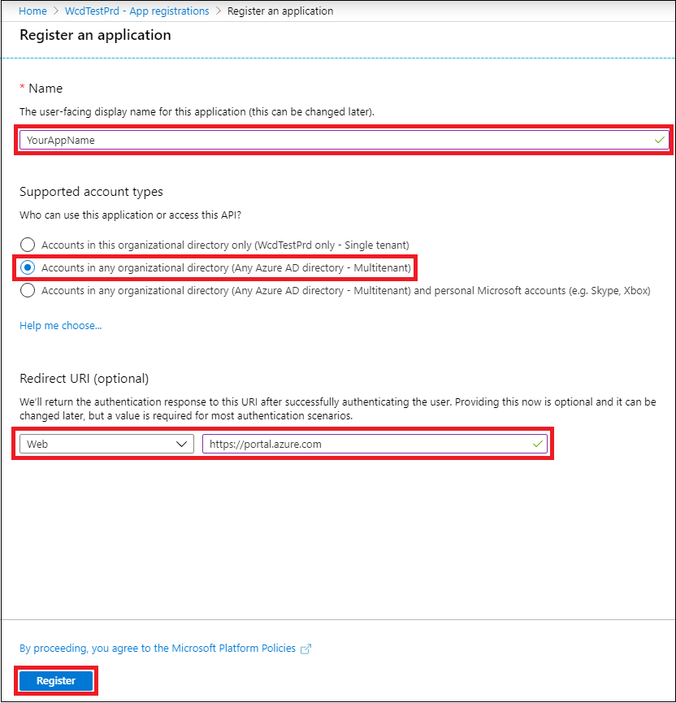
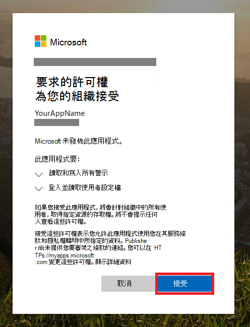

# <a name="partner-access-through-microsoft-defender-for-endpoint-apis"></a><span data-ttu-id="dfe2e-104">透過 Microsoft Defender for Endpoint APIs 取得夥伴存取權</span><span class="sxs-lookup"><span data-stu-id="dfe2e-104">Partner access through Microsoft Defender for Endpoint APIs</span></span>

[!INCLUDE [Microsoft 365 Defender rebranding](../../includes/microsoft-defender.md)]


<span data-ttu-id="dfe2e-105">**適用于：** [Microsoft Defender for Endpoint](https://go.microsoft.com/fwlink/?linkid=2154037)</span><span class="sxs-lookup"><span data-stu-id="dfe2e-105">**Applies to:** [Microsoft Defender for Endpoint](https://go.microsoft.com/fwlink/?linkid=2154037)</span></span>

> <span data-ttu-id="dfe2e-106">想要體驗適用於端點的 Microsoft Defender 嗎？</span><span class="sxs-lookup"><span data-stu-id="dfe2e-106">Want to experience Microsoft Defender for Endpoint?</span></span> [<span data-ttu-id="dfe2e-107">注册免費試用版。</span><span class="sxs-lookup"><span data-stu-id="dfe2e-107">Sign up for a free trial.</span></span>](https://www.microsoft.com/microsoft-365/windows/microsoft-defender-atp?ocid=docs-wdatp-exposedapis-abovefoldlink)

[!include[Microsoft Defender for Endpoint API URIs for US Government](../../includes/microsoft-defender-api-usgov.md)]

[!include[Improve request performance](../../includes/improve-request-performance.md)]

<span data-ttu-id="dfe2e-108">此頁面說明如何建立 Azure Active Directory (Azure AD) 應用程式，以將代表客戶以程式設計方式存取 Microsoft Defender for Endpoint。</span><span class="sxs-lookup"><span data-stu-id="dfe2e-108">This page describes how to create an Azure Active Directory (Azure AD) application to get programmatic access to Microsoft Defender for Endpoint on behalf of your customers.</span></span>


<span data-ttu-id="dfe2e-109">Microsoft Defender for Endpoint 會透過一組程式設計 APIs 公開其資料和動作。</span><span class="sxs-lookup"><span data-stu-id="dfe2e-109">Microsoft Defender for Endpoint exposes much of its data and actions through a set of programmatic APIs.</span></span> <span data-ttu-id="dfe2e-110">這些 APIs 會協助您根據 Microsoft Defender for Endpoint 功能來自動化工作流程與創新。</span><span class="sxs-lookup"><span data-stu-id="dfe2e-110">Those APIs will help you automate work flows and innovate based on Microsoft Defender for Endpoint capabilities.</span></span> <span data-ttu-id="dfe2e-111">API 存取需要 OAuth 2.0 驗證。</span><span class="sxs-lookup"><span data-stu-id="dfe2e-111">The API access requires OAuth2.0 authentication.</span></span> <span data-ttu-id="dfe2e-112">如需詳細資訊，請參閱[OAuth 2.0 授權碼 Flow](https://docs.microsoft.com/azure/active-directory/develop/active-directory-v2-protocols-oauth-code)。</span><span class="sxs-lookup"><span data-stu-id="dfe2e-112">For more information, see [OAuth 2.0 Authorization Code Flow](https://docs.microsoft.com/azure/active-directory/develop/active-directory-v2-protocols-oauth-code).</span></span>

<span data-ttu-id="dfe2e-113">一般來講，您必須採取下列步驟，才能使用 APIs：</span><span class="sxs-lookup"><span data-stu-id="dfe2e-113">In general, you’ll need to take the following steps to use the APIs:</span></span>
- <span data-ttu-id="dfe2e-114">建立 **多承租人** Azure AD 應用程式。</span><span class="sxs-lookup"><span data-stu-id="dfe2e-114">Create a **multi-tenant** Azure AD application.</span></span>
- <span data-ttu-id="dfe2e-115">取得授權 (您的客戶管理員為您的應用程式) 存取所需的端點資源的授權。</span><span class="sxs-lookup"><span data-stu-id="dfe2e-115">Get authorized(consent) by your customer administrator for your application to access Defender for Endpoint resources it needs.</span></span>
- <span data-ttu-id="dfe2e-116">使用此應用程式取得存取權杖。</span><span class="sxs-lookup"><span data-stu-id="dfe2e-116">Get an access token using this application.</span></span>
- <span data-ttu-id="dfe2e-117">使用權杖來存取 Microsoft Defender for Endpoint API。</span><span class="sxs-lookup"><span data-stu-id="dfe2e-117">Use the token to access Microsoft Defender for Endpoint API.</span></span>

<span data-ttu-id="dfe2e-118">下列步驟會引導您如何建立 Azure AD 應用程式、取得 Microsoft Defender for Endpoint 的存取權杖，以及驗證權杖。</span><span class="sxs-lookup"><span data-stu-id="dfe2e-118">The following steps will guide you how to create an Azure AD application, get an access token to Microsoft Defender for Endpoint and validate the token.</span></span>

## <a name="create-the-multi-tenant-app"></a><span data-ttu-id="dfe2e-119">建立多租使用者應用程式</span><span class="sxs-lookup"><span data-stu-id="dfe2e-119">Create the multi-tenant app</span></span>

1. <span data-ttu-id="dfe2e-120">使用具有 **全域系統管理員** 角色的使用者登入您的 [Azure 租](https://portal.azure.com)使用者。</span><span class="sxs-lookup"><span data-stu-id="dfe2e-120">Sign in to your [Azure tenant](https://portal.azure.com) with user that has **Global Administrator** role.</span></span>

2. <span data-ttu-id="dfe2e-121">流覽至 **Azure Active Directory**  >  **App 註冊**  >  **新註冊**。</span><span class="sxs-lookup"><span data-stu-id="dfe2e-121">Navigate to **Azure Active Directory** > **App registrations** > **New registration**.</span></span> 

   

3. <span data-ttu-id="dfe2e-123">在 [註冊] 表單中：</span><span class="sxs-lookup"><span data-stu-id="dfe2e-123">In the registration form:</span></span>

    - <span data-ttu-id="dfe2e-124">選擇應用程式的名稱。</span><span class="sxs-lookup"><span data-stu-id="dfe2e-124">Choose a name for your application.</span></span>

    - <span data-ttu-id="dfe2e-125">支援的帳戶類型-任何組織目錄中的帳戶。</span><span class="sxs-lookup"><span data-stu-id="dfe2e-125">Supported account types - accounts in any organizational directory.</span></span>

    - <span data-ttu-id="dfe2e-126">重新導向 URI-類型： Web，URI： https://portal.azure.com</span><span class="sxs-lookup"><span data-stu-id="dfe2e-126">Redirect URI - type: Web, URI: https://portal.azure.com</span></span>

    


4. <span data-ttu-id="dfe2e-128">讓您的應用程式能夠存取 Microsoft Defender for Endpoint，並將其指派為完成整合所需的最少一組許可權。</span><span class="sxs-lookup"><span data-stu-id="dfe2e-128">Allow your Application to access Microsoft Defender for Endpoint and assign it with the minimal set of permissions required to complete the integration.</span></span>

   - <span data-ttu-id="dfe2e-129">在 [應用程式] 頁面上，選取 [ **API 許可權**  >  **新增許可權**  >  **APIs 我的組織使用**> 類型 **WindowsDefenderATP** ]，然後選取 [ **WindowsDefenderATP**]。</span><span class="sxs-lookup"><span data-stu-id="dfe2e-129">On your application page, select **API Permissions** > **Add permission** > **APIs my organization uses** > type **WindowsDefenderATP** and select on **WindowsDefenderATP**.</span></span>

   - <span data-ttu-id="dfe2e-130">**附注**： *WindowsDefenderATP* 不會出現在原始清單中。</span><span class="sxs-lookup"><span data-stu-id="dfe2e-130">**Note**: *WindowsDefenderATP* does not appear in the original list.</span></span> <span data-ttu-id="dfe2e-131">開始在文字方塊中寫入其名稱，以查看顯示。</span><span class="sxs-lookup"><span data-stu-id="dfe2e-131">Start writing its name in the text box to see it appear.</span></span>

   
   
   ### <a name="request-api-permissions"></a><span data-ttu-id="dfe2e-133">要求 API 許可權</span><span class="sxs-lookup"><span data-stu-id="dfe2e-133">Request API permissions</span></span>

   <span data-ttu-id="dfe2e-134">若要決定您需要的許可權，請複查您要呼叫之 API 中的 [ **許可權** ] 區段。</span><span class="sxs-lookup"><span data-stu-id="dfe2e-134">To determine which permission you need, review the **Permissions** section in the API you are interested to call.</span></span> <span data-ttu-id="dfe2e-135">例如：</span><span class="sxs-lookup"><span data-stu-id="dfe2e-135">For instance:</span></span>

   - <span data-ttu-id="dfe2e-136">若要 [執行高級查詢](run-advanced-query-api.md)，請選取「執行高級查詢」許可權</span><span class="sxs-lookup"><span data-stu-id="dfe2e-136">To [run advanced queries](run-advanced-query-api.md), select 'Run advanced queries' permission</span></span>
   
   - <span data-ttu-id="dfe2e-137">若要 [隔離裝置](isolate-machine.md)，請選取「隔離電腦」許可權</span><span class="sxs-lookup"><span data-stu-id="dfe2e-137">To [isolate a device](isolate-machine.md), select 'Isolate machine' permission</span></span>

   <span data-ttu-id="dfe2e-138">在下列範例中，我們將使用「 **讀取所有警示** 」許可權：</span><span class="sxs-lookup"><span data-stu-id="dfe2e-138">In the following example we will use **'Read all alerts'** permission:</span></span>

   <span data-ttu-id="dfe2e-139">選擇 [**應用程式許可權**] [已  >  **讀取]。所有**> 在 [**新增] 許可權** 上選取</span><span class="sxs-lookup"><span data-stu-id="dfe2e-139">Choose **Application permissions** > **Alert.Read.All** > select on **Add permissions**</span></span>

   


5. <span data-ttu-id="dfe2e-141">選取 **[授與同意**]</span><span class="sxs-lookup"><span data-stu-id="dfe2e-141">Select **Grant consent**</span></span>

    - <span data-ttu-id="dfe2e-142">**附注**：每次您新增許可權時，您必須選取 **[授與同意** 才能讓新許可權同意]。</span><span class="sxs-lookup"><span data-stu-id="dfe2e-142">**Note**: Every time you add permission you must select on **Grant consent** for the new permission to take effect.</span></span>

    

6. <span data-ttu-id="dfe2e-144">將密碼新增至應用程式。</span><span class="sxs-lookup"><span data-stu-id="dfe2e-144">Add a secret to the application.</span></span>

    - <span data-ttu-id="dfe2e-145">選取 [ **& 密碼的憑證**]，將 description 新增至 [密碼]，然後選取 [ **新增**]。</span><span class="sxs-lookup"><span data-stu-id="dfe2e-145">Select **Certificates & secrets**, add description to the secret and select **Add**.</span></span>

    <span data-ttu-id="dfe2e-146">**重要** 事項：按一下 [新增] 後，請 **複製產生的機密值**。</span><span class="sxs-lookup"><span data-stu-id="dfe2e-146">**Important**: After click Add, **copy the generated secret value**.</span></span> <span data-ttu-id="dfe2e-147">離開後，您將無法進行找回！</span><span class="sxs-lookup"><span data-stu-id="dfe2e-147">You won't be able to retrieve after you leave!</span></span>

    

7. <span data-ttu-id="dfe2e-149">記下來記錄應用程式 ID:</span><span class="sxs-lookup"><span data-stu-id="dfe2e-149">Write down your application ID:</span></span>

   - <span data-ttu-id="dfe2e-150">在 [應用程式] 頁面上，移至 **[簡介** ]，然後複製下列資訊：</span><span class="sxs-lookup"><span data-stu-id="dfe2e-150">On your application page, go to **Overview** and copy the following information:</span></span>

   

8. <span data-ttu-id="dfe2e-152">將應用程式新增至客戶的承租人。</span><span class="sxs-lookup"><span data-stu-id="dfe2e-152">Add the application to your customer's tenant.</span></span>

    <span data-ttu-id="dfe2e-153">您必須在您要使用的每個客戶承租人中核准您的應用程式。</span><span class="sxs-lookup"><span data-stu-id="dfe2e-153">You need your application to be approved in each customer tenant where you intend to use it.</span></span> <span data-ttu-id="dfe2e-154">這是因為您的應用程式代表客戶與 Microsoft Defender for Endpoint application 互動。</span><span class="sxs-lookup"><span data-stu-id="dfe2e-154">This is because your application interacts with Microsoft Defender for Endpoint application on behalf of your customer.</span></span>

    <span data-ttu-id="dfe2e-155">具有客戶租使用者之 **全域管理員** 的使用者，必須選取同意連結並核准您的應用程式。</span><span class="sxs-lookup"><span data-stu-id="dfe2e-155">A user with **Global Administrator** from your customer's tenant need to select the consent link and approve your application.</span></span>

    <span data-ttu-id="dfe2e-156">「同意」連結的格式如下：</span><span class="sxs-lookup"><span data-stu-id="dfe2e-156">Consent link is of the form:</span></span>

    ```
    https://login.microsoftonline.com/common/oauth2/authorize?prompt=consent&client_id=00000000-0000-0000-0000-000000000000&response_type=code&sso_reload=true
    ```

    <span data-ttu-id="dfe2e-157">其中00000000-0000-0000-0000-000000000000 應該會取代為您的應用程式識別碼</span><span class="sxs-lookup"><span data-stu-id="dfe2e-157">Where 00000000-0000-0000-0000-000000000000 should be replaced with your Application ID</span></span>

    <span data-ttu-id="dfe2e-158">按一下 [同意] 連結後，請使用客戶租使用者的全域管理員登入，並同意該應用程式。</span><span class="sxs-lookup"><span data-stu-id="dfe2e-158">After clicking on the consent link, sign in with the Global Administrator of the customer's tenant and consent the application.</span></span>

    

    <span data-ttu-id="dfe2e-160">此外，您需要向客戶尋求其租使用者識別碼，並將其儲存以供日後用於取得權杖。</span><span class="sxs-lookup"><span data-stu-id="dfe2e-160">In addition, you will need to ask your customer for their tenant ID and save it for future use when acquiring the token.</span></span>

- <span data-ttu-id="dfe2e-161">**做！**</span><span class="sxs-lookup"><span data-stu-id="dfe2e-161">**Done!**</span></span> <span data-ttu-id="dfe2e-162">您已成功註冊應用程式！</span><span class="sxs-lookup"><span data-stu-id="dfe2e-162">You have successfully registered an application!</span></span> 
- <span data-ttu-id="dfe2e-163">請參閱下列範例以取得及驗證權杖。</span><span class="sxs-lookup"><span data-stu-id="dfe2e-163">See examples below for token acquisition and validation.</span></span>

## <a name="get-an-access-token-example"></a><span data-ttu-id="dfe2e-164">取得存取 token 範例：</span><span class="sxs-lookup"><span data-stu-id="dfe2e-164">Get an access token example:</span></span>

<span data-ttu-id="dfe2e-165">**附注：** 若要代表客戶取得存取權杖，請在下列標記上使用客戶的租使用者識別碼。</span><span class="sxs-lookup"><span data-stu-id="dfe2e-165">**Note:** To get access token on behalf of your customer, use the customer's tenant ID on the following token acquisitions.</span></span>

<br><span data-ttu-id="dfe2e-166">如需 AAD 權杖的詳細資訊，請參閱[aad 教學](https://docs.microsoft.com/azure/active-directory/develop/active-directory-v2-protocols-oauth-client-creds)課程</span><span class="sxs-lookup"><span data-stu-id="dfe2e-166">For more information on AAD token, see [AAD tutorial](https://docs.microsoft.com/azure/active-directory/develop/active-directory-v2-protocols-oauth-client-creds)</span></span>

### <a name="using-powershell"></a><span data-ttu-id="dfe2e-167">使用 PowerShell</span><span class="sxs-lookup"><span data-stu-id="dfe2e-167">Using PowerShell</span></span>

```
# That code gets the App Context Token and save it to a file named "Latest-token.txt" under the current directory
# Paste below your Tenant ID, App ID and App Secret (App key).

$tenantId = '' ### Paste your tenant ID here
$appId = '' ### Paste your Application ID here
$appSecret = '' ### Paste your Application key here

$resourceAppIdUri = 'https://api.securitycenter.microsoft.com'
$oAuthUri = "https://login.microsoftonline.com/$TenantId/oauth2/token"
$authBody = [Ordered] @{
    resource = "$resourceAppIdUri"
    client_id = "$appId"
    client_secret = "$appSecret"
    grant_type = 'client_credentials'
}
$authResponse = Invoke-RestMethod -Method Post -Uri $oAuthUri -Body $authBody -ErrorAction Stop
$token = $authResponse.access_token
Out-File -FilePath "./Latest-token.txt" -InputObject $token
return $token
```

### <a name="using-c"></a><span data-ttu-id="dfe2e-168">使用 c #：</span><span class="sxs-lookup"><span data-stu-id="dfe2e-168">Using C#:</span></span>

><span data-ttu-id="dfe2e-169">下列程式碼已使用 Nuget Windows.identitymodel.extensions.dll 進行測試。 ActiveDirectory</span><span class="sxs-lookup"><span data-stu-id="dfe2e-169">The below code was tested with Nuget Microsoft.IdentityModel.Clients.ActiveDirectory</span></span>

- <span data-ttu-id="dfe2e-170">建立新的主控台應用程式</span><span class="sxs-lookup"><span data-stu-id="dfe2e-170">Create a new Console Application</span></span>
- <span data-ttu-id="dfe2e-171">安裝 NuGet [windows.identitymodel.extensions.dll。 ActiveDirectory](https://www.nuget.org/packages/Microsoft.IdentityModel.Clients.ActiveDirectory/)</span><span class="sxs-lookup"><span data-stu-id="dfe2e-171">Install NuGet [Microsoft.IdentityModel.Clients.ActiveDirectory](https://www.nuget.org/packages/Microsoft.IdentityModel.Clients.ActiveDirectory/)</span></span>
- <span data-ttu-id="dfe2e-172">使用下列新增</span><span class="sxs-lookup"><span data-stu-id="dfe2e-172">Add the below using</span></span>

    ```
    using Microsoft.IdentityModel.Clients.ActiveDirectory;
    ```

- <span data-ttu-id="dfe2e-173">在應用程式中複製/貼上下列程式碼 (請勿忘記更新下列三個變數： ```tenantId, appId, appSecret```) </span><span class="sxs-lookup"><span data-stu-id="dfe2e-173">Copy/Paste the below code in your application (do not forget to update the three variables: ```tenantId, appId, appSecret```)</span></span>

    ```
    string tenantId = "00000000-0000-0000-0000-000000000000"; // Paste your own tenant ID here
    string appId = "11111111-1111-1111-1111-111111111111"; // Paste your own app ID here
    string appSecret = "22222222-2222-2222-2222-222222222222"; // Paste your own app secret here for a test, and then store it in a safe place! 

    const string authority = "https://login.microsoftonline.com";
    const string wdatpResourceId = "https://api.securitycenter.microsoft.com";

    AuthenticationContext auth = new AuthenticationContext($"{authority}/{tenantId}/");
    ClientCredential clientCredential = new ClientCredential(appId, appSecret);
    AuthenticationResult authenticationResult = auth.AcquireTokenAsync(wdatpResourceId, clientCredential).GetAwaiter().GetResult();
    string token = authenticationResult.AccessToken;
    ```


### <a name="using-python"></a><span data-ttu-id="dfe2e-174">使用 Python</span><span class="sxs-lookup"><span data-stu-id="dfe2e-174">Using Python</span></span>

<span data-ttu-id="dfe2e-175">[使用 Python 參考 Get token](run-advanced-query-sample-python.md#get-token)</span><span class="sxs-lookup"><span data-stu-id="dfe2e-175">Refer to [Get token using Python](run-advanced-query-sample-python.md#get-token)</span></span>

### <a name="using-curl"></a><span data-ttu-id="dfe2e-176">使用捲曲</span><span class="sxs-lookup"><span data-stu-id="dfe2e-176">Using Curl</span></span>

> [!NOTE]
> <span data-ttu-id="dfe2e-177">以下是已安裝在電腦上的 Windows 程式的卷</span><span class="sxs-lookup"><span data-stu-id="dfe2e-177">The below procedure supposed Curl for Windows is already installed on your computer</span></span>

- <span data-ttu-id="dfe2e-178">開啟命令視窗</span><span class="sxs-lookup"><span data-stu-id="dfe2e-178">Open a command window</span></span>
- <span data-ttu-id="dfe2e-179">將 CLIENT_ID 設定為您的 Azure 應用程式識別碼</span><span class="sxs-lookup"><span data-stu-id="dfe2e-179">Set CLIENT_ID to your Azure application ID</span></span>
- <span data-ttu-id="dfe2e-180">將 CLIENT_SECRET 設定為您的 Azure 應用程式機密</span><span class="sxs-lookup"><span data-stu-id="dfe2e-180">Set CLIENT_SECRET to your Azure application secret</span></span>
- <span data-ttu-id="dfe2e-181">將 TENANT_ID 設定為想要使用應用程式來存取 Microsoft Defender for Endpoint 應用程式之客戶的 Azure 租使用者識別碼</span><span class="sxs-lookup"><span data-stu-id="dfe2e-181">Set TENANT_ID to the Azure tenant ID of the customer that wants to use your application to access Microsoft Defender for Endpoint application</span></span>
- <span data-ttu-id="dfe2e-182">執行下列命令：</span><span class="sxs-lookup"><span data-stu-id="dfe2e-182">Run the below command:</span></span>

```
curl -i -X POST -H "Content-Type:application/x-www-form-urlencoded" -d "grant_type=client_credentials" -d "client_id=%CLIENT_ID%" -d "scope=https://securitycenter.onmicrosoft.com/windowsatpservice/.default" -d "client_secret=%CLIENT_SECRET%" "https://login.microsoftonline.com/%TENANT_ID%/oauth2/v2.0/token" -k
```

<span data-ttu-id="dfe2e-183">您會收到下列表單的答案：</span><span class="sxs-lookup"><span data-stu-id="dfe2e-183">You will get an answer of the form:</span></span>

```
{"token_type":"Bearer","expires_in":3599,"ext_expires_in":0,"access_token":"eyJ0eXAiOiJKV1QiLCJhbGciOiJSUzI1NiIsIn <truncated> aWReH7P0s0tjTBX8wGWqJUdDA"}
```

## <a name="validate-the-token"></a><span data-ttu-id="dfe2e-184">驗證 token</span><span class="sxs-lookup"><span data-stu-id="dfe2e-184">Validate the token</span></span>

<span data-ttu-id="dfe2e-185">健全檢查以確認您獲得正確的權杖：</span><span class="sxs-lookup"><span data-stu-id="dfe2e-185">Sanity check to make sure you got a correct token:</span></span>
- <span data-ttu-id="dfe2e-186">複製/貼上您在上一個步驟中 [取得的標記](https://jwt.ms) ，以便進行解碼</span><span class="sxs-lookup"><span data-stu-id="dfe2e-186">Copy/paste into [JWT](https://jwt.ms) the token you get in the previous step in order to decode it</span></span>
- <span data-ttu-id="dfe2e-187">驗證您取得所需許可權的「role」宣告</span><span class="sxs-lookup"><span data-stu-id="dfe2e-187">Validate you get a 'roles' claim with the desired permissions</span></span>
- <span data-ttu-id="dfe2e-188">在下列螢幕擷取畫面中，您可以看到從應用程式取得的解碼標記，具有對 Microsoft Defender for Endpoint 的多個許可權：</span><span class="sxs-lookup"><span data-stu-id="dfe2e-188">In the screenshot below, you can see a decoded token acquired from an Application with multiple permissions to  Microsoft Defender for Endpoint:</span></span>
- <span data-ttu-id="dfe2e-189">「Tid」宣告是識別碼所屬的租使用者識別碼。</span><span class="sxs-lookup"><span data-stu-id="dfe2e-189">The "tid" claim is the tenant ID the token belongs to.</span></span>


## <a name="use-the-token-to-access-microsoft-defender-for-endpoint-api"></a><span data-ttu-id="dfe2e-191">使用權杖來存取 Microsoft Defender for Endpoint API</span><span class="sxs-lookup"><span data-stu-id="dfe2e-191">Use the token to access Microsoft Defender for Endpoint API</span></span>

- <span data-ttu-id="dfe2e-192">選擇您要使用的 API，如需詳細資訊，請參閱 [支援的 Microsoft Defender For Endpoint APIs](exposed-apis-list.md)</span><span class="sxs-lookup"><span data-stu-id="dfe2e-192">Choose the API you want to use, for more information, see [Supported Microsoft Defender for Endpoint APIs](exposed-apis-list.md)</span></span>
- <span data-ttu-id="dfe2e-193">在您傳送至 "載荷 {token}" 的 Http 要求中設定授權標頭 (載荷是授權配置) </span><span class="sxs-lookup"><span data-stu-id="dfe2e-193">Set the Authorization header in the Http request you send to "Bearer {token}" (Bearer is the Authorization scheme)</span></span>
- <span data-ttu-id="dfe2e-194">權杖的到期時間是1小時 (您可以使用相同的權杖傳送一個以上的要求) </span><span class="sxs-lookup"><span data-stu-id="dfe2e-194">The Expiration time of the token is 1 hour (you can send more than one request with the same token)</span></span>

- <span data-ttu-id="dfe2e-195">**使用 c #** 傳送要求以取得警示清單的範例</span><span class="sxs-lookup"><span data-stu-id="dfe2e-195">Example of sending a request to get a list of alerts **using C#**</span></span> 
    ```
    var httpClient = new HttpClient();

    var request = new HttpRequestMessage(HttpMethod.Get, "https://api.securitycenter.microsoft.com/api/alerts");

    request.Headers.Authorization = new AuthenticationHeaderValue("Bearer", token);

    var response = httpClient.SendAsync(request).GetAwaiter().GetResult();

    // Do something useful with the response
    ```

## <a name="see-also"></a><span data-ttu-id="dfe2e-196">請參閱</span><span class="sxs-lookup"><span data-stu-id="dfe2e-196">See also</span></span>
- [<span data-ttu-id="dfe2e-197">受支援的適用於端點的 Microsoft Defender API</span><span class="sxs-lookup"><span data-stu-id="dfe2e-197">Supported Microsoft Defender for Endpoint APIs</span></span>](exposed-apis-list.md)
- [<span data-ttu-id="dfe2e-198">代表使用者存取 Microsoft Defender for Endpoint</span><span class="sxs-lookup"><span data-stu-id="dfe2e-198">Access Microsoft Defender for Endpoint on behalf of a user</span></span>](exposed-apis-create-app-nativeapp.md)
