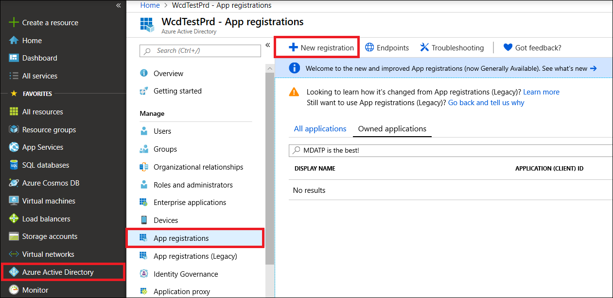

# <a name="create-an-app-to-access-microsoft-defender-for-endpoint-without-a-user"></a>建立應用程式以存取 Microsoft Defender for Endpoint （不含使用者）

[!INCLUDE [Microsoft 365 Defender rebranding](../../includes/microsoft-defender.md)]


**適用于：** [Microsoft Defender for Endpoint](https://go.microsoft.com/fwlink/?linkid=2154037)

- 想要體驗適用於端點的 Microsoft Defender 嗎？ [注册免費試用版。](https://www.microsoft.com/microsoft-365/windows/microsoft-defender-atp?ocid=docs-wdatp-exposedapis-abovefoldlink)

[!include[Microsoft Defender for Endpoint API URIs for US Government](../../includes/microsoft-defender-api-usgov.md)]

[!include[Improve request performance](../../includes/improve-request-performance.md)]

此頁面說明如何建立應用程式，以在沒有使用者的情況下，取得端點的程式設計存取權。 如果您需要代表使用者以程式設計方式存取 Defender for Endpoint，請參閱 [Get access with user coNtext](exposed-apis-create-app-nativeapp.md)。 如果您不確定需要哪一種存取權，請參閱 [入門](apis-intro.md)。

Microsoft Defender for Endpoint 會透過一組程式設計 APIs 公開其資料和動作。 這些 APIs 會協助您根據使用 Defender for Endpoint 功能自動化工作流程與創新。 API 存取需要 OAuth 2.0 驗證。 如需詳細資訊，請參閱[OAuth 2.0 授權碼 Flow](/azure/active-directory/develop/active-directory-v2-protocols-oauth-code)。

一般來講，您必須採取下列步驟，才能使用 APIs：
- 建立 Azure Active Directory (Azure AD) 應用程式。
- 使用此應用程式取得存取權杖。
- 使用權杖來存取適用于 Endpoint API 的 Defender。

本文說明如何建立 Azure AD 應用程式、取得 Microsoft Defender for Endpoint 的存取權杖，以及驗證權杖。

## <a name="create-an-app"></a>建立應用程式

1. 使用具有 **全域系統管理員** 角色的使用者登入 [Azure](https://portal.azure.com) 。

2. 流覽至 **Azure Active Directory**  >  **App 註冊**  >  **新註冊**。 

   

3. 在 [註冊] 表單中，選擇應用程式的名稱，然後選取 [ **註冊**]。

4. 若要讓您的應用程式能夠存取使用者的 Defender，並指派「**讀取所有的提醒**」許可權，請在您的應用程式頁面上，選取 [ **API 許可權**  >  **新增許可權**  >  **APIs 我的組織使用**>]，輸入 **WindowsDefenderATP**，然後選取 [ **WindowsDefenderATP**]。

   > [!NOTE]
   > *WindowsDefenderATP* 不會出現在原始清單中。 開始在文字方塊中寫入其名稱，以查看顯示。

   

   - 選取 [**應用程式許可權**] [已讀取]。 [  >  **全部**]，然後選取 [**新增許可權**]。

   

     您必須選取相關的許可權。 「讀取所有警示」只是範例。 例如：

     - 若要 [執行高級查詢](run-advanced-query-api.md)，請選取「執行高級查詢」許可權。
     - 若要 [隔離裝置](isolate-machine.md)，請選取「隔離電腦」許可權。
     - 若要決定您需要的許可權，請參閱您想要呼叫之 API 中的 [ **許可權** ] 區段。

5. 選取 **[授與同意**]。

     > [!NOTE]
     > 每當您新增許可權時，您必須選取 **[授與同意** ]，新許可權才會生效。

    

6. 若要將機密新增至應用程式，請選取 [ **憑證 & 機密**]，新增 [密碼] 的描述，然後選取 [ **新增**]。

    > [!NOTE]
    > 選取 [ **新增**] 之後，選取 **[複製產生的機密值**]。 離開後，您將無法取回此值。

    

7. 記下來記錄應用程式識別碼和您的租使用者識別碼。 在 [應用程式] 頁面上，移至 **[簡介** ]，然後複製下列各項。

   

8. **僅適用于 Microsoft Defender For Endpoint 合作夥伴**。 將您的應用程式設為多 tenanted (在同意) 後，所有承租人皆可使用。 這是協力廠商應用程式 **所需** 的 (例如，如果您建立要在多個客戶的承租人) 中執行的應用程式。 如果您建立只想要在租使用者中執行的服務，這 **不是必要** 的 (例如，如果您為自己的使用方式建立應用程式，只會與您自己的資料) 互動。 若要將您的應用程式設為多 tenanted：

    - 移至 [ **驗證**]，然後新增 `https://portal.azure.com` 為重新 **導向 URI**。

    - 在頁面底部的 [ **支援的帳戶類型**] 底下，選取您的多租使用者應用程式的 **任何組織目錄** 應用程式中的帳戶。

    您必須在您要使用的每個承租人中核准您的應用程式。 這是因為您的應用程式代表您的客戶與 Defender for Endpoint 互動。

    當您撰寫協力廠商應用程式時，您 (或客戶) 必須選取同意連結並核准您的應用程式。 使用 Active Directory 中具有系統管理許可權的使用者，應進行同意。

    「同意」連結的成形如下： 

    ```
    https://login.microsoftonline.com/common/oauth2/authorize?prompt=consent&client_id=00000000-0000-0000-0000-000000000000&response_type=code&sso_reload=true
    ```

    其中00000000-0000-0000-0000-000000000000 會取代為您的應用程式識別碼。


**做！** 您已成功註冊應用程式！ 請參閱下列範例以取得及驗證權杖。

## <a name="get-an-access-token"></a>取得存取權杖

如需 Azure AD 標記的詳細資訊，請參閱 [AZURE ad 教學](/azure/active-directory/develop/active-directory-v2-protocols-oauth-client-creds)課程。

### <a name="use-powershell"></a>使用 PowerShell

```powershell
# This script acquires the App Context Token and stores it in the variable $token for later use in the script.
# Paste your Tenant ID, App ID, and App Secret (App key) into the indicated quotes below.

$tenantId = '' ### Paste your tenant ID here
$appId = '' ### Paste your Application ID here
$appSecret = '' ### Paste your Application key here

$resourceAppIdUri = 'https://api.securitycenter.microsoft.com'
$oAuthUri = "https://login.microsoftonline.com/$TenantId/oauth2/token"
$authBody = [Ordered] @{
    resource = "$resourceAppIdUri"
    client_id = "$appId"
    client_secret = "$appSecret"
    grant_type = 'client_credentials'
}
$authResponse = Invoke-RestMethod -Method Post -Uri $oAuthUri -Body $authBody -ErrorAction Stop
$token = $authResponse.access_token
```

### <a name="use-c"></a>使用 c #：

下列程式碼是使用 NuGet 的 windows.identitymodel.extensions.dll 測試。 ActiveDirectory 3.19.8。

1. 建立新的主控台應用程式。
1. 安裝 NuGet [windows.identitymodel.extensions.dll。 ActiveDirectory](https://www.nuget.org/packages/Microsoft.IdentityModel.Clients.ActiveDirectory/)。
1. 新增下列專案：

    ```
    using Microsoft.IdentityModel.Clients.ActiveDirectory;
    ```

1. 在應用程式中複製並貼上下列程式碼 (請勿忘記更新三個變數： ```tenantId, appId, appSecret```) ：

    ```
    string tenantId = "00000000-0000-0000-0000-000000000000"; // Paste your own tenant ID here
    string appId = "11111111-1111-1111-1111-111111111111"; // Paste your own app ID here
    string appSecret = "22222222-2222-2222-2222-222222222222"; // Paste your own app secret here for a test, and then store it in a safe place! 

    const string authority = "https://login.microsoftonline.com";
    const string wdatpResourceId = "https://api.securitycenter.microsoft.com";

    AuthenticationContext auth = new AuthenticationContext($"{authority}/{tenantId}/");
    ClientCredential clientCredential = new ClientCredential(appId, appSecret);
    AuthenticationResult authenticationResult = auth.AcquireTokenAsync(wdatpResourceId, clientCredential).GetAwaiter().GetResult();
    string token = authenticationResult.AccessToken;
    ```


### <a name="use-python"></a>使用 Python

請參閱 [使用 Python 取得 token](run-advanced-query-sample-python.md#get-token)。

### <a name="use-curl"></a>使用捲曲

> [!NOTE]
> 下列程式假設 Windows 已安裝在電腦上的卷。

1. 開啟命令提示字元，並將 CLIENT_ID 設定為您的 Azure 應用程式識別碼。
1. 將 CLIENT_SECRET 設定為您的 Azure 應用程式密碼。
1. 將 TENANT_ID 設定為想要使用您的應用程式來存取端點之使用者的 Azure 租使用者識別碼。
1. 執行下列命令：

```
curl -i -X POST -H "Content-Type:application/x-www-form-urlencoded" -d "grant_type=client_credentials" -d "client_id=%CLIENT_ID%" -d "scope=https://securitycenter.onmicrosoft.com/windowsatpservice/.default" -d "client_secret=%CLIENT_SECRET%" "https://login.microsoftonline.com/%TENANT_ID%/oauth2/v2.0/token" -k
```

您會收到下列形式的答案：

```
{"token_type":"Bearer","expires_in":3599,"ext_expires_in":0,"access_token":"eyJ0eXAiOiJKV1QiLCJhbGciOiJSUzI1NiIsIn <truncated> aWReH7P0s0tjTBX8wGWqJUdDA"}
```

## <a name="validate-the-token"></a>驗證 token

確定您獲得正確的權杖：

1. 將您在上一個步驟中所掌握的權杖複製並貼上至 [JWT](https://jwt.ms) ，以便進行解碼。
1. 確認您取得了所需許可權的「role」宣告
1. 在下列影像中，您可以看到從應用程式取得的解碼標記，該權杖具有所有 Microsoft Defender for Endpoint role 的許可權：


## <a name="use-the-token-to-access-microsoft-defender-for-endpoint-api"></a>使用權杖來存取 Microsoft Defender for Endpoint API

1. 選擇您要使用的 API。 如需詳細資訊，請參閱 [支援的 Defender For Endpoint APIs](exposed-apis-list.md)。
1. 在您傳送至 "載荷 {token}" 的 HTTP 要求中設定授權標頭。 (載荷是授權配置) 。
1. 權杖的到期時間是一小時。 您可以使用相同的權杖傳送一個以上的要求。

以下是 **使用 c #** 傳送要求以取得警示清單的範例： 
```
    var httpClient = new HttpClient();

    var request = new HttpRequestMessage(HttpMethod.Get, "https://api.securitycenter.microsoft.com/api/alerts");

    request.Headers.Authorization = new AuthenticationHeaderValue("Bearer", token);

    var response = httpClient.SendAsync(request).GetAwaiter().GetResult();

    // Do something useful with the response
```

## <a name="see-also"></a>另請參閱
- [受支援的適用於端點的 Microsoft Defender API](exposed-apis-list.md)
- [代表使用者存取 Microsoft Defender for Endpoint](exposed-apis-create-app-nativeapp.md)
