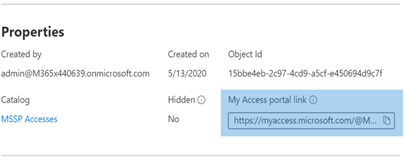

# 授與受管理的安全性服務提供者 (MSSP) access (預覽) Grant managed security service provider (MSSP) access (preview)

[!INCLUDE [Microsoft 365 Defender rebranding](../../includes/microsoft-defender.md)]

**適用於：****Applies to:**
- [適用於端點的 Microsoft DefenderMicrosoft Defender for Endpoint](https://go.microsoft.com/fwlink/p/?linkid=2154037)
- [Microsoft 365 DefenderMicrosoft 365 Defender](https://go.microsoft.com/fwlink/?linkid=2118804)

>想要體驗 Defender for Endpoint？Want to experience Defender for Endpoint? [注册免費試用版。Sign up for a free trial.](https://www.microsoft.com/microsoft-365/windows/microsoft-defender-atp?ocid=docs-mssp-support-abovefoldlink)

>[!IMPORTANT] 
>部分資訊與發行前版本產品有關，在正式發行之前可能會實質上進行修改。Some information relates to prereleased product which may be substantially modified before it's commercially released. Microsoft 對此處提供的資訊，不提供任何明確或隱含的瑕疵擔保。Microsoft makes no warranties, express or implied, with respect to the information provided here.

若要執行多租使用者委派存取解決方案，請執行下列步驟：To implement a multi-tenant delegated access solution, take the following steps:

1. 在 [Defender for Endpoint] 中啟用以 [角色為基礎的存取控制](rbac.md) ，並使用 Active DIRECTORY (AD) 群組進行連線。Enable [role-based access control](rbac.md) in Defender for Endpoint and connect with Active Directory (AD) groups.

2. 設定存取要求與布建的控管 [訪問套件](https://docs.microsoft.com/azure/active-directory/governance/identity-governance-overview) 。Configure [Governance Access Packages](https://docs.microsoft.com/azure/active-directory/governance/identity-governance-overview) for access request and provisioning.

3. 在 [Microsoft Myaccess](https://docs.microsoft.com/azure/active-directory/governance/entitlement-management-request-approve)中管理存取要求和審核。Manage access requests and audits in [Microsoft Myaccess](https://docs.microsoft.com/azure/active-directory/governance/entitlement-management-request-approve).

## 在 Microsoft Defender for Endpoint 中啟用以角色為基礎的存取控制Enable role-based access controls in Microsoft Defender for Endpoint

1. **在客戶 AAD 中建立 MSSP 資源的訪問群組：群組****Create access groups for MSSP resources in Customer AAD: Groups**

    這些群組會連結至您在 [Defender for Endpoint] 中建立的角色。These groups will be linked to the Roles you create in Defender for Endpoint. 若要這麼做，請在客戶 AD 承租人中建立三個群組。To do so, in the customer AD tenant, create three groups. 在我們的範例方法中，我們建立下列群組：In our example approach, we create the following groups:

    - 第1層分析員Tier 1 Analyst 
    - 第2層分析員Tier 2 Analyst 
    - MSSP 分析員核准者MSSP Analyst Approvers  

2. 為 Endpoint 的客戶 Defender 中的適當訪問層級建立適用于端點角色的 Defender。Create Defender for Endpoint roles for appropriate access levels in Customer Defender for Endpoint.

    若要在客戶 Microsoft Defender Security Center 中啟用 RBAC，請從具有全域管理員或安全性管理員許可權的使用者帳戶，存取 **設定 > 許可權 > 角色** 和「開啟角色」。To enable RBAC in the customer Microsoft Defender Security Center, access **Settings > Permissions > Roles** and "Turn on roles", from a user account with Global Administrator or Security Administrator rights.

    

    接著，建立 RBAC 角色，以符合 MSSP SOC 層需求。Then, create RBAC roles to meet MSSP SOC Tier needs. 透過「指派的使用者群組」將這些角色連結到建立的使用者群組。Link these roles to the created user groups via "Assigned user groups".

    兩個可能的角色：Two possible roles:

    - **第1層分析員****Tier 1 Analysts**  
      執行除 live response 以外的所有動作和管理安全性設定。Perform all actions except for live response and manage security settings.

    - **第2層分析員****Tier 2 Analysts**  
      與[live 回應](live-response.md)外的第1層功能Tier 1 capabilities with the addition to [live response](live-response.md)

    如需詳細資訊，請參閱 [使用以角色為基礎的存取控制](rbac.md)。For more information, see [Use role-based access control](rbac.md).

## 設定調控訪問套件Configure Governance Access Packages

1.  **在客戶 AAD 中以連線的組織形式新增 MSSP：身分識別管理****Add MSSP as Connected Organization in Customer AAD: Identity Governance**
    
    將 MSSP 新增為連線的組織，可讓 MSSP 要求並已布建存取權。Adding the MSSP as a connected organization will allow the MSSP to request and have accesses provisioned. 

    若要這麼做，請在客戶 AD 承租人中存取身分識別管理：連線的組織。To do so, in the customer AD tenant, access Identity Governance: Connected organization. 透過租使用者識別碼或網域，新增組織並搜尋 MSSP 分析租使用者。Add a new organization and search for your MSSP Analyst tenant via Tenant ID or Domain. 建議您為 MSSP 分析員建立個別的 AD 租使用者。We suggest creating a separate AD tenant for your MSSP Analysts.

2. **在客戶 AAD 中建立資原始目錄：身分識別管理****Create a resource catalog in Customer AAD: Identity Governance**

    資原始目錄是 access 套件的邏輯集合，在客戶 AD 租使用者中建立。Resource catalogs are a logical collection of access packages, created in the customer AD tenant.

    若要這麼做，請在客戶 AD 承租人中存取身分識別管理：編目，並 **新增目錄**。To do so, in the customer AD tenant,  access Identity Governance: Catalogs, and add **New Catalog**. 在我們的範例中，我們會致電 **MSSP 存取**。In our example, we will call it **MSSP Accesses**. 

    

    進一步資訊，請參閱 [建立資源的目錄](https://docs.microsoft.com/azure/active-directory/governance/entitlement-management-catalog-create)。Further more information, see [Create a catalog of resources](https://docs.microsoft.com/azure/active-directory/governance/entitlement-management-catalog-create).

3. **建立 MSSP 資源的存取套件客戶 AAD：身分識別控管****Create access packages for MSSP resources Customer AAD: Identity Governance**

    Access 套件是權利和存取權的集合，會在核准時授與要求。Access packages are the collection of rights and accesses that a requestor will be granted upon approval. 

    若要這麼做，請在客戶 AD 承租人中存取身分識別管理：存取套件，以及新增 **訪問套件**。To do so, in the customer AD tenant, access Identity Governance: Access Packages, and add **New Access Package**. 為 MSSP 核准者和每個分析員層建立存取套件。Create an access package for the MSSP approvers and each analyst tier. 例如，下列第1層分析員設定會建立下列專案的訪問套件：For example, the following Tier 1 Analyst configuration creates an access package that:

    - 需要 AD 群組 **MSSP 分析員核准者** 的成員來授權新的要求Requires a member of the AD group **MSSP Analyst Approvers** to authorize new requests
    - 具有年度存取權檢查，在此情況下，SOC 分析程式可以要求存取分機Has annual access reviews, where the SOC analysts can request an access extension
    - 只能由 MSSP SOC 租使用者中的使用者要求Can only be requested by users in the MSSP SOC Tenant
    - Access auto 會在365天后到期Access auto expires after 365 days

    > [!div class="mx-imgBorder"]
    > 

    如需詳細資訊，請參閱 [建立新的 access 套件](https://docs.microsoft.com/azure/active-directory/governance/entitlement-management-access-package-create)。For more information, see [Create a new access package](https://docs.microsoft.com/azure/active-directory/governance/entitlement-management-access-package-create).

4. **提供存取權要求從客戶 AAD：身分識別控管 MSSP 資源的連結****Provide access request link to MSSP resources from Customer AAD: Identity Governance**

    MSSP SOC 分析員使用「我的 Access 入口網站」連結，透過建立的訪問套件要求存取權。The My Access portal link is used by MSSP SOC analysts to request access via the access packages created. 連結是持久的，這表示新分析員的時間可能會使用相同的連結。The link is durable, meaning the same link may be used over time for new analysts. 分析員要求會進入佇列供 **MSSP 分析員核准者** 核准。The analyst request goes into a queue for approval by the **MSSP Analyst Approvers**.

    > [!div class="mx-imgBorder"]
    > 

    此連結位於每個 access 套件的 [概述] 頁面上。The link is located on the overview page of each access package.

## 管理存取權Manage access 

1. 在客戶和/或 MSSP myaccess 中複查和授權存取要求。Review and authorize access requests in Customer and/or MSSP myaccess.

    存取要求是由 MSSP 分析員核准者群組的成員在客戶存取。Access requests are managed in the customer My Access, by members of the MSSP Analyst Approvers group.

    若要這麼做，請使用：來存取客戶的 myaccess  `https://myaccess.microsoft.com/@<Customer Domain >` 。To do so, access the customer's myaccess using:  `https://myaccess.microsoft.com/@<Customer Domain >`. 

    範例： `https://myaccess.microsoft.com/@M365x440XXX.onmicrosoft.com#/`Example:  `https://myaccess.microsoft.com/@M365x440XXX.onmicrosoft.com#/`   
2. 在 UI 的 [ **核准** ] 區段中核准或拒絕要求。Approve or deny requests in the **Approvals** section of the UI.

    此時，已布建分析者存取權，且每個分析員都應該可以存取客戶的 Microsoft Defender 安全中心： `https://securitycenter.Microsoft.com/?tid=<CustomerTenantId>`At this point, analyst access has been provisioned, and each analyst should be able to access the customer's Microsoft Defender Security Center: `https://securitycenter.Microsoft.com/?tid=<CustomerTenantId>`

## 相關主題Related topics
- [存取 MSSP 客戶入口網站Access the MSSP customer portal](access-mssp-portal.md)
- [設定警示通知Configure alert notifications](configure-mssp-notifications.md)
- [從客戶租用戶中抓取警示Fetch alerts from customer tenant](fetch-alerts-mssp.md)

 

