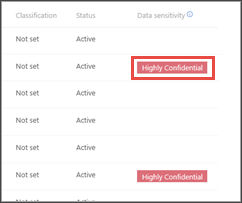
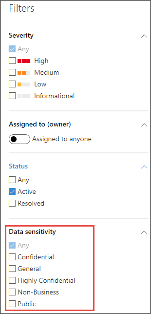

# 使用敏感度標籤來排定事件回應的優先順序  

[!INCLUDE [Microsoft 365 Defender rebranding](../../includes/microsoft-defender.md)]

**適用於：**
- [適用於端點的 Microsoft Defender](https://go.microsoft.com/fwlink/p/?linkid=2154037)
- [Microsoft 365 Defender](https://go.microsoft.com/fwlink/?linkid=2118804)

> 想要體驗 Defender for Endpoint？ [注册免費試用版。](https://www.microsoft.com/microsoft-365/windows/microsoft-defender-atp?ocid=docs-wdatp-exposedapis-abovefoldlink) 

典型的高級持續威脅週期包含資料 exfiltration。 在安全性事件中，一定要能夠優先考慮敏感檔案可能會有危險的情況，以保護公司資料和資訊。

Defender for Endpoint 可使用敏感度標籤，讓安全性事件的優先順序變得更簡單。 敏感度標籤會快速識別可能包含機密資訊（例如機密資訊）的裝置的事件。 

## 調查涉及敏感性資料的事件
瞭解如何使用資料敏感度標籤來設定事件調查的優先順序。

>[!NOTE]
>在 Windows 10，版本1809或更新版本中偵測到標籤。

1. 在 Microsoft Defender 資訊安全中心中，選取 [**事件**]。 

2. 向右流覽以查看 [ **資料敏感度** ] 欄。 此資料行會反映在與事件相關的裝置上看到的靈敏度標籤，以提供敏感檔案可能會受到事件影響的指示。

    

    您也可以根據 **資料敏感度** 進行篩選 

    

3. 開啟 [事件] 頁面以進一步調查。

    

4. 選取 [ **裝置** ] 索引標籤，識別儲存敏感度標籤的裝置。

    
   

5. 選取儲存敏感性資料的裝置，並在時程表中進行搜尋，以找出可能會受到影響的檔案，然後採取適當的動作，以確保資料受到保護。 

   您可以搜尋資料敏感度標籤，以縮小裝置時程表上所顯示的事件。 這樣做只會顯示與已說標籤名稱之檔案相關聯的事件。

    

>[!TIP]
>透過高級搜尋中的 ' DeviceFileEvents ' 也會公開這些資料點，允許高級查詢及排程偵測採用帳戶敏感度標籤及檔案保護狀態。 
