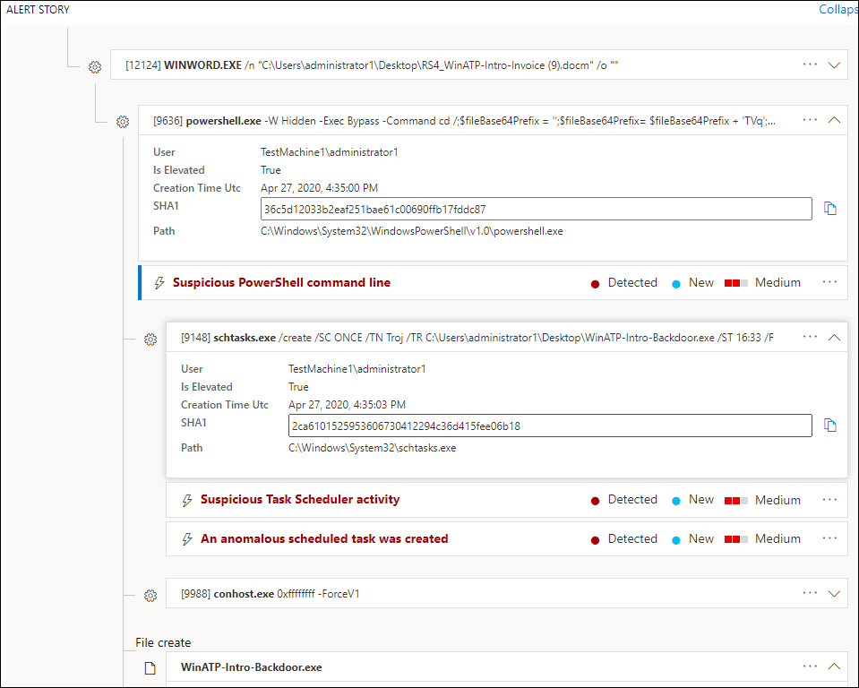
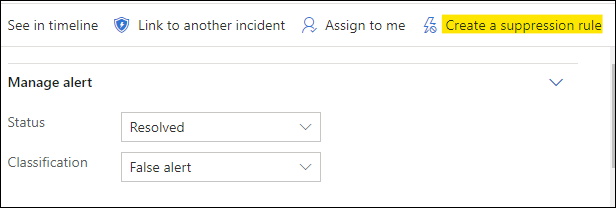

# 調查 Microsoft Defender for Endpoint 中的警示Investigate alerts in Microsoft Defender for Endpoint

[!INCLUDE [Microsoft 365 Defender rebranding](../../includes/microsoft-defender.md)]

**適用於：****Applies to:**
- [適用於端點的 Microsoft DefenderMicrosoft Defender for Endpoint](https://go.microsoft.com/fwlink/p/?linkid=2146631)
- [Microsoft 365 DefenderMicrosoft 365 Defender](https://go.microsoft.com/fwlink/?linkid=2118804)

>想要體驗 Defender for Endpoint？Want to experience Defender for Endpoint? [註冊免費試用版。Sign up for a free trial.](https://www.microsoft.com/microsoft-365/windows/microsoft-defender-atp?ocid=docs-wdatp-investigatealerts-abovefoldlink) 

調查影響網路的警示，瞭解其含義及解決方法。Investigate alerts that are affecting your network, understand what they mean, and how to resolve them.

選取 [警示] 佇列中的警示，以移至 [警示] 頁面。Select an alert from the alerts queue to go to alert page. 此視圖包含提醒標題、受影響的資產、詳細資料側窗格及警示案例。This view contains the alert title, the affected assets, the details side pane, and the alert story.

在 [警示] 頁面中，選取 [警示案例] 樹狀目錄中的受影響資產或任何實體，以開始調查。From the alert page, begin your investigation by selecting the affected assets or any of the entities under the alert story tree view. [詳細資料] 窗格會自動填入有關您所選取之專案的詳細資訊。The details pane automatically populates with further information about what you selected. 若要查看您可以在這裡查看的資訊類型，請閱讀 [Microsoft Defender For Endpoint 中的審閱警示](https://docs.microsoft.com/microsoft-365/security/defender-endpoint/review-alerts)。To see what kind of information you can view here, read [Review alerts in Microsoft Defender for Endpoint](https://docs.microsoft.com/microsoft-365/security/defender-endpoint/review-alerts).

## 使用警示案例調查Investigate using the alert story

警示案例會詳細說明觸發警示的原因、之前與之後發生的相關事件，以及其他相關實體。The alert story details why the alert was triggered, related events that happened before and after, as well as other related entities.

實體是可按一下的，而每個非警示的實體都會使用該實體的卡片右側的展開圖示展開。Entities are clickable and every entity that isn't an alert is expandable using the expand icon on the right side of that entity's card. 焦點中的實體會由該實體卡片左側的藍色點線表示，而且標題中的警示會先開始。The entity in focus will be indicated by a blue stripe to the left side of that entity's card, with the alert in the title being in focus at first.

展開實體以快速查看詳細資料。Expand entities to view details at a glance. 選取實體會將詳細資料窗格的內容切換至此實體，並可讓您複查進一步的資訊，以及管理該實體。Selecting an entity will switch the context of the details pane to this entity, and will allow you to review further information, as well as manage that entity. 在實體卡片 *右邊選取 [...]* ，會顯示該實體所有可用的動作。Selecting *...* to the right of the entity card will reveal all actions available for that entity. 當該實體處於焦點中時，這些相同動作會出現在詳細資料窗格中。These same actions appear in the details pane when that entity is in focus.

> [!NOTE]
> 「警示案例」區段中可能會包含一個以上的警示，在您所選取的警示之前或之後，會顯示與相同執行樹狀目錄相關的其他警示。The alert story section may contain more than one alert, with additional alerts related to the same execution tree appearing before or after the alert you've selected.

## 從詳細資料窗格採取動作Take action from the details pane

當您選取相關實體時，詳細資料窗格會變更，以顯示所選實體類型的相關資訊，並提供歷史資訊，以直接從警示頁面對此實體 **採取動作** 。Once you've selected an entity of interest, the details pane will change to display information about the selected entity type, historic information when it's available, and offer controls to **take action** on this entity directly from the alert page.

完成調查後，請回到您已開始的警示，將警示的狀態標示為 [ **已解決** ]，然後將其歸類為 **False 警示** 或 **True 警示**。Once you're done investigating, go back to the alert you started with, mark the alert's status as **Resolved** and classify it as either **False alert** or **True alert**. 分類提醒可協助調整這項功能，以提供更真實的警示及不太虛假的警示。Classifying alerts helps tune this capability to provide more true alerts and less false alerts.

如果您將其歸類為 true 警示，您也可以選取判斷，如下圖所示。If you classify it as a true alert, you can also select a determination, as shown in the image below.

如果您遇到的是與企業營運相關的預警，請建立抑制規則，以避免未來出現這種類型的警示。If you are experiencing a false alert with a line-of-business application, create a suppression rule to avoid this type of alert in the future.

> [!TIP]
> 如果您遇到上述任何問題，請使用 🙂 按鈕提供意見反應或開啟支援票證。If you're experiencing any issues not described above, use the 🙂 button to provide feedback or open a support ticket.

## 相關主題Related topics
- [查看和組織 Microsoft Defender for Endpoint 警示佇列View and organize the Microsoft Defender for Endpoint Alerts queue](alerts-queue.md)
- [管理 Microsoft Defender for Endpoint 警示Manage Microsoft Defender for Endpoint alerts](manage-alerts.md)
- [調查與 Defender for Endpoint alert 相關聯的檔案Investigate a file associated with a Defender for Endpoint alert](investigate-files.md)
- [調查 [Defender for Endpoint Devices] 清單中的裝置](investigate-machines.md)[Investigate devices in the Defender for Endpoint Devices list](investigate-machines.md)
- [調查與 Defender for Endpoint alert 相關聯的 IP 位址Investigate an IP address associated with a Defender for Endpoint alert](investigate-ip.md)
- [調查與 Defender for Endpoint alert 相關聯的網域Investigate a domain associated with a Defender for Endpoint alert](investigate-domain.md)
- [調查 Endpoint for Endpoint 中的使用者帳戶Investigate a user account in Defender for Endpoint](investigate-user.md)

