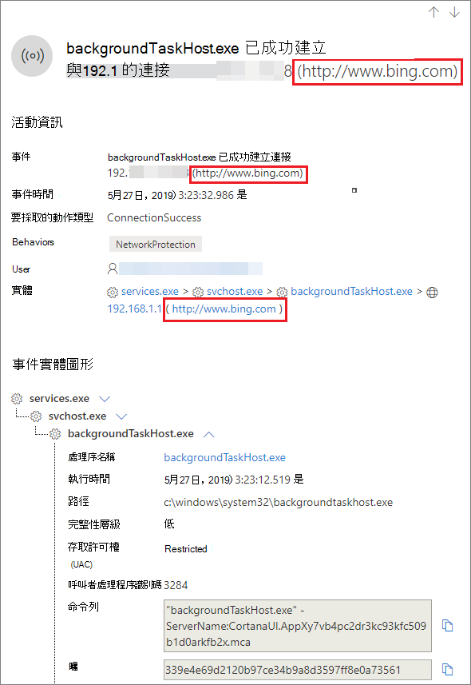

# <a name="investigate-connection-events-that-occur-behind-forward-proxies"></a>調查在正向 proxy 之後發生的連接事件

[!INCLUDE [Microsoft 365 Defender rebranding](../../includes/microsoft-defender.md)]

**適用於：**
- [適用於端點的 Microsoft Defender](https://go.microsoft.com/fwlink/p/?linkid=2154037)
- [Microsoft 365 Defender](https://go.microsoft.com/fwlink/?linkid=2118804)

> 想要體驗 Defender for Endpoint？ [註冊免費試用版。](https://www.microsoft.com/microsoft-365/windows/microsoft-defender-atp?ocid=docs-wdatp-investigatemachines-abovefoldlink)

Defender for Endpoint 支援來自不同網路堆疊層級的網路連線監視。 一個挑戰性的案例是，網路使用轉寄 proxy 做為網際網路的閘道。

Proxy 的運作方式就如同目標端點。  在這些情況下，「簡易網路連線監視器」會審核與正確但是具有較低調查值之 proxy 的連線。 

Endpoint for Endpoint 支援透過網路保護進行的高級 HTTP 層級監視。 開啟時，會呈現出公開實際目標功能變數名稱的新事件種類。

## <a name="use-network-protection-to-monitor-network-connection-behind-a-firewall"></a>使用網路防護來監視防火牆後的網路連線
因為來自網路保護的其他網路事件，所以可以監視正向 proxy 背後的網路連線。 若要在裝置時程表上查看它們，請在 (中至少以「審計模式」) 中開啟 [網路保護]。 

您可以使用下列模式來控制網路保護：

- **封鎖** <br> 使用者或應用程式將被封鎖，無法連線到危險網域。 您可以在 Microsoft Defender Security Center 中看到這項活動。
- **稽核** <br> 不會封鎖使用者或應用程式連線到危險網域。 不過，您仍會在 Microsoft Defender 安全中心看到這項活動。


如果關閉網路保護，將不會封鎖使用者或應用程式連線到危險網域。 在 Microsoft Defender Security Center 中，您不會看到任何網路活動。

如果您未設定它，預設會關閉網路封鎖功能。

如需詳細資訊，請參閱 [Enable network protection](enable-network-protection.md)。

## <a name="investigation-impact"></a>調查影響
當網路保護開啟時，您會在裝置的時程表上看到 IP 位址會保留 proxy，而實際的目標位址會顯示。


網路保護層所觸發的其他事件現在可用於呈現真實的功能變數名稱，甚至是在 proxy 之後。

事件資訊：




## <a name="hunt-for-connection-events-using-advanced-hunting"></a>使用高級搜尋來尋找連接事件 
您也可以透過高級搜尋來尋找所有新的線上活動。 因為這些事件是線上活動，所以您可以在 [動作類型] 底下的 [DeviceNetworkEvents] 表格底下找到這些事件 `ConnecionSuccess` 。

使用此簡單查詢會顯示所有相關的事件：

```
DeviceNetworkEvents
| where ActionType == "ConnectionSuccess" 
| take 10
```


您也可以篩選出與 proxy 本身連線相關的事件。 

使用下列查詢篩選出 proxy 的連線：

```
DeviceNetworkEvents
| where ActionType == "ConnectionSuccess" and RemoteIP != "ProxyIP"  
| take 10
```


## <a name="related-topics"></a>相關主題
- [使用 GP-原則 CSP 應用網路保護](https://docs.microsoft.com/windows/client-management/mdm/policy-csp-defender#defender-enablenetworkprotection)
