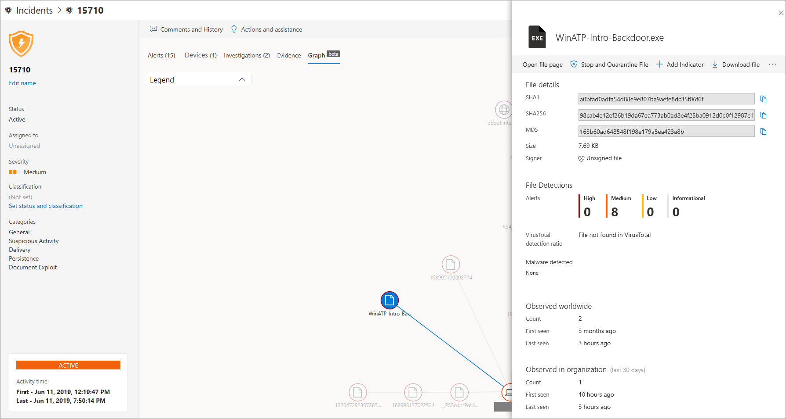

# 調查 Microsoft Defender for Endpoint 中的事件Investigate incidents in Microsoft Defender for Endpoint

[!INCLUDE [Microsoft 365 Defender rebranding](../../includes/microsoft-defender.md)]

**適用於：****Applies to:**
- [適用於端點的 Microsoft DefenderMicrosoft Defender for Endpoint](https://go.microsoft.com/fwlink/p/?linkid=2154037)
- [Microsoft 365 DefenderMicrosoft 365 Defender](https://go.microsoft.com/fwlink/?linkid=2118804)

調查影響網路的事件、瞭解其含義，以及對照證據進行分析。Investigate incidents that affect your network, understand what they mean, and collate evidence to resolve them. 

當您調查事件時，您會看到：When you investigate an incident, you'll see:
- 事件詳細資料Incident details
- 事件批註和動作Incident comments and actions
- 索引標籤 (警示、裝置、調查、證據、圖形) Tabs (alerts, devices, investigations, evidence, graph)

> [!VIDEO https://www.microsoft.com/en-us/videoplayer/embed/RE4qLUV]

## 分析事件詳細資料Analyze incident details 
按一下事件以查看 [ **事件] 窗格**。Click an incident to see the **Incident pane**. 選取 [ **開啟事件] 頁面** ，查看事件詳細資料和相關資訊 (警示、裝置、調查、證據、圖形) 。Select **Open incident page** to see the incident details and related information (alerts, devices, investigations, evidence, graph). 

### 警示Alerts
您可以調查警示，並查看其在事件中如何連結在一起。You can investigate the alerts and see how they were linked together in an incident. 根據下列原因，將警示分組到事件：Alerts are grouped into incidents based on the following reasons:
- 自動調查-自動調查會在調查原始警示時觸發連結的警示Automated investigation - The automated investigation triggered the linked alert while investigating the original alert 
- 檔特性-與警示相關聯的檔案具有類似的特性File characteristics - The files associated with the alert have similar characteristics
- 手動關聯-手動連結通知的使用者Manual association - A user manually linked the alerts
- Proximate time-警示在特定時間範圍內的相同裝置上觸發Proximate time - The alerts were triggered on the same device within a certain timeframe
- 同一個檔案-與警示相關聯的檔案完全相同Same file - The files associated with the alert are exactly the same
- 同一個 URL-觸發警示的 URL 完全相同Same URL - The URL that triggered the alert is exactly the same

![[警示] 索引標籤與 [事件詳細資料] 頁面，顯示預警在該事件中的相互關聯原因。](images/atp-incidents-alerts-reason.png)

您也可以管理警示，並查看警示中繼資料及其他資訊。You can also manage an alert and see alert metadata along with other information. 如需詳細資訊，請參閱 [調查警示](investigate-alerts.md)。For more information, see [Investigate alerts](investigate-alerts.md). 

### 裝置Devices
您也可以調查指定之事件的一部分或相關的裝置。You can also investigate the devices that are part of, or related to, a given incident. 如需詳細資訊，請參閱 [調查裝置](investigate-machines.md)。For more information, see [Investigate devices](investigate-machines.md).

![[事件詳細資料] 頁面中的 [裝置影像] 索引標籤](images/atp-incident-device-tab.png)

### 調查Investigations
選取 [ **調查** ]，查看系統所啟動的所有自動調查，以回應事件警示。Select **Investigations** to see all the automatic investigations launched by the system in response to the incident alerts.

![[事件詳細資料] 頁面中的 [調查] 索引標籤](images/atp-incident-investigations-tab.png)

## 透過證據Going through the evidence
Microsoft Defender for Endpoint 會自動調查事件中的所有受支援事件和可疑實體，以提供 autoresponse 及重要檔案、程式、服務等相關資訊。Microsoft Defender for Endpoint automatically investigates all the incidents' supported events and suspicious entities in the alerts, providing you with autoresponse and information about the important files, processes, services, and more. 

每個分析的實體都會標示為已感染、已修正或可疑。Each of the analyzed entities will be marked as infected, remediated, or suspicious. 

![[事件詳細資料] 頁面中的 [證據] 索引標籤](images/atp-incident-evidence-tab.png)

## 視覺化關聯的 cybersecurity 威脅Visualizing associated cybersecurity threats 
Microsoft Defender for Endpoint 會將威脅資訊匯總到事件中，讓您可以看到來自各種資料點的模式和關聯性。Microsoft Defender for Endpoint aggregates the threat information into an incident so you can see the patterns and correlations coming in from various data points. 您可以透過 incident graph 查看這類關聯。You can view such correlation through the incident graph.

### 事件圖形Incident graph
**Graph** 告訴 cybersecurity 攻擊的故事。The **Graph** tells the story of the cybersecurity attack. 例如，它會顯示進入點，在哪個裝置上觀察到損損或活動的指示器。For example, it shows you what was the entry point, which indicator of compromise or activity was observed on which device. 等。etc.

您可以按一下事件圖上的圓圈，以查看惡意檔案的詳細資料、相關聯的檔案偵測，以及在全球範圍內有多少個實例（如果有的話），如果有，則表示您的組織中有多少個實例。You can click the circles on the incident graph to view the details of the malicious files, associated file detections, how many instances have there been worldwide, whether it’s been observed in your organization, if so, how many instances.

## 相關主題Related topics
- [事件佇列Incidents queue](/microsoft-365/security/defender-endpoint/view-incidents-queue)
- [調查 Microsoft Defender for Endpoint 中的事件Investigate incidents in Microsoft Defender for Endpoint](/microsoft-365/security/defender-endpoint/investigate-incidents)
- [管理 Microsoft Defender for Endpoint 事件Manage Microsoft Defender for Endpoint incidents](/microsoft-365/security/defender-endpoint/manage-incidents)
