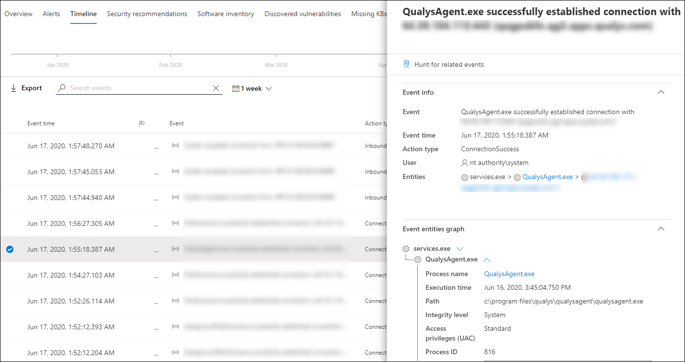

# 調查 Microsoft Defender for Endpoint Devices 清單中的裝置

[!INCLUDE [Microsoft 365 Defender rebranding](../../includes/microsoft-defender.md)]

**適用於：**
- [適用於端點的 Microsoft Defender](https://go.microsoft.com/fwlink/p/?linkid=2154037)
- [Microsoft 365 Defender](https://go.microsoft.com/fwlink/?linkid=2118804)

>想要體驗 Defender for Endpoint？ [注册免費試用版。](https://www.microsoft.com/microsoft-365/windows/microsoft-defender-atp?ocid=docs-wdatp-investigatemachines-abovefoldlink)

調查特定裝置上產生之警示的詳細資料，識別可能與警示或可能的破壞範圍有關的其他行為或事件。

> [!NOTE]
> 作為調查或回應程式的一部分，您可以從裝置收集調查套件。 方法如下： [從裝置收集調查套件](/microsoft-365/security/defender-endpoint/respond-machine-alerts#collect-investigation-package-from-devices)。

您可以按一下 [受影響的裝置]，只要您在入口網站中看到這些裝置，即可開啟有關該裝置的詳細報告。 受影響的裝置會在下列方面加以識別：

- [裝置清單](investigate-machines.md)
- [警示佇列](alerts-queue.md)
- [ 安全性操作儀表板](security-operations-dashboard.md)
- 任何個別警示
- 任何個別檔詳細資料檢視
- 任何 IP 位址或網域詳細資料檢視

當您調查特定裝置時，您會看到：

- 裝置詳細資料
- 回應動作
- 索引標籤 (概述、警示、時程表、安全性建議、軟體清查、發現的弱點、遺失的 Kb) 
-  (主動警示、登入的使用者、安全性評估) 

## 裝置詳細資料

[裝置詳細資料] 區段提供裝置的網域、作業系統和健康狀態等資訊。 如果裝置上有可用的調查套件，您會看到可讓您下載套件的連結。

## 回應動作

回應動作會沿著特定裝置頁面的頂端執行，並包含：

- 管理標籤
- 隔離裝置
- 限制應用程式執行
- 執行防毒掃描
- 收集調查套件
- 啟動 Live Response Session
- 啟動自動調查
- 諮詢威脅專家
- 控制中心

您可以在行動中心、特定裝置頁面或特定檔案頁面中採取回應動作。

如需如何對裝置採取動作的詳細資訊，請參閱 [在裝置上採取回應動作](respond-machine-alerts.md)。

如需詳細資訊，請參閱 [調查使用者實體](investigate-user.md)。

## 索引標籤

索引標籤提供與裝置相關的相關安全性和威脅防護資訊。 在每個索引標籤中，您可以從欄標題上方的列中選取 [ **自訂欄位** ]，以自訂所顯示的欄位。

### 概觀
[ **一覽表** ] 索引標籤會顯示作用中警示、登入使用者及安全性評估的 [卡片](#cards) 。

![裝置頁面上的 [一覽影像] 索引標籤](images/overview-device.png)

### 警示

[ **警示** ] 索引標籤提供與裝置相關聯的警示清單。 此清單是篩選的 [警示佇列](alerts-queue.md)版本，會顯示警示的簡短描述、嚴重性 (高、中、低、資訊) 、佇列中的狀態 (新的、進行中、已解決) 、分類 (未設定、false 警示、true 警示) 、調查狀態、警報類型、處理警示的人員，以及最後一個活動。 您也可以篩選警示。

選取警示左側的圓形圖示時，會顯示飛出。 您可以從這個面板管理警示，並查看詳細資料，例如事件編號及相關裝置。 一次可選取多個提醒。

若要查看警示（包括事件圖形和處理樹狀目錄）的完整網頁檢視，請選取警示的標題。

### 時間表

[ **時程表** ] 索引標籤可提供在裝置上觀察到之事件及相關警示的按時間查看。 這可協助您關聯任何事件、檔案及 IP 位址與裝置相關聯。

時程表也可讓您選擇性地向下流覽至指定期間內發生的事件。 您可以在選取的時段內，查看裝置上發生之事件的時態順序。 若要進一步控制您的視圖，您可以依事件群組篩選或自訂欄位。

>[!NOTE]
> 若要顯示防火牆事件，您必須啟用審核原則，請參閱「 [審核篩選平臺](/windows/security/threat-protection/auditing/audit-filtering-platform-connection)連線」。
>防火牆涵蓋下列事件
>
>- [5025](/windows/security/threat-protection/auditing/event-5025) -防火牆服務已停止
>- [5031](/windows/security/threat-protection/auditing/event-5031) -應用程式阻止接收網路上的傳入連線
>- [5157](/windows/security/threat-protection/auditing/event-5157) -封鎖的連線

一些功能包括：

- 搜尋特定事件
  - 使用搜尋列尋找特定的時程表事件。
- 篩選特定日期的事件
  - 選取表格左上方的行事曆圖示，以顯示過去一天、一周、30天或自訂範圍中的事件。 依預設，裝置時程表會設定為顯示過去30天的事件。
  - 透過高亮顯示區段，使用 [時程表] 跳到特定的時刻。 時程表上指出自動調查的箭號
- 匯出詳細的裝置時程表事件
  - 匯出目前日期或指定日期範圍的裝置時程表，最多7天。

**其他資訊** 區段提供有關特定事件的詳細資訊。 這些詳細資料會視事件種類而異，例如： 

- 由應用程式防護所包含-web 瀏覽器事件受到隔離容器的限制
- 偵測到主動威脅-執行威脅時，發生威脅偵測
- 修正失敗-已呼叫對偵測到的威脅進行修正，但失敗
- 修正成功-已停止並清理偵測到的威脅
- 使用者略過的警告-使用者已解除 Windows Defender SmartScreen 警告，並覆寫該
- 偵測到可疑的腳本-發現可能有惡意的腳本
- 警示類別-如果事件導致警示產生，警示類別 ( 「橫向移動」，例如，) 會提供

#### 事件詳細資料
選取事件，以查看該事件的相關詳細資料。 會顯示一個窗格，顯示一般的事件資訊。 當可用且資料可用時，顯示相關實體及其關聯的圖形也會顯示出來。

若要進一步檢查事件和相關事件，您可以選擇 **尋找相關事件**，以快速執行 [高級搜尋](advanced-hunting-overview.md)查詢。 此查詢會傳回選取的事件，以及相同端點上同時發生之其他事件的清單。

### 安全性建議

**安全性建議** 是由 Microsoft Defender 為端點 [威脅 & 漏洞管理](tvm-dashboard-insights.md) 功能產生。 選取建議會顯示一個窗格，您可以在其中查看相關的詳細資料，例如建議的描述，以及不採用此相關的潛在風險。 如需詳細資訊，請參閱 [安全性建議](tvm-security-recommendation.md) 。

![安全性建議的圖像] 索引標籤](images/security-recommendations-device.png)

### 軟體庫存

[ **軟體清查** ] 索引標籤可讓您在裝置上查看軟體，以及任何弱點或威脅。 選取軟體的名稱會帶您前往 [軟體詳細資料] 頁面，您可以在此頁面上查看安全性建議、發現的漏洞、已安裝的裝置及版本發行。 詳細資訊請參閱[軟體清查](tvm-software-inventory.md)

![[軟體清查] 索引標籤的影像](images/software-inventory-device.png)

### 發現的弱點

[已 **發現的漏洞** ] 索引標籤會顯示裝置上已發現之弱點的名稱、嚴重性及威脅深入瞭解。 選取特定的漏洞會顯示描述及詳細資料。

![[發現的弱點] 索引標籤的影像](images/discovered-vulnerabilities-device.png)

### 遺失 Kb
[ **遺失 kb** ] 索引標籤會列出裝置缺少的安全性更新。

![遺失 kb] 索引標籤的影像](images/missing-kbs-device.png)

## 卡

### 主動警示

如果您已啟用 Microsoft Defender 身分識別功能，且有任何作用中警示， **Azure 高級威脅防護** 卡會顯示與裝置相關的警示，以及其風險層級的高層次概述。 如需詳細資訊，請流覽中的「警示」。

>[!NOTE]
>您必須在 Microsoft Defender for Identity 和 Defender for Endpoint 上啟用整合，才能使用此功能。 在 [Defender for Endpoint] 中，您可以在 [高級功能] 中啟用這項功能。 如需如何啟用高級功能的詳細資訊，請參閱 [開啟高級功能](advanced-features.md)。

### 登入的使用者

**登入的使用者** 卡片會顯示過去30天內已登入的使用者人數，以及最常和最少的使用者。 選取「查看所有使用者」連結會開啟詳細資料窗格，其中會顯示使用者類型、登入類型，以及使用者第一次查看時間等資訊。 如需詳細資訊，請參閱 [調查使用者實體](investigate-user.md)。

### 安全性評估

**安全性評估** 卡會顯示整體公開階層、安全性建議、安裝的軟體，以及發現的弱點。 裝置的公開層級取決於其擱置的安全性建議的累計影響。

## 相關主題

- [查看和組織 Microsoft Defender for Endpoint 警示佇列](alerts-queue.md)
- [管理 Microsoft Defender for Endpoint 警示](manage-alerts.md)
- [調查 Microsoft Defender for Endpoint 警示](investigate-alerts.md)
- [調查與 Defender for Endpoint alert 相關聯的檔案](investigate-files.md)
- [調查與 Defender for Endpoint alert 相關聯的 IP 位址](investigate-ip.md)
- [調查與 Defender for Endpoint alert 相關聯的網域](investigate-domain.md)
- [調查 Endpoint for Endpoint 中的使用者帳戶](investigate-user.md)
- [安全性建議](tvm-security-recommendation.md)
- [軟體庫存](tvm-software-inventory.md)
