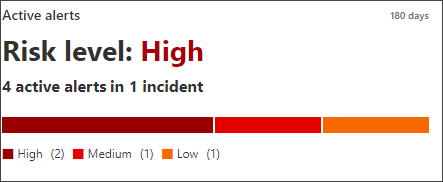
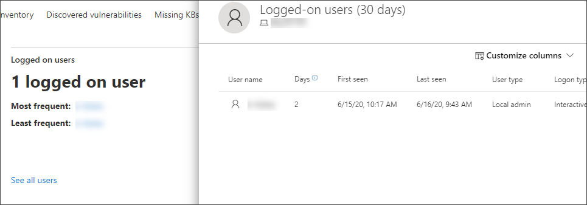

# 調查 Microsoft Defender for Endpoint Devices 清單中的裝置Investigate devices in the Microsoft Defender for Endpoint Devices list

[!INCLUDE [Microsoft 365 Defender rebranding](../../includes/microsoft-defender.md)]

**適用於：****Applies to:**
- [適用於端點的 Microsoft DefenderMicrosoft Defender for Endpoint](https://go.microsoft.com/fwlink/p/?linkid=2154037)
- [Microsoft 365 DefenderMicrosoft 365 Defender](https://go.microsoft.com/fwlink/?linkid=2118804)

>想要體驗 Defender for Endpoint？Want to experience Defender for Endpoint? [注册免費試用版。Sign up for a free trial.](https://www.microsoft.com/microsoft-365/windows/microsoft-defender-atp?ocid=docs-wdatp-investigatemachines-abovefoldlink)

調查特定裝置上產生之警示的詳細資料，識別可能與警示或可能的破壞範圍有關的其他行為或事件。Investigate the details of an alert raised on a specific device to identify other behaviors or events that might be related to the alert or the potential scope of the breach.

> [!NOTE]
> 作為調查或回應程式的一部分，您可以從裝置收集調查套件。As part of the investigation or response process, you can collect an investigation package from a device. 方法如下： [從裝置收集調查套件](/microsoft-365/security/defender-endpoint/respond-machine-alerts#collect-investigation-package-from-devices)。Here's how: [Collect investigation package from devices](/microsoft-365/security/defender-endpoint/respond-machine-alerts#collect-investigation-package-from-devices).

您可以按一下 [受影響的裝置]，只要您在入口網站中看到這些裝置，即可開啟有關該裝置的詳細報告。You can click on affected devices whenever you see them in the portal to open a detailed report about that device. 受影響的裝置會在下列方面加以識別：Affected devices are identified in the following areas:

- [裝置清單Devices list](investigate-machines.md)
- [警示佇列Alerts queue](alerts-queue.md)
- [ 安全性操作儀表板Security operations dashboard](security-operations-dashboard.md)
- 任何個別警示Any individual alert
- 任何個別檔詳細資料檢視Any individual file details view
- 任何 IP 位址或網域詳細資料檢視Any IP address or domain details view

當您調查特定裝置時，您會看到：When you investigate a specific device, you'll see:

- 裝置詳細資料Device details
- 回應動作Response actions
- 索引標籤 (概述、警示、時程表、安全性建議、軟體清查、發現的弱點、遺失的 Kb) Tabs (overview, alerts, timeline, security recommendations, software inventory, discovered vulnerabilities, missing KBs)
-  (主動警示、登入的使用者、安全性評估) Cards (active alerts, logged on users, security assessment)

## 裝置詳細資料Device details

[裝置詳細資料] 區段提供裝置的網域、作業系統和健康狀態等資訊。The device details section provides information such as the domain, OS, and health state of the device. 如果裝置上有可用的調查套件，您會看到可讓您下載套件的連結。If there's an investigation package available on the device, you'll see a link that allows you to download the package.

## 回應動作Response actions

回應動作會沿著特定裝置頁面的頂端執行，並包含：Response actions run along the top of a specific device page and include:

- 管理標籤Manage tags
- 隔離裝置Isolate device
- 限制應用程式執行Restrict app execution
- 執行防毒掃描Run antivirus scan
- 收集調查套件Collect investigation package
- 啟動 Live Response SessionInitiate Live Response Session
- 啟動自動調查Initiate automated investigation
- 諮詢威脅專家Consult a threat expert
- 控制中心Action center

您可以在行動中心、特定裝置頁面或特定檔案頁面中採取回應動作。You can take response actions in the Action center, in a specific device page, or in a specific file page.

如需如何對裝置採取動作的詳細資訊，請參閱 [在裝置上採取回應動作](respond-machine-alerts.md)。For more information on how to take action on a device, see [Take response action on a device](respond-machine-alerts.md).

如需詳細資訊，請參閱 [調查使用者實體](investigate-user.md)。For more information, see [Investigate user entities](investigate-user.md).

## 索引標籤Tabs

索引標籤提供與裝置相關的相關安全性和威脅防護資訊。The tabs provide relevant security and threat prevention information related to the device. 在每個索引標籤中，您可以從欄標題上方的列中選取 [ **自訂欄位** ]，以自訂所顯示的欄位。In each tab, you can customize the columns that are shown by selecting **Customize columns** from the bar above the column headers.

### 概觀Overview
[ **一覽表** ] 索引標籤會顯示作用中警示、登入使用者及安全性評估的 [卡片](#cards) 。The **Overview** tab displays the [cards](#cards) for active alerts, logged on users, and security assessment.

![裝置頁面上的 [一覽影像] 索引標籤](images/overview-device.png)

### 警示Alerts

[ **警示** ] 索引標籤提供與裝置相關聯的警示清單。The **Alerts** tab provides a list of alerts that are associated with the device. 此清單是篩選的 [警示佇列](alerts-queue.md)版本，會顯示警示的簡短描述、嚴重性 (高、中、低、資訊) 、佇列中的狀態 (新的、進行中、已解決) 、分類 (未設定、false 警示、true 警示) 、調查狀態、警報類型、處理警示的人員，以及最後一個活動。This list is a filtered version of the [Alerts queue](alerts-queue.md), and shows a short description of the alert, severity (high, medium, low, informational), status in the queue (new, in progress, resolved), classification (not set, false alert, true alert), investigation state, category of alert, who is addressing the alert, and last activity. 您也可以篩選警示。You can also filter the alerts.

選取警示左側的圓形圖示時，會顯示飛出。When the circle icon to the left of an alert is selected, a fly-out appears. 您可以從這個面板管理警示，並查看詳細資料，例如事件編號及相關裝置。From this panel you can manage the alert and view more details such as incident number and related devices. 一次可選取多個提醒。Multiple alerts can be selected at a time.

若要查看警示（包括事件圖形和處理樹狀目錄）的完整網頁檢視，請選取警示的標題。To see a full page view of an alert including incident graph and process tree, select the title of the alert.

### 時間表Timeline

[ **時程表** ] 索引標籤可提供在裝置上觀察到之事件及相關警示的按時間查看。The **Timeline** tab provides a chronological view of the events and associated alerts that have been observed on the device. 這可協助您關聯任何事件、檔案及 IP 位址與裝置相關聯。This can help you correlate any events, files, and IP addresses in relation to the device.

時程表也可讓您選擇性地向下流覽至指定期間內發生的事件。The timeline also enables you to selectively drill down into events that occurred within a given time period. 您可以在選取的時段內，查看裝置上發生之事件的時態順序。You can view the temporal sequence of events that occurred on a device over a selected time period. 若要進一步控制您的視圖，您可以依事件群組篩選或自訂欄位。To further control your view, you can filter by event groups or customize the columns.

>[!NOTE]
> 若要顯示防火牆事件，您必須啟用審核原則，請參閱「 [審核篩選平臺](/windows/security/threat-protection/auditing/audit-filtering-platform-connection)連線」。For firewall events to be displayed, you'll need to enable the audit policy, see [Audit Filtering Platform connection](/windows/security/threat-protection/auditing/audit-filtering-platform-connection).
>防火牆涵蓋下列事件Firewall covers the following events
>
>- [5025](/windows/security/threat-protection/auditing/event-5025) -防火牆服務已停止[5025](/windows/security/threat-protection/auditing/event-5025) - firewall service stopped
>- [5031](/windows/security/threat-protection/auditing/event-5031) -應用程式阻止接收網路上的傳入連線[5031](/windows/security/threat-protection/auditing/event-5031) - application blocked from accepting incoming connections on the network
>- [5157](/windows/security/threat-protection/auditing/event-5157) -封鎖的連線[5157](/windows/security/threat-protection/auditing/event-5157) - blocked connection

一些功能包括：Some of the functionality includes:

- 搜尋特定事件Search for specific events
  - 使用搜尋列尋找特定的時程表事件。Use the search bar to look for specific timeline events.
- 篩選特定日期的事件Filter events from a specific date
  - 選取表格左上方的行事曆圖示，以顯示過去一天、一周、30天或自訂範圍中的事件。Select the calendar icon in the upper left of the table to display events in the past day, week, 30 days, or custom range. 依預設，裝置時程表會設定為顯示過去30天的事件。By default, the device timeline is set to display the events from the past 30 days.
  - 透過高亮顯示區段，使用 [時程表] 跳到特定的時刻。Use the timeline to jump to a specific moment in time by highlighting the section. 時程表上指出自動調查的箭號The arrows on the timeline pinpoint automated investigations
- 匯出詳細的裝置時程表事件Export detailed device timeline events
  - 匯出目前日期或指定日期範圍的裝置時程表，最多7天。Export the device timeline for the current date or a specified date range up to seven days.

**其他資訊** 區段提供有關特定事件的詳細資訊。More details about certain events are provided in the **Additional information** section. 這些詳細資料會視事件種類而異，例如：These details vary depending on the type of event, for example: 

- 由應用程式防護所包含-web 瀏覽器事件受到隔離容器的限制Contained by Application Guard - the web browser event was restricted by an isolated container
- 偵測到主動威脅-執行威脅時，發生威脅偵測Active threat detected - the threat detection occurred while the threat was running
- 修正失敗-已呼叫對偵測到的威脅進行修正，但失敗Remediation unsuccessful - an attempt to remediate the detected threat was invoked but failed
- 修正成功-已停止並清理偵測到的威脅Remediation successful - the detected threat was stopped and cleaned
- 使用者略過的警告-使用者已解除 Windows Defender SmartScreen 警告，並覆寫該Warning bypassed by user - the Windows Defender SmartScreen warning was dismissed and overridden by a user
- 偵測到可疑的腳本-發現可能有惡意的腳本Suspicious script detected - a potentially malicious script was found running
- 警示類別-如果事件導致警示產生，警示類別 ( 「橫向移動」，例如，) 會提供The alert category - if the event led to the generation of an alert, the alert category  ("Lateral Movement", for example) is provided

#### 事件詳細資料Event details
選取事件，以查看該事件的相關詳細資料。Select an event to view relevant details about that event. 會顯示一個窗格，顯示一般的事件資訊。A panel displays to show general event information. 當可用且資料可用時，顯示相關實體及其關聯的圖形也會顯示出來。When applicable and data is available, a graph showing related entities and their relationships are also shown.

若要進一步檢查事件和相關事件，您可以選擇 **尋找相關事件**，以快速執行 [高級搜尋](advanced-hunting-overview.md)查詢。To further inspect the event and related events, you can quickly run an [advanced hunting](advanced-hunting-overview.md) query by selecting **Hunt for related events**. 此查詢會傳回選取的事件，以及相同端點上同時發生之其他事件的清單。The query will return the selected event and the list of other events that occurred around the same time on the same endpoint.

### 安全性建議Security recommendations

**安全性建議** 是由 Microsoft Defender 為端點 [威脅 & 漏洞管理](tvm-dashboard-insights.md) 功能產生。**Security recommendations** are generated from Microsoft Defender for Endpoint's [Threat & Vulnerability Management](tvm-dashboard-insights.md) capability. 選取建議會顯示一個窗格，您可以在其中查看相關的詳細資料，例如建議的描述，以及不採用此相關的潛在風險。Selecting a recommendation will show a panel where you can view relevant details such as description of the recommendation and the potential risks associated with not enacting it. 如需詳細資訊，請參閱 [安全性建議](tvm-security-recommendation.md) 。See [Security recommendation](tvm-security-recommendation.md) for details.

![安全性建議的圖像] 索引標籤](images/security-recommendations-device.png)

### 軟體庫存Software inventory

[ **軟體清查** ] 索引標籤可讓您在裝置上查看軟體，以及任何弱點或威脅。The **Software inventory** tab lets you view software on the device, along with any weaknesses or threats. 選取軟體的名稱會帶您前往 [軟體詳細資料] 頁面，您可以在此頁面上查看安全性建議、發現的漏洞、已安裝的裝置及版本發行。Selecting the name of the software will take you to the software details page where you can view security recommendations, discovered vulnerabilities, installed devices, and version distribution. 詳細資訊請參閱[軟體清查](tvm-software-inventory.md)See [Software inventory](tvm-software-inventory.md) for details

![[軟體清查] 索引標籤的影像](images/software-inventory-device.png)

### 發現的弱點Discovered vulnerabilities

[已 **發現的漏洞** ] 索引標籤會顯示裝置上已發現之弱點的名稱、嚴重性及威脅深入瞭解。The **Discovered vulnerabilities** tab shows the name, severity, and threat insights of discovered vulnerabilities on the device. 選取特定的漏洞會顯示描述及詳細資料。Selecting specific vulnerabilities will show a description and details.

![[發現的弱點] 索引標籤的影像](images/discovered-vulnerabilities-device.png)

### 遺失 KbMissing KBs
[ **遺失 kb** ] 索引標籤會列出裝置缺少的安全性更新。The **Missing KBs** tab lists the missing security updates for the device.

![遺失 kb] 索引標籤的影像](images/missing-kbs-device.png)

## 卡Cards

### 主動警示Active alerts

如果您已啟用 Microsoft Defender 身分識別功能，且有任何作用中警示， **Azure 高級威脅防護** 卡會顯示與裝置相關的警示，以及其風險層級的高層次概述。The **Azure Advanced Threat Protection** card will display a high-level overview of alerts related to the device and their risk level, if you have enabled the Microsoft Defender for Identity feature, and there are any active alerts. 如需詳細資訊，請流覽中的「警示」。More information is available in the "Alerts" drill down.

>[!NOTE]
>您必須在 Microsoft Defender for Identity 和 Defender for Endpoint 上啟用整合，才能使用此功能。You'll need to enable the integration on both Microsoft Defender for Identity and Defender for Endpoint to use this feature. 在 [Defender for Endpoint] 中，您可以在 [高級功能] 中啟用這項功能。In Defender for Endpoint, you can enable this feature in advanced features. 如需如何啟用高級功能的詳細資訊，請參閱 [開啟高級功能](advanced-features.md)。For more information on how to enable advanced features, see [Turn on advanced features](advanced-features.md).

### 登入的使用者Logged on users

**登入的使用者** 卡片會顯示過去30天內已登入的使用者人數，以及最常和最少的使用者。The **Logged on users** card shows how many users have logged on in the past 30 days, along with the most and least frequent users. 選取「查看所有使用者」連結會開啟詳細資料窗格，其中會顯示使用者類型、登入類型，以及使用者第一次查看時間等資訊。Selecting the "See all users" link opens the details pane, which displays information such as user type, log on type, and when the user was first and last seen. 如需詳細資訊，請參閱 [調查使用者實體](investigate-user.md)。For more information, see [Investigate user entities](investigate-user.md).

### 安全性評估Security assessments

**安全性評估** 卡會顯示整體公開階層、安全性建議、安裝的軟體，以及發現的弱點。The **Security assessments** card shows the overall exposure level, security recommendations, installed software, and discovered vulnerabilities. 裝置的公開層級取決於其擱置的安全性建議的累計影響。A device's exposure level is determined by the cumulative impact of its pending security recommendations.

## 相關主題Related topics

- [查看和組織 Microsoft Defender for Endpoint 警示佇列View and organize the Microsoft Defender for Endpoint Alerts queue](alerts-queue.md)
- [管理 Microsoft Defender for Endpoint 警示Manage Microsoft Defender for Endpoint alerts](manage-alerts.md)
- [調查 Microsoft Defender for Endpoint 警示Investigate Microsoft Defender for Endpoint alerts](investigate-alerts.md)
- [調查與 Defender for Endpoint alert 相關聯的檔案Investigate a file associated with a Defender for Endpoint alert](investigate-files.md)
- [調查與 Defender for Endpoint alert 相關聯的 IP 位址Investigate an IP address associated with a Defender for Endpoint alert](investigate-ip.md)
- [調查與 Defender for Endpoint alert 相關聯的網域Investigate a domain associated with a Defender for Endpoint alert](investigate-domain.md)
- [調查 Endpoint for Endpoint 中的使用者帳戶Investigate a user account in Defender for Endpoint](investigate-user.md)
- [安全性建議Security recommendation](tvm-security-recommendation.md)
- [軟體庫存Software inventory](tvm-software-inventory.md)
