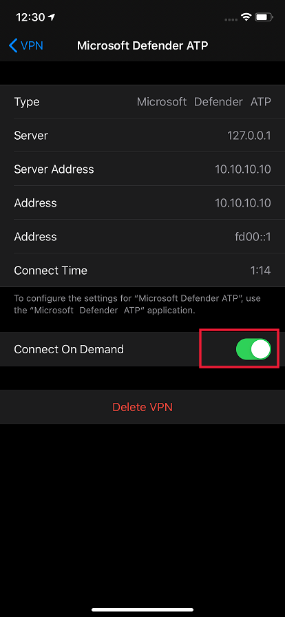

# 在 iOS 功能上設定 Microsoft Defender for EndpointConfigure Microsoft Defender for Endpoint on iOS features

[!INCLUDE [Microsoft 365 Defender rebranding](../../includes/microsoft-defender.md)]

**適用於：****Applies to:**
- [適用於端點的 Microsoft DefenderMicrosoft Defender for Endpoint](https://go.microsoft.com/fwlink/p/?linkid=2154037)
- [Microsoft 365 DefenderMicrosoft 365 Defender](https://go.microsoft.com/fwlink/?linkid=2118804)

> 想要體驗 Defender for Endpoint？Want to experience Defender for Endpoint? [注册免費試用版。Sign up for a free trial.](https://www.microsoft.com/microsoft-365/windows/microsoft-defender-atp?ocid=docs-wdatp-exposedapis-abovefoldlink) 

> [!NOTE]
> IOS 上的 Defender for Endpoint 會使用 VPN，以便提供 Web 保護功能。Defender for Endpoint on iOS would use a VPN in order to provide the Web Protection feature. 這不是一般 VPN，也就是本機/自我迴圈的 VPN，不會對裝置以外的流量進行流量。This is not a regular VPN and is a local/self-looping VPN that does not take traffic outside the device.

## 在 iOS 上使用 Defender for Endpoint 進行條件式存取Conditional Access with Defender for Endpoint on iOS  
Microsoft Defender for Endpoint on iOS 隨 Microsoft Intune 和 Azure Active Directory 可根據裝置風險分數強制強制執行裝置合規性和條件式存取原則。Microsoft Defender for Endpoint on iOS along with Microsoft Intune and Azure Active Directory enables enforcing Device compliance and Conditional Access policies based on device risk score. Defender for Endpoint 是行動威脅防護 (MTD) 解決方案，您可以透過 Intune 部署此功能，以利用這項功能。Defender for Endpoint is a Mobile Threat Defense (MTD) solution that you can deploy to leverage this capability via Intune.

如需如何設定 iOS 上的使用 Defender for Endpoint 的條件式存取的相關資訊，請參閱 [Defender For endpoint And Intune](/mem/intune/protect/advanced-threat-protection)。For more information about how to set up Conditional Access with Defender for Endpoint on iOS, see [Defender for Endpoint and Intune](/mem/intune/protect/advanced-threat-protection).

### Microsoft Defender for Endpoint 的 Jailbreak 偵測Jailbreak detection by Microsoft Defender for Endpoint
Microsoft Defender for Endpoint 具備偵測已越獄之受管理和受管理裝置的能力。Microsoft Defender for Endpoint has the capability of detecting unmanaged and managed devices that are jailbroken. 如果偵測到裝置已越獄，將會向安全中心報告 **高** 風險警示，而且如果根據裝置風險分數設定條件式存取，則系統會封鎖裝置以存取公司資料。If a device is detected to be jailbroken, a **High**-risk alert will be reported to Security Center and if Conditional Access is setup based on device risk score, then the device will be blocked from accessing corporate data.

## Web 保護和 VPNWeb Protection and VPN

根據預設，iOS 上的 Defender for Endpoint 會包含並啟用 web 保護功能。By default, Defender for Endpoint on iOS includes and enables the web protection feature. [Web 保護](web-protection-overview.md) 可協助保護裝置免受網頁威脅，並保護使用者免受網路釣魚攻擊。[Web protection](web-protection-overview.md) helps to secure devices against web threats and protect users from phishing attacks. IOS 上的 Defender for Endpoint 會使用 VPN，以提供此保護。Defender for Endpoint on iOS uses a VPN in order to provide this protection. 請注意，這是本機 VPN，與傳統 VPN 不同，網路流量不會傳送到裝置外。Please note this is a local VPN and unlike traditional VPN, network traffic is not sent outside the device.

預設為啟用時，可能需要停用 VPN。While enabled by default, there might be some cases that require you to disable VPN. 例如，當設定 VPN 時，您想要執行一些無法運作的應用程式。For example, you want to run some apps that do not work when a VPN is configured. 在這種情況下，您可以依照下列步驟，從裝置上的應用程式中選擇停用 VPN：In such cases, you can choose to disable VPN from the app on the device by following the steps below:

1. 在您的 iOS 裝置上，開啟 **設定** 應用程式，按一下或點擊 **[一般**]，然後再按一下 [ **VPN**]。On your iOS device, open the **Settings** app, click or tap **General** and then **VPN**.
1. 按一下或點擊 Microsoft Defender for Endpoint 的「i」按鈕。Click or tap the "i" button for Microsoft Defender for Endpoint.
1. 關閉連線停用 VPN 的 **要求**。Toggle off **Connect On Demand** to disable VPN.

    > [!div class="mx-imgBorder"]
    > 

> [!NOTE]
> 停用 VPN 時，將無法使用 Web 保護。Web Protection will not be available when VPN is disabled. 若要重新啟用 Web 保護，請開啟裝置上的 Microsoft Defender for Endpoint app，然後按一下或點擊 [ **啟動 VPN**]。To re-enable Web Protection, open the Microsoft Defender for Endpoint app on the device and click or tap **Start VPN**.

## 共同存在多個 VPN 設定檔Co-existence of multiple VPN profiles

Apple iOS 不支援多個全裝置的 Vpn 同時作用中。Apple iOS does not support multiple device-wide VPNs to be active simultaneously. 雖然裝置上可以有多個 VPN 設定檔，但一次只能有一個 VPN 可用。While multiple VPN profiles can exist on the device, only one VPN can be active at a time.

## 在應用程式防護原則 (MAM) 中設定 Microsoft Defender 的 Endpoint 危險信號Configure Microsoft Defender for Endpoint risk signal in app protection policy (MAM)

Microsoft Defender for Endpoint 可以設定成傳送威脅信號，以用於應用程式保護原則 (APP，也稱為 iOS/iPadOS 上的 MAM) 。Microsoft Defender for Endpoint can be configured to send threat signals to be used in App Protection Policies (APP, also known as MAM) on iOS/iPadOS. 使用此功能，您可以使用 Microsoft Defender for Endpoint 來保護對 unenrolled 裝置中公司資料的存取。With this capability, you can use Microsoft Defender for Endpoint to protect access to corporate data from unenrolled devices as well.

使用 Microsoft Defender for Endpoint 安裝應用程式保護原則的步驟如下：Steps to setup app protection policies with Microsoft Defender for Endpoint are as below:

1. 設定從 Microsoft 端點管理員租使用者至 Microsoft Defender for Endpoint 的連線。Set up the connection from your Microsoft Endpoint Manager tenant to Microsoft Defender for Endpoint. 在 [Microsoft 端點](https://go.microsoft.com/fwlink/?linkid=2109431)管理員系統管理中心中，移 **至 [** 跨平臺) ] 底下的 [  >    >  **microsoft defender for endpoint] 的 [microsoft defender for** endpoint (] 或 [安裝) 下的 endpoint **Security**  >  **microsoft defender** ] (]，然後開啟 **設定的應用程式保護原則 iOS** 下的切換。In [Microsoft Endpoint manager admin center](https://go.microsoft.com/fwlink/?linkid=2109431), go to **Tenant Administration** > **Connectors and tokens** > **Microsoft Defender for Endpoint** (under Cross platform) or **Endpoint Security** > **Microsoft Defender for Endpoint** (under Setup) and turn on the toggles under **App Protection Policy Settings for iOS**.
1. 選取 [儲存]。Select Save. 您應該會看到 [ **線上狀態** ] 現在已設定為 [ **啟用**]。You should see **Connection status** is now set to **Enabled**.
1. 建立應用程式保護原則：在您的 Microsoft Defender Endpoint connector 安裝程式完成後，請流覽至 [原則]) 底下 (的 [**應用**  >  **程式 app protection 原則**]，以建立新的原則或更新現有的原則。Create app protection policy: After your Microsoft Defender for Endpoint connector setup is complete, navigate to **Apps** > **App protection policies** (under Policy) to create a new policy or update an existing one.
1. 針對您的原則，選取您的組織所需的平臺、 **應用程式、資料保護和存取需求** 設定。Select the platform, **Apps, Data protection, Access requirements** settings that your organization requires for your policy.
1. 在 [**條件式啟動**  >  **裝置條件**] 底下，您會發現設定 **允許的裝置威脅層級上限**。Under **Conditional launch** > **Device conditions**, you will find the setting **Max allowed device threat level**. 這將需要設定為 [低]、[中]、[高] 或 [安全]。This will need to be configured to either Low, Medium, High, or Secured. 您可以使用的動作會 **封鎖存取權** 或 **清除資料**。The actions available to you will be **Block access** or **Wipe data**. 您可能會看到 [資訊] 對話方塊，確定在此設定之前設定好您的連接器會生效。You may see an informational dialog to make sure you have your connector set up prior to this setting take effect. 如果您的連接器已設定好，您可以忽略此對話方塊。If your connector is already set up, you may ignore this dialog.
1. 完成工作分派並儲存原則。Finish with Assignments and save your policy.

如需 MAM 或 app protection 原則的詳細資訊，請參閱 [iOS app protection 原則設定](https://docs.microsoft.com/mem/intune/apps/app-protection-policy-settings-ios)。For more details on MAM or app protection policy, see [iOS app protection policy settings](https://docs.microsoft.com/mem/intune/apps/app-protection-policy-settings-ios).

### 為 MAM 或 unenrolled 裝置部署 Microsoft Defender for EndpointDeploying Microsoft Defender for Endpoint for MAM or on unenrolled devices

IOS 上的 Microsoft Defender for Endpoint 會啟用應用程式保護原則案例，並可在 Apple 應用程式存放區中取得。Microsoft Defender for Endpoint on iOS enables the App Protection Policy scenario and is available in the Apple app store.

使用者應直接從 Apple app store 安裝最新版的應用程式。End-users should install the latest version of the app directly from the Apple app store.

## 設定已越獄裝置的相容性原則Configure compliance policy against jailbroken devices

為了保護公司資料無法在已越獄的 iOS 裝置上存取，我們建議您在 Intune 上設定下列符合性原則。To protect corporate data from being accessed on jailbroken iOS devices, we recommend that you set up the following compliance policy on Intune.

> [!NOTE]
> Jailbreak 偵測是 Microsoft Defender for Endpoint on iOS 所提供的功能。Jailbreak detection is a capability provided by Microsoft Defender for Endpoint on iOS. 不過，我們建議您將此原則設定為其他防禦層級，以防禦 jailbreak 案例。However, we recommend that you setup this policy as an additional layer of defense against jailbreak scenarios.

請遵循下列步驟，建立對已越獄裝置的相容性原則。Follow the steps below to create a compliance policy against jailbroken devices.

1. 在 [Microsoft 端點管理員系統管理中心](https://go.microsoft.com/fwlink/?linkid=2109431)，移至 [**裝置**  ->  **規範原則**] [  ->  **建立原則**]。In [Microsoft Endpoint Manager admin center](https://go.microsoft.com/fwlink/?linkid=2109431), go to **Devices** -> **Compliance policies** -> **Create Policy**. 選取 "iOS/iPadOS" 作為平臺，然後按一下 [ **建立**]。Select "iOS/iPadOS" as platform and click **Create**.

    > [!div class="mx-imgBorder"]
    > 

2. 指定原則的名稱，例如「Jailbreak 的合規性原則」。Specify a name of the policy, for example "Compliance Policy for Jailbreak".
3. 在 [規範設定] 頁面上，按一下以展開 [**裝置健全**] 區段，然後按一下 [封鎖 **裝置** 的 **封鎖**] 欄位。In the compliance settings page, click to expand **Device Health** section and click **Block** for **Jailbroken devices** field.

    > [!div class="mx-imgBorder"]
    > 

4. 在 [不 **符合之動作** ] 區段中，根據您的需求選取動作，然後選取 **[下一步]**。In the **Action for noncompliance** section, select the actions as per your requirements and select **Next**.

    > [!div class="mx-imgBorder"]
    > 

5. 在 [ **工作分派** ] 區段中，選取您要包含此原則的使用者群組，然後選取 **[下一步]**。In the **Assignments** section, select the user groups that you want to include for this policy and then select **Next**.
6. 在 [ **複查 + 建立** ] 區段中，確認輸入的所有資訊正確無誤，然後選取 [ **建立**]。In the **Review+Create** section, verify that all the information entered is correct and then select **Create**.

## 設定自訂指示器Configure custom indicators

IOS 上的 Defender for Endpoint 可讓系統管理員也在 iOS 裝置上設定自訂指示器。Defender for Endpoint on iOS enables admins to configure custom indicators on iOS devices as well. 如需如何設定自訂指示器的詳細資訊，請參閱 [管理指示器](/microsoft-365/security/defender-endpoint/manage-indicators)。For more information on how to configure custom indicators, see [Manage indicators](/microsoft-365/security/defender-endpoint/manage-indicators).

> [!NOTE]
> IOS 上的 Defender for Endpoint 支援只為 IP 位址和 URLs/網域建立自訂指示器。Defender for Endpoint on iOS supports creating custom indicators only for IP addresses and URLs/domains.

## 報告不安全的網站Report unsafe site

網路釣魚網站會為了取得您的個人或財務資訊，模仿可信的網站。Phishing websites impersonate trustworthy websites for the purpose of obtaining your personal or financial information. 如果您想要報告可能是網路釣魚網站的網站，請造訪 [ [提供有關網路保護的意見](https://www.microsoft.com/wdsi/filesubmission/exploitguard/networkprotection) 反應] 頁面。Visit the [Provide feedback about network protection](https://www.microsoft.com/wdsi/filesubmission/exploitguard/networkprotection) page if you want to report a website that could be a phishing site.

