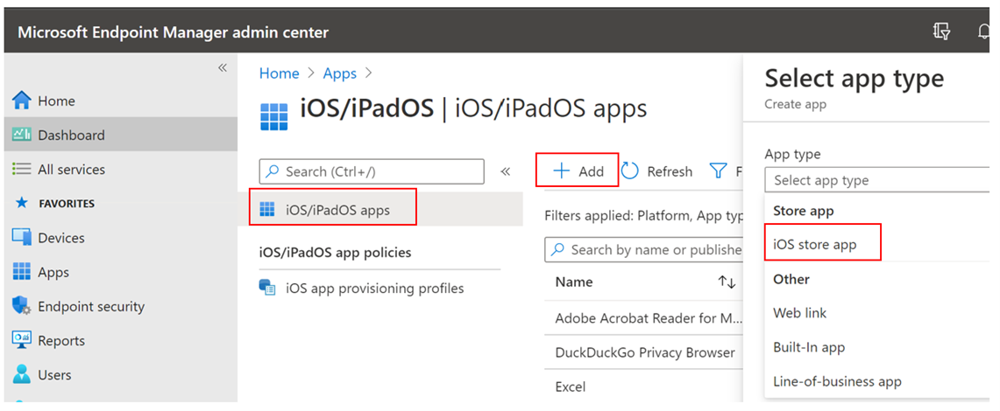
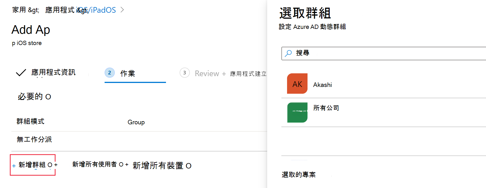
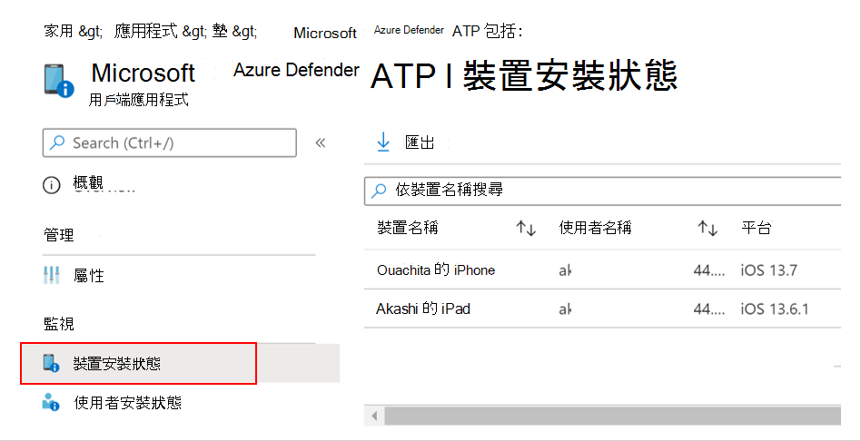
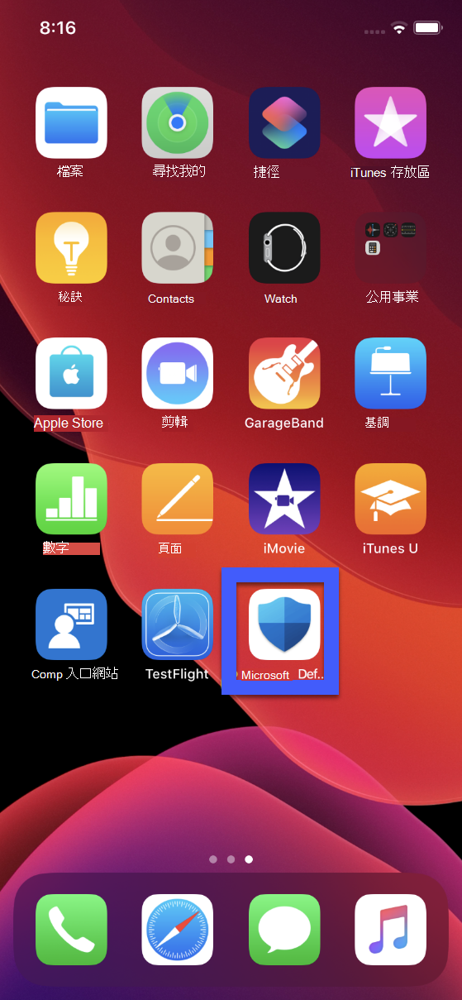
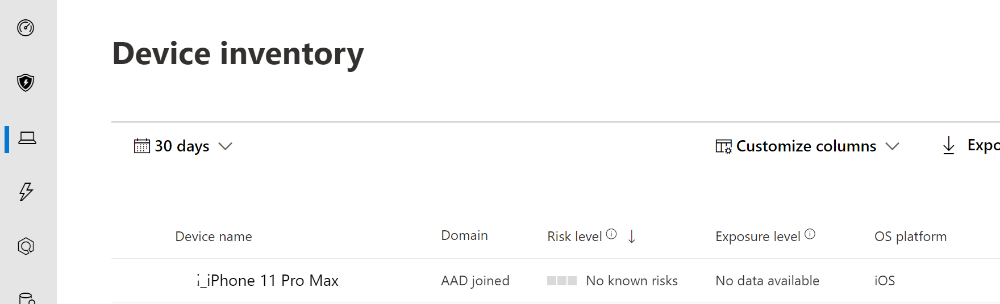
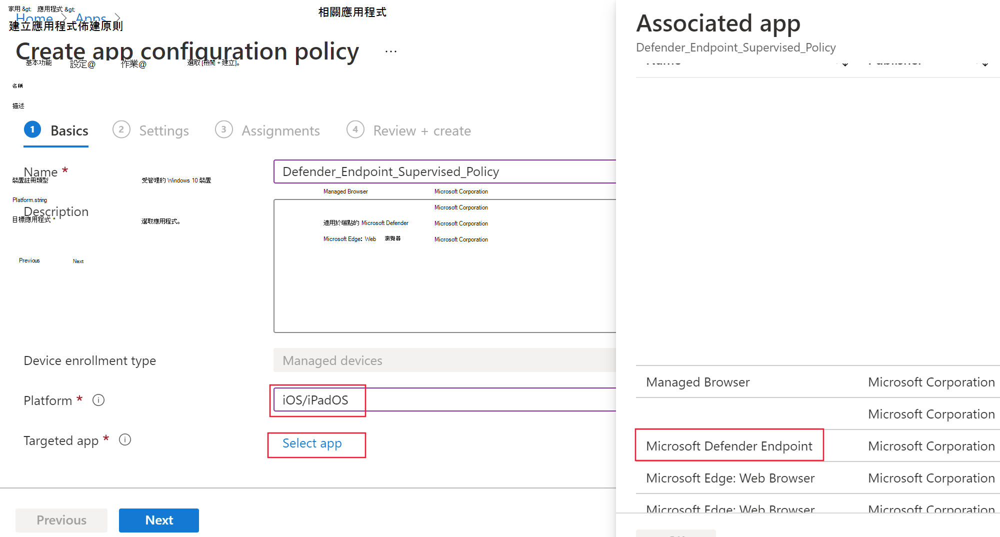
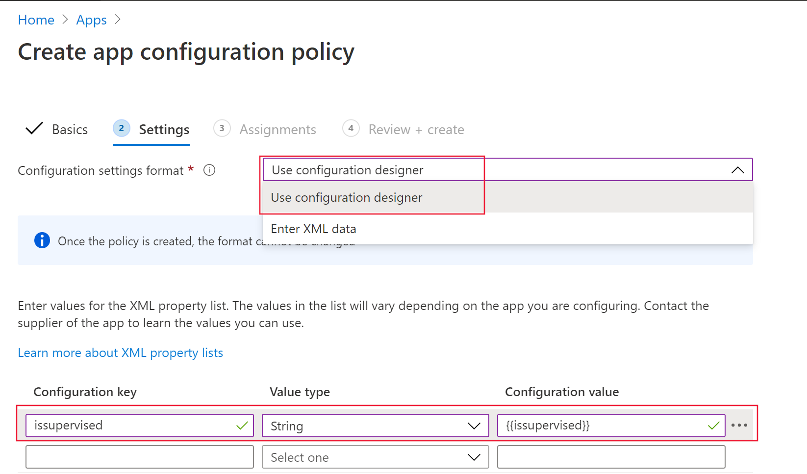

# 為 iOS 部署 Microsoft Defender for Endpoint

[!INCLUDE [Microsoft 365 Defender rebranding](../../includes/microsoft-defender.md)]

**適用於：**
- [適用於端點的 Microsoft Defender](https://go.microsoft.com/fwlink/p/?linkid=2154037)
- [Microsoft 365 Defender](https://go.microsoft.com/fwlink/?linkid=2118804)

> 想要體驗 Defender for Endpoint？ [註冊免費試用版。](https://www.microsoft.com/microsoft-365/windows/microsoft-defender-atp?ocid=docs-wdatp-investigateip-abovefoldlink)

本主題說明如何在 Intune 公司入口網站註冊裝置上為 iOS 的端點部署 Defender。 如需 Intune 裝置註冊的詳細資訊，請參閱 [在 intune 中註冊 iOS/iPadOS 裝置](https://docs.microsoft.com/mem/intune/enrollment/ios-enroll)。

## 開始之前

- 確定您可以存取 [Microsoft 端點管理員管理中心](https://go.microsoft.com/fwlink/?linkid=2109431)。

- 確定已為您的使用者執行 iOS 註冊。 使用者必須具有指派的 Defender for Endpoint 授權，才能將 Defender 用於 iOS。 如需指派授權的相關指示，請參閱 [指派授權給使用者](https://docs.microsoft.com/azure/active-directory/users-groups-roles/licensing-groups-assign) 。

> [!NOTE]
> 現在，您可以在 [Apple 應用程式存放區](https://aka.ms/mdatpiosappstore)中取得 iOS 的 (microsoft Defender 的端點) 的 MICROSOFT defender ATP。

## 部署步驟

透過 Intune 公司入口網站為 iOS 的端點部署 Defender。

### 新增 iOS 儲存應用程式

1. 在 [Microsoft 端點](https://go.microsoft.com/fwlink/?linkid=2109431)管理員系統管理中心中，移至 [**應用**  ->  **iOS/iPadOS**] [  ->  **新增**  ->  **iOS 儲存應用程式**]，然後按一下 [**選取**]。

    > [!div class="mx-imgBorder"]
    > 

1. 在 [新增應用程式] 頁面上，按一下 [ **搜尋應用程式存放區** ]，然後在搜尋列中輸入 **Microsoft Defender 端點** 。 在 [搜尋結果] 區段中，按一下 [ *Microsoft Defender 端點* ]，然後按一下 [ **選取**]。

1. 選取 [ **iOS 11.0** ] 做為最小作業系統。 查看應用程式的其餘資訊，然後按 **[下一步]**。

1. 在 [ *工作分派* ] 區段中，移至 [ **必要** ] 區段，然後選取 [ **新增群組**]。 然後，您可以選擇要將其設定為 iOS 應用程式之 Defender 的使用者群組 (s) 。 按一下 [**選取**]，然後按一下 **[下一步]**

    > [!NOTE]
    > 選取的使用者群組應該包含 Intune 登記的使用者。

    > [!div class="mx-imgBorder"]
    > 

1. 在 [ *複查 + 建立* ] 區段中，確認輸入的所有資訊正確無誤，然後選取 [ **建立**]。 在幾分鐘內，應順利建立端點應用程式，並且在頁面的右上角應該會顯示通知。

1. 在顯示的 [應用程式資訊] 頁面中，選取 [ **監視** ] 區段中的 [ **裝置安裝狀態** ]，以確認裝置安裝已成功完成。

    > [!div class="mx-imgBorder"]
    > 

## 完成上架和支票狀態

1. 一旦裝置上已安裝 iOS 的 Endpoint for Endpoint，您就會看到 app 圖示。

    

2. 點擊 [Defender for Endpoint app] 圖示，然後依照螢幕指示完成上架步驟。 詳細資料包含使用者接受 iOS iOS 的 Defender for Endpoint 所需的許可權。

3. 成功上架後，裝置會在 Microsoft Defender 安全中心的 [裝置] 清單上開始顯示。

    > [!div class="mx-imgBorder"]
    > 

## 針對監督模式設定 Microsoft Defender for Endpoint

IPadOS 應用程式的 Microsoft Defender for iOS Endpoint 具備特定的功能，可在受監督的 iOS/裝置上進行特殊的功能，但前提是這些裝置類型的平臺已增加管理功能。 若要利用這些功能，終結點應用程式必須知道裝置是否處於監督模式。

### 透過 Intune 設定監督模式

Intune 可讓您透過應用程式設定原則設定 iOS 應用程式的 Defender。

   > [!NOTE]
   > 受監視裝置的此應用程式設定原則只適用于受管理的裝置，而且應針對所有受管理的 iOS 裝置做為最佳作法。

1. 登入 [Microsoft 端點](https://go.microsoft.com/fwlink/?linkid=2109431)管理員系統管理中心，然後移至 **應用**  >  **程式應用程式設定原則**  >  **Add**。 按一下 [ **受管理的裝置**]。

    > [!div class="mx-imgBorder"]
    > 

1. 在 [ *建立應用程式佈建原則* ] 頁面中，提供下列資訊：
    - 原則名稱
    - 平臺： Select iOS/iPadOS
    - 目標應用程式：從清單中選取 [ **Microsoft DEFENDER ATP** ]

    > [!div class="mx-imgBorder"]
    > 

1. 在下一個畫面中，選取 [ **使用 configuration designer** 做為格式]。 指定下列屬性：
    - 設定機碼： issupervised
    - 數值型別：字串
    - 設定值： {{issupervised}}
    
    > [!div class="mx-imgBorder"]
    > 

1. 按 **[下一步]** 開啟 [ **範圍標記** ] 頁面。 範圍標記是選用的。 按 **[下一步]** 繼續。

1. 在 [ **工作分派** ] 頁面上，選取將要接收此設定檔的群組。 針對此案例，最佳作法是針對 **所有裝置**。 如需指派設定檔的詳細資訊，請參閱 [指派使用者和裝置設定檔](https://docs.microsoft.com/mem/intune/configuration/device-profile-assign)。

   部署至使用者群組時，使用者必須先登入裝置，然後才能套用原則。

   按 [下一步]。

1. 當您完成時，請在 [ **複查 + 建立** ] 頁面上，選擇 [ **建立**]。 新的設定檔會顯示在設定檔的清單中。

1. 接下來，針對增強型防網路釣魚功能，您可以在監督的 iOS 裝置上部署自訂設定檔。 請遵循下列步驟：
    - 從下載設定檔 [https://aka.ms/mdatpiossupervisedprofile](https://aka.ms/mdatpiossupervisedprofile)
    - 流覽至 **裝置**  ->  **iOS/iPadOS** 設定配置  ->  **檔**  ->  **建立設定檔**

    > [!div class="mx-imgBorder"]
    > 

    - 提供設定檔的名稱。 當系統提示您匯入設定設定檔檔案時，請選取上述下載的檔案。
    - 在 [ **工作分派** ] 區段中，選取您要套用此設定檔的裝置群組。 最佳作法是將此套用至所有受管理的 iOS 裝置。 按 [下一步]。
    - 當您完成時，請在 [ **複查 + 建立** ] 頁面上，選擇 [ **建立**]。 新的設定檔會顯示在設定檔的清單中。

## 後續步驟

[設定 iOS 功能之端點的 Defender](ios-configure-features.md)
