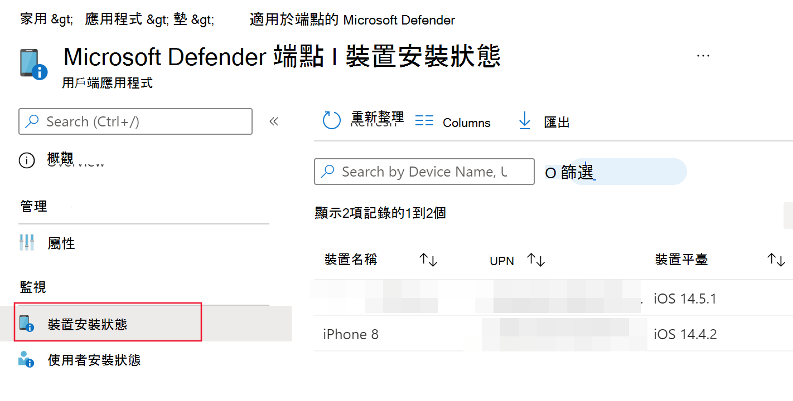

# 在 iOS 上部署 Microsoft Defender for EndpointDeploy Microsoft Defender for Endpoint on iOS

[!INCLUDE [Microsoft 365 Defender rebranding](../../includes/microsoft-defender.md)]

**適用於：****Applies to:**
- [適用於端點的 Microsoft DefenderMicrosoft Defender for Endpoint](https://go.microsoft.com/fwlink/p/?linkid=2154037)
- [Microsoft 365 DefenderMicrosoft 365 Defender](https://go.microsoft.com/fwlink/?linkid=2118804)

> 想要體驗 Defender for Endpoint？Want to experience Defender for Endpoint? [註冊免費試用版。Sign up for a free trial.](https://www.microsoft.com/microsoft-365/windows/microsoft-defender-atp?ocid=docs-wdatp-investigateip-abovefoldlink)

本主題說明如何在 Intune 公司入口網站註冊裝置上為 iOS 的端點部署 Defender。This topic describes deploying Defender for Endpoint for iOS on Intune Company Portal enrolled devices. 如需 Intune 裝置註冊的詳細資訊，請參閱 [在 intune 中註冊 iOS/iPadOS 裝置](https://docs.microsoft.com/mem/intune/enrollment/ios-enroll)。For more information about Intune device enrollment, see [Enroll iOS/iPadOS devices in Intune](https://docs.microsoft.com/mem/intune/enrollment/ios-enroll).

## 開始之前Before you begin

- 確定您可以存取 [Microsoft 端點管理員管理中心](https://go.microsoft.com/fwlink/?linkid=2109431)。Ensure you have access to [Microsoft Endpoint manager admin center](https://go.microsoft.com/fwlink/?linkid=2109431).

- 確定已為您的使用者執行 iOS 註冊。Ensure iOS enrollment is done for your users. 使用者必須具有指派的 Defender for Endpoint 授權，才能將 Defender 用於 iOS。Users need to have a Defender for Endpoint license assigned in order to use Defender for Endpoint for iOS. 如需指派授權的相關指示，請參閱 [指派授權給使用者](https://docs.microsoft.com/azure/active-directory/users-groups-roles/licensing-groups-assign) 。Refer to [Assign licenses to users](https://docs.microsoft.com/azure/active-directory/users-groups-roles/licensing-groups-assign) for instructions on how to assign licenses.

> [!NOTE]
> 現在，您可以在 [Apple 應用程式存放區](https://aka.ms/mdatpiosappstore)中取得 iOS 的 (microsoft Defender 的端點) 的 MICROSOFT defender ATP。Microsoft Defender ATP (Microsoft Defender for Endpoint) for iOS is now available in the [Apple App Store](https://aka.ms/mdatpiosappstore).

## 部署步驟Deployment steps

透過 Intune 公司入口網站為 iOS 的端點部署 Defender。Deploy Defender for Endpoint for iOS via Intune Company Portal.

### 新增 iOS 儲存應用程式Add iOS store app

1. 在 [Microsoft 端點](https://go.microsoft.com/fwlink/?linkid=2109431)管理員系統管理中心中，移至 [**應用**  ->  **iOS/iPadOS**] [  ->  **新增**  ->  **iOS 儲存應用程式**]，然後按一下 [**選取**]。In [Microsoft Endpoint manager admin center](https://go.microsoft.com/fwlink/?linkid=2109431), go to **Apps** -> **iOS/iPadOS** -> **Add** -> **iOS store app** and click **Select**.

    > [!div class="mx-imgBorder"]
    > 

1. 在 [新增應用程式] 頁面上，按一下 [ **搜尋應用程式存放區** ]，然後在搜尋列中輸入 **Microsoft Defender 端點** 。On the Add app page, click on **Search the App Store** and type **Microsoft Defender Endpoint** in the search bar. 在 [搜尋結果] 區段中，按一下 [ *Microsoft Defender 端點* ]，然後按一下 [ **選取**]。In the search results section, click on *Microsoft Defender Endpoint* and click **Select**.

1. 選取 [ **iOS 11.0** ] 做為最小作業系統。Select **iOS 11.0** as the Minimum operating system. 查看應用程式的其餘資訊，然後按 **[下一步]**。Review the rest of information about the app and click **Next**.

1. 在 [ *工作分派* ] 區段中，移至 [ **必要** ] 區段，然後選取 [ **新增群組**]。In the *Assignments* section, go to the **Required** section and select **Add group**. 然後，您可以選擇要將其設定為 iOS 應用程式之 Defender 的使用者群組 (s) 。You can then choose the user group(s) that you would like to target Defender for Endpoint for iOS app. 按一下 [**選取**]，然後按一下 **[下一步]**Click **Select** and then **Next**.

    > [!NOTE]
    > 選取的使用者群組應該包含 Intune 登記的使用者。The selected user group should consist of Intune enrolled users.

    > [!div class="mx-imgBorder"]
    > 

1. 在 [ *複查 + 建立* ] 區段中，確認輸入的所有資訊正確無誤，然後選取 [ **建立**]。In the *Review + Create* section, verify that all the information entered is correct and then select **Create**. 在幾分鐘內，應順利建立端點應用程式，並且在頁面的右上角應該會顯示通知。In a few moments, the Defender for Endpoint app should be created successfully, and a notification should show up at the top-right corner of the page.

1. 在顯示的 [應用程式資訊] 頁面中，選取 [ **監視** ] 區段中的 [ **裝置安裝狀態** ]，以確認裝置安裝已成功完成。In the app information page that is displayed, in the **Monitor** section, select **Device install status** to verify that the device installation has completed successfully.

    > [!div class="mx-imgBorder"]
    > 

## 完成上架和支票狀態Complete onboarding and check status

1. 一旦裝置上已安裝 iOS 的 Endpoint for Endpoint，您就會看到 app 圖示。Once Defender for Endpoint for iOS has been installed on the device, you  will see the app icon.

    

2. 點擊 [Defender for Endpoint app] 圖示，然後依照螢幕指示完成上架步驟。Tap the Defender for Endpoint app icon and follow the on-screen instructions to complete the onboarding steps. 詳細資料包含使用者接受 iOS iOS 的 Defender for Endpoint 所需的許可權。The details include end-user acceptance of iOS permissions required by Defender for Endpoint for iOS.

3. 成功上架後，裝置會在 Microsoft Defender 安全中心的 [裝置] 清單上開始顯示。Upon successful onboarding, the device will start showing up on the Devices list in Microsoft Defender Security Center.

    > [!div class="mx-imgBorder"]
    > 

## 針對監督模式設定 Microsoft Defender for EndpointConfigure Microsoft Defender for Endpoint for Supervised Mode

在 iOS 應用程式上的 Microsoft Defender for Endpoint 具有 iOS/iPadOS 裝置的特殊能力，但前提是這些裝置類型的平臺已增加管理功能。The Microsoft Defender for Endpoint on iOS app has specialized ability on supervised iOS/iPadOS devices, given the increased management capabilities provided by the platform on these types of devices. 若要利用這些功能，終結點應用程式必須知道裝置是否處於監督模式。To take advantage of these capabilities, the Defender for Endpoint app needs to know if a device is in Supervised Mode.

### 透過 Intune 設定監督模式Configure Supervised Mode via Intune

Intune 可讓您透過應用程式設定原則設定 iOS 應用程式的 Defender。Intune allows you to configure the Defender for iOS app through an App Configuration policy.

   > [!NOTE]
   > 受監視裝置的此應用程式設定原則只適用于受管理的裝置，而且應針對所有受管理的 iOS 裝置做為最佳作法。This app configuration policy for supervised devices is applicable only to managed devices and should be targeted for all managed iOS devices as a best practice.

1. 登入 [Microsoft 端點](https://go.microsoft.com/fwlink/?linkid=2109431)管理員系統管理中心，然後移至 **應用**  >  **程式應用程式設定原則**  >  **Add**。Sign in to the [Microsoft Endpoint Manager admin center](https://go.microsoft.com/fwlink/?linkid=2109431) and go to **Apps** > **App configuration policies** > **Add**. 按一下 [ **受管理的裝置**]。Click on **Managed devices**.

    > [!div class="mx-imgBorder"]
    > 

1. 在 [ *建立應用程式佈建原則* ] 頁面中，提供下列資訊：In the *Create app configuration policy* page, provide the following information:
    - 原則名稱Policy Name
    - 平臺： Select iOS/iPadOSPlatform: Select iOS/iPadOS
    - 目標應用程式：從清單中選取 [ **Microsoft DEFENDER ATP** ]Targeted app: Select **Microsoft Defender ATP** from the list

    > [!div class="mx-imgBorder"]
    > 

1. 在下一個畫面中，選取 [ **使用 configuration designer** 做為格式]。In the next screen, select **Use configuration designer** as the format. 指定下列屬性：Specify the following property:
    - 設定機碼： issupervisedConfiguration Key: issupervised
    - 數值型別：字串Value type: String
    - 設定值： {{issupervised}}Configuration Value: {{issupervised}}
    
    > [!div class="mx-imgBorder"]
    > 

1. 按 **[下一步]** 開啟 [ **範圍標記** ] 頁面。Click **Next** to open the **Scope tags** page. 範圍標記是選用的。Scope tags are optional. 按 **[下一步]** 繼續。Click **Next** to continue.

1. 在 [ **工作分派** ] 頁面上，選取將要接收此設定檔的群組。On the **Assignments** page, select the groups that will receive this profile. 針對此案例，最佳作法是針對 **所有裝置**。For this scenario, it is best practice to target **All Devices**. 如需指派設定檔的詳細資訊，請參閱 [指派使用者和裝置設定檔](https://docs.microsoft.com/mem/intune/configuration/device-profile-assign)。For more information on assigning profiles, see [Assign user and device profiles](https://docs.microsoft.com/mem/intune/configuration/device-profile-assign).

   部署至使用者群組時，使用者必須先登入裝置，然後才能套用原則。When deploying to user groups, a user must sign in to a device before the policy applies.

   按 [下一步]。Click **Next**.

1. 當您完成時，請在 [ **複查 + 建立** ] 頁面上，選擇 [ **建立**]。On the **Review + create** page, when you're done, choose **Create**. 新的設定檔會顯示在設定檔的清單中。The new profile is displayed in the list of configuration profiles.

1. 接下來，針對增強型防網路釣魚功能，您可以在監督的 iOS 裝置上部署自訂設定檔。Next, for enhanced Anti-phishing capabilities, you can deploy a custom profile on the supervised iOS devices. 請遵循下列步驟：Follow the steps below:
    - 從下載設定檔 [https://aka.ms/mdatpiossupervisedprofile](https://aka.ms/mdatpiossupervisedprofile)Download the config profile from [https://aka.ms/mdatpiossupervisedprofile](https://aka.ms/mdatpiossupervisedprofile)
    - 流覽至 **裝置**  ->  **iOS/iPadOS** 設定配置  ->  **檔**  ->  **建立設定檔**Navigate to **Devices** -> **iOS/iPadOS** -> **Configuration profiles** -> **Create Profile**

    > [!div class="mx-imgBorder"]
    > 

    - 提供設定檔的名稱。Provide a name of the profile. 當系統提示您匯入設定設定檔檔案時，請選取上述下載的檔案。When prompted to import a Configuration profile file, select the one downloaded above.
    - 在 [ **工作分派** ] 區段中，選取您要套用此設定檔的裝置群組。In the **Assignment** section, select the device group to which you want to apply this profile. 最佳作法是將此套用至所有受管理的 iOS 裝置。As a best practice, this should be applied to all managed iOS devices. 按 [下一步]。Click **Next**.
    - 當您完成時，請在 [ **複查 + 建立** ] 頁面上，選擇 [ **建立**]。On the **Review + create** page, when you're done, choose **Create**. 新的設定檔會顯示在設定檔的清單中。The new profile is displayed in the list of configuration profiles.

## 後續步驟Next Steps

[設定 iOS 功能之端點的 DefenderConfigure Defender for Endpoint for iOS features](ios-configure-features.md)
