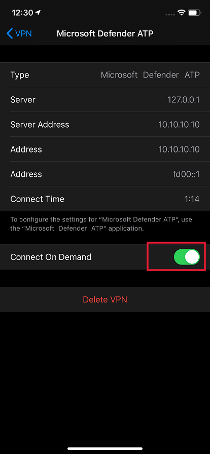

# 在 iOS 上的 Microsoft Defender for Endpoint 上進行問題的疑難排解及尋找答案 FAQsTroubleshoot issues and find answers to FAQs on Microsoft Defender for Endpoint on iOS

[!INCLUDE [Microsoft 365 Defender rebranding](../../includes/microsoft-defender.md)]

**適用於：****Applies to:**
- [適用於端點的 Microsoft DefenderMicrosoft Defender for Endpoint](https://go.microsoft.com/fwlink/p/?linkid=2154037)
- [Microsoft 365 DefenderMicrosoft 365 Defender](https://go.microsoft.com/fwlink/?linkid=2118804)

> 想要體驗 Defender for Endpoint？Want to experience Defender for Endpoint? [注册免費試用版。Sign up for a free trial.](https://www.microsoft.com/microsoft-365/windows/microsoft-defender-atp?ocid=docs-wdatp-exposedapis-abovefoldlink) 

本主題提供疑難排解資訊，可協助您處理當您在 iOS 上使用 Microsoft Defender for Endpoint 時可能發生的問題。This topic provides troubleshooting information to help you address issues that may arise as you use Microsoft Defender for Endpoint on iOS.

> [!NOTE]
> IOS 上的 Defender for Endpoint 會使用 VPN，以便提供 Web 保護功能。Defender for Endpoint on iOS would use a VPN in order to provide the Web Protection feature. 這不是一般 VPN，也就是本機/自我迴圈的 VPN，不會對裝置以外的流量進行流量。This is not a regular VPN and is a local/self-looping VPN that does not take traffic outside the device.

## 開啟 VPN 時，應用程式無法運作Apps don't work when VPN is turned on
偵測到主動 VPN 時，有些應用程式停止運作。There are some apps that stop functioning when an active VPN is detected. 您可以在使用這類應用程式時停用 VPN。You can disable the VPN during the time you are using such apps. 

根據預設，iOS 上的 Defender for Endpoint 會包含並啟用 web 保護功能。By default, Defender for Endpoint on iOS includes and enables the web protection feature. [Web 保護](web-protection-overview.md) 可協助保護裝置免受網頁威脅，並保護使用者免受網路釣魚攻擊。[Web protection](web-protection-overview.md) helps to secure devices against web threats and protect users from phishing attacks. IOS 上的 Defender for Endpoint 會使用 VPN，以提供此保護。Defender for Endpoint on iOS uses a VPN in order to provide this protection. 請注意，這是本機 VPN，與傳統 VPN 不同，網路流量不會傳送到裝置外。Please note this is a local VPN and unlike traditional VPN, network traffic is not sent outside the device.

預設為啟用時，可能需要停用 VPN。While enabled by default, there might be some cases that require you to disable VPN. 例如，當設定 VPN 時，您想要執行一些無法運作的應用程式。For example, you want to run some apps that do not work when a VPN is configured. 在這種情況下，您可以依照下列步驟，從裝置上的應用程式中選擇停用 VPN：In such cases, you can choose to disable VPN from the app on the device by following the steps below:

1. 在您的 iOS 裝置上，開啟 **設定** 應用程式，按一下或點擊 **[一般**]，然後再按一下 [ **VPN**]。On your iOS device, open the **Settings** app, click or tap **General** and then **VPN**.
1. 按一下或點擊 Microsoft Defender for Endpoint 的「i」按鈕。Click or tap the "i" button for Microsoft Defender for Endpoint.
1. 關閉連線停用 VPN 的 **要求**。Toggle off **Connect On Demand** to disable VPN.

    > [!div class="mx-imgBorder"]
    > 

> [!NOTE]
> 停用 VPN 時，將無法使用 Web 保護。Web Protection will not be available when VPN is disabled. 若要重新啟用 Web 保護，請開啟裝置上的 Microsoft Defender for Endpoint app，然後按一下或點擊 [ **啟動 VPN**]。To re-enable Web Protection, open the Microsoft Defender for Endpoint app on the device and click or tap **Start VPN**.

## 多個 VPN 設定檔的問題Issues with multiple VPN profiles

Apple iOS 不支援多個 **全裝置的** vpn 同時作用中。Apple iOS does not support multiple **device-wide** VPNs to be active simultaneously. 雖然裝置上可以有多個 VPN 設定檔，但一次只能有一個 VPN 可用。While multiple VPN profiles can exist on the device, only one VPN can be active at a time.

Microsoft Defender for Endpoint VPN 可以與其他設定為個別 *應用程式* 或 *"個人"* 的 vpn 共同存在。Microsoft Defender for Endpoint VPN can co-exist with other VPNs that are configured as *per-app* or *"Personal"*.

## 電池消耗Battery consumption

在設定應用程式中，iOS 只會顯示使用者在特定期間內可看到之應用程式的電池使用方式。In the Settings app, iOS only shows battery usage of apps that are visible to the user for a specific duration of time. 螢幕上顯示之應用程式的電池使用量只是針對該時段，而且會根據許多因素（包括 CPU 和網路使用量）進行 iOS 計算。The battery usage by apps shown on the screen are only for that time duration and is computed by iOS based on a multitude of factors including CPU and Network usage. Microsoft Defender for Endpoint 會在背景中使用本機/環路傳回 VPN，檢查任何惡意網站或連線的網頁流量。Microsoft Defender for Endpoint uses a local/loop-back VPN in the background to check web traffic for any malicious websites or connections. 任何應用程式的網路封包都會進行此項檢查，從而導致無法準確計算 Microsoft Defender for Endpoint 的電池使用量。Network packets from any app go through this check and that causes the battery usage of Microsoft Defender for Endpoint to be computed inaccurately. Microsoft Defender for Endpoint 的實際電池消耗遠遠小於裝置上的 [電池設定] 頁面上顯示的數目。The actual battery consumption of Microsoft Defender for Endpoint is much less than what is shown on the Battery Settings page on the device.

在後臺執行的 Microsoft Defender for Endpoint 的每日平均電池使用量 **大約是該天使用的整體電池占 8.81%**。On an average, per-day battery usage by Microsoft Defender for Endpoint running on the background is **approximately 8.81% of overall battery consumed in that day**. 根據使用者裝置上的 Microsoft Defender for Endpoint 的實際使用量，此度量值是透過 Apple 報告，而由於上述原因，也可能會考慮到具有網路活動的其他應用程式。This metric is reported by Apple based on actual usage of Microsoft Defender for Endpoint on end-user devices and due to reasons mentioned above can also be accounted to other apps that have network activity.

此外，使用的 VPN 也是本機 VPN，與傳統的 VPN 不同的是，網路流量不會傳送到裝置外。Also, the VPN used is a local VPN and unlike a traditional VPN, network traffic is not sent outside the device.

## 資料使用量Data usage

Microsoft Defender for Endpoint 會使用本機/回送 VPN，檢查任何惡意網站或連線的網頁流量。Microsoft Defender for Endpoint uses a local/loopback VPN to check web traffic for any malicious websites or connections. 由於這個原因，可不准確為端點資料使用量進行 Microsoft Defender 資料使用量的考慮。Due to this reason, Microsoft Defender for Endpoint data usage can be inaccurately accounted for. Microsoft Defender for Endpoint 的實際資料使用量並不如裝置上的資料使用量設定所顯示的內容少。The actual data usage by Microsoft Defender for Endpoint is not significant and lesser than what is shown on the Data Usage Settings on the device.

## 報告不安全的網站Report unsafe site

網路釣魚網站會為了取得您的個人或財務資訊，模仿可信的網站。Phishing websites impersonate trustworthy websites for the purpose of obtaining your personal or financial information. 就診「 [提供網路保護的意見](https://www.microsoft.com/wdsi/filesubmission/exploitguard/networkprotection) 反應」頁面，以報告可能是仿冒網站的網站。Visit the [Provide feedback about network protection](https://www.microsoft.com/wdsi/filesubmission/exploitguard/networkprotection) page to report a website that could be a phishing site.

## 偵測到惡意網站Malicious site detected

Microsoft Defender for Endpoint 會保護您免受網路釣魚或其他網路型攻擊。Microsoft Defender for Endpoint protects you against phishing or other web-based attacks. 如果偵測到惡意的網站，將會封鎖連線，並會將警示傳送至組織的安全性中心入口網站。If a malicious site is detected, the connection is blocked and an alert is sent to the organization's Security Center portal. 警示包括 connection 的功能變數名稱、遠端 IP 位址和裝置詳細資料。The alert includes the domain name of the connection, remote IP address and the device details.

此外，在 iOS 裝置上會顯示通知。In addition, a notification is shown on the iOS device. 在通知上敲擊會開啟下列畫面，讓使用者複查詳細資料。Tapping on the notification opens the following screen for the user to review the details.

> [!div class="mx-imgBorder"]
> 

## 資料和隱私權Data and Privacy

如需收集資料與隱私權的詳細資訊，請參閱 [隱私權資訊-Microsoft Defender For Endpoint on iOS](ios-privacy.md)。For details about data collected and privacy, see [Privacy Information - Microsoft Defender for Endpoint on iOS](ios-privacy.md).

