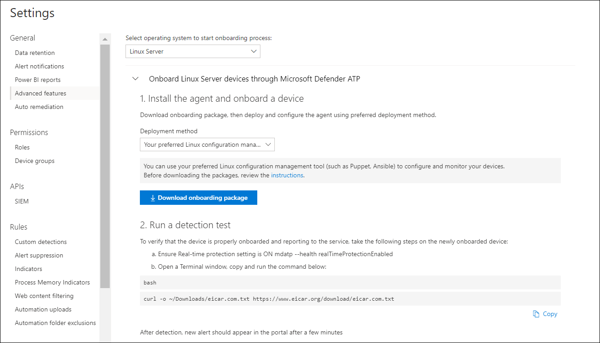

# <a name="deploy-microsoft-defender-for-endpoint-on-linux-with-ansible"></a>使用 Ansible 在 Linux 上部署 Microsoft Defender for Endpoint

[!INCLUDE [Microsoft 365 Defender rebranding](../../includes/microsoft-defender.md)]


**適用於：**
- [適用於端點的 Microsoft Defender](https://go.microsoft.com/fwlink/p/?linkid=2154037)
- [Microsoft 365 Defender](https://go.microsoft.com/fwlink/?linkid=2118804)

> 想要體驗 Defender for Endpoint？ [注册免費試用版。](https://www.microsoft.com/microsoft-365/windows/microsoft-defender-atp?ocid=docs-wdatp-investigateip-abovefoldlink)

本文說明如何使用 Ansible 在 Linux 上部署 Defender for Endpoint。 成功的部署需要完成下列所有工作：

- [下載上架套件](#download-the-onboarding-package)
- [建立 Ansible YAML 檔案](#create-ansible-yaml-files)
- [部署](#deployment)
- [參考資料](#references)

## <a name="prerequisites-and-system-requirements"></a>必要條件和系統需求

開始之前，請參閱 [適用于 Linux 頁面的主要 Defender for The Endpoint](microsoft-defender-endpoint-linux.md) ，以取得目前軟體版本的必要條件和系統需求的描述。

此外，針對 Ansible 部署，您必須熟悉 Ansible 管理工作、Ansible 設定，以及瞭解如何部署行動手冊和工作。 Ansible 有許多方式可完成相同的工作。 這些指示假設支援的 Ansible 模組（如 *apt* 和 *unarchive* ）可用，以協助部署套件。 您的組織可能會使用不同的工作流程。 如需詳細資訊，請參閱 [Ansible 檔](https://docs.ansible.com/) 。

- Ansible 必須安裝在至少一部電腦上 (Ansible 呼叫此控制項節點) 。
- 您必須為系統管理員帳戶設定 SSH，以供在其上安裝 (已安裝 Defender 端點的裝置) ，並且建議使用公開金鑰驗證加以設定。
- 您必須在所有受管理的節點上安裝下列軟體：
  - 捲曲
  - python-apt

- 所有受管理的節點都必須在或相關檔案中以下列格式列出 `/etc/ansible/hosts` ：

    ```bash
    [servers]
    host1 ansible_ssh_host=10.171.134.39
    host2 ansible_ssh_host=51.143.50.51
    ```

- Ping 測試：

    ```bash
    ansible -m ping all
    ```

## <a name="download-the-onboarding-package"></a>下載上架套件

從 Microsoft Defender 資訊安全中心下載上架套件：

1. 在 Microsoft Defender 資訊安全中心中，移至 **設定 > 裝置管理 > 上架**。
2. 在第一個下拉式功能表中，選取 [ **Linux 伺服器** ] 做為作業系統。 在第二個下拉式功能表中，選取 **您偏好的 Linux 設定管理工具** 做為部署方法。
3. 選取 [ **下載上架] 套件**。 將檔案儲存為 WindowsDefenderATPOnboardingPackage.zip。

    

4. 在命令提示字元中，確認您有檔案。 解壓縮封存的內容：

    ```bash
    ls -l
    ```
    ```Output
    total 8
    -rw-r--r-- 1 test  staff  4984 Feb 18 11:22 WindowsDefenderATPOnboardingPackage.zip
    ```
    ```bash
    unzip WindowsDefenderATPOnboardingPackage.zip
    ```
    ```Output
    Archive:  WindowsDefenderATPOnboardingPackage.zip
    inflating: mdatp_onboard.json
    ```

## <a name="create-ansible-yaml-files"></a>建立 Ansible YAML 檔案

建立參與行動手冊或任務的子任務或角色檔案。

- 建立上架任務 `onboarding_setup.yml` ：

    ```bash
    - name: Create MDATP directories
      file:
        path: /etc/opt/microsoft/mdatp/
        recurse: true
        state: directory
        mode: 0755
        owner: root
        group: root

    - name: Register mdatp_onboard.json
      stat:
        path: /etc/opt/microsoft/mdatp/mdatp_onboard.json
      register: mdatp_onboard

    - name: Extract WindowsDefenderATPOnboardingPackage.zip into /etc/opt/microsoft/mdatp
      unarchive:
        src: WindowsDefenderATPOnboardingPackage.zip
        dest: /etc/opt/microsoft/mdatp
        mode: 0600
        owner: root
        group: root
      when: not mdatp_onboard.stat.exists
    ```

- 新增適用于端點存放庫和金鑰的 Defender，請 `add_apt_repo.yml` ：

    您可以從下列其中一個 (通道部署在 Linux 上的 Defender： *[通道]*) ：「內部人員 *-快*」、「 *預覽人員-緩慢*」或「 *生產*」。每個通道都會對應至 Linux 軟體存放庫。

    通道選擇會決定提供給裝置的更新類型及頻率。 在內部版本中的裝置 *快* 用的第一種方法是接收更新及新功能，然後是上一個程式 *-速度慢* ，最後透過 *生產*。

    為了預覽新功能並提供及早的意見反應，建議您將企業中的部分裝置設定為使用 *預覽人員-快* 或內部的 *速度緩慢*。

    > [!WARNING]
    > 初次安裝後切換通道需要重新安裝產品。 若要切換產品通道，請執行下列動作：卸載現有的套件、重新設定裝置以使用新通道，然後依照此檔中的步驟，從新位置安裝套件。

    請記下您的發行及版本，並為其指定最接近的專案 `https://packages.microsoft.com/config/` 。

    在下列命令中，將 *[distro]* 和 *[version]* 取代為您識別的資訊。

    > [!NOTE]
    > 如果是 Oracle Linux，請將 *[distro]* 取代為 "rhel"。

  ```bash
  - name: Add Microsoft APT key
    apt_key:
      url: https://packages.microsoft.com/keys/microsoft.asc
      state: present
    when: ansible_os_family == "Debian"

  - name: Add Microsoft apt repository for MDATP
    apt_repository:
      repo: deb [arch=arm64,armhf,amd64] https://packages.microsoft.com/[distro]/[version]/prod [channel] main
      update_cache: yes
      state: present
      filename: microsoft-[channel]
    when: ansible_os_family == "Debian"

  - name: Add Microsoft DNF/YUM key
    rpm_key:
      state: present
      key: https://packages.microsoft.com/keys/microsoft.asc
    when: ansible_os_family == "RedHat"

  - name: Add  Microsoft yum repository for MDATP
    yum_repository:
      name: packages-microsoft-com-prod-[channel]
      description: Microsoft Defender for Endpoint
      file: microsoft-[channel]
      baseurl: https://packages.microsoft.com/[distro]/[version]/[channel]/
      gpgcheck: yes
      enabled: Yes
    when: ansible_os_family == "RedHat"
  ```

- 建立 Ansible 安裝和卸載 YAML 檔案。

    - 針對 apt 發行使用下列 YAML 檔案：

        ```bash
        cat install_mdatp.yml
        ```
        ```Output
        - hosts: servers
          tasks:
            - include: ../roles/onboarding_setup.yml
            - include: ../roles/add_apt_repo.yml
            - name: Install MDATP
              apt:
                name: mdatp
                state: latest
                update_cache: yes
        ```

        ```bash
        cat uninstall_mdatp.yml
        ```
        ```Output
        - hosts: servers
          tasks:
            - name: Uninstall MDATP
              apt:
                name: mdatp
                state: absent
        ```

    - 針對 dnf 發行使用下列 YAML 檔案：

        ```bash
        cat install_mdatp_dnf.yml
        ```
        ```Output
        - hosts: servers
          tasks:
            - include: ../roles/onboarding_setup.yml
            - include: ../roles/add_yum_repo.yml
            - name: Install MDATP
              dnf:
                name: mdatp
                state: latest
                enablerepo: packages-microsoft-com-prod-[channel]
        ```

        ```bash
        cat uninstall_mdatp_dnf.yml
        ```
        ```Output
        - hosts: servers
          tasks:
            - name: Uninstall MDATP
              dnf:
                name: mdatp
                state: absent
        ```

## <a name="deployment"></a>部署

現在執行任務檔案 `/etc/ansible/playbooks/` 或相關目錄。

- 安裝：

    ```bash
    ansible-playbook /etc/ansible/playbooks/install_mdatp.yml -i /etc/ansible/hosts
    ```

> [!IMPORTANT]
> 產品第一次啟動時，會下載最新的反惡意程式碼定義。 視您的網際網路連線而定，這可能需要幾分鐘的時間。

- 驗證/設定：

    ```bash
    ansible -m shell -a 'mdatp connectivity test' all
    ```
    ```bash
    ansible -m shell -a 'mdatp health' all
    ```

- 卸載：

    ```bash
    ansible-playbook /etc/ansible/playbooks/uninstall_mdatp.yml -i /etc/ansible/hosts
    ```

## <a name="log-installation-issues"></a>記錄安裝問題

如需如何找到錯誤發生時所建立的自動產生記錄，請參閱 [記錄安裝的問題](linux-resources.md#log-installation-issues) 。

## <a name="operating-system-upgrades"></a>作業系統升級

將作業系統升級為新的主要版本時，您必須先在 Linux 上卸載適用于 Endpoint 的 Defender，安裝升級，最後在裝置上重新設定 Linux 上的 Endpoint 的 Defender。

## <a name="references"></a>參考

- [新增或移除 YUM 存放庫](https://docs.ansible.com/ansible/latest/collections/ansible/builtin/yum_repository_module.html)

- [使用 dnf 套件管理員管理套件](https://docs.ansible.com/ansible/latest/collections/ansible/builtin/dnf_module.html)

- [新增和移除 APT 存放庫](https://docs.ansible.com/ansible/latest/collections/ansible/builtin/apt_repository_module.html)

- [管理 apt-套件](https://docs.ansible.com/ansible/latest/collections/ansible/builtin/apt_module.html)

## <a name="see-also"></a>另請參閱
- [調查代理程式健康狀況問題](health-status.md)
