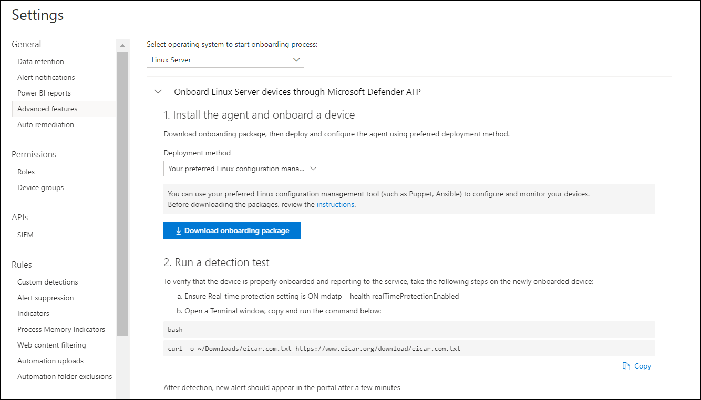

# <a name="deploy-microsoft-defender-for-endpoint-for-linux-with-puppet"></a><span data-ttu-id="c26b3-104">使用 Puppet 為 Linux 部署 Microsoft Defender</span><span class="sxs-lookup"><span data-stu-id="c26b3-104">Deploy Microsoft Defender for Endpoint for Linux with Puppet</span></span>

[!INCLUDE [Microsoft 365 Defender rebranding](../../includes/microsoft-defender.md)]


<span data-ttu-id="c26b3-105">**適用於：**</span><span class="sxs-lookup"><span data-stu-id="c26b3-105">**Applies to:**</span></span>
- [<span data-ttu-id="c26b3-106">適用於端點的 Microsoft Defender</span><span class="sxs-lookup"><span data-stu-id="c26b3-106">Microsoft Defender for Endpoint</span></span>](https://go.microsoft.com/fwlink/p/?linkid=2146631)
- [<span data-ttu-id="c26b3-107">Microsoft 365 Defender</span><span class="sxs-lookup"><span data-stu-id="c26b3-107">Microsoft 365 Defender</span></span>](https://go.microsoft.com/fwlink/?linkid=2118804)

> <span data-ttu-id="c26b3-108">想要體驗 Defender for Endpoint？</span><span class="sxs-lookup"><span data-stu-id="c26b3-108">Want to experience Defender for Endpoint?</span></span> [<span data-ttu-id="c26b3-109">註冊免費試用版。</span><span class="sxs-lookup"><span data-stu-id="c26b3-109">Sign up for a free trial.</span></span>](https://www.microsoft.com/microsoft-365/windows/microsoft-defender-atp?ocid=docs-wdatp-investigateip-abovefoldlink)

<span data-ttu-id="c26b3-110">本文說明如何使用 Puppet 為 Linux 部署 Defender。</span><span class="sxs-lookup"><span data-stu-id="c26b3-110">This article describes how to deploy Defender for Endpoint for Linux using Puppet.</span></span> <span data-ttu-id="c26b3-111">成功的部署需要完成下列所有工作：</span><span class="sxs-lookup"><span data-stu-id="c26b3-111">A successful deployment requires the completion of all of the following tasks:</span></span>

- [<span data-ttu-id="c26b3-112">下載上架套件</span><span class="sxs-lookup"><span data-stu-id="c26b3-112">Download the onboarding package</span></span>](#download-the-onboarding-package)
- [<span data-ttu-id="c26b3-113">建立 Puppet 資訊清單</span><span class="sxs-lookup"><span data-stu-id="c26b3-113">Create Puppet manifest</span></span>](#create-a-puppet-manifest)
- [<span data-ttu-id="c26b3-114">部署</span><span class="sxs-lookup"><span data-stu-id="c26b3-114">Deployment</span></span>](#deployment)
- [<span data-ttu-id="c26b3-115">檢查上架狀態</span><span class="sxs-lookup"><span data-stu-id="c26b3-115">Check onboarding status</span></span>](#check-onboarding-status)

## <a name="prerequisites-and-system-requirements"></a><span data-ttu-id="c26b3-116">必要條件和系統需求</span><span class="sxs-lookup"><span data-stu-id="c26b3-116">Prerequisites and system requirements</span></span>

 <span data-ttu-id="c26b3-117">如需目前軟體版本之必要條件和系統需求的描述，請參閱 [主要 Defender For Linux 頁面](microsoft-defender-endpoint-linux.md)。</span><span class="sxs-lookup"><span data-stu-id="c26b3-117">For a description of prerequisites and system requirements for the current software version, see [the main Defender for Endpoint for Linux page](microsoft-defender-endpoint-linux.md).</span></span>

<span data-ttu-id="c26b3-118">此外，針對 Puppet 部署，您必須熟悉 Puppet 管理工作、Puppet 設定，以及瞭解如何部署套件。</span><span class="sxs-lookup"><span data-stu-id="c26b3-118">In addition, for Puppet deployment, you need to be familiar with Puppet administration tasks, have Puppet configured, and know how to deploy packages.</span></span> <span data-ttu-id="c26b3-119">Puppet 有許多方式可完成相同的工作。</span><span class="sxs-lookup"><span data-stu-id="c26b3-119">Puppet has many ways to complete the same task.</span></span> <span data-ttu-id="c26b3-120">這些指示假設支援的 Puppet 模組（如 *apt* 可協助部署套件）的可用性。</span><span class="sxs-lookup"><span data-stu-id="c26b3-120">These instructions assume availability of supported Puppet modules, such as *apt* to help deploy the package.</span></span> <span data-ttu-id="c26b3-121">您的組織可能會使用不同的工作流程。</span><span class="sxs-lookup"><span data-stu-id="c26b3-121">Your organization might use a different workflow.</span></span> <span data-ttu-id="c26b3-122">如需詳細資訊，請參閱 [Puppet 檔](https://puppet.com/docs) 。</span><span class="sxs-lookup"><span data-stu-id="c26b3-122">Refer to the [Puppet documentation](https://puppet.com/docs) for details.</span></span>

## <a name="download-the-onboarding-package"></a><span data-ttu-id="c26b3-123">下載上架套件</span><span class="sxs-lookup"><span data-stu-id="c26b3-123">Download the onboarding package</span></span>

<span data-ttu-id="c26b3-124">從 Microsoft Defender 安全中心下載上架套件：</span><span class="sxs-lookup"><span data-stu-id="c26b3-124">Download the onboarding package from Microsoft Defender Security Center:</span></span>

1. <span data-ttu-id="c26b3-125">在 Microsoft Defender Security Center 中，移至 [ **設定] > 裝置管理 > 上架**]。</span><span class="sxs-lookup"><span data-stu-id="c26b3-125">In Microsoft Defender Security Center, go to **Settings > Device Management > Onboarding**.</span></span>
2. <span data-ttu-id="c26b3-126">在第一個下拉式功能表中，選取 [ **Linux 伺服器** ] 做為作業系統。</span><span class="sxs-lookup"><span data-stu-id="c26b3-126">In the first drop-down menu, select **Linux Server** as the operating system.</span></span> <span data-ttu-id="c26b3-127">在第二個下拉式功能表中，選取 **您偏好的 Linux 設定管理工具** 做為部署方法。</span><span class="sxs-lookup"><span data-stu-id="c26b3-127">In the second drop-down menu, select **Your preferred Linux configuration management tool** as the deployment method.</span></span>
3. <span data-ttu-id="c26b3-128">選取 [ **下載上架] 套件**。</span><span class="sxs-lookup"><span data-stu-id="c26b3-128">Select **Download onboarding package**.</span></span> <span data-ttu-id="c26b3-129">將檔案儲存為 WindowsDefenderATPOnboardingPackage.zip。</span><span class="sxs-lookup"><span data-stu-id="c26b3-129">Save the file as WindowsDefenderATPOnboardingPackage.zip.</span></span>

    

4. <span data-ttu-id="c26b3-131">在命令提示字元中，確認您有檔案。</span><span class="sxs-lookup"><span data-stu-id="c26b3-131">From a command prompt, verify that you have the file.</span></span> 

    ```bash
    ls -l
    ```
    ```Output
    total 8
    -rw-r--r-- 1 test  staff  4984 Feb 18 11:22 WindowsDefenderATPOnboardingPackage.zip
    ```
5. <span data-ttu-id="c26b3-132">解壓縮封存的內容。</span><span class="sxs-lookup"><span data-stu-id="c26b3-132">Extract the contents of the archive.</span></span>
    ```bash
    unzip WindowsDefenderATPOnboardingPackage.zip
    ```
    ```Output
    Archive:  WindowsDefenderATPOnboardingPackage.zip
    inflating: mdatp_onboard.json
    ```

## <a name="create-a-puppet-manifest"></a><span data-ttu-id="c26b3-133">建立 Puppet 資訊清單</span><span class="sxs-lookup"><span data-stu-id="c26b3-133">Create a Puppet manifest</span></span>

<span data-ttu-id="c26b3-134">您必須建立 Puppet 資訊清單，將適用于 Linux 的 Defender 部署到 Puppet 伺服器所管理的裝置。</span><span class="sxs-lookup"><span data-stu-id="c26b3-134">You need to create a Puppet manifest for deploying Defender for Endpoint for Linux to devices managed by a Puppet server.</span></span> <span data-ttu-id="c26b3-135">此範例會使用 puppetlabs 提供的 *apt* 和 *yumrepo* 模組，並假設您的 Puppet 伺服器上已安裝這些模組。</span><span class="sxs-lookup"><span data-stu-id="c26b3-135">This example makes use of the *apt* and *yumrepo* modules available from puppetlabs, and assumes that the modules have been installed on your Puppet server.</span></span>

<span data-ttu-id="c26b3-136">在 Puppet 安裝的 [模組] 資料夾下，建立 *install_mdatp/files* 及 *install_mdatp/manifests* 的資料夾。</span><span class="sxs-lookup"><span data-stu-id="c26b3-136">Create the folders *install_mdatp/files* and *install_mdatp/manifests* under the modules folder of your Puppet installation.</span></span> <span data-ttu-id="c26b3-137">此資料夾通常位於 Puppet 伺服器上的 */etc/puppetlabs/code/environments/production/modules* 中。</span><span class="sxs-lookup"><span data-stu-id="c26b3-137">This folder is typically located in */etc/puppetlabs/code/environments/production/modules* on your Puppet server.</span></span> <span data-ttu-id="c26b3-138">將上述 *install_mdatp/files* 資料夾上所建立的 mdatp_onboard.js。</span><span class="sxs-lookup"><span data-stu-id="c26b3-138">Copy the mdatp_onboard.json file created above to the *install_mdatp/files* folder.</span></span> <span data-ttu-id="c26b3-139">建立 *init。 pp*</span><span class="sxs-lookup"><span data-stu-id="c26b3-139">Create an *init.pp*</span></span> <span data-ttu-id="c26b3-140">包含部署指示的檔案：</span><span class="sxs-lookup"><span data-stu-id="c26b3-140">file that contains the deployment instructions:</span></span>

```bash
pwd
```
```Output
/etc/puppetlabs/code/environments/production/modules
```

```bash
tree install_mdatp
```
```Output
install_mdatp
├── files
│   └── mdatp_onboard.json
└── manifests
    └── init.pp
```

### <a name="contents-of-install_mdatpmanifestsinitpp"></a><span data-ttu-id="c26b3-141">的內容 `install_mdatp/manifests/init.pp`</span><span class="sxs-lookup"><span data-stu-id="c26b3-141">Contents of `install_mdatp/manifests/init.pp`</span></span>

<span data-ttu-id="c26b3-142">您可以從下列其中一個通道部署適用于 Linux 的 Endpoint， (如下所示的 *[通道]*) ：「 *內部人員-快*」、「 *預覽人員-慢速*」或「 *生產*」。每個通道都會對應至 Linux 軟體存放庫。</span><span class="sxs-lookup"><span data-stu-id="c26b3-142">Defender for Endpoint for Linux can be deployed from one of the following channels (denoted below as *[channel]*): *insiders-fast*, *insiders-slow*, or *prod*. Each of these channels corresponds to a Linux software repository.</span></span>

<span data-ttu-id="c26b3-143">通道選擇會決定提供給裝置的更新類型及頻率。</span><span class="sxs-lookup"><span data-stu-id="c26b3-143">The choice of the channel determines the type and frequency of updates that are offered to your device.</span></span> <span data-ttu-id="c26b3-144">在內部版本中的裝置 *快* 用的第一種方法是接收更新及新功能，然後是上一個程式 *-速度慢* ，最後透過 *生產*。</span><span class="sxs-lookup"><span data-stu-id="c26b3-144">Devices in *insiders-fast* are the first ones to receive updates and new features, followed later by *insiders-slow* and lastly by *prod*.</span></span>

<span data-ttu-id="c26b3-145">為了預覽新功能並提供及早的意見反應，建議您將企業中的部分裝置設定為使用 *預覽人員-快* 或內部的 *速度緩慢*。</span><span class="sxs-lookup"><span data-stu-id="c26b3-145">In order to preview new features and provide early feedback, it is recommended that you configure some devices in your enterprise to use either *insiders-fast* or *insiders-slow*.</span></span>

> [!WARNING]
> <span data-ttu-id="c26b3-146">初次安裝後切換通道需要重新安裝產品。</span><span class="sxs-lookup"><span data-stu-id="c26b3-146">Switching the channel after the initial installation requires the product to be reinstalled.</span></span> <span data-ttu-id="c26b3-147">若要切換產品通道，請執行下列動作：卸載現有的套件、重新設定裝置以使用新通道，然後依照此檔中的步驟，從新位置安裝套件。</span><span class="sxs-lookup"><span data-stu-id="c26b3-147">To switch the product channel: uninstall the existing package, re-configure your device to use the new channel, and follow the steps in this document to install the package from the new location.</span></span>

<span data-ttu-id="c26b3-148">請記下您的發行及版本，並為其指定最接近的專案 `https://packages.microsoft.com/config/` 。</span><span class="sxs-lookup"><span data-stu-id="c26b3-148">Note your distribution and version and identify the closest entry for it under `https://packages.microsoft.com/config/`.</span></span>

<span data-ttu-id="c26b3-149">在下列命令中，將 *[distro]* 和 *[version]* 取代為您識別的資訊：</span><span class="sxs-lookup"><span data-stu-id="c26b3-149">In the below commands, replace *[distro]* and *[version]* with the information you've identified:</span></span>

> [!NOTE]
> <span data-ttu-id="c26b3-150">在 RedHat、Oracle EL 和 CentOS 8 的情況下，以 ' rhel ' 取代 *[distro]* 。</span><span class="sxs-lookup"><span data-stu-id="c26b3-150">In case of RedHat, Oracle EL, and CentOS 8, replace *[distro]* with 'rhel'.</span></span>

```puppet
# Puppet manifest to install Microsoft Defender ATP.
# @param channel The release channel based on your environment, insider-fast or prod.
# @param distro The Linux distribution in lowercase. In case of RedHat, Oracle EL, and CentOS 8, the distro variable should be 'rhel'.
# @param version The Linux distribution release number, e.g. 7.4.

class install_mdatp (
$channel = 'insiders-fast',
$distro = undef,
$version = undef
){
    case $::osfamily {
        'Debian' : {
            apt::source { 'microsoftpackages' :
                location => "https://packages.microsoft.com/${distro}/${version}/prod",
                release  => $channel,
                repos    => 'main',
                key      => {
                    'id'     => 'BC528686B50D79E339D3721CEB3E94ADBE1229CF',
                    'server' => 'keyserver.ubuntu.com',
                },
            }
        }
        'RedHat' : {
            yumrepo { 'microsoftpackages' :
                baseurl  => "https://packages.microsoft.com/${distro}/${version}/${channel}",
                descr    => "packages-microsoft-com-prod-${channel}",
                enabled  => 1,
                gpgcheck => 1,
                gpgkey   => 'https://packages.microsoft.com/keys/microsoft.asc'
            }
        }
        default : { fail("${::osfamily} is currently not supported.") }
    }

    case $::osfamily {
        /(Debian|RedHat)/: {
            file { ['/etc/opt', '/etc/opt/microsoft', '/etc/opt/microsoft/mdatp']:
                ensure => directory,
                owner  => root,
                group  => root,
                mode   => '0755'
            }

            file { '/etc/opt/microsoft/mdatp/mdatp_onboard.json':
                source  => 'puppet:///modules/install_mdatp/mdatp_onboard.json',
                owner   => root,
                group   => root,
                mode    => '0600',
                require => File['/etc/opt/microsoft/mdatp']
            }

            package { 'mdatp':
                ensure  => 'installed',
                require => File['/etc/opt/microsoft/mdatp/mdatp_onboard.json']
            }
        }
        default : { fail("${::osfamily} is currently not supported.") }
    }
}
```

## <a name="deployment"></a><span data-ttu-id="c26b3-151">部署</span><span class="sxs-lookup"><span data-stu-id="c26b3-151">Deployment</span></span>

<span data-ttu-id="c26b3-152">在您的 site 中包含上述資訊清單。 pp</span><span class="sxs-lookup"><span data-stu-id="c26b3-152">Include the above manifest in your site.pp</span></span> <span data-ttu-id="c26b3-153">檔：</span><span class="sxs-lookup"><span data-stu-id="c26b3-153">file:</span></span>

```bash
cat /etc/puppetlabs/code/environments/production/manifests/site.pp
```
```Output
node "default" {
    include install_mdatp
}
```

<span data-ttu-id="c26b3-154">已註冊的代理裝置會定期輪詢 Puppet 伺服器，並在偵測到新的設定設定檔和原則時立即加以安裝。</span><span class="sxs-lookup"><span data-stu-id="c26b3-154">Enrolled agent devices periodically poll the Puppet Server and install new configuration profiles and policies as soon as they are detected.</span></span>

## <a name="monitor-puppet-deployment"></a><span data-ttu-id="c26b3-155">監視 Puppet 部署</span><span class="sxs-lookup"><span data-stu-id="c26b3-155">Monitor Puppet deployment</span></span>

<span data-ttu-id="c26b3-156">在代理人裝置上，您也可以執行下列動作檢查上架狀態：</span><span class="sxs-lookup"><span data-stu-id="c26b3-156">On the agent device, you can also check the onboarding status by running:</span></span>

```bash
mdatp health
```
```Output
...
licensed                                : true
org_id                                  : "[your organization identifier]"
...
```

- <span data-ttu-id="c26b3-157">已 **授權**：這會確認裝置是否與您的組織相關聯。</span><span class="sxs-lookup"><span data-stu-id="c26b3-157">**licensed**: This confirms that the device is tied to your organization.</span></span>

- <span data-ttu-id="c26b3-158">**orgId**：這是您的 Defender for Endpoint 組織識別碼。</span><span class="sxs-lookup"><span data-stu-id="c26b3-158">**orgId**: This is your Defender for Endpoint organization identifier.</span></span>

## <a name="check-onboarding-status"></a><span data-ttu-id="c26b3-159">檢查上架狀態</span><span class="sxs-lookup"><span data-stu-id="c26b3-159">Check onboarding status</span></span>

<span data-ttu-id="c26b3-160">您可以透過建立腳本，檢查裝置是否已正確架。</span><span class="sxs-lookup"><span data-stu-id="c26b3-160">You can check that devices have been correctly onboarded by creating a script.</span></span> <span data-ttu-id="c26b3-161">例如，下列腳本會檢查已註冊的裝置是否有上架狀態：</span><span class="sxs-lookup"><span data-stu-id="c26b3-161">For example, the following script checks enrolled devices for onboarding status:</span></span>

```bash
mdatp health --field healthy
```

<span data-ttu-id="c26b3-162">上述命令會在 `1` 產品架且如預期的運作時列印。</span><span class="sxs-lookup"><span data-stu-id="c26b3-162">The above command prints `1` if the product is onboarded and functioning as expected.</span></span>

> [!IMPORTANT]
> <span data-ttu-id="c26b3-163">產品第一次啟動時，會下載最新的反惡意程式碼定義。</span><span class="sxs-lookup"><span data-stu-id="c26b3-163">When the product starts for the first time, it downloads the latest antimalware definitions.</span></span> <span data-ttu-id="c26b3-164">視您的網際網路連線而定，這可能需要幾分鐘的時間。</span><span class="sxs-lookup"><span data-stu-id="c26b3-164">Depending on your Internet connection, this can take up to a few minutes.</span></span> <span data-ttu-id="c26b3-165">在這段時間內，上述命令會傳回值 `0` 。</span><span class="sxs-lookup"><span data-stu-id="c26b3-165">During this time the above command returns a value of `0`.</span></span>

<span data-ttu-id="c26b3-166">如果產品不健康，可以透過) 檢查的退出程式碼 (`echo $?` 指出問題：</span><span class="sxs-lookup"><span data-stu-id="c26b3-166">If the product is not healthy, the exit code (which can be checked through `echo $?`) indicates the problem:</span></span>

- <span data-ttu-id="c26b3-167">1如果尚未架裝置。</span><span class="sxs-lookup"><span data-stu-id="c26b3-167">1 if the device isn't onboarded yet.</span></span>
- <span data-ttu-id="c26b3-168">3如果無法建立與後臺連結的連線。</span><span class="sxs-lookup"><span data-stu-id="c26b3-168">3 if the connection to the daemon cannot be established.</span></span>

## <a name="log-installation-issues"></a><span data-ttu-id="c26b3-169">記錄安裝問題</span><span class="sxs-lookup"><span data-stu-id="c26b3-169">Log installation issues</span></span>

 <span data-ttu-id="c26b3-170">如需如何在發生錯誤時，尋找由安裝程式所建立之自動產生記錄的詳細資訊，請參閱 [記錄檔安裝的問題](linux-resources.md#log-installation-issues)。</span><span class="sxs-lookup"><span data-stu-id="c26b3-170">For more information on how to find the automatically generated log that is created by the installer when an error occurs, see [Log installation issues](linux-resources.md#log-installation-issues).</span></span>

## <a name="operating-system-upgrades"></a><span data-ttu-id="c26b3-171">作業系統升級</span><span class="sxs-lookup"><span data-stu-id="c26b3-171">Operating system upgrades</span></span>

<span data-ttu-id="c26b3-172">將您的作業系統升級為新的主要版本時，您必須先卸載適用于 Linux 的 Endpoint 的 Defender，安裝升級，最後在裝置上為 Linux 重新設定 Defender for Linux。</span><span class="sxs-lookup"><span data-stu-id="c26b3-172">When upgrading your operating system to a new major version, you must first uninstall Defender for Endpoint for Linux, install the upgrade, and finally reconfigure Defender for Endpoint for Linux on your device.</span></span>

## <a name="uninstallation"></a><span data-ttu-id="c26b3-173">卸載</span><span class="sxs-lookup"><span data-stu-id="c26b3-173">Uninstallation</span></span>

<span data-ttu-id="c26b3-174">使用 *init* 中的下列內容建立模組 *remove_mdatp* 類似 *install_mdatp*</span><span class="sxs-lookup"><span data-stu-id="c26b3-174">Create a module *remove_mdatp* similar to *install_mdatp* with the following contents in *init.pp*</span></span> <span data-ttu-id="c26b3-175">檔：</span><span class="sxs-lookup"><span data-stu-id="c26b3-175">file:</span></span>

```bash
class remove_mdatp {
    package { 'mdatp':
        ensure => 'purged',
    }
}
```
