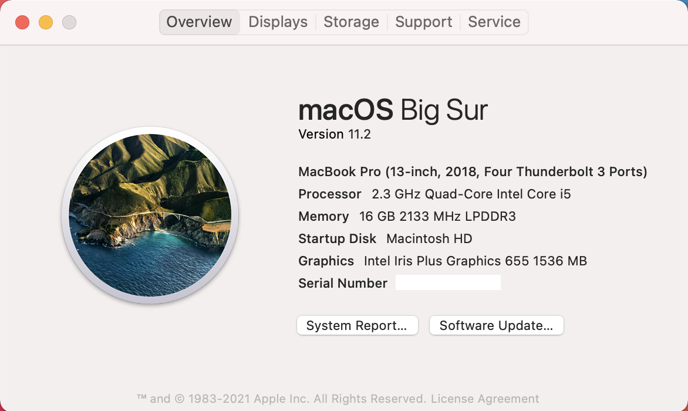

# <a name="device-control-for-macos"></a>macOS 的裝置控制項

[!INCLUDE [Microsoft 365 Defender rebranding](../../includes/microsoft-defender.md)]

**適用於：**
- [適用於端點的 Microsoft Defender](https://go.microsoft.com/fwlink/p/?linkid=2154037)
- [Microsoft 365 Defender](https://go.microsoft.com/fwlink/?linkid=2118804)

> 想要體驗適用於端點的 Microsoft Defender 嗎？ [注册免費試用版。](https://www.microsoft.com/microsoft-365/windows/microsoft-defender-atp?ocid=docs-wdatp-exposedapis-abovefoldlink)

[!include[Prerelease information](../../includes/prerelease.md)]

## <a name="requirements"></a>需求

MacOS 的裝置控制具有下列必要條件：

>[!div class="checklist"]
> - Microsoft Defender for Endpoint 的授權 (可以是試驗) 
> - 最低作業系統版本： macOS 10.15.4 或更高版本
> - 產品版本下限：101.24.59
> - 您的裝置必須以系統擴充的方式執行 (此為 macOS 11 大 Sur) 上的預設值。 
> 
>   您可以執行下列命令，檢查您的裝置是否正在系統擴充裝置上執行，並確認是否已列印 `endpoint_security_extension` 至主控台： 
> 
>   ```bash
>   mdatp health --field real_time_protection_subsystem 
>   ```
> - 您的裝置必須位於 `Beta` 先前稱為 `InsiderFast`) Microsoft AutoUpdate 更新通道的 (。 如需詳細資訊，請參閱 [在 Mac 上部署 Microsoft Defender For Endpoint 的更新](mac-updates.md)。
> 
>   您可以使用下列命令來檢查更新通道： 
> 
>    ```bash
>    mdatp health --field release_ring 
>    ```
>
>    如果上述命令沒有列印 `Beta` 或 `InsiderFast` ，請從終端執行下列命令。 通道更新會在下次產品開始 (時，或在重新開機裝置) 時生效。 
> 
>    ```bash
>    defaults write com.microsoft.autoupdate2 ChannelName -string Beta
>    ```
>
>    或者，如果您在受管理的環境 (JAMF 或 Intune) 中，您可以從遠端設定更新通道。 如需詳細資訊，請參閱 [在 Mac 上部署 Microsoft Defender For Endpoint 的更新](mac-updates.md)。 

## <a name="device-control-policy"></a>裝置控制項原則

若要設定 macOS 的裝置控制，您必須建立原則來描述您要放在組織內的限制。

裝置控制原則會包含在用來設定所有其他產品設定的設定檔中。 如需詳細資訊，請參閱 [設定檔結構](mac-preferences.md#configuration-profile-structure)。

在設定設定檔中，裝置控制項原則是在下列區段中定義：

|區段|值|
|:---|:---|
| **網域** | `com.microsoft.wdav` |
| **機碼** | deviceControl |
| **資料類型** | 字典 (嵌套偏好)  |
| **Comments** | 請參閱下列各節以取得字典內容的描述。 |

裝置控制項原則可以用來：

- [自訂裝置控制項所引發之通知的 URL 目標](#customize-url-target-for-notifications-raised-by-device-control)
- [允許或封鎖可移動裝置](#allow-or-block-removable-devices)

### <a name="customize-url-target-for-notifications-raised-by-device-control"></a>自訂由裝置控制所引發之通知的 URL 目標

在裝置上強制執行已就地安裝的裝置控制項原則時 (例如，對卸除式媒體裝置的存取限制在) ，向使用者顯示通知。


當使用者按一下此通知時，網頁會在預設瀏覽器中開啟。 您可以設定使用者按一下通知時所開啟的 URL。

|區段|值|
|:---|:---|
| **網域** | `com.microsoft.wdav` |
| **機碼** | navigationTarget |
| **資料類型** | 字串 |
| **Comments** | 若未定義，產品會使用指向一般頁面的預設 URL，以說明產品所採取的動作。 |

### <a name="allow-or-block-removable-devices"></a>允許或封鎖可移動裝置

裝置控制項原則的「卸除式媒體」區段可用來限制對卸除式媒體的存取。 

> [!NOTE]
> 目前支援下列類型的卸除式媒體，而且可以包含在 [原則： USB 儲存裝置] 中。

|區段|值|
|:---|:---|
| **網域** | `com.microsoft.wdav` |
| **機碼** | removableMediaPolicy |
| **資料類型** | 字典 (嵌套偏好)  |
| **Comments** | 請參閱下列各節以取得字典內容的描述。 |

原則的此區段是階層式的，可讓您獲得最大的彈性，並涵蓋大量的使用案例。 在最上層是由廠商識別碼識別的廠商。 針對每個廠商，都有產品識別碼所識別的產品。 最後，每個產品都有用於表示特定裝置的系列號碼。

```
|-- policy top level 
    |-- vendor 1 
        |-- product 1 
            |-- serial number 1 
            ...
            |-- serial number N 
        ...
        |-- product N 
    ...
    |-- vendor N
```

如需如何尋找設備識別碼的詳細資訊，請參閱 [查詢裝置識別碼](#look-up-device-identifiers)。

原則會從最特殊的專案評估為最一般的專案。 也就是說，裝置電源開啟時，產品會嘗試在每個可移除媒體裝置的原則中尋找最明確的相符，並在該等級套用許可權。 如果沒有任何相符專案，則會套用下一個符合最相符原則的最佳方式，當裝置與原則中的任何其他專案都不符合時，此為預設值。

#### <a name="policy-enforcement-level"></a>原則強制執行層級

在 [卸除式媒體] 區段中，有一個選項可以設定強制執行層級，其可採用下列其中一個值：

- `audit` -如果限制存取裝置，則會向使用者顯示通知，但仍然可以使用該裝置。 此強制等級可用於評估原則的效能。
- `block` -在此強制性層級下，使用者可以在裝置上執行的作業，會限制在原則中定義的專案。 此外，會對使用者提出通知。 

|區段|值|
|:---|:---|
| **網域** | `com.microsoft.wdav` |
| **機碼** | enforcementLevel |
| **資料類型** | 字串 |
| **可能值** | 審核 (預設)  <br/> 塊 |

#### <a name="default-permission-level"></a>預設權限等級

在 [卸除式媒體] 區段的最上層，您可以設定不符合原則中任何其他專案之裝置的預設許可權等級。

此設定可以設定為：

- `none` -無法在裝置上執行作業
- 下列值的組合：
    - `read` -允許在裝置上進行讀取作業
    - `write` -允許在裝置上寫入作業
    - `execute` -允許在裝置上執行作業

> [!NOTE]
> 如果 `none` 許可權層級中有，則 `read` `write` 會忽略 (、或) 中的任何其他許可權 `execute` 。

> [!NOTE]
> `execute`許可權只是指 Mach-O 二進位檔案的執行。 不包含執行腳本或其他類型的負載。

|區段|值|
|:---|:---|
| **網域** | `com.microsoft.wdav` |
| **機碼** | 許可 |
| **資料類型** | 字串陣列 |
| **可能值** | 無 <br/> 讀 <br/> 寫 <br/> 執行 |

#### <a name="restrict-removable-media-by-vendor-product-and-serial-number"></a>依廠商、產品及序號限制可移除媒體

如 [允許或封鎖可移除裝置](#allow-or-block-removable-devices)中所述，可透過廠商識別碼、產品識別碼及序號來識別卸除式媒體（例如 USB 裝置）。

在 [卸除式媒體] 原則的最上層，您可以選擇在廠商層級定義更細微的限制。 

`vendors`字典包含一或多個專案，每個專案都是由廠商識別碼識別。

|區段|值|
|:---|:---|
| **網域** | `com.microsoft.wdav` |
| **機碼** | 供應商 |
| **資料類型** | 字典 (嵌套偏好)  |

針對每個廠商，您可以為該廠商的裝置指定所需的許可權等級。

|區段|值|
|:---|:---|
| **網域** | `com.microsoft.wdav` |
| **機碼** | 許可 |
| **資料類型** | 字串陣列 |
| **可能值** | 與[預設許可權等級](#default-permission-level)相同 |

此外，您可以選擇性地指定屬於該廠商的產品集合，其定義更為細微的許可權。 `products`字典包含一或多個專案，每個專案都是由產品識別碼所識別。 

|區段|值|
|:---|:---|
| **網域** | `com.microsoft.wdav` |
| **機碼** | 產品 |
| **資料類型** | 字典 (嵌套偏好)  |

針對每個產品，您可以指定該產品所需的許可權等級。

|區段|值|
|:---|:---|
| **網域** | `com.microsoft.wdav` |
| **機碼** | 許可 |
| **資料類型** | 字串陣列 |
| **可能值** | 與[預設許可權等級](#default-permission-level)相同 |

此外，您可以指定一組選擇性的系列號碼，以定義更細微的許可權。

`serialNumbers`字典包含一或多個專案，每個專案都是由序號來識別。

|區段|值|
|:---|:---|
| **網域** | `com.microsoft.wdav` |
| **機碼** | serialNumbers |
| **資料類型** | 字典 (嵌套偏好)  |

針對每個序數，您可以指定所需的許可權等級。

|區段|值|
|:---|:---|
| **網域** | `com.microsoft.wdav` |
| **機碼** | 許可 |
| **資料類型** | 字串陣列 |
| **可能值** | 與[預設許可權等級](#default-permission-level)相同 |

#### <a name="example-device-control-policy"></a>範例裝置控制項原則

下列範例會示範上述所有概念如何結合到裝置控制項原則中。 在下列範例中，請記下可移除媒體原則的階層性質。

```xml
<?xml version="1.0" encoding="UTF-8"?> 
<!DOCTYPE plist PUBLIC "-//Apple//DTD PLIST 1.0//EN" "http://www.apple.com/DTDs/PropertyList-1.0.dtd"> 
<plist version="1.0"> 
<dict> 
    <key>deviceControl</key> 
    <dict> 
        <key>navigationTarget</key> 
        <string>[custom URL for notifications]</string> 
        <key>removableMediaPolicy</key> 
        <dict> 
            <key>enforcementLevel</key> 
            <string>[enforcement level]</string> <!-- audit / block --> 
            <key>permission</key> 
            <array> 
                <string>[permission]</string> <!-- none / read / write / execute --> 
                <!-- other permissions -->
            </array> 
            <key>vendors</key> 
            <dict> 
                <key>[vendor id]</key> 
                <dict>
                    <key>permission</key> 
                    <array> 
                        <string>[permission]</string> <!-- none / read / write / execute --> 
                        <!-- other permissions -->
                    </array> 
                    <key>products</key> 
                    <dict> 
                        <key>[product id]</key> 
                        <dict> 
                            <key>permission</key> 
                            <array> 
                                <string>[permission]</string> <!-- none / read / write / execute --> 
                                <!-- other permissions -->
                            </array> 
                            <key>serialNumbers</key> 
                            <dict> 
                                <key>[serial-number]</key> 
                                <array> 
                                    <string>[permission]</string> <!-- none / read / write / execute --> 
                                    <!-- other permissions -->
                                </array> 
                                <!-- other serial numbers --> 
                            </dict> 
                        </dict> 
                        <!-- other products --> 
                    </dict> 
                </dict> 
                <!-- other vendors --> 
            </dict> 
        </dict> 
    </dict> 
</dict> 
</plist> 
```

我們已在下列檔中包含裝置控制原則的更多範例：

- [Intune 裝置控制原則的範例](mac-device-control-intune.md)
- [JAMF 裝置控制原則的範例](mac-device-control-jamf.md)

#### <a name="look-up-device-identifiers"></a>查詢裝置識別碼

若要尋找 USB 裝置的廠商識別碼、產品識別碼及序列碼，請執行下列動作：

1. 登入 Mac 裝置。
1. 插入您要查閱識別碼的 USB 裝置。
1. 在 macOS 的最上層功能表中，選取 [ **關於此 Mac**]。

    

1. 選取 [ **系統報告**]。

    

1. 從左欄中，選取 [ **USB**]。

    

1. 在 [ **USB 裝置樹狀目錄**] 底下，流覽至您插入的 USB 裝置。

    

1. 會顯示廠商識別碼、產品識別碼及序號碼。 將廠商識別碼及產品識別碼新增至可移除媒體原則時，您必須只在後新增此元件 `0x` 。 例如，在下圖中，[廠商識別碼] `1000` 和 [產品識別碼] `090c` 。

#### <a name="discover-usb-devices-in-your-organization"></a>探索組織中的 USB 裝置

您可以從 Microsoft Defender for Endpoint advanced 搜尋中的 USB 裝置，查看裝載、卸載及大量變更事件。 這些事件有助於識別可疑的使用活動，或執行內部調查。

```
DeviceEvents 
    | where ActionType == "UsbDriveMounted" or ActionType == "UsbDriveUnmounted" or ActionType == "UsbDriveDriveLetterChanged"
    | where DeviceId == "<device ID>"
```

## <a name="device-control-policy-deployment"></a>裝置控制項原則部署

裝置控制項原則必須包含在其他產品設定旁，如在 macOS 的 [ [設定 Microsoft Defender For Endpoint](mac-preferences.md)] 的 [喜好設定] 中所述。

您可以使用 [Configuration profile 部署](mac-preferences.md#configuration-profile-deployment)中所列的指示來部署此設定檔。

## <a name="troubleshooting-tips"></a>疑難排解提示

透過 Intune 或 JAMF 推入設定設定檔之後，您可以從終端執行下列命令，檢查它是否已成功由產品挑選：

```bash
mdatp device-control removable-media policy list
```

此命令會列印至標準輸出產品所使用的裝置控制項原則。 在這種情況下 `Policy is empty` ，請確定) 設定設定檔的 (已從管理主控台推入您的裝置， (b) 它是有效的裝置控制項原則，如本檔所述。

在已成功傳遞原則，且已將一或多個裝置插入其中的裝置上，您可以執行下列命令來列出所有裝置及已套用的有效許可權。

```bash
mdatp device-control removable-media devices list
```

輸出範例：

```Output
.Device(s)
|-o Name: Untitled 1, Permission ["read", "execute"]
| |-o Vendor: General "fff0"
| |-o Product: USB Flash Disk "1000"
| |-o Serial number: "04ZSSMHI2O7WBVOA"
| |-o Mount point: "/Volumes/TESTUSB"
```

在上述範例中，只有一部卸除式媒體裝置會 `read` `execute` 根據傳送至裝置的裝置控制項原則，自行插入並具有許可權。

## <a name="related-topics"></a>相關主題

- [Intune 裝置控制原則的範例](mac-device-control-intune.md)
- [JAMF 裝置控制原則的範例](mac-device-control-jamf.md)
