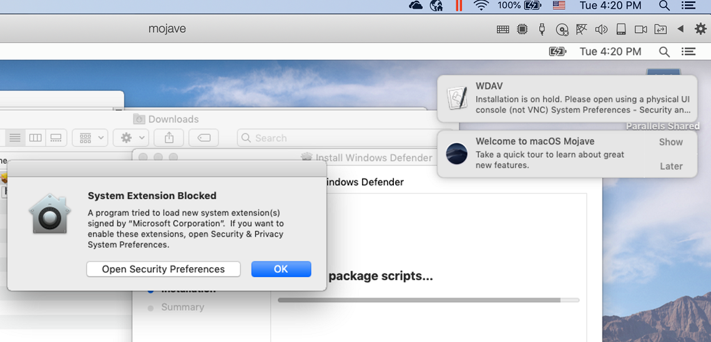

# <a name="manual-deployment-for-microsoft-defender-for-endpoint-on-macos"></a><span data-ttu-id="cff6c-104">macOS 上的 Microsoft Defender for Endpoint 手動部署</span><span class="sxs-lookup"><span data-stu-id="cff6c-104">Manual deployment for Microsoft Defender for Endpoint on macOS</span></span>

[!INCLUDE [Microsoft 365 Defender rebranding](../../includes/microsoft-defender.md)]

<span data-ttu-id="cff6c-105">**適用於：**</span><span class="sxs-lookup"><span data-stu-id="cff6c-105">**Applies to:**</span></span>
- [<span data-ttu-id="cff6c-106">適用於端點的 Microsoft Defender</span><span class="sxs-lookup"><span data-stu-id="cff6c-106">Microsoft Defender for Endpoint</span></span>](https://go.microsoft.com/fwlink/p/?linkid=2154037)
- [<span data-ttu-id="cff6c-107">Microsoft 365 Defender</span><span class="sxs-lookup"><span data-stu-id="cff6c-107">Microsoft 365 Defender</span></span>](https://go.microsoft.com/fwlink/?linkid=2118804)

> <span data-ttu-id="cff6c-108">想要體驗 Defender for Endpoint？</span><span class="sxs-lookup"><span data-stu-id="cff6c-108">Want to experience Defender for Endpoint?</span></span> [<span data-ttu-id="cff6c-109">注册免費試用版。</span><span class="sxs-lookup"><span data-stu-id="cff6c-109">Sign up for a free trial.</span></span>](https://www.microsoft.com/microsoft-365/windows/microsoft-defender-atp?ocid=docs-wdatp-investigateip-abovefoldlink)

<span data-ttu-id="cff6c-110">本主題說明如何手動在 macOS 上部署 Microsoft Defender for Endpoint。</span><span class="sxs-lookup"><span data-stu-id="cff6c-110">This topic describes how to deploy Microsoft Defender for Endpoint on macOS manually.</span></span> <span data-ttu-id="cff6c-111">成功的部署需要完成下列所有步驟：</span><span class="sxs-lookup"><span data-stu-id="cff6c-111">A successful deployment requires the completion of all of the following steps:</span></span>
- [<span data-ttu-id="cff6c-112">下載安裝和上架套件</span><span class="sxs-lookup"><span data-stu-id="cff6c-112">Download installation and onboarding packages</span></span>](#download-installation-and-onboarding-packages)
- [<span data-ttu-id="cff6c-113">應用程式安裝 (macOS 10.15 和舊版) </span><span class="sxs-lookup"><span data-stu-id="cff6c-113">Application installation (macOS 10.15 and older versions)</span></span>](#application-installation-macos-1015-and-older-versions)
- [<span data-ttu-id="cff6c-114">應用程式安裝 (macOS 11 和更新版本) </span><span class="sxs-lookup"><span data-stu-id="cff6c-114">Application installation (macOS 11 and newer versions)</span></span>](#application-installation-macos-11-and-newer-versions)
- [<span data-ttu-id="cff6c-115">用戶端設定</span><span class="sxs-lookup"><span data-stu-id="cff6c-115">Client configuration</span></span>](#client-configuration)

## <a name="prerequisites-and-system-requirements"></a><span data-ttu-id="cff6c-116">必要條件和系統需求</span><span class="sxs-lookup"><span data-stu-id="cff6c-116">Prerequisites and system requirements</span></span>

<span data-ttu-id="cff6c-117">開始之前，請參閱 [macOS 頁面上的主要 Microsoft Defender For Endpoint](microsoft-defender-endpoint-mac.md) ，以取得目前軟體版本之必要條件和系統需求的描述。</span><span class="sxs-lookup"><span data-stu-id="cff6c-117">Before you get started, see [the main Microsoft Defender for Endpoint on macOS page](microsoft-defender-endpoint-mac.md) for a description of prerequisites and system requirements for the current software version.</span></span>

## <a name="download-installation-and-onboarding-packages"></a><span data-ttu-id="cff6c-118">下載安裝和上架套件</span><span class="sxs-lookup"><span data-stu-id="cff6c-118">Download installation and onboarding packages</span></span>

<span data-ttu-id="cff6c-119">從 Microsoft Defender 資訊安全中心下載安裝和上架套件：</span><span class="sxs-lookup"><span data-stu-id="cff6c-119">Download the installation and onboarding packages from Microsoft Defender Security Center:</span></span>

1. <span data-ttu-id="cff6c-120">在 Microsoft Defender 資訊安全中心中，移至 **設定 > 裝置管理 > 上架**。</span><span class="sxs-lookup"><span data-stu-id="cff6c-120">In Microsoft Defender Security Center, go to **Settings > Device Management > Onboarding**.</span></span>
2. <span data-ttu-id="cff6c-121">在頁面的區段1中，將 [作業系統] 設定為 **macOS** ，並將 Deployment 方法設定為 **本機腳本**。</span><span class="sxs-lookup"><span data-stu-id="cff6c-121">In Section 1 of the page, set operating system to **macOS** and Deployment method to **Local script**.</span></span>
3. <span data-ttu-id="cff6c-122">在頁面的區段2中，選取 [ **下載安裝套件**]。</span><span class="sxs-lookup"><span data-stu-id="cff6c-122">In Section 2 of the page, select **Download installation package**.</span></span> <span data-ttu-id="cff6c-123">將其儲存為 wdav。 pkg 至本機目錄。</span><span class="sxs-lookup"><span data-stu-id="cff6c-123">Save it as wdav.pkg to a local directory.</span></span>
4. <span data-ttu-id="cff6c-124">在頁面的區段2中，選取 [ **下載上架套件**]。</span><span class="sxs-lookup"><span data-stu-id="cff6c-124">In Section 2 of the page, select **Download onboarding package**.</span></span> <span data-ttu-id="cff6c-125">將它儲存成 WindowsDefenderATPOnboardingPackage.zip 相同的目錄。</span><span class="sxs-lookup"><span data-stu-id="cff6c-125">Save it as WindowsDefenderATPOnboardingPackage.zip to the same directory.</span></span>

    

5. <span data-ttu-id="cff6c-127">在命令提示字元中，確認您有兩個檔案。</span><span class="sxs-lookup"><span data-stu-id="cff6c-127">From a command prompt, verify that you have the two files.</span></span>
    
## <a name="application-installation-macos-1015-and-older-versions"></a><span data-ttu-id="cff6c-128">應用程式安裝 (macOS 10.15 和舊版) </span><span class="sxs-lookup"><span data-stu-id="cff6c-128">Application installation (macOS 10.15 and older versions)</span></span>

<span data-ttu-id="cff6c-129">若要完成此程式，您必須具有裝置的系統管理員許可權。</span><span class="sxs-lookup"><span data-stu-id="cff6c-129">To complete this process, you must have admin privileges on the device.</span></span>

1. <span data-ttu-id="cff6c-130">流覽至 Finder 中已下載的 wdav，然後開啟它。</span><span class="sxs-lookup"><span data-stu-id="cff6c-130">Navigate to the downloaded wdav.pkg in Finder and open it.</span></span>

    

2. <span data-ttu-id="cff6c-132">選取 [ **繼續**]，同意授權條款，然後在出現提示時輸入密碼。</span><span class="sxs-lookup"><span data-stu-id="cff6c-132">Select **Continue**, agree with the License terms, and enter the password when prompted.</span></span>

    

   > [!IMPORTANT]
   > <span data-ttu-id="cff6c-134">系統會提示您允許安裝來自 Microsoft 的驅動程式， (「系統擴充封鎖」或「保留安裝」或兩者皆有）。</span><span class="sxs-lookup"><span data-stu-id="cff6c-134">You will be prompted to allow a driver from Microsoft to be installed (either "System Extension Blocked" or "Installation is on hold" or both.</span></span> <span data-ttu-id="cff6c-135">必須允許安裝驅動程式。</span><span class="sxs-lookup"><span data-stu-id="cff6c-135">The driver must be allowed to be installed.</span></span>

   

3. <span data-ttu-id="cff6c-137">選取 [ **開啟安全性** 設定] 或 [ **開啟系統偏好設定] > 安全性 & 隱私權**。</span><span class="sxs-lookup"><span data-stu-id="cff6c-137">Select **Open Security Preferences** or **Open System Preferences > Security & Privacy**.</span></span> <span data-ttu-id="cff6c-138">選取 [ **允許**]：</span><span class="sxs-lookup"><span data-stu-id="cff6c-138">Select **Allow**:</span></span>

    

   <span data-ttu-id="cff6c-140">安裝會繼續進行。</span><span class="sxs-lookup"><span data-stu-id="cff6c-140">The installation proceeds.</span></span>

   > [!CAUTION]
   > <span data-ttu-id="cff6c-141">如果您未選取 [ **允許**]，安裝將在5分鐘之後繼續進行。</span><span class="sxs-lookup"><span data-stu-id="cff6c-141">If you don't select **Allow**, the installation will proceed after 5 minutes.</span></span> <span data-ttu-id="cff6c-142">將會載入 Microsoft Defender for Endpoint，但某些功能（例如即時保護）將會停用。</span><span class="sxs-lookup"><span data-stu-id="cff6c-142">Microsoft Defender for Endpoint will be loaded, but some features, such as real-time protection, will be disabled.</span></span> <span data-ttu-id="cff6c-143">如需如何解決此問題的資訊，請參閱 [內核擴充問題疑難排解](mac-support-kext.md) 。</span><span class="sxs-lookup"><span data-stu-id="cff6c-143">See [Troubleshoot kernel extension issues](mac-support-kext.md) for information on how to resolve this.</span></span>

> [!NOTE]
> <span data-ttu-id="cff6c-144">在第一次安裝 Microsoft Defender for Endpoint 時，macOS 可能要求重新開機裝置。</span><span class="sxs-lookup"><span data-stu-id="cff6c-144">macOS may request to reboot the device upon the first installation of Microsoft Defender for Endpoint.</span></span> <span data-ttu-id="cff6c-145">在重新開機裝置之前，即時保護將無法使用。</span><span class="sxs-lookup"><span data-stu-id="cff6c-145">Real-time protection will not be available until the device is rebooted.</span></span>

## <a name="application-installation-macos-11-and-newer-versions"></a><span data-ttu-id="cff6c-146">應用程式安裝 (macOS 11 和更新版本) </span><span class="sxs-lookup"><span data-stu-id="cff6c-146">Application installation (macOS 11 and newer versions)</span></span>

<span data-ttu-id="cff6c-147">若要完成此程式，您必須具有裝置的系統管理員許可權。</span><span class="sxs-lookup"><span data-stu-id="cff6c-147">To complete this process, you must have admin privileges on the device.</span></span>

1. <span data-ttu-id="cff6c-148">流覽至 Finder 中已下載的 wdav，然後開啟它。</span><span class="sxs-lookup"><span data-stu-id="cff6c-148">Navigate to the downloaded wdav.pkg in Finder and open it.</span></span>

    

2. <span data-ttu-id="cff6c-150">選取 [ **繼續**]，同意授權條款，然後在出現提示時輸入密碼。</span><span class="sxs-lookup"><span data-stu-id="cff6c-150">Select **Continue**, agree with the License terms, and enter the password when prompted.</span></span>

3. <span data-ttu-id="cff6c-151">在安裝程式結束時，您將會提升，以核准產品所用的系統擴充。</span><span class="sxs-lookup"><span data-stu-id="cff6c-151">At the end of the installation process, you'll be promoted to approve the system extensions used by the product.</span></span> <span data-ttu-id="cff6c-152">選取 [ **開啟安全性喜好** 設定]。</span><span class="sxs-lookup"><span data-stu-id="cff6c-152">Select **Open Security Preferences**.</span></span>

    

4. <span data-ttu-id="cff6c-154">在 [ **安全性 & 隱私權** ] 視窗中，選取 [ **允許**]。</span><span class="sxs-lookup"><span data-stu-id="cff6c-154">From the **Security & Privacy** window, select **Allow**.</span></span>

    

5. <span data-ttu-id="cff6c-156">針對 Mac 上的端點，針對所有隨 Microsoft Defender for Endpoint 發佈的系統擴充，重複步驟 3 & 4。</span><span class="sxs-lookup"><span data-stu-id="cff6c-156">Repeat steps 3 & 4 for all system extensions distributed with Microsoft Defender for Endpoint on Mac.</span></span>

6. <span data-ttu-id="cff6c-157">在端點偵測和回應功能的一部分中，Mac 上端點的 Microsoft Defender 會檢查通訊端流量，並向 Microsoft Defender 資訊安全中心入口網站回報此資訊。</span><span class="sxs-lookup"><span data-stu-id="cff6c-157">As part of the Endpoint Detection and Response capabilities, Microsoft Defender for Endpoint on Mac inspects socket traffic and reports this information to the Microsoft Defender Security Center portal.</span></span> <span data-ttu-id="cff6c-158">當系統提示您授與 Microsoft Defender for Endpoint 許可權以篩選網路流量時，請選取 [ **允許**]。</span><span class="sxs-lookup"><span data-stu-id="cff6c-158">When prompted to grant Microsoft Defender for Endpoint permissions to filter network traffic, select **Allow**.</span></span>

    

7. <span data-ttu-id="cff6c-160">開啟 **系統偏好** 設定  >  **安全性 & 隱私權** 及流覽至 **[隱私權**] 索引標籤。授與 **Microsoft Defender ATP** 和 **Microsoft Defender ATP 端點安全性擴充** 的 **完整磁片存取** 許可權。</span><span class="sxs-lookup"><span data-stu-id="cff6c-160">Open **System Preferences** > **Security & Privacy** and navigate to the **Privacy** tab. Grant **Full Disk Access** permission to **Microsoft Defender ATP** and **Microsoft Defender ATP Endpoint Security Extension**.</span></span>

    

## <a name="client-configuration"></a><span data-ttu-id="cff6c-162">用戶端設定</span><span class="sxs-lookup"><span data-stu-id="cff6c-162">Client configuration</span></span>

1. <span data-ttu-id="cff6c-163">將 wdav pkg 和 MicrosoftDefenderATPOnboardingMacOs.py 複製到您在 macOS 上部署 Microsoft Defender for Endpoint 的裝置。</span><span class="sxs-lookup"><span data-stu-id="cff6c-163">Copy wdav.pkg and MicrosoftDefenderATPOnboardingMacOs.py to the device where you deploy Microsoft Defender for Endpoint on macOS.</span></span>

    <span data-ttu-id="cff6c-164">用戶端裝置不會與 org_id 產生關聯。</span><span class="sxs-lookup"><span data-stu-id="cff6c-164">The client device isn't associated with org_id.</span></span> <span data-ttu-id="cff6c-165">請注意， *org_id* 屬性是空白的。</span><span class="sxs-lookup"><span data-stu-id="cff6c-165">Note that the *org_id* attribute is blank.</span></span>

    ```bash
    mdatp health --field org_id
    ```

2. <span data-ttu-id="cff6c-166">執行 Python 腳本以安裝設定檔：</span><span class="sxs-lookup"><span data-stu-id="cff6c-166">Run the Python script to install the configuration file:</span></span>

    ```bash
    /usr/bin/python MicrosoftDefenderATPOnboardingMacOs.py
    ```

3. <span data-ttu-id="cff6c-167">確認裝置現在與您的組織有關聯，並報告有效的組織 ID:</span><span class="sxs-lookup"><span data-stu-id="cff6c-167">Verify that the device is now associated with your organization and reports a valid org ID:</span></span>

    ```bash
    mdatp health --field org_id
    ```

    <span data-ttu-id="cff6c-168">安裝之後，您會在右上角的 macOS 狀態列中看到 Microsoft Defender 圖示。</span><span class="sxs-lookup"><span data-stu-id="cff6c-168">After installation, you'll see the Microsoft Defender icon in the macOS status bar in the top-right corner.</span></span>
    
    > [!div class="mx-imgBorder"]
    > <span data-ttu-id="cff6c-169"></span><span class="sxs-lookup"><span data-stu-id="cff6c-169"></span></span>


## <a name="how-to-allow-full-disk-access"></a><span data-ttu-id="cff6c-170">如何允許完整磁片存取</span><span class="sxs-lookup"><span data-stu-id="cff6c-170">How to Allow Full Disk Access</span></span>

> [!CAUTION]
> <span data-ttu-id="cff6c-171">macOS 10.15 (Catalina) 包含新的安全性和隱私權增強功能。</span><span class="sxs-lookup"><span data-stu-id="cff6c-171">macOS 10.15 (Catalina) contains new security and privacy enhancements.</span></span> <span data-ttu-id="cff6c-172">從這個版本開始，依預設，應用程式無法存取磁片 (上的某些位置，例如檔、下載、桌面等 ) 不經明確同意。</span><span class="sxs-lookup"><span data-stu-id="cff6c-172">Beginning with this version, by default, applications are not able to access certain locations on disk (such as Documents, Downloads, Desktop, etc.) without explicit consent.</span></span> <span data-ttu-id="cff6c-173">在缺少這種同意的情況下，Microsoft Defender for Endpoint 無法完全保護您的裝置。</span><span class="sxs-lookup"><span data-stu-id="cff6c-173">In the absence of this consent, Microsoft Defender for Endpoint is not able to fully protect your device.</span></span>

1. <span data-ttu-id="cff6c-174">若要授與同意，請開啟 **系統偏好** 設定  >  **安全性 & 隱私權**  >  **隱私權**  >  **完整磁片存取**。</span><span class="sxs-lookup"><span data-stu-id="cff6c-174">To grant consent, open **System Preferences** > **Security & Privacy** > **Privacy** > **Full Disk Access**.</span></span> <span data-ttu-id="cff6c-175">按一下鎖定圖示，在對話方塊的底部 () 。</span><span class="sxs-lookup"><span data-stu-id="cff6c-175">Click the lock icon to make changes (bottom of the dialog box).</span></span> <span data-ttu-id="cff6c-176">選取 [Microsoft Defender for Endpoint]。</span><span class="sxs-lookup"><span data-stu-id="cff6c-176">Select Microsoft Defender for Endpoint.</span></span>

2. <span data-ttu-id="cff6c-177">執行 AV 偵測測試，以確認裝置已正確架及報表服務。</span><span class="sxs-lookup"><span data-stu-id="cff6c-177">Run an AV detection test to verify that the device is properly onboarded and reporting to the service.</span></span> <span data-ttu-id="cff6c-178">在新的架裝置上執行下列步驟：</span><span class="sxs-lookup"><span data-stu-id="cff6c-178">Perform the following steps on the newly onboarded device:</span></span>

    1. <span data-ttu-id="cff6c-179">確定即時保護已啟用 (由1所組成的結果，由1執行下列命令) ：</span><span class="sxs-lookup"><span data-stu-id="cff6c-179">Ensure that real-time protection is enabled (denoted by a result of 1 from running the following command):</span></span>

        ```bash
        mdatp health --field real_time_protection_enabled
        ```

    1. <span data-ttu-id="cff6c-180">開啟終端視窗。</span><span class="sxs-lookup"><span data-stu-id="cff6c-180">Open a Terminal window.</span></span> <span data-ttu-id="cff6c-181">複製並執行下列命令：</span><span class="sxs-lookup"><span data-stu-id="cff6c-181">Copy and execute the following command:</span></span>

        ```bash
        curl -o ~/Downloads/eicar.com.txt https://www.eicar.org/download/eicar.com.txt
        ```

    1. <span data-ttu-id="cff6c-182">檔案應該已被 Mac 上的 Defender for Endpoint 隔離。</span><span class="sxs-lookup"><span data-stu-id="cff6c-182">The file should have been quarantined by Defender for Endpoint on Mac.</span></span> <span data-ttu-id="cff6c-183">使用下列命令列出所有偵測到的威脅：</span><span class="sxs-lookup"><span data-stu-id="cff6c-183">Use the following command to list all the detected threats:</span></span>

        ```bash
        mdatp threat list
        ```

3. <span data-ttu-id="cff6c-184">執行 EDR 偵測測試，以確認裝置已正確架及報告給服務。</span><span class="sxs-lookup"><span data-stu-id="cff6c-184">Run an EDR detection test to verify that the device is properly onboarded and reporting to the service.</span></span> <span data-ttu-id="cff6c-185">在新的架裝置上執行下列步驟：</span><span class="sxs-lookup"><span data-stu-id="cff6c-185">Perform the following steps on the newly onboarded device:</span></span>

   1. <span data-ttu-id="cff6c-186">在您的瀏覽器中，例如 Mac 或 Safari Microsoft Edge。</span><span class="sxs-lookup"><span data-stu-id="cff6c-186">In your browser such as Microsoft Edge for Mac or Safari.</span></span>

   1. <span data-ttu-id="cff6c-187">從與解壓縮 MDATP MacOS DIY.zip 下載 https://aka.ms/mdatpmacosdiy 。</span><span class="sxs-lookup"><span data-stu-id="cff6c-187">Download MDATP MacOS DIY.zip from https://aka.ms/mdatpmacosdiy and extract.</span></span>

      <span data-ttu-id="cff6c-188">您可能會收到提示：</span><span class="sxs-lookup"><span data-stu-id="cff6c-188">You may be prompted:</span></span>

      > <span data-ttu-id="cff6c-189">您想要允許在「mdatpclientanalyzer.blob.core.windows.net」上下載嗎？</span><span class="sxs-lookup"><span data-stu-id="cff6c-189">Do you want to allow downloads on "mdatpclientanalyzer.blob.core.windows.net"?</span></span><br/>
      > <span data-ttu-id="cff6c-190">您可以變更可在網站偏好設定中下載檔案的網站。</span><span class="sxs-lookup"><span data-stu-id="cff6c-190">You can change which websites can download files in Websites Preferences.</span></span>

4. <span data-ttu-id="cff6c-191">按一下 [ **允許**]。</span><span class="sxs-lookup"><span data-stu-id="cff6c-191">Click **Allow**.</span></span>

5. <span data-ttu-id="cff6c-192">開啟 **下載**。</span><span class="sxs-lookup"><span data-stu-id="cff6c-192">Open **Downloads**.</span></span>

6. <span data-ttu-id="cff6c-193">您應該會看到 **MDATP MacOS DIY**。</span><span class="sxs-lookup"><span data-stu-id="cff6c-193">You should see **MDATP MacOS DIY**.</span></span>

   > [!TIP]
   > <span data-ttu-id="cff6c-194">如果您按兩下，將會收到下列訊息：</span><span class="sxs-lookup"><span data-stu-id="cff6c-194">If you double-click, you will get the following message:</span></span>
   > 
   > > <span data-ttu-id="cff6c-195">**無法開啟「MDATP MacOS DIY」，因為開發人員無法成為驗證程式。**</span><span class="sxs-lookup"><span data-stu-id="cff6c-195">**"MDATP MacOS DIY" cannot be opened because the developer cannot be verifier.**</span></span><br/>
   > > <span data-ttu-id="cff6c-196">macOS 無法驗證此應用程式是否沒有惡意程式碼。</span><span class="sxs-lookup"><span data-stu-id="cff6c-196">macOS cannot verify that this app is free from malware.</span></span><br/>
   > > <span data-ttu-id="cff6c-197">**\[ 移至垃圾桶 \]** **\[ 取消 \]**</span><span class="sxs-lookup"><span data-stu-id="cff6c-197">**\[Move to Trash\]** **\[Cancel\]**</span></span> 
  
7. <span data-ttu-id="cff6c-198">按一下 [取消]。</span><span class="sxs-lookup"><span data-stu-id="cff6c-198">Click **Cancel**.</span></span>

8. <span data-ttu-id="cff6c-199">以滑鼠右鍵按一下 [ **MDATP MacOS DIY**]，然後按一下 [**開啟**]。</span><span class="sxs-lookup"><span data-stu-id="cff6c-199">Right-click **MDATP MacOS DIY**, and then click **Open**.</span></span> 

    <span data-ttu-id="cff6c-200">系統應該會顯示下列訊息：</span><span class="sxs-lookup"><span data-stu-id="cff6c-200">The system should display the following message:</span></span>

    > <span data-ttu-id="cff6c-201">**macOS 無法驗證 **MDATP macOS DIY** 的開發人員。您確定要開啟它嗎？**</span><span class="sxs-lookup"><span data-stu-id="cff6c-201">**macOS cannot verify the developer of **MDATP MacOS DIY**. Are you sure you want to open it?**</span></span><br/>
    > <span data-ttu-id="cff6c-202">開啟此應用程式後，您將覆寫系統安全性，其可能會對您的電腦和個人資訊公開惡意程式碼，可能會損害您的 Mac 或危及您的隱私。</span><span class="sxs-lookup"><span data-stu-id="cff6c-202">By opening this app, you will be overriding system security which can expose your computer and personal information to malware that may harm your Mac or compromise your privacy.</span></span>

10. <span data-ttu-id="cff6c-203">按一下 [開啟]。</span><span class="sxs-lookup"><span data-stu-id="cff6c-203">Click **Open**.</span></span>

    <span data-ttu-id="cff6c-204">系統應該會顯示下列訊息：</span><span class="sxs-lookup"><span data-stu-id="cff6c-204">The system should display the following message:</span></span>

    > <span data-ttu-id="cff6c-205">Microsoft Defender for Endpoint macOS EDR DIY test file</span><span class="sxs-lookup"><span data-stu-id="cff6c-205">Microsoft Defender for Endpoint - macOS EDR DIY test file</span></span><br/>
    > <span data-ttu-id="cff6c-206">對應的警示將會出現在 MDATP 入口網站中。</span><span class="sxs-lookup"><span data-stu-id="cff6c-206">Corresponding alert will be available in the MDATP portal.</span></span>

11. <span data-ttu-id="cff6c-207">按一下 [開啟]。</span><span class="sxs-lookup"><span data-stu-id="cff6c-207">Click **Open**.</span></span>

    <span data-ttu-id="cff6c-208">在幾分鐘內，應引發名為 "macOS EDR 測試警示" 的警示。</span><span class="sxs-lookup"><span data-stu-id="cff6c-208">In a few minutes an alert named "macOS EDR Test Alert" should be raised.</span></span>

12. <span data-ttu-id="cff6c-209">移至 Microsoft Defender 資訊安全中心 (https://SecurityCenter.microsoft.com) 。</span><span class="sxs-lookup"><span data-stu-id="cff6c-209">Go to Microsoft Defender Security Center (https://SecurityCenter.microsoft.com).</span></span>

13. <span data-ttu-id="cff6c-210">移至警示佇列。</span><span class="sxs-lookup"><span data-stu-id="cff6c-210">Go to the Alert Queue.</span></span>

    :::image type="content" source="images/b8db76c2-c368-49ad-970f-dcb87534d9be.png" alt-text="macOS EDR 測試警示的範例，顯示嚴重性、類別、偵測來源及動作的折疊功能表。":::
    
    <span data-ttu-id="cff6c-212">查看警示詳細資料和裝置時程表，並執行定期調查步驟。</span><span class="sxs-lookup"><span data-stu-id="cff6c-212">Look at the alert details and the device timeline, and perform the regular investigation steps.</span></span>

## <a name="logging-installation-issues"></a><span data-ttu-id="cff6c-213">記錄安裝問題</span><span class="sxs-lookup"><span data-stu-id="cff6c-213">Logging installation issues</span></span>

<span data-ttu-id="cff6c-214">如需詳細資訊，請參閱 [記錄安裝的問題](mac-resources.md#logging-installation-issues) ，以取得如何在錯誤發生時，尋找安裝程式所建立的自動產生記錄。</span><span class="sxs-lookup"><span data-stu-id="cff6c-214">See [Logging installation issues](mac-resources.md#logging-installation-issues) for more information on how to find the automatically generated log that is created by the installer when an error occurs.</span></span>

## <a name="uninstallation"></a><span data-ttu-id="cff6c-215">卸載</span><span class="sxs-lookup"><span data-stu-id="cff6c-215">Uninstallation</span></span>

<span data-ttu-id="cff6c-216">請參閱 [卸載](mac-resources.md#uninstalling) 以取得如何在 macOS 從用戶端裝置移除 Microsoft Defender for Endpoint 的詳細資料。</span><span class="sxs-lookup"><span data-stu-id="cff6c-216">See [Uninstalling](mac-resources.md#uninstalling) for details on how to remove Microsoft Defender for Endpoint on macOS from client devices.</span></span>
