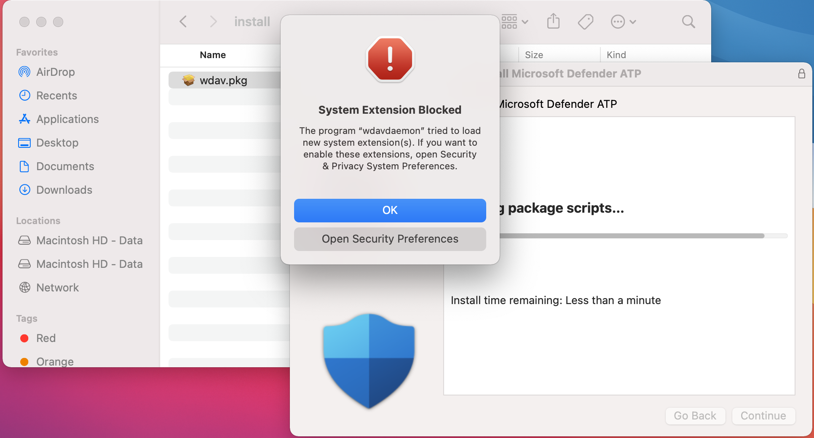

# <a name="manual-deployment-for-microsoft-defender-for-endpoint-for-macos"></a>macOS 的 Microsoft Defender 端點的手動部署

[!INCLUDE [Microsoft 365 Defender rebranding](../../includes/microsoft-defender.md)]

**適用於：**
- [適用於端點的 Microsoft Defender](https://go.microsoft.com/fwlink/p/?linkid=2154037)
- [Microsoft 365 Defender](https://go.microsoft.com/fwlink/?linkid=2118804)

> 想要體驗 Defender for Endpoint？ [註冊免費試用版。](https://www.microsoft.com/microsoft-365/windows/microsoft-defender-atp?ocid=docs-wdatp-investigateip-abovefoldlink)

本主題說明如何手動為 macOS 部署 Microsoft Defender for Endpoint。 成功的部署需要完成下列所有步驟：
- [下載安裝和上架套件](#download-installation-and-onboarding-packages)
- [應用程式安裝 (macOS 10.15 和舊版) ](#application-installation-macos-1015-and-older-versions)
- [應用程式安裝 (macOS 11 和更新版本) ](#application-installation-macos-11-and-newer-versions)
- [用戶端設定](#client-configuration)

## <a name="prerequisites-and-system-requirements"></a>必要條件和系統需求

開始之前，請參閱 [macOS 頁面的主要 Microsoft Defender For Endpoint](microsoft-defender-endpoint-mac.md) ，以取得目前軟體版本之必要條件和系統需求的描述。

## <a name="download-installation-and-onboarding-packages"></a>下載安裝和上架套件

從 Microsoft Defender Security Center 下載安裝和上架套件：

1. 在 Microsoft Defender Security Center 中，移至 [ **設定] > 裝置管理 > 上架**]。
2. 在頁面的區段1中，將 [作業系統] 設定為 **macOS** ，並將 Deployment 方法設定為 **本機腳本**。
3. 在頁面的區段2中，選取 [ **下載安裝套件**]。 將其儲存為 wdav。 pkg 至本機目錄。
4. 在頁面的區段2中，選取 [ **下載上架套件**]。 將它儲存成 WindowsDefenderATPOnboardingPackage.zip 相同的目錄。

    

5. 在命令提示字元中，確認您有兩個檔案。
    
## <a name="application-installation-macos-1015-and-older-versions"></a>應用程式安裝 (macOS 10.15 和舊版) 

若要完成此程式，您必須具有裝置的系統管理員許可權。

1. 流覽至 Finder 中已下載的 wdav，然後開啟它。

    

2. 選取 [ **繼續**]，同意授權條款，然後在出現提示時輸入密碼。

    

   > [!IMPORTANT]
   > 系統會提示您允許安裝來自 Microsoft 的驅動程式， (「系統擴充封鎖」或「保留安裝」或兩者皆有）。 必須允許安裝驅動程式。

   

3. 選取 [ **開啟安全性** 設定] 或 [ **開啟系統偏好設定] > 安全性 & 隱私權**。 選取 [ **允許**]：

    

   安裝會繼續進行。

   > [!CAUTION]
   > 如果您未選取 [ **允許**]，安裝將在5分鐘之後繼續進行。 將會載入 Microsoft Defender for Endpoint，但某些功能（例如即時保護）將會停用。 如需如何解決此問題的資訊，請參閱 [內核擴充問題疑難排解](mac-support-kext.md) 。

> [!NOTE]
> 在第一次安裝 Microsoft Defender for Endpoint 時，macOS 可能要求重新開機裝置。 在重新開機裝置之前，即時保護將無法使用。

## <a name="application-installation-macos-11-and-newer-versions"></a>應用程式安裝 (macOS 11 和更新版本) 

若要完成此程式，您必須具有裝置的系統管理員許可權。

1. 流覽至 Finder 中已下載的 wdav，然後開啟它。

    

2. 選取 [ **繼續**]，同意授權條款，然後在出現提示時輸入密碼。

3. 在安裝程式結束時，您將會提升，以核准產品所用的系統擴充。 選取 [ **開啟安全性喜好** 設定]。

    

4. 在 [ **安全性 & 隱私權** ] 視窗中，選取 [ **允許**]。

    

5. 針對 Mac 的端點，針對所有隨 Microsoft Defender for Endpoint 發佈的系統擴充，重複步驟 3 & 4。

6. 做為端點偵測和回應功能的一部分，Mac 版端點的 Microsoft Defender 會檢查通訊端流量，並將此資訊報告給 Microsoft Defender Security Center 入口網站。 當系統提示您授與 Microsoft Defender for Endpoint 許可權以篩選網路流量時，請選取 [ **允許**]。

    

7. 開啟 **系統偏好設定**  >  **安全性 & 隱私權** 及流覽至 **[隱私權**] 索引標籤。授與 **microsoft defender atp** 和 **microsoft defender atp Endpoint Security Extension** 的 **完整磁片存取** 許可權。

    

## <a name="client-configuration"></a>用戶端設定

1. 將 wdav pkg 和 MicrosoftDefenderATPOnboardingMacOs.py 複製到您為 macOS 部署 Microsoft Defender for Endpoint 的裝置。

    用戶端裝置與 orgId 未關聯。 請注意， *orgId* 屬性是空白的。

    ```bash
    mdatp health --field org_id
    ```

2. 執行 Python 腳本以安裝設定檔：

    ```bash
    /usr/bin/python MicrosoftDefenderATPOnboardingMacOs.py
    ```

3. 請確認裝置現在與您的組織有關聯，並報告有效的 *orgId*：

    ```bash
    mdatp health --field org_id
    ```

安裝之後，您會在右上角的 macOS 狀態列中看到 Microsoft Defender 圖示。

   
   

## <a name="how-to-allow-full-disk-access"></a>如何允許完整磁片存取

> [!CAUTION]
> macOS 10.15 (Catalina) 包含新的安全性和隱私權增強功能。 從這個版本開始，依預設，應用程式無法存取磁片 (上的某些位置，例如檔、下載、桌面等 ) 不經明確同意。 在缺少這種同意的情況下，Microsoft Defender for Endpoint 無法完全保護您的裝置。

若要授與同意，請開啟系統偏好設定-> 安全性 & 隱私權-> 隱私權-> 完整磁片存取。 按一下鎖定圖示，在對話方塊的底部 () 。 選取 [Microsoft Defender for Endpoint]。

## <a name="logging-installation-issues"></a>記錄安裝問題

如需詳細資訊，請參閱 [記錄安裝的問題](mac-resources.md#logging-installation-issues) ，以取得如何在錯誤發生時，尋找安裝程式所建立的自動產生記錄。

## <a name="uninstallation"></a>卸載

請參閱 [卸載](mac-resources.md#uninstalling) 以取得如何從用戶端裝置移除 Microsoft Defender For macOS 端點的詳細資料。
