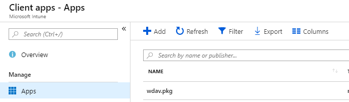

# <a name="intune-based-deployment-for-microsoft-defender-for-endpoint-for-mac"></a><span data-ttu-id="055e0-104">以 Intune 為基礎的 Microsoft Defender for Mac 部署</span><span class="sxs-lookup"><span data-stu-id="055e0-104">Intune-based deployment for Microsoft Defender for Endpoint for Mac</span></span>

[!INCLUDE [Microsoft 365 Defender rebranding](../../includes/microsoft-defender.md)]


> [!NOTE]
> <span data-ttu-id="055e0-105">本檔說明舊版在 macOS 裝置上部署及設定 Microsoft Defender for Endpoint 的方法。</span><span class="sxs-lookup"><span data-stu-id="055e0-105">This documentation explains the legacy method for deploying and configuring Microsoft Defender for Endpoint on macOS devices.</span></span> <span data-ttu-id="055e0-106">在 MEM 主控台中現在可以使用原生體驗。</span><span class="sxs-lookup"><span data-stu-id="055e0-106">The native experience is now available in the MEM console.</span></span> <span data-ttu-id="055e0-107">在 MEM 主控台中，原生使用者介面的發行方式，可讓系統管理員設定及部署應用程式，並將其傳送至 macOS 裝置。</span><span class="sxs-lookup"><span data-stu-id="055e0-107">The release of the native UI in the MEM console provide admins with a much simpler way to configure and deploy the application and send it down to macOS devices.</span></span> <br> <br>
><span data-ttu-id="055e0-108">博客文章 [MEM 可簡化 macOS 的 Microsoft Defender For Endpoint 的部署，以](https://techcommunity.microsoft.com/t5/microsoft-endpoint-manager-blog/microsoft-endpoint-manager-simplifies-deployment-of-microsoft/ba-p/1322995) 說明新功能。</span><span class="sxs-lookup"><span data-stu-id="055e0-108">The blog post [MEM simplifies deployment of Microsoft Defender for Endpoint for macOS](https://techcommunity.microsoft.com/t5/microsoft-endpoint-manager-blog/microsoft-endpoint-manager-simplifies-deployment-of-microsoft/ba-p/1322995) explains the new features.</span></span> <span data-ttu-id="055e0-109">若要設定應用程式，請移至 [microsoft InTune 中的 Mac 版端點的設定](https://docs.microsoft.com/mem/intune/protect/antivirus-microsoft-defender-settings-macos)。</span><span class="sxs-lookup"><span data-stu-id="055e0-109">To configure the app, go to [Settings for Microsoft Defender for Endpoint for Mac in Microsoft InTune](https://docs.microsoft.com/mem/intune/protect/antivirus-microsoft-defender-settings-macos).</span></span> <span data-ttu-id="055e0-110">若要部署應用程式，請移至 [使用 Microsoft Intune 的 macOS 裝置新增 Microsoft Defender For Endpoint](https://docs.microsoft.com/mem/intune/apps/apps-advanced-threat-protection-macos)。</span><span class="sxs-lookup"><span data-stu-id="055e0-110">To deploy the app, go to [Add Microsoft Defender for Endpoint to macOS devices using Microsoft Intune](https://docs.microsoft.com/mem/intune/apps/apps-advanced-threat-protection-macos).</span></span>

<span data-ttu-id="055e0-111">**適用於：**</span><span class="sxs-lookup"><span data-stu-id="055e0-111">**Applies to:**</span></span>

- [<span data-ttu-id="055e0-112">Mac 版適用於端點的 Microsoft Defender</span><span class="sxs-lookup"><span data-stu-id="055e0-112">Microsoft Defender for Endpoint for Mac</span></span>](microsoft-defender-endpoint-mac.md)

<span data-ttu-id="055e0-113">本主題說明如何透過 Intune 為 Mac 版端點部署 Microsoft Defender。</span><span class="sxs-lookup"><span data-stu-id="055e0-113">This topic describes how to deploy Microsoft Defender for Endpoint for Mac through Intune.</span></span> <span data-ttu-id="055e0-114">成功的部署需要完成下列所有步驟：</span><span class="sxs-lookup"><span data-stu-id="055e0-114">A successful deployment requires the completion of all of the following steps:</span></span>

1. [<span data-ttu-id="055e0-115">下載安裝和上架套件</span><span class="sxs-lookup"><span data-stu-id="055e0-115">Download installation and onboarding packages</span></span>](#download-installation-and-onboarding-packages)
1. [<span data-ttu-id="055e0-116">用戶端裝置設定</span><span class="sxs-lookup"><span data-stu-id="055e0-116">Client device setup</span></span>](#client-device-setup)
1. [<span data-ttu-id="055e0-117">核准系統擴充</span><span class="sxs-lookup"><span data-stu-id="055e0-117">Approve system extensions</span></span>](#approve-system-extensions)
1. [<span data-ttu-id="055e0-118">建立系統設定檔</span><span class="sxs-lookup"><span data-stu-id="055e0-118">Create System Configuration profiles</span></span>](#create-system-configuration-profiles)
1. [<span data-ttu-id="055e0-119">發佈應用程式</span><span class="sxs-lookup"><span data-stu-id="055e0-119">Publish application</span></span>](#publish-application)

## <a name="prerequisites-and-system-requirements"></a><span data-ttu-id="055e0-120">必要條件和系統需求</span><span class="sxs-lookup"><span data-stu-id="055e0-120">Prerequisites and system requirements</span></span>

<span data-ttu-id="055e0-121">開始之前，請參閱 [《 Microsoft Defender For Mac 的主要端點」頁面](microsoft-defender-endpoint-mac.md) ，以取得目前軟體版本之必要條件和系統需求的描述。</span><span class="sxs-lookup"><span data-stu-id="055e0-121">Before you get started, see [the main Microsoft Defender for Endpoint for Mac page](microsoft-defender-endpoint-mac.md) for a description of prerequisites and system requirements for the current software version.</span></span>

## <a name="overview"></a><span data-ttu-id="055e0-122">概觀</span><span class="sxs-lookup"><span data-stu-id="055e0-122">Overview</span></span>

<span data-ttu-id="055e0-123">下表摘要說明透過 Intune 部署及管理 Mac 的 Microsoft Defender 端點時，所需採取的步驟。</span><span class="sxs-lookup"><span data-stu-id="055e0-123">The following table summarizes the steps you would need to take to deploy and manage Microsoft Defender for Endpoint for Macs, via Intune.</span></span> <span data-ttu-id="055e0-124">以下是更詳細的步驟。</span><span class="sxs-lookup"><span data-stu-id="055e0-124">More detailed steps are available below.</span></span>

| <span data-ttu-id="055e0-125">步驟</span><span class="sxs-lookup"><span data-stu-id="055e0-125">Step</span></span> | <span data-ttu-id="055e0-126">範例檔案名</span><span class="sxs-lookup"><span data-stu-id="055e0-126">Sample file names</span></span> | <span data-ttu-id="055e0-127">BundleIdentifier</span><span class="sxs-lookup"><span data-stu-id="055e0-127">BundleIdentifier</span></span> |
|-|-|-|
| [<span data-ttu-id="055e0-128">下載安裝和上架套件</span><span class="sxs-lookup"><span data-stu-id="055e0-128">Download installation and onboarding packages</span></span>](#download-installation-and-onboarding-packages) | <span data-ttu-id="055e0-129">WindowsDefenderATPOnboarding__MDATP_wdav.atp.xml</span><span class="sxs-lookup"><span data-stu-id="055e0-129">WindowsDefenderATPOnboarding__MDATP_wdav.atp.xml</span></span> | <span data-ttu-id="055e0-130">wdav atp</span><span class="sxs-lookup"><span data-stu-id="055e0-130">com.microsoft.wdav.atp</span></span> |
| [<span data-ttu-id="055e0-131">核准 Microsoft Defender for Endpoint 的系統擴充</span><span class="sxs-lookup"><span data-stu-id="055e0-131">Approve System Extension for Microsoft Defender for Endpoint</span></span>](#approve-system-extensions) | <span data-ttu-id="055e0-132">MDATP_SysExt.xml</span><span class="sxs-lookup"><span data-stu-id="055e0-132">MDATP_SysExt.xml</span></span> | <span data-ttu-id="055e0-133">不適用</span><span class="sxs-lookup"><span data-stu-id="055e0-133">N/A</span></span> |
| [<span data-ttu-id="055e0-134">核准 Microsoft Defender for Endpoint 的內核擴充</span><span class="sxs-lookup"><span data-stu-id="055e0-134">Approve Kernel Extension for Microsoft Defender for Endpoint</span></span>](#download-installation-and-onboarding-packages) | <span data-ttu-id="055e0-135">MDATP_KExt.xml</span><span class="sxs-lookup"><span data-stu-id="055e0-135">MDATP_KExt.xml</span></span> | <span data-ttu-id="055e0-136">不適用</span><span class="sxs-lookup"><span data-stu-id="055e0-136">N/A</span></span> |
| [<span data-ttu-id="055e0-137">授與 Microsoft Defender for Endpoint 的完整磁片存取權</span><span class="sxs-lookup"><span data-stu-id="055e0-137">Grant full disk access to Microsoft Defender for Endpoint</span></span>](#create-system-configuration-profiles-step-8) | <span data-ttu-id="055e0-138">MDATP_tcc_Catalina_or_newer.xml</span><span class="sxs-lookup"><span data-stu-id="055e0-138">MDATP_tcc_Catalina_or_newer.xml</span></span> | <span data-ttu-id="055e0-139">wdav tcc</span><span class="sxs-lookup"><span data-stu-id="055e0-139">com.microsoft.wdav.tcc</span></span> |
| [<span data-ttu-id="055e0-140">網路擴充原則</span><span class="sxs-lookup"><span data-stu-id="055e0-140">Network Extension policy</span></span>](#create-system-configuration-profiles-step-9) | <span data-ttu-id="055e0-141">MDATP_NetExt.xml</span><span class="sxs-lookup"><span data-stu-id="055e0-141">MDATP_NetExt.xml</span></span> | <span data-ttu-id="055e0-142">不適用</span><span class="sxs-lookup"><span data-stu-id="055e0-142">N/A</span></span> |
| [<span data-ttu-id="055e0-143">設定 Microsoft AutoUpdate (MAU) </span><span class="sxs-lookup"><span data-stu-id="055e0-143">Configure Microsoft AutoUpdate (MAU)</span></span>](https://docs.microsoft.com/microsoft-365/security/defender-endpoint/mac-updates#intune) | <span data-ttu-id="055e0-144">MDATP_Microsoft_AutoUpdate.xml</span><span class="sxs-lookup"><span data-stu-id="055e0-144">MDATP_Microsoft_AutoUpdate.xml</span></span> | <span data-ttu-id="055e0-145">autoupdate2</span><span class="sxs-lookup"><span data-stu-id="055e0-145">com.microsoft.autoupdate2</span></span> |
| [<span data-ttu-id="055e0-146">Microsoft Defender for Endpoint 設定設定</span><span class="sxs-lookup"><span data-stu-id="055e0-146">Microsoft Defender for Endpoint configuration settings</span></span>](https://docs.microsoft.com/microsoft-365/security/defender-endpoint/mac-preferences#intune-profile-1)<br/><br/> <span data-ttu-id="055e0-147">**附注：** 如果您打算為 macOS 執行協力廠商 AV，請將設定 `passiveMode` 為 `true` 。</span><span class="sxs-lookup"><span data-stu-id="055e0-147">**Note:** If you're planning to run a third-party AV for macOS, set `passiveMode` to `true`.</span></span> | <span data-ttu-id="055e0-148">MDATP_WDAV_and_exclusion_settings_Preferences.xml</span><span class="sxs-lookup"><span data-stu-id="055e0-148">MDATP_WDAV_and_exclusion_settings_Preferences.xml</span></span> | <span data-ttu-id="055e0-149">wdav</span><span class="sxs-lookup"><span data-stu-id="055e0-149">com.microsoft.wdav</span></span> |
| [<span data-ttu-id="055e0-150">設定 Microsoft Defender for Endpoint 和 MS AutoUpdate (MAU) 通知</span><span class="sxs-lookup"><span data-stu-id="055e0-150">Configure Microsoft Defender for Endpoint and MS AutoUpdate (MAU) notifications</span></span>](#create-system-configuration-profiles-step-10) | <span data-ttu-id="055e0-151">MDATP_MDAV_Tray_and_AutoUpdate2。 mobileconfig</span><span class="sxs-lookup"><span data-stu-id="055e0-151">MDATP_MDAV_Tray_and_AutoUpdate2.mobileconfig</span></span> | <span data-ttu-id="055e0-152">autoupdate2 或 wdav （.com）</span><span class="sxs-lookup"><span data-stu-id="055e0-152">com.microsoft.autoupdate2 or com.microsoft.wdav.tray</span></span> |

## <a name="download-installation-and-onboarding-packages"></a><span data-ttu-id="055e0-153">下載安裝和上架套件</span><span class="sxs-lookup"><span data-stu-id="055e0-153">Download installation and onboarding packages</span></span>

<span data-ttu-id="055e0-154">從 Microsoft Defender Security Center 下載安裝和上架套件：</span><span class="sxs-lookup"><span data-stu-id="055e0-154">Download the installation and onboarding packages from Microsoft Defender Security Center:</span></span>

1. <span data-ttu-id="055e0-155">在 Microsoft Defender Security Center 中，移至 [**設定**  >  **裝置管理** 上  >  **架**]。</span><span class="sxs-lookup"><span data-stu-id="055e0-155">In Microsoft Defender Security Center, go to **Settings** > **Device Management** > **Onboarding**.</span></span>

2. <span data-ttu-id="055e0-156">將作業系統設定為 **macOS** ，並將部署方法設定為行動 **裝置管理/Microsoft Intune**。</span><span class="sxs-lookup"><span data-stu-id="055e0-156">Set the operating system to **macOS** and the deployment method to **Mobile Device Management / Microsoft Intune**.</span></span>

    

3. <span data-ttu-id="055e0-158">選取 [ **下載安裝套件**]。</span><span class="sxs-lookup"><span data-stu-id="055e0-158">Select **Download installation package**.</span></span> <span data-ttu-id="055e0-159">將其儲存為 _wdav。 pkg_ 至本機目錄。</span><span class="sxs-lookup"><span data-stu-id="055e0-159">Save it as _wdav.pkg_ to a local directory.</span></span>

4. <span data-ttu-id="055e0-160">選取 [ **下載上架] 套件**。</span><span class="sxs-lookup"><span data-stu-id="055e0-160">Select **Download onboarding package**.</span></span> <span data-ttu-id="055e0-161">將它儲存成 _WindowsDefenderATPOnboardingPackage.zip_ 相同的目錄。</span><span class="sxs-lookup"><span data-stu-id="055e0-161">Save it as _WindowsDefenderATPOnboardingPackage.zip_ to the same directory.</span></span>

5. <span data-ttu-id="055e0-162">從下載 IntuneAppUtil [https://docs.microsoft.com/intune/lob-apps-macos](https://docs.microsoft.com/intune/lob-apps-macos) 。</span><span class="sxs-lookup"><span data-stu-id="055e0-162">Download **IntuneAppUtil** from [https://docs.microsoft.com/intune/lob-apps-macos](https://docs.microsoft.com/intune/lob-apps-macos).</span></span>

6. <span data-ttu-id="055e0-163">在命令提示字元中，確認您有三個檔案。</span><span class="sxs-lookup"><span data-stu-id="055e0-163">From a command prompt, verify that you have the three files.</span></span>
  

    ```bash
    ls -l
    ```

    ```Output
    total 721688
    -rw-r--r--  1 test  staff     269280 Mar 15 11:25 IntuneAppUtil
    -rw-r--r--  1 test  staff      11821 Mar 15 09:23 WindowsDefenderATPOnboardingPackage.zip
    -rw-r--r--  1 test  staff  354531845 Mar 13 08:57 wdav.pkg
    ```
7. <span data-ttu-id="055e0-164">解壓縮 .zip 檔案的內容：</span><span class="sxs-lookup"><span data-stu-id="055e0-164">Extract the contents of the .zip files:</span></span>

    ```bash
    unzip WindowsDefenderATPOnboardingPackage.zip
    ```
    ```Output
    Archive:  WindowsDefenderATPOnboardingPackage.zip
    warning:  WindowsDefenderATPOnboardingPackage.zip appears to use backslashes as path separators
      inflating: intune/kext.xml
      inflating: intune/WindowsDefenderATPOnboarding.xml
      inflating: jamf/WindowsDefenderATPOnboarding.plist
    ```

8. <span data-ttu-id="055e0-165">讓 IntuneAppUtil 成為可執行檔：</span><span class="sxs-lookup"><span data-stu-id="055e0-165">Make IntuneAppUtil an executable:</span></span>

    ```bash
    chmod +x IntuneAppUtil
    ```

9. <span data-ttu-id="055e0-166">從 wdav 建立 wdav 套件 intunemac。 pkg：</span><span class="sxs-lookup"><span data-stu-id="055e0-166">Create the wdav.pkg.intunemac package from wdav.pkg:</span></span>

    ```bash
    ./IntuneAppUtil -c wdav.pkg -o . -i "com.microsoft.wdav" -n "1.0.0"
    ```
    ```Output
    Microsoft Intune Application Utility for Mac OS X
    Version: 1.0.0.0
    Copyright 2018 Microsoft Corporation

    Creating intunemac file for /Users/test/Downloads/wdav.pkg
    Composing the intunemac file output
    Output written to ./wdav.pkg.intunemac.

    IntuneAppUtil successfully processed "wdav.pkg",
    to deploy refer to the product documentation.
    ```

## <a name="client-device-setup"></a><span data-ttu-id="055e0-167">用戶端裝置設定</span><span class="sxs-lookup"><span data-stu-id="055e0-167">Client device setup</span></span>

<span data-ttu-id="055e0-168">在標準 [公司入口網站安裝](https://docs.microsoft.com/intune-user-help/enroll-your-device-in-intune-macos-cp)以外，您不需要 Mac 裝置的任何特殊布建。</span><span class="sxs-lookup"><span data-stu-id="055e0-168">You don't need any special provisioning for a Mac device beyond a standard [Company Portal installation](https://docs.microsoft.com/intune-user-help/enroll-your-device-in-intune-macos-cp).</span></span>

1. <span data-ttu-id="055e0-169">確認裝置管理。</span><span class="sxs-lookup"><span data-stu-id="055e0-169">Confirm device management.</span></span>

   

    <span data-ttu-id="055e0-171">選取 [ **開啟系統喜好** 設定]，然後在清單中尋找 [ **管理設定檔** ]，然後選取 [ **核准 ...**]。您的管理設定檔會顯示為 **已驗證**：</span><span class="sxs-lookup"><span data-stu-id="055e0-171">Select **Open System Preferences**, locate **Management Profile** on the list, and select **Approve...**. Your Management Profile would be displayed as **Verified**:</span></span>

    

2. <span data-ttu-id="055e0-173">選取 [ **繼續** ] 並完成註冊。</span><span class="sxs-lookup"><span data-stu-id="055e0-173">Select **Continue** and complete the enrollment.</span></span>

   <span data-ttu-id="055e0-174">您現在可以註冊更多裝置。</span><span class="sxs-lookup"><span data-stu-id="055e0-174">You may now enroll more devices.</span></span> <span data-ttu-id="055e0-175">您也可以在完成提供系統設定和應用程式套件之後，再註冊。</span><span class="sxs-lookup"><span data-stu-id="055e0-175">You can also enroll them later, after you have finished provisioning system configuration and application packages.</span></span>

3. <span data-ttu-id="055e0-176">在 Intune 中，開啟 [**管理**  >  **裝置**  >  **所有裝置**]。</span><span class="sxs-lookup"><span data-stu-id="055e0-176">In Intune, open **Manage** > **Devices** > **All devices**.</span></span> <span data-ttu-id="055e0-177">您可以在這裡看到所列的裝置：</span><span class="sxs-lookup"><span data-stu-id="055e0-177">Here you can see your device among those listed:</span></span>

   > [!div class="mx-imgBorder"]
   > <span data-ttu-id="055e0-178"></span><span class="sxs-lookup"><span data-stu-id="055e0-178"></span></span>

## <a name="approve-system-extensions"></a><span data-ttu-id="055e0-179">核准系統擴充</span><span class="sxs-lookup"><span data-stu-id="055e0-179">Approve System Extensions</span></span>

<span data-ttu-id="055e0-180">若要核准系統擴充：</span><span class="sxs-lookup"><span data-stu-id="055e0-180">To approve the system extensions:</span></span>

1. <span data-ttu-id="055e0-181">在 Intune 中，開啟 [**管理**  >  **裝置** 設定]。</span><span class="sxs-lookup"><span data-stu-id="055e0-181">In Intune, open **Manage** > **Device configuration**.</span></span> <span data-ttu-id="055e0-182">選取 [**管理**  >  **設定檔**  >  **建立設定檔**]。</span><span class="sxs-lookup"><span data-stu-id="055e0-182">Select **Manage** > **Profiles** > **Create Profile**.</span></span>

2. <span data-ttu-id="055e0-183">選擇設定檔的名稱。</span><span class="sxs-lookup"><span data-stu-id="055e0-183">Choose a name for the profile.</span></span> <span data-ttu-id="055e0-184">將 **平臺** 改為 MacOS **配置檔案類型 = 分機**。</span><span class="sxs-lookup"><span data-stu-id="055e0-184">Change **Platform=macOS** to **Profile type=Extensions**.</span></span> <span data-ttu-id="055e0-185">選取 [建立]。</span><span class="sxs-lookup"><span data-stu-id="055e0-185">Select **Create**.</span></span>

3. <span data-ttu-id="055e0-186">在 [ **基礎** ] 索引標籤中，提供此新設定檔的名稱。</span><span class="sxs-lookup"><span data-stu-id="055e0-186">In the **Basics** tab, give a name to this new profile.</span></span>

4. <span data-ttu-id="055e0-187">在 [ **設定設定** ] 索引標籤的 [允許的 **系統擴充** ] 區段中，新增下列專案：</span><span class="sxs-lookup"><span data-stu-id="055e0-187">In the **Configuration settings** tab, add the following entries in the **Allowed system extensions** section:</span></span>

    <span data-ttu-id="055e0-188">束識別碼</span><span class="sxs-lookup"><span data-stu-id="055e0-188">Bundle identifier</span></span>         | <span data-ttu-id="055e0-189">小組識別碼</span><span class="sxs-lookup"><span data-stu-id="055e0-189">Team identifier</span></span>
    --------------------------|----------------
    <span data-ttu-id="055e0-190">wdav epsext</span><span class="sxs-lookup"><span data-stu-id="055e0-190">com.microsoft.wdav.epsext</span></span> | <span data-ttu-id="055e0-191">UBF8T346G9</span><span class="sxs-lookup"><span data-stu-id="055e0-191">UBF8T346G9</span></span>
    <span data-ttu-id="055e0-192">wdav netext</span><span class="sxs-lookup"><span data-stu-id="055e0-192">com.microsoft.wdav.netext</span></span> | <span data-ttu-id="055e0-193">UBF8T346G9</span><span class="sxs-lookup"><span data-stu-id="055e0-193">UBF8T346G9</span></span>

    > [!div class="mx-imgBorder"]
    > <span data-ttu-id="055e0-194">![[基礎] 索引標籤的 [設定設定] 中的副檔名設定螢幕擷取畫面](images/mac-system-extension-intune2.png)</span><span class="sxs-lookup"><span data-stu-id="055e0-194"></span></span>

5. <span data-ttu-id="055e0-195">在 [ **工作分派** ] 索引標籤中，將此設定檔指派給所有 **使用者 & 所有裝置**。</span><span class="sxs-lookup"><span data-stu-id="055e0-195">In the **Assignments** tab, assign this profile to **All Users & All devices**.</span></span>

6. <span data-ttu-id="055e0-196">複查和建立此設定設定檔。</span><span class="sxs-lookup"><span data-stu-id="055e0-196">Review and create this configuration profile.</span></span>

## <a name="create-system-configuration-profiles"></a><span data-ttu-id="055e0-197">建立系統設定檔</span><span class="sxs-lookup"><span data-stu-id="055e0-197">Create System Configuration profiles</span></span>

1. <span data-ttu-id="055e0-198">在 Intune 中，開啟 [**管理**  >  **裝置** 設定]。</span><span class="sxs-lookup"><span data-stu-id="055e0-198">In Intune, open **Manage** > **Device configuration**.</span></span> <span data-ttu-id="055e0-199">選取 [**管理**  >  **設定檔**  >  **建立設定檔**]。</span><span class="sxs-lookup"><span data-stu-id="055e0-199">Select **Manage** > **Profiles** > **Create Profile**.</span></span>

2. <span data-ttu-id="055e0-200">選擇設定檔的名稱。</span><span class="sxs-lookup"><span data-stu-id="055e0-200">Choose a name for the profile.</span></span> <span data-ttu-id="055e0-201">將 **平臺 = macOS** 變更為 **Profile type = Custom**。</span><span class="sxs-lookup"><span data-stu-id="055e0-201">Change **Platform=macOS** to **Profile type=Custom**.</span></span> <span data-ttu-id="055e0-202">選取 [ **設定**]。</span><span class="sxs-lookup"><span data-stu-id="055e0-202">Select **Configure**.</span></span>

3. <span data-ttu-id="055e0-203">開啟設定檔，並上傳 intune/kext.xml。</span><span class="sxs-lookup"><span data-stu-id="055e0-203">Open the configuration profile and upload intune/kext.xml.</span></span> <span data-ttu-id="055e0-204">此檔案是在上述其中一個區段中建立的。</span><span class="sxs-lookup"><span data-stu-id="055e0-204">This file was created in one of the preceding sections.</span></span>

4. <span data-ttu-id="055e0-205">選取 [確定]。</span><span class="sxs-lookup"><span data-stu-id="055e0-205">Select **OK**.</span></span>

    

5. <span data-ttu-id="055e0-207">選取 [**管理**  >  **指派**]。</span><span class="sxs-lookup"><span data-stu-id="055e0-207">Select **Manage** > **Assignments**.</span></span> <span data-ttu-id="055e0-208">在 [ **包含** ] 索引標籤中，選取 [ **指派給所有使用者 & 所有裝置**]。</span><span class="sxs-lookup"><span data-stu-id="055e0-208">In the **Include** tab, select **Assign to All Users & All devices**.</span></span>

6. <span data-ttu-id="055e0-209">重複步驟1到5，以取得更多設定檔。</span><span class="sxs-lookup"><span data-stu-id="055e0-209">Repeat steps 1 through 5 for more profiles.</span></span>

7. <span data-ttu-id="055e0-210">建立另一個設定檔，並提供名稱，並上傳 intune/WindowsDefenderATPOnboarding.xml 檔。</span><span class="sxs-lookup"><span data-stu-id="055e0-210">Create another profile, give it a name, and upload the intune/WindowsDefenderATPOnboarding.xml file.</span></span>

8. <span data-ttu-id="055e0-211">從 [我們的 GitHub 存放庫](https://raw.githubusercontent.com/microsoft/mdatp-xplat/master/macos/mobileconfig/profiles/fulldisk.mobileconfig)下載 **fulldisk** ，並將其儲存為 **tcc.xml**。</span><span class="sxs-lookup"><span data-stu-id="055e0-211">Download **fulldisk.mobileconfig** from [our GitHub repository](https://raw.githubusercontent.com/microsoft/mdatp-xplat/master/macos/mobileconfig/profiles/fulldisk.mobileconfig) and save it as **tcc.xml**.</span></span> <span data-ttu-id="055e0-212">建立另一個設定檔，並提供任何名稱，並將此檔案上傳至該設定檔。<a name="create-system-configuration-profiles-step-8" id = "create-system-configuration-profiles-step-8"></a></span><span class="sxs-lookup"><span data-stu-id="055e0-212">Create another profile, give it any name and upload this file to it.<a name="create-system-configuration-profiles-step-8" id = "create-system-configuration-profiles-step-8"></a></span></span>

   > [!CAUTION]
   > <span data-ttu-id="055e0-213">macOS 10.15 (Catalina) 包含新的安全性和隱私權增強功能。</span><span class="sxs-lookup"><span data-stu-id="055e0-213">macOS 10.15 (Catalina) contains new security and privacy enhancements.</span></span> <span data-ttu-id="055e0-214">從這個版本開始，依預設，應用程式無法存取磁片 (上的某些位置，例如檔、下載、桌面等 ) 不經明確同意。</span><span class="sxs-lookup"><span data-stu-id="055e0-214">Beginning with this version, by default, applications are not able to access certain locations on disk (such as Documents, Downloads, Desktop, etc.) without explicit consent.</span></span> <span data-ttu-id="055e0-215">在缺少這種同意的情況下，Microsoft Defender for Endpoint 無法完全保護您的裝置。</span><span class="sxs-lookup"><span data-stu-id="055e0-215">In the absence of this consent, Microsoft Defender for Endpoint is not able to fully protect your device.</span></span>
   >
   > <span data-ttu-id="055e0-216">此設定設定檔會授與 Microsoft Defender for Endpoint 的完整磁片存取權。</span><span class="sxs-lookup"><span data-stu-id="055e0-216">This configuration profile grants Full Disk Access to Microsoft Defender for Endpoint.</span></span> <span data-ttu-id="055e0-217">如果您先前已透過 Intune 設定 Microsoft Defender for Endpoint，建議您使用此設定檔更新部署。</span><span class="sxs-lookup"><span data-stu-id="055e0-217">If you previously configured Microsoft Defender for Endpoint through Intune, we recommend you update the deployment with this configuration profile.</span></span>

9. <span data-ttu-id="055e0-218">做為端點偵測和回應功能的一部分，Mac 版端點的 Microsoft Defender 會檢查通訊端流量，並將此資訊報告給 Microsoft Defender Security Center 入口網站。</span><span class="sxs-lookup"><span data-stu-id="055e0-218">As part of the Endpoint Detection and Response capabilities, Microsoft Defender for Endpoint for Mac inspects socket traffic and reports this information to the Microsoft Defender Security Center portal.</span></span> <span data-ttu-id="055e0-219">下列原則允許網路分機執行這項功能。</span><span class="sxs-lookup"><span data-stu-id="055e0-219">The following policy allows the network extension to perform this functionality.</span></span> <span data-ttu-id="055e0-220">從 [我們的 GitHub 存放庫](https://raw.githubusercontent.com/microsoft/mdatp-xplat/master/macos/mobileconfig/profiles/netfilter.mobileconfig)下載 **netfilter** ，將其儲存為 netext.xml，然後使用與上述各節相同的步驟進行部署。</span><span class="sxs-lookup"><span data-stu-id="055e0-220">Download **netfilter.mobileconfig** from [our GitHub repository](https://raw.githubusercontent.com/microsoft/mdatp-xplat/master/macos/mobileconfig/profiles/netfilter.mobileconfig), save it as netext.xml and deploy it using the same steps as in the previous sections.</span></span> <a name = "create-system-configuration-profiles-step-9" id = "create-system-configuration-profiles-step-9"></a>

10. <span data-ttu-id="055e0-221">若要允許 Microsoft Defender for Mac 和 Microsoft 自動更新在 macOS 10.15 (Catalina) 上的 UI 中顯示通知，請 `notif.mobileconfig` 從 [我們的 GitHub 存放庫](https://raw.githubusercontent.com/microsoft/mdatp-xplat/master/macos/mobileconfig/profiles/notif.mobileconfig) 下載並將其匯入為自訂的負載。</span><span class="sxs-lookup"><span data-stu-id="055e0-221">To allow Microsoft Defender for Endpoint for Mac and Microsoft Auto Update to display notifications in UI on macOS 10.15 (Catalina), download `notif.mobileconfig` from [our GitHub repository](https://raw.githubusercontent.com/microsoft/mdatp-xplat/master/macos/mobileconfig/profiles/notif.mobileconfig) and import it as a custom payload.</span></span> <a name = "create-system-configuration-profiles-step-10" id = "create-system-configuration-profiles-step-10"></a>

11. <span data-ttu-id="055e0-222">選取 [ **管理 > 指派**]。</span><span class="sxs-lookup"><span data-stu-id="055e0-222">Select **Manage > Assignments**.</span></span>  <span data-ttu-id="055e0-223">在 [ **包含** ] 索引標籤中，選取 [ **指派給所有使用者 & 所有裝置**]。</span><span class="sxs-lookup"><span data-stu-id="055e0-223">In the **Include** tab, select **Assign to All Users & All devices**.</span></span>

<span data-ttu-id="055e0-224">當 Intune 變更傳播至已註冊的裝置後，您可以在 [**監視**  >  **裝置狀態**] 底下看到它們：</span><span class="sxs-lookup"><span data-stu-id="055e0-224">Once the Intune changes are propagated to the enrolled devices, you can see them listed under **Monitor** > **Device status**:</span></span>

> [!div class="mx-imgBorder"]
> <span data-ttu-id="055e0-225"></span><span class="sxs-lookup"><span data-stu-id="055e0-225"></span></span>

## <a name="publish-application"></a><span data-ttu-id="055e0-226">發佈應用程式</span><span class="sxs-lookup"><span data-stu-id="055e0-226">Publish application</span></span>

1. <span data-ttu-id="055e0-227">在 Intune 中，開啟 [ **管理 > 用戶端應用程式** ] blade。</span><span class="sxs-lookup"><span data-stu-id="055e0-227">In Intune, open the **Manage > Client apps** blade.</span></span> <span data-ttu-id="055e0-228">選取 [ **app > 新增**]。</span><span class="sxs-lookup"><span data-stu-id="055e0-228">Select **Apps > Add**.</span></span>

2. <span data-ttu-id="055e0-229">選取 **應用程式類型 = 其他/業務線應用程式**。</span><span class="sxs-lookup"><span data-stu-id="055e0-229">Select **App type=Other/Line-of-business app**.</span></span>

3. <span data-ttu-id="055e0-230">選取 [檔案] **= wdav pkg**。</span><span class="sxs-lookup"><span data-stu-id="055e0-230">Select **file=wdav.pkg.intunemac**.</span></span> <span data-ttu-id="055e0-231">請選取 **[確定]** 進行上傳。</span><span class="sxs-lookup"><span data-stu-id="055e0-231">Select **OK** to upload.</span></span>

4. <span data-ttu-id="055e0-232">選取 [ **設定** 並新增必要的資訊]。</span><span class="sxs-lookup"><span data-stu-id="055e0-232">Select **Configure** and add the required information.</span></span>

5. <span data-ttu-id="055e0-233">使用 **MacOS 高塞拉里昂 10.14** 做為最小作業系統。</span><span class="sxs-lookup"><span data-stu-id="055e0-233">Use **macOS High Sierra 10.14** as the minimum OS.</span></span>

6. <span data-ttu-id="055e0-234">將 [ *忽略應用程式版本* ] 設定為 **[是]**。</span><span class="sxs-lookup"><span data-stu-id="055e0-234">Set *Ignore app version* to **Yes**.</span></span> <span data-ttu-id="055e0-235">其他設定可以是任意值。</span><span class="sxs-lookup"><span data-stu-id="055e0-235">Other settings can be any arbitrary value.</span></span>

    > [!CAUTION]
    > <span data-ttu-id="055e0-236">設定 [ *忽略應用程式版本* ] **不** 會影響應用程式透過 Microsoft AutoUpdate 接收更新的能力。</span><span class="sxs-lookup"><span data-stu-id="055e0-236">Setting *Ignore app version* to **No** impacts the ability of the application to receive updates through Microsoft AutoUpdate.</span></span> <span data-ttu-id="055e0-237">如需如何更新產品的其他資訊，請參閱 [部署 Microsoft Defender For Mac 的更新](mac-updates.md) 。</span><span class="sxs-lookup"><span data-stu-id="055e0-237">See [Deploy updates for Microsoft Defender for Endpoint for Mac](mac-updates.md) for additional information about how the product is updated.</span></span>
    >
    > <span data-ttu-id="055e0-238">如果 Intune 上傳的版本低於裝置上的版本，則會安裝較低的版本，因此會有效地將 Microsoft Defender 用於端點。</span><span class="sxs-lookup"><span data-stu-id="055e0-238">If the version uploaded by Intune is lower than the version on the device, then the lower version will be installed, effectively downgrading Microsoft Defender for Endpoint.</span></span> <span data-ttu-id="055e0-239">這可能會導致非運作的應用程式。</span><span class="sxs-lookup"><span data-stu-id="055e0-239">This could result in a non-functioning application.</span></span> <span data-ttu-id="055e0-240">如需如何更新產品的其他資訊，請參閱 [部署 Microsoft Defender For Mac 的更新](mac-updates.md) 。</span><span class="sxs-lookup"><span data-stu-id="055e0-240">See [Deploy updates for Microsoft Defender for Endpoint for Mac](mac-updates.md) for additional information about how the product is updated.</span></span> <span data-ttu-id="055e0-241">如果您部署了將「忽略」 *應用程式版本* 設定為 [ **否**] 的 Microsoft Defender 端點，請將它變更為 **[是]**。</span><span class="sxs-lookup"><span data-stu-id="055e0-241">If you deployed Microsoft Defender for Endpoint with *Ignore app version* set to **No**, please change it to **Yes**.</span></span> <span data-ttu-id="055e0-242">若仍無法在用戶端裝置上安裝 Microsoft Defender for Endpoint，請卸載 Microsoft Defender for Endpoint，然後推入更新的原則。</span><span class="sxs-lookup"><span data-stu-id="055e0-242">If Microsoft Defender for Endpoint still cannot be installed on a client device, then uninstall Microsoft Defender for Endpoint and push the updated policy.</span></span>
     
    > [!div class="mx-imgBorder"]
    > <span data-ttu-id="055e0-243"></span><span class="sxs-lookup"><span data-stu-id="055e0-243"></span></span>

7. <span data-ttu-id="055e0-244">選取 **[確定]** 並 **新增**]。</span><span class="sxs-lookup"><span data-stu-id="055e0-244">Select **OK** and **Add**.</span></span>

    > [!div class="mx-imgBorder"]
    > <span data-ttu-id="055e0-245">![在 [通知] 視窗中顯示的裝置狀態](images/mdatp-9-intunepkginfo.png)</span><span class="sxs-lookup"><span data-stu-id="055e0-245"></span></span>

8. <span data-ttu-id="055e0-246">可能需要幾分鐘才能上傳套件。</span><span class="sxs-lookup"><span data-stu-id="055e0-246">It may take a few moments to upload the package.</span></span> <span data-ttu-id="055e0-247">完成後，請從清單中選取套件，然後移至 [ **工作分派** ] 和 [ **新增群組**]。</span><span class="sxs-lookup"><span data-stu-id="055e0-247">After it's done, select the package from the list and go to **Assignments** and **Add group**.</span></span>

    > [!div class="mx-imgBorder"]
    > <span data-ttu-id="055e0-248"></span><span class="sxs-lookup"><span data-stu-id="055e0-248"></span></span>

9. <span data-ttu-id="055e0-249">將 **工作分派類型** 變更為 [ **必要**]。</span><span class="sxs-lookup"><span data-stu-id="055e0-249">Change **Assignment type** to **Required**.</span></span>

10. <span data-ttu-id="055e0-250">選取 [ **包含的群組**]。</span><span class="sxs-lookup"><span data-stu-id="055e0-250">Select **Included Groups**.</span></span> <span data-ttu-id="055e0-251">選取 **[讓所有裝置都需要此應用程式] = [是]**。</span><span class="sxs-lookup"><span data-stu-id="055e0-251">Select **Make this app required for all devices=Yes**.</span></span> <span data-ttu-id="055e0-252">選取 [ **選取要包含的群組** ]，並新增包含您要作為目標之使用者的群組。</span><span class="sxs-lookup"><span data-stu-id="055e0-252">Select **Select group to include** and add a group that contains the users you want to target.</span></span> <span data-ttu-id="055e0-253">選取 **[確定]** 並 **儲存**。</span><span class="sxs-lookup"><span data-stu-id="055e0-253">Select **OK** and **Save**.</span></span>

    > [!div class="mx-imgBorder"]
    > <span data-ttu-id="055e0-254"></span><span class="sxs-lookup"><span data-stu-id="055e0-254"></span></span>

11. <span data-ttu-id="055e0-255">在一段時間之後，將會將應用程式發佈至所有已註冊的裝置。</span><span class="sxs-lookup"><span data-stu-id="055e0-255">After some time the application will be published to all enrolled devices.</span></span> <span data-ttu-id="055e0-256">您可以  >  在 [**裝置安裝狀態**] 底下看到它所列于監視器 **裝置** 中。</span><span class="sxs-lookup"><span data-stu-id="055e0-256">You can see it listed in **Monitor** > **Device**, under **Device install status**:</span></span>

    > [!div class="mx-imgBorder"]
    > <span data-ttu-id="055e0-257"></span><span class="sxs-lookup"><span data-stu-id="055e0-257"></span></span>

## <a name="verify-client-device-state"></a><span data-ttu-id="055e0-258">驗證用戶端裝置狀態</span><span class="sxs-lookup"><span data-stu-id="055e0-258">Verify client device state</span></span>

1. <span data-ttu-id="055e0-259">設定設定檔部署至裝置後，開啟 Mac 裝置上的 [**系統偏好** 設定  >  **設定檔**]。</span><span class="sxs-lookup"><span data-stu-id="055e0-259">After the configuration profiles are deployed to your devices, open **System Preferences** > **Profiles** on your Mac device.</span></span>

    <span data-ttu-id="055e0-260"></span><span class="sxs-lookup"><span data-stu-id="055e0-260"></span></span><br/>
    <span data-ttu-id="055e0-261"></span><span class="sxs-lookup"><span data-stu-id="055e0-261"></span></span>

2. <span data-ttu-id="055e0-262">確認下列設定設定檔已存在且已安裝。</span><span class="sxs-lookup"><span data-stu-id="055e0-262">Verify that the following configuration profiles are present and installed.</span></span> <span data-ttu-id="055e0-263">**管理設定檔** 應為 Intune 系統設定檔。</span><span class="sxs-lookup"><span data-stu-id="055e0-263">The **Management Profile** should be the Intune system profile.</span></span> <span data-ttu-id="055e0-264">_Wdav-config_ 和 _Wdav-Kext_ 是在 Intune 中新增的系統設定設定檔： </span><span class="sxs-lookup"><span data-stu-id="055e0-264">_Wdav-config_ and _wdav-kext_ are system configuration profiles that were added in Intune: </span></span>

3. <span data-ttu-id="055e0-265">您也應該會在右上角看到 Microsoft Defender 圖示：</span><span class="sxs-lookup"><span data-stu-id="055e0-265">You should also see the Microsoft Defender icon in the top-right corner:</span></span>

    > [!div class="mx-imgBorder"]
    > <span data-ttu-id="055e0-266"></span><span class="sxs-lookup"><span data-stu-id="055e0-266"></span></span>

## <a name="troubleshooting"></a><span data-ttu-id="055e0-267">疑難排解</span><span class="sxs-lookup"><span data-stu-id="055e0-267">Troubleshooting</span></span>

<span data-ttu-id="055e0-268">問題：未找到授權</span><span class="sxs-lookup"><span data-stu-id="055e0-268">Issue: No license found</span></span>

<span data-ttu-id="055e0-269">解決方案：遵循上述步驟，使用 WindowsDefenderATPOnboarding.xml 建立裝置設定檔</span><span class="sxs-lookup"><span data-stu-id="055e0-269">Solution: Follow the steps above to create a device profile using WindowsDefenderATPOnboarding.xml</span></span>

## <a name="logging-installation-issues"></a><span data-ttu-id="055e0-270">記錄安裝問題</span><span class="sxs-lookup"><span data-stu-id="055e0-270">Logging installation issues</span></span>

<span data-ttu-id="055e0-271">如需如何在發生錯誤時，尋找由安裝程式所建立之自動產生記錄的詳細資訊，請參閱 [記錄安裝問題](mac-resources.md#logging-installation-issues)。</span><span class="sxs-lookup"><span data-stu-id="055e0-271">For more information on how to find the automatically generated log that is created by the installer when an error occurs, see [Logging installation issues](mac-resources.md#logging-installation-issues).</span></span>

## <a name="uninstallation"></a><span data-ttu-id="055e0-272">卸載</span><span class="sxs-lookup"><span data-stu-id="055e0-272">Uninstallation</span></span>

<span data-ttu-id="055e0-273">請參閱 [卸載](mac-resources.md#uninstalling) 以取得如何從用戶端裝置移除 Microsoft Defender for Mac 之端點的詳細資料。</span><span class="sxs-lookup"><span data-stu-id="055e0-273">See [Uninstalling](mac-resources.md#uninstalling) for details on how to remove Microsoft Defender for Endpoint for Mac from client devices.</span></span>
