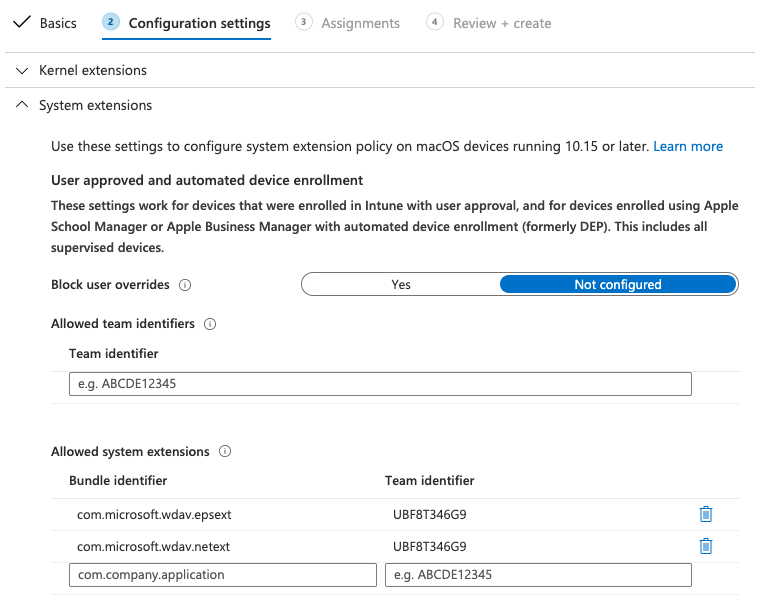
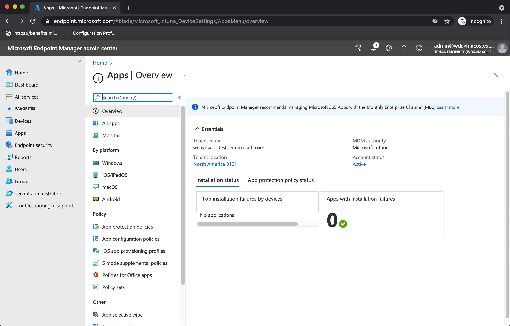
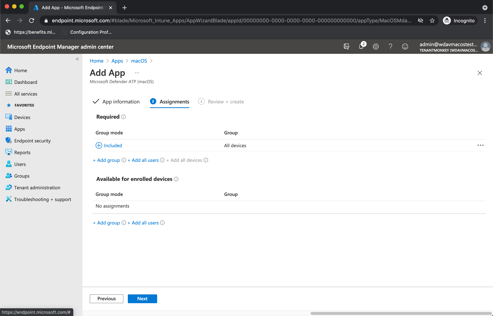
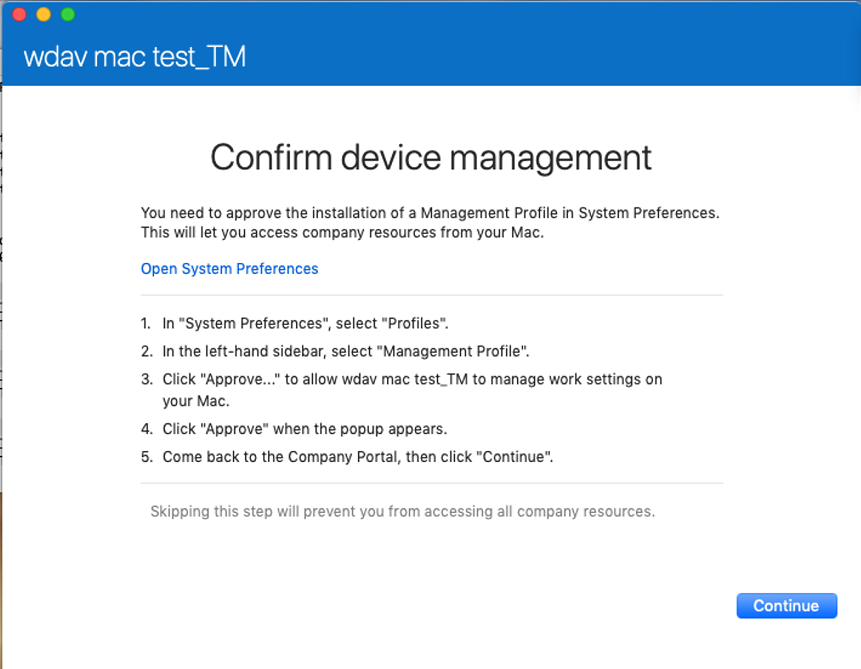
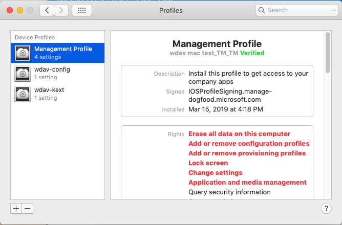
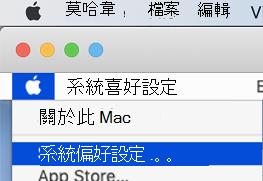

# <a name="intune-based-deployment-for-microsoft-defender-for-endpoint-on-macos"></a><span data-ttu-id="cada6-104">在 macOS 上以 Intune 為基礎之 Microsoft Defender for Endpoint 的部署</span><span class="sxs-lookup"><span data-stu-id="cada6-104">Intune-based deployment for Microsoft Defender for Endpoint on macOS</span></span>

[!INCLUDE [Microsoft 365 Defender rebranding](../../includes/microsoft-defender.md)]

<span data-ttu-id="cada6-105">**適用於：**</span><span class="sxs-lookup"><span data-stu-id="cada6-105">**Applies to:**</span></span>

- [<span data-ttu-id="cada6-106">macOS 上適用於端點的 Microsoft Defender</span><span class="sxs-lookup"><span data-stu-id="cada6-106">Microsoft Defender for Endpoint on macOS</span></span>](microsoft-defender-endpoint-mac.md)

<span data-ttu-id="cada6-107">本主題說明如何透過 Intune 在 macOS 上部署 Microsoft Defender for Endpoint。</span><span class="sxs-lookup"><span data-stu-id="cada6-107">This topic describes how to deploy Microsoft Defender for Endpoint on macOS through Intune.</span></span> <span data-ttu-id="cada6-108">成功的部署需要完成下列所有步驟：</span><span class="sxs-lookup"><span data-stu-id="cada6-108">A successful deployment requires the completion of all of the following steps:</span></span>

1. [<span data-ttu-id="cada6-109">下載上架套件</span><span class="sxs-lookup"><span data-stu-id="cada6-109">Download the onboarding package</span></span>](#download-the-onboarding-package)
1. [<span data-ttu-id="cada6-110">用戶端裝置設定</span><span class="sxs-lookup"><span data-stu-id="cada6-110">Client device setup</span></span>](#client-device-setup)
1. [<span data-ttu-id="cada6-111">核准系統擴充</span><span class="sxs-lookup"><span data-stu-id="cada6-111">Approve system extensions</span></span>](#approve-system-extensions)
1. [<span data-ttu-id="cada6-112">建立系統設定檔</span><span class="sxs-lookup"><span data-stu-id="cada6-112">Create System Configuration profiles</span></span>](#create-system-configuration-profiles)
1. [<span data-ttu-id="cada6-113">發佈應用程式</span><span class="sxs-lookup"><span data-stu-id="cada6-113">Publish application</span></span>](#publish-application)

## <a name="prerequisites-and-system-requirements"></a><span data-ttu-id="cada6-114">必要條件和系統需求</span><span class="sxs-lookup"><span data-stu-id="cada6-114">Prerequisites and system requirements</span></span>

<span data-ttu-id="cada6-115">開始之前，請參閱 [macOS 頁面上的主要 Microsoft Defender For Endpoint](microsoft-defender-endpoint-mac.md) ，以取得目前軟體版本之必要條件和系統需求的描述。</span><span class="sxs-lookup"><span data-stu-id="cada6-115">Before you get started, see [the main Microsoft Defender for Endpoint on macOS page](microsoft-defender-endpoint-mac.md) for a description of prerequisites and system requirements for the current software version.</span></span>

## <a name="overview"></a><span data-ttu-id="cada6-116">概觀</span><span class="sxs-lookup"><span data-stu-id="cada6-116">Overview</span></span>

<span data-ttu-id="cada6-117">下表摘要說明在 Mac 上透過 Intune 部署及管理 Microsoft Defender for Endpoint 時，所需採取的步驟。</span><span class="sxs-lookup"><span data-stu-id="cada6-117">The following table summarizes the steps you would need to take to deploy and manage Microsoft Defender for Endpoint on Macs, via Intune.</span></span> <span data-ttu-id="cada6-118">以下是更詳細的步驟。</span><span class="sxs-lookup"><span data-stu-id="cada6-118">More detailed steps are available below.</span></span>

| <span data-ttu-id="cada6-119">步驟</span><span class="sxs-lookup"><span data-stu-id="cada6-119">Step</span></span> | <span data-ttu-id="cada6-120">範例檔案名</span><span class="sxs-lookup"><span data-stu-id="cada6-120">Sample file names</span></span> | <span data-ttu-id="cada6-121">BundleIdentifier</span><span class="sxs-lookup"><span data-stu-id="cada6-121">BundleIdentifier</span></span> |
|-|-|-|
| [<span data-ttu-id="cada6-122">下載上架套件</span><span class="sxs-lookup"><span data-stu-id="cada6-122">Download the onboarding package</span></span>](#download-the-onboarding-package) | <span data-ttu-id="cada6-123">WindowsDefenderATPOnboarding__MDATP_wdav.atp.xml</span><span class="sxs-lookup"><span data-stu-id="cada6-123">WindowsDefenderATPOnboarding__MDATP_wdav.atp.xml</span></span> | <span data-ttu-id="cada6-124">wdav atp</span><span class="sxs-lookup"><span data-stu-id="cada6-124">com.microsoft.wdav.atp</span></span> |
| [<span data-ttu-id="cada6-125">核准 Microsoft Defender for Endpoint 的系統擴充</span><span class="sxs-lookup"><span data-stu-id="cada6-125">Approve System Extension for Microsoft Defender for Endpoint</span></span>](#approve-system-extensions) | <span data-ttu-id="cada6-126">MDATP_SysExt.xml</span><span class="sxs-lookup"><span data-stu-id="cada6-126">MDATP_SysExt.xml</span></span> | <span data-ttu-id="cada6-127">不適用</span><span class="sxs-lookup"><span data-stu-id="cada6-127">N/A</span></span> |
| [<span data-ttu-id="cada6-128">核准 Microsoft Defender for Endpoint 的內核擴充</span><span class="sxs-lookup"><span data-stu-id="cada6-128">Approve Kernel Extension for Microsoft Defender for Endpoint</span></span>](#download-the-onboarding-package) | <span data-ttu-id="cada6-129">MDATP_KExt.xml</span><span class="sxs-lookup"><span data-stu-id="cada6-129">MDATP_KExt.xml</span></span> | <span data-ttu-id="cada6-130">不適用</span><span class="sxs-lookup"><span data-stu-id="cada6-130">N/A</span></span> |
| [<span data-ttu-id="cada6-131">授與 Microsoft Defender for Endpoint 的完整磁片存取權</span><span class="sxs-lookup"><span data-stu-id="cada6-131">Grant full disk access to Microsoft Defender for Endpoint</span></span>](#full-disk-access) | <span data-ttu-id="cada6-132">MDATP_tcc_Catalina_or_newer.xml</span><span class="sxs-lookup"><span data-stu-id="cada6-132">MDATP_tcc_Catalina_or_newer.xml</span></span> | <span data-ttu-id="cada6-133">wdav tcc</span><span class="sxs-lookup"><span data-stu-id="cada6-133">com.microsoft.wdav.tcc</span></span> |
| [<span data-ttu-id="cada6-134">網路擴充原則</span><span class="sxs-lookup"><span data-stu-id="cada6-134">Network Extension policy</span></span>](#network-filter) | <span data-ttu-id="cada6-135">MDATP_NetExt.xml</span><span class="sxs-lookup"><span data-stu-id="cada6-135">MDATP_NetExt.xml</span></span> | <span data-ttu-id="cada6-136">不適用</span><span class="sxs-lookup"><span data-stu-id="cada6-136">N/A</span></span> |
| [<span data-ttu-id="cada6-137">設定 Microsoft AutoUpdate (MAU) </span><span class="sxs-lookup"><span data-stu-id="cada6-137">Configure Microsoft AutoUpdate (MAU)</span></span>](mac-updates.md#intune) | <span data-ttu-id="cada6-138">MDATP_Microsoft_AutoUpdate.xml</span><span class="sxs-lookup"><span data-stu-id="cada6-138">MDATP_Microsoft_AutoUpdate.xml</span></span> | <span data-ttu-id="cada6-139">autoupdate2</span><span class="sxs-lookup"><span data-stu-id="cada6-139">com.microsoft.autoupdate2</span></span> |
| [<span data-ttu-id="cada6-140">Microsoft Defender for Endpoint 設定設定</span><span class="sxs-lookup"><span data-stu-id="cada6-140">Microsoft Defender for Endpoint configuration settings</span></span>](mac-preferences.md#intune-profile-1)<br/><br/> <span data-ttu-id="cada6-141">**附注：** 如果您打算為 macOS 執行協力廠商 AV，請將設定 `passiveMode` 為 `true` 。</span><span class="sxs-lookup"><span data-stu-id="cada6-141">**Note:** If you're planning to run a third-party AV for macOS, set `passiveMode` to `true`.</span></span> | <span data-ttu-id="cada6-142">MDATP_WDAV_and_exclusion_settings_Preferences.xml</span><span class="sxs-lookup"><span data-stu-id="cada6-142">MDATP_WDAV_and_exclusion_settings_Preferences.xml</span></span> | <span data-ttu-id="cada6-143">wdav</span><span class="sxs-lookup"><span data-stu-id="cada6-143">com.microsoft.wdav</span></span> |
| [<span data-ttu-id="cada6-144">設定 Microsoft Defender for Endpoint 和 MS AutoUpdate (MAU) 通知</span><span class="sxs-lookup"><span data-stu-id="cada6-144">Configure Microsoft Defender for Endpoint and MS AutoUpdate (MAU) notifications</span></span>](mac-updates.md) | <span data-ttu-id="cada6-145">MDATP_MDAV_Tray_and_AutoUpdate2。 mobileconfig</span><span class="sxs-lookup"><span data-stu-id="cada6-145">MDATP_MDAV_Tray_and_AutoUpdate2.mobileconfig</span></span> | <span data-ttu-id="cada6-146">autoupdate2 或 wdav （.com）</span><span class="sxs-lookup"><span data-stu-id="cada6-146">com.microsoft.autoupdate2 or com.microsoft.wdav.tray</span></span> |


## <a name="download-the-onboarding-package"></a><span data-ttu-id="cada6-147">下載上架套件</span><span class="sxs-lookup"><span data-stu-id="cada6-147">Download the onboarding package</span></span>

<span data-ttu-id="cada6-148">從 Microsoft Defender 資訊安全中心下載上架套件：</span><span class="sxs-lookup"><span data-stu-id="cada6-148">Download the onboarding packages from Microsoft Defender Security Center:</span></span>

1. <span data-ttu-id="cada6-149">在 Microsoft Defender 資訊安全中心中，移至 **設定**  >  **裝置管理** 上  >  **架**。</span><span class="sxs-lookup"><span data-stu-id="cada6-149">In Microsoft Defender Security Center, go to **Settings** > **Device Management** > **Onboarding**.</span></span>

2. <span data-ttu-id="cada6-150">將作業系統設定為 **macOS** ，並將部署方法設定為行動 **裝置管理/Microsoft Intune**。</span><span class="sxs-lookup"><span data-stu-id="cada6-150">Set the operating system to **macOS** and the deployment method to **Mobile Device Management / Microsoft Intune**.</span></span>

    

3. <span data-ttu-id="cada6-152">選取 [ **下載上架] 套件**。</span><span class="sxs-lookup"><span data-stu-id="cada6-152">Select **Download onboarding package**.</span></span> <span data-ttu-id="cada6-153">將它儲存成 _WindowsDefenderATPOnboardingPackage.zip_ 相同的目錄。</span><span class="sxs-lookup"><span data-stu-id="cada6-153">Save it as _WindowsDefenderATPOnboardingPackage.zip_ to the same directory.</span></span>

4. <span data-ttu-id="cada6-154">解壓縮 .zip 檔案的內容：</span><span class="sxs-lookup"><span data-stu-id="cada6-154">Extract the contents of the .zip file:</span></span>

    ```bash
    unzip WindowsDefenderATPOnboardingPackage.zip
    ```
    ```Output
    Archive:  WindowsDefenderATPOnboardingPackage.zip
    warning:  WindowsDefenderATPOnboardingPackage.zip appears to use backslashes as path separators
      inflating: intune/kext.xml
      inflating: intune/WindowsDefenderATPOnboarding.xml
      inflating: jamf/WindowsDefenderATPOnboarding.plist
    ```

## <a name="create-system-configuration-profiles"></a><span data-ttu-id="cada6-155">建立系統設定檔</span><span class="sxs-lookup"><span data-stu-id="cada6-155">Create System Configuration profiles</span></span>

<span data-ttu-id="cada6-156">下一步是建立 Microsoft Defender for Endpoint 需要的系統設定檔。</span><span class="sxs-lookup"><span data-stu-id="cada6-156">The next step is to create system configuration profiles that Microsoft Defender for Endpoint needs.</span></span>
<span data-ttu-id="cada6-157">在 [Microsoft 端點管理員系統管理中心](https://endpoint.microsoft.com/)，開啟 **裝置** 設定  >  **設定檔**。</span><span class="sxs-lookup"><span data-stu-id="cada6-157">In the [Microsoft Endpoint Manager admin center](https://endpoint.microsoft.com/), open **Devices** > **Configuration profiles**.</span></span>

### <a name="onboarding-blob"></a><span data-ttu-id="cada6-158">上架 blob</span><span class="sxs-lookup"><span data-stu-id="cada6-158">Onboarding blob</span></span>

<span data-ttu-id="cada6-159">此設定檔包含 Microsoft Defender for Endpoint 的授權資訊，但沒有它會報告其未獲授權。</span><span class="sxs-lookup"><span data-stu-id="cada6-159">This profile contains a license information for Microsoft Defender for Endpoint, without it it will report that it is not licensed.</span></span>

1. <span data-ttu-id="cada6-160">選取 [設定配置 **檔**] 底下的 [**建立設定檔**]。</span><span class="sxs-lookup"><span data-stu-id="cada6-160">Select **Create Profile** under **Configuration Profiles**.</span></span>
1. <span data-ttu-id="cada6-161">選取 [**平臺** = **macOS**]，**配置檔案類型** = **範本**。</span><span class="sxs-lookup"><span data-stu-id="cada6-161">Select **Platform**=**macOS**, **Profile type**=**Templates**.</span></span> <span data-ttu-id="cada6-162">**範本名稱** =**自訂**。</span><span class="sxs-lookup"><span data-stu-id="cada6-162">**Template name**=**Custom**.</span></span> <span data-ttu-id="cada6-163">按一下 \*\*\*\*[建立]。</span><span class="sxs-lookup"><span data-stu-id="cada6-163">Click **Create**.</span></span>

    > [!div class="mx-imgBorder"]
    > <span data-ttu-id="cada6-164"></span><span class="sxs-lookup"><span data-stu-id="cada6-164"></span></span>

1. <span data-ttu-id="cada6-165">選擇設定檔的名稱，例如，"MDATP macOS 上架"。</span><span class="sxs-lookup"><span data-stu-id="cada6-165">Choose a name for the profile, e.g., "MDATP onboarding for macOS".</span></span> <span data-ttu-id="cada6-166">按 [下一步 **]**。</span><span class="sxs-lookup"><span data-stu-id="cada6-166">Click **Next**.</span></span>

    > [!div class="mx-imgBorder"]
    > <span data-ttu-id="cada6-167"></span><span class="sxs-lookup"><span data-stu-id="cada6-167"></span></span>

1. <span data-ttu-id="cada6-168">為設定設定檔名稱選擇名稱，例如，「MDATP macOS 上架」。</span><span class="sxs-lookup"><span data-stu-id="cada6-168">Choose a name for the configuration profile name, e.g., "MDATP onboarding for macOS".</span></span>
1. <span data-ttu-id="cada6-169">選取您從上述上架套件解壓縮為設定設定檔檔案的 intune/WindowsDefenderATPOnboarding.xml。</span><span class="sxs-lookup"><span data-stu-id="cada6-169">Select intune/WindowsDefenderATPOnboarding.xml that you extracted from the onboarding package above as configuration profile file.</span></span>

    > [!div class="mx-imgBorder"]
    > <span data-ttu-id="cada6-170"></span><span class="sxs-lookup"><span data-stu-id="cada6-170"></span></span>

1. <span data-ttu-id="cada6-171">按 [下一步 **]**。</span><span class="sxs-lookup"><span data-stu-id="cada6-171">Click **Next**.</span></span>
1. <span data-ttu-id="cada6-172">在 [**指派**] 索引標籤上指定裝置。按 **[下一步]**</span><span class="sxs-lookup"><span data-stu-id="cada6-172">Assign devices on the **Assignment** tab. Click **Next**.</span></span>

    > [!div class="mx-imgBorder"]
    > <span data-ttu-id="cada6-173"></span><span class="sxs-lookup"><span data-stu-id="cada6-173"></span></span>

1. <span data-ttu-id="cada6-174">複習和 **建立**。</span><span class="sxs-lookup"><span data-stu-id="cada6-174">Review and **Create**.</span></span>
1. <span data-ttu-id="cada6-175">開啟 **裝置**  >  **設定檔**，您可以在這裡看到您建立的設定檔。</span><span class="sxs-lookup"><span data-stu-id="cada6-175">Open **Devices** > **Configuration profiles**, you can see your created profile there.</span></span>

    > [!div class="mx-imgBorder"]
    > <span data-ttu-id="cada6-176"></span><span class="sxs-lookup"><span data-stu-id="cada6-176"></span></span>

### <a name="approve-system-extensions"></a><span data-ttu-id="cada6-177">核准系統擴充</span><span class="sxs-lookup"><span data-stu-id="cada6-177">Approve System Extensions</span></span>

<span data-ttu-id="cada6-178">MacOS 10.15 (Catalina) 或更新版本都需要此設定檔。</span><span class="sxs-lookup"><span data-stu-id="cada6-178">This profile is needed for macOS 10.15 (Catalina) or newer.</span></span> <span data-ttu-id="cada6-179">舊的 macOS 將會略過此方式。</span><span class="sxs-lookup"><span data-stu-id="cada6-179">It will be ignored on older macOS.</span></span>

1. <span data-ttu-id="cada6-180">選取 [設定配置 **檔**] 底下的 [**建立設定檔**]。</span><span class="sxs-lookup"><span data-stu-id="cada6-180">Select **Create Profile** under **Configuration Profiles**.</span></span>
1. <span data-ttu-id="cada6-181">選取 [**平臺** = **macOS**]，**配置檔案類型** = **範本**。</span><span class="sxs-lookup"><span data-stu-id="cada6-181">Select **Platform**=**macOS**, **Profile type**=**Templates**.</span></span> <span data-ttu-id="cada6-182">**範本名稱** =**分機**。</span><span class="sxs-lookup"><span data-stu-id="cada6-182">**Template name**=**Extensions**.</span></span> <span data-ttu-id="cada6-183">按一下 \*\*\*\*[建立]。</span><span class="sxs-lookup"><span data-stu-id="cada6-183">Click **Create**.</span></span>
1. <span data-ttu-id="cada6-184">在 [ **基礎** ] 索引標籤中，提供此新設定檔的名稱。</span><span class="sxs-lookup"><span data-stu-id="cada6-184">In the **Basics** tab, give a name to this new profile.</span></span>
1. <span data-ttu-id="cada6-185">在 [ **設定設定** ] 索引標籤中，展開 [ **系統擴充** 權] 在 [ **允許的系統擴充** ] 區段中新增下列專案：</span><span class="sxs-lookup"><span data-stu-id="cada6-185">In the **Configuration settings** tab, expand **System Extensions** add the following entries in the **Allowed system extensions** section:</span></span>

    <span data-ttu-id="cada6-186">束識別碼</span><span class="sxs-lookup"><span data-stu-id="cada6-186">Bundle identifier</span></span>         | <span data-ttu-id="cada6-187">小組識別碼</span><span class="sxs-lookup"><span data-stu-id="cada6-187">Team identifier</span></span>
    --------------------------|----------------
    <span data-ttu-id="cada6-188">wdav epsext</span><span class="sxs-lookup"><span data-stu-id="cada6-188">com.microsoft.wdav.epsext</span></span> | <span data-ttu-id="cada6-189">UBF8T346G9</span><span class="sxs-lookup"><span data-stu-id="cada6-189">UBF8T346G9</span></span>
    <span data-ttu-id="cada6-190">wdav netext</span><span class="sxs-lookup"><span data-stu-id="cada6-190">com.microsoft.wdav.netext</span></span> | <span data-ttu-id="cada6-191">UBF8T346G9</span><span class="sxs-lookup"><span data-stu-id="cada6-191">UBF8T346G9</span></span>

    > [!div class="mx-imgBorder"]
    > <span data-ttu-id="cada6-192"></span><span class="sxs-lookup"><span data-stu-id="cada6-192"></span></span>

1. <span data-ttu-id="cada6-193">在 [ **工作分派** ] 索引標籤中，將此設定檔指派給所有 **使用者 & 所有裝置**。</span><span class="sxs-lookup"><span data-stu-id="cada6-193">In the **Assignments** tab, assign this profile to **All Users & All devices**.</span></span>
1. <span data-ttu-id="cada6-194">複查和建立此設定設定檔。</span><span class="sxs-lookup"><span data-stu-id="cada6-194">Review and create this configuration profile.</span></span>

### <a name="kernel-extensions"></a><span data-ttu-id="cada6-195">內核擴充</span><span class="sxs-lookup"><span data-stu-id="cada6-195">Kernel Extensions</span></span>

<span data-ttu-id="cada6-196">MacOS 10.15 (Catalina) 或更舊版本都需要此設定檔。</span><span class="sxs-lookup"><span data-stu-id="cada6-196">This profile is needed for macOS 10.15 (Catalina) or older.</span></span> <span data-ttu-id="cada6-197">它會在較新的 macOS 上忽略。</span><span class="sxs-lookup"><span data-stu-id="cada6-197">It will be ignored on newer macOS.</span></span>

> [!CAUTION]
> <span data-ttu-id="cada6-198">Apple 矽 (M1) 裝置不支援 KEXT。</span><span class="sxs-lookup"><span data-stu-id="cada6-198">Apple Silicon (M1) devices do not support KEXT.</span></span> <span data-ttu-id="cada6-199">在這些裝置上安裝包含 KEXT 原則的設定檔將會失敗。</span><span class="sxs-lookup"><span data-stu-id="cada6-199">Installation of a configuration profile consisting KEXT policies will fail on these devices.</span></span>

1. <span data-ttu-id="cada6-200">選取 [設定配置 **檔**] 底下的 [**建立設定檔**]。</span><span class="sxs-lookup"><span data-stu-id="cada6-200">Select **Create Profile** under **Configuration Profiles**.</span></span>
1. <span data-ttu-id="cada6-201">選取 [**平臺** = **macOS**]，**配置檔案類型** = **範本**。</span><span class="sxs-lookup"><span data-stu-id="cada6-201">Select **Platform**=**macOS**, **Profile type**=**Templates**.</span></span> <span data-ttu-id="cada6-202">**範本名稱** =**分機**。</span><span class="sxs-lookup"><span data-stu-id="cada6-202">**Template name**=**Extensions**.</span></span> <span data-ttu-id="cada6-203">按一下 \*\*\*\*[建立]。</span><span class="sxs-lookup"><span data-stu-id="cada6-203">Click **Create**.</span></span>
1. <span data-ttu-id="cada6-204">在 [ **基礎** ] 索引標籤中，提供此新設定檔的名稱。</span><span class="sxs-lookup"><span data-stu-id="cada6-204">In the **Basics** tab, give a name to this new profile.</span></span>
1. <span data-ttu-id="cada6-205">在 [ **設定設定** ] 索引標籤中，展開 [ **核心擴充**]。</span><span class="sxs-lookup"><span data-stu-id="cada6-205">In the **Configuration settings** tab, expand **Kernel Extensions**.</span></span>
1. <span data-ttu-id="cada6-206">將 [ **小組識別碼** ] 設定為 **UBF8T346G9** ，然後按 **[下一步]**。</span><span class="sxs-lookup"><span data-stu-id="cada6-206">Set **Team identifier** to **UBF8T346G9** and click **Next**.</span></span>

    > [!div class="mx-imgBorder"]
    > <span data-ttu-id="cada6-207"></span><span class="sxs-lookup"><span data-stu-id="cada6-207"></span></span>

1. <span data-ttu-id="cada6-208">在 [ **工作分派** ] 索引標籤中，將此設定檔指派給所有 **使用者 & 所有裝置**。</span><span class="sxs-lookup"><span data-stu-id="cada6-208">In the **Assignments** tab, assign this profile to **All Users & All devices**.</span></span>
1. <span data-ttu-id="cada6-209">複查和建立此設定設定檔。</span><span class="sxs-lookup"><span data-stu-id="cada6-209">Review and create this configuration profile.</span></span>

### <a name="full-disk-access"></a><span data-ttu-id="cada6-210">完全磁片存取</span><span class="sxs-lookup"><span data-stu-id="cada6-210">Full Disk Access</span></span>

   > [!CAUTION]
   > <span data-ttu-id="cada6-211">macOS 10.15 (Catalina) 包含新的安全性和隱私權增強功能。</span><span class="sxs-lookup"><span data-stu-id="cada6-211">macOS 10.15 (Catalina) contains new security and privacy enhancements.</span></span> <span data-ttu-id="cada6-212">從這個版本開始，依預設，應用程式無法存取磁片 (上的某些位置，例如檔、下載、桌面等 ) 不經明確同意。</span><span class="sxs-lookup"><span data-stu-id="cada6-212">Beginning with this version, by default, applications are not able to access certain locations on disk (such as Documents, Downloads, Desktop, etc.) without explicit consent.</span></span> <span data-ttu-id="cada6-213">在缺少這種同意的情況下，Microsoft Defender for Endpoint 無法完全保護您的裝置。</span><span class="sxs-lookup"><span data-stu-id="cada6-213">In the absence of this consent, Microsoft Defender for Endpoint is not able to fully protect your device.</span></span>
   >
   > <span data-ttu-id="cada6-214">此設定設定檔會授與 Microsoft Defender for Endpoint 的完整磁片存取權。</span><span class="sxs-lookup"><span data-stu-id="cada6-214">This configuration profile grants Full Disk Access to Microsoft Defender for Endpoint.</span></span> <span data-ttu-id="cada6-215">如果您先前已透過 Intune 設定 Microsoft Defender for Endpoint，建議您使用此設定檔更新部署。</span><span class="sxs-lookup"><span data-stu-id="cada6-215">If you previously configured Microsoft Defender for Endpoint through Intune, we recommend you update the deployment with this configuration profile.</span></span>

<span data-ttu-id="cada6-216">從 [我們的 GitHub 存放庫](https://github.com/microsoft/mdatp-xplat/tree/master/macos/mobileconfig/profiles)下載 [**fulldisk mobileconfig**](https://raw.githubusercontent.com/microsoft/mdatp-xplat/master/macos/mobileconfig/profiles/fulldisk.mobileconfig) 。</span><span class="sxs-lookup"><span data-stu-id="cada6-216">Download [**fulldisk.mobileconfig**](https://raw.githubusercontent.com/microsoft/mdatp-xplat/master/macos/mobileconfig/profiles/fulldisk.mobileconfig) from [our GitHub repository](https://github.com/microsoft/mdatp-xplat/tree/master/macos/mobileconfig/profiles).</span></span>

<span data-ttu-id="cada6-217">依照上述上 [架 blob](#onboarding-blob)的指示，使用「MDATP 完整磁片存取」做為設定檔名稱，並下載 **fulldisk mobileconfig** 作為設定設定檔名稱。</span><span class="sxs-lookup"><span data-stu-id="cada6-217">Follow the instructions for [Onboarding blob](#onboarding-blob) from above, using "MDATP Full Disk Access" as profile name, and downloaded **fulldisk.mobileconfig** as Configuration profile name.</span></span>

### <a name="network-filter"></a><span data-ttu-id="cada6-218">網路篩選</span><span class="sxs-lookup"><span data-stu-id="cada6-218">Network Filter</span></span>

<span data-ttu-id="cada6-219">在端點偵測和回應功能的一部分中，macOS 的 Microsoft Defender for endpoint 會檢查通訊端流量，並將此資訊報告給 Microsoft Defender 資訊安全中心入口網站。</span><span class="sxs-lookup"><span data-stu-id="cada6-219">As part of the Endpoint Detection and Response capabilities, Microsoft Defender for Endpoint on macOS inspects socket traffic and reports this information to the Microsoft Defender Security Center portal.</span></span> <span data-ttu-id="cada6-220">下列原則允許網路分機執行這項功能。</span><span class="sxs-lookup"><span data-stu-id="cada6-220">The following policy allows the network extension to perform this functionality.</span></span>

<span data-ttu-id="cada6-221">從 [我們的 GitHub 存放庫](https://github.com/microsoft/mdatp-xplat/tree/master/macos/mobileconfig/profiles)下載 [**netfilter mobileconfig**](https://raw.githubusercontent.com/microsoft/mdatp-xplat/master/macos/mobileconfig/profiles/netfilter.mobileconfig) 。</span><span class="sxs-lookup"><span data-stu-id="cada6-221">Download [**netfilter.mobileconfig**](https://raw.githubusercontent.com/microsoft/mdatp-xplat/master/macos/mobileconfig/profiles/netfilter.mobileconfig) from [our GitHub repository](https://github.com/microsoft/mdatp-xplat/tree/master/macos/mobileconfig/profiles).</span></span>

<span data-ttu-id="cada6-222">依照上述上 [架 blob](#onboarding-blob)的指示，使用「MDATP 網路篩選」做為設定檔名稱，並下載 **netfilter mobileconfig** 作為設定設定檔名稱。</span><span class="sxs-lookup"><span data-stu-id="cada6-222">Follow the instructions for [Onboarding blob](#onboarding-blob) from above, using "MDATP Network Filter" as profile name, and downloaded **netfilter.mobileconfig** as Configuration profile name.</span></span>

### <a name="notifications"></a><span data-ttu-id="cada6-223">通知</span><span class="sxs-lookup"><span data-stu-id="cada6-223">Notifications</span></span>

<span data-ttu-id="cada6-224">此設定檔是用來允許 Microsoft Defender for Endpoint on macOS 和 Microsoft 自動更新，在 macOS 10.15 (Catalina) 或更新版本的 UI 上顯示通知。</span><span class="sxs-lookup"><span data-stu-id="cada6-224">This profile is used to allow Microsoft Defender for Endpoint on macOS and Microsoft Auto Update to display notifications in UI on macOS 10.15 (Catalina) or newer.</span></span>

<span data-ttu-id="cada6-225">從 [我們的 GitHub 存放庫](https://github.com/microsoft/mdatp-xplat/tree/master/macos/mobileconfig/profiles)下載 [**notif mobileconfig**](https://raw.githubusercontent.com/microsoft/mdatp-xplat/master/macos/mobileconfig/profiles/notif.mobileconfig) 。</span><span class="sxs-lookup"><span data-stu-id="cada6-225">Download [**notif.mobileconfig**](https://raw.githubusercontent.com/microsoft/mdatp-xplat/master/macos/mobileconfig/profiles/notif.mobileconfig) from [our GitHub repository](https://github.com/microsoft/mdatp-xplat/tree/master/macos/mobileconfig/profiles).</span></span>

<span data-ttu-id="cada6-226">依照上述上 [架 blob](#onboarding-blob)的指示，使用「MDATP 網路篩選」做為設定檔名稱，並下載 **notif mobileconfig** 作為設定設定檔名稱。</span><span class="sxs-lookup"><span data-stu-id="cada6-226">Follow the instructions for [Onboarding blob](#onboarding-blob) from above, using "MDATP Network Filter" as profile name, and downloaded **notif.mobileconfig** as Configuration profile name.</span></span>

### <a name="view-status"></a><span data-ttu-id="cada6-227">查看狀態</span><span class="sxs-lookup"><span data-stu-id="cada6-227">View Status</span></span>

<span data-ttu-id="cada6-228">當 Intune 變更傳播至已註冊的裝置後，您可以在 [**監視**  >  **裝置狀態**] 底下看到它們：</span><span class="sxs-lookup"><span data-stu-id="cada6-228">Once the Intune changes are propagated to the enrolled devices, you can see them listed under **Monitor** > **Device status**:</span></span>

> [!div class="mx-imgBorder"]
> <span data-ttu-id="cada6-229"></span><span class="sxs-lookup"><span data-stu-id="cada6-229"></span></span>

## <a name="publish-application"></a><span data-ttu-id="cada6-230">發佈應用程式</span><span class="sxs-lookup"><span data-stu-id="cada6-230">Publish application</span></span>

<span data-ttu-id="cada6-231">此步驟可讓您將 Microsoft Defender 用於註冊的電腦。</span><span class="sxs-lookup"><span data-stu-id="cada6-231">This step enables deploying Microsoft Defender for Endpoint to enrolled machines.</span></span>

1. <span data-ttu-id="cada6-232">在 [Microsoft 端點管理員系統管理中心](https://endpoint.microsoft.com/)，開啟 [**應用程式**]。</span><span class="sxs-lookup"><span data-stu-id="cada6-232">In the [Microsoft Endpoint Manager admin center](https://endpoint.microsoft.com/), open **Apps**.</span></span>

    > [!div class="mx-imgBorder"]
    > <span data-ttu-id="cada6-233"></span><span class="sxs-lookup"><span data-stu-id="cada6-233"></span></span>

1. <span data-ttu-id="cada6-234">MacOS > 新增，依平臺 > 選取。</span><span class="sxs-lookup"><span data-stu-id="cada6-234">Select By platform > macOS > Add.</span></span>
1. <span data-ttu-id="cada6-235">選擇 [**應用程式類型**] = **macOS**，按一下 [**選取**]。</span><span class="sxs-lookup"><span data-stu-id="cada6-235">Choose **App type**=**macOS**, click **Select**.</span></span>

    > [!div class="mx-imgBorder"]
    > <span data-ttu-id="cada6-236"></span><span class="sxs-lookup"><span data-stu-id="cada6-236"></span></span>

1. <span data-ttu-id="cada6-237">保留預設值，按 **[下一步]**。</span><span class="sxs-lookup"><span data-stu-id="cada6-237">Keep default values, click **Next**.</span></span>

    > [!div class="mx-imgBorder"]
    > <span data-ttu-id="cada6-238"></span><span class="sxs-lookup"><span data-stu-id="cada6-238"></span></span>

1. <span data-ttu-id="cada6-239">新增工作分派，按 **[下一步]**。</span><span class="sxs-lookup"><span data-stu-id="cada6-239">Add assignments, click **Next**.</span></span>

    > [!div class="mx-imgBorder"]
    > <span data-ttu-id="cada6-240"></span><span class="sxs-lookup"><span data-stu-id="cada6-240"></span></span>

1. <span data-ttu-id="cada6-241">複習和 **建立**。</span><span class="sxs-lookup"><span data-stu-id="cada6-241">Review and **Create**.</span></span>
1. <span data-ttu-id="cada6-242">您可以  >  **依平臺**  >  **macOS** 來流覽應用程式，以在所有應用程式的清單中查看。</span><span class="sxs-lookup"><span data-stu-id="cada6-242">You can visit **Apps** > **By platform** > **macOS** to see it on the list of all applications.</span></span>

    > [!div class="mx-imgBorder"]
    > <span data-ttu-id="cada6-243"></span><span class="sxs-lookup"><span data-stu-id="cada6-243"></span></span>

<span data-ttu-id="cada6-244"> (您可以在 [Intune 部署的 Intune 頁面](/mem/intune/apps/apps-advanced-threat-protection-macos)上找到詳細資訊。 ) </span><span class="sxs-lookup"><span data-stu-id="cada6-244">(You can find detailed information on the [Intune's page for Defender deployment](/mem/intune/apps/apps-advanced-threat-protection-macos).)</span></span>

   > [!CAUTION]
   > <span data-ttu-id="cada6-245">您必須建立所有必要的設定設定檔，並將它們推入所有機器，如上所述。</span><span class="sxs-lookup"><span data-stu-id="cada6-245">You have to create all required configuration profiles and push them to all machines, as explained above.</span></span>

## <a name="client-device-setup"></a><span data-ttu-id="cada6-246">用戶端裝置設定</span><span class="sxs-lookup"><span data-stu-id="cada6-246">Client device setup</span></span>

<span data-ttu-id="cada6-247">除了標準的[公司入口網站安裝](/intune-user-help/enroll-your-device-in-intune-macos-cp)以外，您不需要任何 Mac 裝置的特殊布建功能。</span><span class="sxs-lookup"><span data-stu-id="cada6-247">You don't need any special provisioning for a Mac device beyond a standard [Company Portal installation](/intune-user-help/enroll-your-device-in-intune-macos-cp).</span></span>

1. <span data-ttu-id="cada6-248">確認裝置管理。</span><span class="sxs-lookup"><span data-stu-id="cada6-248">Confirm device management.</span></span>

    > [!div class="mx-imgBorder"]
    > <span data-ttu-id="cada6-249"></span><span class="sxs-lookup"><span data-stu-id="cada6-249"></span></span>

    <span data-ttu-id="cada6-250">選取 [ **開啟系統喜好** 設定]，然後在清單中尋找 [ **管理設定檔** ]，然後選取 [ **核准 ...**]。您的管理設定檔會顯示為 **已驗證**：</span><span class="sxs-lookup"><span data-stu-id="cada6-250">Select **Open System Preferences**, locate **Management Profile** on the list, and select **Approve...**. Your Management Profile would be displayed as **Verified**:</span></span>

    

2. <span data-ttu-id="cada6-252">選取 [ **繼續** ] 並完成註冊。</span><span class="sxs-lookup"><span data-stu-id="cada6-252">Select **Continue** and complete the enrollment.</span></span>

   <span data-ttu-id="cada6-253">您現在可以註冊更多裝置。</span><span class="sxs-lookup"><span data-stu-id="cada6-253">You may now enroll more devices.</span></span> <span data-ttu-id="cada6-254">您也可以在完成提供系統設定和應用程式套件之後，再註冊。</span><span class="sxs-lookup"><span data-stu-id="cada6-254">You can also enroll them later, after you have finished provisioning system configuration and application packages.</span></span>

3. <span data-ttu-id="cada6-255">在 Intune 中，開啟 [**管理**  >  **裝置**  >  **所有裝置**]。</span><span class="sxs-lookup"><span data-stu-id="cada6-255">In Intune, open **Manage** > **Devices** > **All devices**.</span></span> <span data-ttu-id="cada6-256">您可以在這裡看到所列的裝置：</span><span class="sxs-lookup"><span data-stu-id="cada6-256">Here you can see your device among those listed:</span></span>

   > [!div class="mx-imgBorder"]
   > <span data-ttu-id="cada6-257"></span><span class="sxs-lookup"><span data-stu-id="cada6-257"></span></span>

## <a name="verify-client-device-state"></a><span data-ttu-id="cada6-258">驗證用戶端裝置狀態</span><span class="sxs-lookup"><span data-stu-id="cada6-258">Verify client device state</span></span>

1. <span data-ttu-id="cada6-259">設定設定檔部署至裝置後，開啟 Mac 裝置上的 [**系統偏好** 設定  >  **設定檔**]。</span><span class="sxs-lookup"><span data-stu-id="cada6-259">After the configuration profiles are deployed to your devices, open **System Preferences** > **Profiles** on your Mac device.</span></span>

    > [!div class="mx-imgBorder"]
    > <span data-ttu-id="cada6-260"></span><span class="sxs-lookup"><span data-stu-id="cada6-260"></span></span>

    

2. <span data-ttu-id="cada6-262">確認下列設定設定檔已存在且已安裝。</span><span class="sxs-lookup"><span data-stu-id="cada6-262">Verify that the following configuration profiles are present and installed.</span></span> <span data-ttu-id="cada6-263">**管理設定檔** 應為 Intune 系統設定檔。</span><span class="sxs-lookup"><span data-stu-id="cada6-263">The **Management Profile** should be the Intune system profile.</span></span> <span data-ttu-id="cada6-264">_Wdav-config_ 和 _Wdav-Kext_ 是在 Intune 中新增的系統設定檔：</span><span class="sxs-lookup"><span data-stu-id="cada6-264">_Wdav-config_ and _wdav-kext_ are system configuration profiles that were added in Intune:</span></span>

    

3. <span data-ttu-id="cada6-266">您也應該在右上角看到 Microsoft Defender for Endpoint 圖示：</span><span class="sxs-lookup"><span data-stu-id="cada6-266">You should also see the Microsoft Defender for Endpoint icon in the top-right corner:</span></span>

    > [!div class="mx-imgBorder"]
    > <span data-ttu-id="cada6-267"></span><span class="sxs-lookup"><span data-stu-id="cada6-267"></span></span>

## <a name="troubleshooting"></a><span data-ttu-id="cada6-268">疑難排解</span><span class="sxs-lookup"><span data-stu-id="cada6-268">Troubleshooting</span></span>

<span data-ttu-id="cada6-269">問題：未找到授權。</span><span class="sxs-lookup"><span data-stu-id="cada6-269">Issue: No license found.</span></span>

<span data-ttu-id="cada6-270">解決方案：遵循上述步驟，使用 WindowsDefenderATPOnboarding.xml 建立裝置設定檔。</span><span class="sxs-lookup"><span data-stu-id="cada6-270">Solution: Follow the steps above to create a device profile using WindowsDefenderATPOnboarding.xml.</span></span>

## <a name="logging-installation-issues"></a><span data-ttu-id="cada6-271">記錄安裝問題</span><span class="sxs-lookup"><span data-stu-id="cada6-271">Logging installation issues</span></span>

<span data-ttu-id="cada6-272">如需如何在發生錯誤時，尋找由安裝程式所建立之自動產生記錄的詳細資訊，請參閱 [記錄安裝問題](mac-resources.md#logging-installation-issues)。</span><span class="sxs-lookup"><span data-stu-id="cada6-272">For more information on how to find the automatically generated log that is created by the installer when an error occurs, see [Logging installation issues](mac-resources.md#logging-installation-issues).</span></span>

## <a name="uninstallation"></a><span data-ttu-id="cada6-273">卸載</span><span class="sxs-lookup"><span data-stu-id="cada6-273">Uninstallation</span></span>

<span data-ttu-id="cada6-274">請參閱 [卸載](mac-resources.md#uninstalling) 以取得如何在 macOS 從用戶端裝置移除 Microsoft Defender for Endpoint 的詳細資料。</span><span class="sxs-lookup"><span data-stu-id="cada6-274">See [Uninstalling](mac-resources.md#uninstalling) for details on how to remove Microsoft Defender for Endpoint on macOS from client devices.</span></span>
