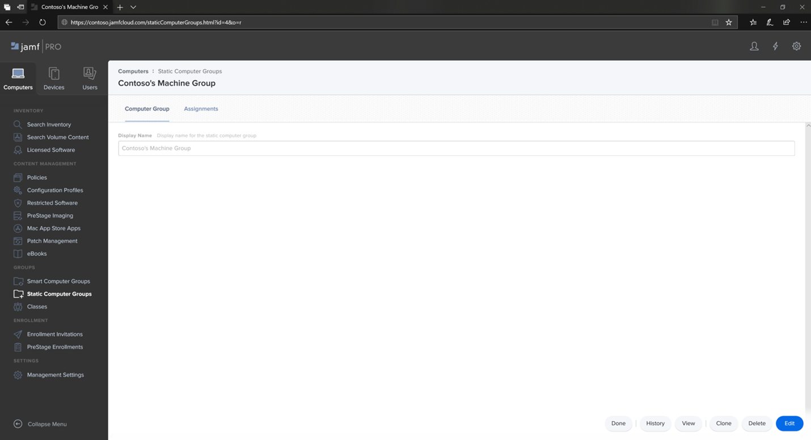
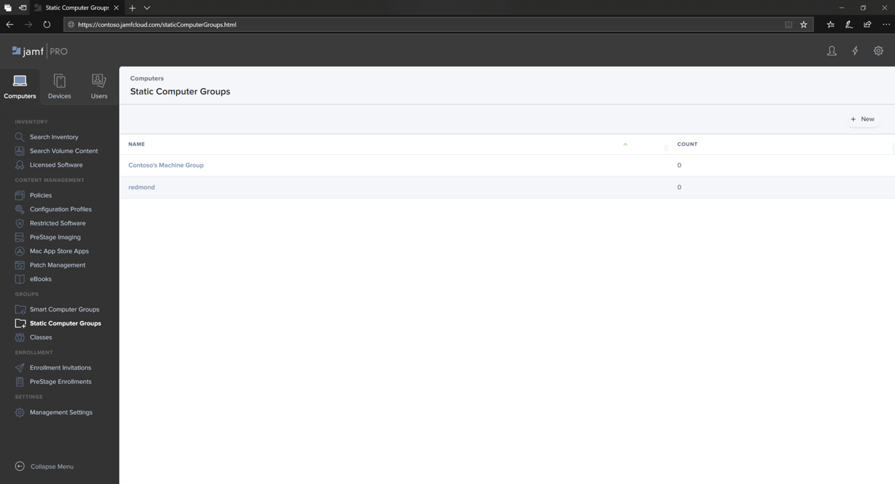

# 在 Jamf Pro 中的 macOS 裝置群組上設定 Microsoft Defender for EndpointSet up Microsoft Defender for Endpoint on macOS device groups in Jamf Pro

[!INCLUDE [Microsoft 365 Defender rebranding](../../includes/microsoft-defender.md)]

**適用於：****Applies to:**
- [適用於端點的 Microsoft DefenderMicrosoft Defender for Endpoint](https://go.microsoft.com/fwlink/p/?linkid=2154037)
- [Microsoft 365 DefenderMicrosoft 365 Defender](https://go.microsoft.com/fwlink/?linkid=2118804)

> 想要體驗 Defender for Endpoint？Want to experience Defender for Endpoint? [註冊免費試用版。Sign up for a free trial.](https://www.microsoft.com/microsoft-365/windows/microsoft-defender-atp?ocid=docs-wdatp-investigateip-abovefoldlink)

設定裝置群組，類似于群組原則組織統一 (Ou) 、Microsoft 端點 Configuration Manager 的裝置集合，以及 Intune 的裝置群組。Set up the device groups similar to Group policy  organizational unite (OUs), Microsoft Endpoint Configuration Manager's device collection, and Intune's device groups.

1. 流覽至 [ **靜態電腦群組**]。Navigate to **Static Computer Groups**.

2. 選取 [ **新增**]。Select **New**. 

    

3. 提供顯示名稱，然後選取 [ **儲存**]。Provide a display name and select **Save**.

    

4. 現在，您會在 [**靜態電腦群組**] 底下看到 **Contoso 的電腦群組**。Now you will see the **Contoso's Machine Group** under **Static Computer Groups**.

    

## 下一步Next step
- [在 Jamf Pro 的 macOS 原則上設定 Microsoft Defender for EndpointSet up Microsoft Defender for Endpoint on macOS policies in Jamf Pro](mac-jamfpro-policies.md)
