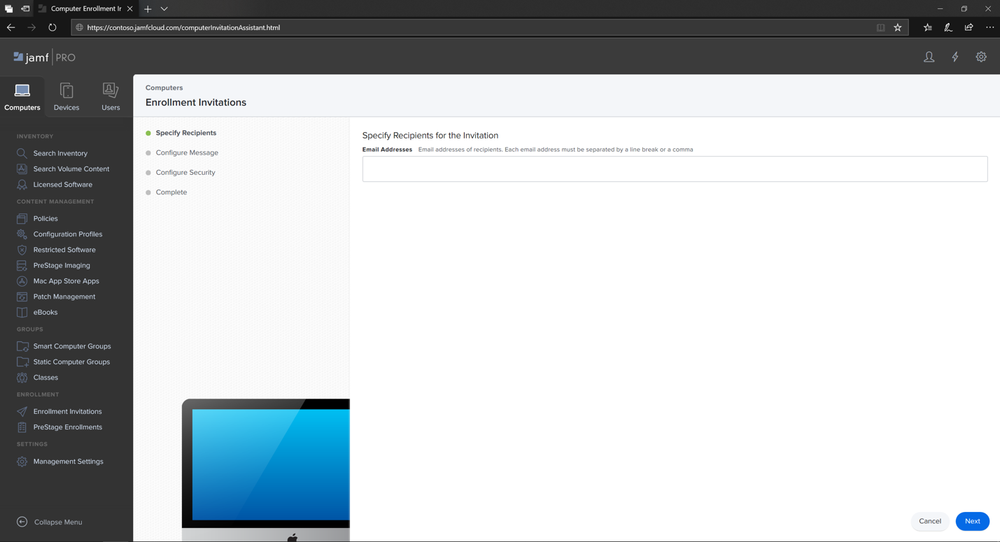
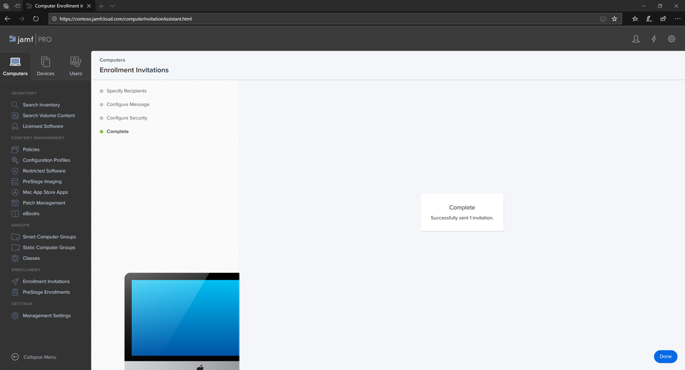

# 在 macOS 裝置上為 Jamf Pro 註冊 Microsoft Defender for Endpoint 

[!INCLUDE [Microsoft 365 Defender rebranding](../../includes/microsoft-defender.md)]

**適用於：**
- [適用於端點的 Microsoft Defender](https://go.microsoft.com/fwlink/p/?linkid=2154037)
- [Microsoft 365 Defender](https://go.microsoft.com/fwlink/?linkid=2118804)

> 想要體驗 Defender for Endpoint？ [註冊免費試用版。](https://www.microsoft.com/microsoft-365/windows/microsoft-defender-atp?ocid=docs-wdatp-investigateip-abovefoldlink)

## 註冊 macOS 裝置

有多種方法可以取得 JamF 的登記。

本文將引導您進行兩種方法：

- [方法1：註冊邀請](#enrollment-method-1-enrollment-invitations)
- [方法2：預備登記](#enrollment-method-2-prestage-enrollments)

如需完整清單，請參閱 [關於電腦註冊](https://docs.jamf.com/9.9/casper-suite/administrator-guide/About_Computer_Enrollment.html)。

## 註冊方法1：註冊邀請

1. 在 Jamf Pro 儀表板中，流覽至 [ **註冊邀請**]。

    

2. 選取 [ **+ 新增**]。

    

3. 在 **[指定邀請** 的收件者] 底下 > 在 [ **電子郵件地址** ] 中，輸入收件者 (es) 的電子郵件地址。

    

    

    例如： janedoe@contoso.com

    

4. 設定邀請的訊息。

    

    

    

    

## 註冊方法2：預備登記

1. 在 Jamf Pro 儀表板中，流覽至 [預先 **安排註冊**]。

    

2. 依照電腦預先加以 [登記](https://docs.jamf.com/9.9/casper-suite/administrator-guide/Computer_PreStage_Enrollments.html)中的指示進行。

## 註冊 macOS 裝置

1. 選取 [ **繼續** ]，然後從 [ **系統偏好** 設定] 視窗中安裝 CA 憑證。

    

2. 安裝 CA 憑證之後，請回到瀏覽器視窗，然後選取 [ **繼續** ] 並安裝 MDM 設定檔。 

    

3. 選取 [ **允許** 從 JAMF 下載]。

    

4. 選取 [ **繼續** ]，繼續執行 MDM 設定檔安裝。 

    

5. 選取 [ **繼續** ] 安裝 MDM 設定檔。

    

6. 選取 [ **繼續**  ] 以完成設定。 

    
