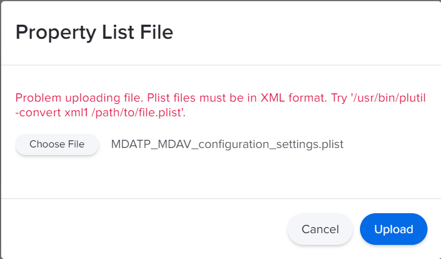
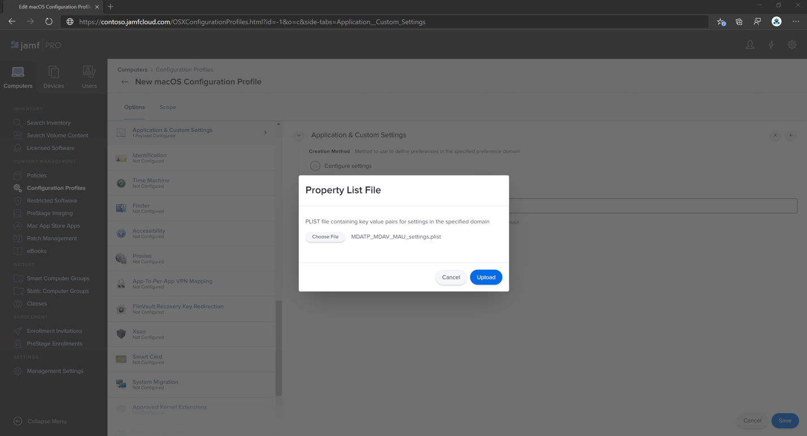
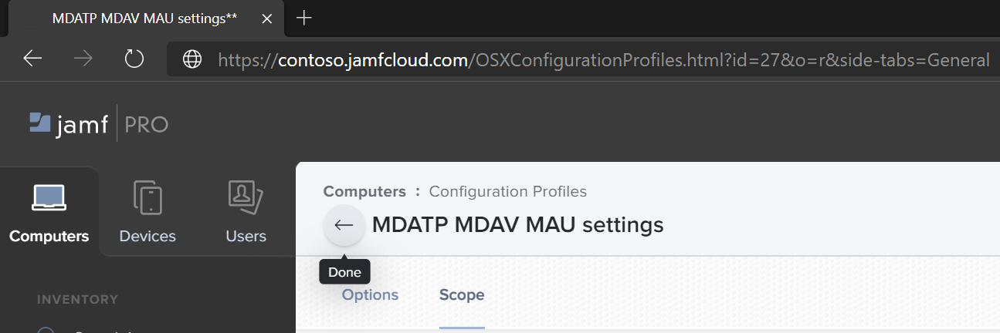
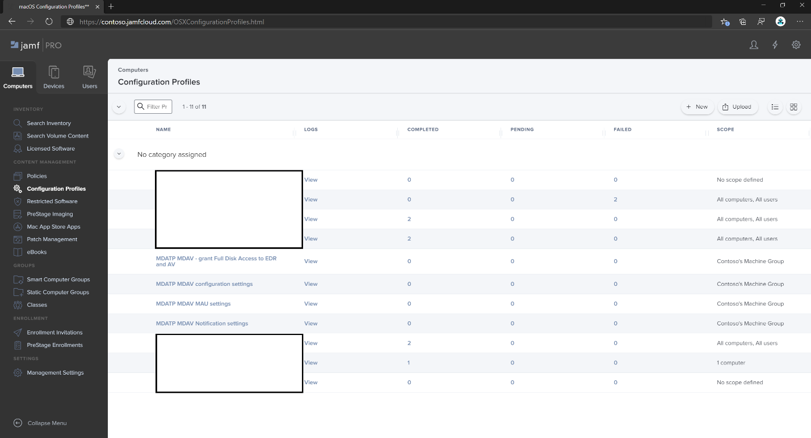
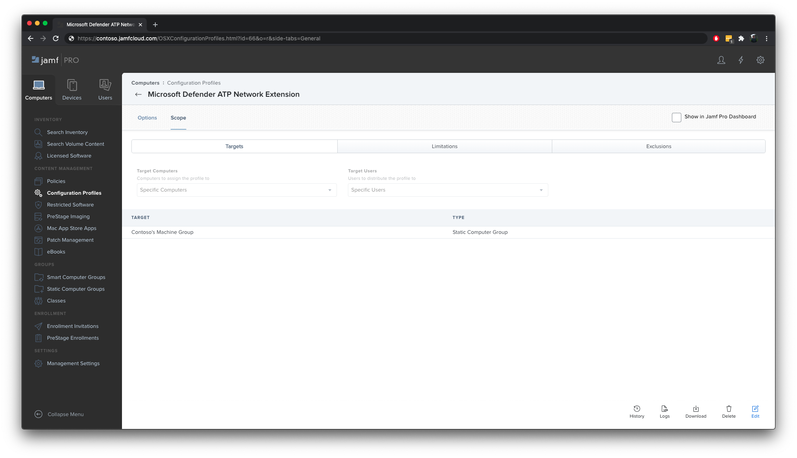
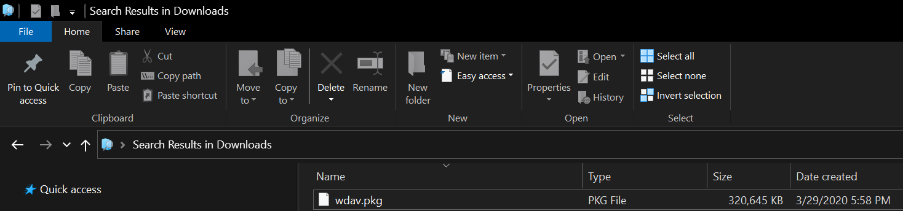

# <a name="set-up-the-microsoft-defender-for-endpoint-for-macos-policies-in-jamf-pro"></a><span data-ttu-id="cf765-104">在 Jamf Pro 中設定 macOS 原則的 Microsoft Defender for Endpoint</span><span class="sxs-lookup"><span data-stu-id="cf765-104">Set up the Microsoft Defender for Endpoint for macOS policies in Jamf Pro</span></span>

[!INCLUDE [Microsoft 365 Defender rebranding](../../includes/microsoft-defender.md)]


<span data-ttu-id="cf765-105">**適用於：**</span><span class="sxs-lookup"><span data-stu-id="cf765-105">**Applies to:**</span></span>

- [<span data-ttu-id="cf765-106">Mac 版端點的 Defender</span><span class="sxs-lookup"><span data-stu-id="cf765-106">Defender for Endpoint for Mac</span></span>](microsoft-defender-endpoint-mac.md)

<span data-ttu-id="cf765-107">此頁面會引導您完成在 Jamf Pro 中設定 macOS 原則所需採取的步驟。</span><span class="sxs-lookup"><span data-stu-id="cf765-107">This page will guide you through the steps you need to take to set up macOS policies in Jamf Pro.</span></span>

<span data-ttu-id="cf765-108">您必須採取下列步驟：</span><span class="sxs-lookup"><span data-stu-id="cf765-108">You'll need to take the following steps:</span></span>

1. [<span data-ttu-id="cf765-109">取得 Microsoft Defender for Endpoint 上架套件</span><span class="sxs-lookup"><span data-stu-id="cf765-109">Get the Microsoft Defender for Endpoint onboarding package</span></span>](#step-1-get-the-microsoft-defender-for-endpoint-onboarding-package)

2. [<span data-ttu-id="cf765-110">使用上架套件在 Jamf Pro 中建立設定檔</span><span class="sxs-lookup"><span data-stu-id="cf765-110">Create a configuration profile in Jamf Pro using the onboarding package</span></span>](#step-2-create-a-configuration-profile-in-jamf-pro-using-the-onboarding-package)

3. [<span data-ttu-id="cf765-111">設定 Microsoft Defender for Endpoint 設定</span><span class="sxs-lookup"><span data-stu-id="cf765-111">Configure Microsoft Defender for Endpoint settings</span></span>](#step-3-configure-microsoft-defender-for-endpoint-settings)

4. [<span data-ttu-id="cf765-112">設定 Microsoft Defender for Endpoint notification 設定</span><span class="sxs-lookup"><span data-stu-id="cf765-112">Configure Microsoft Defender for Endpoint notification settings</span></span>](#step-4-configure-notifications-settings)

5. [<span data-ttu-id="cf765-113">設定 Microsoft AutoUpdate (MAU) </span><span class="sxs-lookup"><span data-stu-id="cf765-113">Configure Microsoft AutoUpdate (MAU)</span></span>](#step-5-configure-microsoft-autoupdate-mau)

6. [<span data-ttu-id="cf765-114">授與 Microsoft Defender for Endpoint 的完整磁片存取權</span><span class="sxs-lookup"><span data-stu-id="cf765-114">Grant full disk access to Microsoft Defender for Endpoint</span></span>](#step-6-grant-full-disk-access-to-microsoft-defender-for-endpoint)

7. [<span data-ttu-id="cf765-115">核准 Microsoft Defender for Endpoint 的內核擴充</span><span class="sxs-lookup"><span data-stu-id="cf765-115">Approve Kernel extension for Microsoft Defender for Endpoint</span></span>](#step-7-approve-kernel-extension-for-microsoft-defender-for-endpoint)

8. [<span data-ttu-id="cf765-116">核准 Microsoft Defender for Endpoint 的系統擴充</span><span class="sxs-lookup"><span data-stu-id="cf765-116">Approve System extensions for Microsoft Defender for Endpoint</span></span>](#step-8-approve-system-extensions-for-microsoft-defender-for-endpoint)

9. [<span data-ttu-id="cf765-117">設定網路擴充</span><span class="sxs-lookup"><span data-stu-id="cf765-117">Configure Network Extension</span></span>](#step-9-configure-network-extension)

10. [<span data-ttu-id="cf765-118">使用 Mac 的 Microsoft Defender 端點排程掃描</span><span class="sxs-lookup"><span data-stu-id="cf765-118">Schedule scans with Microsoft Defender for Endpoint for Mac</span></span>](https://docs.microsoft.com/windows/security/threat-protection/microsoft-defender-atp/mac-schedule-scan-atp)

11. [<span data-ttu-id="cf765-119">為 macOS 部署 Microsoft Defender for Endpoint</span><span class="sxs-lookup"><span data-stu-id="cf765-119">Deploy Microsoft Defender for Endpoint for macOS</span></span>](#step-11-deploy-microsoft-defender-for-endpoint-for-macos)


## <a name="step-1-get-the-microsoft-defender-for-endpoint-onboarding-package"></a><span data-ttu-id="cf765-120">步驟1：取得 Microsoft Defender for Endpoint 上架套件</span><span class="sxs-lookup"><span data-stu-id="cf765-120">Step 1: Get the Microsoft Defender for Endpoint onboarding package</span></span>

1. <span data-ttu-id="cf765-121">在 [Microsoft Defender Security Center](https://securitycenter.microsoft.com )中，流覽至 [ **設定] > 上架**。</span><span class="sxs-lookup"><span data-stu-id="cf765-121">In [Microsoft Defender Security Center](https://securitycenter.microsoft.com ), navigate to **Settings > Onboarding**.</span></span> 

2. <span data-ttu-id="cf765-122">選取 [macOS 為作業系統] 和 [行動裝置管理/Microsoft Intune] 做為部署方法。</span><span class="sxs-lookup"><span data-stu-id="cf765-122">Select macOS as the operating system and Mobile Device Management / Microsoft Intune as the deployment method.</span></span>

    

3. <span data-ttu-id="cf765-124">選取 [ (WindowsDefenderATPOnboardingPackage.zip) **下載上架套件** ]。</span><span class="sxs-lookup"><span data-stu-id="cf765-124">Select **Download onboarding package** (WindowsDefenderATPOnboardingPackage.zip).</span></span>

4. <span data-ttu-id="cf765-125">解壓縮 `WindowsDefenderATPOnboardingPackage.zip` 。</span><span class="sxs-lookup"><span data-stu-id="cf765-125">Extract `WindowsDefenderATPOnboardingPackage.zip`.</span></span>

5. <span data-ttu-id="cf765-126">將檔案複製到您的慣用位置。</span><span class="sxs-lookup"><span data-stu-id="cf765-126">Copy the file to your preferred location.</span></span> <span data-ttu-id="cf765-127">例如，  `C:\Users\JaneDoe_or_JohnDoe.contoso\Downloads\WindowsDefenderATPOnboardingPackage_macOS_MDM_contoso\jamf\WindowsDefenderATPOnboarding.plist`。</span><span class="sxs-lookup"><span data-stu-id="cf765-127">For example,  `C:\Users\JaneDoe_or_JohnDoe.contoso\Downloads\WindowsDefenderATPOnboardingPackage_macOS_MDM_contoso\jamf\WindowsDefenderATPOnboarding.plist`.</span></span>


## <a name="step-2-create-a-configuration-profile-in-jamf-pro-using-the-onboarding-package"></a><span data-ttu-id="cf765-128">步驟2：使用上架套件在 Jamf Pro 中建立設定檔</span><span class="sxs-lookup"><span data-stu-id="cf765-128">Step 2: Create a configuration profile in Jamf Pro using the onboarding package</span></span>

1. <span data-ttu-id="cf765-129">`WindowsDefenderATPOnboarding.plist`從上一節中找出檔。</span><span class="sxs-lookup"><span data-stu-id="cf765-129">Locate the file `WindowsDefenderATPOnboarding.plist` from the previous section.</span></span>

   

 
2. <span data-ttu-id="cf765-131">在 Jamf Pro 儀表板中，選取 [ **新增**]。</span><span class="sxs-lookup"><span data-stu-id="cf765-131">In the Jamf Pro dashboard, select **New**.</span></span>

    

3. <span data-ttu-id="cf765-133">輸入下列詳細資料：</span><span class="sxs-lookup"><span data-stu-id="cf765-133">Enter the following details:</span></span>

   <span data-ttu-id="cf765-134">**一般**</span><span class="sxs-lookup"><span data-stu-id="cf765-134">**General**</span></span>
   - <span data-ttu-id="cf765-135">名稱： MDATP 上架 macOS</span><span class="sxs-lookup"><span data-stu-id="cf765-135">Name: MDATP onboarding for macOS</span></span>
   - <span data-ttu-id="cf765-136">描述： macOS 的 MDATP EDR 上架</span><span class="sxs-lookup"><span data-stu-id="cf765-136">Description: MDATP EDR onboarding for macOS</span></span>
   - <span data-ttu-id="cf765-137">類別：無</span><span class="sxs-lookup"><span data-stu-id="cf765-137">Category: None</span></span>
   - <span data-ttu-id="cf765-138">分配方法：自動安裝</span><span class="sxs-lookup"><span data-stu-id="cf765-138">Distribution Method: Install Automatically</span></span>
   - <span data-ttu-id="cf765-139">層級：電腦層級</span><span class="sxs-lookup"><span data-stu-id="cf765-139">Level: Computer Level</span></span>

4. <span data-ttu-id="cf765-140">在 **應用程式 & 自訂設定** 中，選取 [ **設定**]。</span><span class="sxs-lookup"><span data-stu-id="cf765-140">In **Application & Custom Settings** select **Configure**.</span></span>

    

5. <span data-ttu-id="cf765-142">選取 **[ (PLIST 檔案) 上傳** 檔案]，然後在 [ **喜好設定功能變數名稱** ] 中輸入： `com.microsoft.wdav.atp` 。</span><span class="sxs-lookup"><span data-stu-id="cf765-142">Select **Upload File (PLIST file)** then in **Preference Domain** enter: `com.microsoft.wdav.atp`.</span></span> 

    

    

7. <span data-ttu-id="cf765-145">選取 [ **開啟** ]，然後選取上架檔案。</span><span class="sxs-lookup"><span data-stu-id="cf765-145">Select **Open** and select the onboarding file.</span></span>

    

8. <span data-ttu-id="cf765-147">選取 **[上傳**]。</span><span class="sxs-lookup"><span data-stu-id="cf765-147">Select **Upload**.</span></span> 

    


9. <span data-ttu-id="cf765-149">選取 [ **範圍** ] 索引標籤。</span><span class="sxs-lookup"><span data-stu-id="cf765-149">Select the **Scope** tab.</span></span>

    ![範圍] 索引標籤的影像](images/jamfpro-scope-tab.png)

10. <span data-ttu-id="cf765-151">選取目的電腦。</span><span class="sxs-lookup"><span data-stu-id="cf765-151">Select the target computers.</span></span>

    

     

11. <span data-ttu-id="cf765-154">選取 **[儲存]**。</span><span class="sxs-lookup"><span data-stu-id="cf765-154">Select **Save**.</span></span>

    

    

12. <span data-ttu-id="cf765-157">選取 **[完成]**。</span><span class="sxs-lookup"><span data-stu-id="cf765-157">Select **Done**.</span></span>

    

    

## <a name="step-3-configure-microsoft-defender-for-endpoint-settings"></a><span data-ttu-id="cf765-160">步驟3：設定 Microsoft Defender for Endpoint 設定</span><span class="sxs-lookup"><span data-stu-id="cf765-160">Step 3: Configure Microsoft Defender for Endpoint settings</span></span>

1.  <span data-ttu-id="cf765-161">使用下列 Microsoft Defender for Endpoint configuration 設定：</span><span class="sxs-lookup"><span data-stu-id="cf765-161">Use the following Microsoft Defender for Endpoint configuration settings:</span></span>

    - <span data-ttu-id="cf765-162">enableRealTimeProtection</span><span class="sxs-lookup"><span data-stu-id="cf765-162">enableRealTimeProtection</span></span>
    - <span data-ttu-id="cf765-163">passiveMode</span><span class="sxs-lookup"><span data-stu-id="cf765-163">passiveMode</span></span>
    
    >[!NOTE]
    ><span data-ttu-id="cf765-164">預設未開啟，如果您打算為 macOS 執行協力廠商 AV，請將其設為 `true` 。</span><span class="sxs-lookup"><span data-stu-id="cf765-164">Not turned on by default, if you are planning to run a third-party AV for macOS, set it to `true`.</span></span>

    - <span data-ttu-id="cf765-165">排除</span><span class="sxs-lookup"><span data-stu-id="cf765-165">exclusions</span></span>
    - <span data-ttu-id="cf765-166">excludedPath</span><span class="sxs-lookup"><span data-stu-id="cf765-166">excludedPath</span></span>
    - <span data-ttu-id="cf765-167">excludedFileExtension</span><span class="sxs-lookup"><span data-stu-id="cf765-167">excludedFileExtension</span></span>
    - <span data-ttu-id="cf765-168">excludedFileName</span><span class="sxs-lookup"><span data-stu-id="cf765-168">excludedFileName</span></span>
    - <span data-ttu-id="cf765-169">exclusionsMergePolicy</span><span class="sxs-lookup"><span data-stu-id="cf765-169">exclusionsMergePolicy</span></span>
    - <span data-ttu-id="cf765-170">allowedThreats</span><span class="sxs-lookup"><span data-stu-id="cf765-170">allowedThreats</span></span>
    
    >[!NOTE]
    ><span data-ttu-id="cf765-171">EICAR.TXT 位於範例上，如果您想要透過概念證明，請將它移除，尤其是在您測試 EICAR.TXT 時。</span><span class="sxs-lookup"><span data-stu-id="cf765-171">EICAR is on the sample, if you are going through a proof-of-concept, remove it especially if you are testing EICAR.</span></span>
        
    - <span data-ttu-id="cf765-172">disallowedThreatActions</span><span class="sxs-lookup"><span data-stu-id="cf765-172">disallowedThreatActions</span></span>
    - <span data-ttu-id="cf765-173">potentially_unwanted_application</span><span class="sxs-lookup"><span data-stu-id="cf765-173">potentially_unwanted_application</span></span>
    - <span data-ttu-id="cf765-174">archive_bomb</span><span class="sxs-lookup"><span data-stu-id="cf765-174">archive_bomb</span></span>
    - <span data-ttu-id="cf765-175">cloudService</span><span class="sxs-lookup"><span data-stu-id="cf765-175">cloudService</span></span>
    - <span data-ttu-id="cf765-176">automaticSampleSubmission</span><span class="sxs-lookup"><span data-stu-id="cf765-176">automaticSampleSubmission</span></span>
    - <span data-ttu-id="cf765-177">標籤</span><span class="sxs-lookup"><span data-stu-id="cf765-177">tags</span></span>
    - <span data-ttu-id="cf765-178">hideStatusMenuIcon</span><span class="sxs-lookup"><span data-stu-id="cf765-178">hideStatusMenuIcon</span></span>
    
     <span data-ttu-id="cf765-179">如需詳細資訊，請參閱 [Jamf 設定檔的屬性清單](mac-preferences.md#property-list-for-jamf-configuration-profile)。</span><span class="sxs-lookup"><span data-stu-id="cf765-179">For information, see [Property list for Jamf configuration profile](mac-preferences.md#property-list-for-jamf-configuration-profile).</span></span>

     ```XML
     <?xml version="1.0" encoding="UTF-8"?>
     <!DOCTYPE plist PUBLIC "-//Apple//DTD PLIST 1.0//EN" "http://www.apple.com/DTDs/PropertyList-1.0.dtd">
     <plist version="1.0">
     <dict>
         <key>antivirusEngine</key>
         <dict>
             <key>enableRealTimeProtection</key>
             <true/>
             <key>passiveMode</key>
             <false/>
             <key>exclusions</key>
             <array>
                 <dict>
                     <key>$type</key>
                     <string>excludedPath</string>
                     <key>isDirectory</key>
                     <false/>
                     <key>path</key>
                     <string>/var/log/system.log</string>
                 </dict>
                 <dict>
                     <key>$type</key>
                     <string>excludedPath</string>
                     <key>isDirectory</key>
                     <true/>
                     <key>path</key>
                     <string>/home</string>
                 </dict>
                 <dict>
                     <key>$type</key>
                     <string>excludedFileExtension</string>
                     <key>extension</key>
                     <string>pdf</string>
                 </dict>
                 <dict>
                     <key>$type</key>
                     <string>excludedFileName</string>
                     <key>name</key>
                     <string>cat</string>
                 </dict>
             </array>
             <key>exclusionsMergePolicy</key>
             <string>merge</string>
             <key>allowedThreats</key>
             <array>
                 <string>EICAR-Test-File (not a virus)</string>
             </array>
             <key>disallowedThreatActions</key>
             <array>
                 <string>allow</string>
                 <string>restore</string>
             </array>
             <key>threatTypeSettings</key>
             <array>
                 <dict>
                     <key>key</key>
                     <string>potentially_unwanted_application</string>
                     <key>value</key>
                     <string>block</string>
                 </dict>
                 <dict>
                     <key>key</key>
                     <string>archive_bomb</string>
                     <key>value</key>
                     <string>audit</string>
                 </dict>
             </array>
             <key>threatTypeSettingsMergePolicy</key>
             <string>merge</string>
         </dict>
         <key>cloudService</key>
         <dict>
             <key>enabled</key>
             <true/>
             <key>diagnosticLevel</key>
             <string>optional</string>
             <key>automaticSampleSubmission</key>
             <true/>
         </dict>
         <key>edr</key>
         <dict>
             <key>tags</key>
             <array>
                 <dict>
                     <key>key</key>
                     <string>GROUP</string>
                     <key>value</key>
                     <string>ExampleTag</string>
                 </dict>
             </array>
         </dict>
         <key>userInterface</key>
         <dict>
             <key>hideStatusMenuIcon</key>
             <false/>
         </dict>
     </dict>
     </plist>
     ```

2. <span data-ttu-id="cf765-180">將檔案儲存為 `MDATP_MDAV_configuration_settings.plist` 。</span><span class="sxs-lookup"><span data-stu-id="cf765-180">Save the file as `MDATP_MDAV_configuration_settings.plist`.</span></span>


3.  <span data-ttu-id="cf765-181">在 Jamf Pro 儀表板中，選取 **[一般**]。</span><span class="sxs-lookup"><span data-stu-id="cf765-181">In the Jamf Pro dashboard, select **General**.</span></span>

    

4. <span data-ttu-id="cf765-183">輸入下列詳細資料：</span><span class="sxs-lookup"><span data-stu-id="cf765-183">Enter the following details:</span></span>

    <span data-ttu-id="cf765-184">**一般**</span><span class="sxs-lookup"><span data-stu-id="cf765-184">**General**</span></span>
    
    - <span data-ttu-id="cf765-185">名稱： MDATP MDAV 設定設定</span><span class="sxs-lookup"><span data-stu-id="cf765-185">Name: MDATP MDAV configuration settings</span></span>
    - <span data-ttu-id="cf765-186">描述：\<blank\></span><span class="sxs-lookup"><span data-stu-id="cf765-186">Description:\<blank\></span></span>
    - <span data-ttu-id="cf765-187">類別：無 (預設) </span><span class="sxs-lookup"><span data-stu-id="cf765-187">Category: None (default)</span></span>
    - <span data-ttu-id="cf765-188">分配方法：自動安裝 (預設) </span><span class="sxs-lookup"><span data-stu-id="cf765-188">Distribution Method: Install Automatically(default)</span></span>
    - <span data-ttu-id="cf765-189">層級：電腦層級 (預設) </span><span class="sxs-lookup"><span data-stu-id="cf765-189">Level: Computer Level(default)</span></span>

    

5. <span data-ttu-id="cf765-191">在 **應用程式 & 自訂設定** 中，選取 [ **設定**]。</span><span class="sxs-lookup"><span data-stu-id="cf765-191">In **Application & Custom Settings** select **Configure**.</span></span>

    

6. <span data-ttu-id="cf765-193">選取 **[上傳檔案 (PLIST** 檔案]) 。</span><span class="sxs-lookup"><span data-stu-id="cf765-193">Select **Upload File (PLIST file)**.</span></span>

    

7. <span data-ttu-id="cf765-195">在 [ **喜好設定網域**] 中，輸入 `com.microsoft.wdav` ，然後選取  **[上傳 PLIST** 檔案]。</span><span class="sxs-lookup"><span data-stu-id="cf765-195">In **Preferences Domain**, enter `com.microsoft.wdav`, then select  **Upload PLIST File**.</span></span>

    

8. <span data-ttu-id="cf765-197">選取 **[選擇檔**]。</span><span class="sxs-lookup"><span data-stu-id="cf765-197">Select **Choose File**.</span></span>

    ![設定的配置圖像選擇 [檔案]](images/526e978761fc571cca06907da7b01fd6.png)

9. <span data-ttu-id="cf765-199">選取 **MDATP_MDAV_configuration_settings plist**，然後選取 [ **開啟**]。</span><span class="sxs-lookup"><span data-stu-id="cf765-199">Select the **MDATP_MDAV_configuration_settings.plist**, then select **Open**.</span></span>

    

10. <span data-ttu-id="cf765-201">選取 **[上傳**]。</span><span class="sxs-lookup"><span data-stu-id="cf765-201">Select **Upload**.</span></span>

    

    

    >[!NOTE]
    ><span data-ttu-id="cf765-204">如果您要上傳 Intune 檔案，您會收到下列錯誤：</span><span class="sxs-lookup"><span data-stu-id="cf765-204">If you happen to upload the Intune file, you'll get the following error:</span></span><br>
    ><span data-ttu-id="cf765-205"></span><span class="sxs-lookup"><span data-stu-id="cf765-205"></span></span>


11. <span data-ttu-id="cf765-206">選取 **[儲存]**。</span><span class="sxs-lookup"><span data-stu-id="cf765-206">Select **Save**.</span></span> 

    

12. <span data-ttu-id="cf765-208">檔案上傳。</span><span class="sxs-lookup"><span data-stu-id="cf765-208">The file is uploaded.</span></span>

    

    

13. <span data-ttu-id="cf765-211">選取 [ **範圍** ] 索引標籤。</span><span class="sxs-lookup"><span data-stu-id="cf765-211">Select the **Scope** tab.</span></span>

    

14. <span data-ttu-id="cf765-213">選取 [ **Contoso 的電腦群組**]。</span><span class="sxs-lookup"><span data-stu-id="cf765-213">Select **Contoso's Machine Group**.</span></span> 

15. <span data-ttu-id="cf765-214">選取 [ **新增**]，然後選取 [ **儲存**]。</span><span class="sxs-lookup"><span data-stu-id="cf765-214">Select **Add**, then select **Save**.</span></span>

    

    

16. <span data-ttu-id="cf765-217">選取 **[完成]**。</span><span class="sxs-lookup"><span data-stu-id="cf765-217">Select **Done**.</span></span> <span data-ttu-id="cf765-218">您將會看到新的設定 **設定檔**。</span><span class="sxs-lookup"><span data-stu-id="cf765-218">You'll see the new **Configuration profile**.</span></span>

    


## <a name="step-4-configure-notifications-settings"></a><span data-ttu-id="cf765-220">步驟4：設定通知設定</span><span class="sxs-lookup"><span data-stu-id="cf765-220">Step 4: Configure notifications settings</span></span>

<span data-ttu-id="cf765-221">這些步驟適用于 macOS 10.15 (Catalina) 或更新版本。</span><span class="sxs-lookup"><span data-stu-id="cf765-221">These steps are applicable of macOS 10.15 (Catalina) or newer.</span></span>

1. <span data-ttu-id="cf765-222">`notif.mobileconfig`從[我們的 GitHub 存放庫](https://raw.githubusercontent.com/microsoft/mdatp-xplat/master/macos/mobileconfig/profiles/notif.mobileconfig)下載</span><span class="sxs-lookup"><span data-stu-id="cf765-222">Download `notif.mobileconfig` from [our GitHub repository](https://raw.githubusercontent.com/microsoft/mdatp-xplat/master/macos/mobileconfig/profiles/notif.mobileconfig)</span></span>

2. <span data-ttu-id="cf765-223">將其儲存為 `MDATP_MDAV_notification_settings.plist` 。</span><span class="sxs-lookup"><span data-stu-id="cf765-223">Save it as `MDATP_MDAV_notification_settings.plist`.</span></span>

3. <span data-ttu-id="cf765-224">在 Jamf Pro 儀表板中，選取 **[一般**]。</span><span class="sxs-lookup"><span data-stu-id="cf765-224">In the Jamf Pro dashboard, select **General**.</span></span> 
       
4. <span data-ttu-id="cf765-225">輸入下列詳細資料：</span><span class="sxs-lookup"><span data-stu-id="cf765-225">Enter the following details:</span></span>

    <span data-ttu-id="cf765-226">**一般**</span><span class="sxs-lookup"><span data-stu-id="cf765-226">**General**</span></span> 
    
    - <span data-ttu-id="cf765-227">名稱： MDATP MDAV 通知設定</span><span class="sxs-lookup"><span data-stu-id="cf765-227">Name: MDATP MDAV Notification settings</span></span>
    - <span data-ttu-id="cf765-228">描述： macOS 10.15 (Catalina) 或更新版本</span><span class="sxs-lookup"><span data-stu-id="cf765-228">Description: macOS 10.15 (Catalina) or newer</span></span>
    - <span data-ttu-id="cf765-229">類別：無 (預設) </span><span class="sxs-lookup"><span data-stu-id="cf765-229">Category: None (default)</span></span>
    - <span data-ttu-id="cf765-230">分配方法：自動安裝 (預設) </span><span class="sxs-lookup"><span data-stu-id="cf765-230">Distribution Method: Install Automatically(default)</span></span>
    - <span data-ttu-id="cf765-231">層級：電腦層級 (預設) </span><span class="sxs-lookup"><span data-stu-id="cf765-231">Level: Computer Level(default)</span></span>

    


5. <span data-ttu-id="cf765-233">選取 **[上傳檔案 (PLIST** 檔案]) 。</span><span class="sxs-lookup"><span data-stu-id="cf765-233">Select **Upload File (PLIST file)**.</span></span>

    
 

6. <span data-ttu-id="cf765-235">選取 **[選擇** 檔案  >  **MDATP_MDAV_Notification_Settings。 plist**]。</span><span class="sxs-lookup"><span data-stu-id="cf765-235">Select **Choose File** > **MDATP_MDAV_Notification_Settings.plist**.</span></span>


    


    

7. <span data-ttu-id="cf765-238">選取  >  **[開啟上傳**]。</span><span class="sxs-lookup"><span data-stu-id="cf765-238">Select **Open** > **Upload**.</span></span>

    


    

8. <span data-ttu-id="cf765-241">選取 [ **範圍** ] 索引標籤，然後選取 [ **新增**]。</span><span class="sxs-lookup"><span data-stu-id="cf765-241">Select the **Scope** tab, then select **Add**.</span></span>

    


9. <span data-ttu-id="cf765-243">選取 [ **Contoso 的電腦群組**]。</span><span class="sxs-lookup"><span data-stu-id="cf765-243">Select **Contoso's Machine Group**.</span></span> 

10. <span data-ttu-id="cf765-244">選取 [ **新增**]，然後選取 [ **儲存**]。</span><span class="sxs-lookup"><span data-stu-id="cf765-244">Select **Add**, then select **Save**.</span></span>
    
    

    
    

11. <span data-ttu-id="cf765-247">選取 **[完成]**。</span><span class="sxs-lookup"><span data-stu-id="cf765-247">Select **Done**.</span></span> <span data-ttu-id="cf765-248">您將會看到新的設定 **設定檔**。</span><span class="sxs-lookup"><span data-stu-id="cf765-248">You'll see the new **Configuration profile**.</span></span>
    <span data-ttu-id="cf765-249"></span><span class="sxs-lookup"><span data-stu-id="cf765-249"></span></span>

## <a name="step-5-configure-microsoft-autoupdate-mau"></a><span data-ttu-id="cf765-250">步驟5：設定 Microsoft AutoUpdate (MAU) </span><span class="sxs-lookup"><span data-stu-id="cf765-250">Step 5: Configure Microsoft AutoUpdate (MAU)</span></span>

1. <span data-ttu-id="cf765-251">使用下列 Microsoft Defender for Endpoint configuration 設定：</span><span class="sxs-lookup"><span data-stu-id="cf765-251">Use the following Microsoft Defender for Endpoint configuration settings:</span></span>

      ```XML
   <?xml version="1.0" encoding="UTF-8"?>
   <!DOCTYPE plist PUBLIC "-//Apple//DTD PLIST 1.0//EN" "http://www.apple.com/DTDs/PropertyList-1.0.dtd">
   <plist version="1.0">
   <dict>
    <key>ChannelName</key>
    <string>Current</string>
    <key>HowToCheck</key>
    <string>AutomaticDownload</string>
    <key>EnableCheckForUpdatesButton</key>
    <true/>
    <key>DisableInsiderCheckbox</key>
    <false/>
    <key>SendAllTelemetryEnabled</key>
    <true/>
   </dict>
   </plist>
   ```

2. <span data-ttu-id="cf765-252">將其儲存為 `MDATP_MDAV_MAU_settings.plist` 。</span><span class="sxs-lookup"><span data-stu-id="cf765-252">Save it as `MDATP_MDAV_MAU_settings.plist`.</span></span>

3. <span data-ttu-id="cf765-253">在 Jamf Pro 儀表板中，選取 **[一般**]。</span><span class="sxs-lookup"><span data-stu-id="cf765-253">In the Jamf Pro dashboard, select **General**.</span></span> 

    

4. <span data-ttu-id="cf765-255">輸入下列詳細資料：</span><span class="sxs-lookup"><span data-stu-id="cf765-255">Enter the following details:</span></span>

    <span data-ttu-id="cf765-256">**一般**</span><span class="sxs-lookup"><span data-stu-id="cf765-256">**General**</span></span> 
    
    - <span data-ttu-id="cf765-257">名稱： MDATP MDAV MAU 設定</span><span class="sxs-lookup"><span data-stu-id="cf765-257">Name: MDATP MDAV MAU settings</span></span>
    - <span data-ttu-id="cf765-258">描述： macOS 的 MDATP 的 Microsoft AutoUpdate 設定</span><span class="sxs-lookup"><span data-stu-id="cf765-258">Description: Microsoft AutoUpdate settings for MDATP for macOS</span></span>
    - <span data-ttu-id="cf765-259">類別：無 (預設) </span><span class="sxs-lookup"><span data-stu-id="cf765-259">Category: None (default)</span></span>
    - <span data-ttu-id="cf765-260">分配方法：自動安裝 (預設) </span><span class="sxs-lookup"><span data-stu-id="cf765-260">Distribution Method: Install Automatically(default)</span></span>
    - <span data-ttu-id="cf765-261">層級：電腦層級 (預設) </span><span class="sxs-lookup"><span data-stu-id="cf765-261">Level: Computer Level(default)</span></span>

5. <span data-ttu-id="cf765-262">在 **應用程式 & 自訂設定** 中，選取 [ **設定**]。</span><span class="sxs-lookup"><span data-stu-id="cf765-262">In **Application & Custom Settings** select **Configure**.</span></span>

    

6. <span data-ttu-id="cf765-264">選取 **[上傳檔案 (PLIST** 檔案]) 。</span><span class="sxs-lookup"><span data-stu-id="cf765-264">Select **Upload File (PLIST file)**.</span></span>

      

7. <span data-ttu-id="cf765-266">在 [ **喜好設定網域** ] 中輸入： `com.microsoft.autoupdate2` ，然後選取 **[上傳 PLIST** 檔案]。</span><span class="sxs-lookup"><span data-stu-id="cf765-266">In **Preference Domain** enter: `com.microsoft.autoupdate2`, then select **Upload PLIST File**.</span></span>

    

8. <span data-ttu-id="cf765-268">選取 **[選擇檔**]。</span><span class="sxs-lookup"><span data-stu-id="cf765-268">Select **Choose File**.</span></span>

    

9. <span data-ttu-id="cf765-270">選取 **MDATP_MDAV_MAU_settings plist**。</span><span class="sxs-lookup"><span data-stu-id="cf765-270">Select **MDATP_MDAV_MAU_settings.plist**.</span></span>

    

10. <span data-ttu-id="cf765-272">選取 **[上傳**]。</span><span class="sxs-lookup"><span data-stu-id="cf765-272">Select **Upload**.</span></span>
    <span data-ttu-id="cf765-273"></span><span class="sxs-lookup"><span data-stu-id="cf765-273"></span></span>

    

11. <span data-ttu-id="cf765-275">選取 **[儲存]**。</span><span class="sxs-lookup"><span data-stu-id="cf765-275">Select **Save**.</span></span>

    

12. <span data-ttu-id="cf765-277">選取 [ **範圍** ] 索引標籤。</span><span class="sxs-lookup"><span data-stu-id="cf765-277">Select the **Scope** tab.</span></span>
   
     

13. <span data-ttu-id="cf765-279">選取 [新增]。</span><span class="sxs-lookup"><span data-stu-id="cf765-279">Select **Add**.</span></span>
    
    

    

    

14. <span data-ttu-id="cf765-283">選取 **[完成]**。</span><span class="sxs-lookup"><span data-stu-id="cf765-283">Select **Done**.</span></span>
    
    

## <a name="step-6-grant-full-disk-access-to-microsoft-defender-for-endpoint"></a><span data-ttu-id="cf765-285">步驟6：授與 Microsoft Defender for Endpoint 的完整磁片存取權</span><span class="sxs-lookup"><span data-stu-id="cf765-285">Step 6: Grant full disk access to Microsoft Defender for Endpoint</span></span>

1. <span data-ttu-id="cf765-286">在 Jamf Pro 儀表板中，選取 [設定 **設定檔**]。</span><span class="sxs-lookup"><span data-stu-id="cf765-286">In the Jamf Pro dashboard, select **Configuration Profiles**.</span></span>

    

2. <span data-ttu-id="cf765-288">選取 [ **+ 新增**]。</span><span class="sxs-lookup"><span data-stu-id="cf765-288">Select **+ New**.</span></span> 

3. <span data-ttu-id="cf765-289">輸入下列詳細資料：</span><span class="sxs-lookup"><span data-stu-id="cf765-289">Enter the following details:</span></span>

    <span data-ttu-id="cf765-290">**一般**</span><span class="sxs-lookup"><span data-stu-id="cf765-290">**General**</span></span> 
    - <span data-ttu-id="cf765-291">名稱： MDATP MDAV-對 EDR 和 AV 授與完整磁片存取權</span><span class="sxs-lookup"><span data-stu-id="cf765-291">Name: MDATP MDAV - grant Full Disk Access to EDR and AV</span></span>
    - <span data-ttu-id="cf765-292">描述：在 macOS Catalina 或更新版本上，新增隱私權偏好設定原則控制</span><span class="sxs-lookup"><span data-stu-id="cf765-292">Description: On macOS Catalina or newer, the new Privacy Preferences Policy Control</span></span>
    - <span data-ttu-id="cf765-293">類別：無</span><span class="sxs-lookup"><span data-stu-id="cf765-293">Category: None</span></span>
    - <span data-ttu-id="cf765-294">分配方法：自動安裝</span><span class="sxs-lookup"><span data-stu-id="cf765-294">Distribution method: Install Automatically</span></span>
    - <span data-ttu-id="cf765-295">層級：電腦層級</span><span class="sxs-lookup"><span data-stu-id="cf765-295">Level: Computer level</span></span>


    

4. <span data-ttu-id="cf765-297">在 [ **設定隱私權偏好設定原則控制** ] 中，選取 [ **設定**]。</span><span class="sxs-lookup"><span data-stu-id="cf765-297">In **Configure Privacy Preferences Policy Control** select **Configure**.</span></span>

    

5. <span data-ttu-id="cf765-299">在 [ **隱私權偏好設定原則**] 中，輸入下列詳細資料：</span><span class="sxs-lookup"><span data-stu-id="cf765-299">In **Privacy Preferences Policy Control**, enter the following details:</span></span>

    - <span data-ttu-id="cf765-300">識別碼： `com.microsoft.wdav`</span><span class="sxs-lookup"><span data-stu-id="cf765-300">Identifier: `com.microsoft.wdav`</span></span>
    - <span data-ttu-id="cf765-301">識別碼類型：束識別碼</span><span class="sxs-lookup"><span data-stu-id="cf765-301">Identifier Type: Bundle ID</span></span>
    - <span data-ttu-id="cf765-302">程式碼需求： `identifier "com.microsoft.wdav" and anchor apple generic and certificate 1[field.1.2.840.113635.100.6.2.6] /* exists */ and certificate leaf[field.1.2.840.113635.100.6.1.13] /* exists */ and certificate leaf[subject.OU] = UBF8T346G9`</span><span class="sxs-lookup"><span data-stu-id="cf765-302">Code Requirement: `identifier "com.microsoft.wdav" and anchor apple generic and certificate 1[field.1.2.840.113635.100.6.2.6] /* exists */ and certificate leaf[field.1.2.840.113635.100.6.1.13] /* exists */ and certificate leaf[subject.OU] = UBF8T346G9`</span></span>


    

6. <span data-ttu-id="cf765-304">選取 **[+ 新增]**。</span><span class="sxs-lookup"><span data-stu-id="cf765-304">Select **+ Add**.</span></span>

    

    - <span data-ttu-id="cf765-306">在應用程式或服務中：設定為 **SystemPolicyAllFiles**</span><span class="sxs-lookup"><span data-stu-id="cf765-306">Under App or service: Set to **SystemPolicyAllFiles**</span></span>

    - <span data-ttu-id="cf765-307">在 [access] 底下：設定為 **允許**</span><span class="sxs-lookup"><span data-stu-id="cf765-307">Under "access": Set to **Allow**</span></span>

7. <span data-ttu-id="cf765-308">選取 [ **儲存** (]，而不是位於右下方) 。</span><span class="sxs-lookup"><span data-stu-id="cf765-308">Select **Save** (not the one at the bottom right).</span></span>

    

8. <span data-ttu-id="cf765-310">按一下 [ `+` **應用程式存取** ] 旁的符號，以加入新的專案。</span><span class="sxs-lookup"><span data-stu-id="cf765-310">Click the `+` sign next to **App Access** to add a new entry.</span></span>

    

9. <span data-ttu-id="cf765-312">輸入下列詳細資料：</span><span class="sxs-lookup"><span data-stu-id="cf765-312">Enter the following details:</span></span>

    - <span data-ttu-id="cf765-313">識別碼： `com.microsoft.wdav.epsext`</span><span class="sxs-lookup"><span data-stu-id="cf765-313">Identifier: `com.microsoft.wdav.epsext`</span></span>
    - <span data-ttu-id="cf765-314">識別碼類型：束識別碼</span><span class="sxs-lookup"><span data-stu-id="cf765-314">Identifier Type: Bundle ID</span></span>
    - <span data-ttu-id="cf765-315">程式碼需求： `identifier "com.microsoft.wdav.epsext" and anchor apple generic and certificate 1[field.1.2.840.113635.100.6.2.6] /* exists */ and certificate leaf[field.1.2.840.113635.100.6.1.13] /* exists */ and certificate leaf[subject.OU] = UBF8T346G9`</span><span class="sxs-lookup"><span data-stu-id="cf765-315">Code Requirement: `identifier "com.microsoft.wdav.epsext" and anchor apple generic and certificate 1[field.1.2.840.113635.100.6.2.6] /* exists */ and certificate leaf[field.1.2.840.113635.100.6.1.13] /* exists */ and certificate leaf[subject.OU] = UBF8T346G9`</span></span>

10. <span data-ttu-id="cf765-316">選取 **[+ 新增]**。</span><span class="sxs-lookup"><span data-stu-id="cf765-316">Select **+ Add**.</span></span>

    

    - <span data-ttu-id="cf765-318">在應用程式或服務中：設定為 **SystemPolicyAllFiles**</span><span class="sxs-lookup"><span data-stu-id="cf765-318">Under App or service: Set to **SystemPolicyAllFiles**</span></span>

    - <span data-ttu-id="cf765-319">在 [access] 底下：設定為 **允許**</span><span class="sxs-lookup"><span data-stu-id="cf765-319">Under "access": Set to **Allow**</span></span>

11. <span data-ttu-id="cf765-320">選取 [ **儲存** (]，而不是位於右下方) 。</span><span class="sxs-lookup"><span data-stu-id="cf765-320">Select **Save** (not the one at the bottom right).</span></span>

    

12. <span data-ttu-id="cf765-322">選取 [ **範圍** ] 索引標籤。</span><span class="sxs-lookup"><span data-stu-id="cf765-322">Select the **Scope** tab.</span></span>

    

13. <span data-ttu-id="cf765-324">選取 **[+ 新增]**。</span><span class="sxs-lookup"><span data-stu-id="cf765-324">Select **+ Add**.</span></span>

    

14. <span data-ttu-id="cf765-326">選取 [>**群組名稱**] 下的 [**電腦群組**] > 選取 [ **Contoso 的 MachineGroup**]。</span><span class="sxs-lookup"><span data-stu-id="cf765-326">Select **Computer Groups** > under **Group Name** > select **Contoso's MachineGroup**.</span></span> 

    

15. <span data-ttu-id="cf765-328">選取 [新增]。</span><span class="sxs-lookup"><span data-stu-id="cf765-328">Select **Add**.</span></span> 

16. <span data-ttu-id="cf765-329">選取 **[儲存]**。</span><span class="sxs-lookup"><span data-stu-id="cf765-329">Select **Save**.</span></span> 
    
17. <span data-ttu-id="cf765-330">選取 **[完成]**。</span><span class="sxs-lookup"><span data-stu-id="cf765-330">Select **Done**.</span></span>
    
    
    
    


## <a name="step-7-approve-kernel-extension-for-microsoft-defender-for-endpoint"></a><span data-ttu-id="cf765-333">步驟7：核准 Microsoft Defender for Endpoint 的內核擴充</span><span class="sxs-lookup"><span data-stu-id="cf765-333">Step 7: Approve Kernel extension for Microsoft Defender for Endpoint</span></span>

1. <span data-ttu-id="cf765-334">在設定配置 **檔** 中，選取 [ **+ 新增**]。</span><span class="sxs-lookup"><span data-stu-id="cf765-334">In the **Configuration Profiles**, select **+ New**.</span></span>

    

2. <span data-ttu-id="cf765-336">輸入下列詳細資料：</span><span class="sxs-lookup"><span data-stu-id="cf765-336">Enter the following details:</span></span>

    <span data-ttu-id="cf765-337">**一般**</span><span class="sxs-lookup"><span data-stu-id="cf765-337">**General**</span></span> 
    
    - <span data-ttu-id="cf765-338">名稱： MDATP MDAV 內核擴充</span><span class="sxs-lookup"><span data-stu-id="cf765-338">Name: MDATP MDAV Kernel Extension</span></span>
    - <span data-ttu-id="cf765-339">描述： MDATP 內核擴充 (kext) </span><span class="sxs-lookup"><span data-stu-id="cf765-339">Description: MDATP kernel extension (kext)</span></span>
    - <span data-ttu-id="cf765-340">類別：無</span><span class="sxs-lookup"><span data-stu-id="cf765-340">Category: None</span></span>
    - <span data-ttu-id="cf765-341">分配方法：自動安裝</span><span class="sxs-lookup"><span data-stu-id="cf765-341">Distribution Method: Install Automatically</span></span>
    - <span data-ttu-id="cf765-342">層級：電腦層級</span><span class="sxs-lookup"><span data-stu-id="cf765-342">Level: Computer Level</span></span>

    

3. <span data-ttu-id="cf765-344">在 [ **設定核准的核心擴充** ] 中，選取 [ **設定**]。</span><span class="sxs-lookup"><span data-stu-id="cf765-344">In **Configure Approved Kernel Extensions** select **Configure**.</span></span>

    

   
4. <span data-ttu-id="cf765-346">在 **核准的內核擴充** 輸入下列詳細資料：</span><span class="sxs-lookup"><span data-stu-id="cf765-346">In **Approved Kernel Extensions** Enter the following details:</span></span>

    - <span data-ttu-id="cf765-347">顯示名稱： Microsoft Corp。</span><span class="sxs-lookup"><span data-stu-id="cf765-347">Display Name: Microsoft Corp.</span></span>
    - <span data-ttu-id="cf765-348">團隊 ID: UBF8T346G9</span><span class="sxs-lookup"><span data-stu-id="cf765-348">Team ID: UBF8T346G9</span></span>

    

5. <span data-ttu-id="cf765-350">選取 [ **範圍** ] 索引標籤。</span><span class="sxs-lookup"><span data-stu-id="cf765-350">Select the **Scope** tab.</span></span>

    ![設定的 [設定範圍] 索引標籤 m 的影像](images/0df36fc308ba569db204ee32db3fb40a.png)

6. <span data-ttu-id="cf765-352">選取 **[+ 新增]**。</span><span class="sxs-lookup"><span data-stu-id="cf765-352">Select **+ Add**.</span></span>

7. <span data-ttu-id="cf765-353">選取 [>**群組名稱**] 下的 [**電腦群組**] > 選取 [ **Contoso 的機器群組**]。</span><span class="sxs-lookup"><span data-stu-id="cf765-353">Select **Computer Groups** > under **Group Name** > select **Contoso's Machine Group**.</span></span>

8. <span data-ttu-id="cf765-354">選取 **[+ 新增]**。</span><span class="sxs-lookup"><span data-stu-id="cf765-354">Select **+ Add**.</span></span>

    

9. <span data-ttu-id="cf765-356">選取 **[儲存]**。</span><span class="sxs-lookup"><span data-stu-id="cf765-356">Select **Save**.</span></span>

    

10. <span data-ttu-id="cf765-358">選取 **[完成]**。</span><span class="sxs-lookup"><span data-stu-id="cf765-358">Select **Done**.</span></span>

    


## <a name="step-8-approve-system-extensions-for-microsoft-defender-for-endpoint"></a><span data-ttu-id="cf765-360">步驟8：核准 Microsoft Defender for Endpoint 的系統擴充</span><span class="sxs-lookup"><span data-stu-id="cf765-360">Step 8: Approve System extensions for Microsoft Defender for Endpoint</span></span>

1. <span data-ttu-id="cf765-361">在設定配置 **檔** 中，選取 [ **+ 新增**]。</span><span class="sxs-lookup"><span data-stu-id="cf765-361">In the **Configuration Profiles**, select **+ New**.</span></span>

    

2. <span data-ttu-id="cf765-363">輸入下列詳細資料：</span><span class="sxs-lookup"><span data-stu-id="cf765-363">Enter the following details:</span></span>

    <span data-ttu-id="cf765-364">**一般**</span><span class="sxs-lookup"><span data-stu-id="cf765-364">**General**</span></span>
    
    - <span data-ttu-id="cf765-365">名稱： MDATP MDAV 系統擴充</span><span class="sxs-lookup"><span data-stu-id="cf765-365">Name: MDATP MDAV System Extensions</span></span>
    - <span data-ttu-id="cf765-366">描述： MDATP 系統擴充</span><span class="sxs-lookup"><span data-stu-id="cf765-366">Description: MDATP system extensions</span></span>
    - <span data-ttu-id="cf765-367">類別：無</span><span class="sxs-lookup"><span data-stu-id="cf765-367">Category: None</span></span>
    - <span data-ttu-id="cf765-368">分配方法：自動安裝</span><span class="sxs-lookup"><span data-stu-id="cf765-368">Distribution Method: Install Automatically</span></span>
    - <span data-ttu-id="cf765-369">層級：電腦層級</span><span class="sxs-lookup"><span data-stu-id="cf765-369">Level: Computer Level</span></span>

    

3. <span data-ttu-id="cf765-371">在 [ **系統擴充** ] 中，選取 [ **設定**]。</span><span class="sxs-lookup"><span data-stu-id="cf765-371">In **System Extensions** select **Configure**.</span></span>

   

4. <span data-ttu-id="cf765-373">在 [ **系統擴充** ] 中，輸入下列詳細資料：</span><span class="sxs-lookup"><span data-stu-id="cf765-373">In **System Extensions** enter the following details:</span></span>

   - <span data-ttu-id="cf765-374">顯示名稱： Microsoft Corp. 系統擴充</span><span class="sxs-lookup"><span data-stu-id="cf765-374">Display Name: Microsoft Corp. System Extensions</span></span>
   - <span data-ttu-id="cf765-375">系統擴充類型：允許的系統擴充</span><span class="sxs-lookup"><span data-stu-id="cf765-375">System Extension Types: Allowed System Extensions</span></span>
   - <span data-ttu-id="cf765-376">小組識別碼： UBF8T346G9</span><span class="sxs-lookup"><span data-stu-id="cf765-376">Team Identifier: UBF8T346G9</span></span>
   - <span data-ttu-id="cf765-377">允許的系統擴充：</span><span class="sxs-lookup"><span data-stu-id="cf765-377">Allowed System Extensions:</span></span>
     - <span data-ttu-id="cf765-378">**wdav epsext**</span><span class="sxs-lookup"><span data-stu-id="cf765-378">**com.microsoft.wdav.epsext**</span></span>
     - <span data-ttu-id="cf765-379">**wdav netext**</span><span class="sxs-lookup"><span data-stu-id="cf765-379">**com.microsoft.wdav.netext**</span></span>

    

5. <span data-ttu-id="cf765-381">選取 [ **範圍** ] 索引標籤。</span><span class="sxs-lookup"><span data-stu-id="cf765-381">Select the **Scope** tab.</span></span>

    

6. <span data-ttu-id="cf765-383">選取 **[+ 新增]**。</span><span class="sxs-lookup"><span data-stu-id="cf765-383">Select **+ Add**.</span></span>

7. <span data-ttu-id="cf765-384">選取 [>**群組名稱**] 下的 [**電腦群組**] > 選取 [ **Contoso 的機器群組**]。</span><span class="sxs-lookup"><span data-stu-id="cf765-384">Select **Computer Groups** > under **Group Name** > select **Contoso's Machine Group**.</span></span>

8. <span data-ttu-id="cf765-385">選取 **[+ 新增]**。</span><span class="sxs-lookup"><span data-stu-id="cf765-385">Select **+ Add**.</span></span>

   

9. <span data-ttu-id="cf765-387">選取 **[儲存]**。</span><span class="sxs-lookup"><span data-stu-id="cf765-387">Select **Save**.</span></span>

   

10. <span data-ttu-id="cf765-389">選取 **[完成]**。</span><span class="sxs-lookup"><span data-stu-id="cf765-389">Select **Done**.</span></span>

    

## <a name="step-9-configure-network-extension"></a><span data-ttu-id="cf765-391">步驟9：設定網路擴充</span><span class="sxs-lookup"><span data-stu-id="cf765-391">Step 9: Configure Network Extension</span></span>

<span data-ttu-id="cf765-392">做為端點偵測和回應功能的一部分，Mac 版端點的 Microsoft Defender 會檢查通訊端流量，並將此資訊報告給 Microsoft Defender Security Center 入口網站。</span><span class="sxs-lookup"><span data-stu-id="cf765-392">As part of the Endpoint Detection and Response capabilities, Microsoft Defender for Endpoint for Mac inspects socket traffic and reports this information to the Microsoft Defender Security Center portal.</span></span> <span data-ttu-id="cf765-393">下列原則允許網路分機執行這項功能。</span><span class="sxs-lookup"><span data-stu-id="cf765-393">The following policy allows the network extension to perform this functionality.</span></span>

>[!NOTE]
><span data-ttu-id="cf765-394">JAMF 不具備內容篩選原則的內建支援，這些是可讓 Microsoft Defender Endpoint for Mac 在裝置上安裝的網路分機之前的必要條件。</span><span class="sxs-lookup"><span data-stu-id="cf765-394">JAMF doesn’t have built-in support for content filtering policies, which are a pre-requisite for enabling the network extensions that Microsoft Defender for Endpoint for Mac installs on the device.</span></span> <span data-ttu-id="cf765-395">此外，JAMF 有時會變更所要部署之原則的內容。</span><span class="sxs-lookup"><span data-stu-id="cf765-395">Furthermore, JAMF sometimes changes the content of the policies being deployed.</span></span>
><span data-ttu-id="cf765-396">如此一來，下列步驟會提供對設定設定檔進行簽章的解決方法。</span><span class="sxs-lookup"><span data-stu-id="cf765-396">As such, the following steps provide a workaround that involve signing the configuration profile.</span></span>

1. <span data-ttu-id="cf765-397">`netfilter.mobileconfig`從[我們的 GitHub 存放庫](https://raw.githubusercontent.com/microsoft/mdatp-xplat/master/macos/mobileconfig/profiles/netfilter.mobileconfig)下載至您的裝置，並將它儲存為`com.microsoft.network-extension.mobileconfig`</span><span class="sxs-lookup"><span data-stu-id="cf765-397">Download `netfilter.mobileconfig` from [our GitHub repository](https://raw.githubusercontent.com/microsoft/mdatp-xplat/master/macos/mobileconfig/profiles/netfilter.mobileconfig) to your device and save it as `com.microsoft.network-extension.mobileconfig`</span></span>

2. <span data-ttu-id="cf765-398">遵循 [此頁面](https://www.jamf.com/jamf-nation/articles/649/creating-a-signing-certificate-using-jamf-pro-s-built-in-certificate-authority) 上的指示，以使用 JAMF 的內建憑證授權單位建立簽署憑證。</span><span class="sxs-lookup"><span data-stu-id="cf765-398">Follow the instructions on [this page](https://www.jamf.com/jamf-nation/articles/649/creating-a-signing-certificate-using-jamf-pro-s-built-in-certificate-authority) to create a signing certificate using JAMF’s built-in certificate authority</span></span>

3. <span data-ttu-id="cf765-399">在建立憑證並將其安裝至裝置後，請從 macOS 裝置的終端執行下列命令：</span><span class="sxs-lookup"><span data-stu-id="cf765-399">After the certificate is created and installed to your device, run the following command from the Terminal from a macOS device:</span></span>

   ```bash
   $ security cms -S -N "<certificate name>" -i com.microsoft.network-extension.mobileconfig -o com.microsoft.network-extension.signed.mobileconfig
   ```

   

4. <span data-ttu-id="cf765-401">在 JAMF 入口網站中，流覽至 [設定 **設定檔** ]，然後按一下 [ **上傳** ] 按鈕。</span><span class="sxs-lookup"><span data-stu-id="cf765-401">From the JAMF portal, navigate to **Configuration Profiles** and click the **Upload** button.</span></span> 

   

5. <span data-ttu-id="cf765-403">選取 **[選擇** 檔案]，然後選取 `microsoft.network-extension.signed.mobileconfig` 。</span><span class="sxs-lookup"><span data-stu-id="cf765-403">Select **Choose File** and select `microsoft.network-extension.signed.mobileconfig`.</span></span>

   

6. <span data-ttu-id="cf765-405">選取 **[上傳**]。</span><span class="sxs-lookup"><span data-stu-id="cf765-405">Select **Upload**.</span></span>

   

7. <span data-ttu-id="cf765-407">上傳檔案之後，您會被重新導向至新的頁面，以完成此設定檔的建立。</span><span class="sxs-lookup"><span data-stu-id="cf765-407">After uploading the file, you are redirected to a new page to finalize the creation of this profile.</span></span>

   

8. <span data-ttu-id="cf765-409">選取 [ **範圍** ] 索引標籤。</span><span class="sxs-lookup"><span data-stu-id="cf765-409">Select the **Scope** tab.</span></span>

   ![設定設定的圖像 [sco] 索引標籤](images/0df36fc308ba569db204ee32db3fb40a.png)

9. <span data-ttu-id="cf765-411">選取 **[+ 新增]**。</span><span class="sxs-lookup"><span data-stu-id="cf765-411">Select **+ Add**.</span></span>

10. <span data-ttu-id="cf765-412">選取 [>**群組名稱**] 下的 [**電腦群組**] > 選取 [ **Contoso 的機器群組**]。</span><span class="sxs-lookup"><span data-stu-id="cf765-412">Select **Computer Groups** > under **Group Name** > select **Contoso's Machine Group**.</span></span>

11. <span data-ttu-id="cf765-413">選取 **[+ 新增]**。</span><span class="sxs-lookup"><span data-stu-id="cf765-413">Select **+ Add**.</span></span>

    

12. <span data-ttu-id="cf765-415">選取 **[儲存]**。</span><span class="sxs-lookup"><span data-stu-id="cf765-415">Select **Save**.</span></span>

    

13. <span data-ttu-id="cf765-417">選取 **[完成]**。</span><span class="sxs-lookup"><span data-stu-id="cf765-417">Select **Done**.</span></span>

    

## <a name="step-10-schedule-scans-with-microsoft-defender-for-endpoint-for-mac"></a><span data-ttu-id="cf765-419">步驟10：使用 Mac 的 Microsoft Defender 端點排程掃描</span><span class="sxs-lookup"><span data-stu-id="cf765-419">Step 10: Schedule scans with Microsoft Defender for Endpoint for Mac</span></span>
<span data-ttu-id="cf765-420">依照 [Microsoft Defender For Mac 的排程掃描](https://docs.microsoft.com/windows/security/threat-protection/microsoft-defender-atp/mac-schedule-scan-atp)的指示。</span><span class="sxs-lookup"><span data-stu-id="cf765-420">Follow the instructions on [Schedule scans with Microsoft Defender for Endpoint for Mac](https://docs.microsoft.com/windows/security/threat-protection/microsoft-defender-atp/mac-schedule-scan-atp).</span></span>

## <a name="step-11-deploy-microsoft-defender-for-endpoint-for-macos"></a><span data-ttu-id="cf765-421">步驟11：為 macOS 部署 Microsoft Defender for Endpoint</span><span class="sxs-lookup"><span data-stu-id="cf765-421">Step 11: Deploy Microsoft Defender for Endpoint for macOS</span></span>

1. <span data-ttu-id="cf765-422">流覽至您儲存的位置 `wdav.pkg` 。</span><span class="sxs-lookup"><span data-stu-id="cf765-422">Navigate to where you saved `wdav.pkg`.</span></span>

    

2. <span data-ttu-id="cf765-424">將其重新命名為 `wdav_MDM_Contoso_200329.pkg` 。</span><span class="sxs-lookup"><span data-stu-id="cf765-424">Rename it to `wdav_MDM_Contoso_200329.pkg`.</span></span>

    

3. <span data-ttu-id="cf765-426">開啟 Jamf Pro 儀表板。</span><span class="sxs-lookup"><span data-stu-id="cf765-426">Open the Jamf Pro dashboard.</span></span>

    

4. <span data-ttu-id="cf765-428">選取您的電腦，然後按一下上方的齒輪圖示，然後選取 [ **電腦管理**]。</span><span class="sxs-lookup"><span data-stu-id="cf765-428">Select your computer and click the gear icon at the top, then select **Computer Management**.</span></span>

    

5. <span data-ttu-id="cf765-430">在 [ **套件**] 中，選取 [ **+ 新增**]。</span><span class="sxs-lookup"><span data-stu-id="cf765-430">In **Packages**, select **+ New**.</span></span> 
    <span data-ttu-id="cf765-431"></span><span class="sxs-lookup"><span data-stu-id="cf765-431"></span></span>

6. <span data-ttu-id="cf765-432">在 [ **新增套件** ] 中輸入下列詳細資料：</span><span class="sxs-lookup"><span data-stu-id="cf765-432">In **New Package** Enter the following details:</span></span>

    <span data-ttu-id="cf765-433">**一般] 索引標籤**</span><span class="sxs-lookup"><span data-stu-id="cf765-433">**General tab**</span></span>
    - <span data-ttu-id="cf765-434">顯示名稱：現在請將它保留空白。</span><span class="sxs-lookup"><span data-stu-id="cf765-434">Display Name: Leave it blank for now.</span></span> <span data-ttu-id="cf765-435">因為當您選擇 pkg 時，將會重設。</span><span class="sxs-lookup"><span data-stu-id="cf765-435">Because it will be reset when you choose your pkg.</span></span>
    - <span data-ttu-id="cf765-436">類別：無 (預設) </span><span class="sxs-lookup"><span data-stu-id="cf765-436">Category: None (default)</span></span>
    - <span data-ttu-id="cf765-437">檔案名：選擇檔案</span><span class="sxs-lookup"><span data-stu-id="cf765-437">Filename: Choose File</span></span>

    ![設定設定的圖像 [一般] 索引標籤](images/21de3658bf58b1b767a17358a3f06341.png)

    <span data-ttu-id="cf765-439">開啟檔，並將它指向 `wdav.pkg` 或 `wdav_MDM_Contoso_200329.pkg` 。</span><span class="sxs-lookup"><span data-stu-id="cf765-439">Open the file and point it to `wdav.pkg` or `wdav_MDM_Contoso_200329.pkg`.</span></span>
    
    

7. <span data-ttu-id="cf765-441">選取 [開啟]。</span><span class="sxs-lookup"><span data-stu-id="cf765-441">Select **Open**.</span></span> <span data-ttu-id="cf765-442">將 **顯示名稱** 設定為 **Microsoft Defender 高級威脅防護和 Microsoft defender 防病毒**。</span><span class="sxs-lookup"><span data-stu-id="cf765-442">Set the **Display Name** to **Microsoft Defender Advanced Threat Protection and Microsoft Defender Antivirus**.</span></span>

    <span data-ttu-id="cf765-443">**資訊清單** 檔案不是必要的。</span><span class="sxs-lookup"><span data-stu-id="cf765-443">**Manifest File** is not required.</span></span> <span data-ttu-id="cf765-444">Microsoft Defender 高級威脅防護沒有資訊清單檔案。</span><span class="sxs-lookup"><span data-stu-id="cf765-444">Microsoft Defender Advanced Threat Protection works without Manifest File.</span></span>
    
    <span data-ttu-id="cf765-445">**[選項] 索引標籤**</span><span class="sxs-lookup"><span data-stu-id="cf765-445">**Options tab**</span></span><br> <span data-ttu-id="cf765-446">保留預設值。</span><span class="sxs-lookup"><span data-stu-id="cf765-446">Keep default values.</span></span>

    <span data-ttu-id="cf765-447">**限制] 索引標籤**</span><span class="sxs-lookup"><span data-stu-id="cf765-447">**Limitations tab**</span></span><br> <span data-ttu-id="cf765-448">保留預設值。</span><span class="sxs-lookup"><span data-stu-id="cf765-448">Keep default values.</span></span>
    
     ![[設定設定] [限制] 索引標籤的影像](images/56dac54634d13b2d3948ab50e8d3ef21.png)
   
8. <span data-ttu-id="cf765-450">選取 **[儲存]**。</span><span class="sxs-lookup"><span data-stu-id="cf765-450">Select **Save**.</span></span> <span data-ttu-id="cf765-451">套件已上傳至 Jamf Pro。</span><span class="sxs-lookup"><span data-stu-id="cf765-451">The package is uploaded to Jamf Pro.</span></span> 

   

   <span data-ttu-id="cf765-453">可能需要幾分鐘的時間才能部署套件。</span><span class="sxs-lookup"><span data-stu-id="cf765-453">It can take a few minutes for the package to be available for deployment.</span></span>
   
   

9. <span data-ttu-id="cf765-455">流覽至 [ **原則** ] 頁面。</span><span class="sxs-lookup"><span data-stu-id="cf765-455">Navigate to the **Policies** page.</span></span>

    

10. <span data-ttu-id="cf765-457">選取 [ **+ 新增** ] 以建立新的原則。</span><span class="sxs-lookup"><span data-stu-id="cf765-457">Select **+ New** to create a new policy.</span></span>

    


11. <span data-ttu-id="cf765-459">**一般說來** 請輸入下列詳細資料：</span><span class="sxs-lookup"><span data-stu-id="cf765-459">In **General** Enter the following details:</span></span>

    - <span data-ttu-id="cf765-460">顯示名稱： MDATP 上架 200329 v 100.86.92 或更新版本</span><span class="sxs-lookup"><span data-stu-id="cf765-460">Display name: MDATP Onboarding Contoso 200329 v100.86.92 or later</span></span>

    

12. <span data-ttu-id="cf765-462">選取 [ **週期性存回**]。</span><span class="sxs-lookup"><span data-stu-id="cf765-462">Select **Recurring Check-in**.</span></span> 
    
    

  
13. <span data-ttu-id="cf765-464">選取 **[儲存]**。</span><span class="sxs-lookup"><span data-stu-id="cf765-464">Select **Save**.</span></span> 
 
14. <span data-ttu-id="cf765-465">選取 **> 設定的套件**。</span><span class="sxs-lookup"><span data-stu-id="cf765-465">Select **Packages > Configure**.</span></span>
 
    

15. <span data-ttu-id="cf765-467">選取 [ **Microsoft Defender 高級威脅防護] 和 [Microsoft Defender 防毒軟體**] 旁邊的 [**新增**] 按鈕。</span><span class="sxs-lookup"><span data-stu-id="cf765-467">Select the **Add** button next to **Microsoft Defender Advanced Threat Protection and Microsoft Defender Antivirus**.</span></span>

    

16. <span data-ttu-id="cf765-469">選取 **[儲存]**。</span><span class="sxs-lookup"><span data-stu-id="cf765-469">Select **Save**.</span></span>

    

17. <span data-ttu-id="cf765-471">選取 [ **範圍** ] 索引標籤。</span><span class="sxs-lookup"><span data-stu-id="cf765-471">Select the **Scope** tab.</span></span>  

    

18. <span data-ttu-id="cf765-473">選取目的電腦。</span><span class="sxs-lookup"><span data-stu-id="cf765-473">Select the target computers.</span></span>

    

    <span data-ttu-id="cf765-475">**Scope**</span><span class="sxs-lookup"><span data-stu-id="cf765-475">**Scope**</span></span>
    
    <span data-ttu-id="cf765-476">選取 [新增]。</span><span class="sxs-lookup"><span data-stu-id="cf765-476">Select **Add**.</span></span>
    
    

    

    <span data-ttu-id="cf765-479">**Self-Service**</span><span class="sxs-lookup"><span data-stu-id="cf765-479">**Self-Service**</span></span>
    
    

19. <span data-ttu-id="cf765-481">選取 **[完成]**。</span><span class="sxs-lookup"><span data-stu-id="cf765-481">Select **Done**.</span></span> 

    

    


