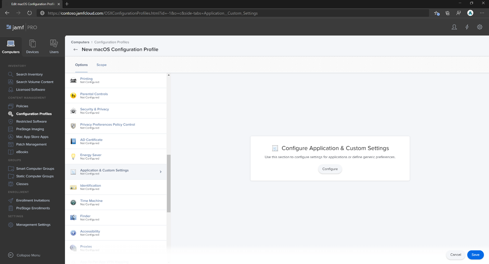
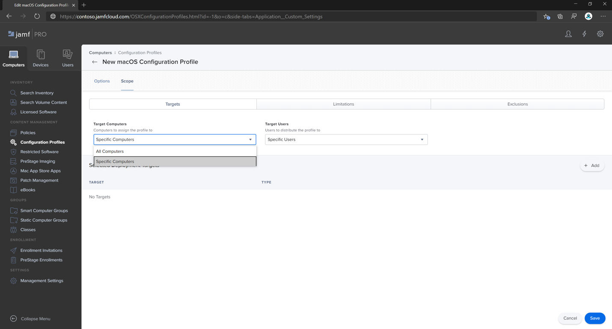
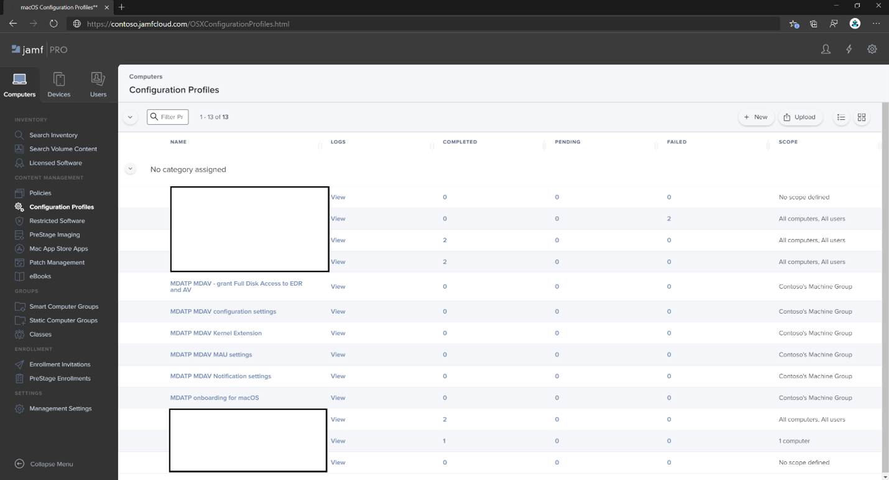
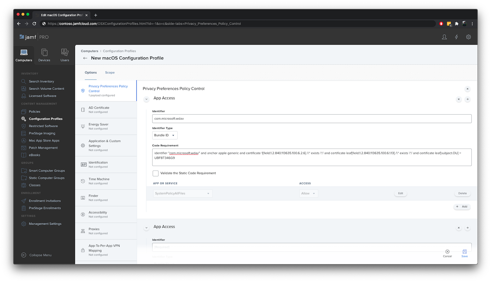
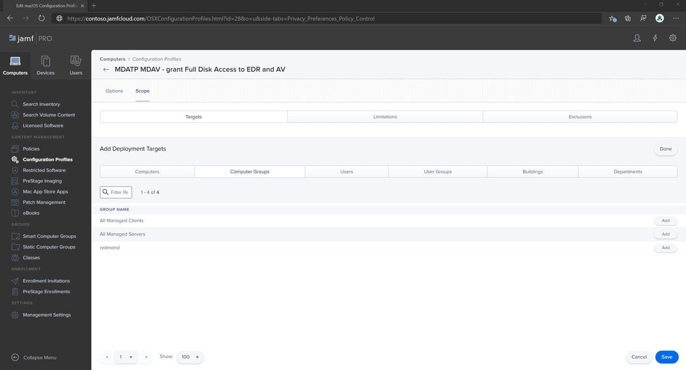

# <a name="set-up-the-microsoft-defender-for-endpoint-on-macos-policies-in-jamf-pro"></a>在 Jamf Pro 的 macOS 原則上設定 Microsoft Defender for Endpoint

[!INCLUDE [Microsoft 365 Defender rebranding](../../includes/microsoft-defender.md)]


**適用於：**

- [Mac 版端點的 Defender](microsoft-defender-endpoint-mac.md)

此頁面會引導您完成在 Jamf Pro 中設定 macOS 原則所需採取的步驟。

您必須採取下列步驟：

1. [取得 Microsoft Defender for Endpoint 上架套件](#step-1-get-the-microsoft-defender-for-endpoint-onboarding-package)

2. [使用上架套件在 Jamf Pro 中建立設定檔](#step-2-create-a-configuration-profile-in-jamf-pro-using-the-onboarding-package)

3. [設定 Microsoft Defender for Endpoint 設定](#step-3-configure-microsoft-defender-for-endpoint-settings)

4. [設定 Microsoft Defender for Endpoint notification 設定](#step-4-configure-notifications-settings)

5. [設定 Microsoft AutoUpdate (MAU) ](#step-5-configure-microsoft-autoupdate-mau)

6. [授與 Microsoft Defender for Endpoint 的完整磁片存取權](#step-6-grant-full-disk-access-to-microsoft-defender-for-endpoint)

7. [核准 Microsoft Defender for Endpoint 的內核擴充](#step-7-approve-kernel-extension-for-microsoft-defender-for-endpoint)

8. [核准 Microsoft Defender for Endpoint 的系統擴充](#step-8-approve-system-extensions-for-microsoft-defender-for-endpoint)

9. [設定網路擴充](#step-9-configure-network-extension)

10. [在 macOS 上使用 Microsoft Defender for Endpoint 排程掃描](https://docs.microsoft.com/windows/security/threat-protection/microsoft-defender-atp/mac-schedule-scan-atp)

11. [在 macOS 上部署 Microsoft Defender for Endpoint](#step-11-deploy-microsoft-defender-for-endpoint-on-macos)


## <a name="step-1-get-the-microsoft-defender-for-endpoint-onboarding-package"></a>步驟1：取得 Microsoft Defender for Endpoint 上架套件

1. 在 [Microsoft Defender Security Center](https://securitycenter.microsoft.com )中，流覽至 [ **設定] > 上架**。 

2. 選取 [macOS 為作業系統] 和 [行動裝置管理/Microsoft Intune] 做為部署方法。

    

3. 選取 [ (WindowsDefenderATPOnboardingPackage.zip) **下載上架套件** ]。

4. 解壓縮 `WindowsDefenderATPOnboardingPackage.zip` 。

5. 將檔案複製到您的慣用位置。 例如，  `C:\Users\JaneDoe_or_JohnDoe.contoso\Downloads\WindowsDefenderATPOnboardingPackage_macOS_MDM_contoso\jamf\WindowsDefenderATPOnboarding.plist`。


## <a name="step-2-create-a-configuration-profile-in-jamf-pro-using-the-onboarding-package"></a>步驟2：使用上架套件在 Jamf Pro 中建立設定檔

1. `WindowsDefenderATPOnboarding.plist`從上一節中找出檔。

   

 
2. 在 Jamf Pro 儀表板中，選取 [ **新增**]。

    

3. 輸入下列詳細資料：

   **一般**
   - 名稱： MDATP 上架 macOS
   - 描述： macOS 的 MDATP EDR 上架
   - 類別：無
   - 分配方法：自動安裝
   - 層級：電腦層級

4. 在 **應用程式 & 自訂設定** 中，選取 [ **設定**]。

    

5. 選取 **[ (PLIST 檔案) 上傳** 檔案]，然後在 [ **喜好設定功能變數名稱** ] 中輸入： `com.microsoft.wdav.atp` 。 

    

    

7. 選取 [ **開啟** ]，然後選取上架檔案。

    

8. 選取 **[上傳**]。 

    


9. 選取 [ **範圍** ] 索引標籤。

    ![範圍] 索引標籤的影像](images/jamfpro-scope-tab.png)

10. 選取目的電腦。

    

     

11. 選取 **[儲存]**。

    

    

12. 選取 **[完成]**。

    

    

## <a name="step-3-configure-microsoft-defender-for-endpoint-settings"></a>步驟3：設定 Microsoft Defender for Endpoint 設定

1.  使用下列 Microsoft Defender for Endpoint configuration 設定：

    - enableRealTimeProtection
    - passiveMode
    
    >[!NOTE]
    >預設未開啟，如果您打算為 macOS 執行協力廠商 AV，請將其設為 `true` 。

    - 排除
    - excludedPath
    - excludedFileExtension
    - excludedFileName
    - exclusionsMergePolicy
    - allowedThreats
    
    >[!NOTE]
    >EICAR.TXT 位於範例上，如果您想要透過概念證明，請將它移除，尤其是在您測試 EICAR.TXT 時。
        
    - disallowedThreatActions
    - potentially_unwanted_application
    - archive_bomb
    - cloudService
    - automaticSampleSubmission
    - 標籤
    - hideStatusMenuIcon
    
     如需詳細資訊，請參閱 [Jamf 設定檔的屬性清單](mac-preferences.md#property-list-for-jamf-configuration-profile)。

     ```XML
     <?xml version="1.0" encoding="UTF-8"?>
     <!DOCTYPE plist PUBLIC "-//Apple//DTD PLIST 1.0//EN" "http://www.apple.com/DTDs/PropertyList-1.0.dtd">
     <plist version="1.0">
     <dict>
         <key>antivirusEngine</key>
         <dict>
             <key>enableRealTimeProtection</key>
             <true/>
             <key>passiveMode</key>
             <false/>
             <key>exclusions</key>
             <array>
                 <dict>
                     <key>$type</key>
                     <string>excludedPath</string>
                     <key>isDirectory</key>
                     <false/>
                     <key>path</key>
                     <string>/var/log/system.log</string>
                 </dict>
                 <dict>
                     <key>$type</key>
                     <string>excludedPath</string>
                     <key>isDirectory</key>
                     <true/>
                     <key>path</key>
                     <string>/home</string>
                 </dict>
                 <dict>
                     <key>$type</key>
                     <string>excludedFileExtension</string>
                     <key>extension</key>
                     <string>pdf</string>
                 </dict>
                 <dict>
                     <key>$type</key>
                     <string>excludedFileName</string>
                     <key>name</key>
                     <string>cat</string>
                 </dict>
             </array>
             <key>exclusionsMergePolicy</key>
             <string>merge</string>
             <key>allowedThreats</key>
             <array>
                 <string>EICAR-Test-File (not a virus)</string>
             </array>
             <key>disallowedThreatActions</key>
             <array>
                 <string>allow</string>
                 <string>restore</string>
             </array>
             <key>threatTypeSettings</key>
             <array>
                 <dict>
                     <key>key</key>
                     <string>potentially_unwanted_application</string>
                     <key>value</key>
                     <string>block</string>
                 </dict>
                 <dict>
                     <key>key</key>
                     <string>archive_bomb</string>
                     <key>value</key>
                     <string>audit</string>
                 </dict>
             </array>
             <key>threatTypeSettingsMergePolicy</key>
             <string>merge</string>
         </dict>
         <key>cloudService</key>
         <dict>
             <key>enabled</key>
             <true/>
             <key>diagnosticLevel</key>
             <string>optional</string>
             <key>automaticSampleSubmission</key>
             <true/>
         </dict>
         <key>edr</key>
         <dict>
             <key>tags</key>
             <array>
                 <dict>
                     <key>key</key>
                     <string>GROUP</string>
                     <key>value</key>
                     <string>ExampleTag</string>
                 </dict>
             </array>
         </dict>
         <key>userInterface</key>
         <dict>
             <key>hideStatusMenuIcon</key>
             <false/>
         </dict>
     </dict>
     </plist>
     ```

2. 將檔案儲存為 `MDATP_MDAV_configuration_settings.plist` 。


3.  在 Jamf Pro 儀表板中，選取 **[一般**]。

    

4. 輸入下列詳細資料：

    **一般**
    
    - 名稱： MDATP MDAV 設定設定
    - 描述：\<blank\>
    - 類別：無 (預設) 
    - 分配方法：自動安裝 (預設) 
    - 層級：電腦層級 (預設) 

    

5. 在 **應用程式 & 自訂設定** 中，選取 [ **設定**]。

    

6. 選取 **[上傳檔案 (PLIST** 檔案]) 。

    

7. 在 [ **喜好設定網域**] 中，輸入 `com.microsoft.wdav` ，然後選取  **[上傳 PLIST** 檔案]。

    

8. 選取 **[選擇檔**]。

    ![設定的配置圖像選擇 [檔案]](images/526e978761fc571cca06907da7b01fd6.png)

9. 選取 **MDATP_MDAV_configuration_settings plist**，然後選取 [ **開啟**]。

    

10. 選取 **[上傳**]。

    

    

    >[!NOTE]
    >如果您要上傳 Intune 檔案，您會收到下列錯誤：<br>
    >


11. 選取 **[儲存]**。 

    

12. 檔案上傳。

    

    

13. 選取 [ **範圍** ] 索引標籤。

    

14. 選取 [ **Contoso 的電腦群組**]。 

15. 選取 [ **新增**]，然後選取 [ **儲存**]。

    

    

16. 選取 **[完成]**。 您將會看到新的設定 **設定檔**。

    


## <a name="step-4-configure-notifications-settings"></a>步驟4：設定通知設定

這些步驟適用于 macOS 10.15 (Catalina) 或更新版本。

1. 在 Jamf Pro 儀表板中，選取 [ **電腦**]，然後選取 [設定 **設定檔**]。

2. 按一下 [ **新增**]，然後輸入下列 **選項** 的詳細資料：
    
    - 索引標籤 **一般**： 
        - **名稱**： MDATP MDAV 通知設定
        - **描述**： macOS 10.15 (Catalina) 或更新版本
        - **類別**：無 *(預設)*
        - **分配方法**：自動安裝 *(預設)*
        - **層級**：電腦層級 *(預設)*

        

    - [索引標籤 **通知**] 中，按一下 [ **新增**]，然後輸入下列值：
        - **束識別碼**： `com.microsoft.wdav.tray`
        - **嚴重警示**：按一下 [**停** 用]
        - **通知**：按一下 [**啟用**]
        - **橫幅警示類型**：選取 [ **包含** 與 **臨時** *(預設值])*
        - **鎖定畫面上的通知**：按一下 [**隱藏**]
        - **通知中心的通知**：按一下 [**顯示**]
        - **徽章應用程式圖示**：按一下 [**顯示**]

        

    - 索引標籤 **通知**，請按一下 [ **增加** 一次]，向下滾動至 **新的通知設定**
        - **束識別碼**： `com.microsoft.autoupdate2`
        - 將其餘設定設定為與上述值相同

        

        請注意，現在有兩個「資料表」具有通知設定，一個用於 **捆綁 ID: wdav**，另一個用於 **ID: autoupdate2 的捆綁**。 雖然您可以根據您的需求來設定警示設定，但捆綁 IDs 必須與之前所述完全相同，且 **包含** 參數必須 **開啟** 以取得 **通知**。

3. 選取 [ **範圍** ] 索引標籤，然後選取 [ **新增**]。

    

4. 選取 [ **Contoso 的電腦群組**]。 

5. 選取 [ **新增**]，然後選取 [ **儲存**]。
    
    
    
    

6. 選取 **[完成]**。 您將會看到新的設定 **設定檔**。
    

## <a name="step-5-configure-microsoft-autoupdate-mau"></a>步驟5：設定 Microsoft AutoUpdate (MAU) 

1. 使用下列 Microsoft Defender for Endpoint configuration 設定：

      ```XML
   <?xml version="1.0" encoding="UTF-8"?>
   <!DOCTYPE plist PUBLIC "-//Apple//DTD PLIST 1.0//EN" "http://www.apple.com/DTDs/PropertyList-1.0.dtd">
   <plist version="1.0">
   <dict>
    <key>ChannelName</key>
    <string>Current</string>
    <key>HowToCheck</key>
    <string>AutomaticDownload</string>
    <key>EnableCheckForUpdatesButton</key>
    <true/>
    <key>DisableInsiderCheckbox</key>
    <false/>
    <key>SendAllTelemetryEnabled</key>
    <true/>
   </dict>
   </plist>
   ```

2. 將其儲存為 `MDATP_MDAV_MAU_settings.plist` 。

3. 在 Jamf Pro 儀表板中，選取 **[一般**]。 

    

4. 輸入下列詳細資料：

    **一般** 
    
    - 名稱： MDATP MDAV MAU 設定
    - 描述： macOS 的 MDATP 的 Microsoft AutoUpdate 設定
    - 類別：無 (預設) 
    - 分配方法：自動安裝 (預設) 
    - 層級：電腦層級 (預設) 

5. 在 **應用程式 & 自訂設定** 中，選取 [ **設定**]。

    

6. 選取 **[上傳檔案 (PLIST** 檔案]) 。

      

7. 在 [ **喜好設定網域** ] 中輸入： `com.microsoft.autoupdate2` ，然後選取 **[上傳 PLIST** 檔案]。

    

8. 選取 **[選擇檔**]。

    

9. 選取 **MDATP_MDAV_MAU_settings plist**。

    

10. 選取 **[上傳**]。
    

    

11. 選取 **[儲存]**。

    

12. 選取 [ **範圍** ] 索引標籤。
   
     

13. 選取 [新增]。
    
    

    

    

14. 選取 **[完成]**。
    
    

## <a name="step-6-grant-full-disk-access-to-microsoft-defender-for-endpoint"></a>步驟6：授與 Microsoft Defender for Endpoint 的完整磁片存取權

1. 在 Jamf Pro 儀表板中，選取 [設定 **設定檔**]。

    

2. 選取 [ **+ 新增**]。 

3. 輸入下列詳細資料：

    **一般** 
    - 名稱： MDATP MDAV-對 EDR 和 AV 授與完整磁片存取權
    - 描述：在 macOS Catalina 或更新版本上，新增隱私權偏好設定原則控制
    - 類別：無
    - 分配方法：自動安裝
    - 層級：電腦層級


    

4. 在 [ **設定隱私權偏好設定原則控制** ] 中，選取 [ **設定**]。

    

5. 在 [ **隱私權偏好設定原則**] 中，輸入下列詳細資料：

    - 識別碼： `com.microsoft.wdav`
    - 識別碼類型：束識別碼
    - 程式碼需求： `identifier "com.microsoft.wdav" and anchor apple generic and certificate 1[field.1.2.840.113635.100.6.2.6] /* exists */ and certificate leaf[field.1.2.840.113635.100.6.1.13] /* exists */ and certificate leaf[subject.OU] = UBF8T346G9`


    

6. 選取 **[+ 新增]**。

    

    - 在應用程式或服務中：設定為 **SystemPolicyAllFiles**

    - 在 [access] 底下：設定為 **允許**

7. 選取 [ **儲存** (]，而不是位於右下方) 。

    

8. 按一下 [ `+` **應用程式存取** ] 旁的符號，以加入新的專案。

    

9. 輸入下列詳細資料：

    - 識別碼： `com.microsoft.wdav.epsext`
    - 識別碼類型：束識別碼
    - 程式碼需求： `identifier "com.microsoft.wdav.epsext" and anchor apple generic and certificate 1[field.1.2.840.113635.100.6.2.6] /* exists */ and certificate leaf[field.1.2.840.113635.100.6.1.13] /* exists */ and certificate leaf[subject.OU] = UBF8T346G9`

10. 選取 **[+ 新增]**。

    

    - 在應用程式或服務中：設定為 **SystemPolicyAllFiles**

    - 在 [access] 底下：設定為 **允許**

11. 選取 [ **儲存** (]，而不是位於右下方) 。

    

12. 選取 [ **範圍** ] 索引標籤。

    

13. 選取 **[+ 新增]**。

    

14. 選取 [>**群組名稱**] 下的 [**電腦群組**] > 選取 [ **Contoso 的 MachineGroup**]。 

    

15. 選取 [新增]。 

16. 選取 **[儲存]**。 
    
17. 選取 **[完成]**。
    
    
    
    

或者，您也可以下載 [fulldisk](https://github.com/microsoft/mdatp-xplat/blob/master/macos/mobileconfig/profiles/fulldisk.mobileconfig) ，並將其上傳至 JAMF 設定檔，如 [使用 JAMF Pro 部署自訂設定設定檔中所述）。方法2：將設定檔上傳至 Jamf Pro](https://www.jamf.com/jamf-nation/articles/648/deploying-custom-configuration-profiles-using-jamf-pro)。

## <a name="step-7-approve-kernel-extension-for-microsoft-defender-for-endpoint"></a>步驟7：核准 Microsoft Defender for Endpoint 的內核擴充

> [!CAUTION]
> Apple 矽 (M1) 裝置不支援 KEXT。 在這些裝置上安裝包含 KEXT 原則的設定檔將會失敗。

1. 在設定配置 **檔** 中，選取 [ **+ 新增**]。

    

2. 輸入下列詳細資料：

    **一般** 
    
    - 名稱： MDATP MDAV 內核擴充
    - 描述： MDATP 內核擴充 (kext) 
    - 類別：無
    - 分配方法：自動安裝
    - 層級：電腦層級

    

3. 在 [ **設定核准的核心擴充** ] 中，選取 [ **設定**]。

    

   
4. 在 **核准的內核擴充** 輸入下列詳細資料：

    - 顯示名稱： Microsoft Corp。
    - 團隊 ID: UBF8T346G9

    

5. 選取 [ **範圍** ] 索引標籤。

    ![設定的 [設定範圍] 索引標籤 m 的影像](images/0df36fc308ba569db204ee32db3fb40a.png)

6. 選取 **[+ 新增]**。

7. 選取 [>**群組名稱**] 下的 [**電腦群組**] > 選取 [ **Contoso 的機器群組**]。

8. 選取 **[+ 新增]**。

    

9. 選取 **[儲存]**。

    

10. 選取 **[完成]**。

    

或者，您也可以下載 [kext](https://github.com/microsoft/mdatp-xplat/blob/master/macos/mobileconfig/profiles/kext.mobileconfig) ，並將其上傳至 JAMF 設定檔，如 [使用 JAMF Pro 部署自訂設定設定檔中所述）。方法2：將設定檔上傳至 Jamf Pro](https://www.jamf.com/jamf-nation/articles/648/deploying-custom-configuration-profiles-using-jamf-pro)。

## <a name="step-8-approve-system-extensions-for-microsoft-defender-for-endpoint"></a>步驟8：核准 Microsoft Defender for Endpoint 的系統擴充

1. 在設定配置 **檔** 中，選取 [ **+ 新增**]。

    

2. 輸入下列詳細資料：

    **一般**
    
    - 名稱： MDATP MDAV 系統擴充
    - 描述： MDATP 系統擴充
    - 類別：無
    - 分配方法：自動安裝
    - 層級：電腦層級

    

3. 在 [ **系統擴充** ] 中，選取 [ **設定**]。

   

4. 在 [ **系統擴充** ] 中，輸入下列詳細資料：

   - 顯示名稱： Microsoft Corp. 系統擴充
   - 系統擴充類型：允許的系統擴充
   - 小組識別碼： UBF8T346G9
   - 允許的系統擴充：
     - **wdav epsext**
     - **wdav netext**

    

5. 選取 [ **範圍** ] 索引標籤。

    

6. 選取 **[+ 新增]**。

7. 選取 [>**群組名稱**] 下的 [**電腦群組**] > 選取 [ **Contoso 的機器群組**]。

8. 選取 **[+ 新增]**。

   

9. 選取 **[儲存]**。

   

10. 選取 **[完成]**。

    

## <a name="step-9-configure-network-extension"></a>步驟9：設定網路擴充

在端點偵測和回應功能中，Microsoft Defender for Endpoint on macOS 會檢查通訊端流量，並將此資訊報告給 Microsoft Defender Security Center 入口網站。 下列原則允許網路分機執行這項功能。

這些步驟適用于 macOS 10.15 (Catalina) 或更新版本。

1. 在 Jamf Pro 儀表板中，選取 [ **電腦**]，然後選取 [設定 **設定檔**]。

2. 按一下 [ **新增**]，然後輸入下列 **選項** 的詳細資料：

    - 索引標籤 **一般**： 
        - **名稱**： MICROSOFT Defender ATP 網路擴充
        - **描述**： macOS 10.15 (Catalina) 或更新版本
        - **類別**：無 *(預設)*
        - **分配方法**：自動安裝 *(預設)*
        - **層級**：電腦層級 *(預設)*

    - 索引標籤 **內容篩選**：
        - **篩選名稱**： MICROSOFT Defender ATP 內容篩選器
        - **識別碼**： `com.microsoft.wdav`
        - 保留 *未* 選取 **服務位址**、**組織**、**使用者名稱**、**密碼**、**憑證** 空白 (**包含**) 
        - **篩選順序**： Inspector
        - **通訊端篩選**： `com.microsoft.wdav.netext`
        - **通訊端篩選指定的需求**： `identifier "com.microsoft.wdav.netext" and anchor apple generic and certificate 1[field.1.2.840.113635.100.6.2.6] /* exists */ and certificate leaf[field.1.2.840.113635.100.6.1.13] /* exists */ and certificate leaf[subject.OU] = UBF8T346G9`
        - *不* 會選取 [**網路篩選** 欄位] [空白 (**包含**]) 

        請注意，「 **識別碼**」、「 **通訊端篩選** 」及「 **通訊端篩選」指定的需求** 會如上所指定的

        

3. 選取 [ **範圍** ] 索引標籤。

   ![設定設定的圖像 [sco] 索引標籤](images/0df36fc308ba569db204ee32db3fb40a.png)

4. 選取 **[+ 新增]**。

5. 選取 [>**群組名稱**] 下的 [**電腦群組**] > 選取 [ **Contoso 的機器群組**]。

6. 選取 **[+ 新增]**。

    

7. 選取 **[儲存]**。

    

8. 選取 **[完成]**。

    

或者，您也可以下載 [netfilter](https://github.com/microsoft/mdatp-xplat/blob/master/macos/mobileconfig/profiles/netfilter.mobileconfig) ，並將其上傳至 JAMF 設定檔，如 [使用 JAMF Pro 部署自訂設定設定檔中所述）。方法2：將設定檔上傳至 Jamf Pro](https://www.jamf.com/jamf-nation/articles/648/deploying-custom-configuration-profiles-using-jamf-pro)。


## <a name="step-10-schedule-scans-with-microsoft-defender-for-endpoint-on-macos"></a>步驟10：使用 macOS 上的 Microsoft Defender for Endpoint 排程掃描
依照 [macOS 上的 [Microsoft Defender For Endpoint] 進行排程掃描](https://docs.microsoft.com/windows/security/threat-protection/microsoft-defender-atp/mac-schedule-scan-atp)的指示進行。


## <a name="step-11-deploy-microsoft-defender-for-endpoint-on-macos"></a>步驟11：在 macOS 上部署 Microsoft Defender for Endpoint

1. 流覽至您儲存的位置 `wdav.pkg` 。

    

2. 將其重新命名為 `wdav_MDM_Contoso_200329.pkg` 。

    

3. 開啟 Jamf Pro 儀表板。

    

4. 選取您的電腦，然後按一下上方的齒輪圖示，然後選取 [ **電腦管理**]。

    

5. 在 [ **套件**] 中，選取 [ **+ 新增**]。 
    

6. 在 [ **新增套件** ] 中輸入下列詳細資料：

    **一般] 索引標籤**
    - 顯示名稱：現在請將它保留空白。 因為當您選擇 pkg 時，將會重設。
    - 類別：無 (預設) 
    - 檔案名：選擇檔案

    ![設定設定的圖像 [一般] 索引標籤](images/21de3658bf58b1b767a17358a3f06341.png)

    開啟檔，並將它指向 `wdav.pkg` 或 `wdav_MDM_Contoso_200329.pkg` 。
    
    

7. 選取 [開啟]。 將 **顯示名稱** 設定為 **Microsoft Defender 高級威脅防護和 Microsoft defender 防病毒**。

    **資訊清單** 檔案不是必要的。 Microsoft Defender 高級威脅防護沒有資訊清單檔案。
    
    **[選項] 索引標籤**<br> 保留預設值。

    **限制] 索引標籤**<br> 保留預設值。
    
     ![[設定設定] [限制] 索引標籤的影像](images/56dac54634d13b2d3948ab50e8d3ef21.png)
   
8. 選取 **[儲存]**。 套件已上傳至 Jamf Pro。 

   

   可能需要幾分鐘的時間才能部署套件。
   
   

9. 流覽至 [ **原則** ] 頁面。

    

10. 選取 [ **+ 新增** ] 以建立新的原則。

    


11. **一般說來** 請輸入下列詳細資料：

    - 顯示名稱： MDATP 上架 200329 v 100.86.92 或更新版本

    

12. 選取 [ **週期性存回**]。 
    
    

  
13. 選取 **[儲存]**。 
 
14. 選取 **> 設定的套件**。
 
    

15. 選取 [ **Microsoft Defender 高級威脅防護] 和 [Microsoft Defender 防毒軟體**] 旁邊的 [**新增**] 按鈕。

    

16. 選取 **[儲存]**。

    

17. 選取 [ **範圍** ] 索引標籤。  

    

18. 選取目的電腦。

    

    **Scope**
    
    選取 [新增]。
    
    

    

    **Self-Service**
    
    

19. 選取 **[完成]**。 

    

    


