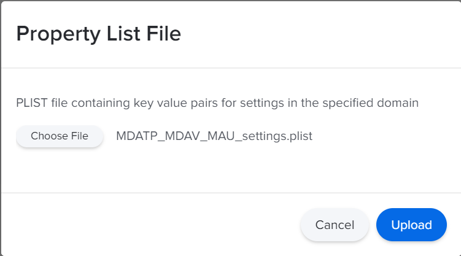
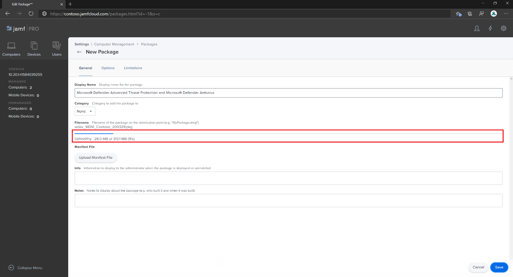
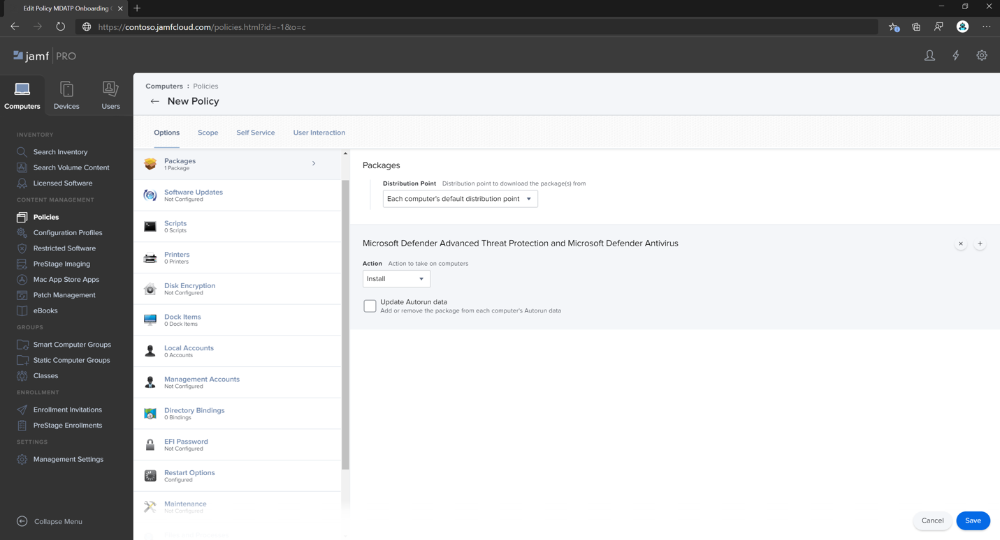

# <a name="set-up-the-microsoft-defender-for-endpoint-on-macos-policies-in-jamf-pro"></a><span data-ttu-id="93545-104">在 Jamf 的 macOS 原則上設定 Microsoft Defender for 端點 Pro</span><span class="sxs-lookup"><span data-stu-id="93545-104">Set up the Microsoft Defender for Endpoint on macOS policies in Jamf Pro</span></span>

[!INCLUDE [Microsoft 365 Defender rebranding](../../includes/microsoft-defender.md)]


<span data-ttu-id="93545-105">**適用於：**</span><span class="sxs-lookup"><span data-stu-id="93545-105">**Applies to:**</span></span>

- [<span data-ttu-id="93545-106">Mac 版端點的 Defender</span><span class="sxs-lookup"><span data-stu-id="93545-106">Defender for Endpoint on Mac</span></span>](microsoft-defender-endpoint-mac.md)

<span data-ttu-id="93545-107">此頁面會引導您完成在 Jamf Pro 中設定 macOS 原則所需採取的步驟。</span><span class="sxs-lookup"><span data-stu-id="93545-107">This page will guide you through the steps you need to take to set up macOS policies in Jamf Pro.</span></span>

<span data-ttu-id="93545-108">您必須採取下列步驟：</span><span class="sxs-lookup"><span data-stu-id="93545-108">You'll need to take the following steps:</span></span>

1. [<span data-ttu-id="93545-109">取得 Microsoft Defender for Endpoint 上架套件</span><span class="sxs-lookup"><span data-stu-id="93545-109">Get the Microsoft Defender for Endpoint onboarding package</span></span>](#step-1-get-the-microsoft-defender-for-endpoint-onboarding-package)

2. [<span data-ttu-id="93545-110">使用上架套件在 Jamf Pro 中建立設定檔</span><span class="sxs-lookup"><span data-stu-id="93545-110">Create a configuration profile in Jamf Pro using the onboarding package</span></span>](#step-2-create-a-configuration-profile-in-jamf-pro-using-the-onboarding-package)

3. [<span data-ttu-id="93545-111">設定 Microsoft Defender for Endpoint 設定</span><span class="sxs-lookup"><span data-stu-id="93545-111">Configure Microsoft Defender for Endpoint settings</span></span>](#step-3-configure-microsoft-defender-for-endpoint-settings)

4. [<span data-ttu-id="93545-112">設定 Microsoft Defender for Endpoint notification 設定</span><span class="sxs-lookup"><span data-stu-id="93545-112">Configure Microsoft Defender for Endpoint notification settings</span></span>](#step-4-configure-notifications-settings)

5. [<span data-ttu-id="93545-113">設定 Microsoft AutoUpdate (MAU) </span><span class="sxs-lookup"><span data-stu-id="93545-113">Configure Microsoft AutoUpdate (MAU)</span></span>](#step-5-configure-microsoft-autoupdate-mau)

6. [<span data-ttu-id="93545-114">授與 Microsoft Defender for Endpoint 的完整磁片存取權</span><span class="sxs-lookup"><span data-stu-id="93545-114">Grant full disk access to Microsoft Defender for Endpoint</span></span>](#step-6-grant-full-disk-access-to-microsoft-defender-for-endpoint)

7. [<span data-ttu-id="93545-115">核准 Microsoft Defender for Endpoint 的內核擴充</span><span class="sxs-lookup"><span data-stu-id="93545-115">Approve Kernel extension for Microsoft Defender for Endpoint</span></span>](#step-7-approve-kernel-extension-for-microsoft-defender-for-endpoint)

8. [<span data-ttu-id="93545-116">核准 Microsoft Defender for Endpoint 的系統擴充</span><span class="sxs-lookup"><span data-stu-id="93545-116">Approve System extensions for Microsoft Defender for Endpoint</span></span>](#step-8-approve-system-extensions-for-microsoft-defender-for-endpoint)

9. [<span data-ttu-id="93545-117">設定網路擴充</span><span class="sxs-lookup"><span data-stu-id="93545-117">Configure Network Extension</span></span>](#step-9-configure-network-extension)

10. [<span data-ttu-id="93545-118">在 macOS 上使用 Microsoft Defender for Endpoint 排程掃描</span><span class="sxs-lookup"><span data-stu-id="93545-118">Schedule scans with Microsoft Defender for Endpoint on macOS</span></span>](/windows/security/threat-protection/microsoft-defender-atp/mac-schedule-scan-atp)

11. [<span data-ttu-id="93545-119">在 macOS 上部署 Microsoft Defender for Endpoint</span><span class="sxs-lookup"><span data-stu-id="93545-119">Deploy Microsoft Defender for Endpoint on macOS</span></span>](#step-11-deploy-microsoft-defender-for-endpoint-on-macos)


## <a name="step-1-get-the-microsoft-defender-for-endpoint-onboarding-package"></a><span data-ttu-id="93545-120">步驟1：取得 Microsoft Defender for Endpoint 上架套件</span><span class="sxs-lookup"><span data-stu-id="93545-120">Step 1: Get the Microsoft Defender for Endpoint onboarding package</span></span>

1. <span data-ttu-id="93545-121">在 [Microsoft Defender 資訊安全中心](https://securitycenter.microsoft.com)中，流覽至 **設定 > 上架**。</span><span class="sxs-lookup"><span data-stu-id="93545-121">In [Microsoft Defender Security Center](https://securitycenter.microsoft.com), navigate to **Settings > Onboarding**.</span></span>

2. <span data-ttu-id="93545-122">選取 [macOS] 做為作業系統及行動裝置管理/Microsoft Intune 做為部署方法。</span><span class="sxs-lookup"><span data-stu-id="93545-122">Select macOS as the operating system and Mobile Device Management / Microsoft Intune as the deployment method.</span></span>

    

3. <span data-ttu-id="93545-124">選取 [ (WindowsDefenderATPOnboardingPackage.zip) **下載上架套件** ]。</span><span class="sxs-lookup"><span data-stu-id="93545-124">Select **Download onboarding package** (WindowsDefenderATPOnboardingPackage.zip).</span></span>

4. <span data-ttu-id="93545-125">解壓縮 `WindowsDefenderATPOnboardingPackage.zip` 。</span><span class="sxs-lookup"><span data-stu-id="93545-125">Extract `WindowsDefenderATPOnboardingPackage.zip`.</span></span>

5. <span data-ttu-id="93545-126">將檔案複製到您的慣用位置。</span><span class="sxs-lookup"><span data-stu-id="93545-126">Copy the file to your preferred location.</span></span> <span data-ttu-id="93545-127">例如，  `C:\Users\JaneDoe_or_JohnDoe.contoso\Downloads\WindowsDefenderATPOnboardingPackage_macOS_MDM_contoso\jamf\WindowsDefenderATPOnboarding.plist`。</span><span class="sxs-lookup"><span data-stu-id="93545-127">For example,  `C:\Users\JaneDoe_or_JohnDoe.contoso\Downloads\WindowsDefenderATPOnboardingPackage_macOS_MDM_contoso\jamf\WindowsDefenderATPOnboarding.plist`.</span></span>


## <a name="step-2-create-a-configuration-profile-in-jamf-pro-using-the-onboarding-package"></a><span data-ttu-id="93545-128">步驟2：使用上架套件在 Jamf Pro 中建立設定檔</span><span class="sxs-lookup"><span data-stu-id="93545-128">Step 2: Create a configuration profile in Jamf Pro using the onboarding package</span></span>

1. <span data-ttu-id="93545-129">`WindowsDefenderATPOnboarding.plist`從上一節中找出檔。</span><span class="sxs-lookup"><span data-stu-id="93545-129">Locate the file `WindowsDefenderATPOnboarding.plist` from the previous section.</span></span>

   


2. <span data-ttu-id="93545-131">在 Jamf Pro 儀表板中，選取 [**新增**]。</span><span class="sxs-lookup"><span data-stu-id="93545-131">In the Jamf Pro dashboard, select **New**.</span></span>

    

3. <span data-ttu-id="93545-133">輸入下列詳細資料：</span><span class="sxs-lookup"><span data-stu-id="93545-133">Enter the following details:</span></span>

   <span data-ttu-id="93545-134">**一般**</span><span class="sxs-lookup"><span data-stu-id="93545-134">**General**</span></span>
   - <span data-ttu-id="93545-135">名稱： MDATP 上架 macOS</span><span class="sxs-lookup"><span data-stu-id="93545-135">Name: MDATP onboarding for macOS</span></span>
   - <span data-ttu-id="93545-136">描述： macOS 的 MDATP EDR 上架</span><span class="sxs-lookup"><span data-stu-id="93545-136">Description: MDATP EDR onboarding for macOS</span></span>
   - <span data-ttu-id="93545-137">類別：無</span><span class="sxs-lookup"><span data-stu-id="93545-137">Category: None</span></span>
   - <span data-ttu-id="93545-138">分配方法：自動安裝</span><span class="sxs-lookup"><span data-stu-id="93545-138">Distribution Method: Install Automatically</span></span>
   - <span data-ttu-id="93545-139">層級：電腦層級</span><span class="sxs-lookup"><span data-stu-id="93545-139">Level: Computer Level</span></span>

4. <span data-ttu-id="93545-140">在 **應用程式 & 自訂設定** 選取 [**設定**]。</span><span class="sxs-lookup"><span data-stu-id="93545-140">In **Application & Custom Settings** select **Configure**.</span></span>

    

5. <span data-ttu-id="93545-142">選取 [ **Upload 檔案 (PLIST 檔)** 然後在 [喜好設定 **功能變數名稱**] 中輸入： `com.microsoft.wdav.atp` 。</span><span class="sxs-lookup"><span data-stu-id="93545-142">Select **Upload File (PLIST file)** then in **Preference Domain** enter: `com.microsoft.wdav.atp`.</span></span>

    

    

6. <span data-ttu-id="93545-145">選取 [ **開啟** ]，然後選取上架檔案。</span><span class="sxs-lookup"><span data-stu-id="93545-145">Select **Open** and select the onboarding file.</span></span>

    

7. <span data-ttu-id="93545-147">選取 [ **Upload**]。</span><span class="sxs-lookup"><span data-stu-id="93545-147">Select **Upload**.</span></span>

    

8. <span data-ttu-id="93545-149">選取 [ **範圍** ] 索引標籤。</span><span class="sxs-lookup"><span data-stu-id="93545-149">Select the **Scope** tab.</span></span>

    ![範圍] 索引標籤的影像](images/jamfpro-scope-tab.png)

9. <span data-ttu-id="93545-151">選取目的電腦。</span><span class="sxs-lookup"><span data-stu-id="93545-151">Select the target computers.</span></span>

    

    

10. <span data-ttu-id="93545-154">選取 \*\*\*\*[儲存]。</span><span class="sxs-lookup"><span data-stu-id="93545-154">Select **Save**.</span></span>

    

    

11. <span data-ttu-id="93545-157">選取 **[完成]**。</span><span class="sxs-lookup"><span data-stu-id="93545-157">Select **Done**.</span></span>

    

    

## <a name="step-3-configure-microsoft-defender-for-endpoint-settings"></a><span data-ttu-id="93545-160">步驟3：設定 Microsoft Defender for Endpoint 設定</span><span class="sxs-lookup"><span data-stu-id="93545-160">Step 3: Configure Microsoft Defender for Endpoint settings</span></span>

<span data-ttu-id="93545-161">您可以使用 JAMF Pro GUI 編輯 Microsoft Defender 設定的個別設定，或是在文字編輯器中建立設定 Plist，並將其上傳至 JAMF Pro 使用舊版方法。</span><span class="sxs-lookup"><span data-stu-id="93545-161">You can either use JAMF Pro GUI to edit individual settings of the Microsoft Defender configuration, or use the legacy method by creating a configuration Plist in a text editor, and uploading it to JAMF Pro.</span></span>

<span data-ttu-id="93545-162">請注意，您必須使用完整的 `com.microsoft.wdav` **首選項網域**，Microsoft Defender 只會使用此名稱，並 `com.microsoft.wdav.ext` 載入其 managed 設定！</span><span class="sxs-lookup"><span data-stu-id="93545-162">Note that you must use exact `com.microsoft.wdav` as the **Preference Domain**, Microsoft Defender uses only this name and `com.microsoft.wdav.ext` to load its managed settings!</span></span>

<span data-ttu-id="93545-163"> (`com.microsoft.wdav.ext` 當您更喜歡使用 GUI 方法，但也需要設定尚未新增至架構的設定時，版本可以用於極少的情況。 ) </span><span class="sxs-lookup"><span data-stu-id="93545-163">(The `com.microsoft.wdav.ext` version may be used in rare cases when you prefer to use GUI method, but also need to configure a setting that has not been added to the schema yet.)</span></span>

### <a name="gui-method"></a><span data-ttu-id="93545-164">GUI 方法</span><span class="sxs-lookup"><span data-stu-id="93545-164">GUI method</span></span>

1. <span data-ttu-id="93545-165">從[Defender 的 GitHub 存放庫下載檔案](https://github.com/microsoft/mdatp-xplat/tree/master/macos/schema)schema.js，並將其儲存至本機檔案：</span><span class="sxs-lookup"><span data-stu-id="93545-165">Download schema.json file from [Defender's GitHub repository](https://github.com/microsoft/mdatp-xplat/tree/master/macos/schema) and save it to a local file:</span></span>

    ```bash
    curl -o ~/Documents/schema.json https://raw.githubusercontent.com/microsoft/mdatp-xplat/master/macos/schema/schema.json
    ```

2. <span data-ttu-id="93545-166">在 [電腦-> 設定設定檔] 下建立新的設定檔，在 [ **一般** ] 索引標籤上輸入下列詳細資料：</span><span class="sxs-lookup"><span data-stu-id="93545-166">Create a new Configuration Profile under Computers -> Configuration Profiles, enter the following details on the **General** tab:</span></span>

    

    - <span data-ttu-id="93545-168">名稱： MDATP MDAV 設定設定</span><span class="sxs-lookup"><span data-stu-id="93545-168">Name: MDATP MDAV configuration settings</span></span>
    - <span data-ttu-id="93545-169">描述：\<blank\></span><span class="sxs-lookup"><span data-stu-id="93545-169">Description:\<blank\></span></span>
    - <span data-ttu-id="93545-170">類別：無 (預設) </span><span class="sxs-lookup"><span data-stu-id="93545-170">Category: None (default)</span></span>
    - <span data-ttu-id="93545-171">層級：電腦層級 (預設) </span><span class="sxs-lookup"><span data-stu-id="93545-171">Level: Computer Level (default)</span></span>
    - <span data-ttu-id="93545-172">分配方法：自動安裝 (預設) </span><span class="sxs-lookup"><span data-stu-id="93545-172">Distribution Method: Install Automatically (default)</span></span>

3. <span data-ttu-id="93545-173">向下滾動至 **應用程式 & 自訂設定**] 索引標籤，選取 [**外部應用程式**]，然後按一下 [**新增**]，然後使用 [**自訂架構**] 做為偏好設定網域使用</span><span class="sxs-lookup"><span data-stu-id="93545-173">Scroll down to the **Application & Custom Settings** tab, select **External Applications**, click **Add** and use **Custom Schema** as Source to use for the preference domain.</span></span>

    

4. <span data-ttu-id="93545-175">`com.microsoft.wdav`以偏好設定網域的身分輸入，按一下 [**新增架構**]，並 **Upload** 在步驟1下載的檔案上 schema.js。</span><span class="sxs-lookup"><span data-stu-id="93545-175">Enter `com.microsoft.wdav` as the Preference Domain, click on **Add Schema** and **Upload** the schema.json file downloaded on Step 1.</span></span> <span data-ttu-id="93545-176">按一下 **[儲存]**。</span><span class="sxs-lookup"><span data-stu-id="93545-176">Click **Save**.</span></span>

    

5. <span data-ttu-id="93545-178">您可以在 [ **喜好設定網域** 內容] 底下看到下列所有支援的 Microsoft Defender 設定設定。</span><span class="sxs-lookup"><span data-stu-id="93545-178">You can see all supported Microsoft Defender configuration settings below, under **Preference Domain Properties**.</span></span> <span data-ttu-id="93545-179">按一下 [ **新增/移除屬性** ] 以選取您想要管理的設定，然後按一下 **[確定]** 以儲存變更。</span><span class="sxs-lookup"><span data-stu-id="93545-179">Click **Add/Remove properties** to select the settings that you want to be managed, and click **Ok** to save your changes.</span></span> <span data-ttu-id="93545-180">將不會將 (設定左取消選取的受管理的設定中，使用者將可以在其電腦上設定這些設定。 ) </span><span class="sxs-lookup"><span data-stu-id="93545-180">(Settings left unselected will not be included into the managed configuration, an end user will be able to configure those settings on their machines.)</span></span>

    

6. <span data-ttu-id="93545-182">將設定值變更為所需的值。</span><span class="sxs-lookup"><span data-stu-id="93545-182">Change values of the settings to desired values.</span></span> <span data-ttu-id="93545-183">您可以按一下 [ **詳細資訊** ] 以取得特定設定的檔。</span><span class="sxs-lookup"><span data-stu-id="93545-183">You can click **More information** to get documentation for a particular setting.</span></span> <span data-ttu-id="93545-184"> (您可以按一下 [ **Plist 預覽** ]，以檢查設定 Plist 的外觀。</span><span class="sxs-lookup"><span data-stu-id="93545-184">(You may click **Plist preview** to inspect what the configuration plist will look like.</span></span> <span data-ttu-id="93545-185">按一下 [ **表單編輯器** ] 以回到視覺編輯器。 ) </span><span class="sxs-lookup"><span data-stu-id="93545-185">Click **Form editor** to return to the visual editor.)</span></span>

    

7. <span data-ttu-id="93545-187">選取 [ **範圍** ] 索引標籤。</span><span class="sxs-lookup"><span data-stu-id="93545-187">Select the **Scope** tab.</span></span>

    

8. <span data-ttu-id="93545-189">選取 [ **Contoso 的電腦群組**]。</span><span class="sxs-lookup"><span data-stu-id="93545-189">Select **Contoso's Machine Group**.</span></span>

9. <span data-ttu-id="93545-190">選取 [ **新增**]，然後選取 [ **儲存**]。</span><span class="sxs-lookup"><span data-stu-id="93545-190">Select **Add**, then select **Save**.</span></span>

    

    

10. <span data-ttu-id="93545-193">選取 **[完成]**。</span><span class="sxs-lookup"><span data-stu-id="93545-193">Select **Done**.</span></span> <span data-ttu-id="93545-194">您將會看到新的設定 **設定檔**。</span><span class="sxs-lookup"><span data-stu-id="93545-194">You'll see the new **Configuration profile**.</span></span>

    

<span data-ttu-id="93545-196">Microsoft Defender 會隨著時間新增新的設定。</span><span class="sxs-lookup"><span data-stu-id="93545-196">Microsoft Defender adds new settings over time.</span></span> <span data-ttu-id="93545-197">這些新設定會新增至架構，而新版本會發佈給 Github。</span><span class="sxs-lookup"><span data-stu-id="93545-197">These new settings will be added to the schema, and a new version will be published to Github.</span></span>
<span data-ttu-id="93545-198">您需要做的所有更新是：下載更新的架構、編輯現有的設定檔，以及在 **應用程式 & 自訂設定**] 索引標籤上 **編輯架構**。</span><span class="sxs-lookup"><span data-stu-id="93545-198">All you need to do to have updates is to download an updated schema, edit existing configuration profile, and **Edit schema** at the **Application & Custom Settings** tab.</span></span>

### <a name="legacy-method"></a><span data-ttu-id="93545-199">舊方法</span><span class="sxs-lookup"><span data-stu-id="93545-199">Legacy method</span></span>

1. <span data-ttu-id="93545-200">使用下列 Microsoft Defender for Endpoint configuration 設定：</span><span class="sxs-lookup"><span data-stu-id="93545-200">Use the following Microsoft Defender for Endpoint configuration settings:</span></span>

    - <span data-ttu-id="93545-201">enableRealTimeProtection</span><span class="sxs-lookup"><span data-stu-id="93545-201">enableRealTimeProtection</span></span>
    - <span data-ttu-id="93545-202">passiveMode</span><span class="sxs-lookup"><span data-stu-id="93545-202">passiveMode</span></span>

    >[!NOTE]
    ><span data-ttu-id="93545-203">預設未開啟，如果您打算為 macOS 執行協力廠商 AV，請將其設為 `true` 。</span><span class="sxs-lookup"><span data-stu-id="93545-203">Not turned on by default, if you are planning to run a third-party AV for macOS, set it to `true`.</span></span>

    - <span data-ttu-id="93545-204">排除</span><span class="sxs-lookup"><span data-stu-id="93545-204">exclusions</span></span>
    - <span data-ttu-id="93545-205">excludedPath</span><span class="sxs-lookup"><span data-stu-id="93545-205">excludedPath</span></span>
    - <span data-ttu-id="93545-206">excludedFileExtension</span><span class="sxs-lookup"><span data-stu-id="93545-206">excludedFileExtension</span></span>
    - <span data-ttu-id="93545-207">excludedFileName</span><span class="sxs-lookup"><span data-stu-id="93545-207">excludedFileName</span></span>
    - <span data-ttu-id="93545-208">exclusionsMergePolicy</span><span class="sxs-lookup"><span data-stu-id="93545-208">exclusionsMergePolicy</span></span>
    - <span data-ttu-id="93545-209">allowedThreats</span><span class="sxs-lookup"><span data-stu-id="93545-209">allowedThreats</span></span>

    >[!NOTE]
    ><span data-ttu-id="93545-210">EICAR.TXT 位於範例上，如果您想要透過概念證明，請將它移除，尤其是在您測試 EICAR.TXT 時。</span><span class="sxs-lookup"><span data-stu-id="93545-210">EICAR is on the sample, if you are going through a proof-of-concept, remove it especially if you are testing EICAR.</span></span>

    - <span data-ttu-id="93545-211">disallowedThreatActions</span><span class="sxs-lookup"><span data-stu-id="93545-211">disallowedThreatActions</span></span>
    - <span data-ttu-id="93545-212">potentially_unwanted_application</span><span class="sxs-lookup"><span data-stu-id="93545-212">potentially_unwanted_application</span></span>
    - <span data-ttu-id="93545-213">archive_bomb</span><span class="sxs-lookup"><span data-stu-id="93545-213">archive_bomb</span></span>
    - <span data-ttu-id="93545-214">cloudService</span><span class="sxs-lookup"><span data-stu-id="93545-214">cloudService</span></span>
    - <span data-ttu-id="93545-215">automaticSampleSubmission</span><span class="sxs-lookup"><span data-stu-id="93545-215">automaticSampleSubmission</span></span>
    - <span data-ttu-id="93545-216">標籤</span><span class="sxs-lookup"><span data-stu-id="93545-216">tags</span></span>
    - <span data-ttu-id="93545-217">hideStatusMenuIcon</span><span class="sxs-lookup"><span data-stu-id="93545-217">hideStatusMenuIcon</span></span>

     <span data-ttu-id="93545-218">如需詳細資訊，請參閱 [Jamf 設定檔的屬性清單](mac-preferences.md#property-list-for-jamf-configuration-profile)。</span><span class="sxs-lookup"><span data-stu-id="93545-218">For information, see [Property list for Jamf configuration profile](mac-preferences.md#property-list-for-jamf-configuration-profile).</span></span>

     ```XML
     <?xml version="1.0" encoding="UTF-8"?>
     <!DOCTYPE plist PUBLIC "-//Apple//DTD PLIST 1.0//EN" "http://www.apple.com/DTDs/PropertyList-1.0.dtd">
     <plist version="1.0">
     <dict>
         <key>antivirusEngine</key>
         <dict>
             <key>enableRealTimeProtection</key>
             <true/>
             <key>passiveMode</key>
             <false/>
             <key>exclusions</key>
             <array>
                 <dict>
                     <key>$type</key>
                     <string>excludedPath</string>
                     <key>isDirectory</key>
                     <false/>
                     <key>path</key>
                     <string>/var/log/system.log</string>
                 </dict>
                 <dict>
                     <key>$type</key>
                     <string>excludedPath</string>
                     <key>isDirectory</key>
                     <true/>
                     <key>path</key>
                     <string>/home</string>
                 </dict>
                 <dict>
                     <key>$type</key>
                     <string>excludedFileExtension</string>
                     <key>extension</key>
                     <string>pdf</string>
                 </dict>
                 <dict>
                     <key>$type</key>
                     <string>excludedFileName</string>
                     <key>name</key>
                     <string>cat</string>
                 </dict>
             </array>
             <key>exclusionsMergePolicy</key>
             <string>merge</string>
             <key>allowedThreats</key>
             <array>
                 <string>EICAR-Test-File (not a virus)</string>
             </array>
             <key>disallowedThreatActions</key>
             <array>
                 <string>allow</string>
                 <string>restore</string>
             </array>
             <key>threatTypeSettings</key>
             <array>
                 <dict>
                     <key>key</key>
                     <string>potentially_unwanted_application</string>
                     <key>value</key>
                     <string>block</string>
                 </dict>
                 <dict>
                     <key>key</key>
                     <string>archive_bomb</string>
                     <key>value</key>
                     <string>audit</string>
                 </dict>
             </array>
             <key>threatTypeSettingsMergePolicy</key>
             <string>merge</string>
         </dict>
         <key>cloudService</key>
         <dict>
             <key>enabled</key>
             <true/>
             <key>diagnosticLevel</key>
             <string>optional</string>
             <key>automaticSampleSubmission</key>
             <true/>
         </dict>
         <key>edr</key>
         <dict>
             <key>tags</key>
             <array>
                 <dict>
                     <key>key</key>
                     <string>GROUP</string>
                     <key>value</key>
                     <string>ExampleTag</string>
                 </dict>
             </array>
         </dict>
         <key>userInterface</key>
         <dict>
             <key>hideStatusMenuIcon</key>
             <false/>
         </dict>
     </dict>
     </plist>
     ```

2. <span data-ttu-id="93545-219">將檔案儲存為 `MDATP_MDAV_configuration_settings.plist` 。</span><span class="sxs-lookup"><span data-stu-id="93545-219">Save the file as `MDATP_MDAV_configuration_settings.plist`.</span></span>

3. <span data-ttu-id="93545-220">在 Jamf Pro 儀表板中，開啟 [**電腦**]，然後有設定配置 **檔**。</span><span class="sxs-lookup"><span data-stu-id="93545-220">In the Jamf Pro dashboard, open **Computers**, and there **Configuration Profiles**.</span></span> <span data-ttu-id="93545-221">按一下 [[*新增 (* ]，然後切換至 **[一般** ] 索引標籤。</span><span class="sxs-lookup"><span data-stu-id="93545-221">Click \**New(* and switch to the **General** tab.</span></span>

    

4. <span data-ttu-id="93545-223">輸入下列詳細資料：</span><span class="sxs-lookup"><span data-stu-id="93545-223">Enter the following details:</span></span>

    <span data-ttu-id="93545-224">**一般**</span><span class="sxs-lookup"><span data-stu-id="93545-224">**General**</span></span>

    - <span data-ttu-id="93545-225">名稱： MDATP MDAV 設定設定</span><span class="sxs-lookup"><span data-stu-id="93545-225">Name: MDATP MDAV configuration settings</span></span>
    - <span data-ttu-id="93545-226">描述：\<blank\></span><span class="sxs-lookup"><span data-stu-id="93545-226">Description:\<blank\></span></span>
    - <span data-ttu-id="93545-227">類別：無 (預設) </span><span class="sxs-lookup"><span data-stu-id="93545-227">Category: None (default)</span></span>
    - <span data-ttu-id="93545-228">分配方法：自動安裝 (預設) </span><span class="sxs-lookup"><span data-stu-id="93545-228">Distribution Method: Install Automatically(default)</span></span>
    - <span data-ttu-id="93545-229">層級：電腦層級 (預設) </span><span class="sxs-lookup"><span data-stu-id="93545-229">Level: Computer Level(default)</span></span>

    

5. <span data-ttu-id="93545-231">在 **應用程式 & 自訂設定** 選取 [**設定**]。</span><span class="sxs-lookup"><span data-stu-id="93545-231">In **Application & Custom Settings** select **Configure**.</span></span>

    

6. <span data-ttu-id="93545-233">選取 [ **Upload 檔案 (PLIST 檔)**]。</span><span class="sxs-lookup"><span data-stu-id="93545-233">Select **Upload File (PLIST file)**.</span></span>

    

7. <span data-ttu-id="93545-235">在 [**喜好設定網域**] 中，輸入 `com.microsoft.wdav` ，然後選取 [ **Upload PLIST** 檔]。</span><span class="sxs-lookup"><span data-stu-id="93545-235">In **Preferences Domain**, enter `com.microsoft.wdav`, then select  **Upload PLIST File**.</span></span>

    

8. <span data-ttu-id="93545-237">選取 **[選擇檔**]。</span><span class="sxs-lookup"><span data-stu-id="93545-237">Select **Choose File**.</span></span>

    ![設定的配置圖像選擇 [檔案]](images/526e978761fc571cca06907da7b01fd6.png)

9. <span data-ttu-id="93545-239">選取 **MDATP_MDAV_configuration_settings plist**，然後選取 [ **開啟**]。</span><span class="sxs-lookup"><span data-stu-id="93545-239">Select the **MDATP_MDAV_configuration_settings.plist**, then select **Open**.</span></span>

    

10. <span data-ttu-id="93545-241">選取 [ **Upload**]。</span><span class="sxs-lookup"><span data-stu-id="93545-241">Select **Upload**.</span></span>

    

    

    >[!NOTE]
    ><span data-ttu-id="93545-244">如果您要上傳 Intune 檔案，您會收到下列錯誤：</span><span class="sxs-lookup"><span data-stu-id="93545-244">If you happen to upload the Intune file, you'll get the following error:</span></span><br>
    ><span data-ttu-id="93545-245"></span><span class="sxs-lookup"><span data-stu-id="93545-245"></span></span>


11. <span data-ttu-id="93545-246">選取 \*\*\*\*[儲存]。</span><span class="sxs-lookup"><span data-stu-id="93545-246">Select **Save**.</span></span>

    

12. <span data-ttu-id="93545-248">檔案上傳。</span><span class="sxs-lookup"><span data-stu-id="93545-248">The file is uploaded.</span></span>

    

    

13. <span data-ttu-id="93545-251">選取 [ **範圍** ] 索引標籤。</span><span class="sxs-lookup"><span data-stu-id="93545-251">Select the **Scope** tab.</span></span>

    

14. <span data-ttu-id="93545-253">選取 [ **Contoso 的電腦群組**]。</span><span class="sxs-lookup"><span data-stu-id="93545-253">Select **Contoso's Machine Group**.</span></span>

15. <span data-ttu-id="93545-254">選取 [ **新增**]，然後選取 [ **儲存**]。</span><span class="sxs-lookup"><span data-stu-id="93545-254">Select **Add**, then select **Save**.</span></span>

    

    

16. <span data-ttu-id="93545-257">選取 **[完成]**。</span><span class="sxs-lookup"><span data-stu-id="93545-257">Select **Done**.</span></span> <span data-ttu-id="93545-258">您將會看到新的設定 **設定檔**。</span><span class="sxs-lookup"><span data-stu-id="93545-258">You'll see the new **Configuration profile**.</span></span>

    

## <a name="step-4-configure-notifications-settings"></a><span data-ttu-id="93545-260">步驟4：設定通知設定</span><span class="sxs-lookup"><span data-stu-id="93545-260">Step 4: Configure notifications settings</span></span>

<span data-ttu-id="93545-261">這些步驟適用于 macOS 10.15 (Catalina) 或更新版本。</span><span class="sxs-lookup"><span data-stu-id="93545-261">These steps are applicable of macOS 10.15 (Catalina) or newer.</span></span>

1. <span data-ttu-id="93545-262">在 [Jamf Pro 儀表板中，選取 [**電腦**]，然後選取 [設定 **設定檔**]。</span><span class="sxs-lookup"><span data-stu-id="93545-262">In the Jamf Pro dashboard, select **Computers**, then **Configuration Profiles**.</span></span>

2. <span data-ttu-id="93545-263">按一下 [ **新增**]，然後輸入下列 **選項** 的詳細資料：</span><span class="sxs-lookup"><span data-stu-id="93545-263">Click **New**, and enter the following details for **Options**:</span></span>

    - <span data-ttu-id="93545-264">索引標籤 **一般**：</span><span class="sxs-lookup"><span data-stu-id="93545-264">Tab **General**:</span></span>
        - <span data-ttu-id="93545-265">**名稱**： MDATP MDAV 通知設定</span><span class="sxs-lookup"><span data-stu-id="93545-265">**Name**: MDATP MDAV Notification settings</span></span>
        - <span data-ttu-id="93545-266">**描述**： macOS 10.15 (Catalina) 或更新版本</span><span class="sxs-lookup"><span data-stu-id="93545-266">**Description**: macOS 10.15 (Catalina) or newer</span></span>
        - <span data-ttu-id="93545-267">**類別**：無 *(預設)*</span><span class="sxs-lookup"><span data-stu-id="93545-267">**Category**: None *(default)*</span></span>
        - <span data-ttu-id="93545-268">**分配方法**：自動安裝 *(預設)*</span><span class="sxs-lookup"><span data-stu-id="93545-268">**Distribution Method**: Install Automatically *(default)*</span></span>
        - <span data-ttu-id="93545-269">**層級**：電腦層級 *(預設)*</span><span class="sxs-lookup"><span data-stu-id="93545-269">**Level**: Computer Level *(default)*</span></span>

        

    - <span data-ttu-id="93545-271">[索引標籤 **通知**] 中，按一下 [ **新增**]，然後輸入下列值：</span><span class="sxs-lookup"><span data-stu-id="93545-271">Tab **Notifications**, click **Add**, and enter the following values:</span></span>
        - <span data-ttu-id="93545-272">**束識別碼**： `com.microsoft.wdav.tray`</span><span class="sxs-lookup"><span data-stu-id="93545-272">**Bundle ID**: `com.microsoft.wdav.tray`</span></span>
        - <span data-ttu-id="93545-273">**嚴重警示**：按一下 [**停** 用]</span><span class="sxs-lookup"><span data-stu-id="93545-273">**Critical Alerts**: Click **Disable**</span></span>
        - <span data-ttu-id="93545-274">**通知**：按一下 [**啟用**]</span><span class="sxs-lookup"><span data-stu-id="93545-274">**Notifications**: Click **Enable**</span></span>
        - <span data-ttu-id="93545-275">**橫幅警示類型**：選取 [ **包含** 與 **臨時** *(預設值])*</span><span class="sxs-lookup"><span data-stu-id="93545-275">**Banner alert type**: Select **Include** and **Temporary** *(default)*</span></span>
        - <span data-ttu-id="93545-276">**鎖定畫面上的通知**：按一下 [**隱藏**]</span><span class="sxs-lookup"><span data-stu-id="93545-276">**Notifications on lock screen**: Click **Hide**</span></span>
        - <span data-ttu-id="93545-277">**通知中心的通知**：按一下 [**顯示**]</span><span class="sxs-lookup"><span data-stu-id="93545-277">**Notifications in Notification Center**: Click **Display**</span></span>
        - <span data-ttu-id="93545-278">**徽章應用程式圖示**：按一下 [**顯示**]</span><span class="sxs-lookup"><span data-stu-id="93545-278">**Badge app icon**: Click **Display**</span></span>

        

    - <span data-ttu-id="93545-280">定位停駐點 **通知**，**請按一下 [新增一** 次]，向下滾動至 [**新增通知] 設定**</span><span class="sxs-lookup"><span data-stu-id="93545-280">Tab **Notifications**, click **Add** one more time, scroll down to **New Notifications Settings**</span></span>
        - <span data-ttu-id="93545-281">**束識別碼**： `com.microsoft.autoupdate2`</span><span class="sxs-lookup"><span data-stu-id="93545-281">**Bundle ID**: `com.microsoft.autoupdate2`</span></span>
        - <span data-ttu-id="93545-282">將其餘設定設定為與上述值相同</span><span class="sxs-lookup"><span data-stu-id="93545-282">Configure the rest of the settings to the same values as above</span></span>

        

        <span data-ttu-id="93545-284">請注意，現在有兩個「資料表」具有通知設定，一個用於 **捆綁 ID: wdav**，另一個用於 **ID: autoupdate2 的捆綁**。</span><span class="sxs-lookup"><span data-stu-id="93545-284">Note that now you have two 'tables' with notification configurations, one for **Bundle ID: com.microsoft.wdav.tray**, and another for **Bundle ID: com.microsoft.autoupdate2**.</span></span> <span data-ttu-id="93545-285">雖然您可以根據您的需求來設定警示設定，但捆綁 IDs 必須與之前所述完全相同，且 **包含** 參數必須 **開啟** 以取得 **通知**。</span><span class="sxs-lookup"><span data-stu-id="93545-285">While you can configure alert settings per your requirements, Bundle IDs must be exactly the same as described before, and **Include** switch must be **On** for **Notifications**.</span></span>

3. <span data-ttu-id="93545-286">選取 [ **範圍** ] 索引標籤，然後選取 [ **新增**]。</span><span class="sxs-lookup"><span data-stu-id="93545-286">Select the **Scope** tab, then select **Add**.</span></span>

    

4. <span data-ttu-id="93545-288">選取 [ **Contoso 的電腦群組**]。</span><span class="sxs-lookup"><span data-stu-id="93545-288">Select **Contoso's Machine Group**.</span></span>

5. <span data-ttu-id="93545-289">選取 [ **新增**]，然後選取 [ **儲存**]。</span><span class="sxs-lookup"><span data-stu-id="93545-289">Select **Add**, then select **Save**.</span></span>

    

    

6. <span data-ttu-id="93545-292">選取 **[完成]**。</span><span class="sxs-lookup"><span data-stu-id="93545-292">Select **Done**.</span></span> <span data-ttu-id="93545-293">您將會看到新的設定 **設定檔**。</span><span class="sxs-lookup"><span data-stu-id="93545-293">You'll see the new **Configuration profile**.</span></span>
    <span data-ttu-id="93545-294"></span><span class="sxs-lookup"><span data-stu-id="93545-294"></span></span>

## <a name="step-5-configure-microsoft-autoupdate-mau"></a><span data-ttu-id="93545-295">步驟5：設定 Microsoft AutoUpdate (MAU) </span><span class="sxs-lookup"><span data-stu-id="93545-295">Step 5: Configure Microsoft AutoUpdate (MAU)</span></span>

1. <span data-ttu-id="93545-296">使用下列 Microsoft Defender for Endpoint configuration 設定：</span><span class="sxs-lookup"><span data-stu-id="93545-296">Use the following Microsoft Defender for Endpoint configuration settings:</span></span>

      ```XML
   <?xml version="1.0" encoding="UTF-8"?>
   <!DOCTYPE plist PUBLIC "-//Apple//DTD PLIST 1.0//EN" "http://www.apple.com/DTDs/PropertyList-1.0.dtd">
   <plist version="1.0">
   <dict>
    <key>ChannelName</key>
    <string>Current</string>
    <key>HowToCheck</key>
    <string>AutomaticDownload</string>
    <key>EnableCheckForUpdatesButton</key>
    <true/>
    <key>DisableInsiderCheckbox</key>
    <false/>
    <key>SendAllTelemetryEnabled</key>
    <true/>
   </dict>
   </plist>
   ```

2. <span data-ttu-id="93545-297">將其儲存為 `MDATP_MDAV_MAU_settings.plist` 。</span><span class="sxs-lookup"><span data-stu-id="93545-297">Save it as `MDATP_MDAV_MAU_settings.plist`.</span></span>

3. <span data-ttu-id="93545-298">在 Jamf Pro 儀表板中，選取 **[一般**]。</span><span class="sxs-lookup"><span data-stu-id="93545-298">In the Jamf Pro dashboard, select **General**.</span></span>

    

4. <span data-ttu-id="93545-300">輸入下列詳細資料：</span><span class="sxs-lookup"><span data-stu-id="93545-300">Enter the following details:</span></span>

    <span data-ttu-id="93545-301">**一般**</span><span class="sxs-lookup"><span data-stu-id="93545-301">**General**</span></span>

    - <span data-ttu-id="93545-302">名稱： MDATP MDAV MAU 設定</span><span class="sxs-lookup"><span data-stu-id="93545-302">Name: MDATP MDAV MAU settings</span></span>
    - <span data-ttu-id="93545-303">描述： macOS 的 MDATP 的 Microsoft AutoUpdate 設定</span><span class="sxs-lookup"><span data-stu-id="93545-303">Description: Microsoft AutoUpdate settings for MDATP for macOS</span></span>
    - <span data-ttu-id="93545-304">類別：無 (預設) </span><span class="sxs-lookup"><span data-stu-id="93545-304">Category: None (default)</span></span>
    - <span data-ttu-id="93545-305">分配方法：自動安裝 (預設) </span><span class="sxs-lookup"><span data-stu-id="93545-305">Distribution Method: Install Automatically(default)</span></span>
    - <span data-ttu-id="93545-306">層級：電腦層級 (預設) </span><span class="sxs-lookup"><span data-stu-id="93545-306">Level: Computer Level(default)</span></span>

5. <span data-ttu-id="93545-307">在 **應用程式 & 自訂設定** 選取 [**設定**]。</span><span class="sxs-lookup"><span data-stu-id="93545-307">In **Application & Custom Settings** select **Configure**.</span></span>

    

6. <span data-ttu-id="93545-309">選取 [ **Upload 檔案 (PLIST 檔)**]。</span><span class="sxs-lookup"><span data-stu-id="93545-309">Select **Upload File (PLIST file)**.</span></span>

    

7. <span data-ttu-id="93545-311">在 [**首選項網域** 輸入：] 中 `com.microsoft.autoupdate2` ，選取 [ **Upload PLIST** 檔]。</span><span class="sxs-lookup"><span data-stu-id="93545-311">In **Preference Domain** enter: `com.microsoft.autoupdate2`, then select **Upload PLIST File**.</span></span>

    

8. <span data-ttu-id="93545-313">選取 **[選擇檔**]。</span><span class="sxs-lookup"><span data-stu-id="93545-313">Select **Choose File**.</span></span>

    

9. <span data-ttu-id="93545-315">選取 **MDATP_MDAV_MAU_settings plist**。</span><span class="sxs-lookup"><span data-stu-id="93545-315">Select **MDATP_MDAV_MAU_settings.plist**.</span></span>

    

10. <span data-ttu-id="93545-317">選取 [ **Upload**]。</span><span class="sxs-lookup"><span data-stu-id="93545-317">Select **Upload**.</span></span>
    <span data-ttu-id="93545-318"></span><span class="sxs-lookup"><span data-stu-id="93545-318"></span></span>

    

11. <span data-ttu-id="93545-320">選取 \*\*\*\*[儲存]。</span><span class="sxs-lookup"><span data-stu-id="93545-320">Select **Save**.</span></span>

    

12. <span data-ttu-id="93545-322">選取 [ **範圍** ] 索引標籤。</span><span class="sxs-lookup"><span data-stu-id="93545-322">Select the **Scope** tab.</span></span>

     

13. <span data-ttu-id="93545-324">選取 \*\*\*\*[新增]。</span><span class="sxs-lookup"><span data-stu-id="93545-324">Select **Add**.</span></span>

    

    

    

14. <span data-ttu-id="93545-328">選取 **[完成]**。</span><span class="sxs-lookup"><span data-stu-id="93545-328">Select **Done**.</span></span>

    

## <a name="step-6-grant-full-disk-access-to-microsoft-defender-for-endpoint"></a><span data-ttu-id="93545-330">步驟6：授與 Microsoft Defender for Endpoint 的完整磁片存取權</span><span class="sxs-lookup"><span data-stu-id="93545-330">Step 6: Grant full disk access to Microsoft Defender for Endpoint</span></span>

1. <span data-ttu-id="93545-331">在 [Jamf Pro 儀表板中，選取 [設定 **設定檔**]。</span><span class="sxs-lookup"><span data-stu-id="93545-331">In the Jamf Pro dashboard, select **Configuration Profiles**.</span></span>

    

2. <span data-ttu-id="93545-333">選取 [ **+ 新增**]。</span><span class="sxs-lookup"><span data-stu-id="93545-333">Select **+ New**.</span></span>

3. <span data-ttu-id="93545-334">輸入下列詳細資料：</span><span class="sxs-lookup"><span data-stu-id="93545-334">Enter the following details:</span></span>

    <span data-ttu-id="93545-335">**一般**</span><span class="sxs-lookup"><span data-stu-id="93545-335">**General**</span></span>
    - <span data-ttu-id="93545-336">名稱： MDATP MDAV-將完整磁片存取權授與 EDR 和 AV</span><span class="sxs-lookup"><span data-stu-id="93545-336">Name: MDATP MDAV - grant Full Disk Access to EDR and AV</span></span>
    - <span data-ttu-id="93545-337">描述：在 macOS Catalina 或更新版本上，新增隱私權偏好設定原則控制</span><span class="sxs-lookup"><span data-stu-id="93545-337">Description: On macOS Catalina or newer, the new Privacy Preferences Policy Control</span></span>
    - <span data-ttu-id="93545-338">類別：無</span><span class="sxs-lookup"><span data-stu-id="93545-338">Category: None</span></span>
    - <span data-ttu-id="93545-339">分配方法：自動安裝</span><span class="sxs-lookup"><span data-stu-id="93545-339">Distribution method: Install Automatically</span></span>
    - <span data-ttu-id="93545-340">層級：電腦層級</span><span class="sxs-lookup"><span data-stu-id="93545-340">Level: Computer level</span></span>


    

4. <span data-ttu-id="93545-342">在 [ **設定隱私權偏好設定原則控制** ] 中，選取 [ **設定**]。</span><span class="sxs-lookup"><span data-stu-id="93545-342">In **Configure Privacy Preferences Policy Control** select **Configure**.</span></span>

    

5. <span data-ttu-id="93545-344">在 [ **隱私權偏好設定原則**] 中，輸入下列詳細資料：</span><span class="sxs-lookup"><span data-stu-id="93545-344">In **Privacy Preferences Policy Control**, enter the following details:</span></span>

    - <span data-ttu-id="93545-345">識別碼： `com.microsoft.wdav`</span><span class="sxs-lookup"><span data-stu-id="93545-345">Identifier: `com.microsoft.wdav`</span></span>
    - <span data-ttu-id="93545-346">識別碼類型：束識別碼</span><span class="sxs-lookup"><span data-stu-id="93545-346">Identifier Type: Bundle ID</span></span>
    - <span data-ttu-id="93545-347">程式碼需求： `identifier "com.microsoft.wdav" and anchor apple generic and certificate 1[field.1.2.840.113635.100.6.2.6] /* exists */ and certificate leaf[field.1.2.840.113635.100.6.1.13] /* exists */ and certificate leaf[subject.OU] = UBF8T346G9`</span><span class="sxs-lookup"><span data-stu-id="93545-347">Code Requirement: `identifier "com.microsoft.wdav" and anchor apple generic and certificate 1[field.1.2.840.113635.100.6.2.6] /* exists */ and certificate leaf[field.1.2.840.113635.100.6.1.13] /* exists */ and certificate leaf[subject.OU] = UBF8T346G9`</span></span>


    

6. <span data-ttu-id="93545-349">選取 **[+ 新增]**。</span><span class="sxs-lookup"><span data-stu-id="93545-349">Select **+ Add**.</span></span>

    

    - <span data-ttu-id="93545-351">在應用程式或服務中：設定為 **SystemPolicyAllFiles**</span><span class="sxs-lookup"><span data-stu-id="93545-351">Under App or service: Set to **SystemPolicyAllFiles**</span></span>

    - <span data-ttu-id="93545-352">在 [access] 底下：設定為 **允許**</span><span class="sxs-lookup"><span data-stu-id="93545-352">Under "access": Set to **Allow**</span></span>

7. <span data-ttu-id="93545-353">選取 [ **儲存** (]，而不是位於右下方) 。</span><span class="sxs-lookup"><span data-stu-id="93545-353">Select **Save** (not the one at the bottom right).</span></span>

    

8. <span data-ttu-id="93545-355">按一下 [ `+` **應用程式存取** ] 旁的符號，以加入新的專案。</span><span class="sxs-lookup"><span data-stu-id="93545-355">Click the `+` sign next to **App Access** to add a new entry.</span></span>

    

9. <span data-ttu-id="93545-357">輸入下列詳細資料：</span><span class="sxs-lookup"><span data-stu-id="93545-357">Enter the following details:</span></span>

    - <span data-ttu-id="93545-358">識別碼： `com.microsoft.wdav.epsext`</span><span class="sxs-lookup"><span data-stu-id="93545-358">Identifier: `com.microsoft.wdav.epsext`</span></span>
    - <span data-ttu-id="93545-359">識別碼類型：束識別碼</span><span class="sxs-lookup"><span data-stu-id="93545-359">Identifier Type: Bundle ID</span></span>
    - <span data-ttu-id="93545-360">程式碼需求： `identifier "com.microsoft.wdav.epsext" and anchor apple generic and certificate 1[field.1.2.840.113635.100.6.2.6] /* exists */ and certificate leaf[field.1.2.840.113635.100.6.1.13] /* exists */ and certificate leaf[subject.OU] = UBF8T346G9`</span><span class="sxs-lookup"><span data-stu-id="93545-360">Code Requirement: `identifier "com.microsoft.wdav.epsext" and anchor apple generic and certificate 1[field.1.2.840.113635.100.6.2.6] /* exists */ and certificate leaf[field.1.2.840.113635.100.6.1.13] /* exists */ and certificate leaf[subject.OU] = UBF8T346G9`</span></span>

10. <span data-ttu-id="93545-361">選取 **[+ 新增]**。</span><span class="sxs-lookup"><span data-stu-id="93545-361">Select **+ Add**.</span></span>

    

    - <span data-ttu-id="93545-363">在應用程式或服務中：設定為 **SystemPolicyAllFiles**</span><span class="sxs-lookup"><span data-stu-id="93545-363">Under App or service: Set to **SystemPolicyAllFiles**</span></span>

    - <span data-ttu-id="93545-364">在 [access] 底下：設定為 **允許**</span><span class="sxs-lookup"><span data-stu-id="93545-364">Under "access": Set to **Allow**</span></span>

11. <span data-ttu-id="93545-365">選取 [ **儲存** (]，而不是位於右下方) 。</span><span class="sxs-lookup"><span data-stu-id="93545-365">Select **Save** (not the one at the bottom right).</span></span>

    

12. <span data-ttu-id="93545-367">選取 [ **範圍** ] 索引標籤。</span><span class="sxs-lookup"><span data-stu-id="93545-367">Select the **Scope** tab.</span></span>

    

13. <span data-ttu-id="93545-369">選取 **[+ 新增]**。</span><span class="sxs-lookup"><span data-stu-id="93545-369">Select **+ Add**.</span></span>

    

14. <span data-ttu-id="93545-371">選取 [>**群組名稱**] 下的 [**電腦群組**] > 選取 [ **Contoso 的 MachineGroup**]。</span><span class="sxs-lookup"><span data-stu-id="93545-371">Select **Computer Groups** > under **Group Name** > select **Contoso's MachineGroup**.</span></span>

    

15. <span data-ttu-id="93545-373">選取 \*\*\*\*[新增]。</span><span class="sxs-lookup"><span data-stu-id="93545-373">Select **Add**.</span></span>

16. <span data-ttu-id="93545-374">選取 \*\*\*\*[儲存]。</span><span class="sxs-lookup"><span data-stu-id="93545-374">Select **Save**.</span></span>

17. <span data-ttu-id="93545-375">選取 **[完成]**。</span><span class="sxs-lookup"><span data-stu-id="93545-375">Select **Done**.</span></span>

    

    

<span data-ttu-id="93545-378">或者，您也可以下載[fulldisk](https://github.com/microsoft/mdatp-xplat/blob/master/macos/mobileconfig/profiles/fulldisk.mobileconfig) ，並將其上傳至 JAMF 的設定檔，如[使用 JAMF 部署自訂設定設定檔中所述 Pro |方法2： Upload 設定設定檔來 Jamf Pro](https://www.jamf.com/jamf-nation/articles/648/deploying-custom-configuration-profiles-using-jamf-pro)。</span><span class="sxs-lookup"><span data-stu-id="93545-378">Alternatively, you can download [fulldisk.mobileconfig](https://github.com/microsoft/mdatp-xplat/blob/master/macos/mobileconfig/profiles/fulldisk.mobileconfig) and upload it to JAMF Configuration Profiles as described in [Deploying Custom Configuration Profiles using Jamf Pro|Method 2: Upload a Configuration Profile to Jamf Pro](https://www.jamf.com/jamf-nation/articles/648/deploying-custom-configuration-profiles-using-jamf-pro).</span></span>

## <a name="step-7-approve-kernel-extension-for-microsoft-defender-for-endpoint"></a><span data-ttu-id="93545-379">步驟7：核准 Microsoft Defender for Endpoint 的內核擴充</span><span class="sxs-lookup"><span data-stu-id="93545-379">Step 7: Approve Kernel extension for Microsoft Defender for Endpoint</span></span>

> [!CAUTION]
> <span data-ttu-id="93545-380">Apple 矽 (M1) 裝置不支援 KEXT。</span><span class="sxs-lookup"><span data-stu-id="93545-380">Apple Silicon (M1) devices do not support KEXT.</span></span> <span data-ttu-id="93545-381">在這些裝置上安裝包含 KEXT 原則的設定檔將會失敗。</span><span class="sxs-lookup"><span data-stu-id="93545-381">Installation of a configuration profile consisting KEXT policies will fail on these devices.</span></span>

1. <span data-ttu-id="93545-382">在設定配置 **檔** 中，選取 [ **+ 新增**]。</span><span class="sxs-lookup"><span data-stu-id="93545-382">In the **Configuration Profiles**, select **+ New**.</span></span>

    

2. <span data-ttu-id="93545-384">輸入下列詳細資料：</span><span class="sxs-lookup"><span data-stu-id="93545-384">Enter the following details:</span></span>

    <span data-ttu-id="93545-385">**一般**</span><span class="sxs-lookup"><span data-stu-id="93545-385">**General**</span></span>

    - <span data-ttu-id="93545-386">名稱： MDATP MDAV 內核擴充</span><span class="sxs-lookup"><span data-stu-id="93545-386">Name: MDATP MDAV Kernel Extension</span></span>
    - <span data-ttu-id="93545-387">描述： MDATP 內核擴充 (kext) </span><span class="sxs-lookup"><span data-stu-id="93545-387">Description: MDATP kernel extension (kext)</span></span>
    - <span data-ttu-id="93545-388">類別：無</span><span class="sxs-lookup"><span data-stu-id="93545-388">Category: None</span></span>
    - <span data-ttu-id="93545-389">分配方法：自動安裝</span><span class="sxs-lookup"><span data-stu-id="93545-389">Distribution Method: Install Automatically</span></span>
    - <span data-ttu-id="93545-390">層級：電腦層級</span><span class="sxs-lookup"><span data-stu-id="93545-390">Level: Computer Level</span></span>

    

3. <span data-ttu-id="93545-392">在 [ **設定核准的核心擴充** ] 中，選取 [ **設定**]。</span><span class="sxs-lookup"><span data-stu-id="93545-392">In **Configure Approved Kernel Extensions** select **Configure**.</span></span>

    


4. <span data-ttu-id="93545-394">在 **核准的內核擴充** 輸入下列詳細資料：</span><span class="sxs-lookup"><span data-stu-id="93545-394">In **Approved Kernel Extensions** Enter the following details:</span></span>

    - <span data-ttu-id="93545-395">顯示名稱： Microsoft Corp。</span><span class="sxs-lookup"><span data-stu-id="93545-395">Display Name: Microsoft Corp.</span></span>
    - <span data-ttu-id="93545-396">團隊 ID: UBF8T346G9</span><span class="sxs-lookup"><span data-stu-id="93545-396">Team ID: UBF8T346G9</span></span>

    

5. <span data-ttu-id="93545-398">選取 [ **範圍** ] 索引標籤。</span><span class="sxs-lookup"><span data-stu-id="93545-398">Select the **Scope** tab.</span></span>

    ![設定的 [設定範圍] 索引標籤 m 的影像](images/0df36fc308ba569db204ee32db3fb40a.png)

6. <span data-ttu-id="93545-400">選取 **[+ 新增]**。</span><span class="sxs-lookup"><span data-stu-id="93545-400">Select **+ Add**.</span></span>

7. <span data-ttu-id="93545-401">選取 [>**群組名稱**] 下的 [**電腦群組**] > 選取 [ **Contoso 的機器群組**]。</span><span class="sxs-lookup"><span data-stu-id="93545-401">Select **Computer Groups** > under **Group Name** > select **Contoso's Machine Group**.</span></span>

8. <span data-ttu-id="93545-402">選取 **[+ 新增]**。</span><span class="sxs-lookup"><span data-stu-id="93545-402">Select **+ Add**.</span></span>

    

9. <span data-ttu-id="93545-404">選取 \*\*\*\*[儲存]。</span><span class="sxs-lookup"><span data-stu-id="93545-404">Select **Save**.</span></span>

    

10. <span data-ttu-id="93545-406">選取 **[完成]**。</span><span class="sxs-lookup"><span data-stu-id="93545-406">Select **Done**.</span></span>

    

<span data-ttu-id="93545-408">或者，您也可以下載[kext](https://github.com/microsoft/mdatp-xplat/blob/master/macos/mobileconfig/profiles/kext.mobileconfig) ，並將其上傳至 JAMF 的設定檔，如[使用 JAMF 部署自訂設定設定檔中所述 Pro |方法2： Upload 設定設定檔來 Jamf Pro](https://www.jamf.com/jamf-nation/articles/648/deploying-custom-configuration-profiles-using-jamf-pro)。</span><span class="sxs-lookup"><span data-stu-id="93545-408">Alternatively, you can download [kext.mobileconfig](https://github.com/microsoft/mdatp-xplat/blob/master/macos/mobileconfig/profiles/kext.mobileconfig) and upload it to JAMF Configuration Profiles as described in [Deploying Custom Configuration Profiles using Jamf Pro|Method 2: Upload a Configuration Profile to Jamf Pro](https://www.jamf.com/jamf-nation/articles/648/deploying-custom-configuration-profiles-using-jamf-pro).</span></span>

## <a name="step-8-approve-system-extensions-for-microsoft-defender-for-endpoint"></a><span data-ttu-id="93545-409">步驟8：核准 Microsoft Defender for Endpoint 的系統擴充</span><span class="sxs-lookup"><span data-stu-id="93545-409">Step 8: Approve System extensions for Microsoft Defender for Endpoint</span></span>

1. <span data-ttu-id="93545-410">在設定配置 **檔** 中，選取 [ **+ 新增**]。</span><span class="sxs-lookup"><span data-stu-id="93545-410">In the **Configuration Profiles**, select **+ New**.</span></span>

    

2. <span data-ttu-id="93545-412">輸入下列詳細資料：</span><span class="sxs-lookup"><span data-stu-id="93545-412">Enter the following details:</span></span>

    <span data-ttu-id="93545-413">**一般**</span><span class="sxs-lookup"><span data-stu-id="93545-413">**General**</span></span>

    - <span data-ttu-id="93545-414">名稱： MDATP MDAV 系統擴充</span><span class="sxs-lookup"><span data-stu-id="93545-414">Name: MDATP MDAV System Extensions</span></span>
    - <span data-ttu-id="93545-415">描述： MDATP 系統擴充</span><span class="sxs-lookup"><span data-stu-id="93545-415">Description: MDATP system extensions</span></span>
    - <span data-ttu-id="93545-416">類別：無</span><span class="sxs-lookup"><span data-stu-id="93545-416">Category: None</span></span>
    - <span data-ttu-id="93545-417">分配方法：自動安裝</span><span class="sxs-lookup"><span data-stu-id="93545-417">Distribution Method: Install Automatically</span></span>
    - <span data-ttu-id="93545-418">層級：電腦層級</span><span class="sxs-lookup"><span data-stu-id="93545-418">Level: Computer Level</span></span>

    

3. <span data-ttu-id="93545-420">在 [ **系統擴充** ] 中，選取 [ **設定**]。</span><span class="sxs-lookup"><span data-stu-id="93545-420">In **System Extensions** select **Configure**.</span></span>

   

4. <span data-ttu-id="93545-422">在 [ **系統擴充** ] 中，輸入下列詳細資料：</span><span class="sxs-lookup"><span data-stu-id="93545-422">In **System Extensions** enter the following details:</span></span>

   - <span data-ttu-id="93545-423">顯示名稱： Microsoft Corp. 系統擴充</span><span class="sxs-lookup"><span data-stu-id="93545-423">Display Name: Microsoft Corp. System Extensions</span></span>
   - <span data-ttu-id="93545-424">系統擴充類型：允許的系統擴充</span><span class="sxs-lookup"><span data-stu-id="93545-424">System Extension Types: Allowed System Extensions</span></span>
   - <span data-ttu-id="93545-425">小組識別碼： UBF8T346G9</span><span class="sxs-lookup"><span data-stu-id="93545-425">Team Identifier: UBF8T346G9</span></span>
   - <span data-ttu-id="93545-426">允許的系統擴充：</span><span class="sxs-lookup"><span data-stu-id="93545-426">Allowed System Extensions:</span></span>
     - <span data-ttu-id="93545-427">**wdav epsext**</span><span class="sxs-lookup"><span data-stu-id="93545-427">**com.microsoft.wdav.epsext**</span></span>
     - <span data-ttu-id="93545-428">**wdav netext**</span><span class="sxs-lookup"><span data-stu-id="93545-428">**com.microsoft.wdav.netext**</span></span>

    

5. <span data-ttu-id="93545-430">選取 [ **範圍** ] 索引標籤。</span><span class="sxs-lookup"><span data-stu-id="93545-430">Select the **Scope** tab.</span></span>

    

6. <span data-ttu-id="93545-432">選取 **[+ 新增]**。</span><span class="sxs-lookup"><span data-stu-id="93545-432">Select **+ Add**.</span></span>

7. <span data-ttu-id="93545-433">選取 [>**群組名稱**] 下的 [**電腦群組**] > 選取 [ **Contoso 的機器群組**]。</span><span class="sxs-lookup"><span data-stu-id="93545-433">Select **Computer Groups** > under **Group Name** > select **Contoso's Machine Group**.</span></span>

8. <span data-ttu-id="93545-434">選取 **[+ 新增]**。</span><span class="sxs-lookup"><span data-stu-id="93545-434">Select **+ Add**.</span></span>

   

9. <span data-ttu-id="93545-436">選取 \*\*\*\*[儲存]。</span><span class="sxs-lookup"><span data-stu-id="93545-436">Select **Save**.</span></span>

   

10. <span data-ttu-id="93545-438">選取 **[完成]**。</span><span class="sxs-lookup"><span data-stu-id="93545-438">Select **Done**.</span></span>

    

## <a name="step-9-configure-network-extension"></a><span data-ttu-id="93545-440">步驟9：設定網路擴充</span><span class="sxs-lookup"><span data-stu-id="93545-440">Step 9: Configure Network Extension</span></span>

<span data-ttu-id="93545-441">在端點偵測和回應功能的一部分中，macOS 的 Microsoft Defender for endpoint 會檢查通訊端流量，並將此資訊報告給 Microsoft Defender 資訊安全中心入口網站。</span><span class="sxs-lookup"><span data-stu-id="93545-441">As part of the Endpoint Detection and Response capabilities, Microsoft Defender for Endpoint on macOS inspects socket traffic and reports this information to the Microsoft Defender Security Center portal.</span></span> <span data-ttu-id="93545-442">下列原則允許網路分機執行這項功能。</span><span class="sxs-lookup"><span data-stu-id="93545-442">The following policy allows the network extension to perform this functionality.</span></span>

<span data-ttu-id="93545-443">這些步驟適用于 macOS 10.15 (Catalina) 或更新版本。</span><span class="sxs-lookup"><span data-stu-id="93545-443">These steps are applicable of macOS 10.15 (Catalina) or newer.</span></span>

1. <span data-ttu-id="93545-444">在 [Jamf Pro 儀表板中，選取 [**電腦**]，然後選取 [設定 **設定檔**]。</span><span class="sxs-lookup"><span data-stu-id="93545-444">In the Jamf Pro dashboard, select **Computers**, then **Configuration Profiles**.</span></span>

2. <span data-ttu-id="93545-445">按一下 [ **新增**]，然後輸入下列 **選項** 的詳細資料：</span><span class="sxs-lookup"><span data-stu-id="93545-445">Click **New**, and enter the following details for **Options**:</span></span>

    - <span data-ttu-id="93545-446">索引標籤 **一般**：</span><span class="sxs-lookup"><span data-stu-id="93545-446">Tab **General**:</span></span>
        - <span data-ttu-id="93545-447">**名稱**： MICROSOFT Defender ATP 網路擴充</span><span class="sxs-lookup"><span data-stu-id="93545-447">**Name**: Microsoft Defender ATP Network Extension</span></span>
        - <span data-ttu-id="93545-448">**描述**： macOS 10.15 (Catalina) 或更新版本</span><span class="sxs-lookup"><span data-stu-id="93545-448">**Description**: macOS 10.15 (Catalina) or newer</span></span>
        - <span data-ttu-id="93545-449">**類別**：無 *(預設)*</span><span class="sxs-lookup"><span data-stu-id="93545-449">**Category**: None *(default)*</span></span>
        - <span data-ttu-id="93545-450">**分配方法**：自動安裝 *(預設)*</span><span class="sxs-lookup"><span data-stu-id="93545-450">**Distribution Method**: Install Automatically *(default)*</span></span>
        - <span data-ttu-id="93545-451">**層級**：電腦層級 *(預設)*</span><span class="sxs-lookup"><span data-stu-id="93545-451">**Level**: Computer Level *(default)*</span></span>

    - <span data-ttu-id="93545-452">索引標籤 **內容篩選**：</span><span class="sxs-lookup"><span data-stu-id="93545-452">Tab **Content Filter**:</span></span>
        - <span data-ttu-id="93545-453">**篩選名稱**： MICROSOFT Defender ATP 內容篩選器</span><span class="sxs-lookup"><span data-stu-id="93545-453">**Filter Name**: Microsoft Defender ATP Content Filter</span></span>
        - <span data-ttu-id="93545-454">**識別碼**： `com.microsoft.wdav`</span><span class="sxs-lookup"><span data-stu-id="93545-454">**Identifier**: `com.microsoft.wdav`</span></span>
        - <span data-ttu-id="93545-455">保留 *未* 選取 **服務位址**、**組織**、**使用者名稱**、**密碼**、**憑證** 空白 (**包含**) </span><span class="sxs-lookup"><span data-stu-id="93545-455">Leave **Service Address**, **Organization**, **User Name**, **Password**, **Certificate** blank (**Include** is *not* selected)</span></span>
        - <span data-ttu-id="93545-456">**篩選順序**： Inspector</span><span class="sxs-lookup"><span data-stu-id="93545-456">**Filter Order**: Inspector</span></span>
        - <span data-ttu-id="93545-457">**通訊端篩選**： `com.microsoft.wdav.netext`</span><span class="sxs-lookup"><span data-stu-id="93545-457">**Socket Filter**: `com.microsoft.wdav.netext`</span></span>
        - <span data-ttu-id="93545-458">**通訊端篩選指定的需求**： `identifier "com.microsoft.wdav.netext" and anchor apple generic and certificate 1[field.1.2.840.113635.100.6.2.6] /* exists */ and certificate leaf[field.1.2.840.113635.100.6.1.13] /* exists */ and certificate leaf[subject.OU] = UBF8T346G9`</span><span class="sxs-lookup"><span data-stu-id="93545-458">**Socket Filter Designated Requirement**: `identifier "com.microsoft.wdav.netext" and anchor apple generic and certificate 1[field.1.2.840.113635.100.6.2.6] /* exists */ and certificate leaf[field.1.2.840.113635.100.6.1.13] /* exists */ and certificate leaf[subject.OU] = UBF8T346G9`</span></span>
        - <span data-ttu-id="93545-459">*不* 會選取 [**網路篩選** 欄位] [空白 (**包含**]) </span><span class="sxs-lookup"><span data-stu-id="93545-459">Leave **Network Filter** fields blank (**Include** is *not* selected)</span></span>

        <span data-ttu-id="93545-460">請注意，「 **識別碼**」、「 **通訊端篩選** 」及「 **通訊端篩選」指定的需求** 會如上所指定的</span><span class="sxs-lookup"><span data-stu-id="93545-460">Note that **Identifier**, **Socket Filter** and **Socket Filter Designated Requirement** exact values as specified above.</span></span>

        

3. <span data-ttu-id="93545-462">選取 [ **範圍** ] 索引標籤。</span><span class="sxs-lookup"><span data-stu-id="93545-462">Select the **Scope** tab.</span></span>

   ![設定設定的圖像 [sco] 索引標籤](images/0df36fc308ba569db204ee32db3fb40a.png)

4. <span data-ttu-id="93545-464">選取 **[+ 新增]**。</span><span class="sxs-lookup"><span data-stu-id="93545-464">Select **+ Add**.</span></span>

5. <span data-ttu-id="93545-465">選取 [>**群組名稱**] 下的 [**電腦群組**] > 選取 [ **Contoso 的機器群組**]。</span><span class="sxs-lookup"><span data-stu-id="93545-465">Select **Computer Groups** > under **Group Name** > select **Contoso's Machine Group**.</span></span>

6. <span data-ttu-id="93545-466">選取 **[+ 新增]**。</span><span class="sxs-lookup"><span data-stu-id="93545-466">Select **+ Add**.</span></span>

    

7. <span data-ttu-id="93545-468">選取 \*\*\*\*[儲存]。</span><span class="sxs-lookup"><span data-stu-id="93545-468">Select **Save**.</span></span>

    

8. <span data-ttu-id="93545-470">選取 **[完成]**。</span><span class="sxs-lookup"><span data-stu-id="93545-470">Select **Done**.</span></span>

    

<span data-ttu-id="93545-472">或者，您也可以下載[netfilter](https://github.com/microsoft/mdatp-xplat/blob/master/macos/mobileconfig/profiles/netfilter.mobileconfig) ，並將其上傳至 JAMF 的設定檔，如[使用 JAMF 部署自訂設定設定檔中所述 Pro |方法2： Upload 設定設定檔來 Jamf Pro](https://www.jamf.com/jamf-nation/articles/648/deploying-custom-configuration-profiles-using-jamf-pro)。</span><span class="sxs-lookup"><span data-stu-id="93545-472">Alternatively, you can download [netfilter.mobileconfig](https://github.com/microsoft/mdatp-xplat/blob/master/macos/mobileconfig/profiles/netfilter.mobileconfig) and upload it to JAMF Configuration Profiles as described in [Deploying Custom Configuration Profiles using Jamf Pro|Method 2: Upload a Configuration Profile to Jamf Pro](https://www.jamf.com/jamf-nation/articles/648/deploying-custom-configuration-profiles-using-jamf-pro).</span></span>


## <a name="step-10-schedule-scans-with-microsoft-defender-for-endpoint-on-macos"></a><span data-ttu-id="93545-473">步驟10：使用 macOS 上的 Microsoft Defender for Endpoint 排程掃描</span><span class="sxs-lookup"><span data-stu-id="93545-473">Step 10: Schedule scans with Microsoft Defender for Endpoint on macOS</span></span>
<span data-ttu-id="93545-474">依照 [macOS 上的 [Microsoft Defender For Endpoint] 進行排程掃描](/windows/security/threat-protection/microsoft-defender-atp/mac-schedule-scan-atp)的指示進行。</span><span class="sxs-lookup"><span data-stu-id="93545-474">Follow the instructions on [Schedule scans with Microsoft Defender for Endpoint on macOS](/windows/security/threat-protection/microsoft-defender-atp/mac-schedule-scan-atp).</span></span>


## <a name="step-11-deploy-microsoft-defender-for-endpoint-on-macos"></a><span data-ttu-id="93545-475">步驟11：在 macOS 上部署 Microsoft Defender for Endpoint</span><span class="sxs-lookup"><span data-stu-id="93545-475">Step 11: Deploy Microsoft Defender for Endpoint on macOS</span></span>

1. <span data-ttu-id="93545-476">流覽至您儲存的位置 `wdav.pkg` 。</span><span class="sxs-lookup"><span data-stu-id="93545-476">Navigate to where you saved `wdav.pkg`.</span></span>

    

2. <span data-ttu-id="93545-478">將其重新命名為 `wdav_MDM_Contoso_200329.pkg` 。</span><span class="sxs-lookup"><span data-stu-id="93545-478">Rename it to `wdav_MDM_Contoso_200329.pkg`.</span></span>

    

3. <span data-ttu-id="93545-480">開啟 Jamf Pro 儀表板。</span><span class="sxs-lookup"><span data-stu-id="93545-480">Open the Jamf Pro dashboard.</span></span>

    

4. <span data-ttu-id="93545-482">選取您的電腦，然後按一下上方的齒輪圖示，然後選取 [ **電腦管理**]。</span><span class="sxs-lookup"><span data-stu-id="93545-482">Select your computer and click the gear icon at the top, then select **Computer Management**.</span></span>

    

5. <span data-ttu-id="93545-484">在 [ **套件**] 中，選取 [ **+ 新增**]。</span><span class="sxs-lookup"><span data-stu-id="93545-484">In **Packages**, select **+ New**.</span></span>
    <span data-ttu-id="93545-485"></span><span class="sxs-lookup"><span data-stu-id="93545-485"></span></span>

6. <span data-ttu-id="93545-486">在 [ **新增套件** ] 中輸入下列詳細資料：</span><span class="sxs-lookup"><span data-stu-id="93545-486">In **New Package** Enter the following details:</span></span>

    <span data-ttu-id="93545-487">**一般] 索引標籤**</span><span class="sxs-lookup"><span data-stu-id="93545-487">**General tab**</span></span>
    - <span data-ttu-id="93545-488">顯示名稱：現在請將它保留空白。</span><span class="sxs-lookup"><span data-stu-id="93545-488">Display Name: Leave it blank for now.</span></span> <span data-ttu-id="93545-489">因為當您選擇 pkg 時，將會重設。</span><span class="sxs-lookup"><span data-stu-id="93545-489">Because it will be reset when you choose your pkg.</span></span>
    - <span data-ttu-id="93545-490">類別：無 (預設) </span><span class="sxs-lookup"><span data-stu-id="93545-490">Category: None (default)</span></span>
    - <span data-ttu-id="93545-491">檔案名：選擇檔案</span><span class="sxs-lookup"><span data-stu-id="93545-491">Filename: Choose File</span></span>

    ![設定設定的圖像 [一般] 索引標籤](images/21de3658bf58b1b767a17358a3f06341.png)

    <span data-ttu-id="93545-493">開啟檔，並將它指向 `wdav.pkg` 或 `wdav_MDM_Contoso_200329.pkg` 。</span><span class="sxs-lookup"><span data-stu-id="93545-493">Open the file and point it to `wdav.pkg` or `wdav_MDM_Contoso_200329.pkg`.</span></span>

    

7. <span data-ttu-id="93545-495">選取 [開啟]。</span><span class="sxs-lookup"><span data-stu-id="93545-495">Select **Open**.</span></span> <span data-ttu-id="93545-496">將 **顯示名稱** 設定為 **Microsoft Defender 高級威脅防護和 Microsoft Defender 防毒軟體**。</span><span class="sxs-lookup"><span data-stu-id="93545-496">Set the **Display Name** to **Microsoft Defender Advanced Threat Protection and Microsoft Defender Antivirus**.</span></span>

    <span data-ttu-id="93545-497">**資訊清單** 檔案不是必要的。</span><span class="sxs-lookup"><span data-stu-id="93545-497">**Manifest File** is not required.</span></span> <span data-ttu-id="93545-498">Microsoft Defender for Endpoint 可運作但沒有資訊清單檔案。</span><span class="sxs-lookup"><span data-stu-id="93545-498">Microsoft Defender for Endpoint works without Manifest File.</span></span>

    <span data-ttu-id="93545-499">**[選項] 索引標籤**</span><span class="sxs-lookup"><span data-stu-id="93545-499">**Options tab**</span></span><br> <span data-ttu-id="93545-500">保留預設值。</span><span class="sxs-lookup"><span data-stu-id="93545-500">Keep default values.</span></span>

    <span data-ttu-id="93545-501">**限制] 索引標籤**</span><span class="sxs-lookup"><span data-stu-id="93545-501">**Limitations tab**</span></span><br> <span data-ttu-id="93545-502">保留預設值。</span><span class="sxs-lookup"><span data-stu-id="93545-502">Keep default values.</span></span>

     ![[設定設定] [限制] 索引標籤的影像](images/56dac54634d13b2d3948ab50e8d3ef21.png)

8. <span data-ttu-id="93545-504">選取 \*\*\*\*[儲存]。</span><span class="sxs-lookup"><span data-stu-id="93545-504">Select **Save**.</span></span> <span data-ttu-id="93545-505">套件會上傳至 Jamf Pro。</span><span class="sxs-lookup"><span data-stu-id="93545-505">The package is uploaded to Jamf Pro.</span></span>

   

   <span data-ttu-id="93545-507">可能需要幾分鐘的時間才能部署套件。</span><span class="sxs-lookup"><span data-stu-id="93545-507">It can take a few minutes for the package to be available for deployment.</span></span>

   

9. <span data-ttu-id="93545-509">流覽至 [ **原則** ] 頁面。</span><span class="sxs-lookup"><span data-stu-id="93545-509">Navigate to the **Policies** page.</span></span>

    

10. <span data-ttu-id="93545-511">選取 [ **+ 新增** ] 以建立新的原則。</span><span class="sxs-lookup"><span data-stu-id="93545-511">Select **+ New** to create a new policy.</span></span>

    


11. <span data-ttu-id="93545-513">**一般說來** 請輸入下列詳細資料：</span><span class="sxs-lookup"><span data-stu-id="93545-513">In **General** Enter the following details:</span></span>

    - <span data-ttu-id="93545-514">顯示名稱： MDATP 上架 200329 v 100.86.92 或更新版本</span><span class="sxs-lookup"><span data-stu-id="93545-514">Display name: MDATP Onboarding Contoso 200329 v100.86.92 or later</span></span>

    

12. <span data-ttu-id="93545-516">選取 [ **週期性存回**]。</span><span class="sxs-lookup"><span data-stu-id="93545-516">Select **Recurring Check-in**.</span></span>

    


13. <span data-ttu-id="93545-518">選取 \*\*\*\*[儲存]。</span><span class="sxs-lookup"><span data-stu-id="93545-518">Select **Save**.</span></span>

14. <span data-ttu-id="93545-519">選取 **> 設定的套件**。</span><span class="sxs-lookup"><span data-stu-id="93545-519">Select **Packages > Configure**.</span></span>

    

15. <span data-ttu-id="93545-521">選取 [ **Microsoft Defender 高級威脅防護和 Microsoft Defender 防毒軟體**] 旁邊的 [**新增**] 按鈕。</span><span class="sxs-lookup"><span data-stu-id="93545-521">Select the **Add** button next to **Microsoft Defender Advanced Threat Protection and Microsoft Defender Antivirus**.</span></span>

    

16. <span data-ttu-id="93545-523">選取 \*\*\*\*[儲存]。</span><span class="sxs-lookup"><span data-stu-id="93545-523">Select **Save**.</span></span>

    

17. <span data-ttu-id="93545-525">選取 [ **範圍** ] 索引標籤。</span><span class="sxs-lookup"><span data-stu-id="93545-525">Select the **Scope** tab.</span></span>

    

18. <span data-ttu-id="93545-527">選取目的電腦。</span><span class="sxs-lookup"><span data-stu-id="93545-527">Select the target computers.</span></span>

    

    <span data-ttu-id="93545-529">**Scope**</span><span class="sxs-lookup"><span data-stu-id="93545-529">**Scope**</span></span>

    <span data-ttu-id="93545-530">選取 \*\*\*\*[新增]。</span><span class="sxs-lookup"><span data-stu-id="93545-530">Select **Add**.</span></span>

    

    

    <span data-ttu-id="93545-533">**Self-Service**</span><span class="sxs-lookup"><span data-stu-id="93545-533">**Self-Service**</span></span>

    

19. <span data-ttu-id="93545-535">選取 **[完成]**。</span><span class="sxs-lookup"><span data-stu-id="93545-535">Select **Done**.</span></span>

    

    


