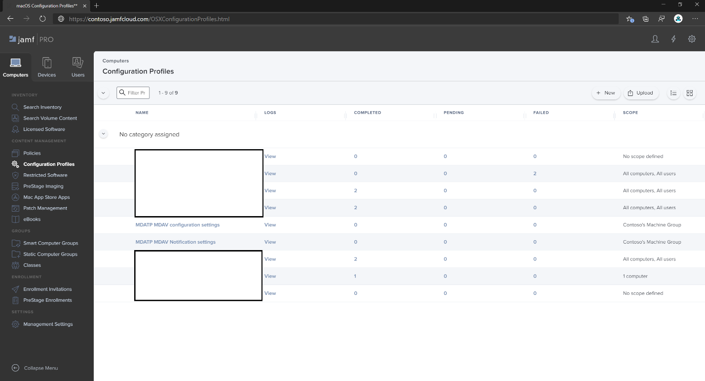
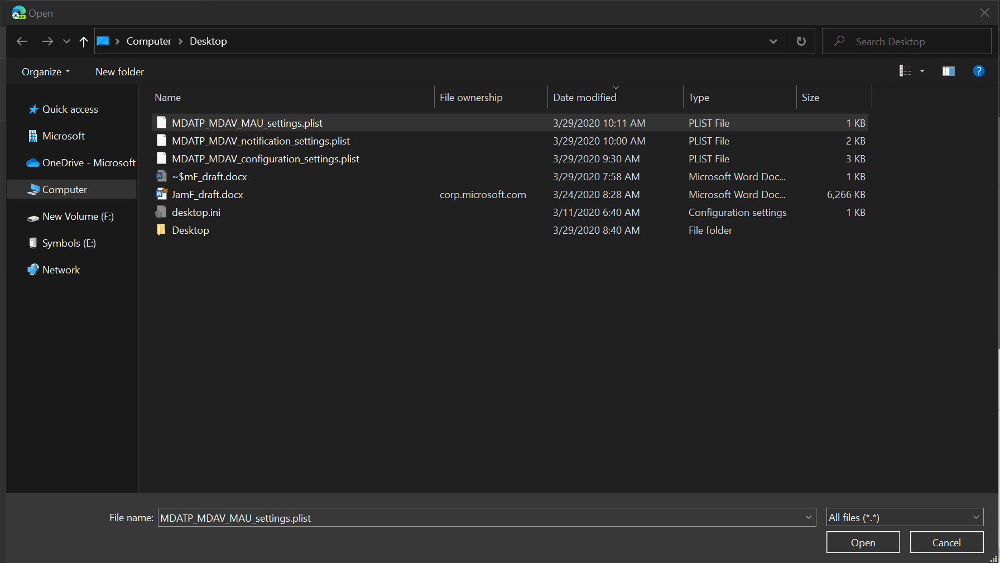
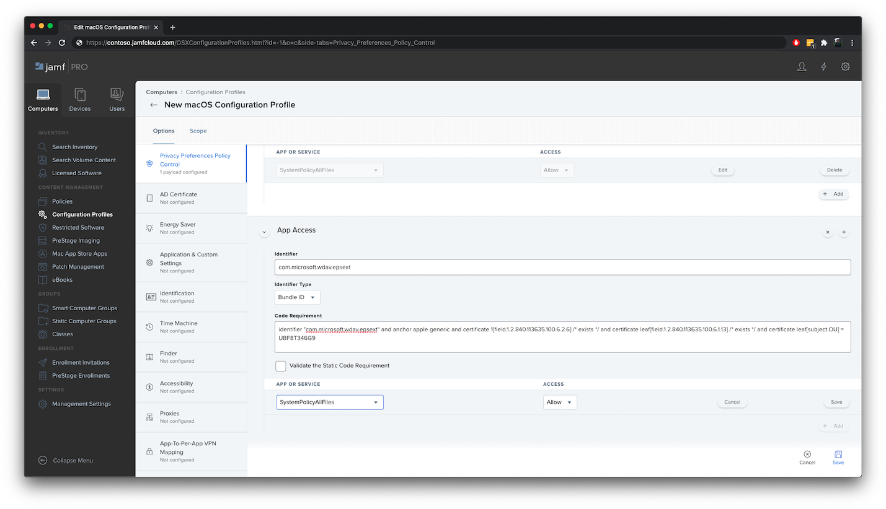

# <a name="set-up-the-microsoft-defender-for-endpoint-on-macos-policies-in-jamf-pro"></a><span data-ttu-id="85107-104">在 Jamf Pro 的 macOS 原則上設定 Microsoft Defender for Endpoint</span><span class="sxs-lookup"><span data-stu-id="85107-104">Set up the Microsoft Defender for Endpoint on macOS policies in Jamf Pro</span></span>

[!INCLUDE [Microsoft 365 Defender rebranding](../../includes/microsoft-defender.md)]


<span data-ttu-id="85107-105">**適用於：**</span><span class="sxs-lookup"><span data-stu-id="85107-105">**Applies to:**</span></span>

- [<span data-ttu-id="85107-106">Mac 版端點的 Defender</span><span class="sxs-lookup"><span data-stu-id="85107-106">Defender for Endpoint on Mac</span></span>](microsoft-defender-endpoint-mac.md)

<span data-ttu-id="85107-107">此頁面會引導您完成在 Jamf Pro 中設定 macOS 原則所需採取的步驟。</span><span class="sxs-lookup"><span data-stu-id="85107-107">This page will guide you through the steps you need to take to set up macOS policies in Jamf Pro.</span></span>

<span data-ttu-id="85107-108">您必須採取下列步驟：</span><span class="sxs-lookup"><span data-stu-id="85107-108">You'll need to take the following steps:</span></span>

1. [<span data-ttu-id="85107-109">取得 Microsoft Defender for Endpoint 上架套件</span><span class="sxs-lookup"><span data-stu-id="85107-109">Get the Microsoft Defender for Endpoint onboarding package</span></span>](#step-1-get-the-microsoft-defender-for-endpoint-onboarding-package)

2. [<span data-ttu-id="85107-110">使用上架套件在 Jamf Pro 中建立設定檔</span><span class="sxs-lookup"><span data-stu-id="85107-110">Create a configuration profile in Jamf Pro using the onboarding package</span></span>](#step-2-create-a-configuration-profile-in-jamf-pro-using-the-onboarding-package)

3. [<span data-ttu-id="85107-111">設定 Microsoft Defender for Endpoint 設定</span><span class="sxs-lookup"><span data-stu-id="85107-111">Configure Microsoft Defender for Endpoint settings</span></span>](#step-3-configure-microsoft-defender-for-endpoint-settings)

4. [<span data-ttu-id="85107-112">設定 Microsoft Defender for Endpoint notification 設定</span><span class="sxs-lookup"><span data-stu-id="85107-112">Configure Microsoft Defender for Endpoint notification settings</span></span>](#step-4-configure-notifications-settings)

5. [<span data-ttu-id="85107-113">設定 Microsoft AutoUpdate (MAU) </span><span class="sxs-lookup"><span data-stu-id="85107-113">Configure Microsoft AutoUpdate (MAU)</span></span>](#step-5-configure-microsoft-autoupdate-mau)

6. [<span data-ttu-id="85107-114">授與 Microsoft Defender for Endpoint 的完整磁片存取權</span><span class="sxs-lookup"><span data-stu-id="85107-114">Grant full disk access to Microsoft Defender for Endpoint</span></span>](#step-6-grant-full-disk-access-to-microsoft-defender-for-endpoint)

7. [<span data-ttu-id="85107-115">核准 Microsoft Defender for Endpoint 的內核擴充</span><span class="sxs-lookup"><span data-stu-id="85107-115">Approve Kernel extension for Microsoft Defender for Endpoint</span></span>](#step-7-approve-kernel-extension-for-microsoft-defender-for-endpoint)

8. [<span data-ttu-id="85107-116">核准 Microsoft Defender for Endpoint 的系統擴充</span><span class="sxs-lookup"><span data-stu-id="85107-116">Approve System extensions for Microsoft Defender for Endpoint</span></span>](#step-8-approve-system-extensions-for-microsoft-defender-for-endpoint)

9. [<span data-ttu-id="85107-117">設定網路擴充</span><span class="sxs-lookup"><span data-stu-id="85107-117">Configure Network Extension</span></span>](#step-9-configure-network-extension)

10. [<span data-ttu-id="85107-118">在 macOS 上使用 Microsoft Defender for Endpoint 排程掃描</span><span class="sxs-lookup"><span data-stu-id="85107-118">Schedule scans with Microsoft Defender for Endpoint on macOS</span></span>](https://docs.microsoft.com/windows/security/threat-protection/microsoft-defender-atp/mac-schedule-scan-atp)

11. [<span data-ttu-id="85107-119">在 macOS 上部署 Microsoft Defender for Endpoint</span><span class="sxs-lookup"><span data-stu-id="85107-119">Deploy Microsoft Defender for Endpoint on macOS</span></span>](#step-11-deploy-microsoft-defender-for-endpoint-on-macos)


## <a name="step-1-get-the-microsoft-defender-for-endpoint-onboarding-package"></a><span data-ttu-id="85107-120">步驟1：取得 Microsoft Defender for Endpoint 上架套件</span><span class="sxs-lookup"><span data-stu-id="85107-120">Step 1: Get the Microsoft Defender for Endpoint onboarding package</span></span>

1. <span data-ttu-id="85107-121">在 [Microsoft Defender Security Center](https://securitycenter.microsoft.com )中，流覽至 [ **設定] > 上架**。</span><span class="sxs-lookup"><span data-stu-id="85107-121">In [Microsoft Defender Security Center](https://securitycenter.microsoft.com ), navigate to **Settings > Onboarding**.</span></span> 

2. <span data-ttu-id="85107-122">選取 [macOS 為作業系統] 和 [行動裝置管理/Microsoft Intune] 做為部署方法。</span><span class="sxs-lookup"><span data-stu-id="85107-122">Select macOS as the operating system and Mobile Device Management / Microsoft Intune as the deployment method.</span></span>

    

3. <span data-ttu-id="85107-124">選取 [ (WindowsDefenderATPOnboardingPackage.zip) **下載上架套件** ]。</span><span class="sxs-lookup"><span data-stu-id="85107-124">Select **Download onboarding package** (WindowsDefenderATPOnboardingPackage.zip).</span></span>

4. <span data-ttu-id="85107-125">解壓縮 `WindowsDefenderATPOnboardingPackage.zip` 。</span><span class="sxs-lookup"><span data-stu-id="85107-125">Extract `WindowsDefenderATPOnboardingPackage.zip`.</span></span>

5. <span data-ttu-id="85107-126">將檔案複製到您的慣用位置。</span><span class="sxs-lookup"><span data-stu-id="85107-126">Copy the file to your preferred location.</span></span> <span data-ttu-id="85107-127">例如，  `C:\Users\JaneDoe_or_JohnDoe.contoso\Downloads\WindowsDefenderATPOnboardingPackage_macOS_MDM_contoso\jamf\WindowsDefenderATPOnboarding.plist`。</span><span class="sxs-lookup"><span data-stu-id="85107-127">For example,  `C:\Users\JaneDoe_or_JohnDoe.contoso\Downloads\WindowsDefenderATPOnboardingPackage_macOS_MDM_contoso\jamf\WindowsDefenderATPOnboarding.plist`.</span></span>


## <a name="step-2-create-a-configuration-profile-in-jamf-pro-using-the-onboarding-package"></a><span data-ttu-id="85107-128">步驟2：使用上架套件在 Jamf Pro 中建立設定檔</span><span class="sxs-lookup"><span data-stu-id="85107-128">Step 2: Create a configuration profile in Jamf Pro using the onboarding package</span></span>

1. <span data-ttu-id="85107-129">`WindowsDefenderATPOnboarding.plist`從上一節中找出檔。</span><span class="sxs-lookup"><span data-stu-id="85107-129">Locate the file `WindowsDefenderATPOnboarding.plist` from the previous section.</span></span>

   

 
2. <span data-ttu-id="85107-131">在 Jamf Pro 儀表板中，選取 [ **新增**]。</span><span class="sxs-lookup"><span data-stu-id="85107-131">In the Jamf Pro dashboard, select **New**.</span></span>

    

3. <span data-ttu-id="85107-133">輸入下列詳細資料：</span><span class="sxs-lookup"><span data-stu-id="85107-133">Enter the following details:</span></span>

   <span data-ttu-id="85107-134">**一般**</span><span class="sxs-lookup"><span data-stu-id="85107-134">**General**</span></span>
   - <span data-ttu-id="85107-135">名稱： MDATP 上架 macOS</span><span class="sxs-lookup"><span data-stu-id="85107-135">Name: MDATP onboarding for macOS</span></span>
   - <span data-ttu-id="85107-136">描述： macOS 的 MDATP EDR 上架</span><span class="sxs-lookup"><span data-stu-id="85107-136">Description: MDATP EDR onboarding for macOS</span></span>
   - <span data-ttu-id="85107-137">類別：無</span><span class="sxs-lookup"><span data-stu-id="85107-137">Category: None</span></span>
   - <span data-ttu-id="85107-138">分配方法：自動安裝</span><span class="sxs-lookup"><span data-stu-id="85107-138">Distribution Method: Install Automatically</span></span>
   - <span data-ttu-id="85107-139">層級：電腦層級</span><span class="sxs-lookup"><span data-stu-id="85107-139">Level: Computer Level</span></span>

4. <span data-ttu-id="85107-140">在 **應用程式 & 自訂設定** 中，選取 [ **設定**]。</span><span class="sxs-lookup"><span data-stu-id="85107-140">In **Application & Custom Settings** select **Configure**.</span></span>

    

5. <span data-ttu-id="85107-142">選取 **[ (PLIST 檔案) 上傳** 檔案]，然後在 [ **喜好設定功能變數名稱** ] 中輸入： `com.microsoft.wdav.atp` 。</span><span class="sxs-lookup"><span data-stu-id="85107-142">Select **Upload File (PLIST file)** then in **Preference Domain** enter: `com.microsoft.wdav.atp`.</span></span> 

    

    

7. <span data-ttu-id="85107-145">選取 [ **開啟** ]，然後選取上架檔案。</span><span class="sxs-lookup"><span data-stu-id="85107-145">Select **Open** and select the onboarding file.</span></span>

    

8. <span data-ttu-id="85107-147">選取 **[上傳**]。</span><span class="sxs-lookup"><span data-stu-id="85107-147">Select **Upload**.</span></span> 

    


9. <span data-ttu-id="85107-149">選取 [ **範圍** ] 索引標籤。</span><span class="sxs-lookup"><span data-stu-id="85107-149">Select the **Scope** tab.</span></span>

    ![範圍] 索引標籤的影像](images/jamfpro-scope-tab.png)

10. <span data-ttu-id="85107-151">選取目的電腦。</span><span class="sxs-lookup"><span data-stu-id="85107-151">Select the target computers.</span></span>

    

     

11. <span data-ttu-id="85107-154">選取 [儲存]。</span><span class="sxs-lookup"><span data-stu-id="85107-154">Select **Save**.</span></span>

    

    

12. <span data-ttu-id="85107-157">選取 **[完成]**。</span><span class="sxs-lookup"><span data-stu-id="85107-157">Select **Done**.</span></span>

    

    

## <a name="step-3-configure-microsoft-defender-for-endpoint-settings"></a><span data-ttu-id="85107-160">步驟3：設定 Microsoft Defender for Endpoint 設定</span><span class="sxs-lookup"><span data-stu-id="85107-160">Step 3: Configure Microsoft Defender for Endpoint settings</span></span>

1.  <span data-ttu-id="85107-161">使用下列 Microsoft Defender for Endpoint configuration 設定：</span><span class="sxs-lookup"><span data-stu-id="85107-161">Use the following Microsoft Defender for Endpoint configuration settings:</span></span>

    - <span data-ttu-id="85107-162">enableRealTimeProtection</span><span class="sxs-lookup"><span data-stu-id="85107-162">enableRealTimeProtection</span></span>
    - <span data-ttu-id="85107-163">passiveMode</span><span class="sxs-lookup"><span data-stu-id="85107-163">passiveMode</span></span>
    
    >[!NOTE]
    ><span data-ttu-id="85107-164">預設未開啟，如果您打算為 macOS 執行協力廠商 AV，請將其設為 `true` 。</span><span class="sxs-lookup"><span data-stu-id="85107-164">Not turned on by default, if you are planning to run a third-party AV for macOS, set it to `true`.</span></span>

    - <span data-ttu-id="85107-165">排除</span><span class="sxs-lookup"><span data-stu-id="85107-165">exclusions</span></span>
    - <span data-ttu-id="85107-166">excludedPath</span><span class="sxs-lookup"><span data-stu-id="85107-166">excludedPath</span></span>
    - <span data-ttu-id="85107-167">excludedFileExtension</span><span class="sxs-lookup"><span data-stu-id="85107-167">excludedFileExtension</span></span>
    - <span data-ttu-id="85107-168">excludedFileName</span><span class="sxs-lookup"><span data-stu-id="85107-168">excludedFileName</span></span>
    - <span data-ttu-id="85107-169">exclusionsMergePolicy</span><span class="sxs-lookup"><span data-stu-id="85107-169">exclusionsMergePolicy</span></span>
    - <span data-ttu-id="85107-170">allowedThreats</span><span class="sxs-lookup"><span data-stu-id="85107-170">allowedThreats</span></span>
    
    >[!NOTE]
    ><span data-ttu-id="85107-171">EICAR.TXT 位於範例上，如果您想要透過概念證明，請將它移除，尤其是在您測試 EICAR.TXT 時。</span><span class="sxs-lookup"><span data-stu-id="85107-171">EICAR is on the sample, if you are going through a proof-of-concept, remove it especially if you are testing EICAR.</span></span>
        
    - <span data-ttu-id="85107-172">disallowedThreatActions</span><span class="sxs-lookup"><span data-stu-id="85107-172">disallowedThreatActions</span></span>
    - <span data-ttu-id="85107-173">potentially_unwanted_application</span><span class="sxs-lookup"><span data-stu-id="85107-173">potentially_unwanted_application</span></span>
    - <span data-ttu-id="85107-174">archive_bomb</span><span class="sxs-lookup"><span data-stu-id="85107-174">archive_bomb</span></span>
    - <span data-ttu-id="85107-175">cloudService</span><span class="sxs-lookup"><span data-stu-id="85107-175">cloudService</span></span>
    - <span data-ttu-id="85107-176">automaticSampleSubmission</span><span class="sxs-lookup"><span data-stu-id="85107-176">automaticSampleSubmission</span></span>
    - <span data-ttu-id="85107-177">標籤</span><span class="sxs-lookup"><span data-stu-id="85107-177">tags</span></span>
    - <span data-ttu-id="85107-178">hideStatusMenuIcon</span><span class="sxs-lookup"><span data-stu-id="85107-178">hideStatusMenuIcon</span></span>
    
     <span data-ttu-id="85107-179">如需詳細資訊，請參閱 [Jamf 設定檔的屬性清單](mac-preferences.md#property-list-for-jamf-configuration-profile)。</span><span class="sxs-lookup"><span data-stu-id="85107-179">For information, see [Property list for Jamf configuration profile](mac-preferences.md#property-list-for-jamf-configuration-profile).</span></span>

     ```XML
     <?xml version="1.0" encoding="UTF-8"?>
     <!DOCTYPE plist PUBLIC "-//Apple//DTD PLIST 1.0//EN" "http://www.apple.com/DTDs/PropertyList-1.0.dtd">
     <plist version="1.0">
     <dict>
         <key>antivirusEngine</key>
         <dict>
             <key>enableRealTimeProtection</key>
             <true/>
             <key>passiveMode</key>
             <false/>
             <key>exclusions</key>
             <array>
                 <dict>
                     <key>$type</key>
                     <string>excludedPath</string>
                     <key>isDirectory</key>
                     <false/>
                     <key>path</key>
                     <string>/var/log/system.log</string>
                 </dict>
                 <dict>
                     <key>$type</key>
                     <string>excludedPath</string>
                     <key>isDirectory</key>
                     <true/>
                     <key>path</key>
                     <string>/home</string>
                 </dict>
                 <dict>
                     <key>$type</key>
                     <string>excludedFileExtension</string>
                     <key>extension</key>
                     <string>pdf</string>
                 </dict>
                 <dict>
                     <key>$type</key>
                     <string>excludedFileName</string>
                     <key>name</key>
                     <string>cat</string>
                 </dict>
             </array>
             <key>exclusionsMergePolicy</key>
             <string>merge</string>
             <key>allowedThreats</key>
             <array>
                 <string>EICAR-Test-File (not a virus)</string>
             </array>
             <key>disallowedThreatActions</key>
             <array>
                 <string>allow</string>
                 <string>restore</string>
             </array>
             <key>threatTypeSettings</key>
             <array>
                 <dict>
                     <key>key</key>
                     <string>potentially_unwanted_application</string>
                     <key>value</key>
                     <string>block</string>
                 </dict>
                 <dict>
                     <key>key</key>
                     <string>archive_bomb</string>
                     <key>value</key>
                     <string>audit</string>
                 </dict>
             </array>
             <key>threatTypeSettingsMergePolicy</key>
             <string>merge</string>
         </dict>
         <key>cloudService</key>
         <dict>
             <key>enabled</key>
             <true/>
             <key>diagnosticLevel</key>
             <string>optional</string>
             <key>automaticSampleSubmission</key>
             <true/>
         </dict>
         <key>edr</key>
         <dict>
             <key>tags</key>
             <array>
                 <dict>
                     <key>key</key>
                     <string>GROUP</string>
                     <key>value</key>
                     <string>ExampleTag</string>
                 </dict>
             </array>
         </dict>
         <key>userInterface</key>
         <dict>
             <key>hideStatusMenuIcon</key>
             <false/>
         </dict>
     </dict>
     </plist>
     ```

2. <span data-ttu-id="85107-180">將檔案儲存為 `MDATP_MDAV_configuration_settings.plist` 。</span><span class="sxs-lookup"><span data-stu-id="85107-180">Save the file as `MDATP_MDAV_configuration_settings.plist`.</span></span>


3.  <span data-ttu-id="85107-181">在 Jamf Pro 儀表板中，選取 **[一般**]。</span><span class="sxs-lookup"><span data-stu-id="85107-181">In the Jamf Pro dashboard, select **General**.</span></span>

    

4. <span data-ttu-id="85107-183">輸入下列詳細資料：</span><span class="sxs-lookup"><span data-stu-id="85107-183">Enter the following details:</span></span>

    <span data-ttu-id="85107-184">**一般**</span><span class="sxs-lookup"><span data-stu-id="85107-184">**General**</span></span>
    
    - <span data-ttu-id="85107-185">名稱： MDATP MDAV 設定設定</span><span class="sxs-lookup"><span data-stu-id="85107-185">Name: MDATP MDAV configuration settings</span></span>
    - <span data-ttu-id="85107-186">描述：\<blank\></span><span class="sxs-lookup"><span data-stu-id="85107-186">Description:\<blank\></span></span>
    - <span data-ttu-id="85107-187">類別：無 (預設) </span><span class="sxs-lookup"><span data-stu-id="85107-187">Category: None (default)</span></span>
    - <span data-ttu-id="85107-188">分配方法：自動安裝 (預設) </span><span class="sxs-lookup"><span data-stu-id="85107-188">Distribution Method: Install Automatically(default)</span></span>
    - <span data-ttu-id="85107-189">層級：電腦層級 (預設) </span><span class="sxs-lookup"><span data-stu-id="85107-189">Level: Computer Level(default)</span></span>

    

5. <span data-ttu-id="85107-191">在 **應用程式 & 自訂設定** 中，選取 [ **設定**]。</span><span class="sxs-lookup"><span data-stu-id="85107-191">In **Application & Custom Settings** select **Configure**.</span></span>

    

6. <span data-ttu-id="85107-193">選取 **[上傳檔案 (PLIST** 檔案]) 。</span><span class="sxs-lookup"><span data-stu-id="85107-193">Select **Upload File (PLIST file)**.</span></span>

    

7. <span data-ttu-id="85107-195">在 [ **喜好設定網域**] 中，輸入 `com.microsoft.wdav` ，然後選取  **[上傳 PLIST** 檔案]。</span><span class="sxs-lookup"><span data-stu-id="85107-195">In **Preferences Domain**, enter `com.microsoft.wdav`, then select  **Upload PLIST File**.</span></span>

    

8. <span data-ttu-id="85107-197">選取 **[選擇檔**]。</span><span class="sxs-lookup"><span data-stu-id="85107-197">Select **Choose File**.</span></span>

    ![設定的配置圖像選擇 [檔案]](images/526e978761fc571cca06907da7b01fd6.png)

9. <span data-ttu-id="85107-199">選取 **MDATP_MDAV_configuration_settings plist**，然後選取 [ **開啟**]。</span><span class="sxs-lookup"><span data-stu-id="85107-199">Select the **MDATP_MDAV_configuration_settings.plist**, then select **Open**.</span></span>

    

10. <span data-ttu-id="85107-201">選取 **[上傳**]。</span><span class="sxs-lookup"><span data-stu-id="85107-201">Select **Upload**.</span></span>

    

    

    >[!NOTE]
    ><span data-ttu-id="85107-204">如果您要上傳 Intune 檔案，您會收到下列錯誤：</span><span class="sxs-lookup"><span data-stu-id="85107-204">If you happen to upload the Intune file, you'll get the following error:</span></span><br>
    ><span data-ttu-id="85107-205"></span><span class="sxs-lookup"><span data-stu-id="85107-205"></span></span>


11. <span data-ttu-id="85107-206">選取 [儲存]。</span><span class="sxs-lookup"><span data-stu-id="85107-206">Select **Save**.</span></span> 

    

12. <span data-ttu-id="85107-208">檔案上傳。</span><span class="sxs-lookup"><span data-stu-id="85107-208">The file is uploaded.</span></span>

    

    

13. <span data-ttu-id="85107-211">選取 [ **範圍** ] 索引標籤。</span><span class="sxs-lookup"><span data-stu-id="85107-211">Select the **Scope** tab.</span></span>

    

14. <span data-ttu-id="85107-213">選取 [ **Contoso 的電腦群組**]。</span><span class="sxs-lookup"><span data-stu-id="85107-213">Select **Contoso's Machine Group**.</span></span> 

15. <span data-ttu-id="85107-214">選取 [ **新增**]，然後選取 [ **儲存**]。</span><span class="sxs-lookup"><span data-stu-id="85107-214">Select **Add**, then select **Save**.</span></span>

    

    

16. <span data-ttu-id="85107-217">選取 **[完成]**。</span><span class="sxs-lookup"><span data-stu-id="85107-217">Select **Done**.</span></span> <span data-ttu-id="85107-218">您將會看到新的設定 **設定檔**。</span><span class="sxs-lookup"><span data-stu-id="85107-218">You'll see the new **Configuration profile**.</span></span>

    


## <a name="step-4-configure-notifications-settings"></a><span data-ttu-id="85107-220">步驟4：設定通知設定</span><span class="sxs-lookup"><span data-stu-id="85107-220">Step 4: Configure notifications settings</span></span>

<span data-ttu-id="85107-221">這些步驟適用于 macOS 10.15 (Catalina) 或更新版本。</span><span class="sxs-lookup"><span data-stu-id="85107-221">These steps are applicable of macOS 10.15 (Catalina) or newer.</span></span>

1. <span data-ttu-id="85107-222">在 Jamf Pro 儀表板中，選取 [ **電腦**]，然後選取 [設定 **設定檔**]。</span><span class="sxs-lookup"><span data-stu-id="85107-222">In the Jamf Pro dashboard, select **Computers**, then **Configuration Profiles**.</span></span>

2. <span data-ttu-id="85107-223">按一下 [ **新增**]，然後輸入下列 **選項** 的詳細資料：</span><span class="sxs-lookup"><span data-stu-id="85107-223">Click **New**, and enter the following details for **Options**:</span></span>
    
    - <span data-ttu-id="85107-224">索引標籤 **一般**：</span><span class="sxs-lookup"><span data-stu-id="85107-224">Tab **General**:</span></span> 
        - <span data-ttu-id="85107-225">**名稱**： MDATP MDAV 通知設定</span><span class="sxs-lookup"><span data-stu-id="85107-225">**Name**: MDATP MDAV Notification settings</span></span>
        - <span data-ttu-id="85107-226">**描述**： macOS 10.15 (Catalina) 或更新版本</span><span class="sxs-lookup"><span data-stu-id="85107-226">**Description**: macOS 10.15 (Catalina) or newer</span></span>
        - <span data-ttu-id="85107-227">**類別**：無 *(預設)*</span><span class="sxs-lookup"><span data-stu-id="85107-227">**Category**: None *(default)*</span></span>
        - <span data-ttu-id="85107-228">**分配方法**：自動安裝 *(預設)*</span><span class="sxs-lookup"><span data-stu-id="85107-228">**Distribution Method**: Install Automatically *(default)*</span></span>
        - <span data-ttu-id="85107-229">**層級**：電腦層級 *(預設)*</span><span class="sxs-lookup"><span data-stu-id="85107-229">**Level**: Computer Level *(default)*</span></span>

        

    - <span data-ttu-id="85107-231">[索引標籤 **通知**] 中，按一下 [ **新增**]，然後輸入下列值：</span><span class="sxs-lookup"><span data-stu-id="85107-231">Tab **Notifications**, click **Add**, and enter the following values:</span></span>
        - <span data-ttu-id="85107-232">**束識別碼**： `com.microsoft.wdav.tray`</span><span class="sxs-lookup"><span data-stu-id="85107-232">**Bundle ID**: `com.microsoft.wdav.tray`</span></span>
        - <span data-ttu-id="85107-233">**嚴重警示**：按一下 [**停** 用]</span><span class="sxs-lookup"><span data-stu-id="85107-233">**Critical Alerts**: Click **Disable**</span></span>
        - <span data-ttu-id="85107-234">**通知**：按一下 [**啟用**]</span><span class="sxs-lookup"><span data-stu-id="85107-234">**Notifications**: Click **Enable**</span></span>
        - <span data-ttu-id="85107-235">**橫幅警示類型**：選取 [ **包含** 與 **臨時** *(預設值])*</span><span class="sxs-lookup"><span data-stu-id="85107-235">**Banner alert type**: Select **Include** and **Temporary** *(default)*</span></span>
        - <span data-ttu-id="85107-236">**鎖定畫面上的通知**：按一下 [**隱藏**]</span><span class="sxs-lookup"><span data-stu-id="85107-236">**Notifications on lock screen**: Click **Hide**</span></span>
        - <span data-ttu-id="85107-237">**通知中心的通知**：按一下 [**顯示**]</span><span class="sxs-lookup"><span data-stu-id="85107-237">**Notifications in Notification Center**: Click **Display**</span></span>
        - <span data-ttu-id="85107-238">**徽章應用程式圖示**：按一下 [**顯示**]</span><span class="sxs-lookup"><span data-stu-id="85107-238">**Badge app icon**: Click **Display**</span></span>

        

    - <span data-ttu-id="85107-240">索引標籤 **通知**，請按一下 [ **增加** 一次]，向下滾動至 **新的通知設定**</span><span class="sxs-lookup"><span data-stu-id="85107-240">Tab **Notifications**, click **Add** one more time, scroll down to **New Notifications Settings**</span></span>
        - <span data-ttu-id="85107-241">**束識別碼**： `com.microsoft.autoupdate2`</span><span class="sxs-lookup"><span data-stu-id="85107-241">**Bundle ID**: `com.microsoft.autoupdate2`</span></span>
        - <span data-ttu-id="85107-242">將其餘設定設定為與上述值相同</span><span class="sxs-lookup"><span data-stu-id="85107-242">Configure the rest of the settings to the same values as above</span></span>

        

        <span data-ttu-id="85107-244">請注意，現在有兩個「資料表」具有通知設定，一個用於 **捆綁 ID: wdav**，另一個用於 **ID: autoupdate2 的捆綁**。</span><span class="sxs-lookup"><span data-stu-id="85107-244">Note that now you have two 'tables' with notification configurations, one for **Bundle ID: com.microsoft.wdav.tray**, and another for **Bundle ID: com.microsoft.autoupdate2**.</span></span> <span data-ttu-id="85107-245">雖然您可以根據您的需求來設定警示設定，但捆綁 IDs 必須與之前所述完全相同，且 **包含** 參數必須 **開啟** 以取得 **通知**。</span><span class="sxs-lookup"><span data-stu-id="85107-245">While you can configure alert settings per your requirements, Bundle IDs must be exactly the same as described before, and **Include** switch must be **On** for **Notifications**.</span></span>

3. <span data-ttu-id="85107-246">選取 [ **範圍** ] 索引標籤，然後選取 [ **新增**]。</span><span class="sxs-lookup"><span data-stu-id="85107-246">Select the **Scope** tab, then select **Add**.</span></span>

    

4. <span data-ttu-id="85107-248">選取 [ **Contoso 的電腦群組**]。</span><span class="sxs-lookup"><span data-stu-id="85107-248">Select **Contoso's Machine Group**.</span></span> 

5. <span data-ttu-id="85107-249">選取 [ **新增**]，然後選取 [ **儲存**]。</span><span class="sxs-lookup"><span data-stu-id="85107-249">Select **Add**, then select **Save**.</span></span>
    
    
    
    

6. <span data-ttu-id="85107-252">選取 **[完成]**。</span><span class="sxs-lookup"><span data-stu-id="85107-252">Select **Done**.</span></span> <span data-ttu-id="85107-253">您將會看到新的設定 **設定檔**。</span><span class="sxs-lookup"><span data-stu-id="85107-253">You'll see the new **Configuration profile**.</span></span>
    <span data-ttu-id="85107-254"></span><span class="sxs-lookup"><span data-stu-id="85107-254"></span></span>

## <a name="step-5-configure-microsoft-autoupdate-mau"></a><span data-ttu-id="85107-255">步驟5：設定 Microsoft AutoUpdate (MAU) </span><span class="sxs-lookup"><span data-stu-id="85107-255">Step 5: Configure Microsoft AutoUpdate (MAU)</span></span>

1. <span data-ttu-id="85107-256">使用下列 Microsoft Defender for Endpoint configuration 設定：</span><span class="sxs-lookup"><span data-stu-id="85107-256">Use the following Microsoft Defender for Endpoint configuration settings:</span></span>

      ```XML
   <?xml version="1.0" encoding="UTF-8"?>
   <!DOCTYPE plist PUBLIC "-//Apple//DTD PLIST 1.0//EN" "http://www.apple.com/DTDs/PropertyList-1.0.dtd">
   <plist version="1.0">
   <dict>
    <key>ChannelName</key>
    <string>Current</string>
    <key>HowToCheck</key>
    <string>AutomaticDownload</string>
    <key>EnableCheckForUpdatesButton</key>
    <true/>
    <key>DisableInsiderCheckbox</key>
    <false/>
    <key>SendAllTelemetryEnabled</key>
    <true/>
   </dict>
   </plist>
   ```

2. <span data-ttu-id="85107-257">將其儲存為 `MDATP_MDAV_MAU_settings.plist` 。</span><span class="sxs-lookup"><span data-stu-id="85107-257">Save it as `MDATP_MDAV_MAU_settings.plist`.</span></span>

3. <span data-ttu-id="85107-258">在 Jamf Pro 儀表板中，選取 **[一般**]。</span><span class="sxs-lookup"><span data-stu-id="85107-258">In the Jamf Pro dashboard, select **General**.</span></span> 

    

4. <span data-ttu-id="85107-260">輸入下列詳細資料：</span><span class="sxs-lookup"><span data-stu-id="85107-260">Enter the following details:</span></span>

    <span data-ttu-id="85107-261">**一般**</span><span class="sxs-lookup"><span data-stu-id="85107-261">**General**</span></span> 
    
    - <span data-ttu-id="85107-262">名稱： MDATP MDAV MAU 設定</span><span class="sxs-lookup"><span data-stu-id="85107-262">Name: MDATP MDAV MAU settings</span></span>
    - <span data-ttu-id="85107-263">描述： macOS 的 MDATP 的 Microsoft AutoUpdate 設定</span><span class="sxs-lookup"><span data-stu-id="85107-263">Description: Microsoft AutoUpdate settings for MDATP for macOS</span></span>
    - <span data-ttu-id="85107-264">類別：無 (預設) </span><span class="sxs-lookup"><span data-stu-id="85107-264">Category: None (default)</span></span>
    - <span data-ttu-id="85107-265">分配方法：自動安裝 (預設) </span><span class="sxs-lookup"><span data-stu-id="85107-265">Distribution Method: Install Automatically(default)</span></span>
    - <span data-ttu-id="85107-266">層級：電腦層級 (預設) </span><span class="sxs-lookup"><span data-stu-id="85107-266">Level: Computer Level(default)</span></span>

5. <span data-ttu-id="85107-267">在 **應用程式 & 自訂設定** 中，選取 [ **設定**]。</span><span class="sxs-lookup"><span data-stu-id="85107-267">In **Application & Custom Settings** select **Configure**.</span></span>

    

6. <span data-ttu-id="85107-269">選取 **[上傳檔案 (PLIST** 檔案]) 。</span><span class="sxs-lookup"><span data-stu-id="85107-269">Select **Upload File (PLIST file)**.</span></span>

      

7. <span data-ttu-id="85107-271">在 [ **喜好設定網域** ] 中輸入： `com.microsoft.autoupdate2` ，然後選取 **[上傳 PLIST** 檔案]。</span><span class="sxs-lookup"><span data-stu-id="85107-271">In **Preference Domain** enter: `com.microsoft.autoupdate2`, then select **Upload PLIST File**.</span></span>

    

8. <span data-ttu-id="85107-273">選取 **[選擇檔**]。</span><span class="sxs-lookup"><span data-stu-id="85107-273">Select **Choose File**.</span></span>

    

9. <span data-ttu-id="85107-275">選取 **MDATP_MDAV_MAU_settings plist**。</span><span class="sxs-lookup"><span data-stu-id="85107-275">Select **MDATP_MDAV_MAU_settings.plist**.</span></span>

    

10. <span data-ttu-id="85107-277">選取 **[上傳**]。</span><span class="sxs-lookup"><span data-stu-id="85107-277">Select **Upload**.</span></span>
    <span data-ttu-id="85107-278"></span><span class="sxs-lookup"><span data-stu-id="85107-278"></span></span>

    

11. <span data-ttu-id="85107-280">選取 [儲存]。</span><span class="sxs-lookup"><span data-stu-id="85107-280">Select **Save**.</span></span>

    

12. <span data-ttu-id="85107-282">選取 [ **範圍** ] 索引標籤。</span><span class="sxs-lookup"><span data-stu-id="85107-282">Select the **Scope** tab.</span></span>
   
     

13. <span data-ttu-id="85107-284">選取 [新增]。</span><span class="sxs-lookup"><span data-stu-id="85107-284">Select **Add**.</span></span>
    
    

    

    

14. <span data-ttu-id="85107-288">選取 **[完成]**。</span><span class="sxs-lookup"><span data-stu-id="85107-288">Select **Done**.</span></span>
    
    

## <a name="step-6-grant-full-disk-access-to-microsoft-defender-for-endpoint"></a><span data-ttu-id="85107-290">步驟6：授與 Microsoft Defender for Endpoint 的完整磁片存取權</span><span class="sxs-lookup"><span data-stu-id="85107-290">Step 6: Grant full disk access to Microsoft Defender for Endpoint</span></span>

1. <span data-ttu-id="85107-291">在 Jamf Pro 儀表板中，選取 [設定 **設定檔**]。</span><span class="sxs-lookup"><span data-stu-id="85107-291">In the Jamf Pro dashboard, select **Configuration Profiles**.</span></span>

    

2. <span data-ttu-id="85107-293">選取 [ **+ 新增**]。</span><span class="sxs-lookup"><span data-stu-id="85107-293">Select **+ New**.</span></span> 

3. <span data-ttu-id="85107-294">輸入下列詳細資料：</span><span class="sxs-lookup"><span data-stu-id="85107-294">Enter the following details:</span></span>

    <span data-ttu-id="85107-295">**一般**</span><span class="sxs-lookup"><span data-stu-id="85107-295">**General**</span></span> 
    - <span data-ttu-id="85107-296">名稱： MDATP MDAV-對 EDR 和 AV 授與完整磁片存取權</span><span class="sxs-lookup"><span data-stu-id="85107-296">Name: MDATP MDAV - grant Full Disk Access to EDR and AV</span></span>
    - <span data-ttu-id="85107-297">描述：在 macOS Catalina 或更新版本上，新增隱私權偏好設定原則控制</span><span class="sxs-lookup"><span data-stu-id="85107-297">Description: On macOS Catalina or newer, the new Privacy Preferences Policy Control</span></span>
    - <span data-ttu-id="85107-298">類別：無</span><span class="sxs-lookup"><span data-stu-id="85107-298">Category: None</span></span>
    - <span data-ttu-id="85107-299">分配方法：自動安裝</span><span class="sxs-lookup"><span data-stu-id="85107-299">Distribution method: Install Automatically</span></span>
    - <span data-ttu-id="85107-300">層級：電腦層級</span><span class="sxs-lookup"><span data-stu-id="85107-300">Level: Computer level</span></span>


    

4. <span data-ttu-id="85107-302">在 [ **設定隱私權偏好設定原則控制** ] 中，選取 [ **設定**]。</span><span class="sxs-lookup"><span data-stu-id="85107-302">In **Configure Privacy Preferences Policy Control** select **Configure**.</span></span>

    

5. <span data-ttu-id="85107-304">在 [ **隱私權偏好設定原則**] 中，輸入下列詳細資料：</span><span class="sxs-lookup"><span data-stu-id="85107-304">In **Privacy Preferences Policy Control**, enter the following details:</span></span>

    - <span data-ttu-id="85107-305">識別碼： `com.microsoft.wdav`</span><span class="sxs-lookup"><span data-stu-id="85107-305">Identifier: `com.microsoft.wdav`</span></span>
    - <span data-ttu-id="85107-306">識別碼類型：束識別碼</span><span class="sxs-lookup"><span data-stu-id="85107-306">Identifier Type: Bundle ID</span></span>
    - <span data-ttu-id="85107-307">程式碼需求： `identifier "com.microsoft.wdav" and anchor apple generic and certificate 1[field.1.2.840.113635.100.6.2.6] /* exists */ and certificate leaf[field.1.2.840.113635.100.6.1.13] /* exists */ and certificate leaf[subject.OU] = UBF8T346G9`</span><span class="sxs-lookup"><span data-stu-id="85107-307">Code Requirement: `identifier "com.microsoft.wdav" and anchor apple generic and certificate 1[field.1.2.840.113635.100.6.2.6] /* exists */ and certificate leaf[field.1.2.840.113635.100.6.1.13] /* exists */ and certificate leaf[subject.OU] = UBF8T346G9`</span></span>


    

6. <span data-ttu-id="85107-309">選取 **[+ 新增]**。</span><span class="sxs-lookup"><span data-stu-id="85107-309">Select **+ Add**.</span></span>

    

    - <span data-ttu-id="85107-311">在應用程式或服務中：設定為 **SystemPolicyAllFiles**</span><span class="sxs-lookup"><span data-stu-id="85107-311">Under App or service: Set to **SystemPolicyAllFiles**</span></span>

    - <span data-ttu-id="85107-312">在 [access] 底下：設定為 **允許**</span><span class="sxs-lookup"><span data-stu-id="85107-312">Under "access": Set to **Allow**</span></span>

7. <span data-ttu-id="85107-313">選取 [ **儲存** (]，而不是位於右下方) 。</span><span class="sxs-lookup"><span data-stu-id="85107-313">Select **Save** (not the one at the bottom right).</span></span>

    

8. <span data-ttu-id="85107-315">按一下 [ `+` **應用程式存取** ] 旁的符號，以加入新的專案。</span><span class="sxs-lookup"><span data-stu-id="85107-315">Click the `+` sign next to **App Access** to add a new entry.</span></span>

    

9. <span data-ttu-id="85107-317">輸入下列詳細資料：</span><span class="sxs-lookup"><span data-stu-id="85107-317">Enter the following details:</span></span>

    - <span data-ttu-id="85107-318">識別碼： `com.microsoft.wdav.epsext`</span><span class="sxs-lookup"><span data-stu-id="85107-318">Identifier: `com.microsoft.wdav.epsext`</span></span>
    - <span data-ttu-id="85107-319">識別碼類型：束識別碼</span><span class="sxs-lookup"><span data-stu-id="85107-319">Identifier Type: Bundle ID</span></span>
    - <span data-ttu-id="85107-320">程式碼需求： `identifier "com.microsoft.wdav.epsext" and anchor apple generic and certificate 1[field.1.2.840.113635.100.6.2.6] /* exists */ and certificate leaf[field.1.2.840.113635.100.6.1.13] /* exists */ and certificate leaf[subject.OU] = UBF8T346G9`</span><span class="sxs-lookup"><span data-stu-id="85107-320">Code Requirement: `identifier "com.microsoft.wdav.epsext" and anchor apple generic and certificate 1[field.1.2.840.113635.100.6.2.6] /* exists */ and certificate leaf[field.1.2.840.113635.100.6.1.13] /* exists */ and certificate leaf[subject.OU] = UBF8T346G9`</span></span>

10. <span data-ttu-id="85107-321">選取 **[+ 新增]**。</span><span class="sxs-lookup"><span data-stu-id="85107-321">Select **+ Add**.</span></span>

    

    - <span data-ttu-id="85107-323">在應用程式或服務中：設定為 **SystemPolicyAllFiles**</span><span class="sxs-lookup"><span data-stu-id="85107-323">Under App or service: Set to **SystemPolicyAllFiles**</span></span>

    - <span data-ttu-id="85107-324">在 [access] 底下：設定為 **允許**</span><span class="sxs-lookup"><span data-stu-id="85107-324">Under "access": Set to **Allow**</span></span>

11. <span data-ttu-id="85107-325">選取 [ **儲存** (]，而不是位於右下方) 。</span><span class="sxs-lookup"><span data-stu-id="85107-325">Select **Save** (not the one at the bottom right).</span></span>

    

12. <span data-ttu-id="85107-327">選取 [ **範圍** ] 索引標籤。</span><span class="sxs-lookup"><span data-stu-id="85107-327">Select the **Scope** tab.</span></span>

    

13. <span data-ttu-id="85107-329">選取 **[+ 新增]**。</span><span class="sxs-lookup"><span data-stu-id="85107-329">Select **+ Add**.</span></span>

    

14. <span data-ttu-id="85107-331">選取 [>**群組名稱**] 下的 [**電腦群組**] > 選取 [ **Contoso 的 MachineGroup**]。</span><span class="sxs-lookup"><span data-stu-id="85107-331">Select **Computer Groups** > under **Group Name** > select **Contoso's MachineGroup**.</span></span> 

    

15. <span data-ttu-id="85107-333">選取 [新增]。</span><span class="sxs-lookup"><span data-stu-id="85107-333">Select **Add**.</span></span> 

16. <span data-ttu-id="85107-334">選取 [儲存]。</span><span class="sxs-lookup"><span data-stu-id="85107-334">Select **Save**.</span></span> 
    
17. <span data-ttu-id="85107-335">選取 **[完成]**。</span><span class="sxs-lookup"><span data-stu-id="85107-335">Select **Done**.</span></span>
    
    
    
    

<span data-ttu-id="85107-338">或者，您也可以下載 [fulldisk](https://github.com/microsoft/mdatp-xplat/blob/master/macos/mobileconfig/profiles/fulldisk.mobileconfig) ，並將其上傳至 JAMF 設定檔，如 [使用 JAMF Pro 部署自訂設定設定檔中所述）。方法2：將設定檔上傳至 Jamf Pro](https://www.jamf.com/jamf-nation/articles/648/deploying-custom-configuration-profiles-using-jamf-pro)。</span><span class="sxs-lookup"><span data-stu-id="85107-338">Alternatively, you can download [fulldisk.mobileconfig](https://github.com/microsoft/mdatp-xplat/blob/master/macos/mobileconfig/profiles/fulldisk.mobileconfig) and upload it to JAMF Configuration Profiles as described in [Deploying Custom Configuration Profiles using Jamf Pro|Method 2: Upload a Configuration Profile to Jamf Pro](https://www.jamf.com/jamf-nation/articles/648/deploying-custom-configuration-profiles-using-jamf-pro).</span></span>

## <a name="step-7-approve-kernel-extension-for-microsoft-defender-for-endpoint"></a><span data-ttu-id="85107-339">步驟7：核准 Microsoft Defender for Endpoint 的內核擴充</span><span class="sxs-lookup"><span data-stu-id="85107-339">Step 7: Approve Kernel extension for Microsoft Defender for Endpoint</span></span>

> [!CAUTION]
> <span data-ttu-id="85107-340">Apple 矽 (M1) 裝置不支援 KEXT。</span><span class="sxs-lookup"><span data-stu-id="85107-340">Apple Silicon (M1) devices do not support KEXT.</span></span> <span data-ttu-id="85107-341">在這些裝置上安裝包含 KEXT 原則的設定檔將會失敗。</span><span class="sxs-lookup"><span data-stu-id="85107-341">Installation of a configuration profile consisting KEXT policies will fail on these devices.</span></span>

1. <span data-ttu-id="85107-342">在設定配置 **檔** 中，選取 [ **+ 新增**]。</span><span class="sxs-lookup"><span data-stu-id="85107-342">In the **Configuration Profiles**, select **+ New**.</span></span>

    

2. <span data-ttu-id="85107-344">輸入下列詳細資料：</span><span class="sxs-lookup"><span data-stu-id="85107-344">Enter the following details:</span></span>

    <span data-ttu-id="85107-345">**一般**</span><span class="sxs-lookup"><span data-stu-id="85107-345">**General**</span></span> 
    
    - <span data-ttu-id="85107-346">名稱： MDATP MDAV 內核擴充</span><span class="sxs-lookup"><span data-stu-id="85107-346">Name: MDATP MDAV Kernel Extension</span></span>
    - <span data-ttu-id="85107-347">描述： MDATP 內核擴充 (kext) </span><span class="sxs-lookup"><span data-stu-id="85107-347">Description: MDATP kernel extension (kext)</span></span>
    - <span data-ttu-id="85107-348">類別：無</span><span class="sxs-lookup"><span data-stu-id="85107-348">Category: None</span></span>
    - <span data-ttu-id="85107-349">分配方法：自動安裝</span><span class="sxs-lookup"><span data-stu-id="85107-349">Distribution Method: Install Automatically</span></span>
    - <span data-ttu-id="85107-350">層級：電腦層級</span><span class="sxs-lookup"><span data-stu-id="85107-350">Level: Computer Level</span></span>

    

3. <span data-ttu-id="85107-352">在 [ **設定核准的核心擴充** ] 中，選取 [ **設定**]。</span><span class="sxs-lookup"><span data-stu-id="85107-352">In **Configure Approved Kernel Extensions** select **Configure**.</span></span>

    

   
4. <span data-ttu-id="85107-354">在 **核准的內核擴充** 輸入下列詳細資料：</span><span class="sxs-lookup"><span data-stu-id="85107-354">In **Approved Kernel Extensions** Enter the following details:</span></span>

    - <span data-ttu-id="85107-355">顯示名稱： Microsoft Corp。</span><span class="sxs-lookup"><span data-stu-id="85107-355">Display Name: Microsoft Corp.</span></span>
    - <span data-ttu-id="85107-356">團隊 ID: UBF8T346G9</span><span class="sxs-lookup"><span data-stu-id="85107-356">Team ID: UBF8T346G9</span></span>

    

5. <span data-ttu-id="85107-358">選取 [ **範圍** ] 索引標籤。</span><span class="sxs-lookup"><span data-stu-id="85107-358">Select the **Scope** tab.</span></span>

    ![設定的 [設定範圍] 索引標籤 m 的影像](images/0df36fc308ba569db204ee32db3fb40a.png)

6. <span data-ttu-id="85107-360">選取 **[+ 新增]**。</span><span class="sxs-lookup"><span data-stu-id="85107-360">Select **+ Add**.</span></span>

7. <span data-ttu-id="85107-361">選取 [>**群組名稱**] 下的 [**電腦群組**] > 選取 [ **Contoso 的機器群組**]。</span><span class="sxs-lookup"><span data-stu-id="85107-361">Select **Computer Groups** > under **Group Name** > select **Contoso's Machine Group**.</span></span>

8. <span data-ttu-id="85107-362">選取 **[+ 新增]**。</span><span class="sxs-lookup"><span data-stu-id="85107-362">Select **+ Add**.</span></span>

    

9. <span data-ttu-id="85107-364">選取 [儲存]。</span><span class="sxs-lookup"><span data-stu-id="85107-364">Select **Save**.</span></span>

    

10. <span data-ttu-id="85107-366">選取 **[完成]**。</span><span class="sxs-lookup"><span data-stu-id="85107-366">Select **Done**.</span></span>

    

<span data-ttu-id="85107-368">或者，您也可以下載 [kext](https://github.com/microsoft/mdatp-xplat/blob/master/macos/mobileconfig/profiles/kext.mobileconfig) ，並將其上傳至 JAMF 設定檔，如 [使用 JAMF Pro 部署自訂設定設定檔中所述）。方法2：將設定檔上傳至 Jamf Pro](https://www.jamf.com/jamf-nation/articles/648/deploying-custom-configuration-profiles-using-jamf-pro)。</span><span class="sxs-lookup"><span data-stu-id="85107-368">Alternatively, you can download [kext.mobileconfig](https://github.com/microsoft/mdatp-xplat/blob/master/macos/mobileconfig/profiles/kext.mobileconfig) and upload it to JAMF Configuration Profiles as described in [Deploying Custom Configuration Profiles using Jamf Pro|Method 2: Upload a Configuration Profile to Jamf Pro](https://www.jamf.com/jamf-nation/articles/648/deploying-custom-configuration-profiles-using-jamf-pro).</span></span>

## <a name="step-8-approve-system-extensions-for-microsoft-defender-for-endpoint"></a><span data-ttu-id="85107-369">步驟8：核准 Microsoft Defender for Endpoint 的系統擴充</span><span class="sxs-lookup"><span data-stu-id="85107-369">Step 8: Approve System extensions for Microsoft Defender for Endpoint</span></span>

1. <span data-ttu-id="85107-370">在設定配置 **檔** 中，選取 [ **+ 新增**]。</span><span class="sxs-lookup"><span data-stu-id="85107-370">In the **Configuration Profiles**, select **+ New**.</span></span>

    

2. <span data-ttu-id="85107-372">輸入下列詳細資料：</span><span class="sxs-lookup"><span data-stu-id="85107-372">Enter the following details:</span></span>

    <span data-ttu-id="85107-373">**一般**</span><span class="sxs-lookup"><span data-stu-id="85107-373">**General**</span></span>
    
    - <span data-ttu-id="85107-374">名稱： MDATP MDAV 系統擴充</span><span class="sxs-lookup"><span data-stu-id="85107-374">Name: MDATP MDAV System Extensions</span></span>
    - <span data-ttu-id="85107-375">描述： MDATP 系統擴充</span><span class="sxs-lookup"><span data-stu-id="85107-375">Description: MDATP system extensions</span></span>
    - <span data-ttu-id="85107-376">類別：無</span><span class="sxs-lookup"><span data-stu-id="85107-376">Category: None</span></span>
    - <span data-ttu-id="85107-377">分配方法：自動安裝</span><span class="sxs-lookup"><span data-stu-id="85107-377">Distribution Method: Install Automatically</span></span>
    - <span data-ttu-id="85107-378">層級：電腦層級</span><span class="sxs-lookup"><span data-stu-id="85107-378">Level: Computer Level</span></span>

    

3. <span data-ttu-id="85107-380">在 [ **系統擴充** ] 中，選取 [ **設定**]。</span><span class="sxs-lookup"><span data-stu-id="85107-380">In **System Extensions** select **Configure**.</span></span>

   

4. <span data-ttu-id="85107-382">在 [ **系統擴充** ] 中，輸入下列詳細資料：</span><span class="sxs-lookup"><span data-stu-id="85107-382">In **System Extensions** enter the following details:</span></span>

   - <span data-ttu-id="85107-383">顯示名稱： Microsoft Corp. 系統擴充</span><span class="sxs-lookup"><span data-stu-id="85107-383">Display Name: Microsoft Corp. System Extensions</span></span>
   - <span data-ttu-id="85107-384">系統擴充類型：允許的系統擴充</span><span class="sxs-lookup"><span data-stu-id="85107-384">System Extension Types: Allowed System Extensions</span></span>
   - <span data-ttu-id="85107-385">小組識別碼： UBF8T346G9</span><span class="sxs-lookup"><span data-stu-id="85107-385">Team Identifier: UBF8T346G9</span></span>
   - <span data-ttu-id="85107-386">允許的系統擴充：</span><span class="sxs-lookup"><span data-stu-id="85107-386">Allowed System Extensions:</span></span>
     - <span data-ttu-id="85107-387">**wdav epsext**</span><span class="sxs-lookup"><span data-stu-id="85107-387">**com.microsoft.wdav.epsext**</span></span>
     - <span data-ttu-id="85107-388">**wdav netext**</span><span class="sxs-lookup"><span data-stu-id="85107-388">**com.microsoft.wdav.netext**</span></span>

    

5. <span data-ttu-id="85107-390">選取 [ **範圍** ] 索引標籤。</span><span class="sxs-lookup"><span data-stu-id="85107-390">Select the **Scope** tab.</span></span>

    

6. <span data-ttu-id="85107-392">選取 **[+ 新增]**。</span><span class="sxs-lookup"><span data-stu-id="85107-392">Select **+ Add**.</span></span>

7. <span data-ttu-id="85107-393">選取 [>**群組名稱**] 下的 [**電腦群組**] > 選取 [ **Contoso 的機器群組**]。</span><span class="sxs-lookup"><span data-stu-id="85107-393">Select **Computer Groups** > under **Group Name** > select **Contoso's Machine Group**.</span></span>

8. <span data-ttu-id="85107-394">選取 **[+ 新增]**。</span><span class="sxs-lookup"><span data-stu-id="85107-394">Select **+ Add**.</span></span>

   

9. <span data-ttu-id="85107-396">選取 [儲存]。</span><span class="sxs-lookup"><span data-stu-id="85107-396">Select **Save**.</span></span>

   

10. <span data-ttu-id="85107-398">選取 **[完成]**。</span><span class="sxs-lookup"><span data-stu-id="85107-398">Select **Done**.</span></span>

    

## <a name="step-9-configure-network-extension"></a><span data-ttu-id="85107-400">步驟9：設定網路擴充</span><span class="sxs-lookup"><span data-stu-id="85107-400">Step 9: Configure Network Extension</span></span>

<span data-ttu-id="85107-401">在端點偵測和回應功能中，Microsoft Defender for Endpoint on macOS 會檢查通訊端流量，並將此資訊報告給 Microsoft Defender Security Center 入口網站。</span><span class="sxs-lookup"><span data-stu-id="85107-401">As part of the Endpoint Detection and Response capabilities, Microsoft Defender for Endpoint on macOS inspects socket traffic and reports this information to the Microsoft Defender Security Center portal.</span></span> <span data-ttu-id="85107-402">下列原則允許網路分機執行這項功能。</span><span class="sxs-lookup"><span data-stu-id="85107-402">The following policy allows the network extension to perform this functionality.</span></span>

<span data-ttu-id="85107-403">這些步驟適用于 macOS 10.15 (Catalina) 或更新版本。</span><span class="sxs-lookup"><span data-stu-id="85107-403">These steps are applicable of macOS 10.15 (Catalina) or newer.</span></span>

1. <span data-ttu-id="85107-404">在 Jamf Pro 儀表板中，選取 [ **電腦**]，然後選取 [設定 **設定檔**]。</span><span class="sxs-lookup"><span data-stu-id="85107-404">In the Jamf Pro dashboard, select **Computers**, then **Configuration Profiles**.</span></span>

2. <span data-ttu-id="85107-405">按一下 [ **新增**]，然後輸入下列 **選項** 的詳細資料：</span><span class="sxs-lookup"><span data-stu-id="85107-405">Click **New**, and enter the following details for **Options**:</span></span>

    - <span data-ttu-id="85107-406">索引標籤 **一般**：</span><span class="sxs-lookup"><span data-stu-id="85107-406">Tab **General**:</span></span> 
        - <span data-ttu-id="85107-407">**名稱**： MICROSOFT Defender ATP 網路擴充</span><span class="sxs-lookup"><span data-stu-id="85107-407">**Name**: Microsoft Defender ATP Network Extension</span></span>
        - <span data-ttu-id="85107-408">**描述**： macOS 10.15 (Catalina) 或更新版本</span><span class="sxs-lookup"><span data-stu-id="85107-408">**Description**: macOS 10.15 (Catalina) or newer</span></span>
        - <span data-ttu-id="85107-409">**類別**：無 *(預設)*</span><span class="sxs-lookup"><span data-stu-id="85107-409">**Category**: None *(default)*</span></span>
        - <span data-ttu-id="85107-410">**分配方法**：自動安裝 *(預設)*</span><span class="sxs-lookup"><span data-stu-id="85107-410">**Distribution Method**: Install Automatically *(default)*</span></span>
        - <span data-ttu-id="85107-411">**層級**：電腦層級 *(預設)*</span><span class="sxs-lookup"><span data-stu-id="85107-411">**Level**: Computer Level *(default)*</span></span>

    - <span data-ttu-id="85107-412">索引標籤 **內容篩選**：</span><span class="sxs-lookup"><span data-stu-id="85107-412">Tab **Content Filter**:</span></span>
        - <span data-ttu-id="85107-413">**篩選名稱**： MICROSOFT Defender ATP 內容篩選器</span><span class="sxs-lookup"><span data-stu-id="85107-413">**Filter Name**: Microsoft Defender ATP Content Filter</span></span>
        - <span data-ttu-id="85107-414">**識別碼**： `com.microsoft.wdav`</span><span class="sxs-lookup"><span data-stu-id="85107-414">**Identifier**: `com.microsoft.wdav`</span></span>
        - <span data-ttu-id="85107-415">保留 *未* 選取 **服務位址**、**組織**、**使用者名稱**、**密碼**、**憑證** 空白 (**包含**) </span><span class="sxs-lookup"><span data-stu-id="85107-415">Leave **Service Address**, **Organization**, **User Name**, **Password**, **Certificate** blank (**Include** is *not* selected)</span></span>
        - <span data-ttu-id="85107-416">**篩選順序**： Inspector</span><span class="sxs-lookup"><span data-stu-id="85107-416">**Filter Order**: Inspector</span></span>
        - <span data-ttu-id="85107-417">**通訊端篩選**： `com.microsoft.wdav.netext`</span><span class="sxs-lookup"><span data-stu-id="85107-417">**Socket Filter**: `com.microsoft.wdav.netext`</span></span>
        - <span data-ttu-id="85107-418">**通訊端篩選指定的需求**： `identifier "com.microsoft.wdav.netext" and anchor apple generic and certificate 1[field.1.2.840.113635.100.6.2.6] /* exists */ and certificate leaf[field.1.2.840.113635.100.6.1.13] /* exists */ and certificate leaf[subject.OU] = UBF8T346G9`</span><span class="sxs-lookup"><span data-stu-id="85107-418">**Socket Filter Designated Requirement**: `identifier "com.microsoft.wdav.netext" and anchor apple generic and certificate 1[field.1.2.840.113635.100.6.2.6] /* exists */ and certificate leaf[field.1.2.840.113635.100.6.1.13] /* exists */ and certificate leaf[subject.OU] = UBF8T346G9`</span></span>
        - <span data-ttu-id="85107-419">*不* 會選取 [**網路篩選** 欄位] [空白 (**包含**]) </span><span class="sxs-lookup"><span data-stu-id="85107-419">Leave **Network Filter** fields blank (**Include** is *not* selected)</span></span>

        <span data-ttu-id="85107-420">請注意，「 **識別碼**」、「 **通訊端篩選** 」及「 **通訊端篩選」指定的需求** 會如上所指定的</span><span class="sxs-lookup"><span data-stu-id="85107-420">Note that **Identifier**, **Socket Filter** and **Socket Filter Designated Requirement** exact values as specified above.</span></span>

        

3. <span data-ttu-id="85107-422">選取 [ **範圍** ] 索引標籤。</span><span class="sxs-lookup"><span data-stu-id="85107-422">Select the **Scope** tab.</span></span>

   ![設定設定的圖像 [sco] 索引標籤](images/0df36fc308ba569db204ee32db3fb40a.png)

4. <span data-ttu-id="85107-424">選取 **[+ 新增]**。</span><span class="sxs-lookup"><span data-stu-id="85107-424">Select **+ Add**.</span></span>

5. <span data-ttu-id="85107-425">選取 [>**群組名稱**] 下的 [**電腦群組**] > 選取 [ **Contoso 的機器群組**]。</span><span class="sxs-lookup"><span data-stu-id="85107-425">Select **Computer Groups** > under **Group Name** > select **Contoso's Machine Group**.</span></span>

6. <span data-ttu-id="85107-426">選取 **[+ 新增]**。</span><span class="sxs-lookup"><span data-stu-id="85107-426">Select **+ Add**.</span></span>

    

7. <span data-ttu-id="85107-428">選取 [儲存]。</span><span class="sxs-lookup"><span data-stu-id="85107-428">Select **Save**.</span></span>

    

8. <span data-ttu-id="85107-430">選取 **[完成]**。</span><span class="sxs-lookup"><span data-stu-id="85107-430">Select **Done**.</span></span>

    

<span data-ttu-id="85107-432">或者，您也可以下載 [netfilter](https://github.com/microsoft/mdatp-xplat/blob/master/macos/mobileconfig/profiles/netfilter.mobileconfig) ，並將其上傳至 JAMF 設定檔，如 [使用 JAMF Pro 部署自訂設定設定檔中所述）。方法2：將設定檔上傳至 Jamf Pro](https://www.jamf.com/jamf-nation/articles/648/deploying-custom-configuration-profiles-using-jamf-pro)。</span><span class="sxs-lookup"><span data-stu-id="85107-432">Alternatively, you can download [netfilter.mobileconfig](https://github.com/microsoft/mdatp-xplat/blob/master/macos/mobileconfig/profiles/netfilter.mobileconfig) and upload it to JAMF Configuration Profiles as described in [Deploying Custom Configuration Profiles using Jamf Pro|Method 2: Upload a Configuration Profile to Jamf Pro](https://www.jamf.com/jamf-nation/articles/648/deploying-custom-configuration-profiles-using-jamf-pro).</span></span>


## <a name="step-10-schedule-scans-with-microsoft-defender-for-endpoint-on-macos"></a><span data-ttu-id="85107-433">步驟10：使用 macOS 上的 Microsoft Defender for Endpoint 排程掃描</span><span class="sxs-lookup"><span data-stu-id="85107-433">Step 10: Schedule scans with Microsoft Defender for Endpoint on macOS</span></span>
<span data-ttu-id="85107-434">依照 [macOS 上的 [Microsoft Defender For Endpoint] 進行排程掃描](https://docs.microsoft.com/windows/security/threat-protection/microsoft-defender-atp/mac-schedule-scan-atp)的指示進行。</span><span class="sxs-lookup"><span data-stu-id="85107-434">Follow the instructions on [Schedule scans with Microsoft Defender for Endpoint on macOS](https://docs.microsoft.com/windows/security/threat-protection/microsoft-defender-atp/mac-schedule-scan-atp).</span></span>


## <a name="step-11-deploy-microsoft-defender-for-endpoint-on-macos"></a><span data-ttu-id="85107-435">步驟11：在 macOS 上部署 Microsoft Defender for Endpoint</span><span class="sxs-lookup"><span data-stu-id="85107-435">Step 11: Deploy Microsoft Defender for Endpoint on macOS</span></span>

1. <span data-ttu-id="85107-436">流覽至您儲存的位置 `wdav.pkg` 。</span><span class="sxs-lookup"><span data-stu-id="85107-436">Navigate to where you saved `wdav.pkg`.</span></span>

    

2. <span data-ttu-id="85107-438">將其重新命名為 `wdav_MDM_Contoso_200329.pkg` 。</span><span class="sxs-lookup"><span data-stu-id="85107-438">Rename it to `wdav_MDM_Contoso_200329.pkg`.</span></span>

    

3. <span data-ttu-id="85107-440">開啟 Jamf Pro 儀表板。</span><span class="sxs-lookup"><span data-stu-id="85107-440">Open the Jamf Pro dashboard.</span></span>

    

4. <span data-ttu-id="85107-442">選取您的電腦，然後按一下上方的齒輪圖示，然後選取 [ **電腦管理**]。</span><span class="sxs-lookup"><span data-stu-id="85107-442">Select your computer and click the gear icon at the top, then select **Computer Management**.</span></span>

    

5. <span data-ttu-id="85107-444">在 [ **套件**] 中，選取 [ **+ 新增**]。</span><span class="sxs-lookup"><span data-stu-id="85107-444">In **Packages**, select **+ New**.</span></span> 
    <span data-ttu-id="85107-445"></span><span class="sxs-lookup"><span data-stu-id="85107-445"></span></span>

6. <span data-ttu-id="85107-446">在 [ **新增套件** ] 中輸入下列詳細資料：</span><span class="sxs-lookup"><span data-stu-id="85107-446">In **New Package** Enter the following details:</span></span>

    <span data-ttu-id="85107-447">**一般] 索引標籤**</span><span class="sxs-lookup"><span data-stu-id="85107-447">**General tab**</span></span>
    - <span data-ttu-id="85107-448">顯示名稱：現在請將它保留空白。</span><span class="sxs-lookup"><span data-stu-id="85107-448">Display Name: Leave it blank for now.</span></span> <span data-ttu-id="85107-449">因為當您選擇 pkg 時，將會重設。</span><span class="sxs-lookup"><span data-stu-id="85107-449">Because it will be reset when you choose your pkg.</span></span>
    - <span data-ttu-id="85107-450">類別：無 (預設) </span><span class="sxs-lookup"><span data-stu-id="85107-450">Category: None (default)</span></span>
    - <span data-ttu-id="85107-451">檔案名：選擇檔案</span><span class="sxs-lookup"><span data-stu-id="85107-451">Filename: Choose File</span></span>

    ![設定設定的圖像 [一般] 索引標籤](images/21de3658bf58b1b767a17358a3f06341.png)

    <span data-ttu-id="85107-453">開啟檔，並將它指向 `wdav.pkg` 或 `wdav_MDM_Contoso_200329.pkg` 。</span><span class="sxs-lookup"><span data-stu-id="85107-453">Open the file and point it to `wdav.pkg` or `wdav_MDM_Contoso_200329.pkg`.</span></span>
    
    

7. <span data-ttu-id="85107-455">選取 [開啟]。</span><span class="sxs-lookup"><span data-stu-id="85107-455">Select **Open**.</span></span> <span data-ttu-id="85107-456">將 **顯示名稱** 設定為 **Microsoft Defender 高級威脅防護和 Microsoft defender 防病毒**。</span><span class="sxs-lookup"><span data-stu-id="85107-456">Set the **Display Name** to **Microsoft Defender Advanced Threat Protection and Microsoft Defender Antivirus**.</span></span>

    <span data-ttu-id="85107-457">**資訊清單** 檔案不是必要的。</span><span class="sxs-lookup"><span data-stu-id="85107-457">**Manifest File** is not required.</span></span> <span data-ttu-id="85107-458">Microsoft Defender 高級威脅防護沒有資訊清單檔案。</span><span class="sxs-lookup"><span data-stu-id="85107-458">Microsoft Defender Advanced Threat Protection works without Manifest File.</span></span>
    
    <span data-ttu-id="85107-459">**[選項] 索引標籤**</span><span class="sxs-lookup"><span data-stu-id="85107-459">**Options tab**</span></span><br> <span data-ttu-id="85107-460">保留預設值。</span><span class="sxs-lookup"><span data-stu-id="85107-460">Keep default values.</span></span>

    <span data-ttu-id="85107-461">**限制] 索引標籤**</span><span class="sxs-lookup"><span data-stu-id="85107-461">**Limitations tab**</span></span><br> <span data-ttu-id="85107-462">保留預設值。</span><span class="sxs-lookup"><span data-stu-id="85107-462">Keep default values.</span></span>
    
     ![[設定設定] [限制] 索引標籤的影像](images/56dac54634d13b2d3948ab50e8d3ef21.png)
   
8. <span data-ttu-id="85107-464">選取 [儲存]。</span><span class="sxs-lookup"><span data-stu-id="85107-464">Select **Save**.</span></span> <span data-ttu-id="85107-465">套件已上傳至 Jamf Pro。</span><span class="sxs-lookup"><span data-stu-id="85107-465">The package is uploaded to Jamf Pro.</span></span> 

   

   <span data-ttu-id="85107-467">可能需要幾分鐘的時間才能部署套件。</span><span class="sxs-lookup"><span data-stu-id="85107-467">It can take a few minutes for the package to be available for deployment.</span></span>
   
   

9. <span data-ttu-id="85107-469">流覽至 [ **原則** ] 頁面。</span><span class="sxs-lookup"><span data-stu-id="85107-469">Navigate to the **Policies** page.</span></span>

    

10. <span data-ttu-id="85107-471">選取 [ **+ 新增** ] 以建立新的原則。</span><span class="sxs-lookup"><span data-stu-id="85107-471">Select **+ New** to create a new policy.</span></span>

    


11. <span data-ttu-id="85107-473">**一般說來** 請輸入下列詳細資料：</span><span class="sxs-lookup"><span data-stu-id="85107-473">In **General** Enter the following details:</span></span>

    - <span data-ttu-id="85107-474">顯示名稱： MDATP 上架 200329 v 100.86.92 或更新版本</span><span class="sxs-lookup"><span data-stu-id="85107-474">Display name: MDATP Onboarding Contoso 200329 v100.86.92 or later</span></span>

    

12. <span data-ttu-id="85107-476">選取 [ **週期性存回**]。</span><span class="sxs-lookup"><span data-stu-id="85107-476">Select **Recurring Check-in**.</span></span> 
    
    

  
13. <span data-ttu-id="85107-478">選取 [儲存]。</span><span class="sxs-lookup"><span data-stu-id="85107-478">Select **Save**.</span></span> 
 
14. <span data-ttu-id="85107-479">選取 **> 設定的套件**。</span><span class="sxs-lookup"><span data-stu-id="85107-479">Select **Packages > Configure**.</span></span>
 
    

15. <span data-ttu-id="85107-481">選取 [ **Microsoft Defender 高級威脅防護] 和 [Microsoft Defender 防毒軟體**] 旁邊的 [**新增**] 按鈕。</span><span class="sxs-lookup"><span data-stu-id="85107-481">Select the **Add** button next to **Microsoft Defender Advanced Threat Protection and Microsoft Defender Antivirus**.</span></span>

    

16. <span data-ttu-id="85107-483">選取 [儲存]。</span><span class="sxs-lookup"><span data-stu-id="85107-483">Select **Save**.</span></span>

    

17. <span data-ttu-id="85107-485">選取 [ **範圍** ] 索引標籤。</span><span class="sxs-lookup"><span data-stu-id="85107-485">Select the **Scope** tab.</span></span>  

    

18. <span data-ttu-id="85107-487">選取目的電腦。</span><span class="sxs-lookup"><span data-stu-id="85107-487">Select the target computers.</span></span>

    

    <span data-ttu-id="85107-489">**Scope**</span><span class="sxs-lookup"><span data-stu-id="85107-489">**Scope**</span></span>
    
    <span data-ttu-id="85107-490">選取 [新增]。</span><span class="sxs-lookup"><span data-stu-id="85107-490">Select **Add**.</span></span>
    
    

    

    <span data-ttu-id="85107-493">**Self-Service**</span><span class="sxs-lookup"><span data-stu-id="85107-493">**Self-Service**</span></span>
    
    

19. <span data-ttu-id="85107-495">選取 **[完成]**。</span><span class="sxs-lookup"><span data-stu-id="85107-495">Select **Done**.</span></span> 

    

    


