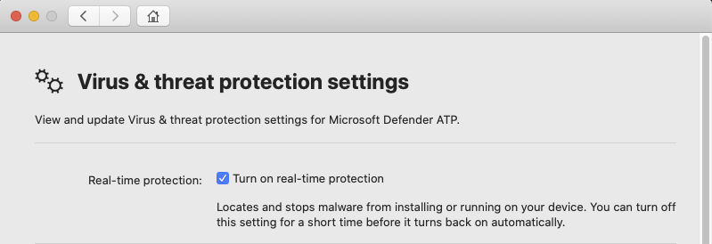

# <a name="troubleshoot-performance-issues-for-microsoft-defender-for-endpoint-on-macos"></a>疑難排解 Microsoft Defender for Endpoint on macOS 的效能問題

[!INCLUDE [Microsoft 365 Defender rebranding](../../includes/microsoft-defender.md)]


**適用於：**

- [macOS 上的 Microsoft Defender for Endpoint](microsoft-defender-endpoint-mac.md)
- [適用於端點的 Microsoft Defender](https://go.microsoft.com/fwlink/p/?linkid=2154037)
- [Microsoft 365 Defender](https://go.microsoft.com/fwlink/?linkid=2118804)

> 想要體驗 Microsoft Defender for Endpoint？ [註冊免費試用版。](https://www.microsoft.com/microsoft-365/windows/microsoft-defender-atp?ocid=docs-wdatp-exposedapis-abovefoldlink)

本主題提供一些一般步驟，可用來縮小 macOS 上與 Microsoft Defender for Endpoint 相關的效能問題。

[！注意] 即時保護 (RTP) 是一種 macOS 上的 Microsoft Defender for Endpoint 的功能，可以持續監視和保護您的裝置免受威脅。 它包含檔案和程式監視及其他試探法。

視您執行的應用程式和裝置特性而定，在 macOS 上執行 Microsoft Defender for Endpoint 時，可能會遇到效能效能。 特別是，透過簡短的 timespan 存取許多資源的應用程式或系統進程，可能會導致 macOS 中的端點的效能問題。

下列步驟可用於疑難排解及緩解下列問題：

1. 使用下列其中一種方法來停用即時保護，並觀察效能是否提高。 這種方法可協助縮小 macOS 上的 Microsoft Defender for Endpoint 是否會影響效能問題。

      如果您的裝置不是由您的組織管理，則可以使用下列其中一個選項停用即時保護：

    - 從使用者介面。 在 macOS 上開啟 Microsoft Defender for Endpoint，然後流覽至 [ **管理設定**]。

      

    - 從終端。 基於安全性的考慮，此作業需要提升。

      ```bash
      mdatp config real-time-protection --value disabled
      ```

      如果您的裝置是由您的組織管理，則系統管理員可以使用 [macOS 上 Microsoft Defender For Endpoint 的 [設定偏好設定](mac-preferences.md)] 中的指示來停用即時保護。
      
      如果在即時保護關閉時出現效能問題，則問題的來源可能是端點偵測和回應元件。 在此情況下，請與客戶支援部門聯繫以取得進一步的指示和緩解。

2. 開啟 Finder，並流覽至 **應用程式**  >  **公用程式**。 開啟 **活動監視器** 並分析哪些應用程式正在使用您系統上的資源。 典型範例包括軟體 updaters 及編譯器。

1. 若要找出觸發大多數掃描的應用程式，您可以使用由 Defender for Mac 所收集的即時統計資料。

      > [!NOTE]
      > 100.90.70 或更新版本中提供此功能。
      在 **Dogfood** 和 **InsiderFast** 通道上，此功能預設為啟用。 如果您是使用不同的更新通道，可以從命令列啟用此功能：
      ```bash
      mdatp config real-time-protection-statistics  --value enabled
      ```

      這項功能需要啟用即時保護。 若要檢查即時保護的狀態，請執行下列命令：

      ```bash
      mdatp health --field real_time_protection_enabled
      ```

    確認 **real_time_protection_enabled** 專案為 true。 否則，請執行下列命令來啟用它：

      ```bash
      mdatp config real-time-protection --value enabled
      ```

      ```output
      Configuration property updated
      ```

      若要收集目前的統計資料，請執行：

      ```bash
      mdatp config real-time-protection --value enabled
      ```

      > [!NOTE]
      > 使用 **--輸出 json** (請注意，雙劃線) 可確保輸出格式準備好進行分析。
      這個命令的輸出會顯示所有程式及其相關聯的掃描活動。

1. 在您的 Mac 系統上，使用命令下載範例 Python 分析程式 high_cpu_parser py：

    ```bash
    wget -c https://raw.githubusercontent.com/microsoft/mdatp-xplat/master/linux/diagnostic/high_cpu_parser.py
    ```

    此命令的輸出應類似下列所示：

    ```Output
    --2020-11-14 11:27:27-- https://raw.githubusercontent.com/microsoft.
    mdatp-xplat/master/linus/diagnostic/high_cpu_parser.py
    Resolving raw.githubusercontent.com (raw.githubusercontent.com)... 151.101.xxx.xxx
    Connecting to raw.githubusercontent.com (raw.githubusercontent.com)| 151.101.xxx.xxx| :443... connected.
    HTTP request sent, awaiting response... 200 OK
    Length: 1020 [text/plain]
    Saving to: 'high_cpu_parser.py'
    100%[===========================================>] 1,020    --.-K/s   in 
    0s
    ```

1. 接下來，輸入下列命令：

      ```bash
        chmod +x high_cpu_parser.py
      ```

      ```bash
        cat real_time_protection.json | python high_cpu_parser.py  > real_time_protection.log
      ```

      以上的輸出是效能問題的最熱門貢獻因素清單。 第一欄是進程識別碼 (PID) ，第二欄是 te 進程名稱，最後一欄是依影響排序的掃描檔數目。

      例如，命令的輸出會如下所示：

      ```output
        ... > python ~/repo/mdatp-xplat/linux/diagnostic/high_cpu_parser.py <~Downloads/output.json | head -n 10
        27432 None 76703
        73467 actool     1249
        73914 xcodebuild 1081
        73873 bash 1050
        27475 None 836
        1    launchd    407
        73468 ibtool     344
        549  telemetryd_v1   325
        4764 None 228
        125  CrashPlanService 164
      ```

      若要改善用於 Mac 之 Defender 的 Defender 的效能，請在 [已掃描的檔案總數] 列底下找到最高號碼的，並為其新增排除。 如需詳細資訊，請參閱 [Configure and validate 的 Defender For Endpoint For Linux](linux-exclusions.md)。

      > [!NOTE]
      > 應用程式會將統計資料儲存在記憶體中，且只會在啟動之後繼續追蹤檔活動，並啟用即時保護。 在即時保護關閉之前或期間所啟動的處理常式不會計算在內。 此外，只會計算觸發掃描的事件。
      > 
1. 針對影響效能問題及重新啟用即時保護的處理常式或磁片位置，以排除 macOS，設定 Microsoft Defender for Endpoint on。

     如需詳細資訊，請參閱 [設定及驗證 macOS 的 Microsoft Defender For Endpoint 的排除](mac-exclusions.md) 專案。
