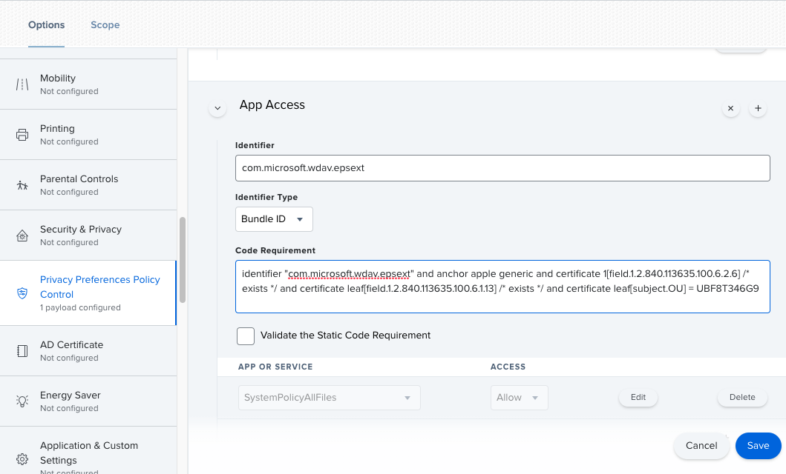
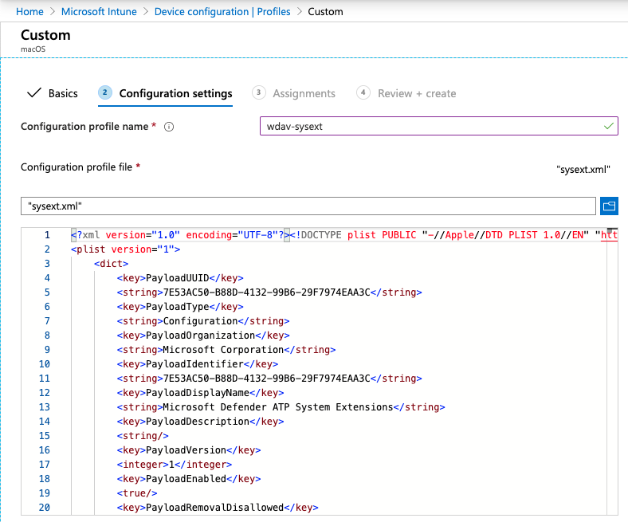

# <a name="new-configuration-profiles-for-macos-catalina-and-newer-versions-of-macos"></a>macOS Catalina 和更新版本 macOS 的新設定設定檔

[!INCLUDE [Microsoft 365 Defender rebranding](../../includes/microsoft-defender.md)]

**適用於：**
- [適用於端點的 Microsoft Defender](https://go.microsoft.com/fwlink/p/?linkid=2154037)
- [Microsoft 365 Defender](https://go.microsoft.com/fwlink/?linkid=2118804)

> 想要體驗 Microsoft Defender for Endpoint？ [註冊免費試用版。](https://www.microsoft.com/microsoft-365/windows/microsoft-defender-atp?ocid=docs-wdatp-exposedapis-abovefoldlink)

隨著 macOS 演變，我們準備好 Microsoft Defender for Mac 更新，以利用系統擴充，而不是核心擴充。 此更新只適用于 macOS Catalina (10.15.4) 和更新版本的 macOS。

如果您已透過 JAMF、Intune 或另一個 MDM 方案) 在受管理的 (環境中部署 Microsoft Defender for Mac 的端點，您必須部署新的設定檔。 若無法執行這些步驟，將會導致使用者取得核准提示以執行這些新元件。

## <a name="jamf"></a>JAMF

### <a name="system-extensions-policy"></a>系統擴充原則

若要核准系統擴充，請建立下列的負載：

1. 在 **> 設定檔的電腦** 中，選取 [ **系統分機] > 的選項**。
2. 從 [**系統擴充類型**] 下拉式清單中選取 [**允許的系統擴充**]。
3. 使用 **UBF8T346G9** 做為小組識別碼。
4. 將下列束識別碼新增至 **允許的系統副檔名** 清單：

    - **wdav epsext**
    - **wdav netext**

    

### <a name="privacy-preferences-policy-control"></a>隱私權偏好設定原則控制

新增下列 JAMF 負載，以授與 Microsoft Defender for Endpoint Endpoint Security Extension 的完整磁片存取權。 這個原則是在您的裝置上執行分機的必要條件。

1. 選取[  >  **隱私權偏好設定原則] 控制項** 的選項。
2. `com.microsoft.wdav.epsext`當作 **識別碼** 及 `Bundle ID` **束類型** 使用。
3. 將程式碼需求設定為 `identifier "com.microsoft.wdav.epsext" and anchor apple generic and certificate 1[field.1.2.840.113635.100.6.2.6] /* exists */ and certificate leaf[field.1.2.840.113635.100.6.1.13] /* exists */ and certificate leaf[subject.OU] = UBF8T346G9`
4. 將 **App 或服務** 設定為 **SystemPolicyAllFiles** ，並存取 **允許**。

    

### <a name="network-extension-policy"></a>網路擴充原則

做為端點偵測和回應功能的一部分，Mac 版端點的 Microsoft Defender 會檢查通訊端流量，並將此資訊報告給 Microsoft Defender Security Center 入口網站。 下列原則允許網路分機執行這項功能。

>[!NOTE]
>JAMF 不具備內容篩選原則的內建支援，這些是可讓 Microsoft Defender Endpoint for Mac 在裝置上安裝的網路分機之前的必要條件。 此外，JAMF 有時會變更所要部署之原則的內容。
>如此一來，下列步驟會提供對設定設定檔進行簽章的解決方法。

1. 使用文字編輯器，將下列內容儲存到您的裝置 `com.microsoft.network-extension.mobileconfig` ：

    ```xml
    <?xml version="1.0" encoding="UTF-8"?><!DOCTYPE plist PUBLIC "-//Apple//DTD PLIST 1.0//EN" "http://www.apple.com/DTDs/PropertyList-1.0.dtd">
    <plist version="1">
        <dict>
            <key>PayloadUUID</key>
            <string>DA2CC794-488B-4AFF-89F7-6686A7E7B8AB</string>
            <key>PayloadType</key>
            <string>Configuration</string>
            <key>PayloadOrganization</key>
            <string>Microsoft Corporation</string>
            <key>PayloadIdentifier</key>
            <string>DA2CC794-488B-4AFF-89F7-6686A7E7B8AB</string>
            <key>PayloadDisplayName</key>
            <string>Microsoft Defender ATP Network Extension</string>
            <key>PayloadDescription</key>
            <string/>
            <key>PayloadVersion</key>
            <integer>1</integer>
            <key>PayloadEnabled</key>
            <true/>
            <key>PayloadRemovalDisallowed</key>
            <true/>
            <key>PayloadScope</key>
            <string>System</string>
            <key>PayloadContent</key>
            <array>
                <dict>
                    <key>PayloadUUID</key>
                    <string>2BA070D9-2233-4827-AFC1-1F44C8C8E527</string>
                    <key>PayloadType</key>
                    <string>com.apple.webcontent-filter</string>
                    <key>PayloadOrganization</key>
                    <string>Microsoft Corporation</string>
                    <key>PayloadIdentifier</key>
                    <string>CEBF7A71-D9A1-48BD-8CCF-BD9D18EC155A</string>
                    <key>PayloadDisplayName</key>
                    <string>Approved Network Extension</string>
                    <key>PayloadDescription</key>
                    <string/>
                    <key>PayloadVersion</key>
                    <integer>1</integer>
                    <key>PayloadEnabled</key>
                    <true/>
                    <key>FilterType</key>
                    <string>Plugin</string>
                    <key>UserDefinedName</key>
                    <string>Microsoft Defender ATP Network Extension</string>
                    <key>PluginBundleID</key>
                    <string>com.microsoft.wdav</string>
                    <key>FilterSockets</key>
                    <true/>
                    <key>FilterDataProviderBundleIdentifier</key>
                    <string>com.microsoft.wdav.netext</string>
                    <key>FilterDataProviderDesignatedRequirement</key>
                    <string>identifier "com.microsoft.wdav.netext" and anchor apple generic and certificate 1[field.1.2.840.113635.100.6.2.6] /* exists */ and certificate leaf[field.1.2.840.113635.100.6.1.13] /* exists */ and certificate leaf[subject.OU] = UBF8T346G9</string>
                </dict>
            </array>
        </dict>
    </plist>
    ```

2. `plutil`在終端中執行公用程式，確認已正確複製上述檔案。

    ```bash
    $ plutil -lint <PathToFile>/com.microsoft.network-extension.mobileconfig
    ```

    例如，如果檔案儲存在檔中：

    ```bash
    $ plutil -lint ~/Documents/com.microsoft.network-extension.mobileconfig
    ```
    
    確認命令輸出 `OK` 。
        
    ```bash
    <PathToFile>/com.microsoft.network-extension.mobileconfig: OK
    ```
    
3. 遵循 [此頁面](https://www.jamf.com/jamf-nation/articles/649/creating-a-signing-certificate-using-jamf-pro-s-built-in-certificate-authority) 上的指示，使用 JAMF 的內建憑證授權單位建立簽署憑證。

4. 建立憑證並將其安裝至裝置後，請從終端執行下列命令以簽署檔案：

    ```bash
    $ security cms -S -N "<CertificateName>" -i <PathToFile>/com.microsoft.network-extension.mobileconfig -o <PathToSignedFile>/com.microsoft.network-extension.signed.mobileconfig
    ```
    
    例如，如果憑證名稱是 **SigningCertificate** ，且已簽署的檔案將要儲存在檔中：
    
    ```bash
    $ security cms -S -N "SigningCertificate" -i ~/Documents/com.microsoft.network-extension.mobileconfig -o ~/Documents/com.microsoft.network-extension.signed.mobileconfig
    ```
    
5. 在 JAMF 入口網站中，流覽至 [設定 **設定檔** ]，然後按一下 [ **上傳** ] 按鈕。 `com.microsoft.network-extension.signed.mobileconfig`當系統提示您輸入檔案時，請選取。

## <a name="intune"></a>Intune

### <a name="system-extensions-policy"></a>系統擴充原則

若要核准系統擴充：

1. 在 Intune 中，開啟 [**管理**  >  **裝置** 設定]。 選取 [**管理**  >  **設定檔**  >  **建立設定檔**]。
2. 選擇設定檔的名稱。 將 **平臺** 改為 MacOS **配置檔案類型 = 分機**。 選取 [建立]。
3. 在 [索引標籤 `Basics` ] 中，為此新設定檔指定名稱。
4. 在 [ `Configuration settings` ] 索引標籤中，在區段中新增下列專案 `Allowed system extensions` ：

    束識別碼         | 小組識別碼
    --------------------------|----------------
    wdav epsext | UBF8T346G9
    wdav netext | UBF8T346G9

    

5. 在 [索引標籤 `Assignments` ] 中，將此設定檔指派給所有 **使用者 & 所有裝置**。
6. 複查和建立此設定設定檔。

### <a name="create-and-deploy-the-custom-configuration-profile"></a>建立及部署自訂設定檔

下列設定設定檔可啟用網路分機，並授與對端點安全性系統擴充的完整磁片存取權。 

將下列內容儲存至名為 **sysext.xml** 的檔案：

```xml
<?xml version="1.0" encoding="UTF-8"?><!DOCTYPE plist PUBLIC "-//Apple//DTD PLIST 1.0//EN" "http://www.apple.com/DTDs/PropertyList-1.0.dtd">
<plist version="1">
    <dict>
        <key>PayloadUUID</key>
        <string>7E53AC50-B88D-4132-99B6-29F7974EAA3C</string>
        <key>PayloadType</key>
        <string>Configuration</string>
        <key>PayloadOrganization</key>
        <string>Microsoft Corporation</string>
        <key>PayloadIdentifier</key>
        <string>7E53AC50-B88D-4132-99B6-29F7974EAA3C</string>
        <key>PayloadDisplayName</key>
        <string>Microsoft Defender ATP System Extensions</string>
        <key>PayloadDescription</key>
        <string/>
        <key>PayloadVersion</key>
        <integer>1</integer>
        <key>PayloadEnabled</key>
        <true/>
        <key>PayloadRemovalDisallowed</key>
        <true/>
        <key>PayloadScope</key>
        <string>System</string>
        <key>PayloadContent</key>
        <array>
            <dict>
                <key>PayloadUUID</key>
                <string>2BA070D9-2233-4827-AFC1-1F44C8C8E527</string>
                <key>PayloadType</key>
                <string>com.apple.webcontent-filter</string>
                <key>PayloadOrganization</key>
                <string>Microsoft Corporation</string>
                <key>PayloadIdentifier</key>
                <string>CEBF7A71-D9A1-48BD-8CCF-BD9D18EC155A</string>
                <key>PayloadDisplayName</key>
                <string>Approved Network Extension</string>
                <key>PayloadDescription</key>
                <string/>
                <key>PayloadVersion</key>
                <integer>1</integer>
                <key>PayloadEnabled</key>
                <true/>
                <key>FilterType</key>
                <string>Plugin</string>
                <key>UserDefinedName</key>
                <string>Microsoft Defender ATP Network Extension</string>
                <key>PluginBundleID</key>
                <string>com.microsoft.wdav</string>
                <key>FilterSockets</key>
                <true/>
                <key>FilterDataProviderBundleIdentifier</key>
                <string>com.microsoft.wdav.netext</string>
                <key>FilterDataProviderDesignatedRequirement</key>
                <string>identifier &quot;com.microsoft.wdav.netext&quot; and anchor apple generic and certificate 1[field.1.2.840.113635.100.6.2.6] /* exists */ and certificate leaf[field.1.2.840.113635.100.6.1.13] /* exists */ and certificate leaf[subject.OU] = UBF8T346G9</string>
            </dict>
            <dict>
                <key>PayloadUUID</key>
                <string>56105E89-C7C8-4A95-AEE6-E11B8BEA0366</string>
                <key>PayloadType</key>
                <string>com.apple.TCC.configuration-profile-policy</string>
                <key>PayloadOrganization</key>
                <string>Microsoft Corporation</string>
                <key>PayloadIdentifier</key>
                <string>56105E89-C7C8-4A95-AEE6-E11B8BEA0366</string>
                <key>PayloadDisplayName</key>
                <string>Privacy Preferences Policy Control</string>
                <key>PayloadDescription</key>
                <string/>
                <key>PayloadVersion</key>
                <integer>1</integer>
                <key>PayloadEnabled</key>
                <true/>
                <key>Services</key>
                <dict>
                    <key>SystemPolicyAllFiles</key>
                    <array>
                        <dict>
                            <key>Identifier</key>
                            <string>com.microsoft.wdav.epsext</string>
                            <key>CodeRequirement</key>
                            <string>identifier "com.microsoft.wdav.epsext" and anchor apple generic and certificate 1[field.1.2.840.113635.100.6.2.6] /* exists */ and certificate leaf[field.1.2.840.113635.100.6.1.13] /* exists */ and certificate leaf[subject.OU] = UBF8T346G9</string>
                            <key>IdentifierType</key>
                            <string>bundleID</string>
                            <key>StaticCode</key>
                            <integer>0</integer>
                            <key>Allowed</key>
                            <integer>1</integer>
                        </dict>
                    </array>
                </dict>
            </dict>
        </array>
    </dict>
</plist>
```

確認上述檔案是否已正確複製。 從終端執行下列命令，並確認其輸出 `OK` ：

```bash
$ plutil -lint sysext.xml
sysext.xml: OK
```

若要部署此自訂設定檔：

1.  在 Intune 中，開啟 [**管理**  >  **裝置** 設定]。 選取 [**管理**  >  **設定檔**  >  **建立設定檔**]。
2. 選擇設定檔的名稱。 變更 **平臺 = macOS** 和 **配置檔案類型 = 自訂**。 選取 [ **設定**]。
3.  開啟設定設定檔，並上傳 **sysext.xml**。 此檔案是在上述步驟中建立的。
4.  選取 [確定]。

    

5. 在 [索引標籤 `Assignments` ] 中，將此設定檔指派給所有 **使用者 & 所有裝置**。
6. 複查和建立此設定設定檔。
