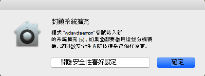
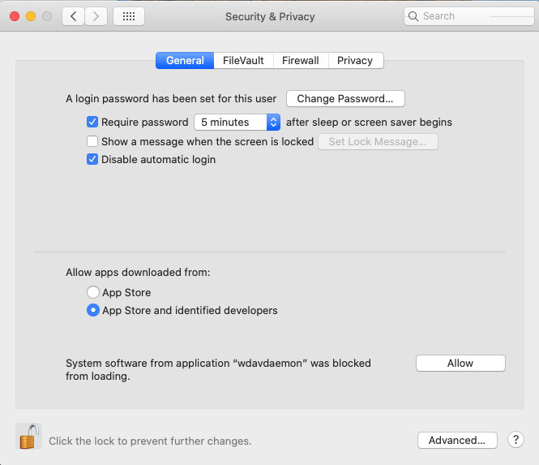
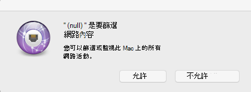

# <a name="microsoft-defender-for-endpoint-for-mac---system-extensions-public-preview"></a><span data-ttu-id="0b083-105">適用于 Mac 的 Microsoft Defender for Mac-系統擴充公開預覽) </span><span class="sxs-lookup"><span data-stu-id="0b083-105">Microsoft Defender for Endpoint for Mac - system extensions public preview)</span></span>

<span data-ttu-id="0b083-106">**適用於：**</span><span class="sxs-lookup"><span data-stu-id="0b083-106">**Applies to:**</span></span>
- [<span data-ttu-id="0b083-107">適用於端點的 Microsoft Defender</span><span class="sxs-lookup"><span data-stu-id="0b083-107">Microsoft Defender for Endpoint</span></span>](https://go.microsoft.com/fwlink/p/?linkid=2146631)
- [<span data-ttu-id="0b083-108">Microsoft 365 Defender</span><span class="sxs-lookup"><span data-stu-id="0b083-108">Microsoft 365 Defender</span></span>](https://go.microsoft.com/fwlink/?linkid=2118804)

> <span data-ttu-id="0b083-109">想要體驗 Microsoft Defender for Endpoint？</span><span class="sxs-lookup"><span data-stu-id="0b083-109">Want to experience Microsoft Defender for Endpoint?</span></span> [<span data-ttu-id="0b083-110">註冊免費試用版。</span><span class="sxs-lookup"><span data-stu-id="0b083-110">Sign up for a free trial.</span></span>](https://www.microsoft.com/microsoft-365/windows/microsoft-defender-atp?ocid=docs-wdatp-exposedapis-abovefoldlink)

<span data-ttu-id="0b083-111">隨著 macOS 演變，我們準備好使用系統擴充（而非核心擴充）的 Defender for Mac 更新。</span><span class="sxs-lookup"><span data-stu-id="0b083-111">In alignment with macOS evolution, we are preparing a Defender for Endpoint for Mac update that leverages system extensions instead of kernel extensions.</span></span> <span data-ttu-id="0b083-112">此更新只會套用至 macOS Catalina (10.15.4) 和更新版本的 macOS。</span><span class="sxs-lookup"><span data-stu-id="0b083-112">This update will only apply to macOS Catalina (10.15.4) and later versions of macOS.</span></span>

<span data-ttu-id="0b083-113">這項功能目前是公開預覽。</span><span class="sxs-lookup"><span data-stu-id="0b083-113">This functionality is currently in public preview.</span></span> <span data-ttu-id="0b083-114">本文說明如何在您的裝置上啟用此功能。</span><span class="sxs-lookup"><span data-stu-id="0b083-114">This article describes how to enable this functionality on your device.</span></span> <span data-ttu-id="0b083-115">您可以在您自己的裝置上本機嘗試此功能，或透過管理工具來遠端設定此功能。</span><span class="sxs-lookup"><span data-stu-id="0b083-115">You can try out this feature locally on your own device or configure it remotely through a management tool.</span></span>

<span data-ttu-id="0b083-116">這些步驟假設您已在裝置上執行的是 Defender for Endpoint。</span><span class="sxs-lookup"><span data-stu-id="0b083-116">These steps assume you already have Defender for Endpoint running on your device.</span></span> <span data-ttu-id="0b083-117">如需詳細資訊，請參閱[此頁面](microsoft-defender-endpoint-mac.md)。</span><span class="sxs-lookup"><span data-stu-id="0b083-117">For more information, see [this page](microsoft-defender-endpoint-mac.md).</span></span>

## <a name="known-issues"></a><span data-ttu-id="0b083-118">已知問題</span><span class="sxs-lookup"><span data-stu-id="0b083-118">Known issues</span></span>

- <span data-ttu-id="0b083-119">我們收到干擾使用 Apple SSO Kerberos 擴充的網路分機報告。</span><span class="sxs-lookup"><span data-stu-id="0b083-119">We’ve received reports of the network extension interfering with the Apple SSO Kerberos extension.</span></span>
- <span data-ttu-id="0b083-120">目前版本的產品仍然會安裝內核擴充。</span><span class="sxs-lookup"><span data-stu-id="0b083-120">The current version of the product still installs a kernel extension.</span></span> <span data-ttu-id="0b083-121">內核副檔名只會做為回退機制使用，並會在此功能到達公開預覽之前移除。</span><span class="sxs-lookup"><span data-stu-id="0b083-121">The kernel extension is only used as a fallback mechanism and will be removed before this feature reaches public preview.</span></span>
- <span data-ttu-id="0b083-122">我們仍在 macOS 11 大的 Sur 上部署並運作的產品版本。</span><span class="sxs-lookup"><span data-stu-id="0b083-122">We're still working on a product version that deploys and functions properly on macOS 11 Big Sur.</span></span>

## <a name="deployment-prerequisites"></a><span data-ttu-id="0b083-123">部署必要條件</span><span class="sxs-lookup"><span data-stu-id="0b083-123">Deployment prerequisites</span></span>

- <span data-ttu-id="0b083-124">最低 macOS 作業系統版本： **10.15.4**</span><span class="sxs-lookup"><span data-stu-id="0b083-124">Minimum macOS operating system version: **10.15.4**</span></span>
- <span data-ttu-id="0b083-125">產品版本下限： **101.03.73**</span><span class="sxs-lookup"><span data-stu-id="0b083-125">Minimum product version: **101.03.73**</span></span>
- <span data-ttu-id="0b083-126">您的裝置必須在「 **內幕 Fast 更新」通道** 中。</span><span class="sxs-lookup"><span data-stu-id="0b083-126">Your device must be in the **Insider Fast update channel**.</span></span> <span data-ttu-id="0b083-127">您可以使用下列命令來檢查更新通道：</span><span class="sxs-lookup"><span data-stu-id="0b083-127">You can check the update channel by using the following command:</span></span>

  ```bash
  mdatp health --field release_ring
  ```

  <span data-ttu-id="0b083-128">如果您的裝置還沒有在「有問必答 Fast 更新」通道中，請從終端執行下列命令。</span><span class="sxs-lookup"><span data-stu-id="0b083-128">If your device isn't already in the Insider Fast update channel, execute the following command from the Terminal.</span></span> <span data-ttu-id="0b083-129">通道更新會在下一次產品開始時 (會在安裝下一個產品更新時或重新開機裝置) 時生效。</span><span class="sxs-lookup"><span data-stu-id="0b083-129">The channel update takes effect the next time the product starts (when the next product update is installed, or when the device is rebooted).</span></span>

  ```bash
  defaults write com.microsoft.autoupdate2 ChannelName -string Beta
  ```

  <span data-ttu-id="0b083-130">或者，如果您處在受管理的環境 (JAMF 或 Intune) 中，您可以從遠端設定更新通道。</span><span class="sxs-lookup"><span data-stu-id="0b083-130">Alternatively, if you're in a managed environment (JAMF or Intune), you can configure the update channel remotely.</span></span> <span data-ttu-id="0b083-131">如需詳細資訊，請參閱 [部署 Microsoft DEFENDER ATP For Mac 的更新：設定通道名稱](mac-updates.md#set-the-channel-name)。</span><span class="sxs-lookup"><span data-stu-id="0b083-131">For more information, see [Deploy updates for Microsoft Defender ATP for Mac: Set the channel name](mac-updates.md#set-the-channel-name).</span></span>

## <a name="deployment-steps"></a><span data-ttu-id="0b083-132">部署步驟</span><span class="sxs-lookup"><span data-stu-id="0b083-132">Deployment steps</span></span>

<span data-ttu-id="0b083-133">遵循與您的環境對應的部署步驟，以及您嘗試此功能的慣用方法。</span><span class="sxs-lookup"><span data-stu-id="0b083-133">Follow the deployment steps that correspond to your environment and your preferred method of trying out this feature.</span></span>

### <a name="manual-deployment"></a><span data-ttu-id="0b083-134">手動部署</span><span class="sxs-lookup"><span data-stu-id="0b083-134">Manual deployment</span></span>

#### <a name="approve-the-system-extensions-and-enable-the-network-extension"></a><span data-ttu-id="0b083-135">核准系統擴充和啟用網路分機</span><span class="sxs-lookup"><span data-stu-id="0b083-135">Approve the system extensions and enable the network extension</span></span>

1. <span data-ttu-id="0b083-136">在所有部署必要條件都符合後，請重新開機裝置以啟動系統分機核准和啟用程式。</span><span class="sxs-lookup"><span data-stu-id="0b083-136">After all deployment prerequisites are met, restart your device to launch the system extension approval and activation process.</span></span>

   <span data-ttu-id="0b083-137">您將會看到一系列的系統提示，以核准用於端點系統擴充的 Defender。</span><span class="sxs-lookup"><span data-stu-id="0b083-137">You'll see a series of system prompts to approve the Defender for Endpoint system extensions.</span></span> <span data-ttu-id="0b083-138">您必須核准該數列的 **所有** 提示，因為 macOS 需要明確核准每個副檔名（適用于 Mac 的 Endpoint for Mac 在裝置上安裝）。</span><span class="sxs-lookup"><span data-stu-id="0b083-138">You must approve **all** prompts from the series, because macOS requires an explicit approval for each extension that Defender for Endpoint for Mac installs on the device.</span></span>
   
   <span data-ttu-id="0b083-139">針對每個核准，選取 [ **開啟安全性喜好** 設定]，然後選取 [ **允許** 系統分機] 以執行。</span><span class="sxs-lookup"><span data-stu-id="0b083-139">For each approval, select **Open Security Preferences** and then select **Allow** to allow the system extension to run.</span></span>

   > [!IMPORTANT]
   > <span data-ttu-id="0b083-140">您必須先關閉並重新開啟 **系統偏好** 設定  >  **安全性 & 隱私權** 視窗的後續核准。</span><span class="sxs-lookup"><span data-stu-id="0b083-140">You must close and reopen the **System Preferences** > **Security & Privacy** window between subsequent approvals.</span></span> <span data-ttu-id="0b083-141">否則，macOS 不會顯示下一個核准。</span><span class="sxs-lookup"><span data-stu-id="0b083-141">Otherwise, macOS will not display the next approval.</span></span>

   > [!IMPORTANT]
   > <span data-ttu-id="0b083-142">在產品回到內核擴充之前有一分鐘的超時。</span><span class="sxs-lookup"><span data-stu-id="0b083-142">There is a one-minute timeout before the product falls back to the kernel extension.</span></span> <span data-ttu-id="0b083-143">這可確保裝置受到保護。</span><span class="sxs-lookup"><span data-stu-id="0b083-143">This ensures that the device is protected.</span></span>
   >
   > <span data-ttu-id="0b083-144">如果經歷超過一分鐘，請重新開機此裝置或使用 `sudo killall -9 wdavdaemon` 以重新觸發核准流程以重新開機守護程式。</span><span class="sxs-lookup"><span data-stu-id="0b083-144">If more than one minute elapses, restart the daemon by rebooting the device or by using `sudo killall -9 wdavdaemon` to trigger the approval flow again.</span></span>

   

   

1. <span data-ttu-id="0b083-147">批准系統擴充後，macOS 會提示您核准是否允許篩選網路流量。</span><span class="sxs-lookup"><span data-stu-id="0b083-147">After the system extensions are approved, macOS prompts for an approval to allow network traffic to be filtered.</span></span> <span data-ttu-id="0b083-148">按一下 [ **允許**]。</span><span class="sxs-lookup"><span data-stu-id="0b083-148">Click **Allow**.</span></span>

   

#### <a name="grant-full-disk-access-to-the-endpoint-security-system-extension"></a><span data-ttu-id="0b083-150">授與對端點安全性系統擴充的完整磁片存取權</span><span class="sxs-lookup"><span data-stu-id="0b083-150">Grant Full Disk Access to the Endpoint Security system extension</span></span>

<span data-ttu-id="0b083-151">開啟 [**系統喜好** 設定  >  **安全性 & 隱私權**  >  **隱私權**] 索引標籤，並授與 **Microsoft Defender 端點安全性分機** 的 **完整磁片存取權**。</span><span class="sxs-lookup"><span data-stu-id="0b083-151">Open the **System Preferences** > **Security & Privacy** > **Privacy** tab and grant **Full Disk Access** to the **Microsoft Defender Endpoint Security Extension**.</span></span>


#### <a name="reboot-your-device"></a><span data-ttu-id="0b083-153">重新開機裝置</span><span class="sxs-lookup"><span data-stu-id="0b083-153">Reboot your device</span></span>

<span data-ttu-id="0b083-154">為了使變更生效，您必須重新開機裝置。</span><span class="sxs-lookup"><span data-stu-id="0b083-154">In order for the changes to take effect, you must reboot your device.</span></span>

#### <a name="verify-that-the-system-extensions-are-running"></a><span data-ttu-id="0b083-155">確認系統擴充模組正在執行中</span><span class="sxs-lookup"><span data-stu-id="0b083-155">Verify that the system extensions are running</span></span>

<span data-ttu-id="0b083-156">從終端執行下列命令：</span><span class="sxs-lookup"><span data-stu-id="0b083-156">From the Terminal, run the following command:</span></span>

```bash
mdatp health --field real_time_protection_subsystem
```

<span data-ttu-id="0b083-157">終端輸出 `endpoint_security_extension` 指出產品使用的是系統擴充功能。</span><span class="sxs-lookup"><span data-stu-id="0b083-157">Terminal output `endpoint_security_extension` indicates the product is using the system extensions functionality.</span></span>

### <a name="managed-deployment"></a><span data-ttu-id="0b083-158">受管理的部署</span><span class="sxs-lookup"><span data-stu-id="0b083-158">Managed deployment</span></span>

<span data-ttu-id="0b083-159">請參閱 [新的設定設定檔，以取得 MacOS Catalina 和更新版本的 macOS： JAMF](mac-sysext-policies.md#jamf) 的新設定設定檔，您必須為此新功能部署。</span><span class="sxs-lookup"><span data-stu-id="0b083-159">Refer to [New configuration profiles for macOS Catalina and newer versions of macOS: JAMF](mac-sysext-policies.md#jamf) for the new configuration profiles you must deploy for this new feature.</span></span>

<span data-ttu-id="0b083-160">除了這些設定檔之外，請務必將目標裝置設定為「內幕人士快速更新」通道（如 [部署必要條件](#deployment-prerequisites)中所述）。</span><span class="sxs-lookup"><span data-stu-id="0b083-160">In addition to those profiles, make sure to configure the target devices to be in the Insider Fast update channel, as described in [Deployment prerequisites](#deployment-prerequisites).</span></span>

<span data-ttu-id="0b083-161">在符合所有必要條件且已部署新設定設定檔的裝置上，執行下列命令：</span><span class="sxs-lookup"><span data-stu-id="0b083-161">On a device where all prerequisites are met and the new configuration profiles have been deployed, run the following command:</span></span>

```bash
$ mdatp health --field real_time_protection_subsystem
```

<span data-ttu-id="0b083-162">如果此命令會列印出來 `endpoint_security_extension` ，表示產品使用的是系統擴充功能。</span><span class="sxs-lookup"><span data-stu-id="0b083-162">If this command prints `endpoint_security_extension`, the product is using the system extensions functionality.</span></span>

## <a name="validate-basic-scenarios"></a><span data-ttu-id="0b083-163">驗證基本案例</span><span class="sxs-lookup"><span data-stu-id="0b083-163">Validate basic scenarios</span></span>

1. <span data-ttu-id="0b083-164">針對電腦防病毒研究 (EICAR.TXT) 偵測測試歐洲研究所。</span><span class="sxs-lookup"><span data-stu-id="0b083-164">Test European Institute for Computer Antivirus Research (EICAR) detection.</span></span> <span data-ttu-id="0b083-165">在終端視窗中，執行下列命令：</span><span class="sxs-lookup"><span data-stu-id="0b083-165">From a Terminal window, run the following command:</span></span>

   ```bash
   curl -o eicar.txt https://secure.eicar.org/eicar.com.txt
   ```

   <span data-ttu-id="0b083-166">確認 EICAR.TXT 檔案已隔離。</span><span class="sxs-lookup"><span data-stu-id="0b083-166">Verify that the EICAR file is quarantined.</span></span> <span data-ttu-id="0b083-167">您可以使用下列命令，在使用者介面中的 [保護史] 頁面上，或從命令列驗證檔案的狀態：</span><span class="sxs-lookup"><span data-stu-id="0b083-167">You can verify the file's status on the Protection History page in the user interface, or from a command line by using the following command:</span></span>

    ```bash
    mdatp threat list
    ```

2. <span data-ttu-id="0b083-168">測試 (EDR) DIY 案例的端點偵測和回應。</span><span class="sxs-lookup"><span data-stu-id="0b083-168">Test the Endpoint Detection and Response (EDR) DIY scenario.</span></span> <span data-ttu-id="0b083-169">在終端視窗中，執行下列命令：</span><span class="sxs-lookup"><span data-stu-id="0b083-169">From a terminal window, run the following command:</span></span>

   ```bash
   curl -o "MDATP MacOS DIY.zip" https://aka.ms/mdatpmacosdiy
   ```

   <span data-ttu-id="0b083-170">在 EICAR.TXT 和 EDR DIY 案例的 [機器] 頁面上，驗證入口網站上是否彈出兩個警示。</span><span class="sxs-lookup"><span data-stu-id="0b083-170">Validate that two alerts popped up in the portal on the machine page for EICAR and EDR DIY scenarios.</span></span>

## <a name="frequently-asked-questions"></a><span data-ttu-id="0b083-171">常見問題集</span><span class="sxs-lookup"><span data-stu-id="0b083-171">Frequently asked questions</span></span>

- <span data-ttu-id="0b083-172">問：為什麼我 `kernel_extension` 在執行時仍然會看到 `mdatp health --field real_time_protection_subsystem` ？</span><span class="sxs-lookup"><span data-stu-id="0b083-172">Q: Why am I still seeing `kernel_extension` when I run `mdatp health --field real_time_protection_subsystem`?</span></span>

    <span data-ttu-id="0b083-173">A：請參閱「 [部署先決條件](#deployment-prerequisites) 」一節，並仔細檢查是否符合所有必要條件。</span><span class="sxs-lookup"><span data-stu-id="0b083-173">A: Refer back to the [Deployment prerequisites](#deployment-prerequisites) section and double-check that all prerequisites are met.</span></span> <span data-ttu-id="0b083-174">若所有先決條件皆已符合，請重新開機裝置，然後再檢查一次。</span><span class="sxs-lookup"><span data-stu-id="0b083-174">If all prerequisites are met, restart your device and check again.</span></span>

- <span data-ttu-id="0b083-175">問：何時 macOS 11 大的 Sur 是受支援的？</span><span class="sxs-lookup"><span data-stu-id="0b083-175">Q: When will macOS 11 Big Sur be supported?</span></span>

    <span data-ttu-id="0b083-176">A：我們積極致力於為 macOS 11 新增支援。</span><span class="sxs-lookup"><span data-stu-id="0b083-176">A: We are actively working on adding support for macOS 11.</span></span> <span data-ttu-id="0b083-177">我們將會在 [ [新功能](mac-whatsnew.md) ] 頁面上發佈其他資訊。</span><span class="sxs-lookup"><span data-stu-id="0b083-177">We will post more information to the [What's new](mac-whatsnew.md) page.</span></span>
