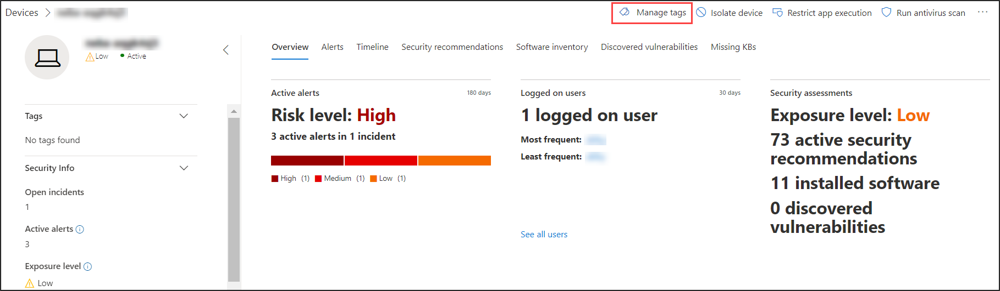
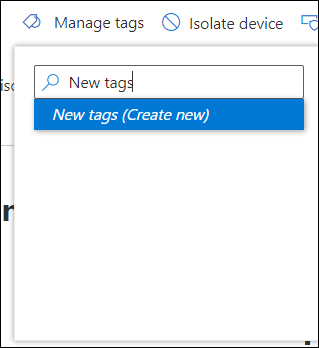

# 建立及管理裝置標籤

[!INCLUDE [Microsoft 365 Defender rebranding](../../includes/microsoft-defender.md)]

**適用於：**
- [適用於端點的 Microsoft Defender](https://go.microsoft.com/fwlink/p/?linkid=2154037)
- [Microsoft 365 Defender](https://go.microsoft.com/fwlink/?linkid=2118804)

> 想要體驗適用於端點的 Microsoft Defender 嗎？ [注册免費試用版。](https://www.microsoft.com/microsoft-365/windows/microsoft-defender-atp?ocid=docs-wdatp-exposedapis-abovefoldlink)

在裝置上新增標籤以建立邏輯群組關係。 裝置標籤支援網路的正確對應，使您能够附加不同的標籤以擷取内容，並作為事件的一部分啟用動態清單建立。 標籤可以用作 **裝置清單** 檢視中的篩檢，也可以用於對裝置進行分組。 有關裝置分組的詳細資訊，請參閱[建立和管理裝置群組](machine-groups.md)。

可以使用以下方法在裝置上新增標籤：

- 使用入口網站
- 設定登錄機碼值

> [!NOTE]
> 從將標籤新增到裝置的時間，到其在裝置清單和裝置頁中的顯示可用的時間，可能會有一些延遲。  

要使用 API 新增裝置標籤，請參閲[新增或移除裝置標籤 API](add-or-remove-machine-tags.md)。

## 使用入口網站新增和管理裝置標籤

1. 選取要在其上管理標籤的裝置。 您可以從以下任何檢視中選取或搜尋裝置：

   - **安全性操作儀表板** - 從具有作用中警示的頂端裝置區段中選取裝置名稱。
   - **警示佇列** - 從警示佇列中選取裝置圖示旁邊的裝置名稱。
   - **裝置清單** - 從裝置清單中選取裝置名稱。
   - **搜尋方塊** - 從下拉式功能表中選取裝置並輸入裝置名稱。

     您還可以透過檔案和 IP 檢視存取警示頁。

2. 從回應動作列中選取 **管理標籤**。

    

3. 輸入以尋找或建立標籤

    

標籤被新增至裝置檢視中，也會反映在 **裝置清單** 檢視中。 然後可以使用 **標籤** 篩選查看相關的裝置清單。

>[!NOTE]
> 篩選對包含括弧的標籤名稱可能無效。 
> 建立新標籤時，將顯示現有標籤的清單。 該清單僅顯示透過入口網站建立的標籤。 將不顯示從用戶端裝置建立的現有標籤。

您也可以從此檢視中删除標籤。

## 透過設定登錄機碼值新增裝置標籤

>[!NOTE]
> 僅適用於以下裝置：
>- Windows 10 版本 1709 或更新版本。
>- Windows Server 版本 1803 或更新版本
>- Windows Server 2016
>- Windows Server 2012 R2
>- Windows Server 2008 R2 SP1
>- Windows 8.1
>- Windows 7 SP1

> [!NOTE] 
> 標籤中最多可以設定 200 個字元。

當您需要對特定裝置清單套用關聯式動作時，具有類似標籤的裝置會很便利。

使用以下登錄機碼項目在裝置上新增標籤：

- 登錄機碼: `HKEY_LOCAL_MACHINE\SOFTWARE\Policies\Microsoft\Windows Advanced Threat Protection\DeviceTagging\`
- 登錄機碼值 (REG_SZ)：`Group`
- 登錄機碼資料：`Name of the tag you want to set`

>[!NOTE]
>裝置標籤是每天產生一次的裝置資訊報告的一部分。 或者，您可以選擇將傳輸新裝置資訊報告的端點重新啟動。
> 
> 如果需要移除使用上述登錄機碼新增的標籤，請清除登錄機碼資料的內容，而不是移除「Group」機碼。
