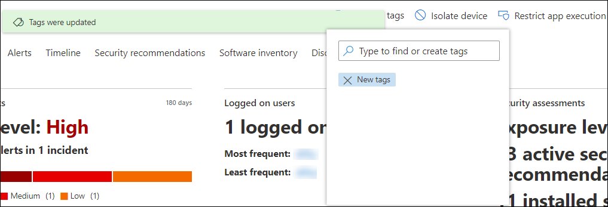

# 建立及管理裝置標記

[!INCLUDE [Microsoft 365 Defender rebranding](../../includes/microsoft-defender.md)]

**適用於：**
- [適用於端點的 Microsoft Defender](https://go.microsoft.com/fwlink/p/?linkid=2154037)
- [Microsoft 365 Defender](https://go.microsoft.com/fwlink/?linkid=2118804)

> 想要體驗 Microsoft Defender for Endpoint？ [註冊免費試用版。](https://www.microsoft.com/microsoft-365/windows/microsoft-defender-atp?ocid=docs-wdatp-exposedapis-abovefoldlink)

在裝置上新增標記，以建立邏輯群組從屬關係。 裝置標記支援正確的網路對應，可讓您附加不同的標記以捕獲內容，並在事件中啟用動態清單建立。 標籤可在 **裝置清單** 視圖中做為篩選器，或群組裝置使用。 如需裝置群組的詳細資訊，請參閱 [Create and manage device groups](machine-groups.md)。

您可以使用下列方法，在裝置上新增標籤：

- 使用入口網站
- 設定登錄機碼值

> [!NOTE]
> 在標籤新增至裝置清單和裝置中的裝置及其可用性時，可能會有一些延遲。  

若要使用 API 新增裝置標記，請參閱 [add or remove device TAGS API](add-or-remove-machine-tags.md)。

## 使用入口網站新增及管理裝置標記

1. 選取您要管理標記的裝置。 您可以從下列任何一種視圖中，選取或搜尋裝置：

   - **安全性作業儀表板** -從 [最上層裝置與使用中警示] 區段選取裝置名稱。
   - **警示佇列** -從警示佇列中，選取裝置圖示旁邊的裝置名稱。
   - **裝置清單** -從裝置清單中選取裝置名稱。
   - **搜尋框** -從下拉式功能表中選取 [裝置]，然後輸入裝置名稱。

     您也可以透過 [檔案] 和 [IP 視圖] 進入警示頁面。

2. 從 [回應動作] 列中，選取 [ **管理標記** ]。

    

3. 輸入以尋找或建立標記

    

標記會新增至裝置視圖，也會反映在 [裝置] **清單** 視圖上。 您可以使用 [ **標記** ] 篩選來查看相關的裝置清單。

>[!NOTE]
> 篩選可能無法處理包含括弧的標記名稱。 
> 當您建立新的標籤時，會顯示一份現有的標記清單。 清單只會顯示透過入口網站建立的標籤。 將不會顯示從用戶端裝置建立的現有標記。

您也可以從此視圖中刪除標記。

## 設定登錄機碼值以新增裝置標記

>[!NOTE]
> 僅適用于下列裝置：
>- Windows 10，版本1709或更新版本
>- Windows Server，版本1803或更新版本
>- Windows Server 2016
>- Windows Server 2012 R2
>- Windows Server 2008 R2 SP1
>- Windows 8.1
>- Windows 7 SP1

> [!NOTE] 
> 標記中可以設定的最大字元數為200。

當您需要在特定裝置清單上套用內容性動作時，具有類似標記的裝置可能十分方便。

使用下列登錄機碼專案在裝置上新增標籤：

- 登錄機碼： `HKEY_LOCAL_MACHINE\SOFTWARE\Policies\Microsoft\Windows Advanced Threat Protection\DeviceTagging\`
- 登錄機碼值 (REG_SZ) ： `Group`
- 登錄機碼資料： `Name of the tag you want to set`

>[!NOTE]
>裝置標記是一天產生一次的裝置資訊報告的一部分。 或者，您也可以選擇重新開機會傳輸新裝置資訊報告的端點。
> 
> 如果您需要移除以上述登錄機碼所新增的標籤，請清除登錄機碼資料的內容，而不是移除 ' 群組」機碼。
