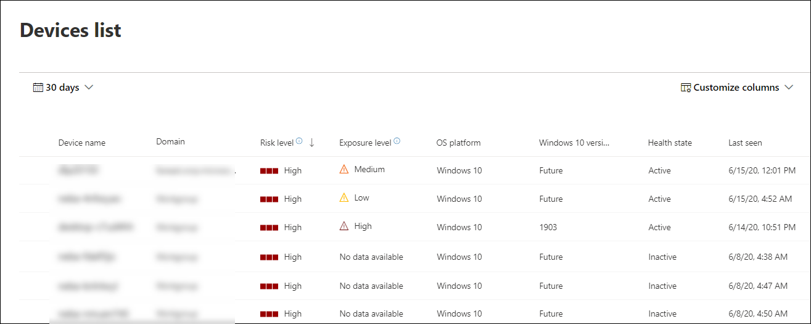

# 查看和組織 Microsoft Defender for Endpoint Devices 清單View and organize the Microsoft Defender for Endpoint Devices list

[!INCLUDE [Microsoft 365 Defender rebranding](../../includes/microsoft-defender.md)]

**適用於：****Applies to:**
- [適用於端點的 Microsoft DefenderMicrosoft Defender for Endpoint](https://go.microsoft.com/fwlink/p/?linkid=2154037)
- [Microsoft 365 DefenderMicrosoft 365 Defender](https://go.microsoft.com/fwlink/?linkid=2118804)

> 想要體驗 Defender for Endpoint？Want to experience Defender for Endpoint? [注册免費試用版。Sign up for a free trial.](https://www.microsoft.com/microsoft-365/windows/microsoft-defender-atp?ocid=docs-wdatp-machinesview-abovefoldlink)

[ **裝置] 清單** 會顯示您網路中產生警示的裝置清單。The **Devices list** shows a list of the devices in your network where alerts were generated. 依預設，佇列會顯示過去30天內看到的裝置。By default, the queue displays devices seen in the last 30 days.  

您將會看到諸如網域、風險層級、作業系統平臺及其他詳細資訊等資訊，以便更輕鬆地識別最具風險的裝置。At a glance you'll see information such as domain, risk level, OS platform, and other details for easy identification of devices most at risk.

您可以選擇從多個選項自訂 [裝置] 清單視圖。There are several options you can choose from to customize the devices list view. 您可以在上方導覽上進行下列作業：On the top navigation you can:

- 新增或移除欄Add or remove columns
- 以 CSV 格式匯出整個清單Export the entire list in CSV format
- 選取每頁顯示的專案數Select the number of items to show per page
- 套用篩選Apply filters

在上架過程中， **裝置清單** 會隨著裝置開始報告感應器資料而逐漸填滿。During the onboarding process, the **Devices list** is gradually populated with devices as they begin to report sensor data. 使用此視圖在線上時追蹤架端點，或下載完整的端點清單做為 CSV 檔案以供離線分析使用。Use this view to track your onboarded endpoints as they come online, or download the complete endpoint list as a CSV file for offline analysis.

>[!NOTE]
> 如果您匯出的是裝置清單，它會包含您組織中的每一部裝置。If you export the device list, it will contain every device in your organization. 視您的組織規模而定，可能需要很長的時間才能下載。It might take a significant amount of time to download, depending on how large your organization is. 以 CSV 格式匯出清單會以未篩選的方式顯示資料。Exporting the list in CSV format displays the data in an unfiltered manner. CSV 檔案會包含組織中的所有裝置，不論該視圖本身所套用的篩選。The CSV file will include all devices in the organization, regardless of any filtering applied in the view itself.

## 排序及篩選裝置清單Sort and filter the device list

您可以套用下列篩選器來限制警示清單，並取得更具焦點的視圖。You can apply the following filters to limit the list of alerts and get a more focused view.

### 風險層級Risk level

風險層級會根據因素的組合，反映裝置的整體風險評估，包括裝置上作用中警示的類型和嚴重性。The risk level reflects the overall risk assessment of the device based on a combination of factors, including the types and severity of active alerts on the device. 解決作用中的警示、核准修復活動，以及抑制後續的警示，可降低風險等級。Resolving active alerts, approving remediation activities, and suppressing subsequent alerts can lower the risk level.

### 公開層級Exposure level

暴露層級會根據未決安全性建議的累計影響，反映裝置目前的公開情況。The exposure level reflects the current exposure of the device based on the cumulative impact of its pending security recommendations. 可能的層級為低、中和高。The possible levels are low, medium, and high. 危險性低表示您的裝置不易受到攻擊。Low exposure means your devices are less vulnerable from exploitation.

如果暴露層級說「沒有可用的資料」，這可能是因為這種情況的原因：If the exposure level says "No data available," there are a few reasons why this may be the case:

- 裝置停止報告超過30天–在此情況下，它會被視為非使用中，而且不會計算曝光Device stopped reporting for more than 30 days – in that case it is considered inactive, and the exposure isn't computed
- 不支援裝置作業系統-請參閱 [Microsoft Defender For Endpoint 的基本需求](minimum-requirements.md)Device OS not supported - see [minimum requirements for Microsoft Defender for Endpoint](minimum-requirements.md)
- 具有陳舊代理程式的裝置 (很少) Device with stale agent (very unlikely)

### 作業系統平臺OS Platform

僅選取您想要調查的作業系統平臺。Select only the OS platforms you're interested in investigating.

### 健康狀態Health state

依下列裝置健康狀態進行篩選：Filter by the following device health states:

- 使用 **中–對服務主動報告** 感應器資料的裝置。**Active** – Devices that are actively reporting sensor data to the service.
- **非** 使用中–已完全停止傳送信號的裝置超過7天。**Inactive** – Devices that have completely stopped sending signals for more than 7 days.
- 未 **正確**–與服務通訊或無法傳送感應器資料的裝置。**Misconfigured** – Devices that have impaired communications with service or are unable to send sensor data. 設定錯誤的裝置可進一步分類為：Misconfigured devices can further be classified to:
  - 無感應器資料No sensor data
  - 受損的通訊Impaired communications

  如需如何解決誤設定之裝置之問題的詳細資訊，請參閱， [修正狀況不良的感應器](fix-unhealthy-sensors.md)。For more information on how to address issues on misconfigured devices see, [Fix unhealthy sensors](fix-unhealthy-sensors.md).

### 防病毒狀態Antivirus status

依防病毒狀態篩選裝置。Filter devices by antivirus status. 僅適用于使用中 Windows 10 裝置。Applies to active Windows 10 devices only.

- **Disabled** -已關閉病毒 & 威脅防護。**Disabled** - Virus & threat protection is turned off.
- **不報告** -病毒 & 威脅防護不會報告。**Not reporting** - Virus & threat protection is not reporting.
- **未更新** -病毒 & 威脅防護不是最新的。**Not updated** - Virus & threat protection is not up to date.

如需詳細資訊，請參閱 [View The 威脅 & 弱點管理儀表板](tvm-dashboard-insights.md)。For more information, see [View the Threat & Vulnerability Management dashboard](tvm-dashboard-insights.md).

### 威脅緩解狀態Threat mitigation status

若要查看可能受到特定威脅影響的裝置，請從下拉式功能表中選取威脅，然後選取需要緩解的弱點方位。To view devices that may be affected by a certain threat, select the threat from the dropdown menu, and then select what vulnerability aspect needs to be mitigated.

若要深入瞭解特定威脅，請參閱 [威脅分析](threat-analytics.md)。To learn more about certain threats, see [Threat analytics](threat-analytics.md). 如需緩解資訊，請參閱 [威脅 & 弱點管理](next-gen-threat-and-vuln-mgt.md)。For mitigation information, see [Threat & Vulnerability Management](next-gen-threat-and-vuln-mgt.md).

### Windows 10 版本Windows 10 version

僅選取您想要調查的 Windows 10 版本。Select only the Windows 10 versions you're interested in investigating.

### & 群組的標記Tags & Groups

根據您已新增至個別裝置的分組及標記，篩選清單。Filter the list based on the grouping and tagging that you've added to individual devices. 請參閱 [建立及管理裝置標記](machine-tags.md) ，以及 [建立和管理裝置群組](machine-groups.md)。See [Create and manage device tags](machine-tags.md) and [Create and manage device groups](machine-groups.md).

## 相關主題Related topics

- [調查 Microsoft Defender for Endpoint Devices 清單中的裝置Investigate devices in the Microsoft Defender for Endpoint Devices list](investigate-machines.md)
