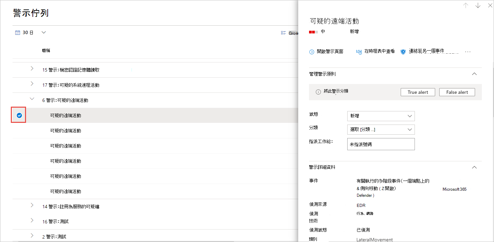

# 管理 Microsoft Defender for Endpoint 警示Manage Microsoft Defender for Endpoint alerts

[!INCLUDE [Microsoft 365 Defender rebranding](../../includes/microsoft-defender.md)]

**適用於：****Applies to:**
- [適用於端點的 Microsoft DefenderMicrosoft Defender for Endpoint](https://go.microsoft.com/fwlink/p/?linkid=2154037)
- [Microsoft 365 DefenderMicrosoft 365 Defender](https://go.microsoft.com/fwlink/?linkid=2118804)

> 想要體驗 Defender for Endpoint？Want to experience Defender for Endpoint? [注册免費試用版。Sign up for a free trial.](https://www.microsoft.com/microsoft-365/windows/microsoft-defender-atp?ocid=docs-wdatp-managealerts-abovefoldlink)

Defender for Endpoint 會透過提醒通知您可能的惡意事件、屬性和內容資訊。Defender for Endpoint notifies you of possible malicious events, attributes, and contextual information through alerts. [ **安全性作業] 儀表板** 會顯示新警示的摘要，您可以在 [ **警示] 佇列** 中存取所有警示。A summary of new alerts is displayed in the **Security operations dashboard**, and you can access all alerts in the **Alerts queue**.

您可以在 [ **警示] 佇列** 中選取警示，或個別裝置之 [裝置] 頁面的 [ **警示** ] 索引標籤，以管理提醒。You can manage alerts by selecting an alert in the **Alerts queue**, or the **Alerts** tab of the Device page for an individual device.

在其中一個位置選取警示會顯示 **警示管理窗格**。Selecting an alert in either of those places brings up the **Alert management pane**.

## 連結至另一個事件Link to another incident
您可以從警示中建立新的事件，或從現有的事件連結。You can create a new incident from the alert or link to an existing incident. 

## 指派提醒Assign alerts
若尚未指派警示，您可以選取 [ **指派給我** ] 指派提醒給您自己。If an alert is not yet assigned, you can select **Assign to me** to assign the alert to yourself.

## 抑制提醒Suppress alerts
在某些情況下，您可能需要抑制警告，使其不會出現在 Microsoft Defender 資訊安全中心中。There might be scenarios where you need to suppress alerts from appearing in Microsoft Defender Security Center. Defender for Endpoint 可讓您針對已知的特殊警示（如組織中的已知工具或處理常式），建立抑制規則。Defender for Endpoint lets you create suppression rules for specific alerts that are known to be innocuous such as known tools or processes in your organization.

抑制規則可以從現有的警示建立。Suppression rules can be created from an existing alert. 您可以視需要停用或重新啟用。They can be disabled and reenabled if needed.

在建立抑制規則時，它會從建立規則的點生效。When a suppression rule is created, it will take effect from the point when the rule is created. 在建立規則之前，規則不會影響佇列中已存在的警示。The rule will not affect existing alerts already in the queue, prior to the rule creation. 規則只會在建立規則之後，于符合條件設定的警示上套用。The rule will only be applied on alerts that satisfy the conditions set after the rule is created.

抑制規則有兩個內容可供您選擇：There are two contexts for a suppression rule that you can choose from:

- **抑制此裝置上的警示****Suppress alert on this device**
- **抑制組織中的警示****Suppress alert in my organization**

規則的內容可讓您定制入口網站中所呈現的內容，並確保只會將實際的安全性警示放入入口網站中。The context of the rule lets you tailor what gets surfaced into the portal and ensure that only real security alerts are surfaced into the portal.

您可以使用下表中的範例，協助您選擇抑制規則的內容：You can use the examples in the following table to help you choose the context for a suppression rule:

| **Context****Context**                           | **定義****Definition**                                                                                                                                              | **範例案例****Example scenarios**                                                                                                                                                                                                  |
|:--------------------------------------|:------------------------------------------------------------------------------------------------------------------------------------------------------------|:-----------------------------------------------------------------------------------------------------------------------------------------------------------------------------------------------------------------------|
| **抑制此裝置上的警示****Suppress alert on this device**    | 只有在該特定裝置上具有相同警示標題及的警示，才會遭到抑制。Alerts with the same alert title and on that specific device only will be suppressed.   將不會抑制該裝置上的所有其他警示。All other alerts on that device will not be suppressed. | <ul><li>安全性研究人員正在調查已用來攻擊組織中其他裝置的惡意腳本。A security researcher is investigating a malicious script that has been used to attack other devices in your organization.</li><li>開發人員定期為小組建立 PowerShell 腳本。A developer regularly creates PowerShell scripts for their team.</li></ul> |
| **抑制組織中的警示****Suppress alert in my organization** | 任何裝置上具有相同警示標題的警示都會遭到抑制。Alerts with the same alert title on any device will be suppressed.                                                                                         | <ul><li>您組織中的每個人都會使用良性系統管理工具。A benign administrative tool is used by everyone in your organization.</li></ul>                                                                                                                               |

### 抑制警示並建立新的抑制規則：Suppress an alert and create a new suppression rule:
建立自訂規則，以控制何時抑制或解決警告。Create custom rules to control when alerts are suppressed, or resolved. 您可以指定警示標題、安全指示器及條件，以控制抑制警示的上下文。You can control the context for when an alert is suppressed by specifying the alert title, Indicator of compromise, and the conditions. 在指定內容之後，您可以設定警示的動作和範圍。After specifying the context, you’ll be able to configure the action and scope on the alert. 

1. 選取您想要隱藏的警示。Select the alert you'd like to suppress. 這會顯示 **警示管理** 窗格。This brings up the **Alert management** pane.

2.  選取 [ **建立抑制規則**]。Select **Create a suppression rule**.

    您可以使用這些屬性建立抑制條件。You can create a suppression condition using these attributes. 每個條件間都會套用一個 AND 運算子，所以只有在符合所有條件時，才會發生抑制。An AND operator is applied between each condition, so suppression occurs only if all conditions are met.
    
    * 檔 SHA1File SHA1
    * 檔案名-支援萬用字元File name - wildcard supported
    * 資料夾路徑-支援萬用字元Folder path - wildcard supported
    * IP 位址IP address
    * URL-支援萬用字元URL - wildcard supported
    * 命令列-支援萬用字元Command line - wildcard supported

3. 選取 **觸發 IOC**。Select the **Triggering IOC**.
    
4. 指定警示的動作和範圍。Specify the action and scope on the alert.  
   您可以自動解決或隱藏來自入口網站的警示。You can automatically resolve an alert or hide it from the portal. 自動解決的警示將會出現在 [警示佇列]、[警示] 頁面及裝置時程表的 [已解析] 區段中，且會在每個 Defender for Endpoint APIs 中顯示為 [已解決]。Alerts that are automatically resolved will appear in the resolved section of the alerts queue, alert page, and device timeline and will appear as resolved across Defender for Endpoint APIs.    標記為隱藏的警示會從整個系統中抑制，這兩者位於裝置相關聯的警示上，以及來自于儀表板，而且不會在每個 Defender 進行端點 APIs 之間流動。Alerts that are marked as hidden will be suppressed from the entire system, both on the device's associated alerts and from the dashboard and will not be streamed across Defender for Endpoint APIs.

5. 輸入規則名稱和批註。Enter a rule name and a comment.

6. 按一下 **[儲存]**。Click **Save**.

#### 查看隱藏規則清單View the list of suppression rules

1. 在功能窗格中，選取 [**設定**  >  **警示抑制**]。In the navigation pane, select **Settings** > **Alert suppression**.

2. 抑制規則清單會顯示組織中使用者所建立的所有規則。The list of suppression rules shows all the rules that users in your organization have created.

如需管理抑制規則的相關資訊，請參閱 [Manage 抑制規則](manage-suppression-rules.md)For more information on managing suppression rules, see [Manage suppression rules](manage-suppression-rules.md)

## 變更警示的狀態Change the status of an alert

您可以在調查的進展中變更其狀態，將警示分類 (為 **新** 的、 **進行中** 或 **解決** 的) 。You can categorize alerts (as **New**, **In Progress**, or **Resolved**) by changing their status as your investigation progresses. 這可協助您組織和管理您的小組可以回應提醒的方式。This helps you organize and manage how your team can respond to alerts.

例如，小組主持人可以查看所有 **新** 的警示，並決定將其指派給 **進行中** 的佇列以進行進一步分析。For example, a team leader can review all **New** alerts, and decide to assign them to the **In Progress** queue for further analysis.

或者，小組主持人可能會將警示指派給 **已解析** 的佇列，如果他們知道警示是良性的，來自不 (相關的裝置，例如屬於安全性管理員的裝置) ，或是透過先前的警示來處理。Alternatively, the team leader might assign the alert to the **Resolved** queue if they know the alert is benign, coming from a device that is irrelevant (such as one belonging to a security administrator), or is being dealt with through an earlier alert.

## 警示分類Alert classification
您可以選擇不設定分類，或指定警示為 true 警示或 false 警示。You can choose not to set a classification, or specify whether an alert is a true alert or a false alert. 務必提供 true 正/假正值的分類。It's important to provide the classification of true positive/false positive. 這種分類是用來監視警示品質，並使提醒更準確。This classification is used to monitor alert quality, and make alerts more accurate. 「判斷」欄位會定義 "true 正值" 分類的額外逼真度。The "determination" field defines additional fidelity for a "true positive" classification. 

## 新增批註並查看警示的記錄Add comments and view the history of an alert
您可以新增批註及查看有關警示的歷史事件，以查看先前對警示所做的變更。You can add comments and view historical events about an alert to see previous changes made to the alert.

每當對警示進行變更或批註時，就會將它記錄在 [ **批註和記錄** ] 區段中。Whenever a change or comment is made to an alert, it is recorded in the **Comments and history** section.

新增的註解會立即顯示在窗格中。Added comments instantly appear on the pane.

## 相關主題Related topics
- [管理歸併規則Manage suppression rules](manage-suppression-rules.md)
- [查看和組織 Microsoft Defender for Endpoint 警示佇列View and organize the Microsoft Defender for Endpoint Alerts queue](alerts-queue.md)
- [調查 Microsoft Defender for Endpoint 警示Investigate Microsoft Defender for Endpoint alerts](investigate-alerts.md)
- [調查與 Microsoft Defender for Endpoint alert 相關聯的檔案Investigate a file associated with a Microsoft Defender for Endpoint alert](investigate-files.md)
- [調查 Microsoft Defender for Endpoint Devices 清單中的裝置Investigate devices in the Microsoft Defender for Endpoint Devices list](investigate-machines.md)
- [調查與 Microsoft Defender for Endpoint 警示相關聯的 IP 位址Investigate an IP address associated with a Microsoft Defender for Endpoint alert](investigate-ip.md)
- [調查與 Microsoft Defender for Endpoint alert 相關聯的網域Investigate a domain associated with a Microsoft Defender for Endpoint alert](investigate-domain.md)
- [調查 Microsoft Defender for Endpoint 中的使用者帳戶Investigate a user account in Microsoft Defender for Endpoint](investigate-user.md)
