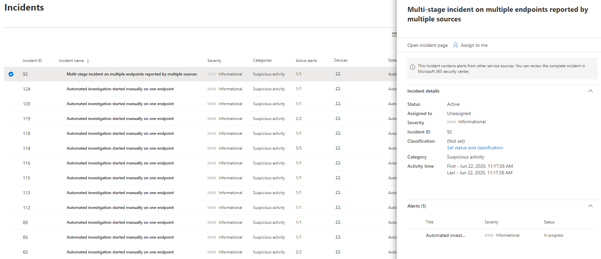

# 管理 Microsoft Defender for Endpoint 事件Manage Microsoft Defender for Endpoint incidents

[!INCLUDE [Microsoft 365 Defender rebranding](../../includes/microsoft-defender.md)]

**適用於：****Applies to:**
- [適用於端點的 Microsoft DefenderMicrosoft Defender for Endpoint](https://go.microsoft.com/fwlink/p/?linkid=2154037)
- [Microsoft 365 DefenderMicrosoft 365 Defender](https://go.microsoft.com/fwlink/?linkid=2118804)

> 想要體驗適用於端點的 Microsoft Defender 嗎？Want to experience Microsoft Defender for Endpoint? [注册免費試用版。Sign up for a free trial.](https://www.microsoft.com/microsoft-365/windows/microsoft-defender-atp?ocid=docs-wdatp-exposedapis-abovefoldlink)

管理事件是每個 cybersecurity 作業的重要部分。Managing incidents is an important part of every cybersecurity operation. 您可以從 [ **事件] 佇列** 或 [ **事件管理] 窗格** 中選取事件，以管理事件。You can manage incidents by selecting an incident from the **Incidents queue** or the **Incidents management pane**. 

從 [ **事件] 佇列** 中選取事件，會顯示 **事件管理窗格** ，您可以在其中開啟「事件」頁面以取得詳細資訊。Selecting an incident from the **Incidents queue** brings up the **Incident management pane** where you can open the incident page for details.

您可以指派事件給您自己、變更狀態和分類、重新命名或批註，以追蹤其進度。You can assign incidents to yourself, change the status and classification, rename, or comment on them to keep track of their progress.

> [!TIP]
> 更深入瞭解時，系統會根據受影響的端點數目、受影響的使用者、偵測來源或類別等警示屬性，自動產生事件名稱。For additional visibility at a glance, incident names are automatically generated based on alert attributes such as the number of endpoints affected, users affected, detection sources or categories. 這可讓您快速瞭解事件的範圍。This allows you to quickly understand the scope of the incident.
>
> 例如：多 *個來源所報告之多個端點上的多階段事件。*For example: *Multi-stage incident on multiple endpoints reported by multiple sources.*
>
> 自動事件命名的首次展示中已存在的事件，會保留其名稱。Incidents that existed prior the rollout of automatic incident naming will retain their names.
>

## 指派事件Assign incidents
若尚未指派事件，您可以選取 [ **指派給我** ] 指派給您自己的事件。If an incident has not been assigned yet, you can select **Assign to me** to assign the incident to yourself. 這樣做不僅表示您承擔該事件的擁有權，還包括所有與該事件相關的警示。Doing so assumes ownership of not just the incident, but also all the alerts associated with it.

## 設定狀態和分類Set status and classification
### 事件狀態Incident status
您可以在調查進行的過程中變更事件的狀態來將事件分類 (例如：**作用中** 或 **已解決**)。You can categorize incidents (as **Active**, or **Resolved**) by changing their status as your investigation progresses. 這可協助您組織及管理小組回應事件的方式。This helps you organize and manage how your team can respond to incidents.

例如，SoC 分析員可以查看一天的緊急 **主動** 事件，並決定將其指派給自己進行調查。For example, your SoC analyst can review the urgent **Active** incidents for the day, and decide to assign them to himself for investigation.

或者，您的 SoC 分析員可能會將事件 **設定為已** 修正的事件。Alternatively, your SoC analyst might set the incident as **Resolved** if the incident has been remediated. 

### 分類Classification
您可以選擇不要設定分類，或決定將事件指定為 true 或 false。You can choose not to set a classification, or decide to specify whether an incident is true or false. 這樣做可協助小組查看模式及深入瞭解。Doing so helps the team see patterns and learn from them.

### 新增註解Add comments
您可以新增註解及檢視與事件相關的歷史活動，以查看先前所做的變更。You can add comments and view historical events about an incident to see previous changes made to it.

對警示進行變更或新增註解時，便會記錄在 [註解和記錄] 區段中。Whenever a change or comment is made to an alert, it is recorded in the Comments and history section.

新增的註解會立即顯示在窗格中。Added comments instantly appear on the pane.

## 相關主題Related topics
- [事件佇列Incidents queue](https://docs.microsoft.com/microsoft-365/security/defender-endpoint/view-incidents-queue)
- [查看及組織事件佇列View and organize the Incidents queue](view-incidents-queue.md)
- [調查事件Investigate incidents](investigate-incidents.md)
