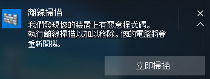

# <a name="run-and-review-the-results-of-a-microsoft-defender-offline-scan"></a>執行和檢查 Microsoft Defender Offline 掃描的結果

[!INCLUDE [Microsoft 365 Defender rebranding](../../includes/microsoft-defender.md)]


**適用於：**

- [適用於端點的 Microsoft Defender](/microsoft-365/security/defender-endpoint/)

Microsoft Defender Offline 是反惡意軟體掃描工具，可讓您從信任的環境引導及執行掃描。 掃描會從一般 Windows 內核以外的地方執行，因此可以針對企圖略過 Windows 命令介面的惡意程式碼，例如感染或覆寫主開機記錄 (MBR) 的病毒和 rootkit。

您可以使用 Microsoft Defender Offline 若懷疑惡意程式碼受到感染，或想要在惡意程式碼爆發後確認完全清除的端點。

在 Windows 10 中，您可以直接從[Windows 安全性應用程式](microsoft-defender-security-center-antivirus.md)按一下一次，即可執行 Microsoft Defender Offline。 在舊版的 Windows 中，使用者必須將 Microsoft Defender Offline 安裝至可引導的媒體、重新開機端點，然後載入可啟動的媒體。

## <a name="prerequisites-and-requirements"></a>必要條件和需求

Windows 10 中 Microsoft Defender Offline 的硬體需求與 Windows 10 相同。 

如需 Windows 10 需求的詳細資訊，請參閱下列主題：

- [最低硬體需求](/windows-hardware/design/minimum/minimum-hardware-requirements-overview)

- [硬體元件指導方針](/windows-hardware/design/component-guidelines/components)

> [!NOTE]
> 在具有 ARM 處理器的機器上，或在 Windows 伺服器股票保留單位上不支援 Microsoft Defender Offline。

若要從端點執行 Microsoft Defender Offline，使用者必須以系統管理員許可權登入。
 
## <a name="microsoft-defender-offline-updates"></a>Microsoft Defender Offline 更新

Microsoft Defender Offline 會使用端點上可用的最新保護更新;每當更新 Windows Defender 防毒軟體時，它就會更新。 

> [!NOTE]
> 在執行離線掃描之前，您應該嘗試更新 Microsoft Defender AV 保護。 您可以使用群組原則強制執行更新，也可以一般將更新部署至端點，也可以手動從[Microsoft 惡意程式碼防護中心](https://www.microsoft.com/security/portal/definitions/adl.aspx)下載並安裝最新的保護更新。

如需詳細資訊，請參閱[Manage Microsoft Defender 防毒軟體 Security 情報更新](manage-protection-updates-microsoft-defender-antivirus.md)主題。

## <a name="usage-scenarios"></a>使用情況

在 Windows 10 版本1607中，您可以手動強制執行離線掃描。 或者，如果 Windows Defender 判斷 Microsoft Defender Offline 需要執行，它會在端點上提示使用者。 

如果您要使用它來管理端點，也會在 Microsoft 端點管理員中顯示執行離線掃描的需求。

提示會透過通知進行，類似如下所示：



在 Windows Defender 用戶端中也會通知使用者。

在 [設定管理員] 中，您可以流覽至 **監視 > 一覽 > 安全性 > Endpoint Protection 狀態 > System Center Endpoint Protection 狀態**，識別端點的狀態。 

Microsoft Defender Offline 掃描會在 **惡意程式碼修復狀態** 下指出為 **需要離線掃描**。


## <a name="configure-notifications"></a>設定通知

Microsoft Defender Offline 通知是以與其他 Microsoft Defender AV 通知相同的原則設定進行設定。

如需 Windows Defender 中通知的詳細資訊，請參閱[設定出現在端點上的通知](configure-notifications-microsoft-defender-antivirus.md)主題。

## <a name="run-a-scan"></a>執行掃描 

> [!IMPORTANT]
> 在您使用 Microsoft Defender Offline 之前，請確定您已儲存任何檔案並關閉執行中的程式。 Microsoft Defender Offline 掃描大約需要15分鐘才能執行。 掃描完成後，它會重新開機端點。 掃描會在一般的 Windows 運作環境以外執行。 使用者介面會出現在 Windows Defender 執行的一般掃描時有所不同。 掃描完成後，將會重新開機端點，而且 Windows 會正常載入。

您可以使用下列執行 Microsoft Defender Offline 掃描：

- PowerShell
- Windows Management Instrumentation (WMI)
- Windows 安全性應用程式


### <a name="use-powershell-cmdlets-to-run-an-offline-scan"></a>使用 PowerShell Cmdlet 執行離線掃描

使用下列 Cmdlet：

```PowerShell
Start-MpWDOScan
```

如需如何搭配 Microsoft Defender 防毒軟體使用 PowerShell 的詳細資訊，請參閱[Use PowerShell Cmdlet 以設定及執行 Microsoft Defender 防毒軟體](use-powershell-cmdlets-microsoft-defender-antivirus.md)和[Defender Cmdlet](/powershell/module/defender/) 。

### <a name="use-windows-management-instruction-wmi-to-run-an-offline-scan"></a>使用 Windows 管理指令 (WMI) 執行離線掃描

使用 [**MSFT_MpWDOScan**](/previous-versions/windows/desktop/legacy/dn455323(v=vs.85)) 類別執行離線掃描。

下列 WMI 腳本片段會立即執行 Microsoft Defender Offline 掃描，這會導致端點重新開機、執行離線掃描，然後重新開機並引導至 Windows。

```console
wmic /namespace:\\root\Microsoft\Windows\Defender path MSFT_MpWDOScan call Start 
```

如需詳細資訊，請參閱下列各項：
- [Windows DefenderWMIv2 APIs](/previous-versions/windows/desktop/defender/windows-defender-wmiv2-apis-portal)


### <a name="use-the-windows-defender-security-app-to-run-an-offline-scan"></a>使用 Windows Defender 安全性應用程式執行離線掃描

1. 按一下工作列中的盾牌圖示，或搜尋 **Defender** 的 [開始] 功能表，以開啟 Windows 安全性應用程式。

2. 在左功能表列上，按一下 [ **病毒 & 威脅防護** 磚] (或盾牌圖示) ，然後按一下 [ **高級掃描** ] 標籤：
    
3. 選取 [ **Microsoft Defender Offline 掃描**]，然後按一下 [**立即掃描**]。

    > [!NOTE]
    > 在 Windows 10 中，版本1607，可從 **Windows 設定**  >  **Update & security**  >  **Windows Defender** 或從 Windows Defender 用戶端執行離線掃描。


## <a name="review-scan-results"></a>查看掃描結果

Microsoft Defender Offline 掃描結果將會列在[Windows 安全性應用程式的 [掃描記錄] 區段](microsoft-defender-security-center-antivirus.md)中。 


## <a name="related-articles"></a>相關文章

- [自訂、啟動和審查掃描和修正的結果](customize-run-review-remediate-scans-microsoft-defender-antivirus.md)
- [Windows 10 中的 Microsoft Defender 防毒軟體](microsoft-defender-antivirus-in-windows-10.md)