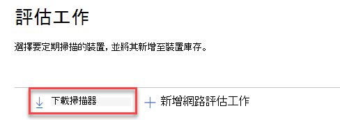
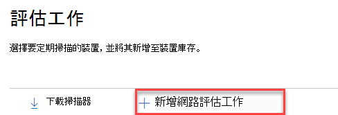

# 網路裝置探索和弱點管理Network device discovery and vulnerability management

[!INCLUDE [Microsoft 365 Defender rebranding](../../includes/microsoft-defender.md)]

**適用於：****Applies to:**

- [適用於端點的 Microsoft DefenderMicrosoft Defender for Endpoint](https://go.microsoft.com/fwlink/?linkid=2154037)
- [威脅及弱點管理Threat and vulnerability management](next-gen-threat-and-vuln-mgt.md)
- [Microsoft 365 DefenderMicrosoft 365 Defender](https://go.microsoft.com/fwlink/?linkid=2118804)

>想要體驗適用於端點的 Microsoft Defender 嗎？Want to experience Microsoft Defender for Endpoint? [注册免費試用版。Sign up for a free trial.](https://www.microsoft.com/microsoft-365/windows/microsoft-defender-atp?ocid=docs-wdatp-portaloverview-abovefoldlink)

> [!NOTE]  
> 「 [網路設備探索」和「安全性漏洞評估](https://techcommunity.microsoft.com/t5/microsoft-defender-for-endpoint/network-device-discovery-and-vulnerability-assessments/ba-p/2267548) 」博客 \( 發佈 \) 的04-13-2021 可深入瞭解如何在適用于 Endpoint 的 Defender 中進行新的 **網路設備探索** 功能。The [Network device discovery and vulnerability assessments](https://techcommunity.microsoft.com/t5/microsoft-defender-for-endpoint/network-device-discovery-and-vulnerability-assessments/ba-p/2267548) Blog \(published 04-13-2021\) provides insights into the new **Network device discovery** capabilities in Defender for Endpoint. 本文提供 **網路裝置探索** 的設計目的問題，以及如何開始使用這些新功能的詳細資訊的概述。This article provides an overview of the challenge that **Network device discovery** is designed to address, and detailed information about how get started using these new capabilities.

網路探索功能可在「Microsoft 365 安全性中心」和「Microsoft Defender 資訊安全中心主控台」的 [**裝置庫存**] 區段中取得。Network discovery capabilities are available in the **Device inventory** section of the Microsoft 365 security center and Microsoft Defender Security Center consoles.  

會在每個網段上使用指定的 Microsoft Defender for Endpoint 裝置，對預先設定的網路裝置執行定期驗證掃描。A designated Microsoft Defender for Endpoint device will be used on each network segment to perform periodic authenticated scans of preconfigured network devices. 一旦探索，Defender 的威脅與弱點管理功能會提供整合式工作流程，以保護探索到的交換器、路由器、WLAN 控制器、防火牆和 VPN 閘道。Once discovered, Defender for Endpoint’s threat and vulnerability management capabilities provide integrated workflows to secure discovered switches, routers, WLAN controllers, firewalls, and VPN gateways.  

一旦發現網路裝置並分類，安全性系統管理員就能接收最新的安全性建議，並在其組織中的網路裝置上回顧最近發現的漏洞。Once the network devices are discovered and classified, security administrators will be able to receive the latest security recommendations and review recently discovered vulnerabilities on network devices deployed across their organizations.

## 方法Approach

由於 Endpoint 的 Defender 沒有內置於網路裝置中的感應器，因此不會將網路裝置當作標準端點進行管理。Network devices are not managed as standard endpoints since Defender for Endpoint doesn’t have a sensor built into the network devices themselves. 這些類型的裝置需要一種無代理的方式，遠端掃描會從裝置取得所需的資訊。These types of devices require an agentless approach where a remote scan will obtain the necessary information from the devices. 根據網路拓撲及特性，架至 Microsoft Defender for Endpoint 的單一裝置或少數裝置會使用 SNMP (唯讀) 來執行網路裝置的驗證掃描。Depending on the network topology and characteristics, a single device or a few devices onboarded to Microsoft Defender for Endpoint will perform authenticated scans of network devices using SNMP (read-only).

有兩種類型的裝置需要謹記：There will be two types of devices to keep in mind:

- **評估裝置**：已架的裝置，可供您用來掃描網路裝置。**Assessment device**: A device that's already onboarded that you'll use to scan the network devices.
- **網路裝置**：您要掃描和上架的網路裝置。**Network devices**: The network devices you plan to scan and onboard.

### 網路裝置的弱點管理Vulnerability management for network devices 

一旦發現網路裝置並分類，安全性系統管理員就能接收最新的安全性建議，並在其組織中的網路裝置上回顧最近發現的漏洞。Once the network devices are discovered and classified, security administrators will be able to receive the latest security recommendations and review recently discovered vulnerabilities on network devices deployed across their organizations.  

## 支援的作業系統Operating systems that are supported

目前支援下列作業系統：The following operating systems are currently supported:

- Cisco IOS，IOS-XE，NX-OSCisco IOS, IOS-XE, NX-OS
- 刺柏 JUNOSJuniper JUNOS
- HPE ArubaOS，Procurve 切換軟體HPE ArubaOS, Procurve Switch Software
- Palo Alto 網路 PAN-OSPalo Alto Networks PAN-OS

更多的網路廠商和作業系統會隨著時間而新增，根據客戶的使用量收集的資料而定。More networking vendors and OS will be added over time, based on data gathered from customer usage. 因此，您建議您設定所有網路裝置，即使這些裝置未在此清單中指定也是一樣。Therefore, you are encouraged to configure all your network devices, even if they’re not specified in this list.

## 如何開始使用How to get started

第一步是選取將執行已驗證網路掃描的裝置。Your first step is to select a device that will perform the authenticated network scans.

1. 決定架裝置的 Defender for Endpoint 裝置 (用戶端或伺服器) ，其具有您規劃掃描之網路裝置的網路連線。Decide on a Defender for Endpoint onboarded device (client or server) that has a network connection to the management port for the network devices you plan on scanning. 

2. 在端點評估裝置和目標網路裝置之間的 SNMP 流量必須 (例如，由防火牆) 使用。SNMP traffic between the Defender for Endpoint assessment device and the targeted network devices must be allowed (for example, by the Firewall).

3. 決定要評估哪些網路裝置以取得漏洞 (例如： Cisco 交換器或 Palo Alto 網路防火牆) 。Decide which network devices will be assessed for vulnerabilities (for example: a Cisco switch or a Palo Alto Networks firewall).  

4. 確定所有設定之網路裝置上都已啟用 SNMP 唯讀功能，以允許 Endpoint Endpoint 評估裝置查詢已設定的網路裝置。Make sure SNMP read-only is enabled on all configured network devices to allow the Defender for Endpoint assessment device to query the configured network devices. 這項功能的適當功能不需要「SNMP 寫入」。‘SNMP write’ isn't needed for the proper functionality of this feature.

5. 取得要掃描之網路裝置的 IP 位址 (或) 部署這些裝置的子網。Obtain the IP addresses of the network devices to be scanned (or the subnets where these devices are deployed).

6. 取得網路裝置的 SNMP 認證 (例如： Community String、noAuthNoPriv、authNoPriv、authPriv) 。Obtain the SNMP credentials of the network devices (for example: Community String, noAuthNoPriv, authNoPriv, authPriv). 設定新的評估工作時，您必須提供認證。You’ll be required to provide the credentials when configuring a new assessment job.  

7. Proxy 用戶端設定：除了 Defender for Endpoint 裝置 proxy 需求以外，不需要額外的設定。Proxy client configuration: No extra configuration is required other than the Defender for Endpoint device proxy requirements.

8. 若要允許網路掃描器驗證並正確運作，您必須新增下列網域/URLs：To allow the network scanner to be authenticated and work properly, it's essential that you add the following domains/URLs:

    - login.windows.netlogin.windows.net  
    - securitycenter.windows.com\*.securitycenter.windows.com
    - login.microsoftonline.comlogin.microsoftonline.com
    - \* blob.core.windows.net/networkscannerstable/\*\*.blob.core.windows.net/networkscannerstable/ \*

    > [!NOTE]
    > 並非所有 URLs 都已在已記錄的 Endpoint 中指定允許的資料收集的清單。Not all URLs are specified in the Defender for Endpoint documented list of allowed data collection.

## 權限Permissions

若要設定評估工作，需要下列使用者許可權選項： **管理安全性中心的安全性設定**。To configure assessment jobs, the following user permission option is required: **Manage security settings in Security Center**. 您可以移至 **設定** 角色，以尋找許可權  >  \*\*\*\*。You can find the permission by going to **Settings** > **Roles**. 如需詳細資訊，請參閱 [建立及管理以角色為基礎的存取控制角色](user-roles.md)。For more information, see [Create and manage roles for role-based access control](user-roles.md).

## 安裝網路掃描程式Install the network scanner

1. 移至 **Microsoft 365 security**  >  **設定**  >    >  (**網路評估**) 的端點 **評估工作**。Go to **Microsoft 365 security** > **Settings** > **Endpoints** > **Assessment jobs** (under **Network assessments**).
    1. 在 Microsoft Defender 資訊安全中心中，移至設定 > 評估工作] 頁面。In the Microsoft Defender Security Center, go to Settings > Assessment jobs page.

2. 下載網路掃描程式，並將其安裝在「指定的 Defender for Endpoint 評估」裝置上。Download the network scanner and install it on the designated Defender for Endpoint assessment device.

    > [!div class="mx-imgBorder"]
    > 

## 網路掃描器安裝 & 註冊Network scanner installation & registration

您可以在指定的評估裝置自身或任何其他裝置上完成登入程式，例如，您的個人用戶端裝置)  (。The signing-in process can be completed on the designated assessment device itself or any other device (for example, your personal client device).

若要完成網路掃描程式註冊程式：To complete the network scanner registration process:

1. 複製並追蹤出現在命令列上的 URL，並使用提供的安裝程式碼完成註冊程式。Copy and follow the URL that appears on the command line and use the provided installation code to complete the registration process.

    > [!NOTE]
    > 您可能需要變更命令提示字元設定，才能複製 URL。You may need to change Command Prompt settings to be able to copy the URL.

2. 使用「管理安全性中心的安全性設定」許可權的 Microsoft 帳戶輸入程式碼並登入。Enter the code and sign in using a Microsoft account that has the Defender for Endpoint permission called "Manage security settings in Security Center."

3. 完成後，您應該會看到一則確認已登入的郵件。When finished, you should see a message confirming you have signed in.

## 設定新的評估工作Configure a new assessment job  

在 **設定** 的 [評估工作] 頁面中，選取 [**新增網路評估工作**]。In the Assessment jobs page in **Settings**, select **Add network assessment job**. 依照設定程式選擇要定期掃描的網路裝置，並將其新增至設備清查。Follow the set-up process to choose network devices to be scanned regularly and added to the device inventory.

若要防止網路設備清查中的裝置重複，請確定每個 IP 位址在多個評估裝置中只設定一次。To prevent device duplication in the network device inventory, make sure each IP address is configured only once across multiple assessment devices.

> [!div class="mx-imgBorder"]
> 

新增網路評估工作步驟：Adding a network assessment job steps:

1. 選擇「評估工作」名稱和安裝網路掃描器的「評估裝置」。Choose an ‘Assessment job’ name and the ‘Assessment device’ on which the network scanner was installed. 此裝置會執行定期驗證掃描。This device will perform the periodic authenticated scans.

2. 新增要掃描的目標網路裝置的 IP 位址 (或) 部署這些裝置的子網。Add IP addresses of target network devices to be scanned (or the subnets where these devices are deployed). 

3. 新增目標網路裝置所需的 SNMP 認證。Add required SNMP credentials of the target network devices. 

4. 儲存新設定的網路評估工作，以啟動定期網路掃描。Save the newly configured network assessment job to start the periodic network scan. 

### 掃描及新增網路裝置Scan and add network devices

在設定過程中，您可以執行一次測試掃描，以確認：During the set-up process, you can perform a one time test scan to verify that:

- 在端點評估裝置和設定的目標網路裝置之間，有連線能力。There is connectivity between the Defender for Endpoint assessment device and the configured target network devices.
- 設定的 SNMP 認證正確無誤。The configured SNMP credentials are correct.

每個評估裝置可支援最多1500個成功的 IP 位址掃描。Each assessment device can support up to 1,500 successful IP addresses scan. 例如，如果您掃描10個不同的子網，其中只有 100 IP 位址會傳回成功的結果，您就可以從相同評估裝置上的其他子網掃描 1400 IP 其他位址。For example, if you scan 10 different subnets where only 100 IP addresses return successful results, you will be able to scan 1,400 IP additional addresses from other subnets on the same assessment device.  

如果有多個 IP 位址範圍/子網可供掃描，測試掃描結果將需要數分鐘的時間才能顯示。If there are multiple IP address ranges/subnets to scan, the test scan results will take several minutes to show up. 測試掃描可用於最多1024個位址。A test scan will be available for up to 1,024 addresses.

結果顯示後，您可以選擇要包含在定期掃描中的裝置。Once the results show up, you can choose which devices will be included in the periodic scan. 如果您略過查看掃描結果，不論裝置的回應) 為何，所有設定的 IP 位址都會新增至網路評估工作 (。If you skip viewing the scan results, all configured IP addresses will be added to the network assessment job (regardless of the device’s response). 也可以匯出掃描結果。The scan results can also be exported.

## 裝置清單Device inventory

新發現的裝置會顯示在 [**裝置庫存**] 頁面的 [新增 **網路裝置**] 索引標籤底下。Newly discovered devices will be shown under the new **Network devices** tab in the **Device inventory** page. 在新增評估工作之前，可能需要長達兩小時，直到裝置更新為止。It may take up to two hours after adding an assessment job until the devices are updated.

> [!div class="mx-imgBorder"]
> ![裝置庫存中的 [網路裝置] 區段](images/assessment-jobs-device-inventory.png)

## 疑難排解Troubleshooting

### 網路掃描器安裝失敗Network scanner installation has failed

確認所需的 URLs 已新增至防火牆設定中的允許網域。Verify that the required URLs are added to the allowed domains in your firewall settings. 此外，請確定已依照 [設定裝置 proxy 和網際網路連線設定](configure-proxy-internet.md)中所述的方式來設定 proxy 設定。Also, make sure proxy settings are configured as described in [Configure device proxy and Internet connectivity settings](configure-proxy-internet.md).

### 未顯示 Microsoft.com/devicelogin 網頁The Microsoft.com/devicelogin web page did not show up

確認所需的 URLs 已新增至防火牆中的允許網域。Verify that the required URLs are added to the allowed domains in your firewall. 此外，請確定已依照 [設定裝置 proxy 和網際網路連線設定](configure-proxy-internet.md)中所述的方式來設定 proxy 設定。Also, make sure proxy settings are configured as described in [Configure device proxy and Internet connectivity settings](configure-proxy-internet.md).

### 在幾個小時後，網路裝置不會顯示在設備清查中Network devices are not shown in the device inventory after several hours

在完成評估工作設定之後所發生的初始掃描後，應在幾小時之後更新掃描結果。The scan results should be updated a few hours after the initial scan that took place after completing the assessment job configuration.

如果仍未顯示裝置，請確認服務 ' MdatpNetworkScanService ' 已在您安裝網路掃描程式的評估裝置上執行，並在相關的評估工作設定中執行「執行掃描」。If devices are still not shown, verify that the service ‘MdatpNetworkScanService’ is running on your assessment devices, on which you installed the network scanner, and perform a “Run scan” in the relevant assessment job configuration.  

如果5分鐘之後仍未取得結果，請重新開機服務。If you still don’t get results after 5 minutes, restart the service.  

### 裝置上次看到時間超過24小時Devices last seen time is longer than 24 hours

驗證掃描器是否正常運作。Validate that the scanner is running properly. 然後移至 [掃描定義]，然後選取 [執行測試]。Then go to the scan definition and select “Run test.” 檢查相關 IP 位址傳回的錯誤訊息。Check what error messages are returning from the relevant IP addresses.

### 必要威脅與弱點管理使用者許可權Required threat and vulnerability management user permission

註冊完成時出現錯誤：「似乎您沒有足夠的許可權可以新增代理程式。Registration finished with an error: "It looks like you don't have sufficient permissions for adding a new agent. 必要的許可權是「管理安全性中心的安全性設定」。The required permission is 'Manage security settings in Security Center'."

按任意鍵退出。Press any key to exit.

請系統管理員為您指派必要的許可權。Ask your system administrator to assign you the required permissions. 或者，您可以透過提供登入程式碼和連結，讓另一個相關成員協助您進行登入處理常式。Alternately, ask another relevant member to help you with the sign-in process by providing them with the sign-in code and link.

### 註冊程式在註冊程式的命令列中使用提供的連結失敗Registration process fails using provided link in the command line in registration process

嘗試其他瀏覽器或將登入連結和程式碼複製到不同的裝置。Try a different browser or copy the sign-in link and code to a different device.

### 文字太小或無法從命令列複製文字Text too small or can’t copy text from command line

變更裝置上的命令列設定，以允許複製及變更文字大小。Change command-line settings on your device to allow copying and change text size.

## 相關文章Related articles

- [裝置清單Device inventory](machines-view-overview.md)
- [設定進階功能Configure advanced features](advanced-features.md)
