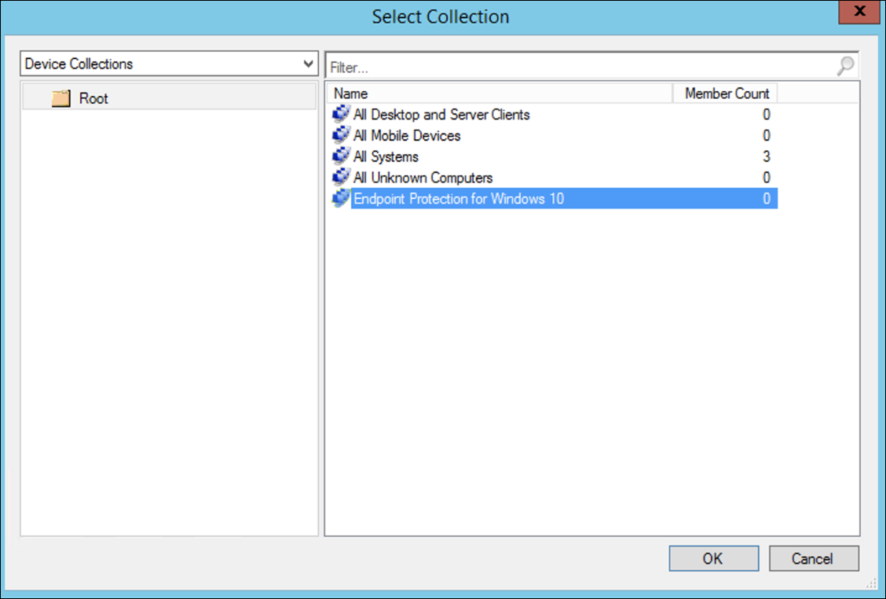
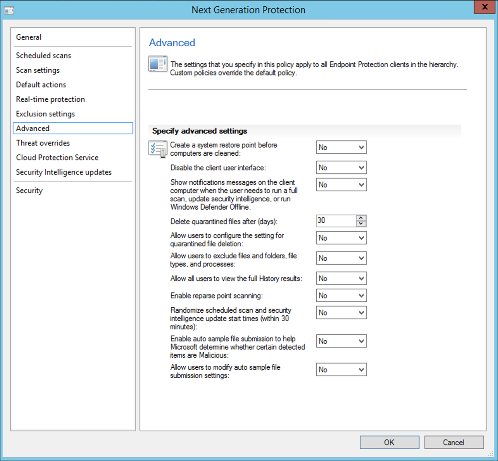
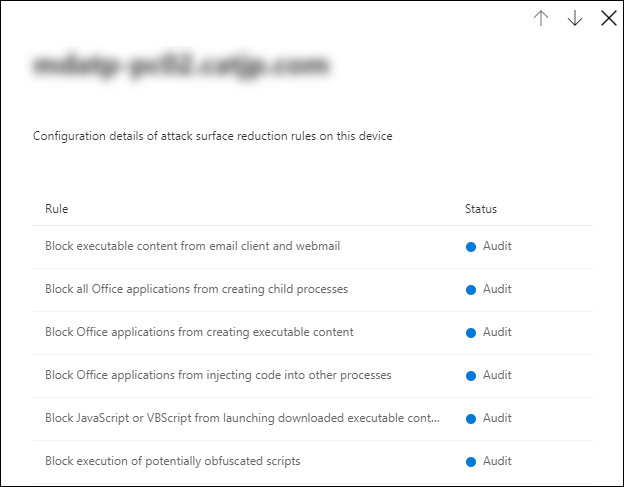

# 使用 Microsoft Endpoint Configuration Manager 上架Onboarding using Microsoft Endpoint Configuration Manager

[!INCLUDE [Microsoft 365 Defender rebranding](../../includes/microsoft-defender.md)]

**適用於：****Applies to:**
- [適用於端點的 Microsoft DefenderMicrosoft Defender for Endpoint](https://go.microsoft.com/fwlink/p/?linkid=2154037)
- [Microsoft 365 DefenderMicrosoft 365 Defender](https://go.microsoft.com/fwlink/?linkid=2118804)

> 想要體驗 Microsoft Defender for Endpoint？Want to experience Microsoft Defender for Endpoint? [註冊免費試用版。Sign up for a free trial.](https://www.microsoft.com/microsoft-365/windows/microsoft-defender-atp?ocid=docs-wdatp-exposedapis-abovefoldlink)

本文是部署指南的一部分，可做為上架方法的範例。This article is part of the Deployment guide and acts as an example onboarding method. 

在 [規劃](deployment-strategy.md) 主題中，有數種方法可提供給板載裝置給服務。In the [Planning](deployment-strategy.md) topic, there were several methods provided to onboard devices to the service. 本主題涵蓋共同管理架構。This topic covers the co-management architecture. 

 *圖表* 的影像
*Diagram of environment architectures*

當 Defender for Endpoint 支援各種端點和工具的上架時，本文並未涵蓋這類功能。While Defender for Endpoint supports onboarding of various endpoints and tools, this article does not cover them. 如需使用其他支援部署工具及方法的一般上架資訊，請參閱上 [架一覽](onboarding.md)。For information on general onboarding using other supported deployment tools and methods, see [Onboarding overview](onboarding.md).

本主題指導使用者：This topic guides users in:
- 步驟1：將 Windows 裝置上架至服務Step 1: Onboarding Windows devices to the service 
- 步驟2：設定用於端點功能的 DefenderStep 2: Configuring Defender for Endpoint capabilities

此上架指引會逐步引導您使用 Microsoft 端點設定管理員時，您必須採取下列基本步驟：This onboarding guidance will walk you through the following basic steps that you need to take when using Microsoft Endpoint Configuration Manager:
- **在 Microsoft 端點 Configuration Manager 中建立集合****Creating a collection in Microsoft Endpoint Configuration Manager**
- **使用 Microsoft Endpoint Configuration Manager 設定 Microsoft Defender for Endpoint 功能****Configuring Microsoft Defender for Endpoint capabilities using Microsoft Endpoint Configuration Manager**

>[!NOTE]
>在此範例部署中只涵蓋 Windows 裝置。Only Windows devices are covered in this example deployment. 

## 步驟1：使用 Microsoft 端點 Configuration Manager 的板載 Windows 裝置Step 1: Onboard Windows devices using Microsoft Endpoint Configuration Manager

### 集合建立Collection creation
若要使用 Microsoft 端點設定管理員對 Windows 10 裝置進行板載部署，部署可以針對現有集合，也可以建立新的集合以供測試。To onboard Windows 10 devices with Microsoft Endpoint Configuration Manager, the deployment can target an existing collection or a new collection can be created for testing. 

使用群組原則或手動方法的工具上架不會在系統上安裝任何代理程式。Onboarding using tools such as Group policy or manual method does not install any agent on the system. 

在 Microsoft 端點 Configuration Manager 主控台內，上架過程會設定為主控台中的規範設定的一部分。Within the Microsoft Endpoint Configuration Manager console the onboarding process will be configured as part of the compliance settings within the console.

只要 Configuration Manager 用戶端繼續從管理點接收此原則，任何接收此必要設定的系統都會維護該設定。Any system that receives this required configuration will maintain that configuration for as long as the Configuration Manager client continues to receive this policy from the management point. 

請遵循下列步驟，使用 Microsoft 端點 Configuration Manager 進行板載端點。Follow the steps below to onboard endpoints using Microsoft Endpoint Configuration Manager.

1. 在 Microsoft 端點 Configuration Manager 主控台中，流覽至 **[資產] 和 [合規性 \> 一覽表] \> 裝置集合**。In Microsoft Endpoint Configuration Manager console, navigate to **Assets and Compliance \> Overview \> Device Collections**.            

    

2. 以滑鼠右鍵按一下 [ **裝置集合** ]，然後選取 [ **建立裝置集合**]。Right Click **Device Collection** and select **Create Device Collection**.

    

3. 提供 **名稱** 及 **限制集合**，然後選取 **[下一步]**。Provide a **Name** and **Limiting Collection**, then select **Next**.

    

4. 選取 [ **新增規則** ]，然後選擇 [ **查詢規則**]。Select **Add Rule** and choose **Query Rule**.

    

5.  在 [**直屬成員資格] 嚮導** 中按 **[下一步**]，然後按一下 [**編輯查詢語句**]Click **Next** on the **Direct Membership Wizard** and click on **Edit Query Statement**.

     

6. 選取 [ **準則** ]，然後選擇星形圖示。Select **Criteria** and then choose the star icon.

     

7. 將條件類型保留為 **簡單值**，請選擇 [目標為： **作業系統組建編號**]，運算子為 **大於或等於** 和值 **14393** ，然後按一下 **[確定]**。Keep criterion type as **simple value**, choose where as **Operating System - build number**, operator as **is greater than or equal to** and value **14393** and click on **OK**.

    

8. 選取 **[下一步] 和 [** **關閉**]。Select **Next** and **Close**.

    

9. 選取 [下一步]。Select **Next**.

    

完成此工作之後，您現在有一個裝置集合，具有環境中所有 Windows 10 端點。After completing this task, you now have a device collection with all the Windows 10 endpoints in the environment. 

## 步驟2：設定 Microsoft Defender for Endpoint 功能Step 2: Configure Microsoft Defender for Endpoint capabilities 
本節會引導您使用 Windows 裝置上的 Microsoft Endpoint Configuration Manager 來設定下列功能：This section guides you in configuring the following capabilities using Microsoft Endpoint Configuration Manager on Windows devices:

- [**端點偵測及回應****Endpoint detection and response**](#endpoint-detection-and-response)
- [**下一代保護****Next-generation protection**](#next-generation-protection)
- [**受攻擊面縮小****Attack surface reduction**](#attack-surface-reduction)

### 端點偵測及回應Endpoint detection and response
#### Windows 10Windows 10
在 Microsoft Defender Security Center 中，您可以下載可用於在 System Center Configuration Manager 中建立原則的「. 上架」原則，並將該原則部署至 Windows 10 裝置。From within the Microsoft Defender Security Center it is possible to download the '.onboarding' policy that can be used to create the policy in System Center Configuration Manager and deploy that policy to Windows 10 devices.

1. 從 Microsoft Defender Security Center 入口網站，選取 [設定]，然後按 [上 [架](https://securitycenter.windows.com/preferences2/onboarding)]。From a Microsoft Defender Security Center Portal, select [Settings and then Onboarding](https://securitycenter.windows.com/preferences2/onboarding).

2. 在 [部署方法] 底下，選取支援的 **Microsoft 端點 Configuration Manager** 版本。Under Deployment method select the supported version of **Microsoft Endpoint Configuration Manager**.

    

3. 選取 [ **下載套件**]。Select **Download package**.

    

4. 將套件儲存至可存取的位置。Save the package to an accessible location.
5. 在 [Microsoft 端點設定管理員] 中，流覽至：「 **資產和合規性 > 概述 > Endpoint Protection > Microsoft DEFENDER ATP 原則**。In  Microsoft Endpoint Configuration Manager, navigate to: **Assets and Compliance > Overview > Endpoint Protection > Microsoft Defender ATP Policies**.

6. 以滑鼠右鍵按一下 [ **Microsoft DEFENDER Atp 原則** ]，然後選取 [ **建立 Microsoft defender atp 原則**]。Right-click **Microsoft Defender ATP Policies** and select **Create Microsoft Defender ATP Policy**.

    

7. 輸入名稱和描述，確認已選取 [上 **架** ]，然後選取 **[下一步]**。Enter the name and description, verify **Onboarding** is selected, then select **Next**.

    

8. 按一下 [瀏覽]。Click **Browse**.

9. 流覽至上述步驟4下載檔案的位置。Navigate to the location of the downloaded file from step 4 above.

10. 按 [下一步]。Click **Next**.
11. 以適當的範例設定代理 (**無** 或 **所有檔案類型**) 。Configure the Agent with the appropriate samples (**None** or **All file types**).

    

12. 選取適當的遙測 (**Normal** 或 **加急**) 然後按 **[下一步]**。Select the appropriate telemetry (**Normal** or **Expedited**) then click **Next**.

    

14. 確認設定，然後按 **[下一步]**。Verify the configuration, then click **Next**.

     

15. 當嚮導完成時，按一下 [ **關閉** ]。Click **Close** when the Wizard completes.

16.  在 Microsoft 端點 Configuration Manager 主控台中，以滑鼠右鍵按一下您剛才建立的 Defender for Endpoint 原則，然後選取 [ **部署**]。In the Microsoft Endpoint Configuration Manager console, right-click the Defender for Endpoint policy you just created and select **Deploy**.

     

17. 在右窗格中，選取先前建立的集合，然後按一下 **[確定]**。On the right panel, select the previously created collection and click **OK**.

    

#### 舊版本的 Windows 用戶端 (Windows 7 和 Windows 8.1) Previous versions of Windows Client (Windows 7 and Windows 8.1)
請遵循下列步驟來識別用於上架舊版 Windows 的 Defender 工作區識別碼和工作區金鑰。Follow the steps below to identify the Defender for Endpoint Workspace ID and Workspace Key, that will be required for the onboarding of previous versions of Windows.

1. 從 Microsoft Defender Security Center 入口網站中，選取 [ **設定] > 上架**。From a Microsoft Defender Security Center Portal, select **Settings > Onboarding**.

2. 在 [作業系統] 底下，選擇 [ **Windows 7 SP1 和 8.1**。Under operating system choose **Windows 7 SP1 and 8.1**.

3. 複製 **工作區識別碼** 和 **工作區機碼** ，並加以儲存。Copy the **Workspace ID** and **Workspace Key** and save them. 這些程式將在稍後的程式中使用。They will be used later in the process.

    

4. 安裝 Microsoft Monitoring Agent (MMA) 。Install the Microsoft Monitoring Agent (MMA).  
    MMA 目前 (到2019年1月為止，在下列 Windows 作業系統上支援) ：MMA is currently (as of January 2019) supported on the following Windows Operating Systems:

    -   伺服器 SKUs： Windows Server 2008 SP1 或更新版本Server SKUs: Windows Server 2008 SP1 or Newer

    -   用戶端 SKUs： Windows 7 SP1 和更新版本Client SKUs: Windows 7 SP1 and later

    MMA 代理程式將需要安裝在 Windows 裝置上。The MMA agent will need to be installed on Windows devices. 若要安裝代理程式，有些系統將需要下載 [客戶經驗的更新和診斷遙測](https://support.microsoft.com/help/3080149/update-for-customer-experience-and-diagnostic-telemetry) ，以便使用 MMA 收集資料。To install the agent, some systems will need to download the [Update for customer experience and diagnostic telemetry](https://support.microsoft.com/help/3080149/update-for-customer-experience-and-diagnostic-telemetry) in order to collect the data with MMA. 這些系統版本包括（但不限於）：These system versions include but may not be limited to:

    -   Windows 8.1Windows 8.1

    -   Windows 7Windows 7

    -   Windows Server 2016Windows Server 2016

    -   Windows Server 2012 R2Windows Server 2012 R2

    -   Windows Server 2008 R2Windows Server 2008 R2

    具體說來，針對 Windows 7 SP1，必須安裝下列修補程式：Specifically, for Windows 7 SP1, the following patches must be installed:

    -   安裝 [KB4074598](https://support.microsoft.com/help/4074598/windows-7-update-kb4074598)Install [KB4074598](https://support.microsoft.com/help/4074598/windows-7-update-kb4074598)

    -   安裝 [.net Framework 4.5](https://www.microsoft.com/download/details.aspx?id=30653) (或更新版本) **或** 
         [KB3154518](https://support.microsoft.com/help/3154518/support-for-tls-system-default-versions-included-in-the-net-framework)。Install either [.NET Framework 4.5](https://www.microsoft.com/download/details.aspx?id=30653) (or later) **or**
        [KB3154518](https://support.microsoft.com/help/3154518/support-for-tls-system-default-versions-included-in-the-net-framework).
        請勿在同一系統上安裝兩者。Do not install both on the same system.

5. 如果您使用 proxy 連線到網際網路，請參閱設定 proxy 設定區段。If you're using a proxy to connect to the Internet see the Configure proxy settings section.

完成後，您應該會在一個小時內看到入口網站中的架端點。Once completed, you should see onboarded endpoints in the portal within an hour.

### 下一代保護Next generation protection 
Microsoft Defender 防毒軟體是一套內建的反惡意程式碼解決方案，為電腦、可攜式電腦，以及伺服器提供下一代保護。Microsoft Defender Antivirus is a built-in antimalware solution that provides next generation protection for desktops, portable computers, and servers.

1. 在 Microsoft 端點 Configuration Manager 主控台中，流覽至 **[資產和合規性 \> 一覽表] \> Endpoint Protection \> 反惡意** 代碼原則，然後選擇 [ **建立反惡意程式碼原則**]。In the Microsoft Endpoint Configuration Manager console, navigate to **Assets and Compliance \> Overview \> Endpoint Protection \> Antimalware Polices** and choose **Create Antimalware Policy**.

    

2. 選取 [**排程掃描**]、[**掃描設定**]、[**預設動作**]、[**即時保護**]、[**排除設定**]、[**高級**]、[**威脅覆寫** **]、[** **Cloud protection Service** ] 和 [**安全性智慧更新**Select **Scheduled scans**, **Scan settings**, **Default actions**, **Real-time protection**, **Exclusion settings**, **Advanced**, **Threat overrides**, **Cloud Protection Service** and **Security intelligence   updates** and choose **OK**.

    

    在某些行業或某些選取的企業客戶可能對防病毒設定方式有特殊需求。In certain industries or some select enterprise customers might have specific needs on how Antivirus is configured.

  
    [快速掃描與完整掃描及自訂掃描Quick scan versus full scan and custom scan](https://docs.microsoft.com/windows/security/threat-protection/microsoft-defender-antivirus/scheduled-catch-up-scans-microsoft-defender-antivirus#quick-scan-versus-full-scan-and-custom-scan)

    如需詳細資訊，請參閱 [Windows Security configuration framework](https://docs.microsoft.com/windows/security/threat-protection/windows-security-configuration-framework/windows-security-configuration-framework)For more details, see [Windows Security configuration framework](https://docs.microsoft.com/windows/security/threat-protection/windows-security-configuration-framework/windows-security-configuration-framework)
  
    

    

    

    

    

    

    

    

3. 在新建立的反惡意軟體原則上按一下滑鼠右鍵，然後選取 [ **部署**]。Right-click on the newly created antimalware policy and select **Deploy**.

    

4. 將新的反惡意軟體原則設定為您的 Windows 10 集合，然後按一下 **[確定]**。Target the new antimalware policy to your Windows 10 collection and click **OK**.

     

完成此工作之後，您現在已成功設定 Windows Defender 防毒軟體。After completing this task, you now have successfully configured Windows Defender Antivirus.

### 受攻擊面縮小Attack surface reduction
Pillar 的 Defender for Endpoint 的攻擊面減少包含可在 Exploit Guard 下使用的功能集。The attack surface reduction pillar of Defender for Endpoint includes the feature set that is available under Exploit Guard. 攻擊面減少 (ASR) 規則、受控資料夾存取、網路保護和 Exploit Protection。Attack surface reduction (ASR) rules, Controlled Folder Access, Network Protection and Exploit Protection. 

所有這些功能都會提供一個稽核模式和封鎖模式。All these features provide an audit mode and a block mode. 在審計模式中，不會影響使用者。In audit mode there is no end-user impact. 所有的功能都是收集其他遙測，並使其可在 Microsoft Defender Security Center 中使用。All it does is collect additional telemetry and make it available in the Microsoft Defender Security Center. 部署的目標在於逐步將安全性控制措施移至區塊模式。The goal with a deployment is to step-by-step move security controls into block mode.

若要在審計模式中設定 ASR 規則：To set ASR rules in Audit mode:

1. 在 Microsoft 端點 Configuration Manager 主控台中，流覽至 **[資產和合規性 \> 一覽] [ \> Endpoint Protection \> Windows Defender 利用防護** ]，然後選擇 [ **建立 Exploit Guard 原則**]。In the Microsoft Endpoint Configuration Manager console, navigate to **Assets and Compliance \> Overview \> Endpoint Protection \> Windows Defender Exploit Guard** and choose **Create Exploit Guard Policy**.

   

2.  選取 [ **攻擊面減少**]。Select **Attack Surface Reduction**.
   

3. 設定要 **審核** 的規則，然後按 **[下一步]**。Set rules to **Audit** and click **Next**.

    

4. 按一下 **[下一步]**，確認新的 Exploit Guard 原則。Confirm the new Exploit Guard policy by clicking on **Next**.

    

    
5. 建立原則之後，按一下 [ **關閉**]。Once the policy is created click **Close**.

    

    
   

6.  在新建立的原則上按一下滑鼠右鍵，然後選擇 [ **部署**]。Right-click on the newly created policy and choose **Deploy**.
    
    

7. 將原則設定為新建立的 Windows 10 集合，然後按一下 **[確定]**。Target the policy to the newly created Windows 10 collection and click **OK**.

    

完成此工作之後，您現在已在稽核模式中成功設定 ASR 規則。After completing this task, you now have successfully configured ASR rules in audit mode.  
  
以下是驗證 ASR 規則是否正確套用至端點的其他步驟。Below are additional steps to verify whether ASR rules are correctly applied to endpoints.  (可能需要幾分鐘的時間) (This may take few minutes)

1. 在網頁瀏覽器中，流覽至 <https://securitycenter.windows.com> 。From a web browser, navigate to <https://securitycenter.windows.com>.

2.  從左側功能表中選取 [設定 **管理** ]。Select **Configuration management** from left side menu.

3. 在 [攻擊面管理] 面板中，按一下 [ **移至攻擊介面管理** ]。Click **Go to attack surface management** in the Attack surface management panel. 
    
    

4. 按一下 **攻擊** 面減少規則報告中的 [設定] 索引標籤。Click **Configuration** tab in Attack surface reduction rules reports. 它會在每個裝置上顯示 ASR 規則的設定概述和 ASR 規則狀態。It shows ASR rules configuration overview and ASR rules status on each devices.

    

5. 按一下每個裝置會顯示 ASR 規則的設定詳細資料。Click each device shows configuration details of ASR rules.

    

如需詳細資訊，請參閱 [優化 ASR 規則部署和](https://docs.microsoft.com/microsoft-365/security/defender-endpoint/configure-machines-asr)   偵測。See [Optimize ASR rule deployment and detections](https://docs.microsoft.com/microsoft-365/security/defender-endpoint/configure-machines-asr)   for more details.  

#### 在稽核模式中設定網路保護規則：Set Network Protection rules in Audit mode:
1. 在 Microsoft 端點 Configuration Manager 主控台中，流覽至 **[資產和合規性 \> 一覽] [ \> Endpoint Protection \> Windows Defender 利用防護** ]，然後選擇 [ **建立 Exploit Guard 原則**]。In the Microsoft Endpoint Configuration Manager console, navigate to **Assets and  Compliance \> Overview \> Endpoint Protection \> Windows Defender Exploit Guard** and choose **Create Exploit Guard Policy**.

    

2. 選取 [ **網路保護**]。Select **Network protection**.

3. 將設定設定為「 **審核** 」，然後按 **[下一步]**。Set the setting to **Audit** and click **Next**. 

    

4. 按 **[下一步]**，確認新的 Exploit Guard 原則。Confirm the new Exploit Guard Policy by clicking **Next**.
    
    

5. 建立原則之後，按一下 [ **關閉**]。Once the policy is created click on **Close**.

    

6. 在新建立的原則上按一下滑鼠右鍵，然後選擇 [ **部署**]。Right-click on the newly created policy and choose **Deploy**.

    

7. 選取新建立的 Windows 10 集合的原則，然後選擇 **[確定]**。Select the policy to the newly created Windows 10 collection and choose **OK**.

    

完成這項工作之後，您現在已經成功設定了稽核模式中的網路保護。After completing this task, you now have successfully configured Network Protection in audit mode.

#### 若要設定稽核模式中的受控資料夾存取規則：To set Controlled Folder Access rules in Audit mode:

1. 在 Microsoft 端點 Configuration Manager 主控台中，流覽至 **[資產和合規性 \> 一覽] [ \> Endpoint Protection \> Windows Defender 利用防護** ]，然後選擇 [ **建立 Exploit Guard 原則**]。In the Microsoft Endpoint Configuration Manager console, navigate to **Assets and Compliance \> Overview \> Endpoint Protection \> Windows Defender Exploit Guard** and choose **Create Exploit Guard Policy**.

    

2. 選取 [ **受管理的資料夾存取**]。Select **Controlled folder access**.
    
3. 將設定設定為 [ **審計** ]，然後按 **[下一步]**。Set the configuration to **Audit** and click **Next**.

        
    
4. 按一下 **[下一步]**，確認新的 Exploit Guard 原則。Confirm the new Exploit Guard Policy by clicking on **Next**.

    

5. 建立原則之後，按一下 [ **關閉**]。Once the policy is created click on **Close**.

    

6. 在新建立的原則上按一下滑鼠右鍵，然後選擇 [ **部署**]。Right-click on the newly created policy and choose **Deploy**.

    

7.  將原則設定為新建立的 Windows 10 集合，然後按一下 **[確定]**。Target the policy to the newly created Windows 10 collection and click **OK**.

    

您現在已成功設定稽核模式中的「控制資料夾存取」。You have now successfully configured Controlled folder access in audit mode.

## 相關主題Related topic
- [使用 Microsoft 端點管理員上架Onboarding using Microsoft Endpoint Manager](onboarding-endpoint-manager.md)
