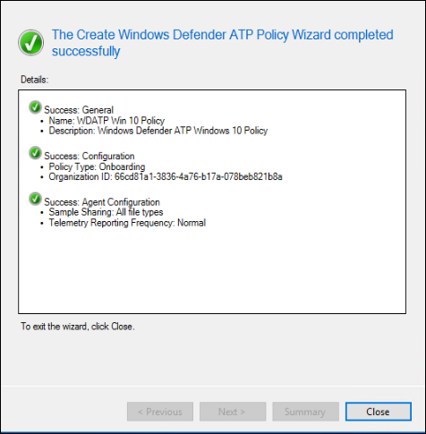

# 使用 Microsoft Endpoint Configuration Manager 上架

[!INCLUDE [Microsoft 365 Defender rebranding](../../includes/microsoft-defender.md)]

**適用於：**
- [適用於端點的 Microsoft Defender](https://go.microsoft.com/fwlink/p/?linkid=2146631)
- [Microsoft 365 Defender](https://go.microsoft.com/fwlink/?linkid=2118804)

> 想要體驗 Microsoft Defender for Endpoint？ [註冊免費試用版。](https://www.microsoft.com/microsoft-365/windows/microsoft-defender-atp?ocid=docs-wdatp-exposedapis-abovefoldlink)

本文是部署指南的一部分，可做為上架方法的範例。 

在 [規劃](deployment-strategy.md) 主題中，有數種方法可提供給板載裝置給服務。 本主題涵蓋共同管理架構。 

 *圖表* 的影像

當 Defender for Endpoint 支援各種端點和工具的上架時，本文並未涵蓋這類功能。 如需使用其他支援部署工具及方法的一般上架資訊，請參閱上 [架一覽](onboarding.md)。

本主題指導使用者：
- 步驟1：將 Windows 裝置上架至服務 
- 步驟2：設定用於端點功能的 Defender

此上架指引會逐步引導您使用 Microsoft 端點設定管理員時，您必須採取下列基本步驟：
- **在 Microsoft 端點 Configuration Manager 中建立集合**
- **使用 Microsoft Endpoint Configuration Manager 設定 Microsoft Defender for Endpoint 功能**

>[!NOTE]
>在此範例部署中只涵蓋 Windows 裝置。 

## 步驟1：使用 Microsoft 端點 Configuration Manager 的板載 Windows 裝置

### 集合建立
若要使用 Microsoft 端點設定管理員對 Windows 10 裝置進行板載部署，部署可以針對現有集合，也可以建立新的集合以供測試。 

使用群組原則或手動方法的工具上架不會在系統上安裝任何代理程式。 

在 Microsoft 端點 Configuration Manager 主控台內，上架過程會設定為主控台中的規範設定的一部分。

只要 Configuration Manager 用戶端繼續從管理點接收此原則，任何接收此必要設定的系統都會維護該設定。 

請遵循下列步驟，使用 Microsoft 端點 Configuration Manager 進行板載端點。

1. 在 Microsoft 端點 Configuration Manager 主控台中，流覽至 **[資產] 和 [合規性 \> 一覽表] \> 裝置集合**。            

    

2. 以滑鼠右鍵按一下 [ **裝置集合** ]，然後選取 [ **建立裝置集合**]。

    

3. 提供 **名稱** 及 **限制集合**，然後選取 **[下一步]**。

    

4. 選取 [ **新增規則** ]，然後選擇 [ **查詢規則**]。

    

5.  在 [**直屬成員資格] 嚮導** 中按 **[下一步**]，然後按一下 [**編輯查詢語句**]

     

6. 選取 [ **準則** ]，然後選擇星形圖示。

     

7. 將條件類型保留為 **簡單值**，請選擇 [目標為： **作業系統組建編號**]，運算子為 **大於或等於** 和值 **14393** ，然後按一下 **[確定]**。

    

8. 選取 **[下一步] 和 [** **關閉**]。

    

9. 選取 **[下一步]**。

    

完成此工作之後，您現在有一個裝置集合，具有環境中所有 Windows 10 端點。 

## 步驟2：設定 Microsoft Defender for Endpoint 功能 
本節會引導您使用 Windows 裝置上的 Microsoft Endpoint Configuration Manager 來設定下列功能：

- [**端點偵測及回應**](#endpoint-detection-and-response)
- [**下一代保護**](#next-generation-protection)
- [**受攻擊面縮小**](#attack-surface-reduction)

### 端點偵測及回應
#### Windows 10
在 Microsoft Defender Security Center 中，您可以下載可用於在 System Center Configuration Manager 中建立原則的「. 上架」原則，並將該原則部署至 Windows 10 裝置。

1. 從 Microsoft Defender Security Center 入口網站，選取 [設定]，然後按 [上 [架](https://securitycenter.windows.com/preferences2/onboarding)]。

2. 在 [部署方法] 底下，選取支援的 **Microsoft 端點 Configuration Manager** 版本。

    

3. 選取 [ **下載套件**]。

    

4. 將套件儲存至可存取的位置。
5. 在 [Microsoft 端點設定管理員] 中，流覽至：「 **資產和合規性 > 概述 > Endpoint Protection > Microsoft DEFENDER ATP 原則**。

6. 以滑鼠右鍵按一下 [ **Microsoft DEFENDER Atp 原則** ]，然後選取 [ **建立 Microsoft defender atp 原則**]。

    

7. 輸入名稱和描述，確認已選取 [上 **架** ]，然後選取 **[下一步]**。

    

8. 按一下 [瀏覽]。

9. 流覽至上述步驟4下載檔案的位置。

10. 按 [下一步 **]**。
11. 以適當的範例設定代理 (**無** 或 **所有檔案類型**) 。

    

12. 選取適當的遙測 (**Normal** 或 **加急**) 然後按 **[下一步]**。

    

14. 確認設定，然後按 **[下一步]**。

     

15. 當嚮導完成時，按一下 [ **關閉** ]。

16.  在 Microsoft 端點 Configuration Manager 主控台中，以滑鼠右鍵按一下您剛才建立的 Defender for Endpoint 原則，然後選取 [ **部署**]。

     

17. 在右窗格中，選取先前建立的集合，然後按一下 **[確定]**。

    

#### 舊版本的 Windows 用戶端 (Windows 7 和 Windows 8.1) 
請遵循下列步驟來識別用於上架舊版 Windows 的 Defender 工作區識別碼和工作區金鑰。

1. 從 Microsoft Defender Security Center 入口網站中，選取 [ **設定] > 上架**。

2. 在 [作業系統] 底下，選擇 [ **Windows 7 SP1 和 8.1**。

3. 複製 **工作區識別碼** 和 **工作區機碼** ，並加以儲存。 這些程式將在稍後的程式中使用。

    

4. 安裝 Microsoft Monitoring Agent (MMA) 。  
    MMA 目前 (到2019年1月為止，在下列 Windows 作業系統上支援) ：

    -   伺服器 SKUs： Windows Server 2008 SP1 或更新版本

    -   用戶端 SKUs： Windows 7 SP1 和更新版本

    MMA 代理程式將需要安裝在 Windows 裝置上。 若要安裝代理程式，有些系統將需要下載 [客戶經驗的更新和診斷遙測](https://support.microsoft.com/help/3080149/update-for-customer-experience-and-diagnostic-telemetry) ，以便使用 MMA 收集資料。 這些系統版本包括（但不限於）：

    -   Windows 8.1

    -   Windows 7

    -   Windows Server 2016

    -   Windows Server 2012 R2

    -   Windows Server 2008 R2

    具體說來，針對 Windows 7 SP1，必須安裝下列修補程式：

    -   安裝 [KB4074598](https://support.microsoft.com/help/4074598/windows-7-update-kb4074598)

    -   安裝 [.net Framework 4.5](https://www.microsoft.com/download/details.aspx?id=30653) (或更新版本) **或** 
         [KB3154518](https://support.microsoft.com/help/3154518/support-for-tls-system-default-versions-included-in-the-net-framework)。
        請勿在同一系統上安裝兩者。

5. 如果您使用 proxy 連線到網際網路，請參閱設定 proxy 設定區段。

完成後，您應該會在一個小時內看到入口網站中的架端點。

### 下一代保護 
Microsoft Defender 防毒軟體是一套內建的反惡意程式碼解決方案，為電腦、可攜式電腦，以及伺服器提供下一代保護。

1. 在 Microsoft 端點 Configuration Manager 主控台中，流覽至 **[資產和合規性 \> 一覽表] \> Endpoint Protection \> 反惡意** 代碼原則，然後選擇 [ **建立反惡意程式碼原則**]。

    

2. 選取 [**排程掃描**]、[**掃描設定**]、[**預設動作**]、[**即時保護**]、[**排除設定**]、[**高級**]、[**威脅覆寫** **]、[** **Cloud protection Service** ] 和 [**安全性智慧更新**

    

    在某些行業或某些選取的企業客戶可能對防病毒設定方式有特殊需求。

  
    [快速掃描與完整掃描及自訂掃描](https://docs.microsoft.com/windows/security/threat-protection/microsoft-defender-antivirus/scheduled-catch-up-scans-microsoft-defender-antivirus#quick-scan-versus-full-scan-and-custom-scan)

    如需詳細資訊，請參閱 [Windows Security configuration framework](https://docs.microsoft.com/windows/security/threat-protection/windows-security-configuration-framework/windows-security-configuration-framework)
  
    

    

    

    

    

    

    

    

3. 在新建立的反惡意軟體原則上按一下滑鼠右鍵，然後選取 [ **部署**]。

    

4. 將新的反惡意軟體原則設定為您的 Windows 10 集合，然後按一下 **[確定]**。

     

完成此工作之後，您現在已成功設定 Windows Defender 防毒軟體。

### 受攻擊面縮小
Pillar 的 Defender for Endpoint 的攻擊面減少包含可在 Exploit Guard 下使用的功能集。 攻擊面減少 (ASR) 規則、受控資料夾存取、網路保護和 Exploit Protection。 

所有這些功能都會提供一個稽核模式和封鎖模式。 在審計模式中，不會影響使用者。 所有的功能都是收集其他遙測，並使其可在 Microsoft Defender Security Center 中使用。 部署的目標在於逐步將安全性控制措施移至區塊模式。

若要在審計模式中設定 ASR 規則：

1. 在 Microsoft 端點 Configuration Manager 主控台中，流覽至 **[資產和合規性 \> 一覽] [ \> Endpoint Protection \> Windows Defender 利用防護** ]，然後選擇 [ **建立 Exploit Guard 原則**]。

   

2.  選取 [ **攻擊面減少**]。
   

3. 設定要 **審核** 的規則，然後按 **[下一步]**。

    

4. 按一下 **[下一步]**，確認新的 Exploit Guard 原則。

    

    
5. 建立原則之後，按一下 [ **關閉**]。

    

    
   

6.  在新建立的原則上按一下滑鼠右鍵，然後選擇 [ **部署**]。
    
    

7. 將原則設定為新建立的 Windows 10 集合，然後按一下 **[確定]**。

    

完成此工作之後，您現在已在稽核模式中成功設定 ASR 規則。  
  
以下是驗證 ASR 規則是否正確套用至端點的其他步驟。  (可能需要幾分鐘的時間) 

1. 在網頁瀏覽器中，流覽至 <https://securitycenter.windows.com> 。

2.  從左側功能表中選取 [設定 **管理** ]。

3. 在 [攻擊面管理] 面板中，按一下 [ **移至攻擊介面管理** ]。 
    
    

4. 按一下 **攻擊** 面減少規則報告中的 [設定] 索引標籤。 它會在每個裝置上顯示 ASR 規則的設定概述和 ASR 規則狀態。

    

5. 按一下每個裝置會顯示 ASR 規則的設定詳細資料。

    

如需詳細資訊，請參閱 [優化 ASR 規則部署和](https://docs.microsoft.com/microsoft-365/security/defender-endpoint/configure-machines-asr)   偵測。  

#### 在稽核模式中設定網路保護規則：
1. 在 Microsoft 端點 Configuration Manager 主控台中，流覽至 **[資產和合規性 \> 一覽] [ \> Endpoint Protection \> Windows Defender 利用防護** ]，然後選擇 [ **建立 Exploit Guard 原則**]。

    

2. 選取 [ **網路保護**]。

3. 將設定設定為「 **審核** 」，然後按 **[下一步]**。 

    

4. 按 **[下一步]**，確認新的 Exploit Guard 原則。
    
    

5. 建立原則之後，按一下 [ **關閉**]。

    

6. 在新建立的原則上按一下滑鼠右鍵，然後選擇 [ **部署**]。

    

7. 選取新建立的 Windows 10 集合的原則，然後選擇 **[確定]**。

    

完成這項工作之後，您現在已經成功設定了稽核模式中的網路保護。

#### 若要設定稽核模式中的受控資料夾存取規則：

1. 在 Microsoft 端點 Configuration Manager 主控台中，流覽至 **[資產和合規性 \> 一覽] [ \> Endpoint Protection \> Windows Defender 利用防護** ]，然後選擇 [ **建立 Exploit Guard 原則**]。

    

2. 選取 [ **受管理的資料夾存取**]。
    
3. 將設定設定為 [ **審計** ]，然後按 **[下一步]**。

        
    
4. 按一下 **[下一步]**，確認新的 Exploit Guard 原則。

    

5. 建立原則之後，按一下 [ **關閉**]。

    

6. 在新建立的原則上按一下滑鼠右鍵，然後選擇 [ **部署**]。

    

7.  將原則設定為新建立的 Windows 10 集合，然後按一下 **[確定]**。

    

您現在已成功設定稽核模式中的「控制資料夾存取」。

## 相關主題
- [使用 Microsoft 端點管理員上架](onboarding-endpoint-manager.md)
