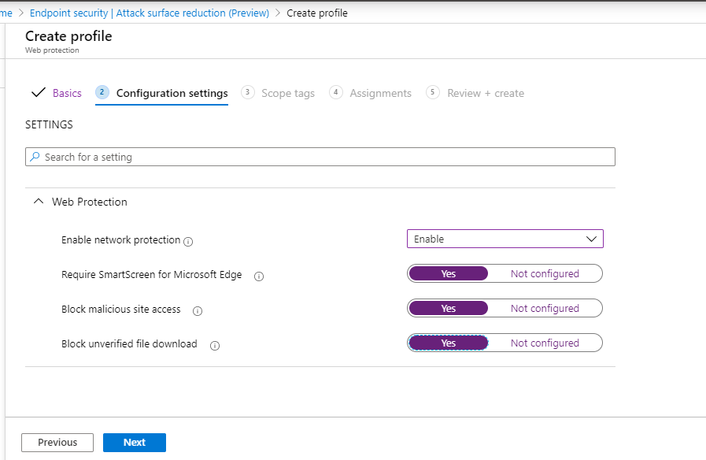
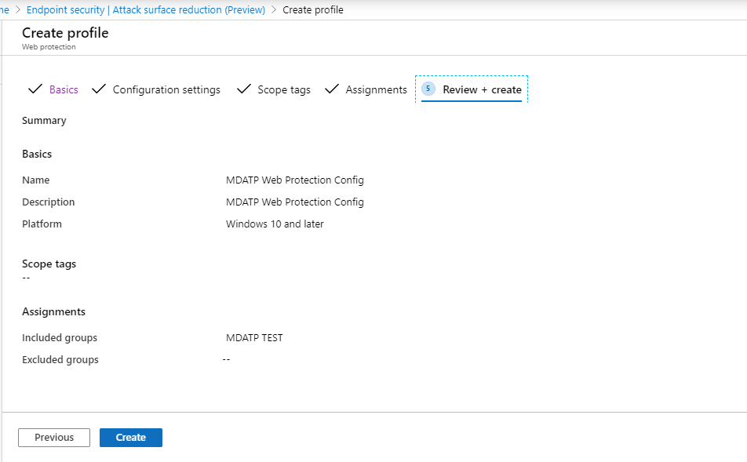
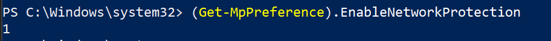

# 使用 Microsoft 端點管理員上架Onboarding using Microsoft Endpoint Manager

[!INCLUDE [Microsoft 365 Defender rebranding](../../includes/microsoft-defender.md)]

**適用於：****Applies to:**
- [適用於端點的 Microsoft DefenderMicrosoft Defender for Endpoint](https://go.microsoft.com/fwlink/p/?linkid=2146631)
- [Microsoft 365 DefenderMicrosoft 365 Defender](https://go.microsoft.com/fwlink/?linkid=2118804)

> 想要體驗 Microsoft Defender for Endpoint？Want to experience Microsoft Defender for Endpoint? [註冊免費試用版。Sign up for a free trial.](https://www.microsoft.com/microsoft-365/windows/microsoft-defender-atp?ocid=docs-wdatp-exposedapis-abovefoldlink)

本文是部署指南的一部分，可做為上架方法的範例。This article is part of the Deployment guide and acts as an example onboarding method. 

在 [規劃](deployment-strategy.md) 主題中，有數種方法可提供給板載裝置給服務。In the [Planning](deployment-strategy.md) topic, there were several methods provided to onboard devices to the service. 本主題涵蓋雲端原生架構。This topic covers the cloud-native architecture. 

 *圖表* 的影像
*Diagram of environment architectures*

當 Defender for Endpoint 支援各種端點和工具的上架時，本文並未涵蓋這類功能。While Defender for Endpoint supports onboarding of various endpoints and tools, this article does not cover them. 如需使用其他支援部署工具及方法的一般上架資訊，請參閱上 [架一覽](onboarding.md)。For information on general onboarding using other supported deployment tools and methods, see [Onboarding overview](onboarding.md).

[Microsoft 端點管理員](https://docs.microsoft.com/mem/endpoint-manager-overview) 是一種可統一數項服務的解決方案平臺。[Microsoft Endpoint Manager](https://docs.microsoft.com/mem/endpoint-manager-overview) is a solution platform that unifies several services. 包含用於雲端式裝置管理的 [Microsoft Intune](https://docs.microsoft.com/mem/intune/fundamentals/what-is-intune) 。It includes [Microsoft Intune](https://docs.microsoft.com/mem/intune/fundamentals/what-is-intune) for cloud-based device management.

本主題指導使用者：This topic guides users in:
- 步驟1：將裝置加入服務，方法是在 Microsoft 端點管理員中建立群組 (MEM) 指派設定Step 1: Onboarding devices to the service by creating a group in Microsoft Endpoint Manager (MEM) to assign configurations on
- 步驟2：使用 Microsoft 端點管理員設定用於端點功能的 DefenderStep 2: Configuring Defender for Endpoint capabilities using Microsoft Endpoint Manager

此上架指引會逐步引導您使用 Microsoft 端點管理員時，您必須採取下列基本步驟：This onboarding guidance will walk you through the following basic steps that you need to take when using Microsoft Endpoint Manager:

-   [識別目標裝置或使用者Identifying target devices or users](#identify-target-devices-or-users)

    -   建立 Azure Active Directory 群組 (使用者或裝置) Creating an Azure Active Directory group (User or Device)

-   [建立設定檔Creating a Configuration Profile](#step-2-create-configuration-policies-to-configure-microsoft-defender-for-endpoint-capabilities)

    -   在 Microsoft 端點管理員中，我們將引導您為每個功能建立個別的原則。In Microsoft Endpoint Manager, we'll guide you in creating a separate policy for each capability.

## 資源Resources

以下是您將在其餘程式中所需的連結：Here are the links you'll need for the rest of the process:

-   [MEM 入口網站MEM portal](https://aka.ms/memac)

-   [安全中心Security Center](https://securitycenter.windows.com/)

-   [Intune 安全性基準Intune Security baselines](https://docs.microsoft.com/mem/intune/protect/security-baseline-settings-defender-atp#microsoft-defender)

如需 Microsoft 端點管理員的詳細資訊，請參閱下列資源：For more information about Microsoft Endpoint Manager, check out these resources:
- [Microsoft 端點管理員頁面Microsoft Endpoint Manager page](https://docs.microsoft.com/mem/)
- [Intune 和 ConfigMgr 的結合的博客文章Blog post on convergence of Intune and ConfigMgr](https://www.microsoft.com/microsoft-365/blog/2019/11/04/use-the-power-of-cloud-intelligence-to-simplify-and-accelerate-it-and-the-move-to-a-modern-workplace/)
- [有關 MEM 的簡介影片Introduction video on MEM](https://www.microsoft.com/microsoft-365/blog/2019/11/04/use-the-power-of-cloud-intelligence-to-simplify-and-accelerate-it-and-the-move-to-a-modern-workplace)

## 步驟1：板載裝置，方法是在要指派設定的 MEM 中建立群組Step 1: Onboard devices by creating a group in MEM to assign configurations on
### 識別目標裝置或使用者Identify target devices or users
在本節中，我們將建立測試群組，以將您的設定指派給您。In this section, we will create a test group to assign your configurations on.

>[!NOTE]
>Intune 使用 Azure Active Directory (Azure AD) 群組來管理裝置和使用者。Intune uses Azure Active Directory (Azure AD) groups to manage devices and users. 作為 Intune 系統管理員，您可以設定群組以符合您的組織需求。As an Intune admin, you can set up groups to suit your organizational needs. 
如需詳細資訊，請參閱 [新增群組以組織使用者和裝置](https://docs.microsoft.com/mem/intune/fundamentals/groups-add)。For more information, see [Add groups to organize users and devices](https://docs.microsoft.com/mem/intune/fundamentals/groups-add).

### 建立群組Create a group

1.  開啟 MEM 入口網站。Open the MEM portal.

2.  **> 新群組** 中開啟群組。Open **Groups > New Group**.

    > [!div class="mx-imgBorder"]
    > 

3.  輸入詳細資料，並建立新的群組。Enter details and create a new group.

    > [!div class="mx-imgBorder"]
    > 

4.  新增您的測試使用者或裝置。Add your test user or device.

5.  從 [ **群組 > 所有群組** ] 窗格中，開啟新的群組。From the **Groups > All groups** pane, open your new group.

6.  Select  **members > Add members**。Select  **Members > Add members**.

7.  尋找您的測試使用者或裝置，並加以選取。Find your test user or device and select it.

    > [!div class="mx-imgBorder"]
    > 

8.  您的測試群組現在有一個要測試的成員。Your testing group now has a member to test.

## 步驟2：建立設定原則以設定 Microsoft Defender for Endpoint 功能Step 2: Create configuration policies to configure Microsoft Defender for Endpoint capabilities
在下一節中，您將建立許多設定原則。In the following section, you'll create a number of configuration policies.

首先是設定原則，以選取哪些使用者或裝置群組將會架至 Defender for Endpoint：First is a configuration policy to select which groups of users or devices will be onboarded to Defender for Endpoint:

- [端點偵測及回應Endpoint detection and response](#endpoint-detection-and-response) 

接著，您會建立數種不同類型的端點安全性原則，以繼續執行：Then you will continue by creating several different types of endpoint security policies:

- [下一代保護Next-generation protection](#next-generation-protection)
- [受攻擊面縮小Attack surface reduction](#attack-surface-reduction--attack-surface-reduction-rules)

### 端點偵測及回應Endpoint detection and response

1.  開啟 MEM 入口網站。Open the MEM portal.

2.  流覽至 **端點安全性 > 端點偵測和回應**。Navigate to **Endpoint security > Endpoint detection and response**. 按一下 [ **建立設定檔**]。Click on **Create Profile**.

    > [!div class="mx-imgBorder"]
    > 

3.  在 [平臺] 底下 **，選取 [Windows 10 和更新版本]，並 > 建立設定檔端點偵測和回應**。Under **Platform, select Windows 10 and Later, Profile - Endpoint detection and response > Create**.

4.  輸入名稱和描述，然後選取  **[下一步]**。Enter a name and description, then select  **Next**.

    > [!div class="mx-imgBorder"]
    > 

5.  選取 [必要時設定]，然後選取  **[下一步]**。Select settings as required, then select  **Next**.

    > [!div class="mx-imgBorder"]
    > 

    > [!NOTE]
    > 在此範例中，這已自動填入，因為已將 Defender 的 Endpoint 已整合至已與 Intune 整合。In this instance, this has been auto populated as Defender for Endpoint has already been integrated with Intune. 如需整合的詳細資訊，請參閱 [在 Intune 中啟用 Microsoft Defender For Endpoint](https://docs.microsoft.com/mem/intune/protect/advanced-threat-protection-configure#to-enable-microsoft-defender-atp)。For more information on the integration, see [Enable Microsoft Defender for Endpoint in Intune](https://docs.microsoft.com/mem/intune/protect/advanced-threat-protection-configure#to-enable-microsoft-defender-atp).
    > 
    > 下列圖像是 Microsoft Defender for Endpoint 未與 Intune 整合時所看到之內容的範例：The following image is an example of what you'll see when Microsoft Defender for Endpoint is NOT integrated with Intune:
    >
    > 

6.  必要時新增範圍標籤，然後選取  **[下一步]**。Add scope tags if necessary, then select  **Next**.

    > [!div class="mx-imgBorder"]
    > 

7.  按一下 [ **選取要包含的群組** ] 並選擇您的群組，然後選取  **[下一步]**，以新增測試群組。Add test group by clicking on **Select groups to include** and choose your group, then select  **Next**.

    > [!div class="mx-imgBorder"]
    > 

8.  複查並接受，然後選取 [  **建立**]。Review and accept, then select  **Create**.

    > [!div class="mx-imgBorder"]
    > 

9.  您可以查看已完成的原則。You can view your completed policy.

    > [!div class="mx-imgBorder"]
    > 

### 下一代保護Next-generation protection

1.  開啟 MEM 入口網站。Open the MEM portal.

2.  流覽至 **端點安全性 > 防病毒 > 建立原則**。Navigate to **Endpoint security > Antivirus > Create Policy**.

    > [!div class="mx-imgBorder"]
    > 

3.  選取 **平臺-windows 10 和更新版本-windows 和設定檔– Microsoft Defender 防病毒 > 建立**。Select **Platform - Windows 10 and Later - Windows and Profile – Microsoft Defender Antivirus > Create**.

4.  輸入名稱和描述，然後選取  **[下一步]**。Enter name and description, then select  **Next**.

    > [!div class="mx-imgBorder"]
    > 

5.  在 [ **設定設定] 頁面** 中，設定您所需的 Microsoft Defender 防毒軟體 (Cloud Protection、排除、Real-Time 保護和修正) 。In the **Configuration settings page**: Set the configurations you require for Microsoft Defender Antivirus (Cloud Protection, Exclusions, Real-Time Protection, and Remediation).

    > [!div class="mx-imgBorder"]
    > 

6.  必要時新增範圍標籤，然後選取  **[下一步]**。Add scope tags if necessary, then select  **Next**.

    > [!div class="mx-imgBorder"]
    > 

7.  選取要包含的群組、指派至您的測試群組，然後選取  **[下一步]**。Select groups to include, assign to your test group, then select  **Next**.

    > [!div class="mx-imgBorder"]
    > 

8.  檢查並建立，然後選取 [  **建立**]。Review and create, then select  **Create**.

    > [!div class="mx-imgBorder"]
    > 

9.  您將會看到您建立的設定原則。You'll see the configuration policy you created.

    > [!div class="mx-imgBorder"]
    > 

### 攻擊面減少–攻擊面減少的原則Attack Surface Reduction – Attack surface reduction rules

1.  開啟 MEM 入口網站。Open the MEM portal.

2.  流覽至 **端點安全性 > 攻擊面降減**。Navigate to **Endpoint security > Attack surface reduction**.

3.  選取 [  **建立原則**]。Select  **Create Policy**.

4.  選取 **平臺-Windows 10 和更新版本–設定檔-已 > 建立的攻擊面降減規則**。Select **Platform - Windows 10 and Later – Profile - Attack surface reduction rules > Create**.

    > [!div class="mx-imgBorder"]
    > 

5.  輸入名稱和描述，然後選取  **[下一步]**。Enter a name and description, then select  **Next**.

    > [!div class="mx-imgBorder"]
    > 

6.  在 [ **設定設定] 頁面** 上：設定攻擊面降低規則所需的設定，然後選取  **[下一步]**。In the **Configuration settings page**: Set the configurations you require for Attack surface reduction rules, then select  **Next**.

    > [!NOTE]
    > 我們將設定所有攻擊面降減規則，以進行審核。We will be configuring all of the Attack surface reduction rules to Audit.
    > 
    > 如需詳細資訊，請參閱 [攻擊面降減規則](attack-surface-reduction.md)。For more information, see [Attack surface reduction rules](attack-surface-reduction.md).

    > [!div class="mx-imgBorder"]
    > 

7.  視需要新增範圍標記，然後選取  **[下一步]**。Add Scope Tags as required, then select  **Next**.

    > [!div class="mx-imgBorder"]
    > 

8.  選取 [要包含的群組並指派給 test group]，然後選取  **[下一步]**。Select groups to include and assign to test group, then select  **Next**.

    > [!div class="mx-imgBorder"]
    > 

9. 查看詳細資料，然後選取 [  **建立**]。Review the details, then select  **Create**.

    > [!div class="mx-imgBorder"]
    > 

10. 查看原則。View the policy.

    > [!div class="mx-imgBorder"]
    > 

### 攻擊面減少– Web 保護Attack Surface Reduction – Web Protection

1.  開啟 MEM 入口網站。Open the MEM portal.

2.  流覽至 **端點安全性 > 攻擊面降減**。Navigate to **Endpoint security > Attack surface reduction**.

3.  選取 [  **建立原則**]。Select  **Create Policy**.

4.  選取 [ **Windows 10 和更新版本– Web 保護 > 建立**]。Select **Windows 10 and Later – Web protection > Create**.

    > [!div class="mx-imgBorder"]
    > 

5.  輸入名稱和描述，然後選取  **[下一步]**。Enter a name and description, then select  **Next**.

    > [!div class="mx-imgBorder"]
    > 

6.  在 [設定 **設定] 頁面** 上：設定 Web 保護所需的設定，然後選取  **[下一步]**。In the **Configuration settings page**: Set the configurations you require for Web Protection, then select  **Next**.

    > [!NOTE]
    > 我們正在設定網頁防護以封鎖。We are configuring Web Protection to Block.
    > 
    > 如需詳細資訊，請參閱 [Web 保護](web-protection-overview.md)。For more information, see [Web Protection](web-protection-overview.md).

    > [!div class="mx-imgBorder"]
    > 

7.  **> 下一步將範圍標記** 新增至必要。Add **Scope Tags as required > Next**.

    > [!div class="mx-imgBorder"]
    > 

8.  選取 **[指派至測試組 > 下一步]**。Select **Assign to test group > Next**.

    > [!div class="mx-imgBorder"]
    > 

9.  選取 [ **複查]，建立 > 建立**]。Select **Review and Create > Create**.

    > [!div class="mx-imgBorder"]
    > 

10. 查看原則。View the policy.

    > [!div class="mx-imgBorder"]
    > 

## 驗證設定Validate configuration settings

### 確認已套用的原則Confirm Policies have been applied

指派好設定原則之後，將需要一些時間才能套用。Once the Configuration policy has been assigned, it will take some time to apply.

如需有關計時的資訊，請參閱 [Intune 設定資訊](https://docs.microsoft.com/mem/intune/configuration/device-profile-troubleshoot#how-long-does-it-take-for-devices-to-get-a-policy-profile-or-app-after-they-are-assigned)。For information on timing, see [Intune configuration information](https://docs.microsoft.com/mem/intune/configuration/device-profile-troubleshoot#how-long-does-it-take-for-devices-to-get-a-policy-profile-or-app-after-they-are-assigned).

若要確認已將設定原則套用至測試裝置，請針對每個設定原則遵循下列程式。To confirm that the configuration policy has been applied to your test device, follow the following process for each configuration policy.

1.  開啟 MEM 入口網站，並流覽至相關步驟中所示的相關原則。Open the MEM portal and navigate to the relevant policy as shown in the steps above. 下列範例會顯示下一代保護設定。The following example shows the next generation protection settings.

    > [!div class="mx-imgBorder"]
    > [ 的影像](images/43ab6aa74471ee2977e154a4a5ef2d39.png#lightbox)

2.  選取設定 **原則** ，以查看原則狀態。Select  the **Configuration Policy** to view the policy status.

    > [!div class="mx-imgBorder"]
    > [ 的影像](images/55ecaca0e4a022f0e29d45aeed724e6c.png#lightbox)

3.  選取 [  **裝置狀態** ] 以查看狀態。Select  **Device Status** to see the status.

    > [!div class="mx-imgBorder"]
    > [ 的影像](images/18a50df62cc38749000dbfb48e9a4c9b.png#lightbox)

4.  選取 [  **使用者狀態** ] 以查看狀態。Select  **User Status** to see the status.

    > [!div class="mx-imgBorder"]
    > [ 的影像](images/4e965749ff71178af8873bc91f9fe525.png#lightbox)

5.  選取 [  **每一設定狀態** ] 以查看狀態。Select  **Per-setting status** to see the status.

    >[!TIP]
    >此視圖非常適合識別與其他原則衝突的任何設定。This view is very useful to identify any settings that conflict with another policy.

    > [!div class="mx-imgBorder"]
    > [ 的影像](images/42acc69d0128ed09804010bdbdf0a43c.png#lightbox)

### 端點偵測及回應Endpoint detection and response

1.  在套用設定之前，不應該啟動 Defender for Endpoint Protection 服務。Before applying the configuration, the Defender for Endpoint Protection service should not be started.

    > [!div class="mx-imgBorder"]
    > 

2.  套用設定後，應啟動 Defender for Endpoint Protection 服務。After the configuration has been applied, the Defender for Endpoint Protection Service should be started.

    > [!div class="mx-imgBorder"]
    > 

3.  在裝置上執行服務後，裝置會顯示在 Microsoft Defender Security Center 中。After the services are running on the device, the device appears in Microsoft Defender Security Center.

    > [!div class="mx-imgBorder"]
    > [ 的影像](images/df0c64001b9219cfbd10f8f81a273190.png#lightbox)

### 下一代保護Next-generation protection

1.  在測試裝置上套用原則之前，您應該可以手動管理設定，如下所示。Before applying the policy on a test device, you should be able to manually manage the settings as shown below.

    > [!div class="mx-imgBorder"]
    > 

2.  套用原則之後，您應該無法手動管理設定。After the policy has been applied, you should not be able to manually manage the settings.

    > [!NOTE]
    > 在下列影像中， **開啟雲端傳送保護** ，並 **開啟即時保護** 顯示為受管理。In the following image **Turn on cloud-delivered protection** and **Turn on real-time protection** are being shown as managed.

    > [!div class="mx-imgBorder"]
    > 

### 攻擊面減少–攻擊面減少的原則Attack Surface Reduction – Attack surface reduction rules

1.  在測試裝置上套用此原則之前，請先將該原則套用至 PowerShell 視窗，然後輸入 `Get-MpPreference` 。Before applying the policy on a test device, pen a PowerShell Window and type `Get-MpPreference`.

2.  這應該會以下列沒有內容的行回應：This should respond with the following lines with no content:

    > AttackSurfaceReductionOnlyExclusions:AttackSurfaceReductionOnlyExclusions:
    > 
    > AttackSurfaceReductionRules_Actions：AttackSurfaceReductionRules_Actions:
    > 
    > AttackSurfaceReductionRules_Ids：AttackSurfaceReductionRules_Ids:

    

3.  在測試裝置上套用原則之後，請開啟 PowerShell 視窗，然後輸入 `Get-MpPreference` 。After applying the policy on a test device, open a PowerShell Windows and type `Get-MpPreference`.

4.  這應該會以下列包含內容的行來回應，如下所示：This should respond with the following lines with content as shown below:

    

### 攻擊面減少– Web 保護Attack Surface Reduction – Web Protection

1.  在測試裝置上，開啟 PowerShell 視窗，然後輸入 `(Get-MpPreference).EnableNetworkProtection` 。On the test device, open a PowerShell Windows and type `(Get-MpPreference).EnableNetworkProtection`.

2.  這應該會以0做回應，如下所示。This should respond with a 0 as shown below.

    

3.  套用原則之後，請開啟 PowerShell 的視窗，然後輸入 `(Get-MpPreference).EnableNetworkProtection` 。After applying the policy, open a PowerShell Windows and type `(Get-MpPreference).EnableNetworkProtection`.

4.  這應該會以如下所示的1回應。This should respond with a 1 as shown below.

    
