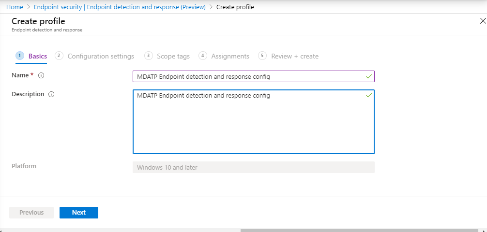
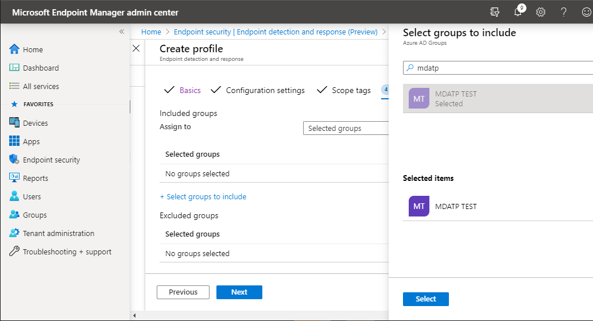

# 使用 Microsoft 端點管理員上線

[!INCLUDE [Microsoft 365 Defender rebranding](../../includes/microsoft-defender.md)]

**適用於：**
- [適用於端點的 Microsoft Defender](https://go.microsoft.com/fwlink/p/?linkid=2154037)
- [Microsoft 365 Defender](https://go.microsoft.com/fwlink/?linkid=2118804)

> 想要體驗適用於端點的 Microsoft Defender 嗎？ [注册免費試用版。](https://www.microsoft.com/microsoft-365/windows/microsoft-defender-atp?ocid=docs-wdatp-exposedapis-abovefoldlink)

本文是部署指南的一部分，可做為上架方法的範例。 

在 [規劃](deployment-strategy.md) 主題中，有數種方法可提供給板載裝置給服務。 本主題涵蓋雲端原生架構。 

 *圖表* 的影像

當 Defender for Endpoint 支援各種端點和工具的上架時，本文並未涵蓋這類功能。 如需使用其他支援部署工具及方法的一般上架資訊，請參閱上 [架一覽](onboarding.md)。

[Microsoft 端點管理員](/mem/endpoint-manager-overview)是一種可統一數種服務的方案平臺。 它包含雲端式裝置管理的[Microsoft Intune](/mem/intune/fundamentals/what-is-intune) 。

本主題指導使用者：
- 步驟1：將裝置加入服務，方法是在 Microsoft 端點管理員中建立群組 (MEM) 指派設定
- 步驟2：使用 Microsoft 端點管理員設定用 Defender 做為端點功能

此上架指引會逐步引導您使用 Microsoft 端點管理員時，您必須採取下列基本步驟：

-   [識別目標裝置或使用者](#identify-target-devices-or-users)

    -    (使用者或裝置建立 Azure Active Directory 組) 

-   [建立設定檔](#step-2-create-configuration-policies-to-configure-microsoft-defender-for-endpoint-capabilities)

    -   在 Microsoft 端點管理員中，我們將引導您為每個功能建立個別的原則。

## 資源

以下是您將在其餘程式中所需的連結：

-   [MEM 入口網站](https://aka.ms/memac)

-   [安全中心](https://securitycenter.windows.com/)

-   [Intune 安全性基準](/mem/intune/protect/security-baseline-settings-defender-atp#microsoft-defender)

如需 Microsoft 端點管理員的詳細資訊，請參閱下列資源：
- [Microsoft 端點管理員頁面](/mem/)
- [Intune 和 ConfigMgr 的結合的博客文章](https://www.microsoft.com/microsoft-365/blog/2019/11/04/use-the-power-of-cloud-intelligence-to-simplify-and-accelerate-it-and-the-move-to-a-modern-workplace/)
- [有關 MEM 的簡介影片](https://www.microsoft.com/microsoft-365/blog/2019/11/04/use-the-power-of-cloud-intelligence-to-simplify-and-accelerate-it-and-the-move-to-a-modern-workplace)

## 步驟1：板載裝置，方法是在要指派設定的 MEM 中建立群組
### 識別目標裝置或使用者
在本節中，我們將建立測試群組，以將您的設定指派給您。

>[!NOTE]
>Intune 使用 Azure Active Directory (Azure AD) 群組來管理裝置和使用者。 作為 Intune 系統管理員，您可以設定群組以符合您的組織需求。 
如需詳細資訊，請參閱 [新增群組以組織使用者和裝置](/mem/intune/fundamentals/groups-add)。

### 建立群組

1.  開啟 MEM 入口網站。

2.  **> 新群組** 中開啟群組。

    > [!div class="mx-imgBorder"]
    > 

3.  輸入詳細資料，並建立新的群組。

    > [!div class="mx-imgBorder"]
    > 

4.  新增您的測試使用者或裝置。

5.  從 [ **群組 > 所有群組** ] 窗格中，開啟新的群組。

6.  Select  **members > Add members**。

7.  尋找您的測試使用者或裝置，並加以選取。

    > [!div class="mx-imgBorder"]
    > 

8.  您的測試群組現在有一個要測試的成員。

## 步驟2：建立設定原則以設定 Microsoft Defender for Endpoint 功能
在下一節中，您將建立許多設定原則。

首先是設定原則，以選取哪些使用者或裝置群組將會架至 Defender for Endpoint：

- [端點偵測及回應](#endpoint-detection-and-response) 

接著，您會建立數種不同類型的端點安全性原則，以繼續執行：

- [新一代保護](#next-generation-protection)
- [攻擊面縮減](#attack-surface-reduction--attack-surface-reduction-rules)

### 端點偵測及回應

1.  開啟 MEM 入口網站。

2.  流覽至 **端點安全性 > 端點偵測和回應**。 按一下 [ **建立設定檔**]。

    > [!div class="mx-imgBorder"]
    > 

3.  在 [平臺] 底下，**選取 [Windows 10 和更新版本]。 > 建立設定檔端點偵測和回應**。

4.  輸入名稱和描述，然後選取  **[下一步]**。

    > [!div class="mx-imgBorder"]
    > 

5.  選取 [必要時設定]，然後選取  **[下一步]**。

    > [!div class="mx-imgBorder"]
    > 

    > [!NOTE]
    > 在此範例中，這已自動填入，因為已將 Defender 的 Endpoint 已整合至已與 Intune 整合。 如需整合的詳細資訊，請參閱 [在 Intune 中啟用 Microsoft Defender For Endpoint](/mem/intune/protect/advanced-threat-protection-configure#to-enable-microsoft-defender-atp)。
    > 
    > 下列圖像是 Microsoft Defender for Endpoint 未與 Intune 整合時所看到之內容的範例：
    >
    > 

6.  必要時新增範圍標籤，然後選取  **[下一步]**。

    > [!div class="mx-imgBorder"]
    > 

7.  按一下 [ **選取要包含的群組** ] 並選擇您的群組，然後選取  **[下一步]**，以新增測試群組。

    > [!div class="mx-imgBorder"]
    > 

8.  複查並接受，然後選取 [  **建立**]。

    > [!div class="mx-imgBorder"]
    > 

9.  您可以查看已完成的原則。

    > [!div class="mx-imgBorder"]
    > 

### 新一代保護

1.  開啟 MEM 入口網站。

2.  流覽至 **端點安全性 > 防病毒 > 建立原則**。

    > [!div class="mx-imgBorder"]
    > 

3.  選取 [**平臺-Windows 10 和更新版本-Windows 和設定檔– Microsoft Defender 防毒軟體 > 建立**]。

4.  輸入名稱和描述，然後選取  **[下一步]**。

    > [!div class="mx-imgBorder"]
    > 

5.  在 [設定 **設定] 頁面** 中，設定 Microsoft Defender 防毒軟體所需的設定 (Cloud Protection，排除，Real-Time 保護和修正) 。

    > [!div class="mx-imgBorder"]
    > 

6.  必要時新增範圍標籤，然後選取  **[下一步]**。

    > [!div class="mx-imgBorder"]
    > 

7.  選取要包含的群組、指派至您的測試群組，然後選取  **[下一步]**。

    > [!div class="mx-imgBorder"]
    > 

8.  檢查並建立，然後選取 [  **建立**]。

    > [!div class="mx-imgBorder"]
    > 

9.  您將會看到您建立的設定原則。

    > [!div class="mx-imgBorder"]
    > 

### 攻擊面減少–攻擊面減少的原則

1.  開啟 MEM 入口網站。

2.  流覽至 **端點安全性 > 攻擊面降減**。

3.  選取 [  **建立原則**]。

4.  選取 [**平臺-Windows 10 和更新版本–設定檔-> 建立的攻擊面降減規則**。

    > [!div class="mx-imgBorder"]
    > 

5.  輸入名稱和描述，然後選取  **[下一步]**。

    > [!div class="mx-imgBorder"]
    > 

6.  在 [ **設定設定] 頁面** 上：設定攻擊面降低規則所需的設定，然後選取  **[下一步]**。

    > [!NOTE]
    > 我們將設定所有攻擊面降減規則，以進行審核。
    > 
    > 如需詳細資訊，請參閱 [攻擊面降減規則](attack-surface-reduction.md)。

    > [!div class="mx-imgBorder"]
    > 

7.  視需要新增範圍標記，然後選取  **[下一步]**。

    > [!div class="mx-imgBorder"]
    > 

8.  選取 [要包含的群組並指派給 test group]，然後選取  **[下一步]**。

    > [!div class="mx-imgBorder"]
    > 

9. 查看詳細資料，然後選取 [  **建立**]。

    > [!div class="mx-imgBorder"]
    > 

10. 查看原則。

    > [!div class="mx-imgBorder"]
    > 

### 攻擊面減少– Web 保護

1.  開啟 MEM 入口網站。

2.  流覽至 **端點安全性 > 攻擊面降減**。

3.  選取 [  **建立原則**]。

4.  選取 [ **Windows 10 和更新版本– > 建立 Web 保護**]。

    > [!div class="mx-imgBorder"]
    > 

5.  輸入名稱和描述，然後選取  **[下一步]**。

    > [!div class="mx-imgBorder"]
    > 

6.  在 [設定 **設定] 頁面** 上：設定 Web 保護所需的設定，然後選取  **[下一步]**。

    > [!NOTE]
    > 我們正在設定網頁防護以封鎖。
    > 
    > 如需詳細資訊，請參閱 [Web 保護](web-protection-overview.md)。

    > [!div class="mx-imgBorder"]
    > 

7.  **> 下一步將範圍標記** 新增至必要。

    > [!div class="mx-imgBorder"]
    > 

8.  選取 **[指派至測試組 > 下一步]**。

    > [!div class="mx-imgBorder"]
    > 

9.  選取 [ **複查]，建立 > 建立**]。

    > [!div class="mx-imgBorder"]
    > 

10. 查看原則。

    > [!div class="mx-imgBorder"]
    > 

## 驗證設定

### 確認已套用的原則

指派好設定原則之後，將需要一些時間才能套用。

如需有關計時的資訊，請參閱 [Intune 設定資訊](/mem/intune/configuration/device-profile-troubleshoot#how-long-does-it-take-for-devices-to-get-a-policy-profile-or-app-after-they-are-assigned)。

若要確認已將設定原則套用至測試裝置，請針對每個設定原則遵循下列程式。

1.  開啟 MEM 入口網站，並流覽至相關步驟中所示的相關原則。 下列範例會顯示下一代保護設定。

    > [!div class="mx-imgBorder"]
    > [ 的影像](images/43ab6aa74471ee2977e154a4a5ef2d39.png#lightbox)

2.  選取設定 **原則** ，以查看原則狀態。

    > [!div class="mx-imgBorder"]
    > [ 的影像](images/55ecaca0e4a022f0e29d45aeed724e6c.png#lightbox)

3.  選取 [  **裝置狀態** ] 以查看狀態。

    > [!div class="mx-imgBorder"]
    > [ 的影像](images/18a50df62cc38749000dbfb48e9a4c9b.png#lightbox)

4.  選取 [  **使用者狀態** ] 以查看狀態。

    > [!div class="mx-imgBorder"]
    > [ 的影像](images/4e965749ff71178af8873bc91f9fe525.png#lightbox)

5.  選取 [  **每一設定狀態** ] 以查看狀態。

    >[!TIP]
    >此視圖非常適合識別與其他原則衝突的任何設定。

    > [!div class="mx-imgBorder"]
    > [ 的影像](images/42acc69d0128ed09804010bdbdf0a43c.png#lightbox)

### 端點偵測及回應

1.  套用此設定之前，不應該啟動 Endpoint Protection 的 Defender for service。

    > [!div class="mx-imgBorder"]
    > 

2.  套用設定後，應啟動 Endpoint Protection 服務的 Defender。

    > [!div class="mx-imgBorder"]
    > 

3.  在裝置上執行服務後，裝置會出現在 Microsoft Defender 資訊安全中心中。

    > [!div class="mx-imgBorder"]
    > [ 的影像](images/df0c64001b9219cfbd10f8f81a273190.png#lightbox)

### 新一代保護

1.  在測試裝置上套用原則之前，您應該可以手動管理設定，如下所示。

    > [!div class="mx-imgBorder"]
    > 

2.  套用原則之後，您應該無法手動管理設定。

    > [!NOTE]
    > 在下列影像中， **開啟雲端傳送保護** ，並 **開啟即時保護** 顯示為受管理。

    > [!div class="mx-imgBorder"]
    > 

### 攻擊面減少–攻擊面減少的原則

1.  在測試裝置上套用此原則之前，請先將該原則套用至 PowerShell 視窗，然後輸入 `Get-MpPreference` 。

2.  這應該會以下列沒有內容的行回應：

    > AttackSurfaceReductionOnlyExclusions:
    > 
    > AttackSurfaceReductionRules_Actions：
    > 
    > AttackSurfaceReductionRules_Ids：

    

3.  在測試裝置上套用原則之後，請開啟 PowerShell Windows 並輸入 `Get-MpPreference` 。

4.  這應該會以下列包含內容的行來回應，如下所示：

    

### 攻擊面減少– Web 保護

1.  在測試裝置上，開啟 PowerShell Windows 並輸入 `(Get-MpPreference).EnableNetworkProtection` 。

2.  這應該會以0做回應，如下所示。

    

3.  套用原則之後，請開啟 PowerShell Windows 並輸入 `(Get-MpPreference).EnableNetworkProtection` 。

4.  這應該會以如下所示的1回應。

    
