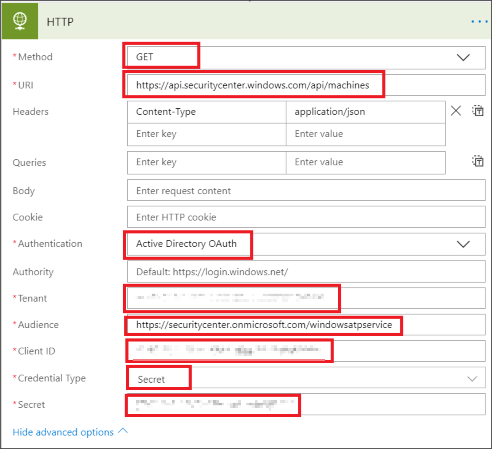

# <a name="create-a-notification-rule-when-a-local-onboarding-or-offboarding-script-is-used"></a>使用本機上架或脫離腳本時建立通知規則

[!INCLUDE [Microsoft 365 Defender rebranding](../../includes/microsoft-defender.md)]


**適用於：**
- [適用於端點的 Microsoft Defender](https://go.microsoft.com/fwlink/p/?linkid=2154037)
- [Microsoft 365 Defender](https://go.microsoft.com/fwlink/?linkid=2118804)


> 想要體驗 Microsoft Defender for Endpoint？ [註冊免費試用版。](https://www.microsoft.com/microsoft-365/windows/microsoft-defender-atp?ocid=docs-wdatp-exposedapis-abovefoldlink)

[!include[Microsoft Defender for Endpoint API URIs for US Government](../../includes/microsoft-defender-api-usgov.md)]

[!include[Improve request performance](../../includes/improve-request-performance.md)]


建立通知規則，以便在使用本機上架或脫離腳本時，系統會通知您。 

## <a name="before-you-begin"></a>開始之前
您必須具有下列許可權：
 - 最小) 的 Microsoft 流程 (流程方案1。 如需詳細資訊，請參閱 [流程定價頁面](https://flow.microsoft.com/pricing/)。
 - Azure 資料表或 SharePoint 清單或文件庫/SQL DB

## <a name="create-the-notification-flow"></a>建立通知流程

1. 在 [flow.microsoft.com](https://flow.microsoft.com/)中。

2. 流覽至 [ **我的流程 > 新的 > 排程-從空白**。 

    


3. 建立排程流程。
   1. 輸入流程名稱。
   2. 指定開始和時間。
   3. 指定頻率。 例如，每5分鐘。

    

4. 選取 [+] 按鈕，以新增動作。 新的動作將是對 Defender security center 裝置 (s) API 的 HTTP 要求。 您也可以將其取代為現成的「WDATP Connector」， (動作：「機器-取得機器的清單」 ) 。 

    


5. 輸入下列 HTTP 欄位：

   - 方法： "GET" 為取得裝置清單的值。
   - URI： Enter `https://api.securitycenter.microsoft.com/api/machines` 。
   - 驗證：選取 [Active Directory OAuth]。
   - 租使用者：登入 https://portal.azure.com 並流覽至 **Azure Active Directory > 應用程式註冊** ，並取得租使用者識別碼值。
   - 觀眾： `https://securitycenter.onmicrosoft.com/windowsatpservice\`
   - 用戶端 ID: 登入 https://portal.azure.com 及流覽 **Azure Active Directory > 應用程式註冊** 並取得用戶端識別碼值。
   - 憑證類型：選取「機密」。
   - 機密：登入 https://portal.azure.com 並流覽至 **Azure Active Directory > 應用程式註冊** ，並取得租使用者識別碼值。

    


6. 選取 [新增 **動作** **]，然後** 選取 [ **分析 JSON**]，以新增步驟。

    

7. 在 **內容** 欄位中新增正文。

    

8. 選取 [ **使用範例負載以產生架構** 連結]。

    

9. 複製並貼上下列的 JSON 程式碼片段：

    ```
    {
        "type": "object",
        "properties": {
            "@@odata.context": {
                "type": "string"
            },
            "value": {
                "type": "array",
                "items": {
                    "type": "object",
                    "properties": {
                        "id": {
                            "type": "string"
                        },
                        "computerDnsName": {
                            "type": "string"
                        },
                        "firstSeen": {
                            "type": "string"
                        },
                        "lastSeen": {
                            "type": "string"
                        },
                        "osPlatform": {
                            "type": "string"
                        },
                        "osVersion": {},
                        "lastIpAddress": {
                            "type": "string"
                        },
                        "lastExternalIpAddress": {
                            "type": "string"
                        },
                        "agentVersion": {
                            "type": "string"
                        },
                        "osBuild": {
                            "type": "integer"
                        },
                        "healthStatus": {
                            "type": "string"
                        },
                        "riskScore": {
                            "type": "string"
                        },
                        "exposureScore": {
                            "type": "string"
                        },
                        "aadDeviceId": {},
                        "machineTags": {
                            "type": "array"
                        }
                    },
                    "required": [
                        "id",
                        "computerDnsName",
                        "firstSeen",
                        "lastSeen",
                        "osPlatform",
                        "osVersion",
                        "lastIpAddress",
                        "lastExternalIpAddress",
                        "agentVersion",
                        "osBuild",
                        "healthStatus",
                        "rbacGroupId",
                        "rbacGroupName",
                        "riskScore",
                        "exposureScore",
                        "aadDeviceId",
                        "machineTags"
                    ]
                }
            }
        }
    }

    ```

10.  從 JSON 呼叫中解壓縮值，並檢查架裝置 (s) 是否已于 SharePoint 清單註冊（如範例）：
- 如果是，將不會觸發任何通知
- 若否，將會在 [SharePoint] 清單中註冊新的架裝置 (s) ，並將通知傳送至端點系統管理員的 Defender。

    

    

11. 在 [ **條件**] 底下，新增下列運算式： "length (body ( ' Get_items ' ) ？[' value '] ) "，並將 condition 設定為等於0。

      
     
       
    

## <a name="alert-notification"></a>警示通知
下圖是電子郵件通知的範例。


## <a name="tips"></a>秘訣

- 您可以使用 lastSeen 篩選：
    - 每60分鐘：
      - 過去7天內，所有的裝置都會看到過去的時間。 

- 針對每個裝置： 
    - 如果最後一次看到的屬性是在 [-7 days，-7days + 60 分鐘] 的一小時間隔內，則會產生脫離可能的 > 警示。
    - 如果第一次看到的是上一個小時-> 上架警示。

在此方案中，您將沒有重複的警示：有許多租使用者裝置。 取得所有這些裝置可能會非常昂貴，而且可能需要分頁。

您可以將其分割為兩個查詢： 
1.  若為脫離，只會使用 OData $filter 來取得此間隔，而且只會在符合條件時發出通知。
2.  在過去一個小時內，所有的裝置都會看到最後一次看到的屬性 (如果第一個看到的屬性在過去一小時內，則最後一個看到的屬性必須在) 中。 

