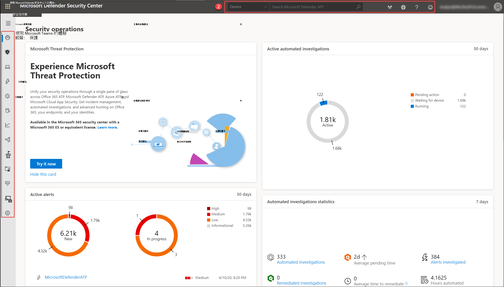

# Microsoft Defender 安全中心入口網站概觀Microsoft Defender Security Center portal overview

[!INCLUDE [Microsoft 365 Defender rebranding](../../includes/microsoft-defender.md)]

**適用於：****Applies to:**
- [適用於端點的 Microsoft DefenderMicrosoft Defender for Endpoint](https://go.microsoft.com/fwlink/p/?linkid=2154037)
- [Microsoft 365 DefenderMicrosoft 365 Defender](https://go.microsoft.com/fwlink/?linkid=2118804)

>想要體驗 Defender for Endpoint？Want to experience Defender for Endpoint? [注册免費試用版。Sign up for a free trial.](https://www.microsoft.com/microsoft-365/windows/microsoft-defender-atp?ocid=docs-wdatp-portaloverview-abovefoldlink) 

Enterprise 安全小組可使用 Microsoft Defender 資訊安全中心監視及協助回應潛在的持續威脅活動或資料違例的警示。Enterprise security teams can use Microsoft Defender Security Center to monitor and assist in responding to alerts of potential advanced persistent threat activity or data breaches.

您可以使用[Microsoft Defender 資訊安全中心](https://securitycenter.windows.com/)執行下列作業：You can use [Microsoft Defender Security Center](https://securitycenter.windows.com/) to:

- 從您的端點查看、排序及會審警示View, sort, and triage alerts from your endpoints
- 搜尋有關觀察到的指標的詳細資訊，例如檔案及 IP 位址Search for more information on observed indicators such as files and IP Addresses
- 變更 Microsoft Defender 的端點設定，包括時區及複查授權資訊Change Microsoft Defender for Endpoint settings, including time zone and review licensing information

## Microsoft Defender 資訊安全中心Microsoft Defender Security Center

當您開啟入口網站時，您會看到：When you open the portal, you'll see:

-  (1) 導覽窗格 (選取功能窗格頂端的水平線以顯示或隱藏它) (1) Navigation pane (select the horizontal lines at the top of the navigation pane to show or hide it)
-  (2) 搜尋、Community 中心、當地語系化、協助和支援、意見反應(2) Search, Community center, Localization, Help and support, Feedback

 

> [!NOTE]
> 只有在您的裝置使用 Microsoft Defender 防毒軟體成為預設的即時保護反惡意軟體產品時，才會顯示惡意程式碼相關的偵測。Malware related detections will only appear if your devices are using Microsoft Defender Antivirus as the default real-time protection antimalware product.

您可以使用所有區段中可用的功能表選項來流覽入口網站。You can navigate through the portal using the menu options available in all sections. 請參閱下表，以取得每個區段的描述。Refer to the following table for a description of each section.

區域Area | 描述Description
:---|:---
**(1) 導覽窗格****(1) Navigation pane** | 使用功能窗格在 **儀表板**、**事件**、**裝置清單**、**警示佇列**、**自動調查**、**高級搜尋**、**報告**、**合作夥伴 & APIs**、**威脅 & 弱點管理**、**評估與教程**、**服務健康** 情況、設定 **管理** 及 **設定** 之間移動。Use the navigation pane to move between **Dashboards**, **Incidents**, **Devices list**, **Alerts queue**, **Automated investigations**, **Advanced hunting**, **Reports**, **Partners & APIs**, **Threat & Vulnerability Management**, **Evaluation and tutorials**, **Service health**, **Configuration management**, and **Settings**. 選取導覽窗格頂端的水平線，以顯示或隱藏它。Select the horizontal lines at the top of the navigation pane to show or hide it.
**儀錶 板****Dashboards** | 存取使用中的自動調查、作用中警示、自動調查統計資料、有風險的裝置、具有感應器問題的裝置、服務健康情況、偵測來源及每日裝置報告儀表板的狀態。Access the active automated investigations, active alerts, automated investigations statistics, devices at risk, users at risk, devices with sensor issues, service health, detection sources, and daily devices reporting dashboards.
**事件****Incidents** | 查看已匯總為事件的警示。View alerts that have been aggregated as incidents.
**裝置清單****Devices list** | 顯示架至 Defender for Endpoint 的裝置清單、某些有關這些裝置的相關資訊，以及其曝光和風險層級。Displays the list of devices that are onboarded to Defender for Endpoint, some information about them, and their exposure and risk levels.
**警示佇列****Alerts queue** | 從組織中的裝置，查看所產生的警示。View alerts generated from devices in your organizations.
**自動化調查****Automated investigations** | 顯示已在網路中執行的自動化調查、觸發警示、每項調查的狀態和其他詳細資料，例如調查開始和調查的期間。Displays automated investigations that have been conducted in the network, triggering alert, the status of each investigation and other details such as when the investigation started and the duration of the investigation.
**進階搜捕****Advanced hunting** | 「高級搜尋」可讓您使用強大的搜尋和查詢工具，主動搜尋並調查整個組織。Advanced hunting allows you to proactively hunt and investigate across your organization using a powerful search and query tool.
**報告****Reports** | 查看詳細描述威脅防護、裝置健康情況和合規性、web 保護及弱點的圖形。View graphs detailing threat protection, device health and compliance, web protection, and vulnerability.
**合作夥伴與 API****Partners & APIs** | View the 支援的合作夥伴連線，增強平臺的偵測、調查和威脅智慧功能。View supported partner connections, which enhance the detection, investigation, and threat intelligence capabilities of the platform. 您也可以查看已連接的應用程式、API explorer、API 使用方式一覽及資料匯出設定。You can also view connected applications, the API explorer, API usage overview, and data export settings.
**威脅 & 弱點管理****Threat & Vulnerability management** | 查看適用于裝置的 Microsoft 安全分數、披露分數、公開的裝置、易受攻擊的軟體，並針對主要安全性建議採取行動。View your Microsoft Secure Score for Devices, exposure score, exposed devices, vulnerable software, and take action on top security recommendations.
**評估與示教****Evaluation and tutorials** | 管理測試裝置、攻擊模擬及報告。Manage test devices, attack simulations, and reports. 透過試用環境中的引導式試驗，瞭解並體驗到端點功能。Learn and experience the Defender for Endpoint capabilities through a guided walk-through in a trial environment.
**服務健康狀況****Service health** | 提供端點服務之 Defender 的目前狀態資訊。Provides information on the current status of the Defender for Endpoint service. 您可以驗證服務健康情況是否良好，或是否有目前的問題。You'll be able to verify that the service health is healthy or if there are current issues.
**設定管理****Configuration management** | 顯示 boarded 裝置、組織的安全性基準、預測分析、web 保護覆蓋範圍，並可讓您在裝置上執行攻擊面管理。Displays on-boarded devices, your organizations' security baseline, predictive analysis, web protection coverage, and allows you to perform attack surface management on your devices.
**設定****Settings** | 顯示您在上架期間選取的設定，並可讓您更新行業偏好設定和保留原則週期。Shows the settings you selected during onboarding and lets you update your industry preferences and retention policy period. 您也可以設定其他設定設定，例如許可權、APIs、規則、裝置管理、IT 服務管理及網路評估。You can also set other configuration settings such as permissions, APIs, rules, device management, IT service management, and network assessments.
**(2) 搜尋、Community 中心、當地語系化、協助和支援、意見反應****(2) Search, Community center, Localization,  Help and support, Feedback** | **搜尋** -搜尋依裝置、檔案、使用者、URL、IP、弱點、軟體及建議。**Search** - search by device, file, user, URL, IP, vulnerability, software, and recommendation.    **Community center** -存取 Community 中心，以瞭解、共同作業及分享產品的經驗。**Community center** - Access the Community center to learn, collaborate, and share experiences about the product.     **當地語系化** -設定時區。**Localization** - Set time zones.     說明 **與支援**-存取適用于 Endpoint 的 Defender 指南、Microsoft 和 Microsoft Premier support、授權資訊、模擬 & 教程、Defender for endpoint 評估實驗室，請參閱威脅專家。**Help and support** - Access the Defender for Endpoint guide, Microsoft and Microsoft Premier support, license information, simulations & tutorials, Defender for Endpoint evaluation lab, consult a threat expert.   **意見** 反應-提供您喜歡的意見或我們可以做什麼。**Feedback** - Provide comments about what you like or what we can do better.

> [!NOTE]
> 針對具有高解析度 DPI 縮放問題的裝置，請參閱[Windows 縮放性問題以取得高 DPI 裝置](https://support.microsoft.com/help/3025083/windows-scaling-issues-for-high-dpi-devices)，以取得可能的解決方案。For devices with high resolution DPI scaling issues, please see [Windows scaling issues for high-DPI devices](https://support.microsoft.com/help/3025083/windows-scaling-issues-for-high-dpi-devices) for possible solutions.

## Microsoft Defender for Endpoint 圖示Microsoft Defender for Endpoint icons

下表提供整個入口網站上使用之圖示的資訊：The following table provides information on the icons used all throughout the portal:

圖示Icon | 描述Description
:---|:---
| Microsoft Defender for Endpoint 標誌Microsoft Defender for Endpoint logo
| 警示–指出與高級攻擊相關的活動。Alert – Indication of an activity correlated with advanced attacks.
| 偵測–指出惡意程式碼威脅偵測。Detection – Indication of a malware threat detection.
| 主動威脅–偵測時主動執行的威脅。Active threat – Threats actively executing at the time of detection.
| 修正–從裝置移除威脅。Remediated – Threat removed from the device.
| 未修正–未從裝置移除威脅。Not remediated – Threat not removed from the device.
| 會指出在 **警示處理樹狀目錄** 中觸發警示的事件。Indicates events that triggered an alert in the **Alert process tree**.
| 裝置圖示Device icon
| Microsoft Defender 防毒軟體事件Microsoft Defender Antivirus events
| Windows Defender 應用程式防護事件Windows Defender Application Guard events
| Windows Defender Device Guard 事件Windows Defender Device Guard events
| Windows DefenderExploit Guard 事件Windows Defender Exploit Guard events
| Windows DefenderSmartScreen 事件Windows Defender SmartScreen events
| Windows防火牆事件Windows Firewall events
| 回應動作Response action
| 處理程式事件Process events
| 網路事件Network events
| 檔案事件File  events
| 登錄事件Registry events
| 載入 DLL 事件Load DLL events
| 其他事件Other events
| 存取權杖修改Access token modification
| 檔建立File creation
| 簽名Signer
| 檔案路徑File path
| 命令列Command line
| 未簽署檔Unsigned file
| 處理樹狀目錄Process tree
| 記憶體配置Memory allocation
| 處理常式注入Process injection
| Powershell 命令執行Powershell command run
 | Community 中心Community center
 | 通知Notifications
 | 自動調查-找不到威脅Automated investigation - no threats found
 | 自動調查-失敗Automated investigation - failed
 | 自動調查-部分調查Automated investigation - partially investigated
 | 自動化調查-由系統終止Automated investigation - terminated by system
 | 自動化調查-擱置Automated investigation - pending
 | 自動調查-正在執行Automated investigation - running
 | 自動調查-已修正Automated investigation - remediated
 | 自動調查-部分修正Automated investigation - partially remediated
 | 威脅 & 弱點管理-威脅洞察力Threat & Vulnerability Management - threat insights
 | 威脅 & 漏洞管理-可能的主動警示Threat & Vulnerability Management - possible active alert
 | 威脅 & 弱點管理-建議的洞察力Threat & Vulnerability Management - recommendation insights

## 相關主題Related topics

- [Microsoft Defender 資訊安全中心概觀Overview of Microsoft Defender Security Center](use.md)
- [View the Security operations 儀表板View the Security operations dashboard](security-operations-dashboard.md)
- [查看威脅 & 漏洞管理儀表板View the Threat & Vulnerability Management dashboard](tvm-dashboard-insights.md)
- [查看威脅分析儀表板並採取建議的緩解動作View the Threat analytics dashboard and take recommended mitigation actions](threat-analytics.md)
