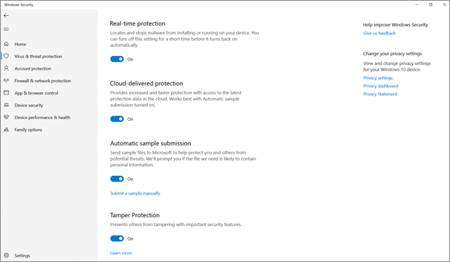

# 使用竄改防護來保護安全性設定

**適用於：**

- [適用於端點的 Microsoft Defender](/microsoft-365/security/defender-endpoint/)

在執行下列其中一個 Windows 版本的裝置上，會有防篡改保護：

- Windows 10
- Windows Server 2019
- Windows Server 版本 1803 或更新版本
- Windows Server 2016

## 概觀

在某些網路攻擊中，不良的演員會嘗試停用電腦上的安全性功能，例如防防毒保護。 不良的演員，例如停用您的安全性功能，以更輕鬆地存取資料、安裝惡意程式碼，或利用您的資料、身分識別及裝置。 防篡改保護可協助避免發生這類問題。

使用防篡改保護時，惡意應用程式無法採取下列動作：

- 停用病毒和威脅防護
- 停用即時保護
- 關閉行為監控
- 停用防病毒 (例如 IOfficeAntivirus (IOAV) ) 
- 停用雲端傳送保護
- 移除安全性智慧更新

### 運作方式

防篡改保護實質上會鎖定 Microsoft Defender 防毒軟體，並防止您的安全性設定透過應用程式和方法加以變更，例如：

- 在 Windows 裝置上設定登錄編輯程式中的設定
- 透過 PowerShell Cmdlet 變更設定
- 透過「群組原則」編輯或移除安全性設定

防篡改保護不會使您無法查看安全性設定。 而且，篡改保護不會影響協力廠商防病毒應用程式在 Windows 安全性應用程式中註冊的方式。 如果您的組織使用 Windows 10 企業版 E5，則個別使用者不能變更無法篡改的保護設定。在這種情況下，安全小組會管理防篡改保護。

### 您要執行的工作

| 若要執行此工作 .。。 | 請參閱本節 .。。 |
|:---|:---|
| 管理整個租使用者的防篡改保護 
使用 Microsoft Defender 資訊安全中心開啟或關閉防篡改保護 | [使用 Microsoft Defender 資訊安全中心管理組織的篡改保護](#manage-tamper-protection-for-your-organization-using-the-microsoft-defender-security-center) |
| 微調組織中防篡改的保護設定 
使用 Intune (Microsoft 端點管理員) 開啟或關閉不可篡改的保護。 您可以使用此方法為部分或所有使用者設定無法篡改的保護。 | [使用 Intune 管理組織的篡改保護](#manage-tamper-protection-for-your-organization-using-intune) |
| 使用 Configuration Manager 對組織的 (或關閉) 開啟防篡改保護 | [使用 Configuration Manager 的承租人附加程式管理組織的篡改保護，版本2006](#manage-tamper-protection-for-your-organization-with-configuration-manager-version-2006) |
| 針對個別裝置 (或關閉) 開啟防篡改保護 | [管理個別裝置上的非篡改保護](#manage-tamper-protection-on-an-individual-device) |
| 在裝置上查看有關篡改嘗試的詳細資料 | [查看有關篡改嘗試的資訊](#view-information-about-tampering-attempts) |
| 回顧安全性建議 | [檢查安全性建議](#review-your-security-recommendations) |
| 複查 (FAQs 的常見問題解答清單)  | [流覽 FAQs](#view-information-about-tampering-attempts) |

根據您用來啟用防篡改保護的方法或管理工具，可能會對對應 (雲端提供的保護) 相關。 

下表提供方法、工具和相依性的詳細資料。

| 啟用防篡改保護的方式  | 對地圖的相依性 (雲端提供的保護)     |
|:----|:----|
| Microsoft Intune  | 否 |
| Microsoft Endpoint Configuration Manager + 租使用者附加  |     否  |
| Microsoft Defender 資訊安全中心 ([https://securitycenter.microsoft.com](https://securitycenter.microsoft.com))     |     是 |
| Microsoft 365 安全性中心 ([https://security.microsoft.com](https://security.microsoft.com))   |     是  |

## 使用 Microsoft Defender 資訊安全中心管理組織的篡改保護

您可以使用 Microsoft Defender 資訊安全中心 () 為您的租使用者開啟或關閉不可篡改的保護 [https://securitycenter.windows.com](https://securitycenter.windows.com) 。 以下是一些需要謹記的要點：

- 目前，在 Microsoft Defender 資訊安全中心中管理防篡改保護的選項預設是針對新的部署。 針對現有的部署，在自願加入時可使用防篡改保護，其方案可讓您在近期使用預設方法。  (若要加入宣告，請在 Microsoft Defender 資訊安全中心中，選擇 [**設定**  >  **高級功能** 未  >  **篡改保護**]。 )  

- 當您使用 Microsoft Defender 資訊安全中心管理防篡改保護時，您不需要使用 Intune 或租使用者附加方法。

- 當您在 Microsoft Defender 資訊安全中心中管理防篡改保護時，此設定會套用租使用者寬度，影響所有執行 Windows 10、Windows Server 2016 或 Windows Server 2019 的裝置。 若要微調防篡改保護 (例如對某些裝置進行未篡改的保護，但對某些裝置關閉) 了防篡改保護，請使用 [Intune](#manage-tamper-protection-for-your-organization-using-intune) 或 [Configuration Manager with 承租人 attach](#manage-tamper-protection-for-your-organization-with-configuration-manager-version-2006)。

- 如果您有混合式環境，則在 Intune 中設定的防篡改防護設定會優先于 Microsoft Defender 資訊安全中心中所設定的設定。 

### 在 Microsoft Defender 資訊安全中心中管理防篡改保護的需求

- 您必須具有適當的 [許可權](/microsoft-365/security/defender-endpoint/assign-portal-access)，例如全域管理員、安全性管理員或安全性作業。

- 您的 Windows 裝置必須執行下列其中一個 Windows 版本：
   - Windows 10
   - [Windows Server 2019](/windows-server/get-started-19/whats-new-19)
   - WindowsServer，版本[1803](/windows/release-health/status-windows-10-1803)或更新版本
   - [Windows Server 2016](/windows-server/get-started/whats-new-in-windows-server-2016)
   - 如需有關版本的詳細資訊，請參閱[Windows 10 版本資訊](/windows/release-health/release-information)。

- 您的裝置必須 [架至 Microsoft Defender For Endpoint](/microsoft-365/security/defender-endpoint/onboarding)。

- 您的裝置必須使用反惡意程式碼平臺版本 4.18.2010.7 (或以上版本) 和反惡意程式碼引擎版本 1.1.17600.5 (或以上) 。  ([管理 Microsoft Defender 防毒軟體更新及套用基準](manage-updates-baselines-microsoft-defender-antivirus.md)。 ) 

- 必須開啟[雲端傳送保護](enable-cloud-protection-microsoft-defender-antivirus.md)。

### 開啟 Microsoft Defender 資訊安全中心中 (或關閉) 防篡改保護 

1. 移至 Microsoft Defender 資訊安全中心 ([https://securitycenter.windows.com](https://securitycenter.windows.com)) 並登入。

2. 選擇 [**設定**]。

3. 移至 **[一般**  >  **高級功能**]，然後開啟 [防篡改保護]。

## 使用 Intune 管理組織的篡改保護

如果您是組織的安全小組的一部分，且您的訂閱包含[Intune](/intune/fundamentals/what-is-intune)，您可以在 Microsoft 端點管理員系統管理中心 () 中，開啟組織的 (或關閉) 防篡改保護 [https://endpoint.microsoft.com](https://endpoint.microsoft.com) 。 當您想要微調防篡改防護設定時，請使用 Intune。 例如，如果您想要在某些裝置上啟用防篡改保護，但不是全部，請使用 Intune。

### 在 Intune 中管理防篡改保護的需求

- 您必須具有適當的 [許可權](/microsoft-365/security/defender-endpoint/assign-portal-access)，例如全域管理員、安全性管理員或安全性作業。

- 您的組織使用 [Intune 管理裝置](/intune/fundamentals/what-is-device-management)。 需要 ([Intune 授權](/intune/fundamentals/licenses);Intune 包含在 Microsoft 365 E5。 ) 

- 您的 Windows 裝置必須執行 Windows 10 作業系統[1709](/windows/release-health/status-windows-10-1709)、 [1803](/windows/release-health/status-windows-10-1803)、 [1809](/windows/release-health/status-windows-10-1809-and-windows-server-2019)或更新版本。  (如需有關版本的詳細資訊，請參閱[Windows 10 版本資訊](/windows/release-health/release-information)。 ) 

- 您必須使用 Windows 安全性搭配[安全性情報](https://www.microsoft.com/wdsi/definitions)更新為版本 1.287.60.0 (或以上) 。

- 您的裝置必須使用反惡意程式碼平臺版本 4.18.1906.3 (或以上版本) 和反惡意程式碼引擎版本 1.1.15500 (或以上版本) 。  ([管理 Microsoft Defender 防毒軟體更新及套用基準](manage-updates-baselines-microsoft-defender-antivirus.md)。 ) 

### 在 Intune 中 (或關閉) 開啟防篡改保護

1. 移至[Microsoft 端點管理員系統管理中心](https://endpoint.microsoft.com)，並使用您的公司或學校帳戶登入。

2. 選取 [**裝置** 設定  >  **設定檔**]。

3. 建立設定檔，其中包含下列設定：
    - **Platform： Windows 10 和更新版本**
    - **配置檔案類型： Endpoint protection**
    - **類別： Microsoft Defender 資訊安全中心**
    - **防篡改保護：已啟用**

4. 將設定檔指派給一或多個群組。

### 您使用 Windows 作業系統1709、1803或1809？

如果您使用 Windows 10 作業系統 [1709](/windows/release-health/status-windows-10-1709)、 [1803](/windows/release-health/status-windows-10-1803)或 [1809](/windows/release-health/status-windows-10-1809-and-windows-server-2019)，您將無法在 Windows 安全性應用程式中看到 **防篡改保護**。 相反地，您可以使用 PowerShell 來判斷是否已啟用防篡改保護。

#### 使用 PowerShell 來判斷是否已開啟防篡改保護

1. 開啟 Windows PowerShell 應用程式。

2. 使用 [MpComputerStatus](/powershell/module/defender/get-mpcomputerstatus?preserve-view=true&view=win10-ps) PowerShell Cmdlet。

3. 在結果清單中，尋找 `IsTamperProtected` 。  (*true* 值表示已啟用 [未篡改保護]。 ) 

## 使用 Configuration Manager 管理組織的篡改保護，版本2006

如果您使用 [的是版本2006的 Configuration Manager](/mem/configmgr/core/plan-design/changes/whats-new-in-version-2006)，您可以使用稱為 *租使用者附加* 的方法，在 Windows 10、Windows Server 2016 和 Windows Server 2019 上管理防篡改保護設定。 租使用者附加功能可讓您將內部部署的 Configuration Manager 裝置同步處理至 Microsoft 端點管理員系統管理中心，然後將端點安全性設定原則傳送至內部部署集合 & 裝置。

:::image type="content" source="images/win-security- exp-policy-endpt-security.png" alt-text="端點管理員中的 Windows 安全性體驗":::

> [!NOTE]
> 您可以使用此程式將對執行 Windows 10 和 Windows 伺服器2019的裝置擴充防篡改保護。 請務必複查此程式所述資源中的必要條件和其他資訊。

1. 設定租使用者附加。 若要深入瞭解，請參閱[Microsoft 端點管理員租使用者附加裝置：裝置同步處理和裝置動作](/mem/configmgr/tenant-attach/device-sync-actions)。

2. 在 [Microsoft 端點管理員系統管理中心](https://go.microsoft.com/fwlink/?linkid=2109431)，移至 **端點安全性**  >  **防病毒**，然後選擇 [ **+ 建立原則**]。  
   - 在 [**平臺**] 清單中，選取 [ **Windows 10 和 Windows Server (ConfigMgr])**。  
   - 在 [**設定檔**] 清單中，選取 [ **Windows 安全性經驗 (預覽)**]。  

3. 將原則部署至您的裝置集合。

### 需要此方法的協助嗎？ 

請參閱下列資源：

- [Microsoft Intune 中 Windows 安全性體驗設定檔的設定](/mem/intune/protect/antivirus-security-experience-windows-settings)
- [技術 Community 博客：宣佈 Configuration Manager 租使用者附加用戶端的篡改保護](https://techcommunity.microsoft.com/t5/microsoft-endpoint-manager-blog/announcing-tamper-protection-for-configuration-manager-tenant/ba-p/1700246#.X3QLR5Ziqq8.linkedin)

## 管理個別裝置上的非篡改保護

> [!NOTE]
> 防篡改保護封鎖會嘗試透過登錄修改 Microsoft Defender 防毒軟體設定。
>
> 為了協助確保防篡改保護不會干擾協力廠商的安全性產品或可修改這些設定的企業安裝腳本，請移至 **Windows 安全性**，並將 **安全性情報** 更新為1.287.60.0 或更新版本。  (參閱 [安全性智慧更新](https://www.microsoft.com/wdsi/definitions)。 ) 
>
> 當您完成此更新後，防篡改保護會繼續保護您的登錄設定，而記錄會嘗試修改這些設定，而不會傳回錯誤。

如果您是家庭使用者，或不受安全性小組所管理的設定的制約，您可以使用 Windows 安全性應用程式來管理無法篡改的保護。 您必須具備裝置的適當系統管理員許可權，才能執行變更安全性設定，例如防篡改的保護。

以下是您在 Windows 安全性應用程式中看到的內容：

1. 選取 [ **開始**]，然後開始輸入 *安全性*。 在搜尋結果中，選取 [ **Windows 安全性**]。

2. 選取 [**病毒 & 威脅防護**]  >  **病毒 & 威脅防護設定**。

3. 設定 **防篡改保護** 為 **開啟** 或 **關閉**。

## 查看有關篡改嘗試的資訊

篡改嘗試通常表示較大的 cyberattacks。 不良的演員會嘗試變更安全性設定，以保留並保持未被發現的方式。 如果您是組織的安全性小組的一部分，您可以查看有關這些嘗試的資訊，然後採取適當的動作來緩解威脅。

偵測到篡改嘗試時， [Microsoft Defender 資訊安全中心](/microsoft-365/security/defender-endpoint/portal-overview) () 中會產生警示 [https://securitycenter.windows.com](https://securitycenter.windows.com) 。

在 Microsoft Defender for Endpoint 中使用 [端點偵測和回應](/microsoft-365/security/defender-endpoint/overview-endpoint-detection-response) 及 [高級搜尋](/microsoft-365/security/defender-endpoint/advanced-hunting-overview) 功能，您的安全性作業小組可以調查並處理此類嘗試。

## 回顧安全性建議

防篡改防護會與 [威脅 & 漏洞管理](/microsoft-365/security/defender-endpoint/next-gen-threat-and-vuln-mgt) 功能整合。 [安全性建議](/microsoft-365/security/defender-endpoint/tvm-security-recommendation) 包括確定已開啟防篡改保護。 例如，您可以搜尋未 *篡改* 的，如下圖所示：

在結果中，您可以選取 [ **開啟防篡改防護** ] 以深入瞭解及開啟。

若要深入瞭解威脅 & 漏洞管理的詳細資訊，請參閱[Microsoft Defender 資訊安全中心中的威脅 & 漏洞管理](/microsoft-365/security/defender-endpoint/tvm-dashboard-insights#threat--vulnerability-management-in-microsoft-defender-security-center)。

## 常見問題集

### 若要 Windows 作業系統版本設定防篡改保護，是否適用？

Windows 10作業系統[1709](/windows/release-health/status-windows-10-1709)、 [1803](/windows/release-health/status-windows-10-1803)、 [1809](/windows/release-health/status-windows-10-1809-and-windows-server-2019)或更新版本，與[Microsoft Defender for Endpoint](/microsoft-365/security/defender-endpoint)一起使用。

如果您使用的是 Configuration Manager，版本2006，使用租使用者附加，可將防篡改保護功能延伸至 Windows Server 2019。 請參閱「租使用者」 [：從系統管理中心建立及部署端點安全性防病毒原則 (預覽) ](/mem/configmgr/tenant-attach/deploy-antivirus-policy)。

### 防篡改保護是否會影響協力廠商防病毒註冊？

否。 協力廠商的防病毒產品將繼續向 Windows 安全性的應用程式註冊。

### 如果裝置上的 Microsoft Defender 防毒軟體不在使用中，會發生什麼事？

架至 Microsoft Defender for Endpoint 的裝置會在被動模式中執行 Microsoft Defender 防毒軟體。 防篡改保護將繼續保護服務及其功能。 

### 如何開啟/關閉防篡改保護？

如果您是家庭使用者，請參閱 [管理個別裝置上的非篡改保護](#manage-tamper-protection-on-an-individual-device)。

如果您是使用 [Microsoft Defender For Endpoint 的](/microsoft-365/security/defender-endpoint)組織，您應該可以在 Intune 中管理防篡改保護，類似管理其他 Endpoint protection 功能的方式。 請參閱本文的下列各節： 

- [使用 Intune 管理防篡改保護](#manage-tamper-protection-for-your-organization-using-intune)
- [使用 Configuration Manager 管理防篡改保護，版本2006](#manage-tamper-protection-for-your-organization-with-configuration-manager-version-2006)
- [使用 Microsoft Defender 資訊安全中心管理無法篡改的保護](#manage-tamper-protection-for-your-organization-using-the-microsoft-defender-security-center) 

### 如何在 Intune 中設定防篡改保護，會影響透過「我的群組原則」管理 Microsoft Defender 防毒軟體的方式？

您的一般群組原則不會套用到防篡改保護，而且當防篡改保護開啟時，會忽略 Microsoft Defender 防毒軟體設定的變更。 

### 針對 Microsoft Defender for Endpoint，在僅針對整個組織的 Intune 中，是否要設定防篡改保護？

在 Intune 或 Microsoft 端點管理員中設定無法篡改的保護，可成為整個組織及特定裝置和使用者群組的目標。

### 我是否可以在 Microsoft Endpoint Configuration Manager 中設定無法篡改的保護？

如果您使用租使用者附加，您可以使用 Microsoft Endpoint Configuration Manager。 請參閱下列資源：
- [使用 Configuration Manager 管理組織的篡改保護，版本2006](#manage-tamper-protection-for-your-organization-with-configuration-manager-version-2006)
- [技術 Community 博客：宣佈 Configuration Manager 租使用者附加用戶端的篡改保護](https://techcommunity.microsoft.com/t5/microsoft-endpoint-manager-blog/announcing-tamper-protection-for-configuration-manager-tenant/ba-p/1700246#.X3QLR5Ziqq8.linkedin)

### 我有 Windows E3 註冊。 我是否可以在 Intune 中使用設定防篡改保護？

目前，在 Intune 中設定防篡改保護只適用于具有 [Microsoft Defender For Endpoint](/microsoft-365/security/defender-endpoint)的客戶。

### 如果在裝置上啟用防篡改保護功能時，嘗試變更 Intune 中的 Microsoft Defender for Endpoint 設定，Microsoft Endpoint Configuration Manager 和 Windows 管理工具時，會發生什麼事？

您將無法變更受到防篡改保護的功能;這類變更要求會被忽略。

### 我是企業客戶。 本機系統管理員是否可以變更其裝置上的篡改保護？

否。 本機系統管理員無法變更或修改無法篡改的保護設定。

### 如果我的裝置使用 Microsoft Defender for Endpoint 架，然後進入 boarded 狀態，會發生什麼情況？

如果從 Microsoft Defender for Endpoint boarded 裝置，則會開啟防篡改防護，這是非管理裝置的預設狀態。 

### Microsoft Defender 資訊安全中心中的篡改保護狀態變更是否會產生警示？

是。 警示會顯示在 [ [https://securitycenter.microsoft.com](https://securitycenter.microsoft.com) **警示**] 底下。

您的安全性運作小組也可以使用搜尋查詢，例如下列範例：

`DeviceAlertEvents | where Title == "Tamper Protection bypass"`

[查看有關篡改嘗試的資訊](#view-information-about-tampering-attempts)。

## 另請參閱

[使用 Microsoft Intune Endpoint Protection 協助保護 Windows 電腦](/intune/help-secure-windows-pcs-with-endpoint-protection-for-microsoft-intune)

[深入瞭解 Microsoft Defender for Endpoint](/microsoft-365/security/defender-endpoint)

[相得益彰：Microsoft Defender 防毒軟體與適用於端點的 Microsoft Defender](why-use-microsoft-defender-antivirus.md)