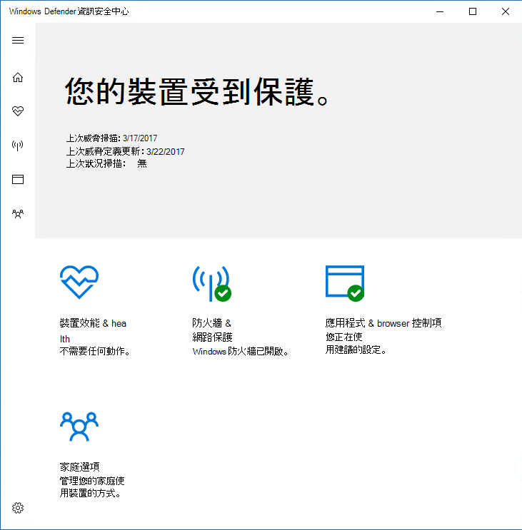
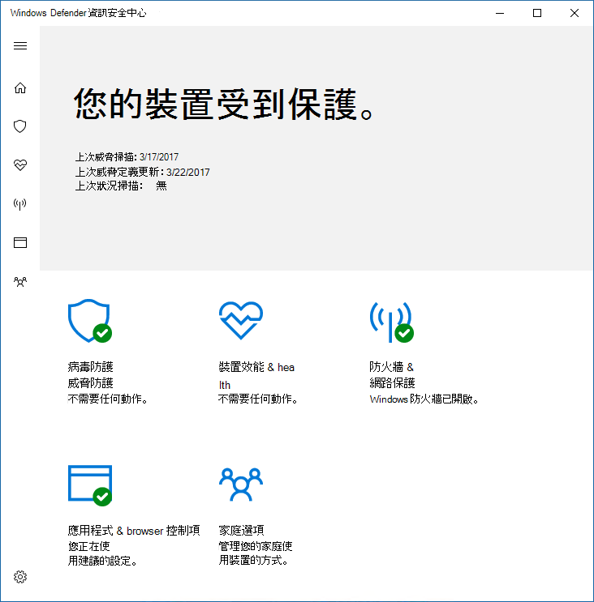
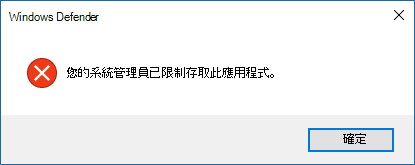

# 防止使用者看到 Microsoft Defender 防病毒使用者介面或與其互動Prevent users from seeing or interacting with the Microsoft Defender Antivirus user interface

[!INCLUDE [Microsoft 365 Defender rebranding](../../includes/microsoft-defender.md)]

**適用於：****Applies to:**

- [適用於端點的 Microsoft DefenderMicrosoft Defender for Endpoint](/microsoft-365/security/defender-endpoint/)

您可以使用群組原則，防止使用者在端點上看到 Microsoft Defender 防病毒介面。You can use Group Policy to prevent users on endpoints from seeing the Microsoft Defender Antivirus interface. 您也可以防止使用者暫停掃描。You can also prevent them from pausing scans.

## 隱藏 Microsoft Defender 防病毒介面Hide the Microsoft Defender Antivirus interface

在 Windows 10 版本1703中，隱藏介面會隱藏 Microsoft Defender 防病毒通知，並防止病毒 & 威脅防護磚出現在 Windows 安全性應用程式中。In Windows 10, versions 1703, hiding the interface will hide Microsoft Defender Antivirus notifications and prevent the Virus & threat protection tile from appearing in the Windows Security app.

設定為 [ **啟用**] 時：With the setting set to **Enabled**:

設定為 [ **停** 用] 或 [未設定] 時：With the setting set to **Disabled** or not configured:

>[!NOTE]
>隱藏介面也會使 Microsoft Defender 防病毒通知不會出現在端點上。Hiding the interface will also prevent Microsoft Defender Antivirus notifications from appearing on the endpoint. 仍會顯示 Microsoft Defender for Endpoint 通知。Microsoft Defender for Endpoint notifications will still appear. 您也可以個別 [設定出現在端點上的通知](configure-notifications-microsoft-defender-antivirus.md)You can also individually [configure the notifications that appear on endpoints](configure-notifications-microsoft-defender-antivirus.md)

在舊版 Windows 10 中，此設定會隱藏 Windows Defender 用戶端介面。In earlier versions of Windows 10, the setting will hide the Windows Defender client interface. 如果使用者嘗試開啟它，他們會收到警告說：「您的系統管理員已限制存取此應用程式」。If the user attempts to open it, they will receive a warning that says, "Your system administrator has restricted access to this app."

## 使用群組原則從使用者隱藏 Microsoft Defender AV 介面Use Group Policy to hide the Microsoft Defender AV interface from users

1. 在您的群組原則管理電腦上，開啟 [ [群組原則管理主控台](/previous-versions/windows/desktop/gpmc/group-policy-management-console-portal)]，以滑鼠右鍵按一下您要設定的群組原則物件，然後按一下 [ **編輯**]。On your Group Policy management machine, open the [Group Policy Management Console](/previous-versions/windows/desktop/gpmc/group-policy-management-console-portal), right-click the Group Policy Object you want to configure and click **Edit**.

2. 使用 **群組原則管理編輯器** 移至 [ **電腦** 設定]。Using the **Group Policy Management Editor** go to **Computer configuration**.

3. 按一下 [系統 **管理範本**]。Click **Administrative templates**.

4. 在 [ **Microsoft Defender 防病毒 > 用戶端] 介面** 中，將樹狀目錄展開為 Windows 元件 >。Expand the tree to **Windows components > Microsoft Defender Antivirus > Client interface**.

5. 按兩下 [啟用無 **外設 UI 模式]** 設定，並將選項設定為 [ **啟用**]。Double-click the **Enable headless UI mode** setting and set the option to **Enabled**. 按一下 [確定]。Click **OK**. 

請參閱 [防止使用者在本機修改原則設定](configure-local-policy-overrides-microsoft-defender-antivirus.md) ] 中的更多選項，以防止使用者表單修改其電腦上的保護。See [Prevent users from locally modifying policy settings](configure-local-policy-overrides-microsoft-defender-antivirus.md) for more options on preventing users form modifying protection on their PCs.

## 防止使用者暫停掃描Prevent users from pausing a scan

您可以防止使用者暫停掃描，這有助於確保使用者不會中斷排程或要求的掃描。You can prevent users from pausing scans, which can be helpful to ensure scheduled or on-demand scans are not interrupted by users.

> [!NOTE]
> Windows 10 不支援此設定。This setting is not supported on Windows 10.

### 使用群組原則防止使用者暫停掃描Use Group Policy to prevent users from pausing a scan

1. 在您的群組原則管理電腦上，開啟 [ [群組原則管理主控台](/previous-versions/windows/desktop/gpmc/group-policy-management-console-portal)]，以滑鼠右鍵按一下您要設定的群組原則物件，然後按一下 [ **編輯**]。On your Group Policy management machine, open the [Group Policy Management Console](/previous-versions/windows/desktop/gpmc/group-policy-management-console-portal), right-click the Group Policy Object you want to configure and click **Edit**.

2. 使用 **群組原則管理編輯器** 移至 [ **電腦** 設定]。Using the **Group Policy Management Editor** go to **Computer configuration**.

3. 按一下 [系統 **管理範本**]。Click **Administrative templates**.

4. 將樹狀目錄展開為 **Windows 元件**  >  **Microsoft Defender 防病毒**  >  **掃描**。Expand the tree to **Windows components** > **Microsoft Defender Antivirus** > **Scan**.

5. 按兩下 [ **允許使用者暫停掃描** ] 設定，並將選項設定為 [ **已停用**]。Double-click the **Allow users to pause scan** setting and set the option to **Disabled**. 按一下 [確定]。Click **OK**. 

## 相關文章Related articles

- [設定出現在端點上的通知Configure the notifications that appear on endpoints](configure-notifications-microsoft-defender-antivirus.md)

- [使用 Microsoft Defender 防毒軟體設定使用者互動Configure end-user interaction with Microsoft Defender Antivirus](configure-end-user-interaction-microsoft-defender-antivirus.md)

- [Windows 10 中的 Microsoft Defender 防病毒Microsoft Defender Antivirus in Windows 10](microsoft-defender-antivirus-in-windows-10.md)