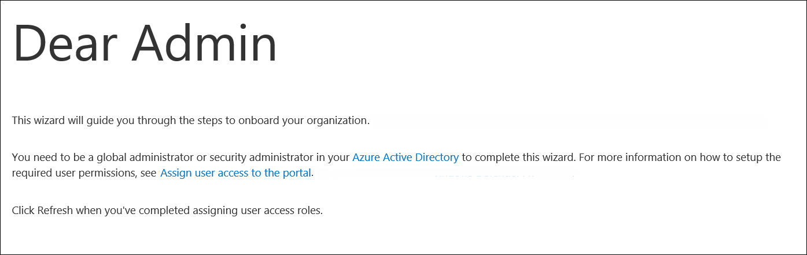

# <a name="set-up-microsoft-defender-for-endpoint-deployment"></a>設定 Microsoft Defender for Endpoint 部署

[!INCLUDE [Microsoft 365 Defender rebranding](../../includes/microsoft-defender.md)]


**適用於：**
- [適用於端點的 Microsoft Defender](https://go.microsoft.com/fwlink/p/?linkid=2146631)
- [Microsoft 365 Defender](https://go.microsoft.com/fwlink/?linkid=2118804)

> 想要體驗 Microsoft Defender for Endpoint？ [註冊免費試用版。](https://www.microsoft.com/microsoft-365/windows/microsoft-defender-atp?ocid=docs-wdatp-exposedapis-abovefoldlink)

為端點部署 Defender 是三個階段的處理常式：

| [](prepare-deployment.md)<br>[階段1：準備](prepare-deployment.md) | <br>階段2：設定 | [](onboarding.md)<br>[階段3：板載](onboarding.md) |
| ----- | ----- | ----- |
| | *您在這裡！*||

您目前在設定階段。

在此部署案例中，您將會逐步指導您執行下列步驟：
- 授權驗證
- 租用戶設定
- 網路設定


>[!NOTE]
>為便於您透過一般部署，此案例只會涵蓋 Microsoft 端點 Configuration Manager 的使用。 Defender for Endpoint 支援使用其他上架工具，但不會涵蓋部署指南中的那些案例。 如需詳細資訊，請參閱 [在 Microsoft Defender For Endpoint 中的板載裝置](onboard-configure.md)。

## <a name="check-license-state"></a>檢查授權狀態

檢查授權狀態以及是否已正確布建，可透過系統管理中心或 **Microsoft Azure 入口網站** 進行。

1. 若要查看您的授權，請移至 **Microsoft azure 入口網站** ，並流覽至 [microsoft azure 入口網站授權區段](https://portal.azure.com/#blade/Microsoft_AAD_IAM/LicensesMenuBlade/Products)。

   

1. 或者，在系統管理中心中，流覽至 [**帳單**] [  >  **訂閱**]。

    在螢幕上，您會看到所有已布建的授權及其目前的 **狀態**。

    


## <a name="cloud-service-provider-validation"></a>雲端服務提供者驗證

若要存取您公司所提供的授權，以及檢查授權的狀態，請移至系統管理中心。

1. 從 **夥伴入口網站** 中，選取 [ **管理服務 > Office 365**]。

2. 按一下 [ **合作夥伴入口網站** ] 連結時，將會自行開啟 [ **管理員** ] 選項，並可讓您存取客戶系統管理中心。

   


## <a name="tenant-configuration"></a>租使用者設定

第一次存取 Microsoft Defender Security Center 時，會有一個嚮導可引導您逐步完成一些初始步驟。 在安裝程式嚮導結束時，會為建立端點的 Defender 專用雲端實例。 最簡單的方法是從 Windows 10 用戶端裝置執行這些步驟。

1. 在網頁瀏覽器中，流覽至 <https://securitycenter.windows.com> 。

    

2. 若要透過試用許可證，請移至連結 (<https://signup.microsoft.com/Signup?OfferId=6033e4b5-c320-4008-a936-909c2825d83c&dl=WIN_DEF_ATP&pc=xxxxxxx-xxxxxx-xxx-x>) 

    授權步驟完成後，就會顯示 [ **歡迎** ] 畫面。
3. 請流覽驗證步驟。

    

4. 設定偏好設定。

   **資料儲存位置** -請務必正確設定。 決定客戶想要主要寄存的位置：美國、歐盟或 UK。 您無法變更此設定之後的位置，Microsoft 也不會從指定的地理位置傳輸資料。 

    **資料保留** -預設值為六個月。

    **啟用預覽功能** -預設值為 on，以後可以變更。

    

5. 選取 **[下一步]**。

     

6. 選取 [ **繼續**]。


## <a name="network-configuration"></a>網路設定
如果組織不需要端點使用 Proxy 來存取網際網路，請略過本節。

適用於端點的 Microsoft Defender 感應器需要 Microsoft Windows HTTP (WinHTTP) 回報感應器資料，並與適用於端點的 Microsoft Defender 服務通訊。 內嵌的 Microsoft Defender for Endpoint 感應器會在使用 LocalSystem 帳戶的系統上下文中執行。 感應器使用 Microsoft Windows HTTP Services （WinHTTP）來啟用與適用於端點的 Microsoft Defender 雲端服務的通訊。 WinHTTP 設定設定與 Windows Internet (WinINet) Internet 流覽 proxy 設定無關，而且只能使用下列探索方法來探索 proxy 伺服器：

**自動探索方法：**

-   透明Proxy

-   Web Proxy 自動探索通訊協定 (WPAD) 

如果已在網路拓撲中執行透明 proxy 或 WPAD，則不需要特殊的設定。 如需 proxy 中 Microsoft Defender for Endpoint URL 排除專案的詳細資訊，請參閱本檔中的「附錄」區段中的 URLs 允許清單或 [Microsoft](https://docs.microsoft.com/windows/security/threat-protection/windows-defender-atp/configure-proxy-internet-windows-defender-advanced-threat-protection#enable-access-to-windows-defender-atp-service-urls-in-the-proxy-server)檔。

> [!NOTE]
> 如需需要允許的 URLs 詳細清單，請參閱 [本文](https://docs.microsoft.com/windows/security/threat-protection/microsoft-defender-antivirus/configure-network-connections-microsoft-defender-antivirus)。

**手動靜態 Proxy 組態：**

-   以登錄為基礎的設定

-   使用 netsh 命令設定 WinHTTP <br> 僅適用于穩定拓撲中的桌上型電腦 (例如，公司網路中位於相同 proxy 的桌面) 

### <a name="configure-the-proxy-server-manually-using-a-registry-based-static-proxy"></a>使用基於登錄的靜態 Proxy 手動設定 Proxy 伺服器

設定登錄型靜態 proxy，只允許 Microsoft Defender for Endpoint 感應器報告診斷資料，並在電腦不允許連線至網際網路時，與 Microsoft Defender for Endpoint service 通訊。 靜態 Proxy 可以透過群組原則 (GP) 設定。 可以在以下位置找到群組原則：

 - 系統管理範本 \> Windows 元件 \> 資料收集和預覽組建 \> 設定連線使用者經驗和遙測服務的已驗證 Proxy 使用方式
     - 設定為 **啟用** ，並選取 [ **停用已驗證的 Proxy 使用**

1. 開啟 [群組原則管理主控台]。
2. 建立原則，或根據組織的作法來編輯現有的原則。
3. 編輯群組原則並流覽至 [系統 **管理範本] \> Windows 元件 \> 資料收集和預覽組建 \> 設定連線使用者經驗和遙測服務的已驗證 Proxy 使用方式**。 
    

4. 選取 **已啟用**。
5. 選取 [ **停用已驗證的 Proxy 使用**]。
   
6. 流覽至系統 **管理範本 \> Windows 元件 \> 資料收集和預覽組建 \> 設定連線使用者經驗和遙測**。
    
7. 選取 **已啟用**。
8. 輸入 **Proxy 伺服器名稱**。

原則將登錄機碼 `HKLM\Software\Policies\Microsoft\Windows\DataCollection` 下的兩個登錄值 `TelemetryProxyServer` 設定為 REG\u SZ，`DisableEnterpriseAuthProxy` 設定為 REG\u DWORD。

登錄值 `TelemetryProxyServer` 採用下列字串格式：

```text
<server name or ip>:<port>
```

例如：10.0.0.6:8080

此登錄值 `DisableEnterpriseAuthProxy` 應當設定為 1。

###  <a name="configure-the-proxy-server-manually-using-netsh-command"></a>使用 netsh 命令手動設定 proxy 伺服器

使用 netsh 設定全系統的靜態 Proxy。

> [!NOTE]
> - 這將影響所有應用程式，包括使用帶預設 Proxy 之 WinHTTP 的 Windows 服務。</br>
> - 變更拓撲的膝上型電腦 (例如：從 office 到 home) ，將無法使用 netsh。 使用基於登錄的靜態 Proxy 設定。

1. 開啟已提升許可權的命令列：

    1. 轉至 **[開始]** 並鍵入 **「cmd」**。

    1. 以滑鼠右鍵按一下 **[命令提示字元]**，然後選取 **[以系統管理員身分執行]**。

2. 輸入以下命令，再按 **Enter**：

   ```PowerShell
   netsh winhttp set proxy <proxy>:<port>
   ```

   例如：netsh winhttp set proxy 10.0.0.6:8080


###  <a name="proxy-configuration-for-down-level-devices"></a>底層裝置的 Proxy 設定

Down-Level 裝置包含 windows 7 SP1 和 Windows 8.1 工作站，以及 windows server CB 2016 之前的 windows Server 2008 R2、Windows Server 2012、Windows Server 2012 R2 和 Windows Server 1803 版本。 這些作業系統會將 proxy 設定為 Microsoft Management Agent 的一部分，以處理從端點到 Azure 的通訊。 如需如何在這些裝置上設定 proxy 的詳細資訊，請參閱《 Microsoft Management Agent Fast Deployment 指南》。

### <a name="proxy-service-urls"></a>Proxy 服務 URLs
只有在您有 Windows 10、版本1803或更新版本的裝置時，才需要在其中包含 v20 的 URLs。 例如， ```us-v20.events.data.microsoft.com``` 只有當裝置在 Windows 10，版本1803或更新版本上時才需要。
 

如果 proxy 或防火牆封鎖匿名流量，當 Microsoft Defender for Endpoint 感應器從系統內容連線時，請確定所列的 URLs 允許匿名流量。

下列可供下載的試算表會列出您網路必須能夠連線的服務及其相關 URLs。 確定沒有防火牆或網路篩選規則可拒絕這些 URLs 的存取權，否則您可能需要建立專用的 *allow* 規則。

|**網域清單的試算表**|**描述**|
|:-----|:-----|
|<br/>  | 服務位置、地理位置和作業系統的特定 DNS 記錄試算表。 <br><br>[在這裡下載試算表。](https://download.microsoft.com/download/8/a/5/8a51eee5-cd02-431c-9d78-a58b7f77c070/mde-urls.xlsx) 


###  <a name="microsoft-defender-for-endpoint-service-backend-ip-range"></a>Microsoft Defender for Endpoint service 後端 IP 範圍

如果網路裝置不支援上一節所列的 URLs，您可以使用下列資訊。

在 Azure cloud 上建立端點的 Defender，部署于下列地區：

- \+\<Region Name="uswestcentral">
- \+\<Region Name="useast2">
- \+\<Region Name="useast">
- \+\<Region Name="europenorth">
- \+\<Region Name="europewest">
- \+\<Region Name="uksouth">
- \+\<Region Name="ukwest">

您可以在 [Microsoft Azure 資料中心 IP 範圍](https://www.microsoft.com/en-us/download/details.aspx?id=41653)上找到 Azure IP 範圍。

> [!NOTE]
> 作為雲端式解決方案，IP 位址範圍可能會變更。 建議您移至 DNS 解析設定。

## <a name="next-step"></a>下一步

 <br>[階段3：板載](onboarding.md)：對服務的板載裝置，使 Microsoft Defender for Endpoint service 可以從這些裝置取得感應器資料。 
