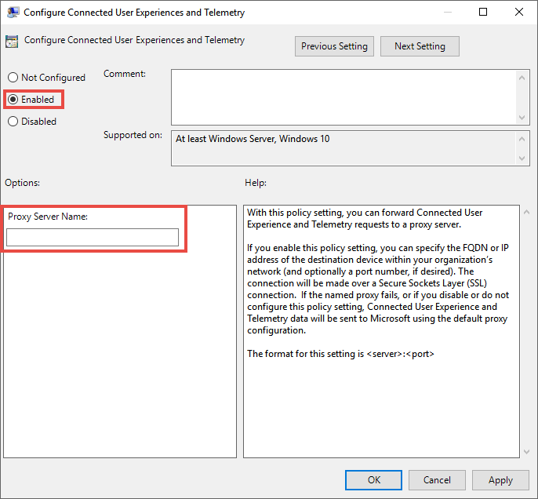

# <a name="set-up-microsoft-defender-for-endpoint-deployment"></a><span data-ttu-id="09bc8-104">設定 Microsoft Defender for Endpoint 部署</span><span class="sxs-lookup"><span data-stu-id="09bc8-104">Set up Microsoft Defender for Endpoint deployment</span></span>

[!INCLUDE [Microsoft 365 Defender rebranding](../../includes/microsoft-defender.md)]


<span data-ttu-id="09bc8-105">**適用於：**</span><span class="sxs-lookup"><span data-stu-id="09bc8-105">**Applies to:**</span></span>
- [<span data-ttu-id="09bc8-106">適用於端點的 Microsoft Defender</span><span class="sxs-lookup"><span data-stu-id="09bc8-106">Microsoft Defender for Endpoint</span></span>](https://go.microsoft.com/fwlink/p/?linkid=2154037)
- [<span data-ttu-id="09bc8-107">Microsoft 365 Defender</span><span class="sxs-lookup"><span data-stu-id="09bc8-107">Microsoft 365 Defender</span></span>](https://go.microsoft.com/fwlink/?linkid=2118804)

> <span data-ttu-id="09bc8-108">想要體驗 Microsoft Defender for Endpoint？</span><span class="sxs-lookup"><span data-stu-id="09bc8-108">Want to experience Microsoft Defender for Endpoint?</span></span> [<span data-ttu-id="09bc8-109">註冊免費試用版。</span><span class="sxs-lookup"><span data-stu-id="09bc8-109">Sign up for a free trial.</span></span>](https://www.microsoft.com/microsoft-365/windows/microsoft-defender-atp?ocid=docs-wdatp-exposedapis-abovefoldlink)

<span data-ttu-id="09bc8-110">為端點部署 Defender 是三個階段的處理常式：</span><span class="sxs-lookup"><span data-stu-id="09bc8-110">Deploying Defender for Endpoint is a three-phase process:</span></span>

| <span data-ttu-id="09bc8-111">[](prepare-deployment.md)</span><span class="sxs-lookup"><span data-stu-id="09bc8-111">[](prepare-deployment.md)</span></span><br>[<span data-ttu-id="09bc8-112">階段1：準備</span><span class="sxs-lookup"><span data-stu-id="09bc8-112">Phase 1: Prepare</span></span>](prepare-deployment.md) | <br><span data-ttu-id="09bc8-114">階段2：設定</span><span class="sxs-lookup"><span data-stu-id="09bc8-114">Phase 2: Setup</span></span> | <span data-ttu-id="09bc8-115">[](onboarding.md)</span><span class="sxs-lookup"><span data-stu-id="09bc8-115">[](onboarding.md)</span></span><br>[<span data-ttu-id="09bc8-116">階段3：板載</span><span class="sxs-lookup"><span data-stu-id="09bc8-116">Phase 3: Onboard</span></span>](onboarding.md) |
| ----- | ----- | ----- |
| | <span data-ttu-id="09bc8-117">*您在這裡！*</span><span class="sxs-lookup"><span data-stu-id="09bc8-117">*You are here!*</span></span>||

<span data-ttu-id="09bc8-118">您目前在設定階段。</span><span class="sxs-lookup"><span data-stu-id="09bc8-118">You are currently in the set-up phase.</span></span>

<span data-ttu-id="09bc8-119">在此部署案例中，您將會逐步指導您執行下列步驟：</span><span class="sxs-lookup"><span data-stu-id="09bc8-119">In this deployment scenario, you'll be guided through the steps on:</span></span>
- <span data-ttu-id="09bc8-120">授權驗證</span><span class="sxs-lookup"><span data-stu-id="09bc8-120">Licensing validation</span></span>
- <span data-ttu-id="09bc8-121">租用戶設定</span><span class="sxs-lookup"><span data-stu-id="09bc8-121">Tenant configuration</span></span>
- <span data-ttu-id="09bc8-122">網路設定</span><span class="sxs-lookup"><span data-stu-id="09bc8-122">Network configuration</span></span>


>[!NOTE]
><span data-ttu-id="09bc8-123">為便於您透過一般部署，此案例只會涵蓋 Microsoft 端點 Configuration Manager 的使用。</span><span class="sxs-lookup"><span data-stu-id="09bc8-123">For the purpose of guiding you through a typical deployment, this scenario will only cover the use of Microsoft Endpoint Configuration Manager.</span></span> <span data-ttu-id="09bc8-124">Defender for Endpoint 支援使用其他上架工具，但不涵蓋部署指南中的那些案例。</span><span class="sxs-lookup"><span data-stu-id="09bc8-124">Defender for Endpoint supports the use of other onboarding tools but won't cover those scenarios in the deployment guide.</span></span> <span data-ttu-id="09bc8-125">如需詳細資訊，請參閱 [在 Microsoft Defender For Endpoint 中的板載裝置](onboard-configure.md)。</span><span class="sxs-lookup"><span data-stu-id="09bc8-125">For more information, see [Onboard devices to Microsoft Defender for Endpoint](onboard-configure.md).</span></span>

## <a name="check-license-state"></a><span data-ttu-id="09bc8-126">檢查授權狀態</span><span class="sxs-lookup"><span data-stu-id="09bc8-126">Check license state</span></span>

<span data-ttu-id="09bc8-127">檢查授權狀態以及是否已正確布建，可透過系統管理中心或 **Microsoft Azure 入口網站** 進行。</span><span class="sxs-lookup"><span data-stu-id="09bc8-127">Checking for the license state and whether it got properly provisioned, can be done through the admin center or through the **Microsoft Azure portal**.</span></span>

1. <span data-ttu-id="09bc8-128">若要查看您的授權，請移至 **Microsoft azure 入口網站** ，並流覽至 [microsoft azure 入口網站授權區段](https://portal.azure.com/#blade/Microsoft_AAD_IAM/LicensesMenuBlade/Products)。</span><span class="sxs-lookup"><span data-stu-id="09bc8-128">To view your licenses, go to the **Microsoft Azure portal** and navigate to the [Microsoft Azure portal license section](https://portal.azure.com/#blade/Microsoft_AAD_IAM/LicensesMenuBlade/Products).</span></span>

   

1. <span data-ttu-id="09bc8-130">或者，在系統管理中心中，流覽至 [**帳單**] [  >  **訂閱**]。</span><span class="sxs-lookup"><span data-stu-id="09bc8-130">Alternately, in the admin center, navigate to **Billing** > **Subscriptions**.</span></span>

    <span data-ttu-id="09bc8-131">在螢幕上，您會看到所有已布建的授權及其目前的 **狀態**。</span><span class="sxs-lookup"><span data-stu-id="09bc8-131">On the screen, you'll see all the provisioned licenses and their current **Status**.</span></span>

    


## <a name="cloud-service-provider-validation"></a><span data-ttu-id="09bc8-133">雲端服務提供者驗證</span><span class="sxs-lookup"><span data-stu-id="09bc8-133">Cloud Service Provider validation</span></span>

<span data-ttu-id="09bc8-134">若要存取您公司所提供的授權，以及檢查授權的狀態，請移至系統管理中心。</span><span class="sxs-lookup"><span data-stu-id="09bc8-134">To gain access into which licenses are provisioned to your company, and to check the state of the licenses, go to the admin center.</span></span>

1. <span data-ttu-id="09bc8-135">從 **夥伴入口網站** 中，選取 [ **管理服務 > Office 365**]。</span><span class="sxs-lookup"><span data-stu-id="09bc8-135">From the **Partner portal**, select **Administer services > Office 365**.</span></span>

2. <span data-ttu-id="09bc8-136">按一下 [ **合作夥伴入口網站** ] 連結時，將會自行開啟 [ **管理員** ] 選項，並可讓您存取客戶系統管理中心。</span><span class="sxs-lookup"><span data-stu-id="09bc8-136">Clicking on the **Partner portal** link will open the **Admin on behalf** option and will give you access to the customer admin center.</span></span>

   


## <a name="tenant-configuration"></a><span data-ttu-id="09bc8-138">租使用者設定</span><span class="sxs-lookup"><span data-stu-id="09bc8-138">Tenant Configuration</span></span>

<span data-ttu-id="09bc8-139">第一次存取 Microsoft Defender Security Center 時，會有一個嚮導可引導您逐步完成一些初始步驟。</span><span class="sxs-lookup"><span data-stu-id="09bc8-139">When accessing Microsoft Defender Security Center for the first time, a wizard that will guide you through some initial steps.</span></span> <span data-ttu-id="09bc8-140">在安裝程式嚮導結束時，會為建立端點的 Defender 專用雲端實例。</span><span class="sxs-lookup"><span data-stu-id="09bc8-140">At the end of the setup wizard, there will be a dedicated cloud instance of Defender for Endpoint created.</span></span> <span data-ttu-id="09bc8-141">最簡單的方法是從 Windows 10 用戶端裝置執行這些步驟。</span><span class="sxs-lookup"><span data-stu-id="09bc8-141">The easiest method is to perform these steps from a Windows 10 client device.</span></span>

1. <span data-ttu-id="09bc8-142">在網頁瀏覽器中，流覽至 <https://securitycenter.windows.com> 。</span><span class="sxs-lookup"><span data-stu-id="09bc8-142">From a web browser, navigate to <https://securitycenter.windows.com>.</span></span>

    

2. <span data-ttu-id="09bc8-144">若要透過試用許可證，請移至連結 (<https://signup.microsoft.com/Signup?OfferId=6033e4b5-c320-4008-a936-909c2825d83c&dl=WIN_DEF_ATP&pc=xxxxxxx-xxxxxx-xxx-x>) </span><span class="sxs-lookup"><span data-stu-id="09bc8-144">If going through a TRIAL license, go to the link (<https://signup.microsoft.com/Signup?OfferId=6033e4b5-c320-4008-a936-909c2825d83c&dl=WIN_DEF_ATP&pc=xxxxxxx-xxxxxx-xxx-x>)</span></span>

    <span data-ttu-id="09bc8-145">授權步驟完成後，就會顯示 [ **歡迎** ] 畫面。</span><span class="sxs-lookup"><span data-stu-id="09bc8-145">Once the authorization step is completed, the **Welcome** screen will be displayed.</span></span>
3. <span data-ttu-id="09bc8-146">請流覽驗證步驟。</span><span class="sxs-lookup"><span data-stu-id="09bc8-146">Go through the authorization steps.</span></span>

    

4. <span data-ttu-id="09bc8-148">設定偏好設定。</span><span class="sxs-lookup"><span data-stu-id="09bc8-148">Set up preferences.</span></span>

   <span data-ttu-id="09bc8-149">**資料儲存位置** -請務必正確設定。</span><span class="sxs-lookup"><span data-stu-id="09bc8-149">**Data storage location** - It's important to set this up correctly.</span></span> <span data-ttu-id="09bc8-150">決定客戶想要主要寄存的位置：美國、歐盟或 UK。</span><span class="sxs-lookup"><span data-stu-id="09bc8-150">Determine where the customer wants to be primarily hosted: US, EU, or UK.</span></span> <span data-ttu-id="09bc8-151">您無法變更此設定之後的位置，而且 Microsoft 不會從指定的地理位置傳輸資料。</span><span class="sxs-lookup"><span data-stu-id="09bc8-151">You can't change the location after this set up and Microsoft won't transfer the data from the specified geolocation.</span></span> 

    <span data-ttu-id="09bc8-152">**資料保留** -預設值為六個月。</span><span class="sxs-lookup"><span data-stu-id="09bc8-152">**Data retention** - The default is six months.</span></span>

    <span data-ttu-id="09bc8-153">**啟用預覽功能** -預設值為 on，以後可以變更。</span><span class="sxs-lookup"><span data-stu-id="09bc8-153">**Enable preview features** - The default is on, can be changed later.</span></span>

    

5. <span data-ttu-id="09bc8-155">選取 [下一步]。</span><span class="sxs-lookup"><span data-stu-id="09bc8-155">Select **Next**.</span></span>

     

6. <span data-ttu-id="09bc8-157">選取 [ **繼續**]。</span><span class="sxs-lookup"><span data-stu-id="09bc8-157">Select **Continue**.</span></span>


## <a name="network-configuration"></a><span data-ttu-id="09bc8-158">網路設定</span><span class="sxs-lookup"><span data-stu-id="09bc8-158">Network configuration</span></span>
<span data-ttu-id="09bc8-159">如果組織不需要端點使用 Proxy 來存取網際網路，請略過本節。</span><span class="sxs-lookup"><span data-stu-id="09bc8-159">If the organization doesn't require the endpoints to use a Proxy to access the Internet, skip this section.</span></span>

<span data-ttu-id="09bc8-160">適用於端點的 Microsoft Defender 感應器需要 Microsoft Windows HTTP (WinHTTP) 回報感應器資料，並與適用於端點的 Microsoft Defender 服務通訊。</span><span class="sxs-lookup"><span data-stu-id="09bc8-160">The Microsoft Defender for Endpoint sensor requires Microsoft Windows HTTP (WinHTTP) to report sensor data and communicate with the Microsoft Defender for Endpoint service.</span></span> <span data-ttu-id="09bc8-161">內嵌的 Microsoft Defender for Endpoint 感應器會在使用 LocalSystem 帳戶的系統上下文中執行。</span><span class="sxs-lookup"><span data-stu-id="09bc8-161">The embedded Microsoft Defender for Endpoint sensor runs in the system context using the LocalSystem account.</span></span> <span data-ttu-id="09bc8-162">感應器使用 Microsoft Windows HTTP Services （WinHTTP）來啟用與適用於端點的 Microsoft Defender 雲端服務的通訊。</span><span class="sxs-lookup"><span data-stu-id="09bc8-162">The sensor uses Microsoft Windows HTTP Services (WinHTTP) to enable communication with the Microsoft Defender for Endpoint cloud service.</span></span> <span data-ttu-id="09bc8-163">WinHTTP 設定設定與 Windows Internet (WinINet) Internet 流覽 proxy 設定無關，而且只能使用下列探索方法來探索 proxy 伺服器：</span><span class="sxs-lookup"><span data-stu-id="09bc8-163">The WinHTTP configuration setting is independent of the Windows Internet (WinINet) internet browsing proxy settings and can only discover a proxy server by using the following discovery methods:</span></span>

<span data-ttu-id="09bc8-164">**自動探索方法：**</span><span class="sxs-lookup"><span data-stu-id="09bc8-164">**Autodiscovery methods:**</span></span>

-   <span data-ttu-id="09bc8-165">透明Proxy</span><span class="sxs-lookup"><span data-stu-id="09bc8-165">Transparent proxy</span></span>

-   <span data-ttu-id="09bc8-166">Web Proxy 自動探索通訊協定 (WPAD) </span><span class="sxs-lookup"><span data-stu-id="09bc8-166">Web Proxy Autodiscovery Protocol (WPAD)</span></span>

<span data-ttu-id="09bc8-167">如果已在網路拓撲中執行透明 proxy 或 WPAD，則不需要特殊的設定。</span><span class="sxs-lookup"><span data-stu-id="09bc8-167">If a Transparent proxy or WPAD has been implemented in the network topology, there is no need for special configuration settings.</span></span> <span data-ttu-id="09bc8-168">如需 proxy 中 Microsoft Defender for Endpoint URL 排除專案的詳細資訊，請參閱本檔中的 [Proxy 服務 URLs](production-deployment.md#proxy-service-urls) 一節，以取得 URLs Allowlist 或 [設定裝置 Proxy 和網際網路連線設定](configure-proxy-internet.md#enable-access-to-microsoft-defender-for-endpoint-service-urls-in-the-proxy-server)。</span><span class="sxs-lookup"><span data-stu-id="09bc8-168">For more information on Microsoft Defender for Endpoint URL exclusions in the proxy, see the [Proxy Service URLs](production-deployment.md#proxy-service-urls) section in this document for the URLs allowlist or on [Configure device proxy and Internet connectivity settings](configure-proxy-internet.md#enable-access-to-microsoft-defender-for-endpoint-service-urls-in-the-proxy-server).</span></span>

<span data-ttu-id="09bc8-169">**手動靜態 Proxy 組態：**</span><span class="sxs-lookup"><span data-stu-id="09bc8-169">**Manual static proxy configuration:**</span></span>

-   <span data-ttu-id="09bc8-170">以登錄為基礎的設定</span><span class="sxs-lookup"><span data-stu-id="09bc8-170">Registry-based configuration</span></span>

-   <span data-ttu-id="09bc8-171">使用 netsh 命令設定 WinHTTP</span><span class="sxs-lookup"><span data-stu-id="09bc8-171">WinHTTP configured using netsh command</span></span> <br> <span data-ttu-id="09bc8-172">僅適用于穩定拓撲中的桌上型電腦 (例如，公司網路中位於相同 proxy 的桌面) </span><span class="sxs-lookup"><span data-stu-id="09bc8-172">Suitable only for desktops in a stable topology (for example: a desktop in a corporate network behind the same proxy)</span></span>

### <a name="configure-the-proxy-server-manually-using-a-registry-based-static-proxy"></a><span data-ttu-id="09bc8-173">使用基於登錄的靜態 Proxy 手動設定 Proxy 伺服器</span><span class="sxs-lookup"><span data-stu-id="09bc8-173">Configure the proxy server manually using a registry-based static proxy</span></span>

<span data-ttu-id="09bc8-174">設定登錄型靜態 proxy，只允許 Microsoft Defender for Endpoint 感應器報告診斷資料，並在電腦不允許連線至網際網路時，與 Microsoft Defender 的端點服務通訊。</span><span class="sxs-lookup"><span data-stu-id="09bc8-174">Configure a registry-based static proxy to allow only Microsoft Defender for Endpoint sensor to report diagnostic data and communicate with Microsoft Defender for Endpoint services if a computer isn't permitted to connect to the Internet.</span></span> <span data-ttu-id="09bc8-175">靜態 Proxy 可以透過群組原則 (GP) 設定。</span><span class="sxs-lookup"><span data-stu-id="09bc8-175">The static proxy is configurable through Group Policy (GP).</span></span> <span data-ttu-id="09bc8-176">可以在以下位置找到群組原則：</span><span class="sxs-lookup"><span data-stu-id="09bc8-176">The group policy can be found under:</span></span>

 - <span data-ttu-id="09bc8-177">系統管理範本 \> Windows 元件 \> 資料收集和預覽組建 \> 設定連線使用者經驗和遙測服務的已驗證 Proxy 使用方式</span><span class="sxs-lookup"><span data-stu-id="09bc8-177">Administrative Templates \> Windows Components \> Data Collection and Preview Builds \> Configure Authenticated Proxy usage for the Connected User Experience and Telemetry Service</span></span>
     - <span data-ttu-id="09bc8-178">設定為 **啟用** ，並選取 [ **停用已驗證的 Proxy 使用**</span><span class="sxs-lookup"><span data-stu-id="09bc8-178">Set it to **Enabled** and select **Disable Authenticated Proxy usage**</span></span>

1. <span data-ttu-id="09bc8-179">開啟 [群組原則管理主控台]。</span><span class="sxs-lookup"><span data-stu-id="09bc8-179">Open the Group Policy Management Console.</span></span>
2. <span data-ttu-id="09bc8-180">建立原則，或根據組織的作法來編輯現有的原則。</span><span class="sxs-lookup"><span data-stu-id="09bc8-180">Create a policy or edit an existing policy based off the organizational practices.</span></span>
3. <span data-ttu-id="09bc8-181">編輯群組原則並流覽至 [系統 **管理範本] \> Windows 元件 \> 資料收集和預覽組建 \> 設定連線使用者經驗和遙測服務的已驗證 Proxy 使用方式**。</span><span class="sxs-lookup"><span data-stu-id="09bc8-181">Edit the Group Policy and navigate to **Administrative Templates \> Windows Components \> Data Collection and Preview Builds \> Configure Authenticated Proxy usage for the Connected User Experience and Telemetry Service**.</span></span> 
    <span data-ttu-id="09bc8-182"></span><span class="sxs-lookup"><span data-stu-id="09bc8-182"></span></span>

4. <span data-ttu-id="09bc8-183">選取 **已啟用**。</span><span class="sxs-lookup"><span data-stu-id="09bc8-183">Select **Enabled**.</span></span>
5. <span data-ttu-id="09bc8-184">選取 [ **停用已驗證的 Proxy 使用**]。</span><span class="sxs-lookup"><span data-stu-id="09bc8-184">Select **Disable Authenticated Proxy usage**.</span></span>
   
6. <span data-ttu-id="09bc8-185">流覽至系統 **管理範本 \> Windows 元件 \> 資料收集和預覽組建 \> 設定連線使用者經驗和遙測**。</span><span class="sxs-lookup"><span data-stu-id="09bc8-185">Navigate to **Administrative Templates \> Windows Components \> Data Collection and Preview Builds \> Configure connected user experiences and telemetry**.</span></span>
    <span data-ttu-id="09bc8-186"></span><span class="sxs-lookup"><span data-stu-id="09bc8-186"></span></span>
7. <span data-ttu-id="09bc8-187">選取 **已啟用**。</span><span class="sxs-lookup"><span data-stu-id="09bc8-187">Select **Enabled**.</span></span>
8. <span data-ttu-id="09bc8-188">輸入 **Proxy 伺服器名稱**。</span><span class="sxs-lookup"><span data-stu-id="09bc8-188">Enter the **Proxy Server Name**.</span></span>

<span data-ttu-id="09bc8-189">原則將登錄機碼 `HKLM\Software\Policies\Microsoft\Windows\DataCollection` 下的兩個登錄值 `TelemetryProxyServer` 設定為 REG\u SZ，`DisableEnterpriseAuthProxy` 設定為 REG\u DWORD。</span><span class="sxs-lookup"><span data-stu-id="09bc8-189">The policy sets two registry values `TelemetryProxyServer` as REG_SZ and `DisableEnterpriseAuthProxy` as REG_DWORD under the registry key `HKLM\Software\Policies\Microsoft\Windows\DataCollection`.</span></span>

<span data-ttu-id="09bc8-190">登錄值 `TelemetryProxyServer` 採用下列字串格式：</span><span class="sxs-lookup"><span data-stu-id="09bc8-190">The registry value `TelemetryProxyServer` takes the following string format:</span></span>

```text
<server name or ip>:<port>
```

<span data-ttu-id="09bc8-191">例如：10.0.0.6:8080</span><span class="sxs-lookup"><span data-stu-id="09bc8-191">For example: 10.0.0.6:8080</span></span>

<span data-ttu-id="09bc8-192">此登錄值 `DisableEnterpriseAuthProxy` 應當設定為 1。</span><span class="sxs-lookup"><span data-stu-id="09bc8-192">The registry value `DisableEnterpriseAuthProxy` should be set to 1.</span></span>

###  <a name="configure-the-proxy-server-manually-using-netsh-command"></a><span data-ttu-id="09bc8-193">使用 netsh 命令手動設定 proxy 伺服器</span><span class="sxs-lookup"><span data-stu-id="09bc8-193">Configure the proxy server manually using netsh command</span></span>

<span data-ttu-id="09bc8-194">使用 netsh 設定全系統的靜態 Proxy。</span><span class="sxs-lookup"><span data-stu-id="09bc8-194">Use netsh to configure a system-wide static proxy.</span></span>

> [!NOTE]
> - <span data-ttu-id="09bc8-195">這將影響所有應用程式，包括使用帶預設 Proxy 之 WinHTTP 的 Windows 服務。</span><span class="sxs-lookup"><span data-stu-id="09bc8-195">This will affect all applications including Windows services which use WinHTTP with default proxy.</span></span></br>
> - <span data-ttu-id="09bc8-196">變更拓撲的膝上型電腦 (例如：從 office 到 home) ，將無法使用 netsh。</span><span class="sxs-lookup"><span data-stu-id="09bc8-196">Laptops that are changing topology (for example: from office to home) will malfunction with netsh.</span></span> <span data-ttu-id="09bc8-197">使用基於登錄的靜態 Proxy 設定。</span><span class="sxs-lookup"><span data-stu-id="09bc8-197">Use the registry-based static proxy configuration.</span></span>

1. <span data-ttu-id="09bc8-198">開啟已提升許可權的命令列：</span><span class="sxs-lookup"><span data-stu-id="09bc8-198">Open an elevated command line:</span></span>

    1. <span data-ttu-id="09bc8-199">轉至 **[開始]** 並鍵入 **「cmd」**。</span><span class="sxs-lookup"><span data-stu-id="09bc8-199">Go to **Start** and type **cmd**.</span></span>

    1. <span data-ttu-id="09bc8-200">以滑鼠右鍵按一下 **[命令提示字元]**，然後選取 **[以系統管理員身分執行]**。</span><span class="sxs-lookup"><span data-stu-id="09bc8-200">Right-click **Command prompt** and select **Run as administrator**.</span></span>

2. <span data-ttu-id="09bc8-201">輸入以下命令，再按 **Enter**：</span><span class="sxs-lookup"><span data-stu-id="09bc8-201">Enter the following command and press **Enter**:</span></span>

   ```PowerShell
   netsh winhttp set proxy <proxy>:<port>
   ```

   <span data-ttu-id="09bc8-202">例如：netsh winhttp set proxy 10.0.0.6:8080</span><span class="sxs-lookup"><span data-stu-id="09bc8-202">For example: netsh winhttp set proxy 10.0.0.6:8080</span></span>


###  <a name="proxy-configuration-for-down-level-devices"></a><span data-ttu-id="09bc8-203">底層裝置的 Proxy 設定</span><span class="sxs-lookup"><span data-stu-id="09bc8-203">Proxy Configuration for down-level devices</span></span>

<span data-ttu-id="09bc8-204">Down-Level 裝置包含 windows 7 SP1 和 Windows 8.1 工作站，以及 windows server CB 2016 之前的 windows Server 2008 R2、Windows Server 2012、Windows Server 2012 R2 和 Windows Server 1803 版本。</span><span class="sxs-lookup"><span data-stu-id="09bc8-204">Down-Level devices include Windows 7 SP1 and Windows 8.1 workstations as well as Windows Server 2008 R2, Windows Server 2012, Windows Server 2012 R2, and versions of Windows Server 2016 prior to Windows Server CB 1803.</span></span> <span data-ttu-id="09bc8-205">這些作業系統會將 proxy 設定為 Microsoft Management Agent 的一部分，以處理從端點到 Azure 的通訊。</span><span class="sxs-lookup"><span data-stu-id="09bc8-205">These operating systems will have the proxy configured as part of the Microsoft Management Agent to handle communication from the endpoint to Azure.</span></span> <span data-ttu-id="09bc8-206">如需如何在這些裝置上設定 proxy 的詳細資訊，請參閱《 Microsoft Management Agent Fast Deployment 指南》。</span><span class="sxs-lookup"><span data-stu-id="09bc8-206">Refer to the Microsoft Management Agent Fast Deployment Guide for information on how a proxy is configured on these devices.</span></span>

### <a name="proxy-service-urls"></a><span data-ttu-id="09bc8-207">Proxy 服務 URLs</span><span class="sxs-lookup"><span data-stu-id="09bc8-207">Proxy Service URLs</span></span>
<span data-ttu-id="09bc8-208">只有在您有 Windows 10、版本1803或更新版本的裝置時，才需要在其中包含 v20 的 URLs。</span><span class="sxs-lookup"><span data-stu-id="09bc8-208">URLs that include v20 in them are only needed if you have Windows 10, version 1803 or later devices.</span></span> <span data-ttu-id="09bc8-209">例如， ```us-v20.events.data.microsoft.com``` 只有當裝置在 Windows 10，版本1803或更新版本上時才需要。</span><span class="sxs-lookup"><span data-stu-id="09bc8-209">For example, ```us-v20.events.data.microsoft.com``` is only needed if the device is on Windows 10, version 1803 or later.</span></span>
 

<span data-ttu-id="09bc8-210">如果 proxy 或防火牆封鎖匿名流量，當 Microsoft Defender for Endpoint 感應器從系統內容連線時，請確定所列的 URLs 允許匿名流量。</span><span class="sxs-lookup"><span data-stu-id="09bc8-210">If a proxy or firewall is blocking anonymous traffic, as Microsoft Defender for Endpoint sensor is connecting from system context, make sure anonymous traffic is permitted in the listed URLs.</span></span>

<span data-ttu-id="09bc8-211">下列可供下載的試算表會列出您網路必須能夠連線的服務及其相關 URLs。</span><span class="sxs-lookup"><span data-stu-id="09bc8-211">The following downloadable spreadsheet lists the services and their associated URLs that your network must be able to connect to.</span></span> <span data-ttu-id="09bc8-212">確定沒有防火牆或網路篩選規則可拒絕這些 URLs 的存取權，否則您可能需要建立專用的 *allow* 規則。</span><span class="sxs-lookup"><span data-stu-id="09bc8-212">Ensure there are no firewall or network filtering rules that would deny access to these URLs, or you may need to create an *allow* rule specifically for them.</span></span>

|<span data-ttu-id="09bc8-213">**網域清單的試算表**</span><span class="sxs-lookup"><span data-stu-id="09bc8-213">**Spreadsheet of domains list**</span></span>|<span data-ttu-id="09bc8-214">**描述**</span><span class="sxs-lookup"><span data-stu-id="09bc8-214">**Description**</span></span>|
|:-----|:-----|
|<br/>  | <span data-ttu-id="09bc8-216">服務位置、地理位置和作業系統的特定 DNS 記錄試算表。</span><span class="sxs-lookup"><span data-stu-id="09bc8-216">Spreadsheet of specific DNS records for service locations, geographic locations, and OS.</span></span> <br><br>[<span data-ttu-id="09bc8-217">在這裡下載試算表。</span><span class="sxs-lookup"><span data-stu-id="09bc8-217">Download the spreadsheet here.</span></span>](https://download.microsoft.com/download/8/a/5/8a51eee5-cd02-431c-9d78-a58b7f77c070/mde-urls.xlsx) 


###  <a name="microsoft-defender-for-endpoint-service-backend-ip-ranges"></a><span data-ttu-id="09bc8-218">Microsoft Defender for Endpoint service 後端 IP 範圍</span><span class="sxs-lookup"><span data-stu-id="09bc8-218">Microsoft Defender for Endpoint service backend IP ranges</span></span>

<span data-ttu-id="09bc8-219">如果您的網路裝置不支援以 DNS 為基礎的規則，請改為使用 IP 範圍。</span><span class="sxs-lookup"><span data-stu-id="09bc8-219">If your network devices don't support DNS-based rules, use IP ranges instead.</span></span>

<span data-ttu-id="09bc8-220">已于 Azure cloud 中建立端點 for Endpoint，部署于下列地區：</span><span class="sxs-lookup"><span data-stu-id="09bc8-220">Defender for Endpoint is built in Azure cloud, deployed in the following regions:</span></span>

- <span data-ttu-id="09bc8-221">AzureCloud.eastus</span><span class="sxs-lookup"><span data-stu-id="09bc8-221">AzureCloud.eastus</span></span>
- <span data-ttu-id="09bc8-222">AzureCloud.eastus2</span><span class="sxs-lookup"><span data-stu-id="09bc8-222">AzureCloud.eastus2</span></span>
- <span data-ttu-id="09bc8-223">AzureCloud.westcentralus</span><span class="sxs-lookup"><span data-stu-id="09bc8-223">AzureCloud.westcentralus</span></span>
- <span data-ttu-id="09bc8-224">AzureCloud.northeurope</span><span class="sxs-lookup"><span data-stu-id="09bc8-224">AzureCloud.northeurope</span></span>
- <span data-ttu-id="09bc8-225">AzureCloud.westeurope</span><span class="sxs-lookup"><span data-stu-id="09bc8-225">AzureCloud.westeurope</span></span>
- <span data-ttu-id="09bc8-226">AzureCloud.uksouth</span><span class="sxs-lookup"><span data-stu-id="09bc8-226">AzureCloud.uksouth</span></span>
- <span data-ttu-id="09bc8-227">AzureCloud.ukwest</span><span class="sxs-lookup"><span data-stu-id="09bc8-227">AzureCloud.ukwest</span></span>

<span data-ttu-id="09bc8-228">您可以在 [AZURE Ip 範圍和服務標記–公用雲端](https://www.microsoft.com/download/details.aspx?id=56519)中找到 azure ip 範圍。</span><span class="sxs-lookup"><span data-stu-id="09bc8-228">You can find the Azure IP ranges in [Azure IP Ranges and Service Tags – Public Cloud](https://www.microsoft.com/download/details.aspx?id=56519).</span></span>

> [!NOTE]
> <span data-ttu-id="09bc8-229">作為雲端式解決方案，IP 位址範圍可能會變更。</span><span class="sxs-lookup"><span data-stu-id="09bc8-229">As a cloud-based solution, the IP address ranges can change.</span></span> <span data-ttu-id="09bc8-230">建議您移至以 DNS 為基礎的規則。</span><span class="sxs-lookup"><span data-stu-id="09bc8-230">It's recommended you move to DNS-based rules.</span></span>

> [!NOTE]
> <span data-ttu-id="09bc8-231">如果您是美國政府客戶，請參閱適用于 US 政府頁面的 [Defender For Endpoint](gov.md#service-backend-ip-ranges) 中的對應章節。</span><span class="sxs-lookup"><span data-stu-id="09bc8-231">If you are a US Government customer, please see the corresponding section in the [Defender for Endpoint for US Government](gov.md#service-backend-ip-ranges) page.</span></span>

## <a name="next-step"></a><span data-ttu-id="09bc8-232">下一步</span><span class="sxs-lookup"><span data-stu-id="09bc8-232">Next step</span></span>

<span data-ttu-id="09bc8-233"></span><span class="sxs-lookup"><span data-stu-id="09bc8-233"></span></span> <br><span data-ttu-id="09bc8-234">[階段3：板載](onboarding.md)：對服務的板載裝置，使 Microsoft Defender for Endpoint service 可以從這些裝置取得感應器資料。</span><span class="sxs-lookup"><span data-stu-id="09bc8-234">[Phase 3: Onboard](onboarding.md): Onboard devices to the service so that the Microsoft Defender for Endpoint service can get sensor data from them.</span></span> 
