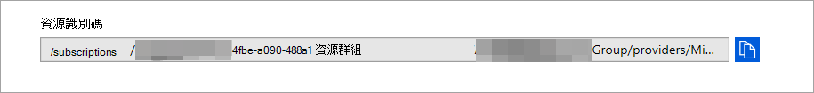

# <a name="configure-microsoft-365-defender-to-stream-advanced-hunting-events-to-your-azure-event-hubs"></a><span data-ttu-id="b3299-104">設定 Microsoft 365 Defender 以將高級搜尋事件傳輸至您的 Azure 事件中心</span><span class="sxs-lookup"><span data-stu-id="b3299-104">Configure Microsoft 365 Defender to stream Advanced Hunting events to your Azure Event Hubs</span></span>

[!INCLUDE [Microsoft 365 Defender rebranding](../../includes/microsoft-defender.md)]


<span data-ttu-id="b3299-105">**適用於：**</span><span class="sxs-lookup"><span data-stu-id="b3299-105">**Applies to:**</span></span>
- [<span data-ttu-id="b3299-106">Microsoft 365 Defender</span><span class="sxs-lookup"><span data-stu-id="b3299-106">Microsoft 365 Defender</span></span>](https://go.microsoft.com/fwlink/?linkid=2118804)

[!include[Prerelease information](../../includes/prerelease.md)]

## <a name="before-you-begin"></a><span data-ttu-id="b3299-107">開始之前：</span><span class="sxs-lookup"><span data-stu-id="b3299-107">Before you begin:</span></span>

1. <span data-ttu-id="b3299-108">在您的租使用者中建立 [事件中樞](/azure/event-hubs/) 。</span><span class="sxs-lookup"><span data-stu-id="b3299-108">Create an [event hub](/azure/event-hubs/) in your tenant.</span></span>

2. <span data-ttu-id="b3299-109">登入您的 [Azure 租](https://ms.portal.azure.com/)使用者，移至訂閱 **> 訂閱 > 資源提供者 > 登錄至 Microsoft。**</span><span class="sxs-lookup"><span data-stu-id="b3299-109">Log in to your [Azure tenant](https://ms.portal.azure.com/), go to **Subscriptions > Your subscription > Resource Providers > Register to Microsoft.Insights**.</span></span>

3. <span data-ttu-id="b3299-110">建立事件中心命名空間，移至 [ **事件中心] > 新增** 並選取適用于預期負載的定價層、輸送量單位和自動陀螺形。</span><span class="sxs-lookup"><span data-stu-id="b3299-110">Create an Event Hub Namespace, go to **Event Hubs > Add** and select the pricing tier, throughput units and Auto-Inflate appropriate for expected load.</span></span> <span data-ttu-id="b3299-111">如需詳細資訊，請參閱[定價-事件中心 |Microsoft Azure](https://azure.microsoft.com/en-us/pricing/details/event-hubs/)。</span><span class="sxs-lookup"><span data-stu-id="b3299-111">For more information, see [Pricing - Event Hubs | Microsoft Azure](https://azure.microsoft.com/en-us/pricing/details/event-hubs/).</span></span>  

4. <span data-ttu-id="b3299-112">在建立事件 hub 命名空間之後，您將需要將應用程式註冊服務主體新增為 Reader，Azure 事件中樞資料收件者，以及將會登入 Microsoft 365 Defender 的使用者 (這也可以在資源群組或訂閱層級) 進行。</span><span class="sxs-lookup"><span data-stu-id="b3299-112">Once the event hub namespace is created you will need to add the App Registration Service Principal as Reader, Azure Event Hubs Data Receiver and the user who will be logging into Microsoft 365 Defender as Contributor (this can also be done at Resource Group or Subscription level).</span></span> <span data-ttu-id="b3299-113">移至 **事件中心命名空間 > 的存取控制 (IAM)** 在 **Role Assignements** 下 > Add 和 verify。</span><span class="sxs-lookup"><span data-stu-id="b3299-113">Go to **Event hubs namespace > Access control (IAM) > Add** and verify under **Role assignements**.</span></span>

## <a name="enable-raw-data-streaming"></a><span data-ttu-id="b3299-114">啟用原始資料資料流程：</span><span class="sxs-lookup"><span data-stu-id="b3299-114">Enable raw data streaming:</span></span>

1. <span data-ttu-id="b3299-115">以 \***全域管理員** _ 或 _ *_安全性管理員_* \* 的身分登入 [Microsoft 365 的 Defender 安全中心](https://security.microsoft.com)。</span><span class="sxs-lookup"><span data-stu-id="b3299-115">Log in to the [Microsoft 365 Defender security center](https://security.microsoft.com) as a ***Global Administrator** _ or _*_Security Administrator_\*\*.</span></span>

2. <span data-ttu-id="b3299-116">移至 [ [資料匯出設定] 頁面](https://security.microsoft.com/settings/mtp_settings/raw_data_export)。</span><span class="sxs-lookup"><span data-stu-id="b3299-116">Go to the [Data export settings page](https://security.microsoft.com/settings/mtp_settings/raw_data_export).</span></span>

3. <span data-ttu-id="b3299-117">按一下 [ **新增**]。</span><span class="sxs-lookup"><span data-stu-id="b3299-117">Click on **Add**.</span></span>

4. <span data-ttu-id="b3299-118">選擇新設定的名稱。</span><span class="sxs-lookup"><span data-stu-id="b3299-118">Choose a name for your new settings.</span></span>

5. <span data-ttu-id="b3299-119">選擇 [ **將事件轉寄到 Azure 事件中心**]。</span><span class="sxs-lookup"><span data-stu-id="b3299-119">Choose **Forward events to Azure Event Hubs**.</span></span>

6. <span data-ttu-id="b3299-120">您可以選取是否要將事件資料匯出到單一事件 hub，或將每個事件資料表匯出至事件 hub 命名空間中的不同的偶數 hub。</span><span class="sxs-lookup"><span data-stu-id="b3299-120">You can select if you want to export the event data to a single event hub, or to export each event table to a different even hub in your event hub namespace.</span></span> 

7. <span data-ttu-id="b3299-121">若要將事件資料匯出到單一事件中樞，請輸入您的 **事件中樞名稱** 和 **事件中樞資源識別碼**。</span><span class="sxs-lookup"><span data-stu-id="b3299-121">To export the event data to a single event hub, Enter your **Event Hub name** and your **Event Hub resource ID**.</span></span>

   <span data-ttu-id="b3299-122">若要取得 **事件中樞資源識別碼**，請移至 azure 的事件中心命名空間頁面上的 [ [azure](https://ms.portal.azure.com/)  >  **屬性**] 索引標籤中 > 複製 [**資源識別碼**] 底下的文字：</span><span class="sxs-lookup"><span data-stu-id="b3299-122">To get your **Event Hubs resource ID**, go to your Azure Event Hubs namespace page on [Azure](https://ms.portal.azure.com/) > **Properties** tab > copy the text under **Resource ID**:</span></span>

   

8. <span data-ttu-id="b3299-124">選擇您要傳輸的事件，然後按一下 [ **儲存**]。</span><span class="sxs-lookup"><span data-stu-id="b3299-124">Choose the events you want to stream and click **Save**.</span></span>

## <a name="the-schema-of-the-events-in-azure-event-hubs"></a><span data-ttu-id="b3299-125">Azure 事件中心內的事件架構：</span><span class="sxs-lookup"><span data-stu-id="b3299-125">The schema of the events in Azure Event Hubs:</span></span>

```
{
    "records": [
                    {
                        "time": "<The time Microsoft 365 Defender received the event>"
                        "tenantId": "<The Id of the tenant that the event belongs to>"
                        "category": "<The Advanced Hunting table name with 'AdvancedHunting-' prefix>"
                        "properties": { <Microsoft 365 Defender Advanced Hunting event as Json> }
                    }
                    ...
                ]
}
```

- <span data-ttu-id="b3299-126">Azure 事件中樞中的每個事件 hub 郵件都包含記錄清單。</span><span class="sxs-lookup"><span data-stu-id="b3299-126">Each event hub message in Azure Event Hubs contains list of records.</span></span>

- <span data-ttu-id="b3299-127">每筆記錄都包含事件名稱、Microsoft 365 Defender 接收事件的時間、租使用者所屬的租使用者 (您只會從承租人) 中取得事件，而在名為 "**properties**" 的屬性中則會以 JSON 格式取得事件。</span><span class="sxs-lookup"><span data-stu-id="b3299-127">Each record contains the event name, the time Microsoft 365 Defender received the event, the tenant it belongs (you will only get events from your tenant), and the event in JSON format in a property called "**properties**".</span></span>

- <span data-ttu-id="b3299-128">如需 Microsoft 365 的 Defender 事件架構的詳細資訊，請參閱[高級搜尋一覽](../defender/advanced-hunting-overview.md)。</span><span class="sxs-lookup"><span data-stu-id="b3299-128">For more information about the schema of Microsoft 365 Defender events, see [Advanced Hunting overview](../defender/advanced-hunting-overview.md).</span></span>

- <span data-ttu-id="b3299-129">在 [高級搜尋] 中， **DeviceInfo** 表格具有一個名為 **MachineGroup** 的欄，其中含有裝置的群組。</span><span class="sxs-lookup"><span data-stu-id="b3299-129">In Advanced Hunting, the **DeviceInfo** table has a column named **MachineGroup** which contains the group of the device.</span></span> <span data-ttu-id="b3299-130">在這裡，每個事件會同時使用此資料行來修飾。</span><span class="sxs-lookup"><span data-stu-id="b3299-130">Here every event will be decorated with this column as well.</span></span> 

9. <span data-ttu-id="b3299-131">若要將每個事件表格匯出至不同的事件中樞，只要將 **事件 hub 名稱** 保留空白，Microsoft 365 Defender 也會執行其他作業。</span><span class="sxs-lookup"><span data-stu-id="b3299-131">To export each event table to a different event hub, simply leave the **Event hub name** empty, and Microsoft 365 Defender will do the rest.</span></span>


## <a name="data-types-mapping"></a><span data-ttu-id="b3299-132">資料類型對應：</span><span class="sxs-lookup"><span data-stu-id="b3299-132">Data types mapping:</span></span>

<span data-ttu-id="b3299-133">若要取得事件屬性的資料類型，請執行下列動作：</span><span class="sxs-lookup"><span data-stu-id="b3299-133">To get the data types for event properties do the following:</span></span>

1. <span data-ttu-id="b3299-134">登入[Microsoft 365 的安全性中心](https://security.microsoft.com)，然後移至 [[高級搜尋] 頁面](https://security.microsoft.com/hunting-package)。</span><span class="sxs-lookup"><span data-stu-id="b3299-134">Log in to [Microsoft 365 security center](https://security.microsoft.com) and go to [Advanced Hunting page](https://security.microsoft.com/hunting-package).</span></span>

2. <span data-ttu-id="b3299-135">執行下列查詢以取得每個事件的資料類型對應：</span><span class="sxs-lookup"><span data-stu-id="b3299-135">Run the following query to get the data types mapping for each event:</span></span>
 
   ```
   {EventType}
   | getschema
   | project ColumnName, ColumnType 
   ```

- <span data-ttu-id="b3299-136">以下是 Device Info 事件的範例：</span><span class="sxs-lookup"><span data-stu-id="b3299-136">Here is an example for Device Info event:</span></span> 

  

## <a name="related-topics"></a><span data-ttu-id="b3299-138">相關主題</span><span class="sxs-lookup"><span data-stu-id="b3299-138">Related topics</span></span>
- [<span data-ttu-id="b3299-139">高級搜尋一覽</span><span class="sxs-lookup"><span data-stu-id="b3299-139">Overview of Advanced Hunting</span></span>](../defender/advanced-hunting-overview.md)
- [<span data-ttu-id="b3299-140">Microsoft 365Defender 資料流程 API</span><span class="sxs-lookup"><span data-stu-id="b3299-140">Microsoft 365 Defender streaming API</span></span>](raw-data-export.md)
- [<span data-ttu-id="b3299-141">將 Microsoft 365 的 Defender 事件資料流程至您的 Azure 儲存體帳戶</span><span class="sxs-lookup"><span data-stu-id="b3299-141">Stream Microsoft 365 Defender events to your Azure storage account</span></span>](raw-data-export-storage.md)
- [<span data-ttu-id="b3299-142">Azure 事件中心檔</span><span class="sxs-lookup"><span data-stu-id="b3299-142">Azure Event Hubs documentation</span></span>](/azure/event-hubs/)
- [<span data-ttu-id="b3299-143">疑難排解連線問題-Azure 事件中樞</span><span class="sxs-lookup"><span data-stu-id="b3299-143">Troubleshoot connectivity issues - Azure Event Hubs</span></span>](/azure/event-hubs/troubleshooting-guide)
